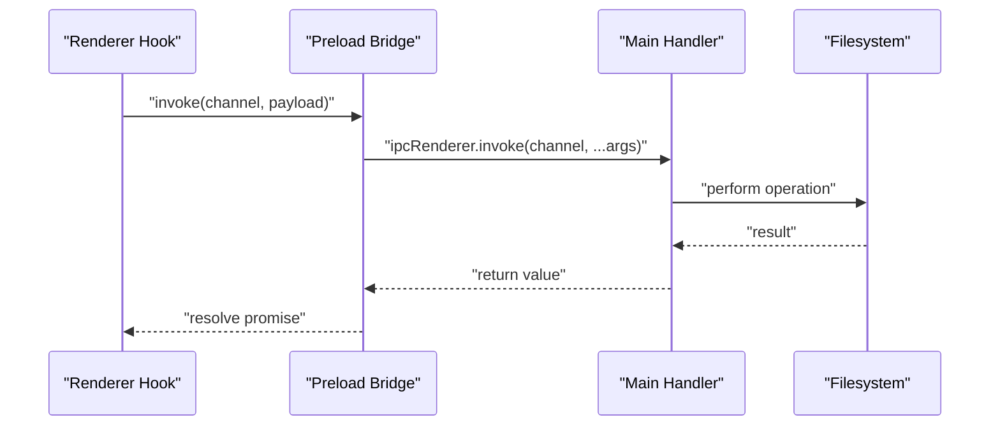
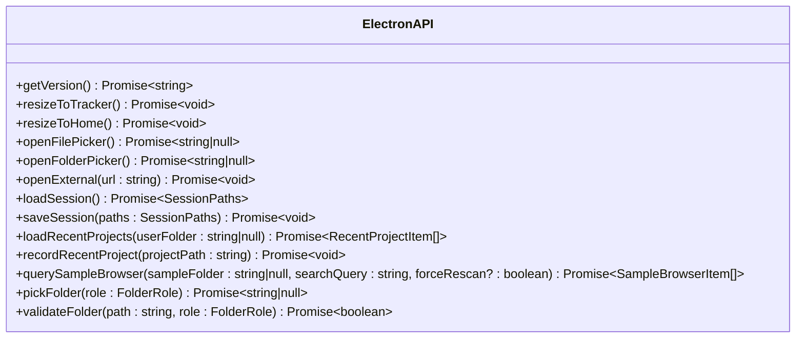
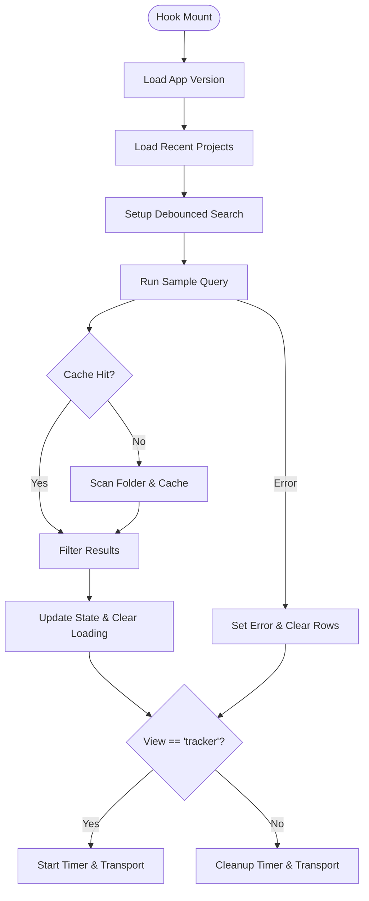
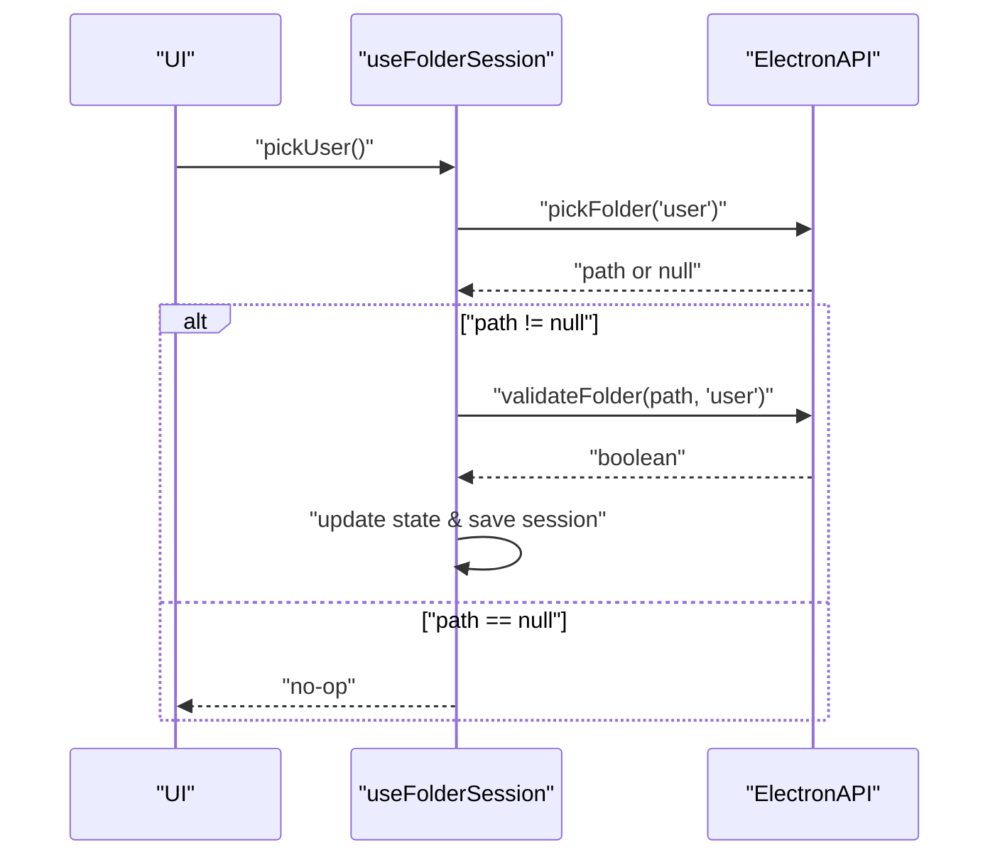
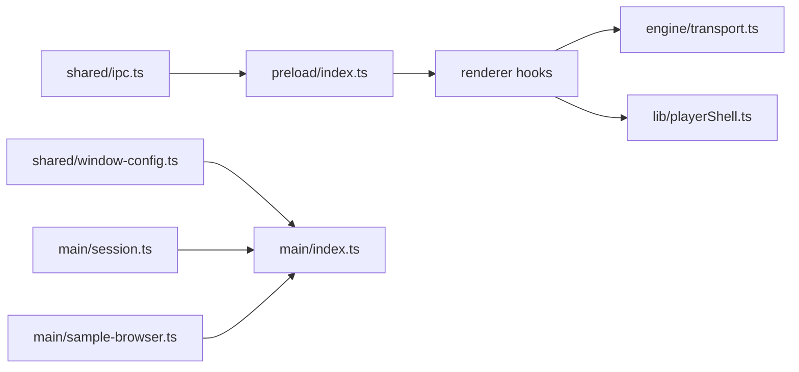

# API Reference

<cite>
**Referenced Files in This Document**
- [ipc.ts](file://src/shared/ipc.ts)
- [preload/index.ts](file://src/preload/index.ts)
- [main/index.ts](file://src/main/index.ts)
- [session.ts](file://src/main/session.ts)
- [sample-browser.ts](file://src/main/sample-browser.ts)
- [window-config.ts](file://src/shared/window-config.ts)
- [electron.d.ts](file://src/renderer/src/electron.d.ts)
- [useAppState.ts](file://src/renderer/src/hooks/useAppState.ts)
- [useFolderSession.ts](file://src/renderer/src/hooks/useFolderSession.ts)
- [transport.ts](file://src/renderer/src/engine/transport.ts)
- [playerShell.ts](file://src/renderer/src/lib/playerShell.ts)
- [package.json](file://package.json)
</cite>

## Table of Contents
1. [Introduction](#introduction)
2. [Project Structure](#project-structure)
3. [Core Components](#core-components)
4. [Architecture Overview](#architecture-overview)
5. [Detailed Component Analysis](#detailed-component-analysis)
6. [Dependency Analysis](#dependency-analysis)
7. [Performance Considerations](#performance-considerations)
8. [Troubleshooting Guide](#troubleshooting-guide)
9. [Conclusion](#conclusion)
10. [Appendices](#appendices)

## Introduction
This document provides a comprehensive API reference for MixJam Electron’s public interfaces and contracts. It covers:
- IPC channel definitions and their parameters, return values, and usage
- Electron API wrapper functions exposed to the renderer
- Type definitions and interface contracts
- React hooks API and component state management contracts
- Error handling patterns, validation rules, and exception scenarios
- Practical usage examples, integration guidelines, and performance considerations
- Versioning, backward compatibility, and deprecation policies

## Project Structure
The project is organized into three primary layers:
- Shared contracts and types used by both main and renderer processes
- Main process handlers for IPC channels and filesystem operations
- Renderer process wrappers (React hooks and UI logic) that consume the Electron API

```mermaid
graph TB
subgraph "Shared Layer"
IPC["IPC Contracts<br/>IPC_CHANNELS, Types"]
WinCfg["Window Config<br/>Sizes, Options"]
end
subgraph "Main Process"
MainIdx["Main Index<br/>IPC Handlers"]
Session["Session Manager<br/>Folders, Projects"]
Sample["Sample Browser<br/>Scan & Filter"]
end
subgraph "Preload"
Preload["Preload Bridge<br/>Expose ElectronAPI"]
end
subgraph "Renderer"
Hooks["React Hooks<br/>useAppState, useFolderSession"]
Engine["Engine<br/>Transport"]
Player["Player Shell<br/>Lanes & Clips"]
end
IPC --> MainIdx
WinCfg --> MainIdx
MainIdx --> Session
MainIdx --> Sample
MainIdx --> Preload
Preload --> Hooks
Hooks --> Engine
Hooks --> Player
```

**Diagram sources**
- [ipc.ts:1-59](file://src/shared/ipc.ts#L1-L59)
- [window-config.ts:1-54](file://src/shared/window-config.ts#L1-L54)
- [main/index.ts:1-170](file://src/main/index.ts#L1-L170)
- [session.ts:1-265](file://src/main/session.ts#L1-L265)
- [sample-browser.ts:1-113](file://src/main/sample-browser.ts#L1-L113)
- [preload/index.ts:1-29](file://src/preload/index.ts#L1-L29)
- [useAppState.ts:1-295](file://src/renderer/src/hooks/useAppState.ts#L1-L295)
- [useFolderSession.ts:1-106](file://src/renderer/src/hooks/useFolderSession.ts#L1-L106)
- [transport.ts:1-118](file://src/renderer/src/engine/transport.ts#L1-L118)
- [playerShell.ts:1-132](file://src/renderer/src/lib/playerShell.ts#L1-L132)

**Section sources**
- [ipc.ts:1-59](file://src/shared/ipc.ts#L1-L59)
- [window-config.ts:1-54](file://src/shared/window-config.ts#L1-L54)
- [main/index.ts:1-170](file://src/main/index.ts#L1-L170)
- [preload/index.ts:1-29](file://src/preload/index.ts#L1-L29)
- [useAppState.ts:1-295](file://src/renderer/src/hooks/useAppState.ts#L1-L295)
- [useFolderSession.ts:1-106](file://src/renderer/src/hooks/useFolderSession.ts#L1-L106)
- [transport.ts:1-118](file://src/renderer/src/engine/transport.ts#L1-L118)
- [playerShell.ts:1-132](file://src/renderer/src/lib/playerShell.ts#L1-L132)

## Core Components
This section documents the public API contracts and their usage.

- IPC Channels
  - Channel identifiers and their payloads are defined centrally and consumed by both main and renderer processes.
  - See [IPC_CHANNELS:1-15](file://src/shared/ipc.ts#L1-L15) for the channel names.

- Electron API Wrapper
  - Exposed in the renderer via preload bridge as a strongly-typed interface.
  - See [ElectronAPI:40-58](file://src/shared/ipc.ts#L40-L58) and [preload/index.ts:1-29](file://src/preload/index.ts#L1-L29).

- Type Definitions
  - Shared types for folders, sessions, recent projects, and sample browser items.
  - See [SessionPaths:19-22](file://src/shared/ipc.ts#L19-L22), [RecentProjectItem:24-28](file://src/shared/ipc.ts#L24-L28), [SampleBrowserItem:30-38](file://src/shared/ipc.ts#L30-L38), [FolderRole](file://src/shared/ipc.ts#L17).

- Window Configuration
  - Constants and helpers for window sizing and options.
  - See [window-config.ts:1-54](file://src/shared/window-config.ts#L1-L54).

**Section sources**
- [ipc.ts:1-59](file://src/shared/ipc.ts#L1-L59)
- [preload/index.ts:1-29](file://src/preload/index.ts#L1-L29)
- [window-config.ts:1-54](file://src/shared/window-config.ts#L1-L54)

## Architecture Overview
The renderer invokes ElectronAPI methods, which are bridged via preload to main-process IPC handlers. Handlers perform filesystem operations and return structured data to the renderer.



**Diagram sources**
- [preload/index.ts:1-29](file://src/preload/index.ts#L1-L29)
- [main/index.ts:75-169](file://src/main/index.ts#L75-L169)

## Detailed Component Analysis

### IPC Channels and ElectronAPI

- Channel: app:get-version
  - Purpose: Retrieve application version.
  - Parameters: None.
  - Returns: Promise<string>.
  - Usage: Call [getVersion:40-41](file://src/shared/ipc.ts#L40-L41) from renderer.
  - Implementation: [main/index.ts](file://src/main/index.ts#L75).

- Channel: window:resize-tracker
  - Purpose: Resize main window to tracker layout.
  - Parameters: None.
  - Returns: Promise<void>.
  - Usage: Call [resizeToTracker:40-43](file://src/shared/ipc.ts#L40-L43) from renderer.
  - Implementation: [main/index.ts:77-80](file://src/main/index.ts#L77-L80), [window-config.ts:39-44](file://src/shared/window-config.ts#L39-L44).

- Channel: window:resize-home
  - Purpose: Resize main window to home layout.
  - Parameters: None.
  - Returns: Promise<void>.
  - Usage: Call [resizeToHome:40-43](file://src/shared/ipc.ts#L40-L43) from renderer.
  - Implementation: [main/index.ts:82-85](file://src/main/index.ts#L82-L85), [window-config.ts:46-54](file://src/shared/window-config.ts#L46-L54).

- Channel: dialog:open-file
  - Purpose: Open file picker dialog.
  - Parameters: None.
  - Returns: Promise<string | null>.
  - Usage: Call [openFilePicker:40-45](file://src/shared/ipc.ts#L40-L45) from renderer.
  - Implementation: [main/index.ts:87-94](file://src/main/index.ts#L87-L94).

- Channel: dialog:open-folder
  - Purpose: Open folder picker dialog.
  - Parameters: None.
  - Returns: Promise<string | null>.
  - Usage: Call [openFolderPicker:40-45](file://src/shared/ipc.ts#L40-L45) from renderer.
  - Implementation: [main/index.ts:96-102](file://src/main/index.ts#L96-L102).

- Channel: shell:open-url
  - Purpose: Open external URL safely.
  - Parameters: url: string.
  - Returns: Promise<void>.
  - Usage: Call [openExternal:40-46](file://src/shared/ipc.ts#L40-L46) from renderer.
  - Validation: Only HTTPS URLs to allowed hosts.
  - Implementation: [main/index.ts:155-169](file://src/main/index.ts#L155-L169).

- Channel: session:load
  - Purpose: Load persisted session paths.
  - Parameters: None.
  - Returns: Promise<SessionPaths>.
  - Usage: Call [loadSession:40-47](file://src/shared/ipc.ts#L40-L47) from renderer.
  - Implementation: [main/index.ts:104-107](file://src/main/index.ts#L104-L107), [session.ts:67-77](file://src/main/session.ts#L67-L77).

- Channel: session:save
  - Purpose: Save session paths and write session config.
  - Parameters: paths: SessionPaths.
  - Returns: Promise<void>.
  - Usage: Call [saveSession:40-48](file://src/shared/ipc.ts#L40-L48) from renderer.
  - Implementation: [main/index.ts:109-117](file://src/main/index.ts#L109-L117), [session.ts:75-77](file://src/main/session.ts#L75-L77), [session.ts:256-264](file://src/main/session.ts#L256-L264).

- Channel: recent-projects:list
  - Purpose: List recent projects, optionally merged with discovered projects under user folder.
  - Parameters: userFolder: string | null.
  - Returns: Promise<RecentProjectItem[]>.
  - Usage: Call [loadRecentProjects:40-49](file://src/shared/ipc.ts#L40-L49) from renderer.
  - Implementation: [main/index.ts:119-122](file://src/main/index.ts#L119-L122), [session.ts:213-233](file://src/main/session.ts#L213-L233).

- Channel: recent-projects:record
  - Purpose: Record a project as recently opened.
  - Parameters: projectPath: string.
  - Returns: Promise<void>.
  - Usage: Call [recordRecentProject:40-50](file://src/shared/ipc.ts#L40-L50) from renderer.
  - Implementation: [main/index.ts:124-127](file://src/main/index.ts#L124-L127), [session.ts:202-211](file://src/main/session.ts#L202-L211).

- Channel: sample-browser:query
  - Purpose: Query and filter samples in the sample folder with caching.
  - Parameters: sampleFolder: string | null, searchQuery: string, forceRescan?: boolean.
  - Returns: Promise<SampleBrowserItem[]>.
  - Usage: Call [querySampleBrowser:40-55](file://src/shared/ipc.ts#L40-L55) from renderer.
  - Implementation: [main/index.ts:129-138](file://src/main/index.ts#L129-L138), [sample-browser.ts:98-112](file://src/main/sample-browser.ts#L98-L112).

- Channel: folder:pick
  - Purpose: Pick a folder for a given role (user or sample).
  - Parameters: role: FolderRole.
  - Returns: Promise<string | null>.
  - Usage: Call [pickFolder:40-56](file://src/shared/ipc.ts#L40-L56) from renderer.
  - Implementation: [main/index.ts:140-148](file://src/main/index.ts#L140-L148).

- Channel: folder:validate
  - Purpose: Validate a folder for a given role.
  - Parameters: path: string, role: FolderRole.
  - Returns: Promise<boolean>.
  - Usage: Call [validateFolder:40-57](file://src/shared/ipc.ts#L40-L57) from renderer.
  - Implementation: [main/index.ts:150-153](file://src/main/index.ts#L150-L153), [session.ts:52-57](file://src/main/session.ts#L52-L57).

**Section sources**
- [ipc.ts:1-59](file://src/shared/ipc.ts#L1-L59)
- [main/index.ts:75-169](file://src/main/index.ts#L75-L169)
- [session.ts:52-57](file://src/main/session.ts#L52-L57)
- [session.ts:67-77](file://src/main/session.ts#L67-L77)
- [session.ts:202-211](file://src/main/session.ts#L202-L211)
- [session.ts:213-233](file://src/main/session.ts#L213-L233)
- [session.ts:256-264](file://src/main/session.ts#L256-L264)
- [sample-browser.ts:98-112](file://src/main/sample-browser.ts#L98-L112)

### Electron API Wrapper Functions
- Exposed in preload as ElectronAPI and typed globally for renderer.
- See [preload/index.ts:1-29](file://src/preload/index.ts#L1-L29) and [electron.d.ts:1-10](file://src/renderer/src/electron.d.ts#L1-L10).



**Diagram sources**
- [ipc.ts:40-58](file://src/shared/ipc.ts#L40-L58)
- [preload/index.ts:4-26](file://src/preload/index.ts#L4-L26)

**Section sources**
- [preload/index.ts:1-29](file://src/preload/index.ts#L1-L29)
- [electron.d.ts:1-10](file://src/renderer/src/electron.d.ts#L1-L10)

### React Hooks API

#### useAppState
- Purpose: Manage application-wide state, including view mode, version, recent projects, sample browser, transport, and lanes.
- Dependencies: ElectronAPI, Transport, playerShell utilities.
- Key behaviors:
  - Loads app version on mount.
  - Loads recent projects for a user folder.
  - Debounced sample browser search with cancellation.
  - Transport lifecycle and timer management.
  - Navigation between home and tracker views.

- Public API surface:
  - State and actions:
    - view: 'home' | 'tracker'
    - version: string
    - timerText: string
    - recentProjects: RecentProjectItem[]
    - sampleRows: SampleBrowserItem[]
    - sampleSearchQuery: string
    - sampleBrowserLoading: boolean
    - sampleBrowserError: string | null
    - selectedSampleDetail: FooterSampleDetail | null
    - lanes: LaneState[]
    - transportState: TransportState
  - Actions:
    - goToTracker(), goToHome()
    - handleLoadMixJam(), openSettingsFolder(), openRepo()
    - rescanSampleBrowser()
    - placeSampleOnLane(laneIndex, startTick)
    - toggleLaneMute(laneIndex), toggleLaneSolo(laneIndex)
    - anyLaneSoloed(), laneShouldDim(lane)
    - transportPlay(), transportPause(), transportStop(), transportSkipBack()

- Usage examples:
  - Initialize with ElectronAPI and folder contexts.
  - Bind UI controls to navigation and transport actions.
  - Use sampleSearchQuery to drive debounced queries.

- Error handling:
  - Catches errors when loading version or recent projects.
  - Sets sampleBrowserError and clears loading state on failure.
  - Ignores stale sample query results via sequence counter.

- Performance considerations:
  - Debounced search with 150 ms delay.
  - Stale query suppression to prevent race conditions.
  - Transport uses scheduler abstraction for testability.

- References:
  - [useAppState.ts:1-295](file://src/renderer/src/hooks/useAppState.ts#L1-L295)
  - [transport.ts:1-118](file://src/renderer/src/engine/transport.ts#L1-L118)
  - [playerShell.ts:1-132](file://src/renderer/src/lib/playerShell.ts#L1-L132)



**Diagram sources**
- [useAppState.ts:49-148](file://src/renderer/src/hooks/useAppState.ts#L49-L148)
- [useAppState.ts:158-187](file://src/renderer/src/hooks/useAppState.ts#L158-L187)
- [sample-browser.ts:98-112](file://src/main/sample-browser.ts#L98-L112)

**Section sources**
- [useAppState.ts:1-295](file://src/renderer/src/hooks/useAppState.ts#L1-L295)
- [transport.ts:1-118](file://src/renderer/src/engine/transport.ts#L1-L118)
- [playerShell.ts:1-132](file://src/renderer/src/lib/playerShell.ts#L1-L132)

#### useFolderSession
- Purpose: Manage user and sample folder selection, validation, persistence, and restoration.
- Public API surface:
  - userFolder: FolderView
  - sampleFolder: FolderView
  - canStart: boolean
  - pickUser(): Promise<void>
  - pickSample(): Promise<void>

- FolderView statuses:
  - empty: No folder set.
  - set: Folder validated and saved.
  - pick-error: Folder picked but failed validation.
  - restore-error: Previously saved folder is invalid.

- Workflow:
  - Restore saved session on mount.
  - Pick folder via dialog, validate, update state, and persist if valid.
  - Expose canStart to gate navigation to tracker.

- References:
  - [useFolderSession.ts:1-106](file://src/renderer/src/hooks/useFolderSession.ts#L1-L106)



**Diagram sources**
- [useFolderSession.ts:59-105](file://src/renderer/src/hooks/useFolderSession.ts#L59-L105)
- [ipc.ts:40-57](file://src/shared/ipc.ts#L40-L57)

**Section sources**
- [useFolderSession.ts:1-106](file://src/renderer/src/hooks/useFolderSession.ts#L1-L106)

### Transport Engine
- Purpose: Provide a deterministic timeline for sequencing musical events.
- Interfaces:
  - TransportState: 'stopped' | 'playing' | 'paused'
  - Transport: play(), pause(), stop(), skipBack(), setBpm(), setOnTick(), destroy()
  - TransportScheduler: setInterval/clearInterval abstractions for testing

- Behavior:
  - Tick interval computed from BPM.
  - Timer cleared and restarted when BPM changes while playing.
  - Tick callback receives current tick position.

- References:
  - [transport.ts:1-118](file://src/renderer/src/engine/transport.ts#L1-L118)

**Section sources**
- [transport.ts:1-118](file://src/renderer/src/engine/transport.ts#L1-L118)

### Player Shell Utilities
- Purpose: Manage lanes, clips, muting/soloing, and dimming logic.
- Interfaces:
  - LaneState, LaneClip, FooterSampleDetail
  - Functions: createDefaultLanes(), placeClipOnLane(), toggleLaneMute(), toggleLaneSolo(), anyLaneSoloed(), laneShouldDim()

- Behavior:
  - Clip placement trims overlapping clips to preserve audio continuity.
  - Solo toggles enforce mutual exclusivity among soloed lanes.

- References:
  - [playerShell.ts:1-132](file://src/renderer/src/lib/playerShell.ts#L1-L132)

**Section sources**
- [playerShell.ts:1-132](file://src/renderer/src/lib/playerShell.ts#L1-L132)

## Dependency Analysis
- Preload depends on shared IPC contract and exposes ElectronAPI to renderer.
- Main process handlers depend on window-config, session, and sample-browser modules.
- Renderer hooks depend on ElectronAPI, Transport, and playerShell utilities.



**Diagram sources**
- [ipc.ts:1-59](file://src/shared/ipc.ts#L1-L59)
- [preload/index.ts:1-29](file://src/preload/index.ts#L1-L29)
- [window-config.ts:1-54](file://src/shared/window-config.ts#L1-L54)
- [main/index.ts:1-170](file://src/main/index.ts#L1-L170)
- [session.ts:1-265](file://src/main/session.ts#L1-L265)
- [sample-browser.ts:1-113](file://src/main/sample-browser.ts#L1-L113)
- [useAppState.ts:1-295](file://src/renderer/src/hooks/useAppState.ts#L1-L295)
- [transport.ts:1-118](file://src/renderer/src/engine/transport.ts#L1-L118)
- [playerShell.ts:1-132](file://src/renderer/src/lib/playerShell.ts#L1-L132)

**Section sources**
- [ipc.ts:1-59](file://src/shared/ipc.ts#L1-L59)
- [preload/index.ts:1-29](file://src/preload/index.ts#L1-L29)
- [main/index.ts:1-170](file://src/main/index.ts#L1-L170)
- [session.ts:1-265](file://src/main/session.ts#L1-L265)
- [sample-browser.ts:1-113](file://src/main/sample-browser.ts#L1-L113)
- [useAppState.ts:1-295](file://src/renderer/src/hooks/useAppState.ts#L1-L295)
- [transport.ts:1-118](file://src/renderer/src/engine/transport.ts#L1-L118)
- [playerShell.ts:1-132](file://src/renderer/src/lib/playerShell.ts#L1-L132)

## Performance Considerations
- Debounced sample search: A 150 ms debounce prevents excessive IPC calls during typing.
- Stale query suppression: Sequence counter ensures only the latest query updates state.
- Transport scheduling: Uses scheduler abstraction to minimize timers and enable deterministic testing.
- Window resizing: Order of setSize and setResizable is optimized for platform-specific behavior.
- Filesystem checks: Validation avoids unnecessary writes by probing directory writability.

[No sources needed since this section provides general guidance]

## Troubleshooting Guide
- External URL opening fails:
  - Only HTTPS URLs are allowed, and host must be in the allowed set.
  - See [shell:open-url handler:155-169](file://src/main/index.ts#L155-L169).

- Sample browser returns empty:
  - Ensure sampleFolder is set and valid; confirm folder permissions and presence of supported audio files.
  - Use forceRescan to bypass cache if needed.
  - See [sample-browser:query handler:129-138](file://src/main/index.ts#L129-L138) and [querySampleBrowser:98-112](file://src/main/sample-browser.ts#L98-L112).

- Session save does not persist:
  - Verify both userFolder and sampleFolder are set; session config is written only when both are present.
  - See [session:save handler:109-117](file://src/main/index.ts#L109-L117) and [writeSessionConfig:256-264](file://src/main/session.ts#L256-L264).

- Transport not advancing ticks:
  - Confirm BPM is set and transport is in 'playing' state; timer is restarted when BPM changes.
  - See [transport.ts:39-116](file://src/renderer/src/engine/transport.ts#L39-L116).

**Section sources**
- [main/index.ts:129-138](file://src/main/index.ts#L129-L138)
- [main/index.ts:155-169](file://src/main/index.ts#L155-L169)
- [main/index.ts:109-117](file://src/main/index.ts#L109-L117)
- [session.ts:256-264](file://src/main/session.ts#L256-L264)
- [transport.ts:39-116](file://src/renderer/src/engine/transport.ts#L39-L116)

## Conclusion
MixJam Electron’s API surface is intentionally minimal and strongly typed:
- IPC channels encapsulate all cross-process communication.
- ElectronAPI provides a clean, typed façade for renderer-side operations.
- React hooks orchestrate state and integrate with Electron and internal engines.
- Robust validation and error handling ensure reliability across platforms.

[No sources needed since this section summarizes without analyzing specific files]

## Appendices

### Versioning, Backward Compatibility, and Deprecation Policies
- Application version:
  - Retrieved via app:get-version and exposed to renderer.
  - See [app:get-version handler](file://src/main/index.ts#L75) and [getVersion:40-41](file://src/shared/ipc.ts#L40-L41).

- Session configuration:
  - A session config file is written alongside the user folder when both session paths are set.
  - See [writeSessionConfig:256-264](file://src/main/session.ts#L256-L264).

- Backward compatibility:
  - IPC channel names and ElectronAPI signatures are defined in shared contracts and must remain stable.
  - Changes to payload shapes require careful migration and tests.

- Deprecation:
  - No deprecations are currently defined in the codebase.
  - Follow semantic versioning and document breaking changes in release notes.

**Section sources**
- [main/index.ts:75](file://src/main/index.ts#L75)
- [ipc.ts:40-41](file://src/shared/ipc.ts#L40-L41)
- [session.ts:256-264](file://src/main/session.ts#L256-L264)
- [package.json:1-50](file://package.json#L1-L50)