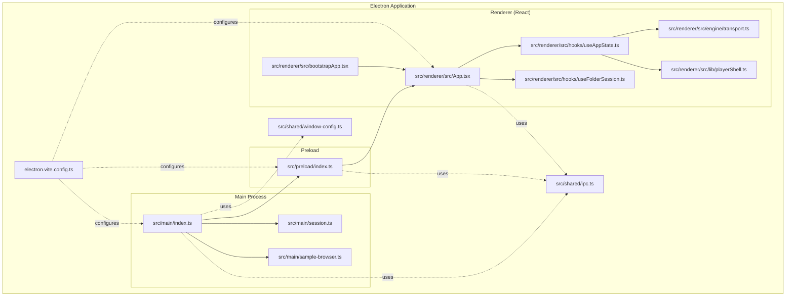
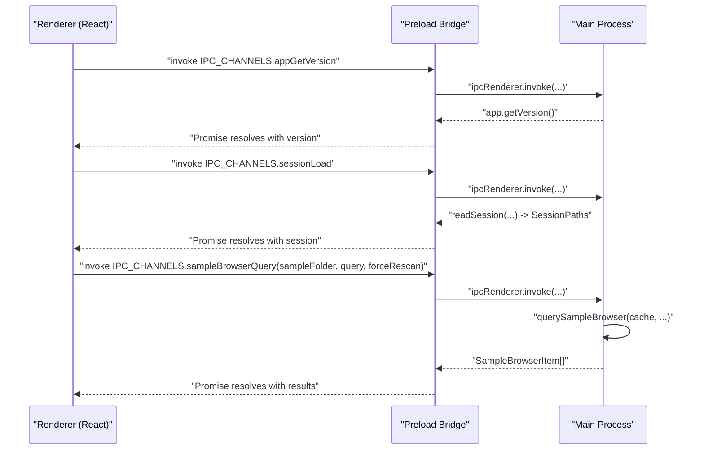
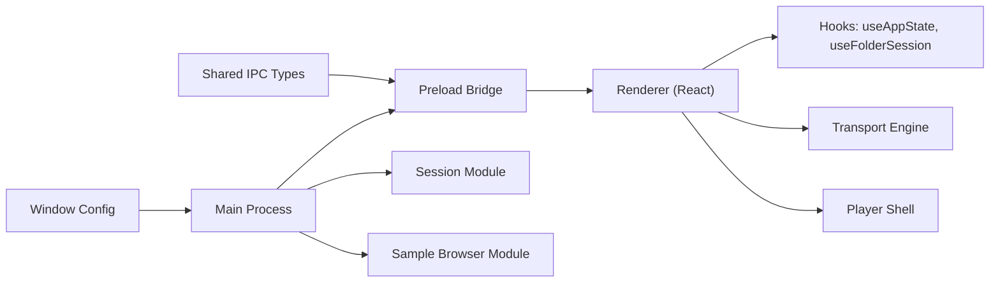

# Architecture Overview

<cite>
**Referenced Files in This Document**
- [src/main/index.ts](file://src/main/index.ts)
- [src/preload/index.ts](file://src/preload/index.ts)
- [src/shared/ipc.ts](file://src/shared/ipc.ts)
- [src/shared/window-config.ts](file://src/shared/window-config.ts)
- [src/renderer/src/main.tsx](file://src/renderer/src/main.tsx)
- [src/renderer/src/bootstrapApp.tsx](file://src/renderer/src/bootstrapApp.tsx)
- [src/renderer/src/App.tsx](file://src/renderer/src/App.tsx)
- [src/renderer/src/hooks/useAppState.ts](file://src/renderer/src/hooks/useAppState.ts)
- [src/renderer/src/hooks/useFolderSession.ts](file://src/renderer/src/hooks/useFolderSession.ts)
- [src/main/session.ts](file://src/main/session.ts)
- [src/main/sample-browser.ts](file://src/main/sample-browser.ts)
- [src/renderer/src/engine/transport.ts](file://src/renderer/src/engine/transport.ts)
- [src/renderer/src/lib/playerShell.ts](file://src/renderer/src/lib/playerShell.ts)
- [electron.vite.config.ts](file://electron.vite.config.ts)
- [package.json](file://package.json)
- [docs/architecture.md](file://docs/architecture.md)
</cite>

## Table of Contents
1. [Introduction](#introduction)
2. [Project Structure](#project-structure)
3. [Core Components](#core-components)
4. [Architecture Overview](#architecture-overview)
5. [Detailed Component Analysis](#detailed-component-analysis)
6. [Dependency Analysis](#dependency-analysis)
7. [Performance Considerations](#performance-considerations)
8. [Troubleshooting Guide](#troubleshooting-guide)
9. [Conclusion](#conclusion)

## Introduction
This document describes the system architecture of MixJam Electron, focusing on the Electron dual-process model, IPC communication patterns, and the React-based renderer integrated with the desktop environment. It explains how the main process (Node.js) handles file system operations, session persistence, and the sample browser index, while the renderer (React) manages UI, theming, and the tracker/player engine. Security is enforced through context isolation, a typed preload bridge, and restricted window preferences.

## Project Structure
The project is organized into three primary Electron process areas plus shared contracts and documentation:
- Main process: application lifecycle, dialogs, file system, session management, and sample browser scanning
- Preload script: secure, typed API exposed to the renderer via contextBridge
- Renderer (React): UI, hooks, theming, and the tracker engine
- Shared contracts: IPC channel names and TypeScript interfaces
- Build configuration: Electron-Vite setup for main, preload, and renderer builds

**Diagram sources**
- [src/main/index.ts:1-170](file://src/main/index.ts#L1-L170)
- [src/preload/index.ts:1-29](file://src/preload/index.ts#L1-L29)
- [src/shared/ipc.ts:1-59](file://src/shared/ipc.ts#L1-L59)
- [src/shared/window-config.ts:1-54](file://src/shared/window-config.ts#L1-L54)
- [src/renderer/src/bootstrapApp.tsx:1-19](file://src/renderer/src/bootstrapApp.tsx#L1-L19)
- [src/renderer/src/App.tsx:1-108](file://src/renderer/src/App.tsx#L1-L108)
- [src/renderer/src/hooks/useAppState.ts:1-295](file://src/renderer/src/hooks/useAppState.ts#L1-L295)
- [src/renderer/src/hooks/useFolderSession.ts:1-106](file://src/renderer/src/hooks/useFolderSession.ts#L1-L106)
- [src/main/session.ts:1-265](file://src/main/session.ts#L1-L265)
- [src/main/sample-browser.ts:1-113](file://src/main/sample-browser.ts#L1-L113)
- [electron.vite.config.ts:1-15](file://electron.vite.config.ts#L1-L15)

**Section sources**
- [src/main/index.ts:1-170](file://src/main/index.ts#L1-L170)
- [src/preload/index.ts:1-29](file://src/preload/index.ts#L1-L29)
- [src/shared/ipc.ts:1-59](file://src/shared/ipc.ts#L1-L59)
- [src/shared/window-config.ts:1-54](file://src/shared/window-config.ts#L1-L54)
- [electron.vite.config.ts:1-15](file://electron.vite.config.ts#L1-L15)

## Core Components
- Electron main process: creates the BrowserWindow, loads preload, exposes IPC handlers for dialogs, window resizing, session persistence, recent projects, and sample browser queries. It also validates folders and opens external URLs with strict checks.
- Preload script: defines a typed ElectronAPI surface and exposes it to the renderer via contextBridge, ensuring context isolation and preventing direct Node.js access.
- Shared IPC contract: centralizes IPC channel names and TypeScript types for ElectronAPI, session paths, recent project items, and sample browser items.
- Renderer (React): mounts the app, orchestrates views (home/tracker), manages state via hooks, and integrates the tracker engine and player shell utilities.
- Window configuration: sets fixed sizes, disables maximize/resizable for home, enables them for tracker, and configures security flags (contextIsolation, nodeIntegration off, sandbox).
- Build configuration: separates main, preload, and renderer builds with appropriate plugins.

**Section sources**
- [src/main/index.ts:38-56](file://src/main/index.ts#L38-L56)
- [src/preload/index.ts:4-28](file://src/preload/index.ts#L4-L28)
- [src/shared/ipc.ts:1-59](file://src/shared/ipc.ts#L1-L59)
- [src/renderer/src/bootstrapApp.tsx:12-19](file://src/renderer/src/bootstrapApp.tsx#L12-L19)
- [src/renderer/src/App.tsx:9-46](file://src/renderer/src/App.tsx#L9-L46)
- [src/shared/window-config.ts:22-37](file://src/shared/window-config.ts#L22-L37)
- [electron.vite.config.ts:4-14](file://electron.vite.config.ts#L4-L14)

## Architecture Overview
MixJam Electron follows a strict Electron dual-process model:
- Main process (Node.js): file system operations, dialogs, session persistence, recent projects, and sample browser scanning. It enforces security via contextIsolation and a typed preload bridge.
- Renderer (React): UI rendering, theming, user interactions, and the tracker engine. It communicates with the main process exclusively through IPC channels exposed by the preload bridge.
- IPC channels: a centralized contract defines channel names and argument/result shapes, enabling strong typing across processes.
- Desktop integration: the app uses native dialogs, opens external links with allowed hosts, and persists session data to user data locations.

**Diagram sources**
- [src/preload/index.ts:4-28](file://src/preload/index.ts#L4-L28)
- [src/main/index.ts:104-138](file://src/main/index.ts#L104-L138)
- [src/main/sample-browser.ts:98-113](file://src/main/sample-browser.ts#L98-L113)
- [src/shared/ipc.ts:1-15](file://src/shared/ipc.ts#L1-L15)

**Section sources**
- [src/main/index.ts:75-169](file://src/main/index.ts#L75-L169)
- [src/preload/index.ts:4-28](file://src/preload/index.ts#L4-L28)
- [src/shared/ipc.ts:1-59](file://src/shared/ipc.ts#L1-L59)

## Detailed Component Analysis

### Electron Main Process
Responsibilities:
- Creates the main BrowserWindow with preload and security options
- Exposes IPC handlers for:
  - App version retrieval
  - Window resizing between home and tracker layouts
  - File and folder open dialogs
  - Session load/save and recent projects management
  - Sample browser query with caching and filtering
  - Folder picker and validator
  - External URL opening with allowed host and HTTPS enforcement
- Writes session configuration on quit

Security and isolation:
- Uses contextIsolation, disables nodeIntegration, and enables sandbox
- Enforces allowed external hosts for URL opening

Data flows:
- Reads/writes session.json and recent-projects.json under userData
- Scans sample folders and caches results keyed by normalized absolute path

**Section sources**
- [src/main/index.ts:38-56](file://src/main/index.ts#L38-L56)
- [src/main/index.ts:75-169](file://src/main/index.ts#L75-L169)
- [src/main/session.ts:67-77](file://src/main/session.ts#L67-L77)
- [src/main/session.ts:202-233](file://src/main/session.ts#L202-L233)
- [src/main/sample-browser.ts:98-113](file://src/main/sample-browser.ts#L98-L113)
- [src/shared/window-config.ts:22-37](file://src/shared/window-config.ts#L22-L37)

### Preload Script (Security Bridge)
Responsibilities:
- Defines ElectronAPI with typed methods mirroring IPC channels
- Exposes ElectronAPI as window.electronAPI via contextBridge
- Delegates all IPC invocations to ipcRenderer.invoke

Security model:
- Only exposes a minimal, typed API surface
- Maintains context isolation by not leaking Node.js APIs

**Section sources**
- [src/preload/index.ts:4-28](file://src/preload/index.ts#L4-L28)
- [src/shared/ipc.ts:40-58](file://src/shared/ipc.ts#L40-L58)

### Shared IPC Contract
Responsibilities:
- Centralizes IPC channel names
- Defines TypeScript interfaces for ElectronAPI, SessionPaths, RecentProjectItem, and SampleBrowserItem

Benefits:
- Strong typing across processes
- Single source of truth for channel names and shapes

**Section sources**
- [src/shared/ipc.ts:1-59](file://src/shared/ipc.ts#L1-L59)

### Renderer (React) Bootstrap and App
Responsibilities:
- Mounts the React app and applies theme before rendering
- Orchestrates views (home/tracker) and composes state from hooks
- Integrates with ElectronAPI for all OS-level operations

**Section sources**
- [src/renderer/src/bootstrapApp.tsx:12-19](file://src/renderer/src/bootstrapApp.tsx#L12-L19)
- [src/renderer/src/App.tsx:9-46](file://src/renderer/src/App.tsx#L9-L46)

### Hooks: useFolderSession and useAppState
Responsibilities:
- useFolderSession: restores and validates session folders, supports picking and saving
- useAppState: manages app-wide state, recent projects, sample browser query with debounced search, transport controls, and tracker UI state

Communication pattern:
- Both hooks call window.electronAPI methods, which route through the preload bridge to main process IPC handlers

**Section sources**
- [src/renderer/src/hooks/useFolderSession.ts:39-80](file://src/renderer/src/hooks/useFolderSession.ts#L39-L80)
- [src/renderer/src/hooks/useFolderSession.ts:82-93](file://src/renderer/src/hooks/useFolderSession.ts#L82-L93)
- [src/renderer/src/hooks/useAppState.ts:49-91](file://src/renderer/src/hooks/useAppState.ts#L49-L91)
- [src/renderer/src/hooks/useAppState.ts:126-148](file://src/renderer/src/hooks/useAppState.ts#L126-L148)

### Player Engine and Tracker Shell
Responsibilities:
- Transport: creates a scheduler-driven transport with play/pause/stop/skipBack and BPM control
- Player shell: manages lanes, clips, muting/soloing, and dimming logic based on solo state

Integration:
- Transport is created and destroyed on view transitions
- Clip placement and lane state updates are handled in player shell utilities

**Section sources**
- [src/renderer/src/engine/transport.ts:39-116](file://src/renderer/src/engine/transport.ts#L39-L116)
- [src/renderer/src/lib/playerShell.ts:29-95](file://src/renderer/src/lib/playerShell.ts#L29-L95)
- [src/renderer/src/lib/playerShell.ts:101-132](file://src/renderer/src/lib/playerShell.ts#L101-L132)

### Window Configuration and Security Model
Responsibilities:
- Defines window sizes for home and tracker views
- Builds preload and icon paths
- Configures BrowserWindow with contextIsolation, nodeIntegration disabled, sandbox enabled, and initial hidden state

Security model:
- Prevents direct Node.js access in renderer
- Restricts renderer capabilities to declared IPC channels

**Section sources**
- [src/shared/window-config.ts:4-54](file://src/shared/window-config.ts#L4-L54)

### Build Configuration
Responsibilities:
- Electron-Vite configuration for main, preload, and renderer builds
- React plugin for renderer
- Externalize deps for main/preload

**Section sources**
- [electron.vite.config.ts:4-14](file://electron.vite.config.ts#L4-L14)

## Dependency Analysis
High-level dependencies:
- Main depends on shared IPC and window-config, and uses session and sample-browser modules
- Preload depends on shared IPC and exposes ElectronAPI
- Renderer depends on shared IPC, hooks, engine, and player shell
- Build configuration ties main/preload/renderer together

**Diagram sources**
- [src/shared/ipc.ts:1-59](file://src/shared/ipc.ts#L1-L59)
- [src/shared/window-config.ts:1-54](file://src/shared/window-config.ts#L1-L54)
- [src/main/index.ts:1-30](file://src/main/index.ts#L1-L30)
- [src/preload/index.ts:1-29](file://src/preload/index.ts#L1-L29)
- [src/renderer/src/hooks/useAppState.ts:1-20](file://src/renderer/src/hooks/useAppState.ts#L1-L20)
- [src/renderer/src/hooks/useFolderSession.ts:1-10](file://src/renderer/src/hooks/useFolderSession.ts#L1-L10)
- [src/renderer/src/engine/transport.ts:1-20](file://src/renderer/src/engine/transport.ts#L1-L20)
- [src/renderer/src/lib/playerShell.ts:1-15](file://src/renderer/src/lib/playerShell.ts#L1-L15)
- [src/main/session.ts:1-20](file://src/main/session.ts#L1-L20)
- [src/main/sample-browser.ts:1-10](file://src/main/sample-browser.ts#L1-L10)

**Section sources**
- [src/main/index.ts:1-30](file://src/main/index.ts#L1-L30)
- [src/preload/index.ts:1-29](file://src/preload/index.ts#L1-L29)
- [src/renderer/src/hooks/useAppState.ts:1-20](file://src/renderer/src/hooks/useAppState.ts#L1-L20)
- [src/renderer/src/hooks/useFolderSession.ts:1-10](file://src/renderer/src/hooks/useFolderSession.ts#L1-L10)
- [src/main/session.ts:1-20](file://src/main/session.ts#L1-L20)
- [src/main/sample-browser.ts:1-10](file://src/main/sample-browser.ts#L1-L10)

## Performance Considerations
- Dual-process model advantages:
  - Isolation reduces contention between UI responsiveness and heavy file operations
  - Main process can manage long-running tasks (folder scanning, session IO) without blocking the renderer
- Memory management:
  - Renderer holds UI state and transport timers; cleanup occurs on view transitions and component unmount
  - Sample browser cache keyed by normalized absolute path prevents redundant scans
- Performance constraints:
  - Debounced search in useAppState reduces IPC churn during typing
  - Forced rescans should be used sparingly to avoid repeated scans
- Technology stack choices:
  - React with virtualized lists recommended in docs to handle large datasets efficiently
  - SQLite in main process for indexed queries and filtering of large libraries

[No sources needed since this section provides general guidance]

## Troubleshooting Guide
Common issues and diagnostics:
- IPC invocation failures:
  - Verify channel names match between preload and main
  - Ensure preload exposes ElectronAPI and renderer invokes ipcRenderer.invoke correctly
- Window sizing anomalies:
  - Confirm resize functions are called from renderer and window frame controls are applied in the correct order
- External URL opening blocked:
  - Check allowed hosts and protocol enforcement in main process handler
- Session restore errors:
  - Validate folder permissions and readability; ensure normalized paths and platform-specific canonicalization
- Sample browser empty results:
  - Confirm sample folder exists and contains supported audio files; consider forcing a rescan

**Section sources**
- [src/preload/index.ts:4-28](file://src/preload/index.ts#L4-L28)
- [src/main/index.ts:155-169](file://src/main/index.ts#L155-L169)
- [src/main/session.ts:52-57](file://src/main/session.ts#L52-L57)
- [src/main/sample-browser.ts:98-113](file://src/main/sample-browser.ts#L98-L113)

## Conclusion
MixJam Electron’s architecture leverages Electron’s dual-process model to separate concerns cleanly: the main process handles file system operations, session persistence, and indexing, while the renderer focuses on UI, theming, and the tracker engine. The typed preload bridge and strict window configuration enforce a secure, maintainable boundary. The documented IPC channels and module responsibilities provide a clear foundation for extending functionality while preserving performance and safety.