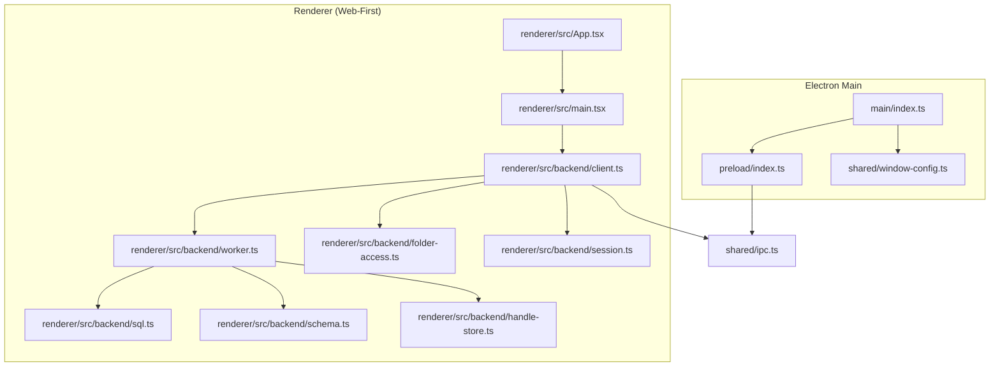
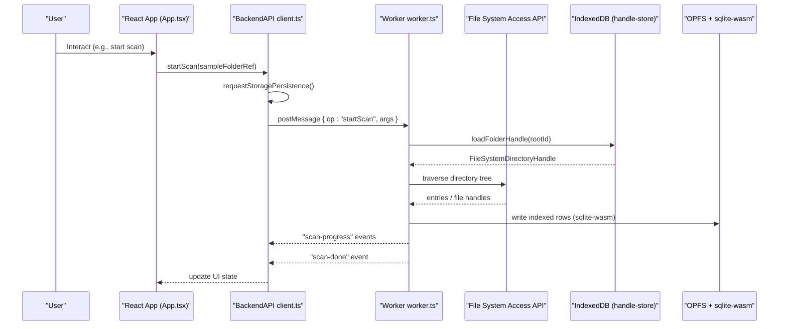
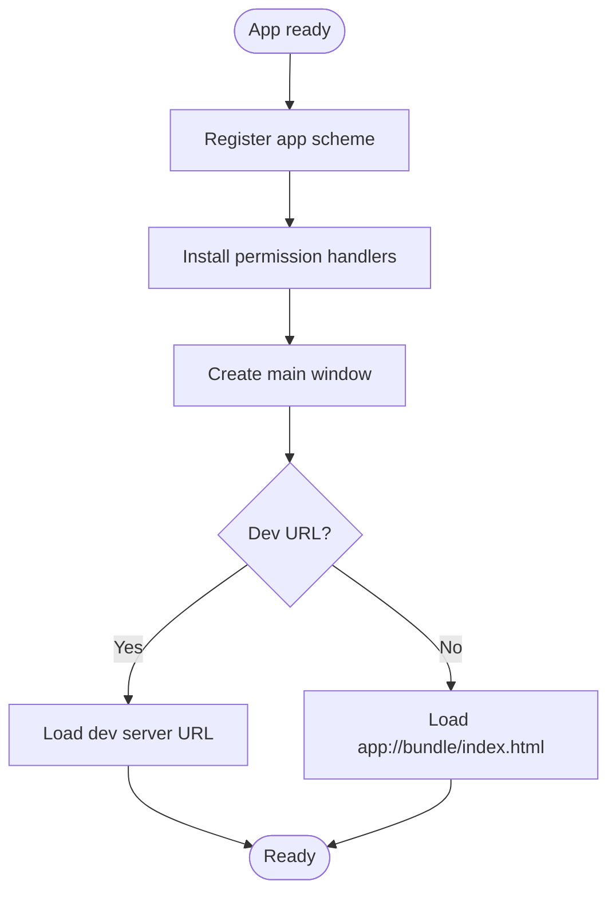
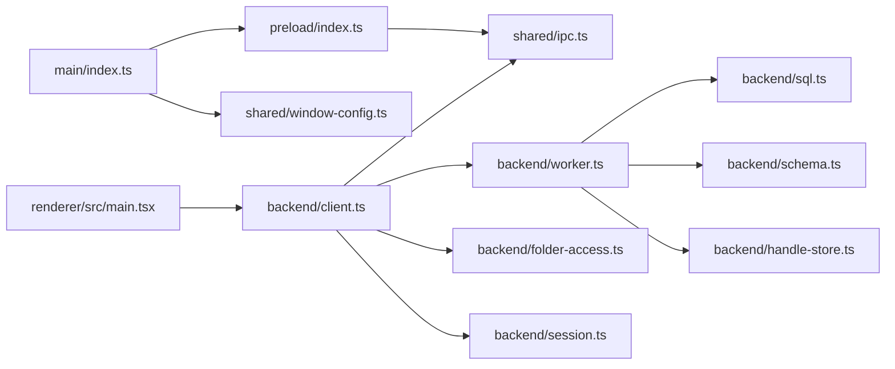

# Web-First Architecture & Browser Host Mode

<cite>
**Referenced Files in This Document**
- [src/main/index.ts](file://src/main/index.ts)
- [src/preload/index.ts](file://src/preload/index.ts)
- [src/shared/ipc.ts](file://src/shared/ipc.ts)
- [src/shared/window-config.ts](file://src/shared/window-config.ts)
- [src/renderer/src/main.tsx](file://src/renderer/src/main.tsx)
- [src/renderer/src/App.tsx](file://src/renderer/src/App.tsx)
- [src/renderer/src/backend/client.ts](file://src/renderer/src/backend/client.ts)
- [src/renderer/src/backend/worker.ts](file://src/renderer/src/backend/worker.ts)
- [src/renderer/src/backend/folder-access.ts](file://src/renderer/src/backend/folder-access.ts)
- [src/renderer/src/backend/session.ts](file://src/renderer/src/backend/session.ts)
- [src/renderer/src/backend/sql.ts](file://src/renderer/src/backend/sql.ts)
- [src/renderer/src/backend/schema.ts](file://src/renderer/src/backend/schema.ts)
- [src/renderer/src/backend/handle-store.ts](file://src/renderer/src/backend/handle-store.ts)
- [electron.vite.config.ts](file://electron.vite.config.ts)
- [package.json](file://package.json)
</cite>

## Table of Contents
1. [Introduction](#introduction)
2. [Project Structure](#project-structure)
3. [Core Components](#core-components)
4. [Architecture Overview](#architecture-overview)
5. [Detailed Component Analysis](#detailed-component-analysis)
6. [Dependency Analysis](#dependency-analysis)
7. [Performance Considerations](#performance-considerations)
8. [Troubleshooting Guide](#troubleshooting-guide)
9. [Conclusion](#conclusion)

## Introduction
This document explains the web-first architecture and browser host mode for the application. The core backend (SQLite via sqlite-wasm over OPFS, file indexing, session management, folder access) runs entirely in the renderer process and is identical in a plain Chromium browser and inside Electron. The Electron shell is intentionally thin: it provides a secure origin, windowing, auto-granted File System Access permissions, and an allowlisted external URL opener. The renderer detects whether it is running under Electron and uses optional host capabilities when available; otherwise, it falls back to standard browser behavior.

## Project Structure
The project follows a clear separation between the Electron main process, preload bridge, shared contracts, and the renderer-side web-first stack:

- Main process: minimal Electron shell that serves the renderer from a custom scheme and exposes a small set of IPC-hosted capabilities.
- Preload: bridges a tiny ShellAPI surface into the renderer context.
- Shared: TypeScript contracts for IPC channels and the BackendAPI used by both environments.
- Renderer: React UI plus a worker-backed backend using sqlite-wasm on OPFS, with folder access via File System Access API and IndexedDB for handle persistence.

**Diagram sources**
- [src/main/index.ts:1-150](file://src/main/index.ts#L1-L150)
- [src/preload/index.ts:1-15](file://src/preload/index.ts#L1-L15)
- [src/shared/window-config.ts:1-54](file://src/shared/window-config.ts#L1-L54)
- [src/renderer/src/main.tsx:1-45](file://src/renderer/src/main.tsx#L1-L45)
- [src/renderer/src/App.tsx:1-141](file://src/renderer/src/App.tsx#L1-L141)
- [src/renderer/src/backend/client.ts:1-147](file://src/renderer/src/backend/client.ts#L1-L147)
- [src/renderer/src/backend/worker.ts:1-117](file://src/renderer/src/backend/worker.ts#L1-L117)
- [src/renderer/src/backend/folder-access.ts:1-131](file://src/renderer/src/backend/folder-access.ts#L1-L131)
- [src/renderer/src/backend/session.ts:1-261](file://src/renderer/src/backend/session.ts#L1-L261)
- [src/renderer/src/backend/sql.ts:1-109](file://src/renderer/src/backend/sql.ts#L1-L109)
- [src/renderer/src/backend/schema.ts:1-123](file://src/renderer/src/backend/schema.ts#L1-L123)
- [src/renderer/src/backend/handle-store.ts:1-88](file://src/renderer/src/backend/handle-store.ts#L1-L88)
- [src/shared/ipc.ts:1-20](file://src/shared/ipc.ts#L1-L20)

**Section sources**
- [src/main/index.ts:1-150](file://src/main/index.ts#L1-L150)
- [src/preload/index.ts:1-15](file://src/preload/index.ts#L1-L15)
- [src/shared/ipc.ts:1-20](file://src/shared/ipc.ts#L1-L20)
- [src/shared/window-config.ts:1-54](file://src/shared/window-config.ts#L1-L54)
- [src/renderer/src/main.tsx:1-45](file://src/renderer/src/main.tsx#L1-L45)
- [src/renderer/src/App.tsx:1-141](file://src/renderer/src/App.tsx#L1-L141)
- [src/renderer/src/backend/client.ts:1-147](file://src/renderer/src/backend/client.ts#L1-L147)
- [src/renderer/src/backend/worker.ts:1-117](file://src/renderer/src/backend/worker.ts#L1-L117)
- [src/renderer/src/backend/folder-access.ts:1-131](file://src/renderer/src/backend/folder-access.ts#L1-L131)
- [src/renderer/src/backend/session.ts:1-261](file://src/renderer/src/backend/session.ts#L1-L261)
- [src/renderer/src/backend/sql.ts:1-109](file://src/renderer/src/backend/sql.ts#L1-L109)
- [src/renderer/src/backend/schema.ts:1-123](file://src/renderer/src/backend/schema.ts#L1-L123)
- [src/renderer/src/backend/handle-store.ts:1-88](file://src/renderer/src/backend/handle-store.ts#L1-L88)
- [electron.vite.config.ts:1-76](file://electron.vite.config.ts#L1-L76)
- [package.json:1-55](file://package.json#L1-L55)

## Core Components
- Thin Electron shell: registers a privileged app scheme, serves the renderer bundle, auto-grants File System Access permission, restricts navigation and new windows, and exposes a minimal IPC surface for version, window sizing, and opening external URLs.
- Preload bridge: exposes a small ShellAPI to the renderer for host-specific features only.
- Renderer bootstrap: enforces single-tab operation via Web Locks, bootstraps theme, and creates the BackendAPI with optional ShellAPI integration.
- BackendAPI facade: orchestrates worker calls for DB/indexing, handles user-gesture operations (folder picker, recent projects), and delegates host capabilities to ShellAPI or browser fallbacks.
- Worker backend: owns the sqlite-wasm connection over OPFS, manages scan progress events, and routes typed operations to library functions.
- Folder access layer: implements directory picking, validation, re-requesting permissions, and safe relpath-based file reads through File System Access API.
- Session and recent projects: persists active folders and recent .mixjam files in localStorage and writes a mixjam.json config into the User Folder.
- Database layer: a better-sqlite3-shaped wrapper around sqlite-wasm with statement caching and transaction helpers; schema defines sample index, tags, categories, libraries, and FTS.

**Section sources**
- [src/main/index.ts:1-150](file://src/main/index.ts#L1-L150)
- [src/preload/index.ts:1-15](file://src/preload/index.ts#L1-L15)
- [src/renderer/src/main.tsx:1-45](file://src/renderer/src/main.tsx#L1-L45)
- [src/renderer/src/backend/client.ts:1-147](file://src/renderer/src/backend/client.ts#L1-L147)
- [src/renderer/src/backend/worker.ts:1-117](file://src/renderer/src/backend/worker.ts#L1-L117)
- [src/renderer/src/backend/folder-access.ts:1-131](file://src/renderer/src/backend/folder-access.ts#L1-L131)
- [src/renderer/src/backend/session.ts:1-261](file://src/renderer/src/backend/session.ts#L1-L261)
- [src/renderer/src/backend/sql.ts:1-109](file://src/renderer/src/backend/sql.ts#L1-L109)
- [src/renderer/src/backend/schema.ts:1-123](file://src/renderer/src/backend/schema.ts#L1-L123)
- [src/renderer/src/backend/handle-store.ts:1-88](file://src/renderer/src/backend/handle-store.ts#L1-L88)

## Architecture Overview
The system is designed to run identically in any modern Chromium browser and in Electron. The Electron shell adds only what browsers cannot provide: a stable secure origin, window control, and explicit permission grants. All data logic lives in the renderer and its worker.

**Diagram sources**
- [src/renderer/src/App.tsx:1-141](file://src/renderer/src/App.tsx#L1-L141)
- [src/renderer/src/backend/client.ts:1-147](file://src/renderer/src/backend/client.ts#L1-L147)
- [src/renderer/src/backend/worker.ts:1-117](file://src/renderer/src/backend/worker.ts#L1-L117)
- [src/renderer/src/backend/handle-store.ts:1-88](file://src/renderer/src/backend/handle-store.ts#L1-L88)
- [src/renderer/src/backend/folder-access.ts:1-131](file://src/renderer/src/backend/folder-access.ts#L1-L131)
- [src/renderer/src/backend/sql.ts:1-109](file://src/renderer/src/backend/sql.ts#L1-L109)

## Detailed Component Analysis

### Electron Shell (Main Process)
Responsibilities:
- Register a privileged app scheme to serve the renderer from a stable secure origin.
- Auto-grant File System Access permission and suppress native prompts.
- Restrict navigation and new windows; route external links through an allowlist.
- Expose minimal IPC handlers for version, window resizing, and opening URLs.

Key behaviors:
- Custom scheme handler ensures containment within the renderer bundle.
- Permission handlers grant fileSystem access without user prompts.
- Window lifecycle and resize utilities are provided via shared configuration.

**Diagram sources**
- [src/main/index.ts:1-150](file://src/main/index.ts#L1-L150)
- [src/shared/window-config.ts:1-54](file://src/shared/window-config.ts#L1-L54)

**Section sources**
- [src/main/index.ts:1-150](file://src/main/index.ts#L1-L150)
- [src/shared/window-config.ts:1-54](file://src/shared/window-config.ts#L1-L54)

### Preload Bridge and ShellAPI
Responsibilities:
- Expose a minimal ShellAPI to the renderer for host-only features (version, window resize, openExternal).
- Use IPC channels defined in shared contracts.

Behavior:
- In Electron, methods invoke ipcRenderer.invoke with well-known channels.
- In the browser, window.shellAPI is absent; the backend substitutes no-op or browser-native fallbacks.

**Section sources**
- [src/preload/index.ts:1-15](file://src/preload/index.ts#L1-L15)
- [src/shared/ipc.ts:1-20](file://src/shared/ipc.ts#L1-L20)

### Renderer Bootstrap and Single-Tab Enforcement
Responsibilities:
- Enforce single-tab operation using navigator.locks to protect OPFS/IndexedDB usage.
- Detect host environment and create BackendAPI with optional ShellAPI.
- Bootstrap theme before rendering content.

Flow:
- Attempt to acquire a named lock; if unavailable, show a friendly notice and exit early.
- Initialize backend API and mount the React app.

**Section sources**
- [src/renderer/src/main.tsx:1-45](file://src/renderer/src/main.tsx#L1-L45)

### BackendAPI Facade (client.ts)
Responsibilities:
- Provide a unified BackendAPI surface to the UI.
- Delegate host capabilities to ShellAPI when present; otherwise use browser fallbacks.
- Manage a dedicated Worker for database and indexing operations.
- Persist storage preference and coordinate session/recent projects.

Highlights:
- Message-passing protocol with sequence IDs and response/error handling.
- Progress listeners for scan updates.
- Storage persistence request on first scan.

**Section sources**
- [src/renderer/src/backend/client.ts:1-147](file://src/renderer/src/backend/client.ts#L1-L147)

### Worker Backend (worker.ts)
Responsibilities:
- Own the sqlite-wasm connection via OPFS SAH pool.
- Initialize schema and ensure default category.
- Route typed operations to library functions.
- Emit scan progress and completion events.

Key points:
- Single-tab guarantee enforced by the client; worker assumes exclusive access.
- Scan generation counter prevents stale progress clobbering across restarts.

**Section sources**
- [src/renderer/src/backend/worker.ts:1-117](file://src/renderer/src/backend/worker.ts#L1-L117)

### Folder Access Layer (folder-access.ts)
Responsibilities:
- Directory picker with role-aware modes (read vs readwrite).
- Validate stored folder grants and existence.
- Re-request permissions when needed.
- Safe relpath traversal and file reading under a granted root.

Security model:
- Containment is structural: a directory handle can only reach its own subtree.
- No absolute paths anywhere; relpaths are validated against traversal segments.

**Section sources**
- [src/renderer/src/backend/folder-access.ts:1-131](file://src/renderer/src/backend/folder-access.ts#L1-L131)

### Session and Recent Projects (session.ts)
Responsibilities:
- Persist active folders and recent .mixjam files in localStorage.
- Discover .mixjam files under the User Folder and merge with registry.
- Write a mixjam.json config file into the User Folder with app version and last opened time.

Data flow:
- listRecentProjects validates handle permissions, verifies file existence, and merges discovered items.
- writeSessionConfig requires both user and sample folders to be set.

**Section sources**
- [src/renderer/src/backend/session.ts:1-261](file://src/renderer/src/backend/session.ts#L1-L261)

### Database Layer (sql.ts and schema.ts)
Responsibilities:
- Provide a better-sqlite3-like API over sqlite-wasm with prepared statements and transactions.
- Define schema for samples, tags, categories, libraries, and FTS indexes.
- Maintain schema_version and ensure idempotent initialization.

Indexes and search:
- FTS triggers keep filename and relpath searchable efficiently.
- Multiple B-tree indexes support common queries (filename, date_added, bpm, key).

**Section sources**
- [src/renderer/src/backend/sql.ts:1-109](file://src/renderer/src/backend/sql.ts#L1-L109)
- [src/renderer/src/backend/schema.ts:1-123](file://src/renderer/src/backend/schema.ts#L1-L123)

### Handle Store (handle-store.ts)
Responsibilities:
- Persist granted FileSystemDirectoryHandles in IndexedDB keyed by UUID.
- Reuse existing handles for the same physical directory via isSameEntry.
- Provide safe retrieval for both main-thread and worker contexts.

**Section sources**
- [src/renderer/src/backend/handle-store.ts:1-88](file://src/renderer/src/backend/handle-store.ts#L1-L88)

### Build and Security Configuration
Responsibilities:
- Inject a strict Content-Security-Policy at build time for the packaged renderer.
- Allow wasm-unsafe-eval for sqlite-wasm compilation.
- Configure worker format to ES modules for dynamic imports.
- Derive app version from git commit count or package.json fallback.

**Section sources**
- [electron.vite.config.ts:1-76](file://electron.vite.config.ts#L1-L76)
- [package.json:1-55](file://package.json#L1-L55)

## Dependency Analysis
High-level dependencies among core components:

**Diagram sources**
- [src/main/index.ts:1-150](file://src/main/index.ts#L1-L150)
- [src/preload/index.ts:1-15](file://src/preload/index.ts#L1-L15)
- [src/shared/ipc.ts:1-20](file://src/shared/ipc.ts#L1-L20)
- [src/shared/window-config.ts:1-54](file://src/shared/window-config.ts#L1-L54)
- [src/renderer/src/main.tsx:1-45](file://src/renderer/src/main.tsx#L1-L45)
- [src/renderer/src/backend/client.ts:1-147](file://src/renderer/src/backend/client.ts#L1-L147)
- [src/renderer/src/backend/worker.ts:1-117](file://src/renderer/src/backend/worker.ts#L1-L117)
- [src/renderer/src/backend/folder-access.ts:1-131](file://src/renderer/src/backend/folder-access.ts#L1-L131)
- [src/renderer/src/backend/session.ts:1-261](file://src/renderer/src/backend/session.ts#L1-L261)
- [src/renderer/src/backend/sql.ts:1-109](file://src/renderer/src/backend/sql.ts#L1-L109)
- [src/renderer/src/backend/schema.ts:1-123](file://src/renderer/src/backend/schema.ts#L1-L123)
- [src/renderer/src/backend/handle-store.ts:1-88](file://src/renderer/src/backend/handle-store.ts#L1-L88)

Observations:
- Cohesion: Each module has a focused responsibility (shell, bridge, API facade, worker, IO, persistence).
- Coupling: The renderer depends on shared contracts; the worker depends on DB and schema; folder access is isolated.
- External integrations: sqlite-wasm over OPFS, File System Access API, IndexedDB, and IPC.

## Performance Considerations
- Single-tab enforcement avoids contention on OPFS-backed SQLite and prevents multi-process corruption.
- Statement caching in the DB wrapper reduces overhead for repeated queries.
- FTS triggers maintain efficient full-text search without rewriting unrelated metadata.
- Requesting storage persistence helps avoid eviction of OPFS/IndexedDB under pressure.
- Worker-based scanning keeps the UI responsive while emitting incremental progress events.

[No sources needed since this section provides general guidance]

## Troubleshooting Guide
Common issues and remedies:
- Already open in another tab: The app shows a notice and exits if the Web Lock is held by another instance. Close the other tab or switch to it.
- Permission lost for a folder: Validation returns needs-permission; trigger re-request via the appropriate action (requires a user gesture).
- Invalid folder reference: If the handle is missing or unreadable, validation returns invalid; re-pick the folder.
- Scan errors: The worker emits error progress; check console logs for indexer errors and re-run the scan.
- CSP-related failures in production builds: Ensure the injected CSP allows required sources; sqlite-wasm requires wasm-unsafe-eval.

**Section sources**
- [src/renderer/src/main.tsx:1-45](file://src/renderer/src/main.tsx#L1-L45)
- [src/renderer/src/backend/folder-access.ts:1-131](file://src/renderer/src/backend/folder-access.ts#L1-L131)
- [src/renderer/src/backend/worker.ts:1-117](file://src/renderer/src/backend/worker.ts#L1-L117)
- [electron.vite.config.ts:1-76](file://electron.vite.config.ts#L1-L76)

## Conclusion
The application’s web-first design enables identical behavior across browsers and Electron. The Electron shell is intentionally minimal, providing only what browsers cannot, while the renderer encapsulates all data and processing logic. This approach simplifies testing, deployment, and maintenance, while preserving desktop UX parity through a small, well-defined host capability surface.

[No sources needed since this section summarizes without analyzing specific files]