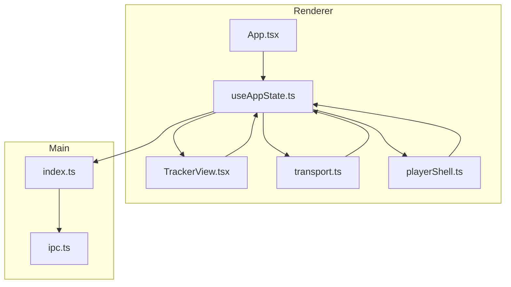
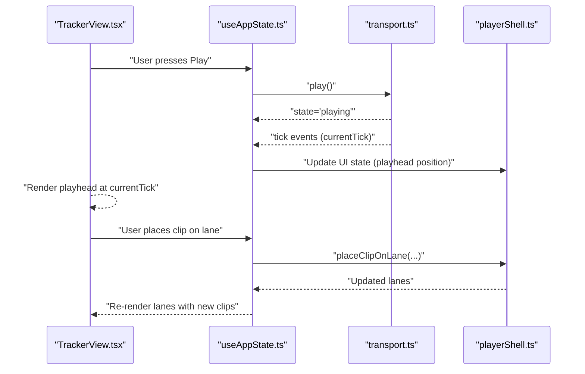
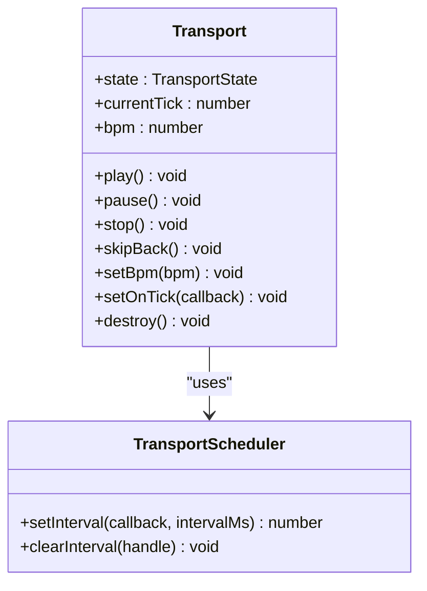
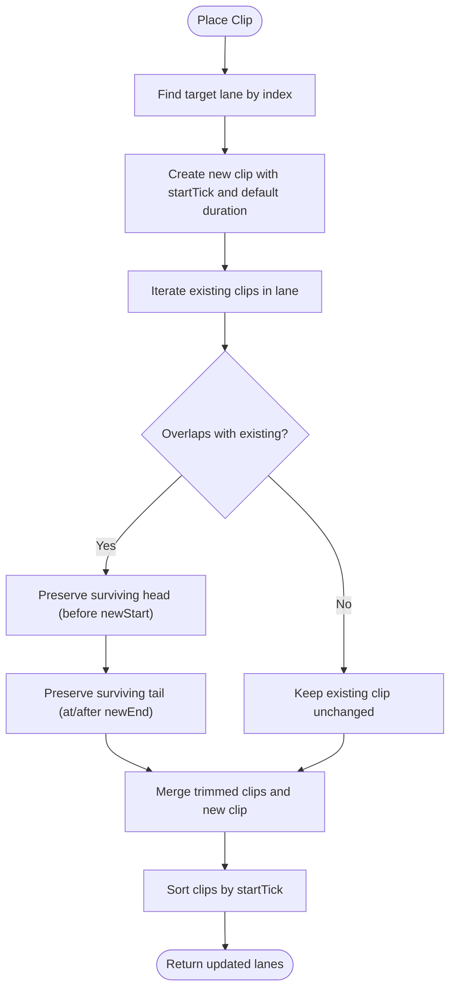
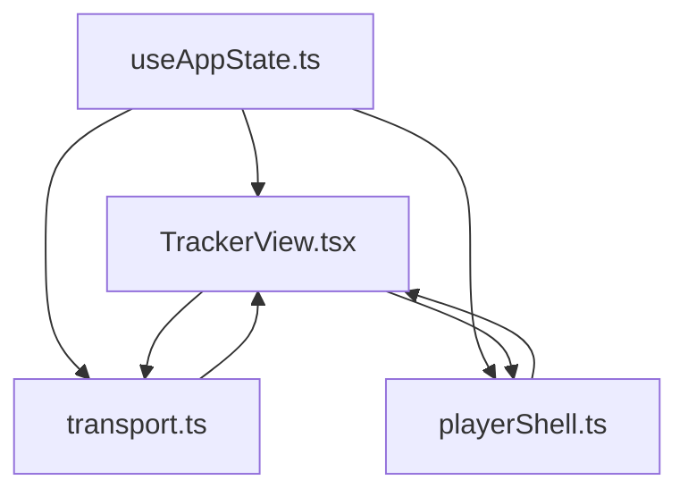
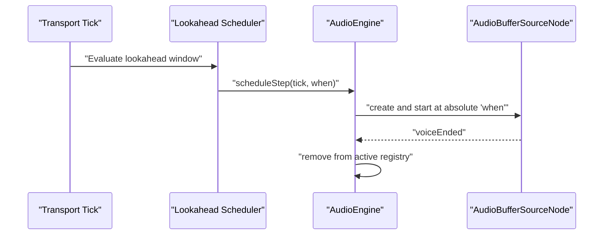
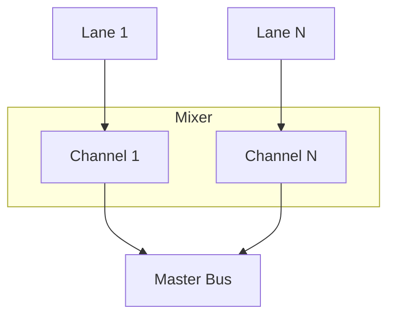
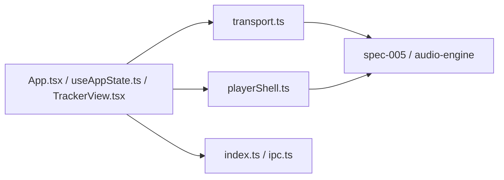
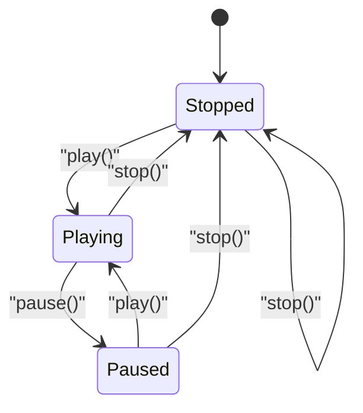

# Audio Engine

<cite>
**Referenced Files in This Document**
- [transport.ts](file://src/renderer/src/engine/transport.ts)
- [transport.test.ts](file://src/renderer/src/engine/transport.test.ts)
- [playerShell.ts](file://src/renderer/src/lib/playerShell.ts)
- [TrackerView.tsx](file://src/renderer/src/components/TrackerView.tsx)
- [useAppState.ts](file://src/renderer/src/hooks/useAppState.ts)
- [App.tsx](file://src/renderer/src/App.tsx)
- [audio-engine.md](file://docs/audio-engine.md)
- [spec-005-audio-playback-engine.md](file://docs/specs/spec-005-audio-playback-engine.md)
- [spec-006-player-timeline-panels.md](file://docs/specs/spec-006-player-timeline-panels.md)
- [spec-007-mixer.md](file://docs/specs/spec-007-mixer.md)
- [architecture.md](file://docs/architecture.md)
- [index.ts](file://src/main/index.ts)
- [ipc.ts](file://src/shared/ipc.ts)
</cite>

## Table of Contents
1. [Introduction](#introduction)
2. [Project Structure](#project-structure)
3. [Core Components](#core-components)
4. [Architecture Overview](#architecture-overview)
5. [Detailed Component Analysis](#detailed-component-analysis)
6. [Dependency Analysis](#dependency-analysis)
7. [Performance Considerations](#performance-considerations)
8. [Troubleshooting Guide](#troubleshooting-guide)
9. [Conclusion](#conclusion)
10. [Appendices](#appendices)

## Introduction
This document describes MixJam Electron’s audio engine and playback system. It focuses on the transport system (BPM control, timing precision, playhead management, and tick scheduling), the player shell (lane management, clip placement, and mixer integration), and the Web Audio API integration (buffer management and playback synchronization). It also documents the transport state machine, event-driven architecture, real-time audio processing, performance characteristics, latency optimization, and the relationship between the audio engine and the tracker interface (timeline visualization and playback coordination).

## Project Structure
The audio engine and playback system are implemented in the renderer process and coordinated with the main process for file access and session management. The key modules are:
- Transport: a lightweight, scheduler-backed transport with BPM control and tick progression
- Player shell: lane and clip data model, placement logic, and mute/solo behavior
- UI integration: React components and hooks that connect transport and player shell to the tracker view
- Docs: specification and architecture references that define the engine’s scope and behavior

**Diagram sources**
- [App.tsx:1-108](file://src/renderer/src/App.tsx#L1-L108)
- [useAppState.ts:1-295](file://src/renderer/src/hooks/useAppState.ts#L1-L295)
- [TrackerView.tsx:1-270](file://src/renderer/src/components/TrackerView.tsx#L1-L270)
- [transport.ts:1-118](file://src/renderer/src/engine/transport.ts#L1-L118)
- [playerShell.ts:1-132](file://src/renderer/src/lib/playerShell.ts#L1-L132)
- [index.ts:1-170](file://src/main/index.ts#L1-L170)
- [ipc.ts:1-59](file://src/shared/ipc.ts#L1-L59)

**Section sources**
- [App.tsx:1-108](file://src/renderer/src/App.tsx#L1-L108)
- [useAppState.ts:1-295](file://src/renderer/src/hooks/useAppState.ts#L1-L295)
- [TrackerView.tsx:1-270](file://src/renderer/src/components/TrackerView.tsx#L1-L270)
- [transport.ts:1-118](file://src/renderer/src/engine/transport.ts#L1-L118)
- [playerShell.ts:1-132](file://src/renderer/src/lib/playerShell.ts#L1-L132)
- [index.ts:1-170](file://src/main/index.ts#L1-L170)
- [ipc.ts:1-59](file://src/shared/ipc.ts#L1-L59)

## Core Components
- Transport: provides playhead state, BPM control, and tick scheduling via a pluggable scheduler abstraction
- Player shell: manages lanes, clips, mute/solo state, and clip placement with trimming logic
- UI integration: connects transport and player shell to the tracker view and mixer controls
- Docs: define the lookahead scheduler pattern, Web Audio API usage, and engine boundaries

Key implementation references:
- Transport interface and scheduler abstraction: [transport.ts:19-31](file://src/renderer/src/engine/transport.ts#L19-L31)
- Tick interval calculation and BPM control: [transport.ts:35-37](file://src/renderer/src/engine/transport.ts#L35-L37)
- Transport state transitions and timer management: [transport.ts:76-103](file://src/renderer/src/engine/transport.ts#L76-L103)
- Player shell lane and clip data model: [playerShell.ts:13-27](file://src/renderer/src/lib/playerShell.ts#L13-L27)
- Clip placement and trimming logic: [playerShell.ts:39-95](file://src/renderer/src/lib/playerShell.ts#L39-L95)
- UI wiring of transport and player shell: [useAppState.ts:165-187](file://src/renderer/src/hooks/useAppState.ts#L165-L187), [useAppState.ts:243-260](file://src/renderer/src/hooks/useAppState.ts#L243-L260)

**Section sources**
- [transport.ts:1-118](file://src/renderer/src/engine/transport.ts#L1-L118)
- [playerShell.ts:1-132](file://src/renderer/src/lib/playerShell.ts#L1-L132)
- [useAppState.ts:1-295](file://src/renderer/src/hooks/useAppState.ts#L1-L295)

## Architecture Overview
The audio engine is event-driven and decoupled from the UI. The transport emits tick events that the UI consumes to update the playhead and synchronize the tracker visualization. The player shell maintains the arrangement of clips across lanes, and the UI reacts to changes in transport state and lane data.

**Diagram sources**
- [TrackerView.tsx:159-185](file://src/renderer/src/components/TrackerView.tsx#L159-L185)
- [useAppState.ts:243-260](file://src/renderer/src/hooks/useAppState.ts#L243-L260)
- [transport.ts:24-31](file://src/renderer/src/engine/transport.ts#L24-L31)
- [playerShell.ts:39-95](file://src/renderer/src/lib/playerShell.ts#L39-L95)

**Section sources**
- [TrackerView.tsx:1-270](file://src/renderer/src/components/TrackerView.tsx#L1-L270)
- [useAppState.ts:1-295](file://src/renderer/src/hooks/useAppState.ts#L1-L295)
- [transport.ts:1-118](file://src/renderer/src/engine/transport.ts#L1-L118)
- [playerShell.ts:1-132](file://src/renderer/src/lib/playerShell.ts#L1-L132)

## Detailed Component Analysis

### Transport System
The transport is a scheduler-backed, event-driven system that:
- Owns BPM and playhead position (current tick)
- Supports play, pause, stop, skip-back, and dynamic BPM changes
- Emits tick events to subscribers
- Uses a pluggable scheduler abstraction to support testing and environment-specific timers

**Diagram sources**
- [transport.ts:19-31](file://src/renderer/src/engine/transport.ts#L19-L31)
- [transport.ts:7-17](file://src/renderer/src/engine/transport.ts#L7-L17)

Key behaviors:
- Tick interval derived from BPM and a constant ticks-per-beat factor
- Timer restarts on BPM changes when playing
- Tick events propagate to registered listeners
- Test coverage validates state transitions and timer behavior

**Section sources**
- [transport.ts:1-118](file://src/renderer/src/engine/transport.ts#L1-L118)
- [transport.test.ts:1-152](file://src/renderer/src/engine/transport.test.ts#L1-L152)

### Player Shell and Lane Management
The player shell defines the data model and operations for lanes and clips:
- LaneState includes index, name, mute/solo flags, and a list of LaneClip
- LaneClip stores sample identity, start tick, and duration in ticks
- Clip placement enforces monophonic behavior by trimming overlapping clips
- Mute/solo toggles and dimming logic reflect routing and user intent

**Diagram sources**
- [playerShell.ts:39-95](file://src/renderer/src/lib/playerShell.ts#L39-L95)

**Section sources**
- [playerShell.ts:1-132](file://src/renderer/src/lib/playerShell.ts#L1-L132)

### UI Integration and Tracker View
The tracker view renders:
- A ruler with bar markers and tick spacing
- 16 lanes with mute/solo controls and clip bubbles
- A moving playhead synchronized to the transport’s current tick
- Transport controls in the middle strip and BPM control in the song controls rail

**Diagram sources**
- [useAppState.ts:165-187](file://src/renderer/src/hooks/useAppState.ts#L165-L187)
- [TrackerView.tsx:1-270](file://src/renderer/src/components/TrackerView.tsx#L1-L270)
- [transport.ts:1-118](file://src/renderer/src/engine/transport.ts#L1-L118)
- [playerShell.ts:1-132](file://src/renderer/src/lib/playerShell.ts#L1-L132)

**Section sources**
- [TrackerView.tsx:1-270](file://src/renderer/src/components/TrackerView.tsx#L1-L270)
- [useAppState.ts:1-295](file://src/renderer/src/hooks/useAppState.ts#L1-L295)

### Web Audio API Integration and Lookahead Scheduler
The engine follows a lookahead-scheduler pattern:
- A coarse timer drives periodic ticks
- Each tick schedules upcoming steps within a lookahead window using absolute AudioContext time
- Voices are triggered as one-shot AudioBufferSourceNodes routed through channel gain/pan into the master bus
- The engine maintains an active voice registry and supports stopAllVoices and master gain control

**Diagram sources**
- [audio-engine.md:6-18](file://docs/audio-engine.md#L6-L18)
- [spec-005-audio-playback-engine.md:48-57](file://docs/specs/spec-005-audio-playback-engine.md#L48-L57)

**Section sources**
- [audio-engine.md:1-53](file://docs/audio-engine.md#L1-L53)
- [spec-005-audio-playback-engine.md:1-171](file://docs/specs/spec-005-audio-playback-engine.md#L1-L171)

### Mixer Integration
The mixer provides per-channel routing and controls:
- Default 16 channels mapped to 16 lanes
- Per-channel gain, pan, mute/solo, and dB metering
- Optional stereo width control
- Routing can be changed per lane; multiple lanes can share one channel

**Diagram sources**
- [spec-007-mixer.md:75-81](file://docs/specs/spec-007-mixer.md#L75-L81)

**Section sources**
- [spec-007-mixer.md:1-110](file://docs/specs/spec-007-mixer.md#L1-L110)

## Dependency Analysis
The renderer depends on:
- Transport for timing and playhead state
- Player shell for arrangement data and clip operations
- UI components for visualization and user interaction
- Main process via IPC for file access and session management

**Diagram sources**
- [App.tsx:1-108](file://src/renderer/src/App.tsx#L1-L108)
- [useAppState.ts:1-295](file://src/renderer/src/hooks/useAppState.ts#L1-L295)
- [TrackerView.tsx:1-270](file://src/renderer/src/components/TrackerView.tsx#L1-L270)
- [transport.ts:1-118](file://src/renderer/src/engine/transport.ts#L1-L118)
- [playerShell.ts:1-132](file://src/renderer/src/lib/playerShell.ts#L1-L132)
- [index.ts:1-170](file://src/main/index.ts#L1-L170)
- [ipc.ts:1-59](file://src/shared/ipc.ts#L1-L59)

**Section sources**
- [App.tsx:1-108](file://src/renderer/src/App.tsx#L1-L108)
- [useAppState.ts:1-295](file://src/renderer/src/hooks/useAppState.ts#L1-L295)
- [TrackerView.tsx:1-270](file://src/renderer/src/components/TrackerView.tsx#L1-L270)
- [transport.ts:1-118](file://src/renderer/src/engine/transport.ts#L1-L118)
- [playerShell.ts:1-132](file://src/renderer/src/lib/playerShell.ts#L1-L132)
- [index.ts:1-170](file://src/main/index.ts#L1-L170)
- [ipc.ts:1-59](file://src/shared/ipc.ts#L1-L59)

## Performance Considerations
- Timing precision: The lookahead scheduler compensates for JS timer jitter by self-correcting on each tick and scheduling at absolute AudioContext time
- Latency optimization: Keep lookahead windows modest (e.g., tens of milliseconds) to reduce latency while ensuring robust scheduling
- Buffer management: Decode samples once into AudioBuffer and cache with an LRU policy to avoid repeated decoding overhead
- Rendering: The tracker uses efficient rendering techniques (e.g., canvas-based clip rendering) to maintain smooth UI performance at high clip counts
- Audio thread safety: Avoid long-running tasks on the UI thread; delegate heavy work to the main process via IPC

[No sources needed since this section provides general guidance]

## Troubleshooting Guide
Common issues and remedies:
- Transport not advancing: Verify that play() was called and the scheduler is active; confirm tick events are received
- BPM changes not taking effect: Ensure the transport is playing when changing BPM; the timer restarts automatically
- Clipping artifacts: Confirm lookahead window and scheduling cadence; ensure absolute scheduling times are used
- UI desynchronization: Check that the tracker view subscribes to tick events and updates the playhead position accordingly

**Section sources**
- [transport.ts:76-103](file://src/renderer/src/engine/transport.ts#L76-L103)
- [transport.test.ts:100-121](file://src/renderer/src/engine/transport.test.ts#L100-L121)
- [audio-engine.md:6-18](file://docs/audio-engine.md#L6-L18)

## Conclusion
MixJam Electron’s audio engine separates concerns cleanly: the transport provides precise, scheduler-backed timing; the player shell manages lanes and clips with monophonic behavior; and the UI integrates these systems to deliver a responsive tracker experience. The Web Audio API integration leverages a proven lookahead pattern to achieve sample-accurate playback, while the architecture preserves room for future enhancements such as native audio addons or advanced DSP.

[No sources needed since this section summarizes without analyzing specific files]

## Appendices

### Transport State Machine

**Diagram sources**
- [transport.ts:76-92](file://src/renderer/src/engine/transport.ts#L76-L92)

### Timeline Visualization and Playback Coordination
- The tracker view computes playhead position from currentTick and renders a moving line synchronized to the transport
- The ruler displays bar markers and tick spacing to aid orientation
- Transport controls in the middle strip and song controls rail update the engine’s BPM and state

**Section sources**
- [TrackerView.tsx:115-122](file://src/renderer/src/components/TrackerView.tsx#L115-L122)
- [spec-006-player-timeline-panels.md:115-137](file://docs/specs/spec-006-player-timeline-panels.md#L115-L137)