# Audio Engine

<cite>
**Referenced Files in This Document**
- [transport.ts](file://src/renderer/src/engine/transport.ts)
- [player.ts](file://src/renderer/src/engine/player.ts)
- [scheduler.ts](file://src/renderer/src/engine/scheduler.ts)
- [audio-engine.ts](file://src/renderer/src/engine/audio-engine.ts)
- [channel.ts](file://src/renderer/src/engine/channel.ts)
- [voice.ts](file://src/renderer/src/engine/voice.ts)
- [sample-cache.ts](file://src/renderer/src/engine/sample-cache.ts)
- [lane-evaluation.ts](file://src/renderer/src/engine/lane-evaluation.ts)
- [playerShell.ts](file://src/renderer/src/lib/playerShell.ts)
- [useTransportEngine.ts](file://src/renderer/src/hooks/useTransportEngine.ts)
- [TrackerView.tsx](file://src/renderer/src/components/TrackerView.tsx)
- [useAppState.ts](file://src/renderer/src/hooks/useAppState.ts)
- [App.tsx](file://src/renderer/src/App.tsx)
- [audio-engine.md](file://docs/audio-engine.md)
- [spec-005-audio-playback-engine.md](file://docs/specs/spec-005-audio-playback-engine.md)
- [spec-006-player-timeline-panels.md](file://docs/specs/spec-006-player-timeline-panels.md)
- [spec-007-mixer.md](file://docs/specs/spec-007-mixer.md)
- [architecture.md](file://docs/architecture.md)
- [index.ts](file://src/main/index.ts)
- [ipc.ts](file://src/shared/ipc.ts)
</cite>

## Update Summary
**Changes Made**
- Added comprehensive Player orchestration layer that coordinates transport, scheduler, and audio engine
- Enhanced lookahead scheduler with configurable intervals and lookahead windows
- Integrated complete audio processing pipeline with voice management and channel routing
- Added sample caching system with LRU eviction and error handling
- Implemented monophonic playback with lane evaluation and trigger management
- Enhanced transport system with BPM control and tick-to-time conversion
- Added preview functionality with transport-aware scheduling

## Table of Contents
1. [Introduction](#introduction)
2. [Project Structure](#project-structure)
3. [Core Components](#core-components)
4. [Architecture Overview](#architecture-overview)
5. [Detailed Component Analysis](#detailed-component-analysis)
6. [Dependency Analysis](#dependency-analysis)
7. [Performance Considerations](#performance-considerations)
8. [Troubleshooting Guide](#troubleshooting-guide)
9. [Conclusion](#conclusion)
10. [Appendices](#appendices)

## Introduction
This document describes MixJam Electron's enhanced audio engine and playback system. The system features a sophisticated transport engine architecture with lookahead scheduling, comprehensive audio processing capabilities, and seamless integration between the tracker interface and real-time audio output. The engine implements a pure TypeScript architecture with Web Audio API integration, providing sample-accurate playback with low-latency scheduling and comprehensive audio processing features.

## Project Structure
The audio engine is organized into distinct layers that work together to provide a complete playback solution. The architecture follows a layered approach with clear separation of concerns:

- **Transport Layer**: Handles playhead state, BPM control, and timing calculations
- **Scheduler Layer**: Manages lookahead scheduling with configurable timing parameters
- **Audio Engine Layer**: Controls Web Audio API, voice management, and audio routing
- **Player Orchestration**: Coordinates all components and manages playback lifecycle
- **UI Integration**: Connects the audio engine to the tracker interface and user controls

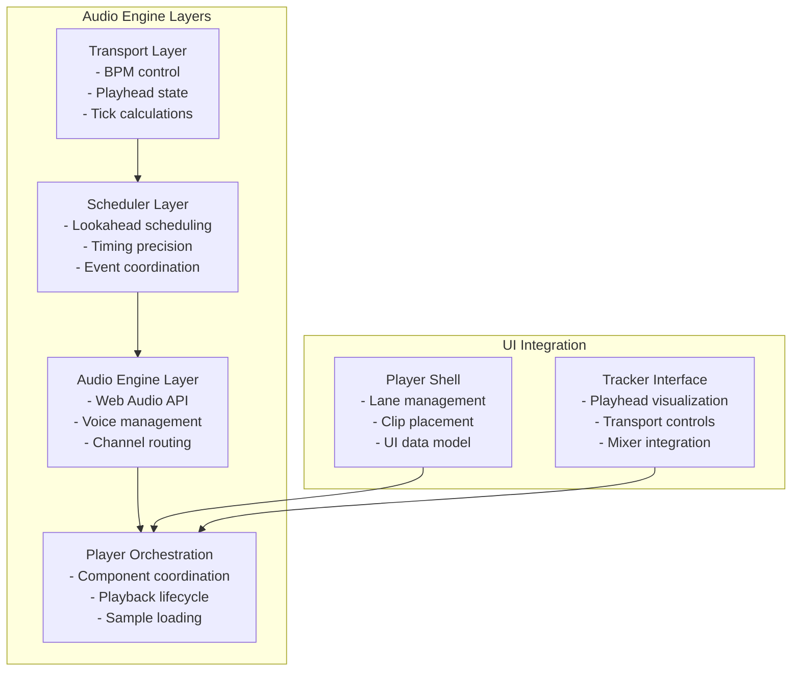

**Diagram sources**
- [transport.ts:1-79](file://src/renderer/src/engine/transport.ts#L1-L79)
- [scheduler.ts:1-137](file://src/renderer/src/engine/scheduler.ts#L1-L137)
- [audio-engine.ts:1-204](file://src/renderer/src/engine/audio-engine.ts#L1-L204)
- [player.ts:1-230](file://src/renderer/src/engine/player.ts#L1-L230)
- [playerShell.ts:1-202](file://src/renderer/src/lib/playerShell.ts#L1-L202)

**Section sources**
- [transport.ts:1-79](file://src/renderer/src/engine/transport.ts#L1-L79)
- [scheduler.ts:1-137](file://src/renderer/src/engine/scheduler.ts#L1-L137)
- [audio-engine.ts:1-204](file://src/renderer/src/engine/audio-engine.ts#L1-L204)
- [player.ts:1-230](file://src/renderer/src/engine/player.ts#L1-L230)
- [playerShell.ts:1-202](file://src/renderer/src/lib/playerShell.ts#L1-L202)

## Core Components

### Transport System
The transport system provides precise timing control with BPM management and playhead state tracking. It operates independently of the audio clock to maintain clean separation of concerns.

**Key Features:**
- Pure state machine with stopped/playing/paused states
- BPM control with dynamic tempo changes
- Tick-to-time conversion for absolute scheduling
- No internal timers - relies on scheduler for timing

**Section sources**
- [transport.ts:9-79](file://src/renderer/src/engine/transport.ts#L9-L79)

### Lookahead Scheduler
The scheduler implements the Chris Wilson "A Tale of Two Clocks" pattern with configurable timing parameters for optimal performance.

**Key Features:**
- Configurable interval timing (default 25ms)
- Adjustable lookahead window (default 100ms)
- Self-correcting from audio clock drift
- Absolute time scheduling for sample accuracy
- Live BPM adaptation during playback

**Section sources**
- [scheduler.ts:15-137](file://src/renderer/src/engine/scheduler.ts#L15-L137)

### Audio Engine
The audio engine manages the Web Audio API infrastructure with comprehensive voice and channel management.

**Key Features:**
- Lazy AudioContext creation for autoplay policy compliance
- Master gain stage with real-time metering
- Channel factory with independent gain/pan control
- Voice registry with lifecycle management
- Sample caching with LRU eviction policy

**Section sources**
- [audio-engine.ts:17-204](file://src/renderer/src/engine/audio-engine.ts#L17-L204)

### Player Orchestration
The Player class coordinates all audio engine components and manages the complete playback lifecycle.

**Key Features:**
- Orchestrates transport, scheduler, and audio engine
- Manages playback state transitions
- Handles sample loading and caching
- Implements monophonic playback with voice management
- Provides preview functionality with transport-aware scheduling

**Section sources**
- [player.ts:18-230](file://src/renderer/src/engine/player.ts#L18-L230)

### Audio Processing Pipeline
Complete audio processing chain from sample data to final output.

**Key Features:**
- Sample loading with asynchronous decoding
- Voice creation and management
- Channel routing with gain/pan control
- Master bus processing with metering
- Real-time audio graph manipulation

**Section sources**
- [voice.ts:16-75](file://src/renderer/src/engine/voice.ts#L16-L75)
- [channel.ts:6-61](file://src/renderer/src/engine/channel.ts#L6-L61)
- [sample-cache.ts:27-107](file://src/renderer/src/engine/sample-cache.ts#L27-L107)

## Architecture Overview
The enhanced audio engine follows a layered architecture that separates concerns while maintaining tight integration between components. The system uses event-driven communication with clear interfaces between layers.

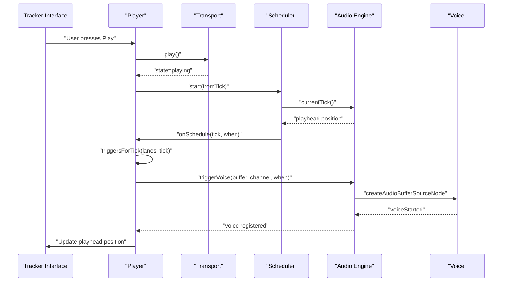

**Diagram sources**
- [useTransportEngine.ts:235-244](file://src/renderer/src/hooks/useTransportEngine.ts#L235-L244)
- [player.ts:185-194](file://src/renderer/src/engine/player.ts#L185-L194)
- [scheduler.ts:75-87](file://src/renderer/src/engine/scheduler.ts#L75-L87)
- [audio-engine.ts:140-154](file://src/renderer/src/engine/audio-engine.ts#L140-L154)

**Section sources**
- [useTransportEngine.ts:126-166](file://src/renderer/src/hooks/useTransportEngine.ts#L126-L166)
- [player.ts:29-59](file://src/renderer/src/engine/player.ts#L29-L59)
- [scheduler.ts:59-137](file://src/renderer/src/engine/scheduler.ts#L59-L137)

## Detailed Component Analysis

### Transport System Architecture
The transport system provides a pure state machine interface that manages playback state and timing calculations without direct audio involvement.

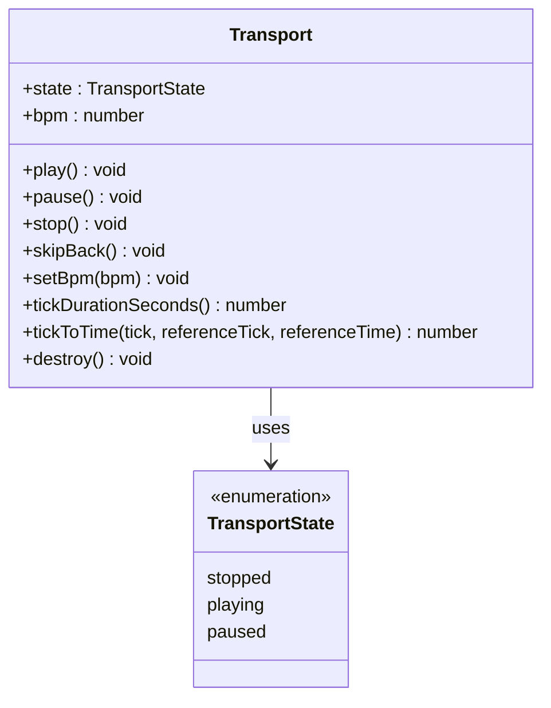

**Diagram sources**
- [transport.ts:9-23](file://src/renderer/src/engine/transport.ts#L9-L23)

**Section sources**
- [transport.ts:33-79](file://src/renderer/src/engine/transport.ts#L33-L79)

### Lookahead Scheduler Implementation
The scheduler implements a sophisticated timing system that bridges JavaScript timer imprecision with Web Audio API precision.

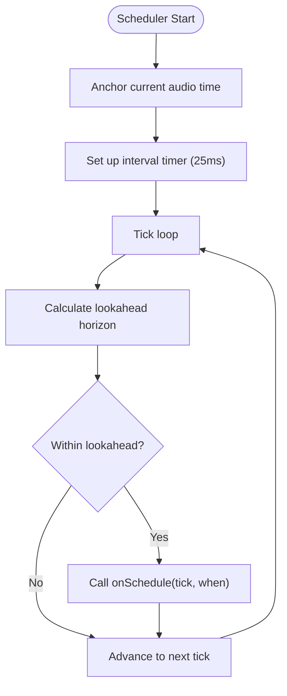

**Diagram sources**
- [scheduler.ts:75-87](file://src/renderer/src/engine/scheduler.ts#L75-L87)

**Section sources**
- [scheduler.ts:59-137](file://src/renderer/src/engine/scheduler.ts#L59-L137)

### Audio Engine Architecture
The audio engine manages the complete Web Audio API infrastructure with comprehensive voice and channel management.

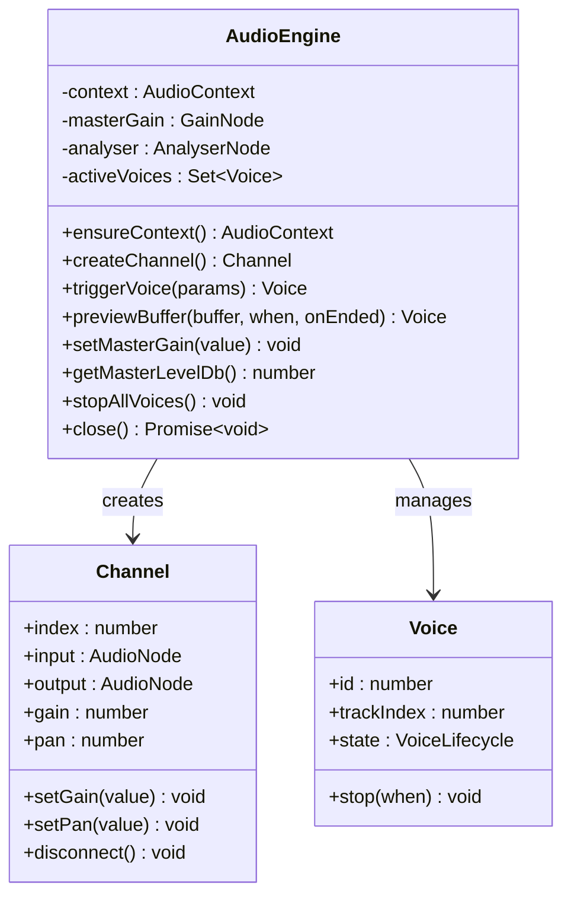

**Diagram sources**
- [audio-engine.ts:37-103](file://src/renderer/src/engine/audio-engine.ts#L37-L103)
- [channel.ts:23-60](file://src/renderer/src/engine/channel.ts#L23-L60)
- [voice.ts:32-75](file://src/renderer/src/engine/voice.ts#L32-L75)

**Section sources**
- [audio-engine.ts:37-204](file://src/renderer/src/engine/audio-engine.ts#L37-L204)

### Player Orchestration Layer
The Player class serves as the central coordinator for all audio engine components, managing the complete playback lifecycle.

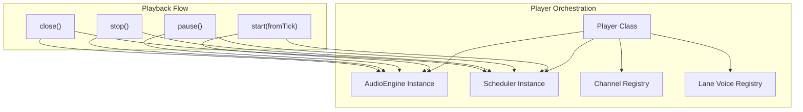

**Diagram sources**
- [player.ts:29-59](file://src/renderer/src/engine/player.ts#L29-L59)

**Section sources**
- [player.ts:29-230](file://src/renderer/src/engine/player.ts#L29-L230)

### Sample Processing Pipeline
Complete pipeline for sample loading, caching, and playback preparation.

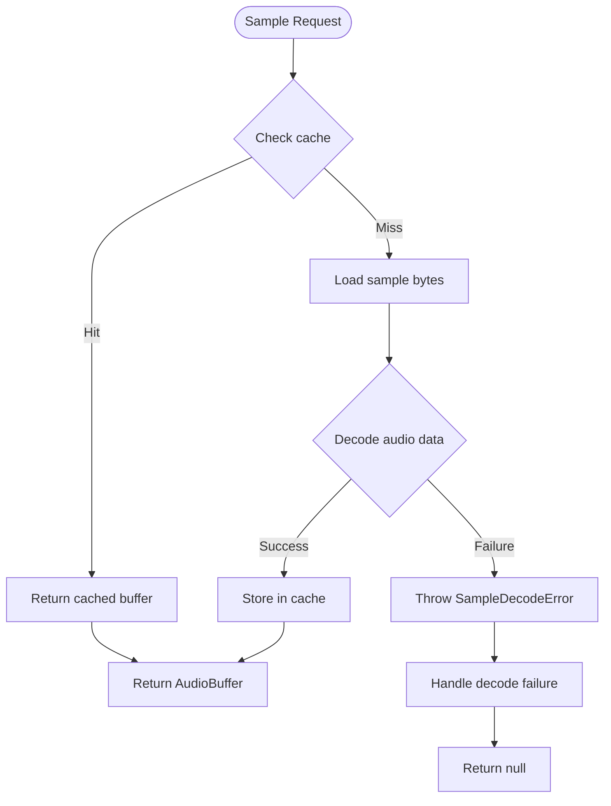

**Diagram sources**
- [sample-cache.ts:61-86](file://src/renderer/src/engine/sample-cache.ts#L61-L86)

**Section sources**
- [sample-cache.ts:27-107](file://src/renderer/src/engine/sample-cache.ts#L27-L107)

### Lane Evaluation and Trigger Management
System for determining which clips should trigger at specific ticks, respecting mute/solo states and monophonic rules.

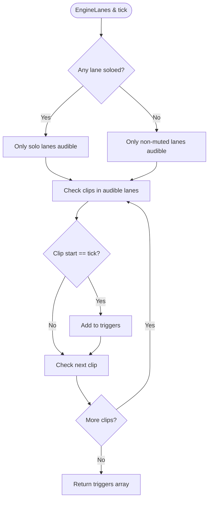

**Diagram sources**
- [lane-evaluation.ts:53-72](file://src/renderer/src/engine/lane-evaluation.ts#L53-L72)

**Section sources**
- [lane-evaluation.ts:16-73](file://src/renderer/src/engine/lane-evaluation.ts#L16-L73)

## Dependency Analysis
The audio engine components have well-defined dependencies that maintain loose coupling while enabling tight coordination.

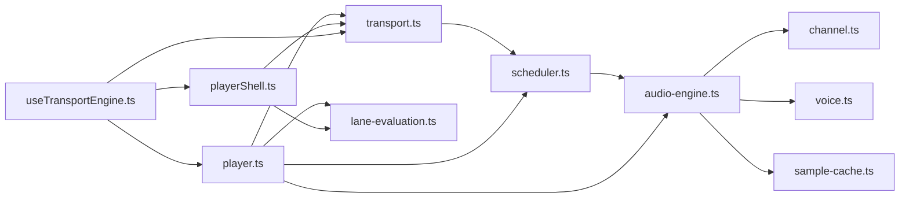

**Diagram sources**
- [transport.ts:13](file://src/renderer/src/engine/transport.ts#L13)
- [scheduler.ts:13](file://src/renderer/src/engine/scheduler.ts#L13)
- [audio-engine.ts:9-11](file://src/renderer/src/engine/audio-engine.ts#L9-L11)
- [player.ts:9-13](file://src/renderer/src/engine/player.ts#L9-L13)
- [useTransportEngine.ts:18-19](file://src/renderer/src/hooks/useTransportEngine.ts#L18-L19)

**Section sources**
- [transport.ts:1-79](file://src/renderer/src/engine/transport.ts#L1-L79)
- [scheduler.ts:1-137](file://src/renderer/src/engine/scheduler.ts#L1-L137)
- [audio-engine.ts:1-204](file://src/renderer/src/engine/audio-engine.ts#L1-L204)
- [player.ts:1-230](file://src/renderer/src/engine/player.ts#L1-L230)
- [playerShell.ts:1-202](file://src/renderer/src/lib/playerShell.ts#L1-L202)
- [useTransportEngine.ts:1-315](file://src/renderer/src/hooks/useTransportEngine.ts#L1-L315)

## Performance Considerations

### Timing Precision and Latency Optimization
The lookahead scheduler provides sample-accurate timing by bridging JavaScript timer imprecision with Web Audio API precision. The system uses absolute time scheduling to eliminate cumulative timing errors.

**Key Performance Features:**
- 25ms interval timing with 100ms lookahead window
- Self-correcting mechanism that catches up from audio clock drift
- Absolute AudioContext time scheduling prevents timer jitter accumulation
- Configurable timing parameters optimize for different use cases

### Memory Management and Sample Caching
The sample cache implements an LRU eviction policy to prevent unbounded memory growth while maintaining frequently accessed samples in memory.

**Memory Optimization Features:**
- Configurable maximum cache entries (default 64)
- Deduplicated in-flight decode requests prevent race conditions
- Automatic eviction of least-recently-used samples
- Efficient buffer reuse reduces garbage collection pressure

### Audio Thread Safety and Real-time Processing
The engine maintains strict separation between UI and audio threads, with all Web Audio API operations occurring on the audio thread.

**Real-time Processing Features:**
- All AudioBufferSourceNode operations on audio thread
- Voice lifecycle managed through proper event handling
- Channel connections established once and reused
- Master metering performed asynchronously to avoid blocking

### UI Integration and Render Performance
The tracker interface efficiently updates the playhead position and visual feedback without impacting audio performance.

**UI Performance Features:**
- Visual playhead derived from audio clock, not separate timer
- Minimal state updates during playback
- Efficient lane rendering with optimized clip positioning
- Master level meter updates at reduced frequency

## Troubleshooting Guide

### Common Issues and Solutions

**Transport Not Advancing**
- Verify transport state transitions: stopped → playing → paused → stopped
- Check that scheduler is running and receiving tick events
- Ensure BPM is set to positive value (> 0)
- Confirm that transport.play() is called and scheduler.start() is executed

**Audio Dropouts or Glitches**
- Verify lookahead window is sufficient (≥ 50ms for typical use cases)
- Check that scheduler interval is appropriate (20-30ms recommended)
- Monitor active voice count - excessive voices can cause buffer underruns
- Ensure sample cache has adequate decoded buffers loaded

**Timing Drift or Desynchronization**
- Confirm that visual playhead is derived from Player.currentTick, not transport state
- Verify that all scheduling uses absolute AudioContext time
- Check that scheduler anchors are properly maintained during pause/resume
- Ensure transport state changes don't interfere with scheduler timing

**Sample Loading Failures**
- Verify sample file integrity and format compatibility
- Check that sample cache is properly configured with sufficient capacity
- Confirm that decode errors are handled gracefully without crashing engine
- Ensure file permissions allow sample access through IPC

**Section sources**
- [transport.ts:46-66](file://src/renderer/src/engine/transport.ts#L46-L66)
- [scheduler.ts:75-87](file://src/renderer/src/engine/scheduler.ts#L75-L87)
- [sample-cache.ts:77-82](file://src/renderer/src/engine/sample-cache.ts#L77-L82)

## Conclusion
MixJam Electron's enhanced audio engine provides a comprehensive, production-ready solution for tracker-style audio playback. The layered architecture ensures clean separation of concerns while maintaining tight integration between timing, scheduling, and audio processing components. The lookahead scheduler pattern delivers sample-accurate timing with minimal latency, while the orchestration layer manages complex playback scenarios including monophonic behavior, preview functionality, and real-time parameter changes. The system's modular design enables future enhancements while maintaining stability and performance for the core tracker playback experience.

## Appendices

### Transport State Machine
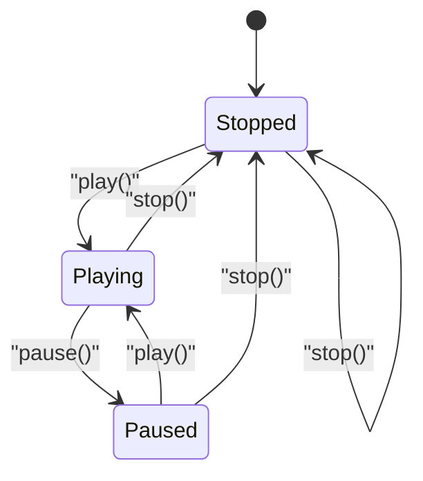

**Diagram sources**
- [transport.ts:46-58](file://src/renderer/src/engine/transport.ts#L46-L58)

### Playback Lifecycle Management
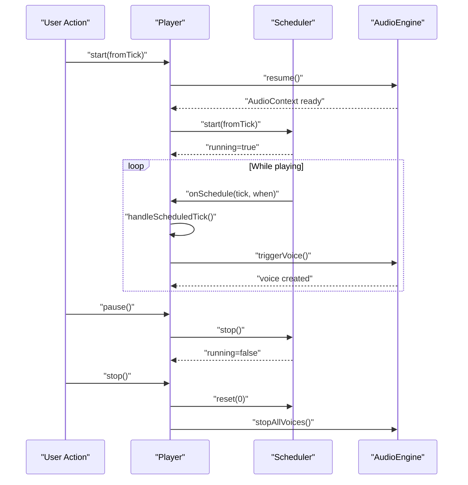

**Diagram sources**
- [player.ts:145-174](file://src/renderer/src/engine/player.ts#L145-L174)
- [scheduler.ts:94-116](file://src/renderer/src/engine/scheduler.ts#L94-L116)

### Timeline Visualization and Playback Coordination
The tracker interface maintains perfect synchronization between visual playhead and audio output through the Player's currentTick property, which is derived from the audio clock rather than a separate timer.

**Section sources**
- [useTransportEngine.ts:149-154](file://src/renderer/src/hooks/useTransportEngine.ts#L149-L154)
- [player.ts:67-69](file://src/renderer/src/engine/player.ts#L67-L69)
- [TrackerView.tsx:115-122](file://src/renderer/src/components/TrackerView.tsx#L115-L122)