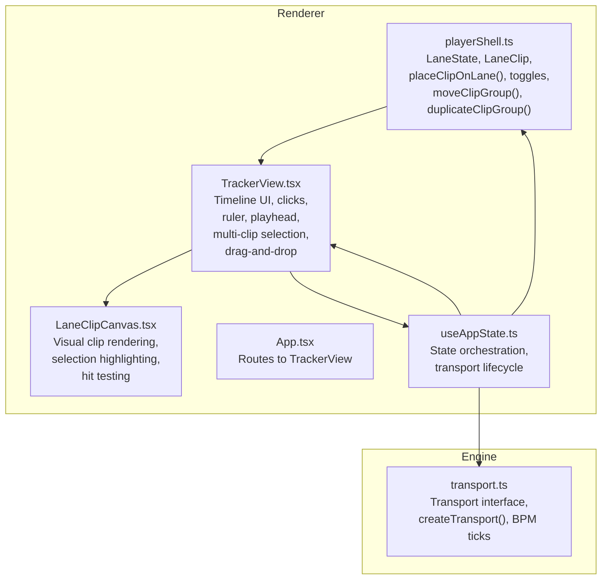
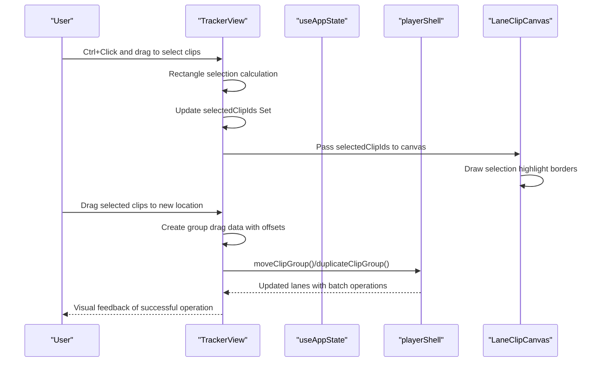
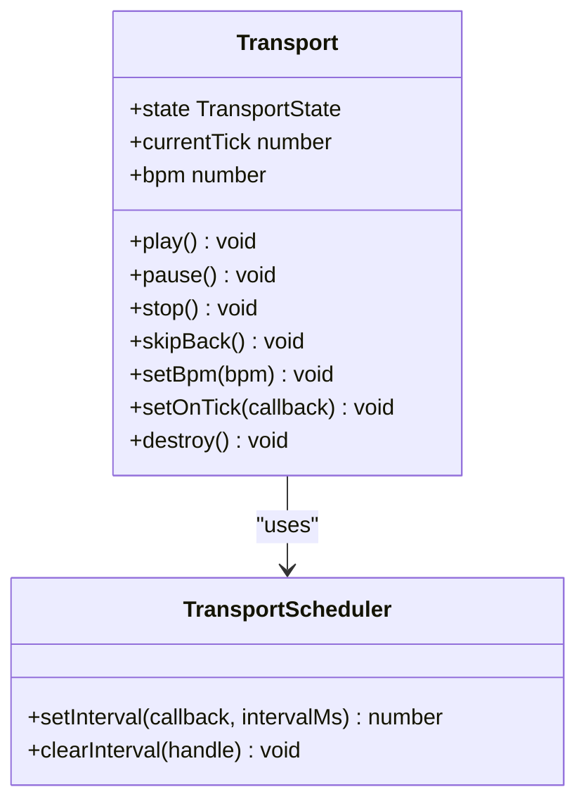
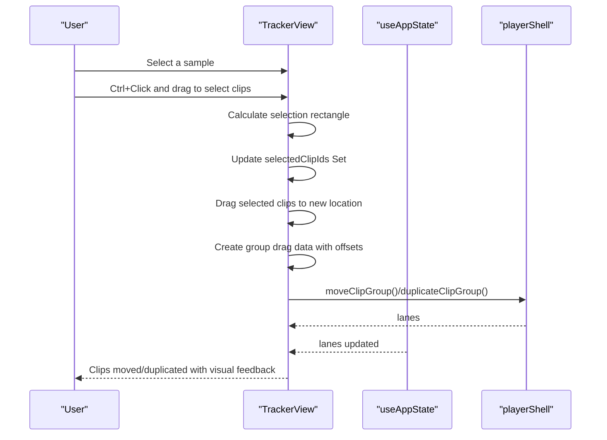
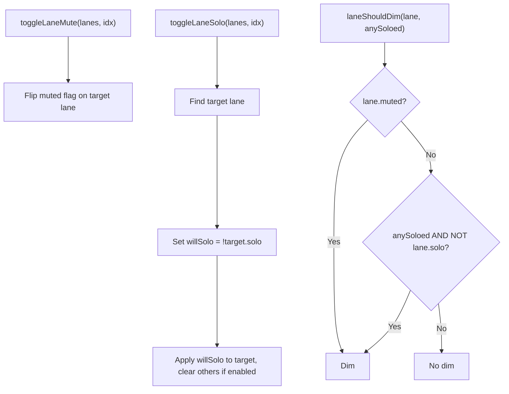
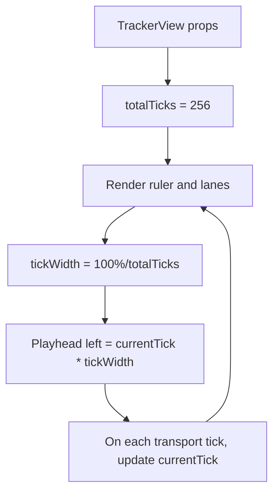
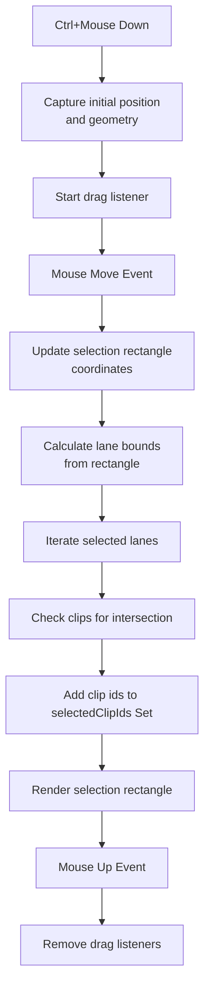
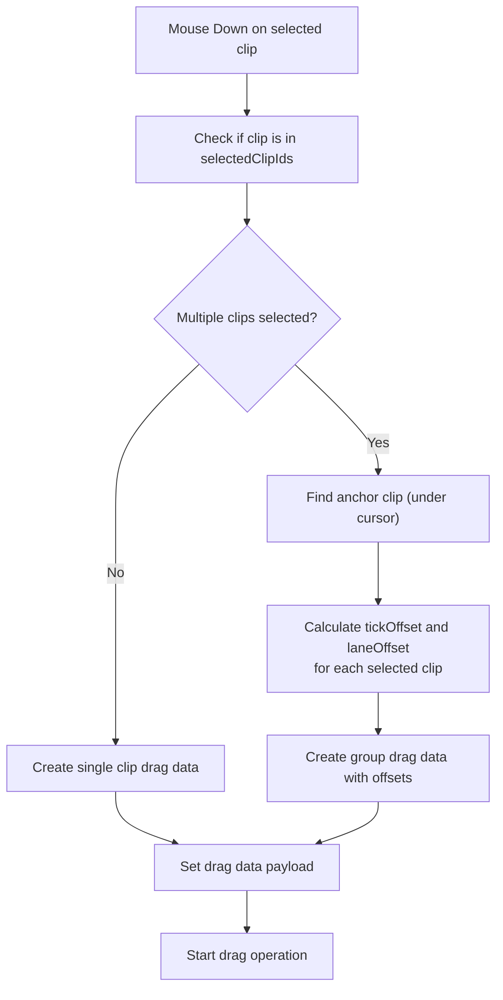
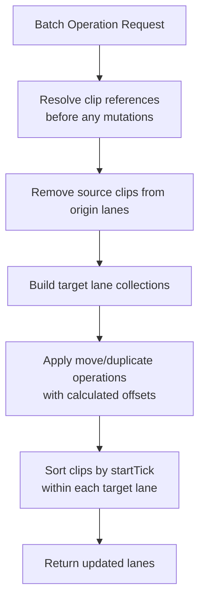
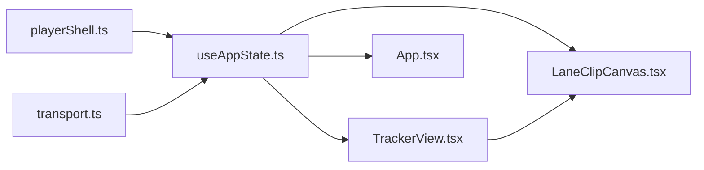

# Player Shell

<cite>
**Referenced Files in This Document**
- [playerShell.ts](file://src/renderer/src/lib/playerShell.ts)
- [transport.ts](file://src/renderer/src/engine/transport.ts)
- [TrackerView.tsx](file://src/renderer/src/components/TrackerView.tsx)
- [LaneClipCanvas.tsx](file://src/renderer/src/components/LaneClipCanvas.tsx)
- [useAppState.ts](file://src/renderer/src/hooks/useAppState.ts)
- [App.tsx](file://src/renderer/src/App.tsx)
- [spec-006-player-timeline-panels.md](file://docs/specs/spec-006-player-timeline-panels.md)
- [spec-005-audio-playback-engine.md](file://docs/specs/spec-005-audio-playback-engine.md)
- [spec-007-mixer.md](file://docs/specs/spec-007-mixer.md)
- [playerShell.test.ts](file://src/renderer/src/lib/playerShell.test.ts)
- [transport.test.ts](file://src/renderer/src/engine/transport.test.ts)
</cite>

## Update Summary
**Changes Made**
- Added comprehensive multi-clip selection system with rectangular selection
- Enhanced drag-and-drop operations with group manipulation capabilities
- Improved clip management functionality with batch operations
- Updated lane state management to support selection highlighting
- Added group duplication and movement operations

## Table of Contents
1. [Introduction](#introduction)
2. [Project Structure](#project-structure)
3. [Core Components](#core-components)
4. [Architecture Overview](#architecture-overview)
5. [Detailed Component Analysis](#detailed-component-analysis)
6. [Multi-Clip Selection System](#multi-clip-selection-system)
7. [Enhanced Drag-and-Drop Operations](#enhanced-drag-and-drop-operations)
8. [Group Manipulation Capabilities](#group-manipulation-capabilities)
9. [Dependency Analysis](#dependency-analysis)
10. [Performance Considerations](#performance-considerations)
11. [Troubleshooting Guide](#troubleshooting-guide)
12. [Conclusion](#conclusion)
13. [Appendices](#appendices)

## Introduction
This document describes the Player Shell system that powers lane-based audio playback and timeline arrangement. It covers the lane management architecture, clip placement algorithms, and integration patterns with the transport system. The system now includes comprehensive multi-clip selection capabilities with rectangular selection, enhanced drag-and-drop operations, and group manipulation functionality. It explains how timeline events trigger audio playback, how lane state is managed, how clips are positioned, and how the tracker interface translates user interactions into audio events. It also documents the architectural patterns used to manage multiple simultaneous audio streams and maintain synchronization with the transport system.

## Project Structure
The Player Shell spans three layers with enhanced selection and manipulation capabilities:
- Data and algorithms: lane state, clip placement, lane toggles, and multi-clip operations
- Transport engine: BPM-controlled tick progression and callbacks
- UI tracker: timeline visualization, ruler, playhead, user interactions, and selection rectangles

**Diagram sources**
- [playerShell.ts:1-297](file://src/renderer/src/lib/playerShell.ts#L1-L297)
- [transport.ts:1-118](file://src/renderer/src/engine/transport.ts#L1-L118)
- [TrackerView.tsx:1-922](file://src/renderer/src/components/TrackerView.tsx#L1-L922)
- [LaneClipCanvas.tsx:1-290](file://src/renderer/src/components/LaneClipCanvas.tsx#L1-L290)
- [useAppState.ts:1-295](file://src/renderer/src/hooks/useAppState.ts#L1-L295)
- [App.tsx:1-108](file://src/renderer/src/App.tsx#L1-L108)

**Section sources**
- [playerShell.ts:1-297](file://src/renderer/src/lib/playerShell.ts#L1-L297)
- [transport.ts:1-118](file://src/renderer/src/engine/transport.ts#L1-L118)
- [TrackerView.tsx:1-922](file://src/renderer/src/components/TrackerView.tsx#L1-L922)
- [LaneClipCanvas.tsx:1-290](file://src/renderer/src/components/LaneClipCanvas.tsx#L1-L290)
- [useAppState.ts:1-295](file://src/renderer/src/hooks/useAppState.ts#L1-L295)
- [App.tsx:1-108](file://src/renderer/src/App.tsx#L1-L108)

## Core Components
- LaneState: immutable array of 16 lanes, each with index, name, mute/solo flags, pan, and ordered clips
- LaneClip: immutable clip descriptor with id, sample path/name, start tick, duration in ticks, duration in seconds, and color
- Transport: BPM-driven tick source emitting currentTick events
- TrackerView: renders ruler, lanes, playhead, selection rectangles, and handles user interactions including multi-clip selection
- LaneClipCanvas: renders individual lane clip canvases with selection highlighting and hit testing

Key behaviors:
- Clip placement trims overlapping clips while preserving non-overlapping segments
- Mute/solo toggles update lane flags and influence visual dimming
- Transport drives timeline progression and UI updates
- Multi-clip selection via rectangular selection with Ctrl+mouse drag
- Group drag-and-drop operations with batch processing
- Enhanced clip management with move/duplicate operations

**Section sources**
- [playerShell.ts:20-40](file://src/renderer/src/lib/playerShell.ts#L20-L40)
- [playerShell.ts:101-132](file://src/renderer/src/lib/playerShell.ts#L101-L132)
- [transport.ts:19-31](file://src/renderer/src/engine/transport.ts#L19-L31)
- [transport.ts:39-116](file://src/renderer/src/engine/transport.ts#L39-L116)
- [TrackerView.tsx:27-67](file://src/renderer/src/components/TrackerView.tsx#L27-L67)
- [LaneClipCanvas.tsx:4-29](file://src/renderer/src/components/LaneClipCanvas.tsx#L4-L29)

## Architecture Overview
The Player Shell follows a clean separation of concerns with enhanced selection and manipulation capabilities:
- UI tracker renders the timeline, selection rectangles, and reacts to user input
- State orchestration hook manages lanes, transport lifecycle, selection state, and UI callbacks
- Transport provides deterministic BPM-aligned ticks
- Lane algorithms enforce monophonic clipping behavior and state transitions
- Multi-clip selection system enables rectangular selection and group operations
- Enhanced drag-and-drop system supports batch clip operations

**Diagram sources**
- [TrackerView.tsx:203-262](file://src/renderer/src/components/TrackerView.tsx#L203-L262)
- [TrackerView.tsx:341-423](file://src/renderer/src/components/TrackerView.tsx#L341-L423)
- [LaneClipCanvas.tsx:177-189](file://src/renderer/src/components/LaneClipCanvas.tsx#L177-L189)
- [playerShell.ts:233-280](file://src/renderer/src/lib/playerShell.ts#L233-L280)

## Detailed Component Analysis

### Lane Management and Clip Placement
The lane system models 16 lanes with immutable state and deterministic clip ordering. Clip placement enforces monophonic behavior by trimming overlapping segments rather than dropping them entirely. Sorting ensures clips remain ordered by startTick.

**Diagram sources**
- [playerShell.ts:93-127](file://src/renderer/src/lib/playerShell.ts#L93-L127)

Behavior highlights validated by tests:
- Default constants for lanes and clip durations
- Proper sorting after multiple placements
- Monophonic trimming at overlap boundaries
- Non-overlapping lanes unaffected by placement

**Section sources**
- [playerShell.ts:8-11](file://src/renderer/src/lib/playerShell.ts#L8-L11)
- [playerShell.ts:29-37](file://src/renderer/src/lib/playerShell.ts#L29-L37)
- [playerShell.ts:93-127](file://src/renderer/src/lib/playerShell.ts#L93-L127)
- [playerShell.test.ts:15-28](file://src/renderer/src/lib/playerShell.test.ts#L15-L28)
- [playerShell.test.ts:46-103](file://src/renderer/src/lib/playerShell.test.ts#L46-L103)

### Transport System Integration
The Transport module generates BPM-aligned ticks at a fixed subdivision per beat. It supports play, pause, stop, skipBack, and dynamic BPM changes. The onTick callback enables UI updates and future audio scheduling integration.

**Diagram sources**
- [transport.ts:19-31](file://src/renderer/src/engine/transport.ts#L19-L31)
- [transport.ts:7-17](file://src/renderer/src/engine/transport.ts#L7-L17)
- [transport.ts:39-116](file://src/renderer/src/engine/transport.ts#L39-L116)

Integration points:
- useAppState creates and destroys the Transport instance when entering/exiting the tracker view
- Transport state and currentTick are exposed to TrackerView for UI rendering and controls
- BPM changes propagate to both UI and engine layers

**Section sources**
- [transport.ts:1-118](file://src/renderer/src/engine/transport.ts#L1-L118)
- [useAppState.ts:158-187](file://src/renderer/src/hooks/useAppState.ts#L158-L187)
- [useAppState.ts:243-260](file://src/renderer/src/hooks/useAppState.ts#L243-L260)
- [transport.test.ts:18-151](file://src/renderer/src/engine/transport.test.ts#L18-L151)

### Tracker UI and Interaction Model
TrackerView renders:
- A ruler with bar markers and tick spacing
- 16 lanes with mute/solo controls and clip canvases
- A moving playhead synchronized to transport ticks
- Transport controls in the middle strip
- Selection rectangles during multi-clip selection
- Visual feedback for selected clips

User interactions:
- Clicking a lane canvas places the selected sample at the nearest tick boundary
- Ctrl+Click and drag creates rectangular selection rectangles
- Toggle mute/solo updates lane state and influences visual dimming
- Transport controls start/pause/stop/skipBack control playback
- Dragging clips performs move or duplicate operations based on modifier keys

**Diagram sources**
- [TrackerView.tsx:203-262](file://src/renderer/src/components/TrackerView.tsx#L203-L262)
- [TrackerView.tsx:341-423](file://src/renderer/src/components/TrackerView.tsx#L341-L423)
- [useAppState.ts:225-233](file://src/renderer/src/hooks/useAppState.ts#L225-L233)
- [playerShell.ts:233-280](file://src/renderer/src/lib/playerShell.ts#L233-L280)

**Section sources**
- [TrackerView.tsx:1-922](file://src/renderer/src/components/TrackerView.tsx#L1-L922)
- [App.tsx:75-96](file://src/renderer/src/App.tsx#L75-L96)

### Lane State Management and Visual Dimming
Lane state toggles are coordinated through useAppState:
- Mute toggles only the target lane
- Solo toggles transfer solo state across lanes and clears others when enabling
- Visual dimming depends on mute flag and whether any lane is soloed

**Diagram sources**
- [playerShell.ts:133-164](file://src/renderer/src/lib/playerShell.ts#L133-L164)
- [useAppState.ts:235-241](file://src/renderer/src/hooks/useAppState.ts#L235-L241)
- [useAppState.ts:281-282](file://src/renderer/src/hooks/useAppState.ts#L281-L282)

**Section sources**
- [playerShell.ts:133-164](file://src/renderer/src/lib/playerShell.ts#L133-L164)
- [useAppState.ts:235-241](file://src/renderer/src/hooks/useAppState.ts#L235-L241)
- [useAppState.ts:281-282](file://src/renderer/src/hooks/useAppState.ts#L281-L282)
- [playerShell.test.ts:105-143](file://src/renderer/src/lib/playerShell.test.ts#L105-L143)
- [playerShell.test.ts:145-165](file://src/renderer/src/lib/playerShell.test.ts#L145-L165)

### Timeline Representation and Playhead Synchronization
The UI represents time in ticks over a fixed timeline length. The playhead's position is computed from currentTick and pixel-per-tick scaling. The ruler displays bar markers and tick intervals.

**Diagram sources**
- [TrackerView.tsx:57](file://src/renderer/src/components/TrackerView.tsx#L57)
- [TrackerView.tsx:102-103](file://src/renderer/src/components/TrackerView.tsx#L102-L103)
- [TrackerView.tsx:144-145](file://src/renderer/src/components/TrackerView.tsx#L144-L145)

**Section sources**
- [TrackerView.tsx:57-98](file://src/renderer/src/components/TrackerView.tsx#L57-L98)
- [TrackerView.tsx:132-152](file://src/renderer/src/components/TrackerView.tsx#L132-L152)

### Integration with the Audio Playback Engine (Speculative)
The Player Shell's data model aligns with the audio engine's lane concept:
- Each lane corresponds to a mono/stereo lane with optional channel routing
- Clips define start ticks and durations for precise scheduling
- Solo overrides mute during playback evaluation
- Default routing maps lanes to channels (1:1 for 16 lanes)

Note: The audio engine is defined in specification and not yet implemented in this repository snapshot.

**Section sources**
- [spec-005-audio-playback-engine.md:106-125](file://docs/specs/spec-005-audio-playback-engine.md#L106-L125)
- [spec-007-mixer.md:75-81](file://docs/specs/spec-007-mixer.md#L75-L81)

## Multi-Clip Selection System

### Rectangular Selection Implementation
The Player Shell now supports comprehensive multi-clip selection through rectangular selection:
- Ctrl+Click and drag creates selection rectangles over multiple lanes
- Selection algorithm calculates intersecting clips within the rectangle bounds
- Selected clips are tracked in a Set for efficient lookups
- Visual selection rectangles are rendered during drag operations

**Diagram sources**
- [TrackerView.tsx:203-262](file://src/renderer/src/components/TrackerView.tsx#L203-L262)

### Selection State Management
The selection system maintains state through React hooks:
- selectedClipIds: Set<string> containing currently selected clip identifiers
- selectionRect: Object defining rectangle coordinates for visual feedback
- dragCleanupRef: Reference to cleanup drag event listeners

Selection behavior:
- Single clicks clear existing selections unless Ctrl is held
- Ctrl+Click adds to existing selection or creates new selection
- Shift+Click could extend selection in future implementations
- Selection persists until cleared by clicking elsewhere

**Section sources**
- [TrackerView.tsx:190-197](file://src/renderer/src/components/TrackerView.tsx#L190-L197)
- [TrackerView.tsx:203-262](file://src/renderer/src/components/TrackerView.tsx#L203-L262)

### Visual Selection Feedback
Selected clips receive visual highlighting:
- White selection borders with 2px width around clip bubbles
- Selection borders inset slightly to avoid expanding clip footprint
- Selection rectangles rendered as semi-transparent overlays during drag
- Individual clip selection state passed to LaneClipCanvas for rendering

**Section sources**
- [LaneClipCanvas.tsx:67-68](file://src/renderer/src/components/LaneClipCanvas.tsx#L67-L68)
- [LaneClipCanvas.tsx:177-189](file://src/renderer/src/components/LaneClipCanvas.tsx#L177-L189)
- [TrackerView.tsx:524-530](file://src/renderer/src/components/TrackerView.tsx#L524-L530)

## Enhanced Drag-and-Drop Operations

### Group Drag Data Creation
The drag system supports both single and multi-clip operations:
- Single clip drag: Simple clipId payload
- Multi-clip drag: Complex group payload with offset calculations
- Offset preservation: Maintains relative positions within the selection group
- Anchor-based positioning: Uses the clip under the cursor as the drag anchor

**Diagram sources**
- [TrackerView.tsx:341-367](file://src/renderer/src/components/TrackerView.tsx#L341-L367)

### Drag Effect Handling
Drag effects are handled based on modifier keys:
- Shift+Drag: Duplicate operation (creates copies instead of moving originals)
- Standard Drag: Move operation (repositions existing clips)
- Drop targets: Handle both single and group payloads appropriately

**Section sources**
- [TrackerView.tsx:341-367](file://src/renderer/src/components/TrackerView.tsx#L341-L367)
- [TrackerView.tsx:397-423](file://src/renderer/src/components/TrackerView.tsx#L397-L423)

## Group Manipulation Capabilities

### Batch Operations Architecture
The Player Shell provides efficient batch operations for group manipulation:
- ClipGroupEntry interface defines the structure for batch operations
- moveClipGroup: Moves multiple clips in a single pass over lanes
- duplicateClipGroup: Duplicates multiple clips in a single pass
- Offset preservation: Maintains relative positions within the group
- Id collision prevention: Ensures unique clip IDs even with identical samples

**Diagram sources**
- [playerShell.ts:233-280](file://src/renderer/src/lib/playerShell.ts#L233-L280)

### Group Operation Algorithms
Batch operations use sophisticated algorithms to ensure data integrity:
- Pre-resolution: All clip references are resolved before any mutations
- Atomic operations: Entire group operations succeed or fail together
- Offset calculations: Relative positions are preserved across lanes and ticks
- Collision avoidance: Unique clip IDs prevent conflicts in batch operations

**Section sources**
- [playerShell.ts:224-228](file://src/renderer/src/lib/playerShell.ts#L224-L228)
- [playerShell.ts:233-280](file://src/renderer/src/lib/playerShell.ts#L233-L280)
- [playerShell.test.ts:327-410](file://src/renderer/src/lib/playerShell.test.ts#L327-L410)

### Integration with UI Components
The group manipulation system integrates seamlessly with the UI:
- TrackerView coordinates drag operations and passes data to playerShell
- LaneClipCanvas receives selection state for visual feedback
- Transport system remains unaffected by group operations
- User experience maintains responsiveness during complex operations

**Section sources**
- [TrackerView.tsx:341-423](file://src/renderer/src/components/TrackerView.tsx#L341-L423)
- [LaneClipCanvas.tsx:177-189](file://src/renderer/src/components/LaneClipCanvas.tsx#L177-L189)

## Dependency Analysis
The Player Shell composes four modules with clear boundaries and enhanced selection capabilities:
- playerShell.ts: Pure data and algorithms with batch operations
- transport.ts: Pure engine with scheduler abstraction
- TrackerView.tsx: UI presentation, selection rectangles, and interaction handling
- LaneClipCanvas.tsx: UI presentation with selection highlighting
- useAppState.ts: Orchestration and lifecycle management
- App.tsx: Application shell and routing

**Diagram sources**
- [playerShell.ts:1-297](file://src/renderer/src/lib/playerShell.ts#L1-L297)
- [transport.ts:1-118](file://src/renderer/src/engine/transport.ts#L1-L118)
- [TrackerView.tsx:1-922](file://src/renderer/src/components/TrackerView.tsx#L1-L922)
- [LaneClipCanvas.tsx:1-290](file://src/renderer/src/components/LaneClipCanvas.tsx#L1-L290)
- [useAppState.ts:1-295](file://src/renderer/src/hooks/useAppState.ts#L1-L295)
- [App.tsx:1-108](file://src/renderer/src/App.tsx#L1-L108)

**Section sources**
- [useAppState.ts:165-177](file://src/renderer/src/hooks/useAppState.ts#L165-L177)
- [App.tsx:75-96](file://src/renderer/src/App.tsx#L75-L96)

## Performance Considerations
- Immutable updates: playerShell functions return new arrays/objects, enabling efficient React reconciliation and predictable state updates
- Sorting cost: Clip sorting occurs after placement; with typical small per-lane clip counts, this remains inexpensive
- Rendering efficiency: Clips are styled with left/top and width calculations; keeping DOM nodes minimal reduces layout thrash
- Transport tick cadence: BPM-derived tick intervals avoid tight loops; scheduler abstraction enables testability and potential optimizations
- Selection performance: Set-based selection tracking provides O(1) lookup performance for clip selection state
- Batch operations: Group operations process all clips in a single pass, reducing computational overhead compared to individual operations
- Memory efficiency: Selection rectangles are temporary and cleaned up on drag completion

## Troubleshooting Guide
Common issues and diagnostics:
- Clips not appearing: Verify selected sample path is set and nearestTick clamps to timeline bounds
- Overlapping clips disappearing: Confirm monophonic trimming behavior; overlapping segments are preserved as head/tail
- Mute/solo not taking effect: Ensure toggle functions are invoked with correct lane indices and that UI applies dim classes conditionally
- Transport not updating UI: Confirm setOnTick callback is registered and transport state transitions are reflected in props
- Multi-clip selection not working: Verify Ctrl+Click functionality and that selection rectangles render during drag operations
- Group drag-and-drop failing: Check that drag data contains proper group offsets and that target lanes exist
- Selection highlighting not visible: Ensure selectedClipIds Set contains the correct clip identifiers and that canvas receives the selection state

Validation references:
- Transport state transitions and onTick firing
- Player shell clip placement and sorting invariants
- UI click-to-tick calculation and lane canvas interaction
- Multi-clip selection rectangle rendering and hit testing
- Group operation batch processing and offset calculations

**Section sources**
- [transport.test.ts:18-151](file://src/renderer/src/engine/transport.test.ts#L18-L151)
- [playerShell.test.ts:46-103](file://src/renderer/src/lib/playerShell.test.ts#L46-L103)
- [TrackerView.tsx:203-262](file://src/renderer/src/components/TrackerView.tsx#L203-L262)
- [LaneClipCanvas.tsx:177-189](file://src/renderer/src/components/LaneClipCanvas.tsx#L177-L189)

## Conclusion
The Player Shell establishes a robust foundation for lane-based audio arrangement and playback with comprehensive multi-clip selection capabilities:
- Immutable lane and clip models simplify state management
- Monophonic clip placement preserves musical continuity
- Transport-driven ticks synchronize UI and future audio engine integration
- Multi-clip selection enables efficient batch operations and complex arrangements
- Enhanced drag-and-drop system supports both individual and group manipulations
- Clear separation of concerns enables incremental development of the audio engine and mixer

## Appendices

### Example Workflows

- Place a clip on a lane
  - Select a sample in the browser
  - Click within a lane canvas to compute the nearest tick
  - Invoke the placement function; observe sorted, trimmed clips
  - Reference: [TrackerView.tsx:59-65](file://src/renderer/src/components/TrackerView.tsx#L59-L65), [playerShell.ts:93-127](file://src/renderer/src/lib/playerShell.ts#L93-L127)

- Toggle mute/solo
  - Click mute/solo button in the lane head
  - Observe immediate visual dimming and state updates
  - Reference: [TrackerView.tsx:113-129](file://src/renderer/src/components/TrackerView.tsx#L113-L129), [playerShell.ts:133-164](file://src/renderer/src/lib/playerShell.ts#L133-L164)

- Control transport
  - Use middle strip controls to play/pause/stop/skipBack
  - Watch transport state and playhead movement
  - Reference: [TrackerView.tsx:162-183](file://src/renderer/src/components/TrackerView.tsx#L162-L183), [transport.ts:76-96](file://src/renderer/src/engine/transport.ts#L76-L96)

- **Updated** Multi-clip selection
  - Hold Ctrl and drag to create a rectangular selection
  - Observe selection rectangle and highlighted clips
  - Reference: [TrackerView.tsx:203-262](file://src/renderer/src/components/TrackerView.tsx#L203-L262), [LaneClipCanvas.tsx:177-189](file://src/renderer/src/components/LaneClipCanvas.tsx#L177-L189)

- **Updated** Group drag-and-drop
  - Select multiple clips using Ctrl+drag
  - Drag the selection to a new location
  - Use Shift+Drag for duplication instead of moving
  - Reference: [TrackerView.tsx:341-423](file://src/renderer/src/components/TrackerView.tsx#L341-L423), [playerShell.ts:233-280](file://src/renderer/src/lib/playerShell.ts#L233-L280)

### Specifications Alignment
- Timeline panels and ruler/lane/playhead expectations
- Transport tick resolution and BPM behavior
- Mixer routing and channel controls
- Multi-clip selection and group manipulation requirements

**Section sources**
- [spec-006-player-timeline-panels.md:88-137](file://docs/specs/spec-006-player-timeline-panels.md#L88-L137)
- [spec-005-audio-playback-engine.md:32-46](file://docs/specs/spec-005-audio-playback-engine.md#L32-L46)
- [spec-007-mixer.md:27-44](file://docs/specs/spec-007-mixer.md#L27-L44)