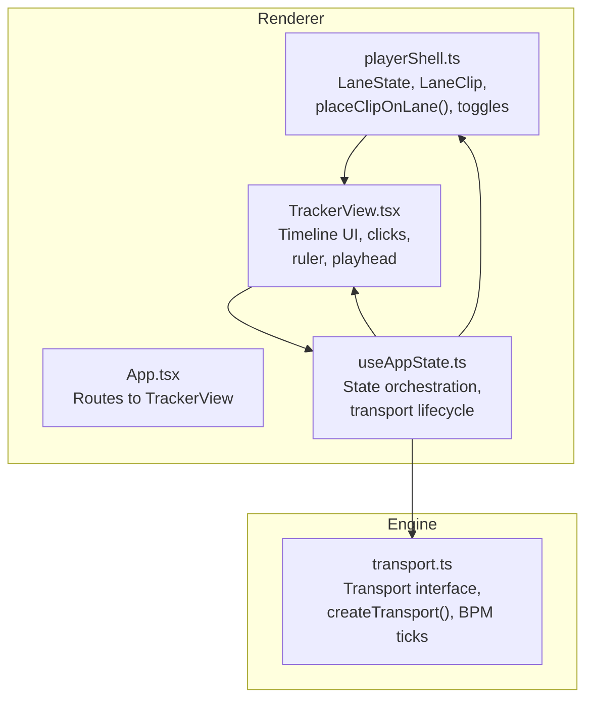
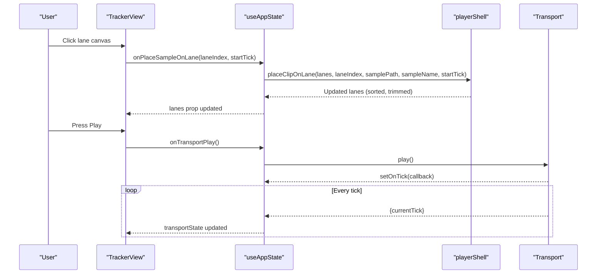
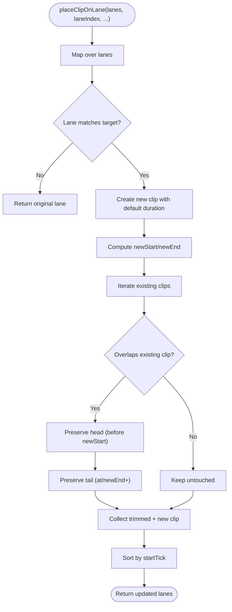
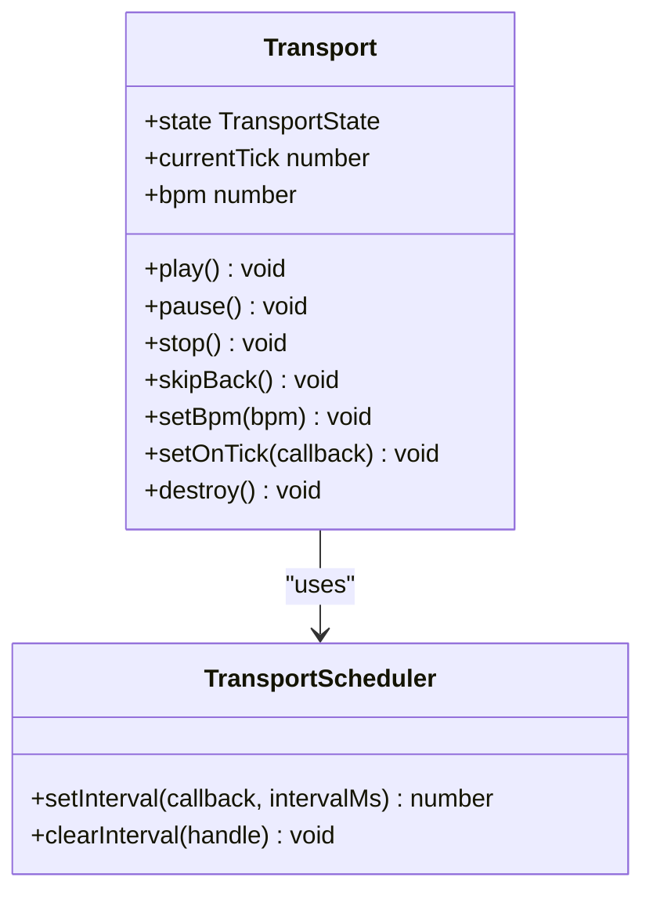
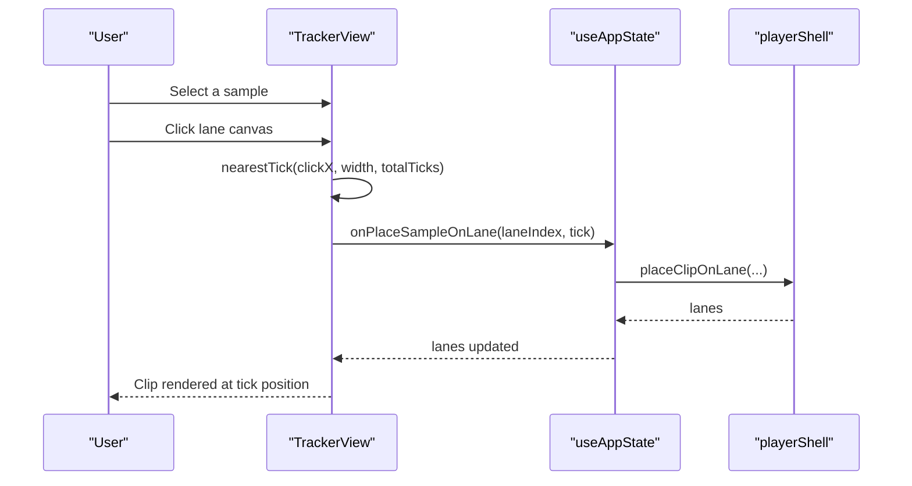
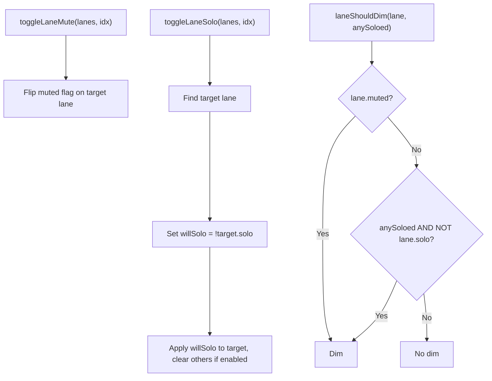
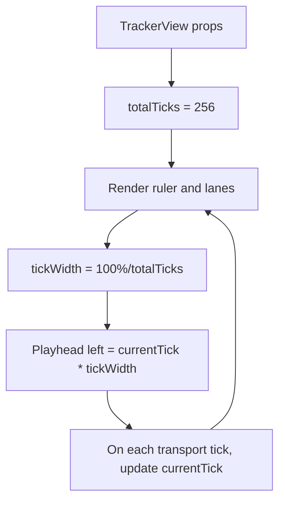
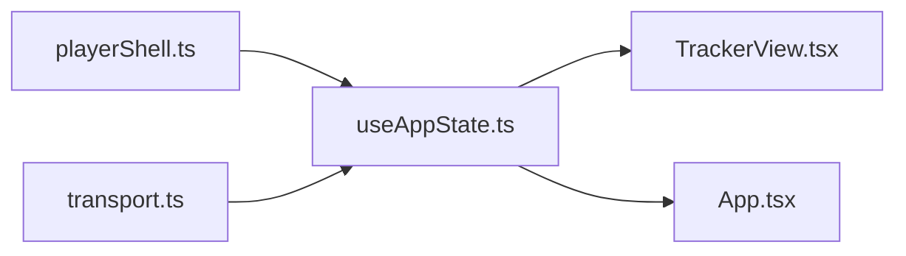

# Player Shell

<cite>
**Referenced Files in This Document**
- [playerShell.ts](file://src/renderer/src/lib/playerShell.ts)
- [transport.ts](file://src/renderer/src/engine/transport.ts)
- [TrackerView.tsx](file://src/renderer/src/components/TrackerView.tsx)
- [useAppState.ts](file://src/renderer/src/hooks/useAppState.ts)
- [App.tsx](file://src/renderer/src/App.tsx)
- [spec-006-player-timeline-panels.md](file://docs/specs/spec-006-player-timeline-panels.md)
- [spec-005-audio-playback-engine.md](file://docs/specs/spec-005-audio-playback-engine.md)
- [spec-007-mixer.md](file://docs/specs/spec-007-mixer.md)
- [playerShell.test.ts](file://src/renderer/src/lib/playerShell.test.ts)
- [transport.test.ts](file://src/renderer/src/engine/transport.test.ts)
</cite>

## Table of Contents
1. [Introduction](#introduction)
2. [Project Structure](#project-structure)
3. [Core Components](#core-components)
4. [Architecture Overview](#architecture-overview)
5. [Detailed Component Analysis](#detailed-component-analysis)
6. [Dependency Analysis](#dependency-analysis)
7. [Performance Considerations](#performance-considerations)
8. [Troubleshooting Guide](#troubleshooting-guide)
9. [Conclusion](#conclusion)
10. [Appendices](#appendices)

## Introduction
This document describes the Player Shell system that powers lane-based audio playback and timeline arrangement. It covers the lane management architecture, clip placement algorithms, and integration patterns with the transport system. It explains how timeline events trigger audio playback, how lane state is managed, how clips are positioned, and how the tracker interface translates user interactions into audio events. It also documents the architectural patterns used to manage multiple simultaneous audio streams and maintain synchronization with the transport system.

## Project Structure
The Player Shell spans three layers:
- Data and algorithms: lane state, clip placement, and lane toggles
- Transport engine: BPM-controlled tick progression and callbacks
- UI tracker: timeline visualization, ruler, playhead, and user interactions

**Diagram sources**
- [playerShell.ts:1-132](file://src/renderer/src/lib/playerShell.ts#L1-L132)
- [transport.ts:1-118](file://src/renderer/src/engine/transport.ts#L1-L118)
- [TrackerView.tsx:1-270](file://src/renderer/src/components/TrackerView.tsx#L1-L270)
- [useAppState.ts:1-295](file://src/renderer/src/hooks/useAppState.ts#L1-L295)
- [App.tsx:1-108](file://src/renderer/src/App.tsx#L1-L108)

**Section sources**
- [playerShell.ts:1-132](file://src/renderer/src/lib/playerShell.ts#L1-L132)
- [transport.ts:1-118](file://src/renderer/src/engine/transport.ts#L1-L118)
- [TrackerView.tsx:1-270](file://src/renderer/src/components/TrackerView.tsx#L1-L270)
- [useAppState.ts:1-295](file://src/renderer/src/hooks/useAppState.ts#L1-L295)
- [App.tsx:1-108](file://src/renderer/src/App.tsx#L1-L108)

## Core Components
- LaneState: immutable array of 16 lanes, each with index, name, mute/solo flags, and ordered clips
- LaneClip: immutable clip descriptor with id, sample path/name, start tick, and duration in ticks
- Transport: BPM-driven tick source emitting currentTick events
- TrackerView: renders ruler, lanes, playhead, and handles user interactions

Key behaviors:
- Clip placement trims overlapping clips while preserving non-overlapping segments
- Mute/solo toggles update lane flags and influence visual dimming
- Transport drives timeline progression and UI updates

**Section sources**
- [playerShell.ts:13-37](file://src/renderer/src/lib/playerShell.ts#L13-L37)
- [playerShell.ts:39-99](file://src/renderer/src/lib/playerShell.ts#L39-L99)
- [playerShell.ts:101-132](file://src/renderer/src/lib/playerShell.ts#L101-L132)
- [transport.ts:19-31](file://src/renderer/src/engine/transport.ts#L19-L31)
- [transport.ts:39-116](file://src/renderer/src/engine/transport.ts#L39-L116)
- [TrackerView.tsx:27-67](file://src/renderer/src/components/TrackerView.tsx#L27-L67)

## Architecture Overview
The Player Shell follows a clean separation of concerns:
- UI tracker renders the timeline and reacts to user input
- State orchestration hook manages lanes, transport lifecycle, and UI callbacks
- Transport provides deterministic BPM-aligned ticks
- Lane algorithms enforce monophonic clipping behavior and state transitions

**Diagram sources**
- [TrackerView.tsx:59-65](file://src/renderer/src/components/TrackerView.tsx#L59-L65)
- [useAppState.ts:225-233](file://src/renderer/src/hooks/useAppState.ts#L225-L233)
- [useAppState.ts:243-246](file://src/renderer/src/hooks/useAppState.ts#L243-L246)
- [playerShell.ts:39-99](file://src/renderer/src/lib/playerShell.ts#L39-L99)
- [transport.ts:29-31](file://src/renderer/src/engine/transport.ts#L29-L31)
- [transport.ts:53-56](file://src/renderer/src/engine/transport.ts#L53-L56)

## Detailed Component Analysis

### Lane Management and Clip Placement
The lane system models 16 lanes with immutable state and deterministic clip ordering. Clip placement enforces monophonic behavior by trimming overlapping segments rather than dropping them entirely. Sorting ensures clips remain ordered by startTick.

**Diagram sources**
- [playerShell.ts:39-99](file://src/renderer/src/lib/playerShell.ts#L39-L99)

Behavior highlights validated by tests:
- Default constants for lanes and clip durations
- Proper sorting after multiple placements
- Monophonic trimming at overlap boundaries
- Non-overlapping lanes unaffected by placement

**Section sources**
- [playerShell.ts:8-11](file://src/renderer/src/lib/playerShell.ts#L8-L11)
- [playerShell.ts:29-37](file://src/renderer/src/lib/playerShell.ts#L29-L37)
- [playerShell.ts:39-99](file://src/renderer/src/lib/playerShell.ts#L39-L99)
- [playerShell.test.ts:15-28](file://src/renderer/src/lib/playerShell.test.ts#L15-L28)
- [playerShell.test.ts:46-103](file://src/renderer/src/lib/playerShell.test.ts#L46-L103)

### Transport System Integration
The Transport module generates BPM-aligned ticks at a fixed subdivision per beat. It supports play, pause, stop, skipBack, and dynamic BPM changes. The onTick callback enables UI updates and future audio scheduling integration.

**Diagram sources**
- [transport.ts:19-31](file://src/renderer/src/engine/transport.ts#L19-L31)
- [transport.ts:7-17](file://src/renderer/src/engine/transport.ts#L7-L17)
- [transport.ts:39-116](file://src/renderer/src/engine/transport.ts#L39-L116)

Integration points:
- useAppState creates and destroys the Transport instance when entering/exiting the tracker view
- Transport state and currentTick are exposed to TrackerView for UI rendering and controls
- BPM changes propagate to both UI and engine layers

**Section sources**
- [transport.ts:1-118](file://src/renderer/src/engine/transport.ts#L1-L118)
- [useAppState.ts:158-187](file://src/renderer/src/hooks/useAppState.ts#L158-L187)
- [useAppState.ts:243-260](file://src/renderer/src/hooks/useAppState.ts#L243-L260)
- [transport.test.ts:18-151](file://src/renderer/src/engine/transport.test.ts#L18-L151)

### Tracker UI and Interaction Model
TrackerView renders:
- A ruler with bar markers and tick spacing
- 16 lanes with mute/solo controls and clip canvases
- A moving playhead synchronized to transport ticks
- Transport controls in the middle strip

User interactions:
- Clicking a lane canvas places the selected sample at the nearest tick boundary
- Toggle mute/solo updates lane state and influences visual dimming
- Transport controls start/pause/stop/skipBack control playback

**Diagram sources**
- [TrackerView.tsx:27-67](file://src/renderer/src/components/TrackerView.tsx#L27-L67)
- [TrackerView.tsx:101-156](file://src/renderer/src/components/TrackerView.tsx#L101-L156)
- [useAppState.ts:225-233](file://src/renderer/src/hooks/useAppState.ts#L225-L233)
- [playerShell.ts:39-99](file://src/renderer/src/lib/playerShell.ts#L39-L99)

**Section sources**
- [TrackerView.tsx:1-270](file://src/renderer/src/components/TrackerView.tsx#L1-L270)
- [App.tsx:75-96](file://src/renderer/src/App.tsx#L75-L96)

### Lane State Management and Visual Dimming
Lane state toggles are coordinated through useAppState:
- Mute toggles only the target lane
- Solo toggles transfer solo state across lanes and clears others when enabling
- Visual dimming depends on mute flag and whether any lane is soloed

**Diagram sources**
- [playerShell.ts:101-132](file://src/renderer/src/lib/playerShell.ts#L101-L132)
- [useAppState.ts:235-241](file://src/renderer/src/hooks/useAppState.ts#L235-L241)
- [useAppState.ts:281-282](file://src/renderer/src/hooks/useAppState.ts#L281-L282)

**Section sources**
- [playerShell.ts:101-132](file://src/renderer/src/lib/playerShell.ts#L101-L132)
- [useAppState.ts:235-241](file://src/renderer/src/hooks/useAppState.ts#L235-L241)
- [useAppState.ts:281-282](file://src/renderer/src/hooks/useAppState.ts#L281-L282)
- [playerShell.test.ts:105-143](file://src/renderer/src/lib/playerShell.test.ts#L105-L143)
- [playerShell.test.ts:145-165](file://src/renderer/src/lib/playerShell.test.ts#L145-L165)

### Timeline Representation and Playhead Synchronization
The UI represents time in ticks over a fixed timeline length. The playhead’s position is computed from currentTick and pixel-per-tick scaling. The ruler displays bar markers and tick intervals.

**Diagram sources**
- [TrackerView.tsx:57](file://src/renderer/src/components/TrackerView.tsx#L57)
- [TrackerView.tsx:102-103](file://src/renderer/src/components/TrackerView.tsx#L102-L103)
- [TrackerView.tsx:144-145](file://src/renderer/src/components/TrackerView.tsx#L144-L145)

**Section sources**
- [TrackerView.tsx:57-98](file://src/renderer/src/components/TrackerView.tsx#L57-L98)
- [TrackerView.tsx:132-152](file://src/renderer/src/components/TrackerView.tsx#L132-L152)

### Integration with the Audio Playback Engine (Speculative)
The Player Shell’s data model aligns with the audio engine’s lane concept:
- Each lane corresponds to a mono/stereo lane with optional channel routing
- Clips define start ticks and durations for precise scheduling
- Solo overrides mute during playback evaluation
- Default routing maps lanes to channels (1:1 for 16 lanes)

Note: The audio engine is defined in specification and not yet implemented in this repository snapshot.

**Section sources**
- [spec-005-audio-playback-engine.md:106-125](file://docs/specs/spec-005-audio-playback-engine.md#L106-L125)
- [spec-007-mixer.md:75-81](file://docs/specs/spec-007-mixer.md#L75-L81)

## Dependency Analysis
The Player Shell composes three modules with clear boundaries:
- playerShell.ts: Pure data and algorithms
- transport.ts: Pure engine with scheduler abstraction
- TrackerView.tsx: UI presentation and interaction
- useAppState.ts: Orchestration and lifecycle management
- App.tsx: Application shell and routing

**Diagram sources**
- [playerShell.ts:1-132](file://src/renderer/src/lib/playerShell.ts#L1-L132)
- [transport.ts:1-118](file://src/renderer/src/engine/transport.ts#L1-L118)
- [TrackerView.tsx:1-270](file://src/renderer/src/components/TrackerView.tsx#L1-L270)
- [useAppState.ts:1-295](file://src/renderer/src/hooks/useAppState.ts#L1-L295)
- [App.tsx:1-108](file://src/renderer/src/App.tsx#L1-L108)

**Section sources**
- [useAppState.ts:165-177](file://src/renderer/src/hooks/useAppState.ts#L165-L177)
- [App.tsx:75-96](file://src/renderer/src/App.tsx#L75-L96)

## Performance Considerations
- Immutable updates: playerShell functions return new arrays/objects, enabling efficient React reconciliation and predictable state updates
- Sorting cost: Clip sorting occurs after placement; with typical small per-lane clip counts, this remains inexpensive
- Rendering efficiency: Clips are styled with left/top and width calculations; keeping DOM nodes minimal reduces layout thrash
- Transport tick cadence: BPM-derived tick intervals avoid tight loops; scheduler abstraction enables testability and potential optimizations

[No sources needed since this section provides general guidance]

## Troubleshooting Guide
Common issues and diagnostics:
- Clips not appearing: Verify selected sample path is set and nearestTick clamps to timeline bounds
- Overlapping clips disappearing: Confirm monophonic trimming behavior; overlapping segments are preserved as head/tail
- Mute/solo not taking effect: Ensure toggle functions are invoked with correct lane indices and that UI applies dim classes conditionally
- Transport not updating UI: Confirm setOnTick callback is registered and transport state transitions are reflected in props

Validation references:
- Transport state transitions and onTick firing
- Player shell clip placement and sorting invariants
- UI click-to-tick calculation and lane canvas interaction

**Section sources**
- [transport.test.ts:18-151](file://src/renderer/src/engine/transport.test.ts#L18-L151)
- [playerShell.test.ts:46-103](file://src/renderer/src/lib/playerShell.test.ts#L46-L103)
- [TrackerView.tsx:27-67](file://src/renderer/src/components/TrackerView.tsx#L27-L67)

## Conclusion
The Player Shell establishes a robust foundation for lane-based audio arrangement and playback:
- Immutable lane and clip models simplify state management
- Monophonic clip placement preserves musical continuity
- Transport-driven ticks synchronize UI and future audio engine integration
- Clear separation of concerns enables incremental development of the audio engine and mixer

[No sources needed since this section summarizes without analyzing specific files]

## Appendices

### Example Workflows

- Place a clip on a lane
  - Select a sample in the browser
  - Click within a lane canvas to compute the nearest tick
  - Invoke the placement function; observe sorted, trimmed clips
  - Reference: [TrackerView.tsx:59-65](file://src/renderer/src/components/TrackerView.tsx#L59-L65), [playerShell.ts:39-99](file://src/renderer/src/lib/playerShell.ts#L39-L99)

- Toggle mute/solo
  - Click mute/solo button in the lane head
  - Observe immediate visual dimming and state updates
  - Reference: [TrackerView.tsx:113-129](file://src/renderer/src/components/TrackerView.tsx#L113-L129), [playerShell.ts:101-132](file://src/renderer/src/lib/playerShell.ts#L101-L132)

- Control transport
  - Use middle strip controls to play/pause/stop/skipBack
  - Watch transport state and playhead movement
  - Reference: [TrackerView.tsx:162-183](file://src/renderer/src/components/TrackerView.tsx#L162-L183), [transport.ts:76-96](file://src/renderer/src/engine/transport.ts#L76-L96)

### Specifications Alignment
- Timeline panels and ruler/lane/playhead expectations
- Transport tick resolution and BPM behavior
- Mixer routing and channel controls

**Section sources**
- [spec-006-player-timeline-panels.md:88-137](file://docs/specs/spec-006-player-timeline-panels.md#L88-L137)
- [spec-005-audio-playback-engine.md:32-46](file://docs/specs/spec-005-audio-playback-engine.md#L32-L46)
- [spec-007-mixer.md:27-44](file://docs/specs/spec-007-mixer.md#L27-L44)