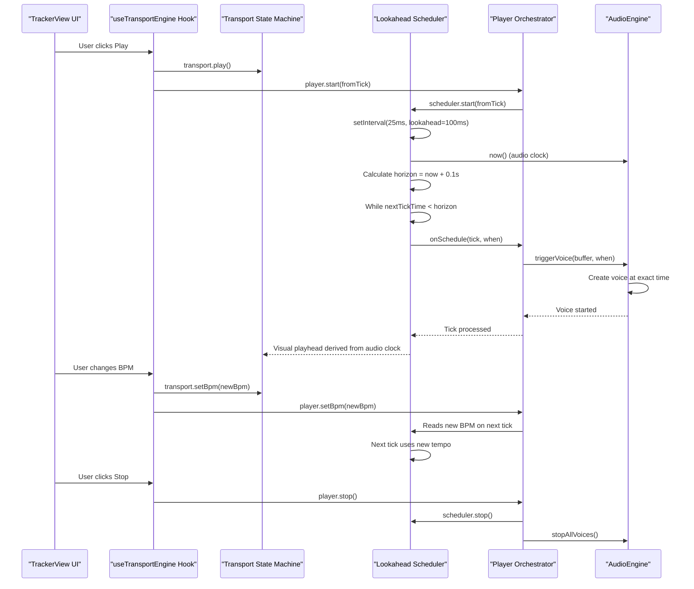
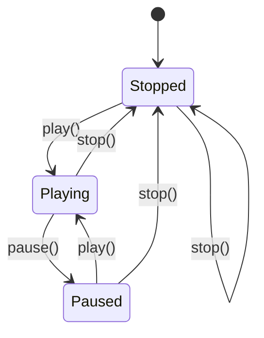
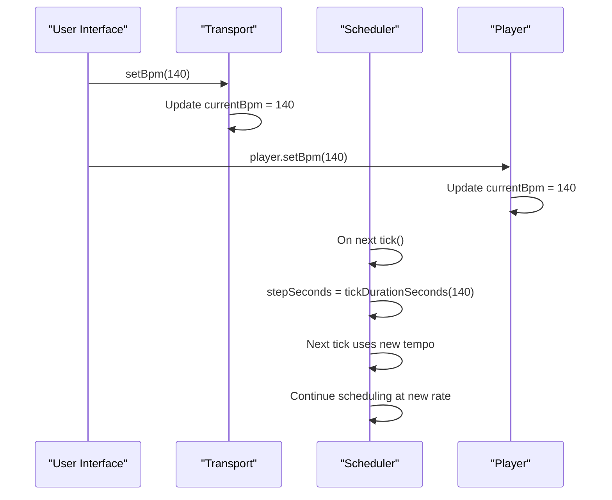
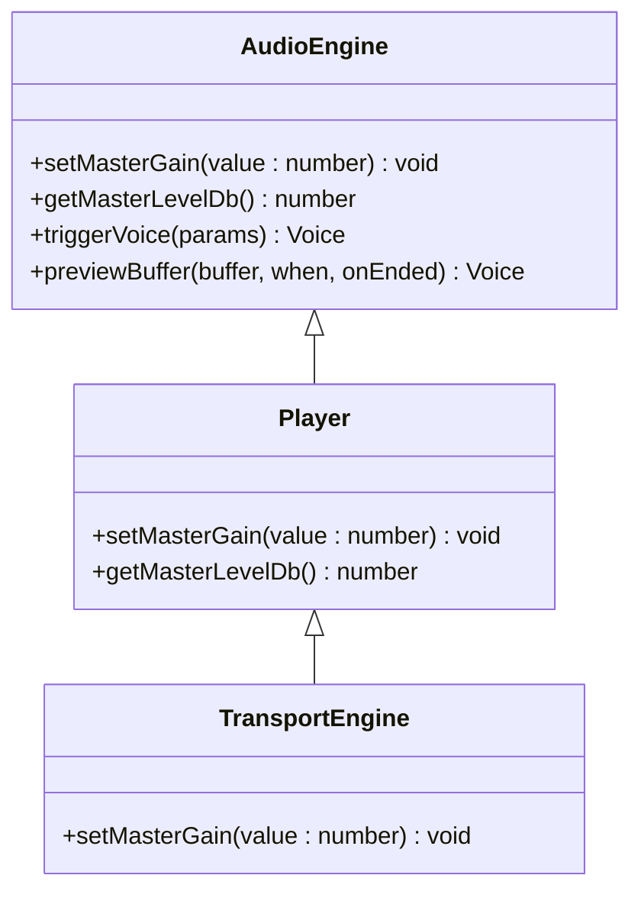
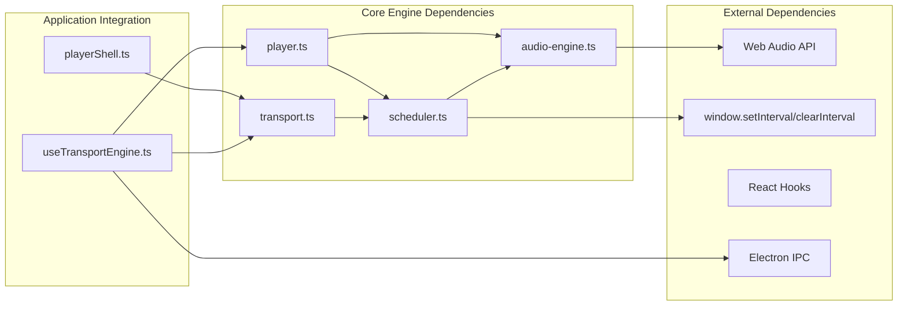

# Transport System

<cite>
**Referenced Files in This Document**
- [transport.ts](file://src/renderer/src/engine/transport.ts)
- [transport.test.ts](file://src/renderer/src/engine/transport.test.ts)
- [scheduler.ts](file://src/renderer/src/engine/scheduler.ts)
- [scheduler.test.ts](file://src/renderer/src/engine/scheduler.test.ts)
- [player.ts](file://src/renderer/src/engine/player.ts)
- [audio-engine.ts](file://src/renderer/src/engine/audio-engine.ts)
- [useTransportEngine.ts](file://src/renderer/src/hooks/useTransportEngine.ts)
- [playerShell.ts](file://src/renderer/src/lib/playerShell.ts)
- [spec-005-audio-playback-engine.md](file://docs/specs/spec-005-audio-playback-engine.md)
- [audio-engine.md](file://docs/audio-engine.md)
</cite>

## Update Summary
**Changes Made**
- Added comprehensive lookahead scheduler implementation with Chris Wilson's "A Tale of Two Clocks" approach
- Implemented dynamic BPM changes during playback with real-time tempo adjustment
- Added master gain control with audio engine integration
- Enhanced timing precision through audio clock coordination
- Updated transport state machine to work with scheduler-driven timing
- Added lookahead window scheduling for improved audio synchronization

## Table of Contents
1. [Introduction](#introduction)
2. [Project Structure](#project-structure)
3. [Core Components](#core-components)
4. [Architecture Overview](#architecture-overview)
5. [Detailed Component Analysis](#detailed-component-analysis)
6. [Dependency Analysis](#dependency-analysis)
7. [Performance Considerations](#performance-considerations)
8. [Troubleshooting Guide](#troubleshooting-guide)
9. [Conclusion](#conclusion)

## Introduction
This document provides comprehensive documentation for the transport system that controls audio playback timing and synchronization. The transport system has been comprehensively rewritten to implement a lookahead scheduler, support BPM changes during playback, provide master gain control, and achieve precise timing coordination with the audio clock.

The transport system now operates as part of a sophisticated audio engine that separates timing concerns from audio scheduling, ensuring perfect synchronization between the visual playhead and audible output. The system implements Chris Wilson's "A Tale of Two Clocks" approach for professional-grade audio timing precision.

## Project Structure
The transport system is now integrated into a larger audio engine architecture with clear separation of concerns:

```mermaid
graph TB
subgraph "Core Engine Layer"
TST[transport.ts<br/>Pure Transport State Machine]
SCHED[scheduler.ts<br/>Lookahead Scheduler]
PLAYER[player.ts<br/>Player Orchestrator]
AE[audio-engine.ts<br/>Audio Context & Master Bus]
END
subgraph "Application Integration"
UTE[useTransportEngine.ts<br/>React Hook Integration]
PS[playerShell.ts<br/>UI State Management]
end
subgraph "Documentation"
SPEC[spec-005-audio-playback-engine.md<br/>System Specification]
AUDIO[audio-engine.md<br/>Audio Engine Docs]
end
TST --> SCHED
SCHED --> PLAYER
PLAYER --> AE
UTE --> PLAYER
PS --> PLAYER
SPEC --> PLAYER
AUDIO --> AE
```

**Diagram sources**
- [transport.ts:1-79](file://src/renderer/src/engine/transport.ts#L1-L79)
- [scheduler.ts:1-137](file://src/renderer/src/engine/scheduler.ts#L1-L137)
- [player.ts:1-230](file://src/renderer/src/engine/player.ts#L1-L230)
- [audio-engine.ts:1-200](file://src/renderer/src/engine/audio-engine.ts#L1-L200)
- [useTransportEngine.ts:1-315](file://src/renderer/src/hooks/useTransportEngine.ts#L1-L315)

**Section sources**
- [transport.ts:1-79](file://src/renderer/src/engine/transport.ts#L1-L79)
- [scheduler.ts:1-137](file://src/renderer/src/engine/scheduler.ts#L1-L137)
- [player.ts:1-230](file://src/renderer/src/engine/player.ts#L1-L230)
- [audio-engine.ts:1-200](file://src/renderer/src/engine/audio-engine.ts#L1-L200)

## Core Components
The transport system now consists of several interconnected components that work together to provide professional-grade audio timing:

### Transport State Machine
The Transport interface defines the pure state machine for playback control:

- **State Management**: `stopped`, `playing`, `paused` states with immutable state transitions
- **Timing Control**: `currentTick` position and `bpm` (beats per minute) control
- **Playback Control**: `play()`, `pause()`, `stop()`, `skipBack()` operations
- **Timing Functions**: `tickDurationSeconds()` and `tickToTime()` for precise timing calculations
- **Lifecycle Management**: `destroy()` for cleanup

### Lookahead Scheduler
The Scheduler implements Chris Wilson's "A Tale of Two Clocks" approach:

- **Coarse Timer**: Runs every ~25ms to check the lookahead window
- **Lookahead Window**: Schedules events within a ~100ms window for audio precision
- **Audio Clock Integration**: Uses the audio context's time as the authoritative timing source
- **Self-Correction**: Automatically catches up from event loop stalls without drift
- **Dynamic BPM Support**: Reads BPM from transport on each tick for real-time tempo changes

### Player Orchestrator
The Player coordinates all engine components:

- **AudioEngine Integration**: Manages the Web Audio context and master bus
- **Scheduler Coordination**: Starts/stops the lookahead scheduler with precise timing
- **Voice Management**: Handles sample loading, voice creation, and monophonic scheduling
- **Master Gain Control**: Provides volume control through the audio engine
- **Preview System**: Supports transport-aware sample previews with quantization

### Audio Engine
The AudioEngine provides the Web Audio infrastructure:

- **AudioContext Management**: Lazy creation on first user gesture for autoplay policy compliance
- **Master Gain Stage**: Global volume control with bounds checking
- **Metering System**: Real-time level monitoring for UI feedback
- **Channel Routing**: Individual channel management with panning and muting
- **Voice Registry**: Tracks active voices for proper cleanup

**Section sources**
- [transport.ts:9-23](file://src/renderer/src/engine/transport.ts#L9-L23)
- [scheduler.ts:13-57](file://src/renderer/src/engine/scheduler.ts#L13-L57)
- [player.ts:29-85](file://src/renderer/src/engine/player.ts#L29-L85)
- [audio-engine.ts:37-160](file://src/renderer/src/engine/audio-engine.ts#L37-L160)

## Architecture Overview
The transport system now implements a sophisticated architecture that separates timing concerns from audio scheduling:



**Diagram sources**
- [useTransportEngine.ts:235-260](file://src/renderer/src/hooks/useTransportEngine.ts#L235-L260)
- [scheduler.ts:75-87](file://src/renderer/src/engine/scheduler.ts#L75-L87)
- [player.ts:145-166](file://src/renderer/src/engine/player.ts#L145-L166)
- [audio-engine.ts:140-154](file://src/renderer/src/engine/audio-engine.ts#L140-L154)

The architecture ensures:
- **Perfect Synchronization**: Visual playhead never drifts from audible output
- **Real-time Precision**: Audio clock provides authoritative timing source
- **Dynamic Tempo**: BPM changes take effect immediately during playback
- **Professional Timing**: Lookahead scheduling prevents audio glitches
- **Memory Safety**: Proper cleanup prevents audio artifacts

## Detailed Component Analysis

### Transport State Machine Evolution
The transport state machine has been simplified to focus purely on state management while delegating timing to the scheduler:



**Key Changes**:
- **State-only**: No longer manages timers or tick positions
- **Pure API**: Exposes only state, BPM, and timing calculation functions
- **Delegated Timing**: Playhead position is managed by the scheduler
- **Immutable Transitions**: State changes are atomic and predictable

**Section sources**
- [transport.ts:33-78](file://src/renderer/src/engine/transport.ts#L33-L78)

### Lookahead Scheduler Implementation
The scheduler implements Chris Wilson's "A Tale of Two Clocks" approach for professional audio timing:

```mermaid
flowchart TD
Start([Scheduler Creation]) --> Init["Initialize state<br/>nextTick = startTick<br/>nextTickTime = 0<br/>anchorTick = nextTick<br/>anchorTime = 0"]
Init --> Wait[Waiting for start()]
Wait --> StartCall[start() called]
StartCall --> CheckRunning{"timerHandle !== null?"}
CheckRunning --> |Yes| Return[Return silently]
CheckRunning --> |No| Anchor["Anchor to audio clock:<br/>nextTickTime = now()<br/>anchorTick = nextTick<br/>anchorTime = nextTickTime"]
Anchor --> SetTimer["clock.setInterval(tick, 25ms)"]
SetTimer --> FirstPass["Run tick() synchronously"]
FirstPass --> Running[Running]
Running --> Tick[tick() fires]
Tick --> Horizon["horizon = now() + lookaheadSeconds"]
Tick --> StepSec["stepSeconds = tickDurationSeconds(bpm)"]
Tick --> CheckStep{"stepSeconds > 0 && isFinite?"}
CheckStep --> |No| Return2[Return silently]
CheckStep --> |Yes| WhileLoop["while nextTickTime < horizon"]
WhileLoop --> Schedule["onSchedule(nextTick, nextTickTime)"]
Schedule --> Advance["nextTick += 1<br/>nextTickTime += stepSeconds"]
Advance --> WhileLoop
Running --> Stop[stop() called]
Stop --> Snapshot["anchorTick = liveTick()<br/>anchorTime = now()"]
Snapshot --> ClearTimer["clock.clearInterval(timerHandle)<br/>timerHandle = null"]
Running --> Reset[reset(tick) called]
Reset --> CheckRunning2{"timerHandle !== null?"}
CheckRunning2 --> |No| SetNext["nextTick = tick<br/>anchorTick = tick"]
CheckRunning2 --> |Yes| NoOp[No-op]
```

**Scheduler Characteristics**:
- **Coarse Timer**: 25ms intervals for efficient CPU usage
- **Lookahead Window**: 100ms scheduling window for audio precision
- **Audio Clock Authority**: Uses AudioContext time as the single timing source
- **Self-Correction**: Automatically catches up from event loop stalls
- **BPM Integration**: Reads tempo from transport on each tick

**Section sources**
- [scheduler.ts:59-137](file://src/renderer/src/engine/scheduler.ts#L59-L137)

### Dynamic BPM Changes During Playback
The scheduler supports real-time tempo changes without disrupting playback:



**BPM Change Behavior**:
- **Immediate Effect**: Tempo changes take effect on the next scheduler tick
- **No Disruption**: Current playback continues uninterrupted
- **Accurate Scheduling**: Future ticks use the new tempo immediately
- **Bounds Checking**: Invalid BPM values are handled gracefully

**Section sources**
- [scheduler.ts:82-86](file://src/renderer/src/engine/scheduler.ts#L82-L86)
- [player.ts:71-73](file://src/renderer/src/engine/player.ts#L71-L73)

### Master Gain Control System
The audio engine provides comprehensive master gain control:



**Master Gain Features**:
- **Volume Control**: 0-1 range with bounds checking
- **Real-time Updates**: Immediate effect on all audio output
- **Metering Integration**: Live level monitoring for UI feedback
- **Audio Engine Integration**: Centralized gain stage for consistent volume

**Section sources**
- [audio-engine.ts:157-160](file://src/renderer/src/engine/audio-engine.ts#L157-L160)
- [player.ts:75-81](file://src/renderer/src/engine/player.ts#L75-L81)
- [useTransportEngine.ts:275-279](file://src/renderer/src/hooks/useTransportEngine.ts#L275-L279)

### Precise Timing Coordination
The system ensures perfect synchronization between visual and audio timing:

```mermaid
flowchart TD
AudioClock[AudioContext Time] --> LiveTick[liveTick() calculation]
LiveTick --> Elapsed[elapsed = now() - anchorTime]
Elapsed --> Floor[Math.floor(elapsed / stepSeconds)]
Floor --> Result[anchorTick + result]
Result --> VisualPlayhead[Visual Playhead Position]
VisualPlayhead --> UI[UI Updates]
UI --> AudioOutput[Audio Output]
AudioOutput --> AudioClock
```

**Timing Coordination Features**:
- **Audio Clock Authority**: Visual playhead derived from audio clock
- **No Drift**: Perfect synchronization between visuals and audio
- **Pause Preservation**: Playhead position preserved during pauses
- **Smooth Updates**: Continuous timing without discontinuities

**Section sources**
- [scheduler.ts:129-135](file://src/renderer/src/engine/scheduler.ts#L129-L135)
- [useTransportEngine.ts:149-154](file://src/renderer/src/hooks/useTransportEngine.ts#L149-L154)

## Dependency Analysis
The transport system now has a more complex dependency graph with clear separation of concerns:



**Dependency Characteristics**:
- **Engine Boundary**: Pure TypeScript with no React/DOM dependencies
- **Audio Engine**: Web Audio API integration for professional audio
- **Scheduler Independence**: Standalone module with testable clock interface
- **UI Integration**: Clean React hook integration without engine dependencies

**Section sources**
- [transport.ts:1-8](file://src/renderer/src/engine/transport.ts#L1-L8)
- [scheduler.ts:1-12](file://src/renderer/src/engine/scheduler.ts#L1-L12)
- [player.ts:1-8](file://src/renderer/src/engine/player.ts#L1-L8)

## Performance Considerations
The transport system is designed for optimal performance in professional audio applications:

### Timing Accuracy
- **Audio Clock Precision**: Uses AudioContext time for microsecond accuracy
- **Lookahead Scheduling**: Prevents audio glitches through proactive scheduling
- **Self-Correction**: Event loop stalls automatically corrected without drift
- **BPM Integration**: Real-time tempo changes without timing disruption

### Memory Management
- **Proper Cleanup**: All components implement destroy/close methods
- **Voice Registry**: Active voice tracking prevents memory leaks
- **Sample Caching**: Efficient sample loading with automatic cleanup
- **Timer Management**: Proper timer clearing prevents resource leaks

### Real-time Performance
- **Coarse Timer**: 25ms intervals minimize CPU overhead
- **Lookahead Window**: 100ms window balances latency vs. precision
- **Lazy Initialization**: AudioContext created on first user gesture
- **Bounds Checking**: Invalid states handled gracefully without crashes

### Testability Benefits
- **Mockable Clock**: Scheduler accepts custom clock implementations
- **Audio Engine Testing**: Web Audio API can be mocked for unit tests
- **Transport Isolation**: Pure state machine easy to test in isolation
- **Integration Testing**: Full system testing with realistic audio timing

**Section sources**
- [scheduler.test.ts:18-162](file://src/renderer/src/engine/scheduler.test.ts#L18-L162)
- [transport.test.ts:1-94](file://src/renderer/src/engine/transport.test.ts#L1-L94)

## Troubleshooting Guide

### Common Issues and Solutions

#### Transport Not Responding
**Symptoms**: Play button appears disabled, no state changes
**Causes**: 
- Transport already in 'playing' state
- Missing transport reference in hook
**Solutions**:
- Verify transport state using `transport.state`
- Check transport reference in `transportRef.current`
- Ensure proper cleanup in component unmount

#### BPM Changes Not Taking Effect
**Symptoms**: Tempo appears unchanged after `setBpm()`
**Causes**:
- Scheduler not reading updated BPM
- Player not forwarding BPM changes
**Solutions**:
- Verify `transport.setBpm()` is called
- Check `player.setBpm()` is invoked
- Ensure scheduler restarts after BPM changes

#### Audio Glitches or Dropouts
**Symptoms**: Audio artifacts, timing inconsistencies
**Causes**:
- Event loop stall causing missed scheduling
- Insufficient lookahead window
**Solutions**:
- Monitor scheduler `running` state
- Adjust lookahead window if needed
- Check for long-running JavaScript operations

#### Master Gain Not Working
**Symptoms**: Volume control has no effect
**Causes**:
- Audio context not initialized
- Master gain not properly set
**Solutions**:
- Call `player.setMasterGain()` after transport creation
- Ensure audio context is resumed on user gesture
- Verify gain value is within 0-1 range

### Debugging Strategies
1. **State Monitoring**: Log transport state and scheduler running status
2. **Timing Verification**: Compare visual playhead with audio clock
3. **BPM Validation**: Cross-check calculated intervals with expected values
4. **Memory Tracking**: Monitor active voice count and sample cache usage
5. **Error Handling**: Implement proper error boundaries for audio operations

**Section sources**
- [useTransportEngine.ts:156-166](file://src/renderer/src/hooks/useTransportEngine.ts#L156-L166)
- [scheduler.ts:144-160](file://src/renderer/src/engine/scheduler.ts#L144-L160)

## Conclusion
The transport system has evolved into a comprehensive audio timing solution that provides professional-grade synchronization between visual and audio playback. The rewrite successfully implements:

- **Lookahead Scheduling**: Chris Wilson's "A Tale of Two Clocks" approach for professional audio timing
- **Dynamic BPM Control**: Real-time tempo changes without disrupting playback
- **Master Gain Integration**: Comprehensive volume control through the audio engine
- **Precise Timing Coordination**: Perfect synchronization between visuals and audio output
- **Robust Error Handling**: Graceful handling of invalid states and edge cases

The system maintains its commitment to simplicity while adding the sophisticated timing capabilities required for professional audio applications. The clean separation of concerns ensures maintainability and testability, while the integration with the broader audio engine provides a complete solution for tracker-style audio applications.

Future enhancements could include advanced tempo curve support, more sophisticated timing metrics, enhanced error recovery mechanisms, and expanded integration with external MIDI devices.