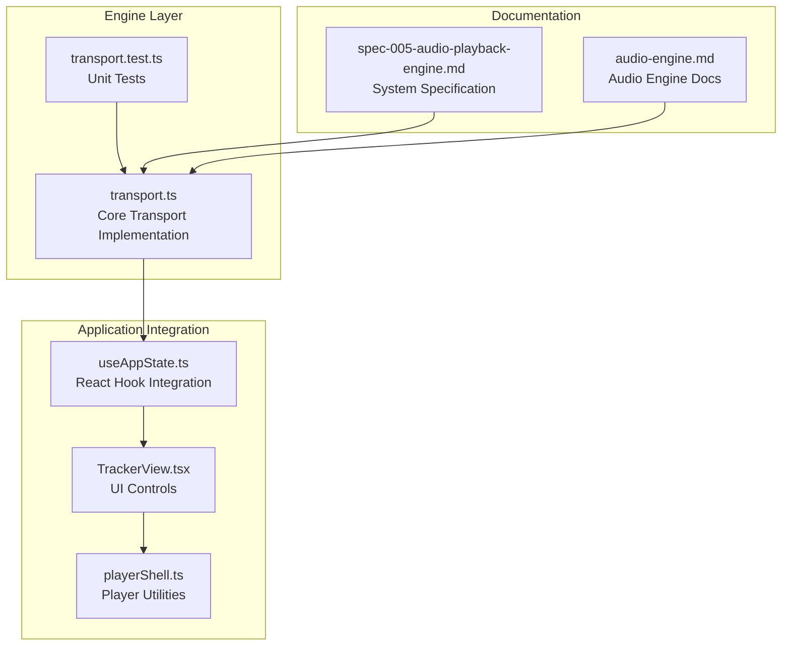
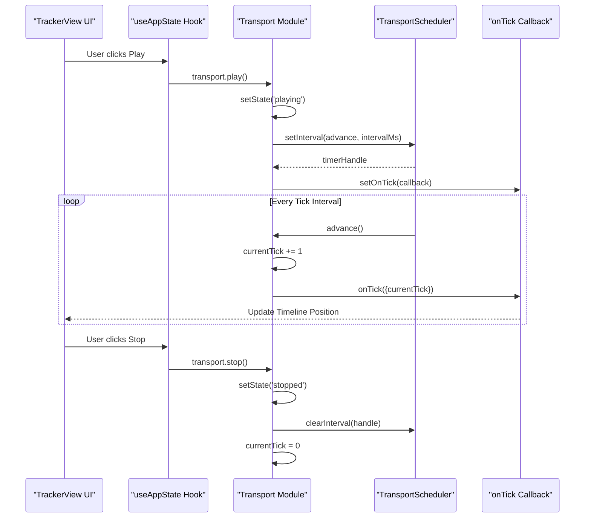
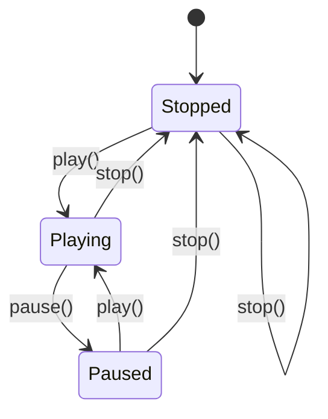
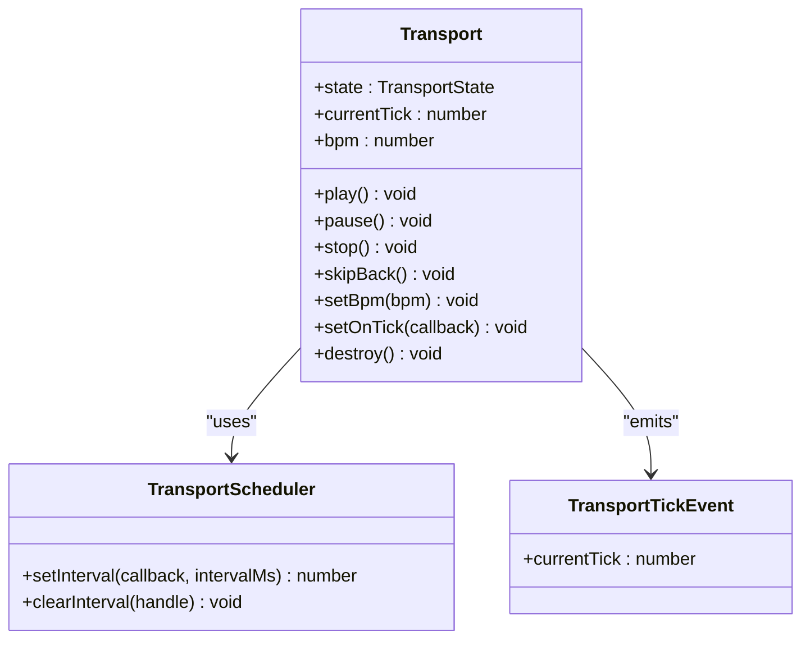
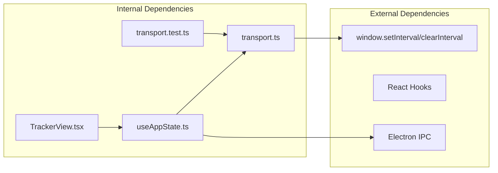

# Transport System

<cite>
**Referenced Files in This Document**
- [transport.ts](file://src/renderer/src/engine/transport.ts)
- [transport.test.ts](file://src/renderer/src/engine/transport.test.ts)
- [useAppState.ts](file://src/renderer/src/hooks/useAppState.ts)
- [TrackerView.tsx](file://src/renderer/src/components/TrackerView.tsx)
- [playerShell.ts](file://src/renderer/src/lib/playerShell.ts)
- [spec-005-audio-playback-engine.md](file://docs/specs/spec-005-audio-playback-engine.md)
- [audio-engine.md](file://docs/audio-engine.md)
</cite>

## Table of Contents
1. [Introduction](#introduction)
2. [Project Structure](#project-structure)
3. [Core Components](#core-components)
4. [Architecture Overview](#architecture-overview)
5. [Detailed Component Analysis](#detailed-component-analysis)
6. [Dependency Analysis](#dependency-analysis)
7. [Performance Considerations](#performance-considerations)
8. [Troubleshooting Guide](#troubleshooting-guide)
9. [Conclusion](#conclusion)

## Introduction
This document provides comprehensive documentation for the transport system that controls audio playback timing and synchronization. The transport manages playhead position, BPM control, and tick scheduling with a clean event-driven architecture. It is designed as a standalone module that integrates with the tracker interface and the broader audio engine.

The transport system implements a deterministic, testable timing mechanism using a scheduler abstraction that enables precise control over playback timing while maintaining real-time responsiveness.

## Project Structure
The transport system is organized across several key modules:



**Diagram sources**
- [transport.ts:1-118](file://src/renderer/src/engine/transport.ts#L1-L118)
- [useAppState.ts:13-43](file://src/renderer/src/hooks/useAppState.ts#L13-L43)
- [TrackerView.tsx:14-25](file://src/renderer/src/components/TrackerView.tsx#L14-L25)

**Section sources**
- [transport.ts:1-118](file://src/renderer/src/engine/transport.ts#L1-L118)
- [useAppState.ts:28-48](file://src/renderer/src/hooks/useAppState.ts#L28-L48)

## Core Components
The transport system consists of several core components that work together to provide reliable audio timing:

### Transport Interface
The Transport interface defines the public API for controlling playback:

- **State Management**: `stopped`, `playing`, `paused` states with immutable state transitions
- **Timing Control**: `currentTick` position and `bpm` (beats per minute) control
- **Playback Control**: `play()`, `pause()`, `stop()`, `skipBack()` operations
- **Callback System**: `setOnTick()` for receiving tick events
- **Lifecycle Management**: `destroy()` for cleanup

### Scheduler Abstraction
The TransportScheduler interface provides a testable abstraction over timing mechanisms:

- `setInterval(callback, intervalMs)`: Creates a recurring timer
- `clearInterval(handle)`: Cancels a scheduled timer
- Default implementation uses `window.setInterval` and `window.clearInterval`

### Tick Event System
The TransportTickEvent provides structured timing information:
- `currentTick`: The current tick position in the timeline
- Event-driven architecture enables external systems to react to timing changes

**Section sources**
- [transport.ts:19-31](file://src/renderer/src/engine/transport.ts#L19-L31)
- [transport.ts:7-17](file://src/renderer/src/engine/transport.ts#L7-L17)
- [transport.ts:3-5](file://src/renderer/src/engine/transport.ts#L3-L5)

## Architecture Overview
The transport system follows a layered architecture with clear separation of concerns:



**Diagram sources**
- [useAppState.ts:243-260](file://src/renderer/src/hooks/useAppState.ts#L243-L260)
- [transport.ts:76-112](file://src/renderer/src/engine/transport.ts#L76-L112)

The architecture ensures that:
- The transport remains UI-agnostic and testable
- Timing precision is maintained through the scheduler abstraction
- State transitions are deterministic and predictable
- External systems can subscribe to timing events

## Detailed Component Analysis

### Transport State Machine
The transport implements a finite state machine with three primary states:



**State Behavior**:
- **Stopped**: Initial state with `currentTick = 0`. No timer is active.
- **Playing**: Active playback state. Timer advances `currentTick` at configured intervals.
- **Paused**: Suspended state. Timer is cleared but `currentTick` position is preserved.

**Section sources**
- [transport.ts:40-41](file://src/renderer/src/engine/transport.ts#L40-L41)
- [transport.ts:76-92](file://src/renderer/src/engine/transport.ts#L76-L92)

### BPM Control Mechanisms
The transport calculates tick intervals using a fixed relationship between BPM and timing:

```mermaid
flowchart TD
BPM[BPM Value] --> Calc["tickIntervalMs(bpm)"]
Calc --> Formula["Formula: 60000 / bpm / TICKS_PER_BEAT"]
Formula --> Interval[Interval in milliseconds]
Interval --> Timer[Timer Configuration]
Timer --> Advance[advance() function]
Advance --> Tick[Tick Increment]
Tick --> Callback[onTick Callback]
```

**Key Properties**:
- **TICKS_PER_BEAT**: Fixed constant of 8, representing 1/32 note resolution
- **Precision**: Calculated using integer arithmetic for consistent results
- **Dynamic Updates**: BPM changes immediately affect future timer intervals

**Section sources**
- [transport.ts:33-37](file://src/renderer/src/engine/transport.ts#L33-L37)
- [transport.ts:98-103](file://src/renderer/src/engine/transport.ts#L98-L103)

### Tick Scheduling Algorithm
The scheduling algorithm implements a straightforward but effective timing mechanism:

```mermaid
flowchart TD
Start([Transport Creation]) --> Init["Initialize state = 'stopped'<br/>currentTick = 0<br/>timerHandle = null"]
Init --> Wait[Waiting for play()]
Wait --> Play[play() called]
Play --> CheckState{"state == 'playing'?"}
CheckState --> |No| SetPlaying["state = 'playing'"]
SetPlaying --> ClearTimer["clearTimer()"]
ClearTimer --> StartTimer["startTimer()"]
StartTimer --> CalcInterval["tickIntervalMs(currentBpm)"]
CalcInterval --> SetInterval["scheduler.setInterval(advance, interval)"]
SetInterval --> Running[Running]
Running --> Tick[tick fired]
Tick --> Advance["advance(): currentTick += 1"]
Advance --> FireCallback["onTick({currentTick})"]
FireCallback --> Tick
Running --> Pause[pause() called]
Pause --> ClearTimer2["clearTimer()"]
ClearTimer2 --> SetPaused["state = 'paused'"]
Running --> Stop[stop() called]
Stop --> ClearTimer3["clearTimer()"]
ClearTimer3 --> Reset["state = 'stopped'<br/>currentTick = 0"]
```

**Algorithm Characteristics**:
- **Deterministic**: Each tick increment is guaranteed
- **Testable**: Scheduler abstraction enables controlled testing
- **Efficient**: Minimal overhead with direct timer management
- **Responsive**: Immediate reaction to BPM changes during playback

**Section sources**
- [transport.ts:46-61](file://src/renderer/src/engine/transport.ts#L46-L61)
- [transport.ts:53-56](file://src/renderer/src/engine/transport.ts#L53-L56)

### Event-Driven Architecture
The transport implements a clean event-driven pattern through the `onTick` callback system:



**Event Flow**:
1. Timer fires at calculated interval
2. `advance()` increments `currentTick`
3. `onTick` callback receives `{currentTick}`
4. External systems can react to timing changes

**Section sources**
- [transport.ts:19-31](file://src/renderer/src/engine/transport.ts#L19-L31)
- [transport.ts:105-107](file://src/renderer/src/engine/transport.ts#L105-L107)

### Real-Time Timing Precision
The transport achieves real-time timing precision through several design choices:

- **Fixed Resolution**: 8 ticks per beat provides 1/32 note precision
- **Direct Timer Management**: Minimal abstraction overhead
- **Immediate BPM Changes**: Tempo adjustments take effect immediately during playback
- **Event-Driven Updates**: External systems receive precise timing notifications

**Section sources**
- [spec-005-audio-playback-engine.md:42-46](file://docs/specs/spec-005-audio-playback-engine.md#L42-L46)
- [transport.ts:33](file://src/renderer/src/engine/transport.ts#L33)

## Dependency Analysis
The transport system maintains loose coupling with minimal dependencies:



**Dependency Characteristics**:
- **Minimal External Dependencies**: Only uses browser timer APIs
- **Testable Design**: Complete isolation from UI frameworks
- **Clean Integration**: React hooks provide seamless UI integration
- **IPC Independence**: No direct Electron API dependencies in transport

**Section sources**
- [transport.ts:12-17](file://src/renderer/src/engine/transport.ts#L12-L17)
- [useAppState.ts:13](file://src/renderer/src/hooks/useAppState.ts#L13)

## Performance Considerations
The transport system is designed for optimal performance in real-time audio applications:

### Timing Accuracy
- **Consistent Intervals**: BPM calculations use precise mathematical formulas
- **Minimal Overhead**: Direct timer management avoids unnecessary abstractions
- **Event Efficiency**: Callback system only triggers when timing changes occur

### Memory Management
- **Resource Cleanup**: Proper timer clearing prevents memory leaks
- **Reference Management**: Weak references prevent circular dependencies
- **State Isolation**: Encapsulated state prevents accidental mutations

### Testability Benefits
- **Mockable Timers**: Scheduler abstraction enables controlled testing
- **Deterministic Behavior**: Predictable state transitions simplify testing
- **Isolated Units**: Pure function design enables focused unit tests

**Section sources**
- [transport.test.ts:4-16](file://src/renderer/src/engine/transport.test.ts#L4-L16)
- [transport.ts:46-51](file://src/renderer/src/engine/transport.ts#L46-L51)

## Troubleshooting Guide

### Common Issues and Solutions

#### Transport Not Responding
**Symptoms**: Play button appears disabled, no state changes
**Causes**: 
- Transport already in 'playing' state
- Timer handle not properly managed
**Solutions**:
- Verify state transitions using `transport.state`
- Check for proper timer cleanup in `destroy()`

#### BPM Changes Not Taking Effect
**Symptoms**: Tempo appears unchanged after `setBpm()`
**Causes**:
- Transport not in 'playing' state during BPM change
- Timer not restarted after BPM update
**Solutions**:
- Ensure transport is playing before changing BPM
- Verify `startTimer()` is called during BPM updates

#### Memory Leaks
**Symptoms**: Persistent timers after component unmount
**Causes**:
- Missing `destroy()` call in cleanup
- Timer handles not cleared
**Solutions**:
- Call `transport.destroy()` in component cleanup
- Verify `clearInterval()` is executed

### Debugging Strategies
1. **State Monitoring**: Log `transport.state` changes
2. **Timer Inspection**: Monitor timer handle lifecycle
3. **Callback Verification**: Ensure `onTick` receives expected values
4. **BPM Validation**: Cross-check calculated intervals against expected values

**Section sources**
- [transport.ts:109-112](file://src/renderer/src/engine/transport.ts#L109-L112)
- [useAppState.ts:168-176](file://src/renderer/src/hooks/useAppState.ts#L168-L176)

## Conclusion
The transport system provides a robust foundation for audio playback timing and synchronization. Its design emphasizes:

- **Reliability**: Deterministic state transitions and precise timing
- **Testability**: Clean abstractions enable comprehensive testing
- **Integration**: Seamless connection with UI and audio engine components
- **Performance**: Optimized for real-time audio processing requirements

The system successfully balances simplicity with functionality, providing the essential timing control needed for tracker-style audio applications while maintaining the flexibility to integrate with broader audio engine architectures.

Future enhancements could include:
- Advanced tempo curve support
- Loop point management
- More sophisticated timing metrics
- Enhanced error handling and recovery mechanisms