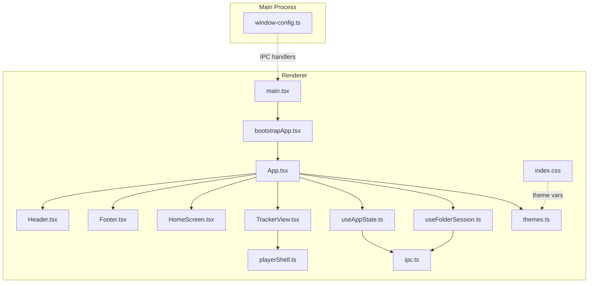
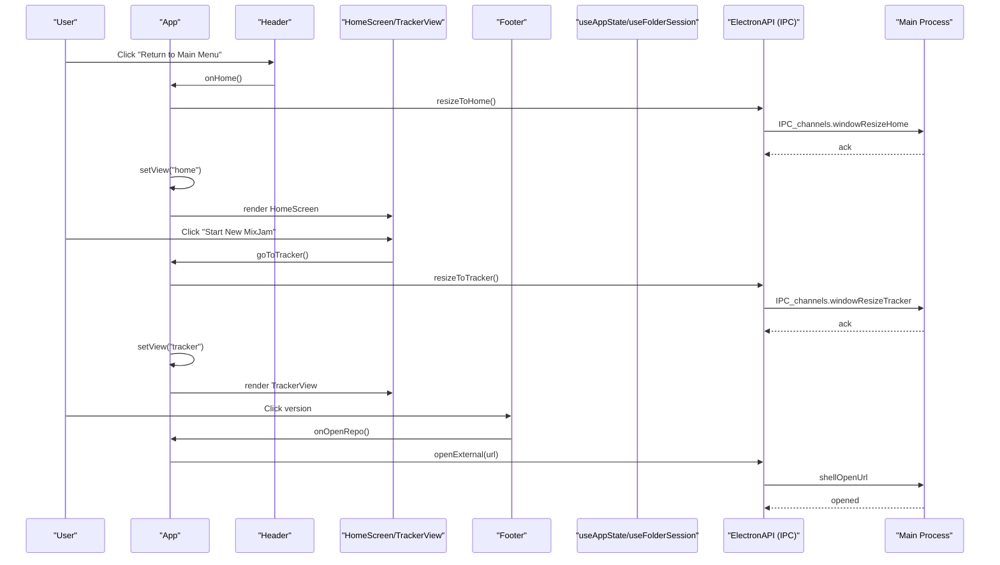
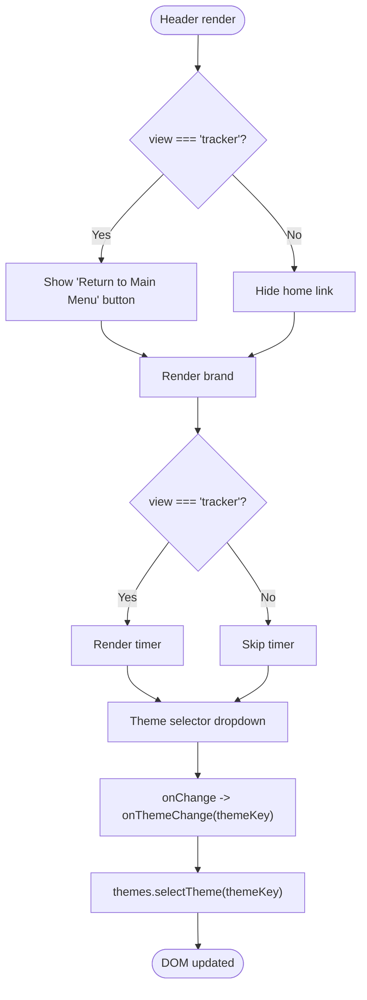
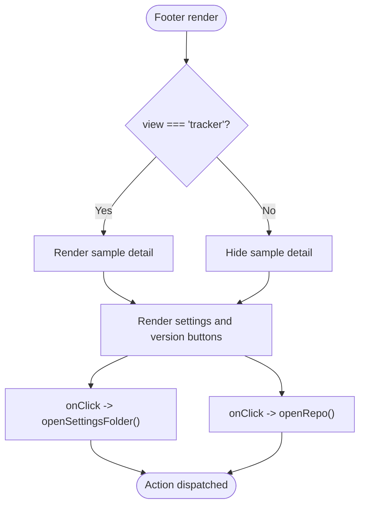
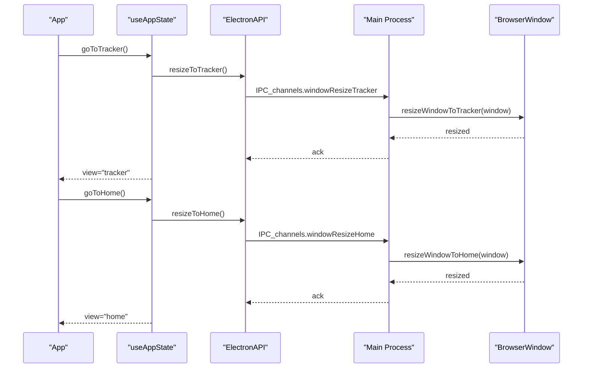
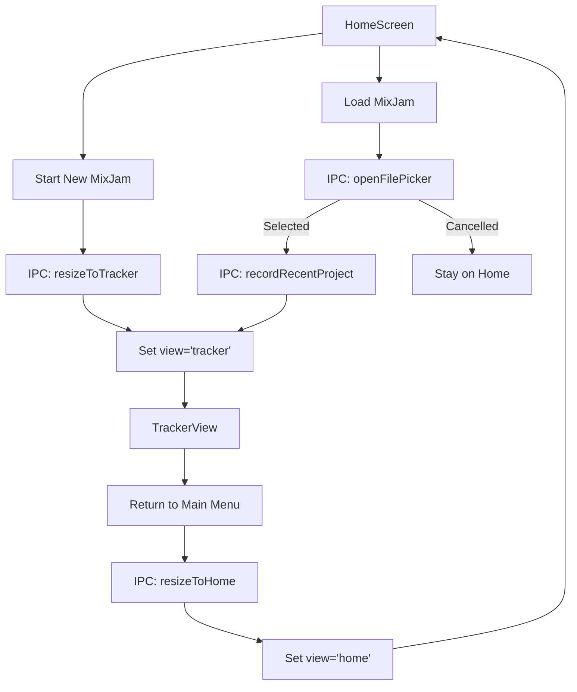
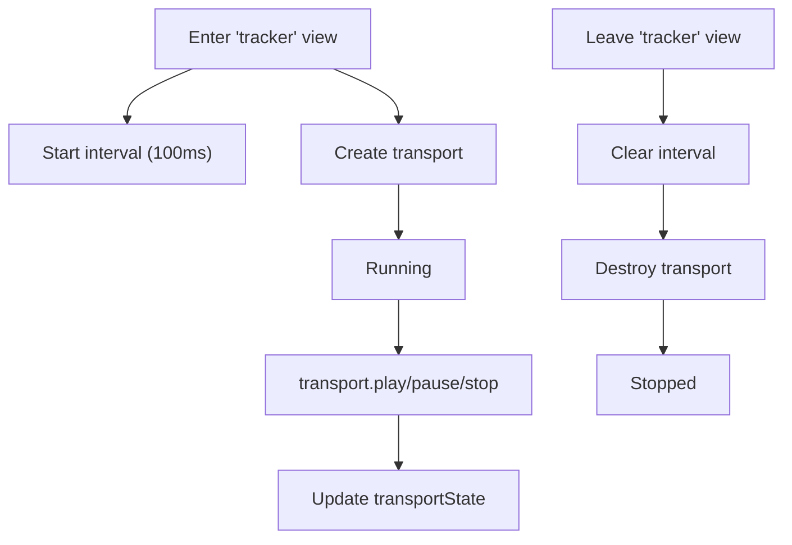
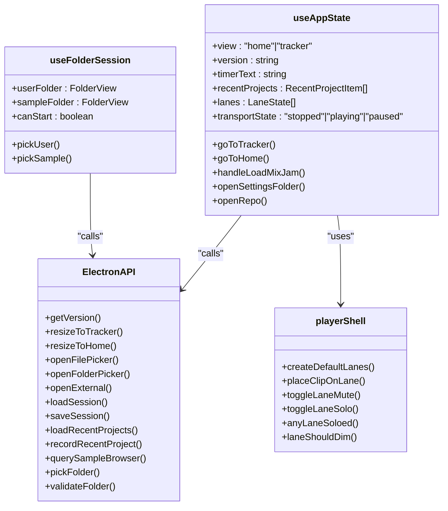
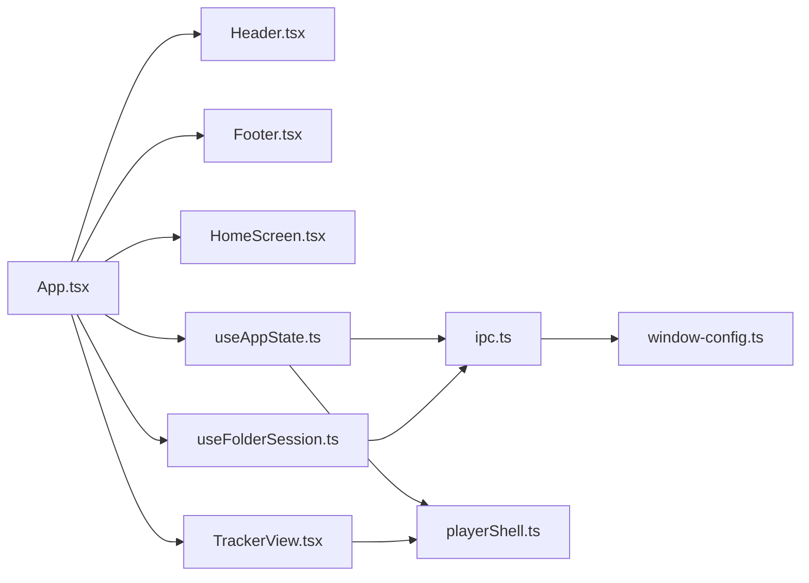

# Application Shell & Navigation

<cite>
**Referenced Files in This Document**
- [App.tsx](file://src/renderer/src/App.tsx)
- [Header.tsx](file://src/renderer/src/components/Header.tsx)
- [Footer.tsx](file://src/renderer/src/components/Footer.tsx)
- [HomeScreen.tsx](file://src/renderer/src/components/HomeScreen.tsx)
- [TrackerView.tsx](file://src/renderer/src/components/TrackerView.tsx)
- [useAppState.ts](file://src/renderer/src/hooks/useAppState.ts)
- [useFolderSession.ts](file://src/renderer/src/hooks/useFolderSession.ts)
- [playerShell.ts](file://src/renderer/src/lib/playerShell.ts)
- [window-config.ts](file://src/shared/window-config.ts)
- [ipc.ts](file://src/shared/ipc.ts)
- [themes.ts](file://src/renderer/src/theme/themes.ts)
- [bootstrapApp.tsx](file://src/renderer/src/bootstrapApp.tsx)
- [main.tsx](file://src/renderer/src/main.tsx)
- [index.css](file://src/renderer/src/index.css)
- [spec-001-app-shell-navigation.test.tsx](file://src/renderer/src/specs/spec-001-app-shell-navigation.test.tsx)
</cite>

## Table of Contents
1. [Introduction](#introduction)
2. [Project Structure](#project-structure)
3. [Core Components](#core-components)
4. [Architecture Overview](#architecture-overview)
5. [Detailed Component Analysis](#detailed-component-analysis)
6. [Dependency Analysis](#dependency-analysis)
7. [Performance Considerations](#performance-considerations)
8. [Troubleshooting Guide](#troubleshooting-guide)
9. [Conclusion](#conclusion)

## Introduction
This document describes the application shell and navigation system of MixJam Electron. It explains how the main App component orchestrates views, how the header provides navigation and branding, how the footer displays status and controls, and how window configuration and responsive layout are handled. It also covers view switching mechanisms, navigation patterns, component lifecycle management, and the integration between shell components and the underlying state management system.

## Project Structure
The shell and navigation system spans several layers:
- Renderer entry bootstraps the theme and renders the root App component
- App composes Header, main content area, and Footer
- Two primary views: HomeScreen and TrackerView
- State orchestration via useAppState and useFolderSession hooks
- IPC bridge to Electron main process for window resizing and dialogs
- Window configuration utilities define sizes and behaviors
- Theming system supports theme selection and CSS custom property application

**Diagram sources**
- [main.tsx:1-5](file://src/renderer/src/main.tsx#L1-L5)
- [bootstrapApp.tsx:1-19](file://src/renderer/src/bootstrapApp.tsx#L1-L19)
- [App.tsx:1-108](file://src/renderer/src/App.tsx#L1-L108)
- [Header.tsx:1-43](file://src/renderer/src/components/Header.tsx#L1-L43)
- [Footer.tsx:1-33](file://src/renderer/src/components/Footer.tsx#L1-L33)
- [HomeScreen.tsx:1-77](file://src/renderer/src/components/HomeScreen.tsx#L1-L77)
- [TrackerView.tsx:1-270](file://src/renderer/src/components/TrackerView.tsx#L1-L270)
- [useAppState.ts:1-295](file://src/renderer/src/hooks/useAppState.ts#L1-L295)
- [useFolderSession.ts:1-106](file://src/renderer/src/hooks/useFolderSession.ts#L1-L106)
- [playerShell.ts:1-132](file://src/renderer/src/lib/playerShell.ts#L1-L132)
- [themes.ts:1-112](file://src/renderer/src/theme/themes.ts#L1-L112)
- [ipc.ts:1-59](file://src/shared/ipc.ts#L1-L59)
- [window-config.ts:1-54](file://src/shared/window-config.ts#L1-L54)
- [index.css](file://src/renderer/src/index.css)

**Section sources**
- [main.tsx:1-5](file://src/renderer/src/main.tsx#L1-L5)
- [bootstrapApp.tsx:1-19](file://src/renderer/src/bootstrapApp.tsx#L1-L19)
- [App.tsx:1-108](file://src/renderer/src/App.tsx#L1-L108)

## Core Components
- App orchestrator: wires up state hooks, theme selection, and view composition
- Header: branding, navigation back to Home, and theme selector
- Footer: status display and global controls (settings folder, repo/version)
- HomeScreen: folder selection and launch controls
- TrackerView: sequencer-like editing surface with lanes, transport, and sample browser
- useAppState: manages view state, timers, transport, sample browser queries, and IPC-driven actions
- useFolderSession: manages user/sample folders, validation, persistence, and readiness
- playerShell: lane and clip model, mute/solo logic, and dimming rules
- window-config: window sizing and frame control helpers
- ipc: channel definitions and ElectronAPI contract
- themes: theme resolution and CSS custom property application

**Section sources**
- [App.tsx:9-108](file://src/renderer/src/App.tsx#L9-L108)
- [Header.tsx:10-43](file://src/renderer/src/components/Header.tsx#L10-L43)
- [Footer.tsx:11-33](file://src/renderer/src/components/Footer.tsx#L11-L33)
- [HomeScreen.tsx:30-77](file://src/renderer/src/components/HomeScreen.tsx#L30-L77)
- [TrackerView.tsx:36-270](file://src/renderer/src/components/TrackerView.tsx#L36-L270)
- [useAppState.ts:28-295](file://src/renderer/src/hooks/useAppState.ts#L28-L295)
- [useFolderSession.ts:59-106](file://src/renderer/src/hooks/useFolderSession.ts#L59-L106)
- [playerShell.ts:29-132](file://src/renderer/src/lib/playerShell.ts#L29-L132)
- [window-config.ts:4-54](file://src/shared/window-config.ts#L4-L54)
- [ipc.ts:1-59](file://src/shared/ipc.ts#L1-L59)
- [themes.ts:90-112](file://src/renderer/src/theme/themes.ts#L90-L112)

## Architecture Overview
The shell follows a unidirectional data flow:
- App reads state from useFolderSession and useAppState
- App passes props to Header, content area, and Footer
- Header triggers navigation and theme changes
- Content area triggers playback, sample placement, and project actions
- Footer triggers global actions and displays runtime status
- All IPC-bound operations are channeled through ElectronAPI exposed by the preload script

**Diagram sources**
- [App.tsx:55-108](file://src/renderer/src/App.tsx#L55-L108)
- [Header.tsx:14-18](file://src/renderer/src/components/Header.tsx#L14-L18)
- [HomeScreen.tsx:64-67](file://src/renderer/src/components/HomeScreen.tsx#L64-L67)
- [Footer.tsx:27-29](file://src/renderer/src/components/Footer.tsx#L27-L29)
- [useAppState.ts:189-211](file://src/renderer/src/hooks/useAppState.ts#L189-L211)
- [ipc.ts:1-15](file://src/shared/ipc.ts#L1-L15)
- [window-config.ts:39-54](file://src/shared/window-config.ts#L39-L54)

## Detailed Component Analysis

### App Component Orchestration
- Composes Header, main content area, and Footer
- Delegates folder/session state to useFolderSession
- Delegates app state (view, transport, timers, sample browser) to useAppState
- Applies theme selection via themes.selectTheme
- Renders HomeScreen when view is "home", otherwise renders TrackerView
- Passes navigation callbacks to Header and Footer

```mermaid
classDiagram
class App {
+props : ElectronAPI
+state : view, version, timerText, recentProjects, lanes
+render() JSX.Element
}
class Header {
+props : view, timer, onHome, onThemeChange
+render() JSX.Element
}
class Footer {
+props : view, version, sampleDetail, onSelectFolder, onOpenRepo
+render() JSX.Element
}
class HomeScreen {
+props : userFolder, sampleFolder, canStart, onPickUser, onPickSample, onStart, onLoad
+render() JSX.Element
}
class TrackerView {
+props : recentProjects, sampleRows, sampleSearchQuery, sampleBrowserLoading, sampleBrowserError, selectedSamplePath, lanes, laneShouldDim, transportState, onSelectSampleDetail, onSampleSearchChange, onSampleRescan, onPlaceSampleOnLane, onToggleLaneMute, onToggleLaneSolo, onTransportPlay, onTransportPause, onTransportStop, onTransportSkipBack
+render() JSX.Element
}
class useAppState {
+view : "home"|"tracker"
+version : string
+timerText : string
+recentProjects : RecentProjectItem[]
+lanes : LaneState[]
+transportState : "stopped"|"playing"|"paused"
+goToTracker()
+goToHome()
+handleLoadMixJam()
+openSettingsFolder()
+openRepo()
}
class useFolderSession {
+userFolder : FolderView
+sampleFolder : FolderView
+canStart : boolean
+pickUser()
+pickSample()
}
App --> Header : "renders"
App --> HomeScreen : "when view='home'"
App --> TrackerView : "when view='tracker'"
App --> Footer : "renders"
App --> useAppState : "consumes"
App --> useFolderSession : "consumes"
```

**Diagram sources**
- [App.tsx:9-108](file://src/renderer/src/App.tsx#L9-L108)
- [Header.tsx:10-43](file://src/renderer/src/components/Header.tsx#L10-L43)
- [Footer.tsx:11-33](file://src/renderer/src/components/Footer.tsx#L11-L33)
- [HomeScreen.tsx:30-77](file://src/renderer/src/components/HomeScreen.tsx#L30-L77)
- [TrackerView.tsx:36-270](file://src/renderer/src/components/TrackerView.tsx#L36-L270)
- [useAppState.ts:28-295](file://src/renderer/src/hooks/useAppState.ts#L28-L295)
- [useFolderSession.ts:59-106](file://src/renderer/src/hooks/useFolderSession.ts#L59-L106)

**Section sources**
- [App.tsx:9-108](file://src/renderer/src/App.tsx#L9-L108)
- [useAppState.ts:28-295](file://src/renderer/src/hooks/useAppState.ts#L28-L295)
- [useFolderSession.ts:59-106](file://src/renderer/src/hooks/useFolderSession.ts#L59-L106)

### Header Component
- Displays brand name
- Shows a "Return to Main Menu" button when in tracker view
- Provides a theme selector dropdown with THEME_OPTIONS
- Propagates theme changes to themes.selectTheme and updates DOM CSS variables

**Diagram sources**
- [Header.tsx:10-43](file://src/renderer/src/components/Header.tsx#L10-L43)
- [themes.ts:90-112](file://src/renderer/src/theme/themes.ts#L90-L112)

**Section sources**
- [Header.tsx:10-43](file://src/renderer/src/components/Header.tsx#L10-L43)
- [themes.ts:90-112](file://src/renderer/src/theme/themes.ts#L90-L112)

### Footer Component
- Shows "Select settings folder" and "v{version}" buttons
- In tracker view, displays selected sample detail (name, path, metadata, tags)
- Triggers openSettingsFolder and openRepo actions

**Diagram sources**
- [Footer.tsx:11-33](file://src/renderer/src/components/Footer.tsx#L11-L33)
- [useAppState.ts:213-219](file://src/renderer/src/hooks/useAppState.ts#L213-L219)

**Section sources**
- [Footer.tsx:11-33](file://src/renderer/src/components/Footer.tsx#L11-L33)
- [useAppState.ts:213-219](file://src/renderer/src/hooks/useAppState.ts#L213-L219)

### Window Configuration and Responsive Layout
- HOME_WINDOW_SIZE and TRACKER_WINDOW_SIZE define base resolutions
- resizeWindowToHome and resizeWindowToTracker adjust size, center, and frame controls
- Main process exposes IPC channels for resizing and dialog operations
- CSS ensures full viewport height and hidden overflow for the app root

**Diagram sources**
- [useAppState.ts:189-198](file://src/renderer/src/hooks/useAppState.ts#L189-L198)
- [ipc.ts:1-15](file://src/shared/ipc.ts#L1-L15)
- [window-config.ts:39-54](file://src/shared/window-config.ts#L39-L54)
- [index.css](file://src/renderer/src/index.css)

**Section sources**
- [window-config.ts:4-54](file://src/shared/window-config.ts#L4-L54)
- [ipc.ts:75-85](file://src/shared/ipc.ts#L75-L85)
- [index.css](file://src/renderer/src/index.css)

### View Switching Mechanisms and Navigation Patterns
- HomeScreen provides "Start New MixJam" and "Load MixJam" actions
- TrackerView provides transport controls and sample browser
- Navigation uses imperative IPC calls to resize windows and update view state
- Lifecycle effects manage timers and transport cleanup on view transitions

**Diagram sources**
- [HomeScreen.tsx:64-72](file://src/renderer/src/components/HomeScreen.tsx#L64-L72)
- [useAppState.ts:189-211](file://src/renderer/src/hooks/useAppState.ts#L189-L211)
- [useAppState.ts:194-198](file://src/renderer/src/hooks/useAppState.ts#L194-L198)
- [ipc.ts:1-15](file://src/shared/ipc.ts#L1-L15)

**Section sources**
- [HomeScreen.tsx:30-77](file://src/renderer/src/components/HomeScreen.tsx#L30-L77)
- [useAppState.ts:189-211](file://src/renderer/src/hooks/useAppState.ts#L189-L211)

### Component Lifecycle Management
- useAppState sets up intervals and transport lifecycle when entering tracker view
- Timers are cleared and transport destroyed when leaving tracker view
- Selected sample detail is reset when returning to home
- Search queries debounce and cancel stale results

**Diagram sources**
- [useAppState.ts:158-187](file://src/renderer/src/hooks/useAppState.ts#L158-L187)
- [useAppState.ts:243-260](file://src/renderer/src/hooks/useAppState.ts#L243-L260)

**Section sources**
- [useAppState.ts:158-187](file://src/renderer/src/hooks/useAppState.ts#L158-L187)
- [useAppState.ts:243-260](file://src/renderer/src/hooks/useAppState.ts#L243-L260)

### Integration with State Management
- useFolderSession manages folder state, validation, and persistence
- useAppState centralizes view state, timers, transport, sample browser, and IPC actions
- Both hooks depend on ElectronAPI for cross-process operations
- playerShell provides immutable transformations for lane and clip state

**Diagram sources**
- [useFolderSession.ts:59-106](file://src/renderer/src/hooks/useFolderSession.ts#L59-L106)
- [useAppState.ts:28-295](file://src/renderer/src/hooks/useAppState.ts#L28-L295)
- [playerShell.ts:29-132](file://src/renderer/src/lib/playerShell.ts#L29-L132)
- [ipc.ts:40-58](file://src/shared/ipc.ts#L40-L58)

**Section sources**
- [useFolderSession.ts:59-106](file://src/renderer/src/hooks/useFolderSession.ts#L59-L106)
- [useAppState.ts:28-295](file://src/renderer/src/hooks/useAppState.ts#L28-L295)
- [playerShell.ts:29-132](file://src/renderer/src/lib/playerShell.ts#L29-L132)
- [ipc.ts:40-58](file://src/shared/ipc.ts#L40-L58)

## Dependency Analysis
- App depends on Header, Footer, HomeScreen, TrackerView, useAppState, and useFolderSession
- useAppState depends on ElectronAPI and playerShell
- useFolderSession depends on ElectronAPI
- Header and Footer depend on themes and ElectronAPI indirectly via App
- window-config is consumed by main process and used by useAppState via IPC

**Diagram sources**
- [App.tsx:1-108](file://src/renderer/src/App.tsx#L1-L108)
- [Header.tsx:1-43](file://src/renderer/src/components/Header.tsx#L1-L43)
- [Footer.tsx:1-33](file://src/renderer/src/components/Footer.tsx#L1-L33)
- [HomeScreen.tsx:1-77](file://src/renderer/src/components/HomeScreen.tsx#L1-L77)
- [TrackerView.tsx:1-270](file://src/renderer/src/components/TrackerView.tsx#L1-L270)
- [useAppState.ts:1-295](file://src/renderer/src/hooks/useAppState.ts#L1-L295)
- [useFolderSession.ts:1-106](file://src/renderer/src/hooks/useFolderSession.ts#L1-L106)
- [playerShell.ts:1-132](file://src/renderer/src/lib/playerShell.ts#L1-L132)
- [ipc.ts:1-59](file://src/shared/ipc.ts#L1-L59)
- [window-config.ts:1-54](file://src/shared/window-config.ts#L1-L54)

**Section sources**
- [App.tsx:1-108](file://src/renderer/src/App.tsx#L1-L108)
- [useAppState.ts:1-295](file://src/renderer/src/hooks/useAppState.ts#L1-L295)
- [useFolderSession.ts:1-106](file://src/renderer/src/hooks/useFolderSession.ts#L1-L106)
- [ipc.ts:1-59](file://src/shared/ipc.ts#L1-L59)

## Performance Considerations
- Debounced sample browser search: a 150ms delay prevents excessive queries while typing
- Query sequencing: tracks sequence number to ignore stale responses
- Transport lifecycle: intervals and transports are cleaned up when leaving tracker view
- Immutable transforms: playerShell functions return new arrays/objects, minimizing mutation overhead

**Section sources**
- [useAppState.ts:93-124](file://src/renderer/src/hooks/useAppState.ts#L93-L124)
- [useAppState.ts:126-148](file://src/renderer/src/hooks/useAppState.ts#L126-L148)
- [useAppState.ts:158-187](file://src/renderer/src/hooks/useAppState.ts#L158-L187)
- [playerShell.ts:29-95](file://src/renderer/src/lib/playerShell.ts#L29-L95)

## Troubleshooting Guide
Common issues and diagnostics:
- Theme not applying: verify themes.bootstrapTheme is called during mount and selectTheme writes CSS variables
- Window not resizing: ensure IPC channels windowResizeTracker/windowResizeHome are handled and called in order (setSize before setResizable on Windows)
- Timer not updating: confirm interval is started only in tracker view and cleared on exit
- Sample browser stuck loading: check for stale query results due to sequence mismatch; verify search query debouncing
- Footer sample detail missing: ensure selectedSampleDetail remains visible in current sampleRows

**Section sources**
- [bootstrapApp.tsx:12-19](file://src/renderer/src/bootstrapApp.tsx#L12-L19)
- [themes.ts:107-112](file://src/renderer/src/theme/themes.ts#L107-L112)
- [window-config.ts:46-54](file://src/shared/window-config.ts#L46-L54)
- [useAppState.ts:158-187](file://src/renderer/src/hooks/useAppState.ts#L158-L187)
- [useAppState.ts:93-124](file://src/renderer/src/hooks/useAppState.ts#L93-L124)
- [Footer.tsx:17-25](file://src/renderer/src/components/Footer.tsx#L17-L25)

## Conclusion
The MixJam Electron shell and navigation system cleanly separates concerns across components and hooks, with a clear IPC boundary to the main process for window management and dialogs. The App component orchestrates state and view rendering, while Header and Footer provide focused UX controls. The useAppState and useFolderSession hooks encapsulate complex behaviors like transport lifecycle, search debouncing, and folder validation. Together, these pieces deliver a responsive, themeable, and maintainable application shell suitable for both initial setup and advanced sequencing workflows.