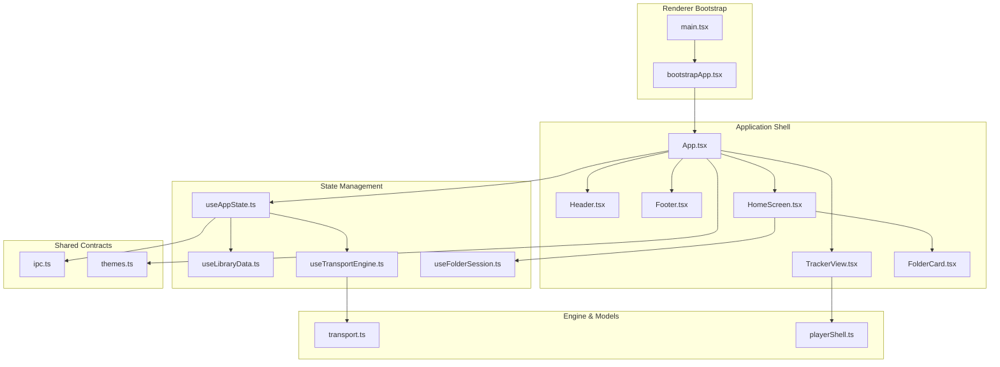
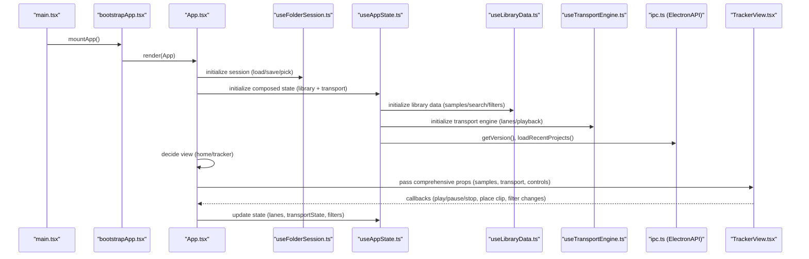
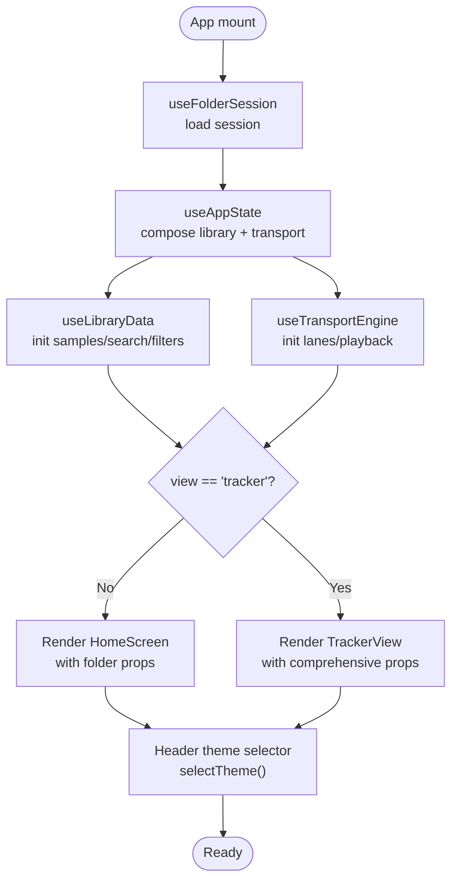
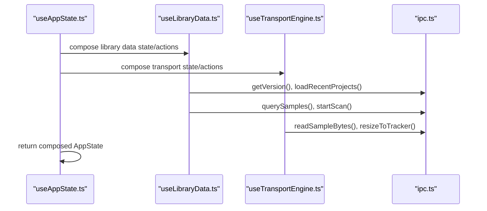
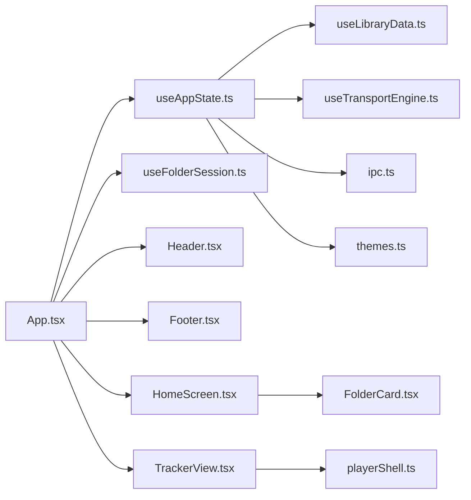

# Core Components

<cite>
**Referenced Files in This Document**
- [App.tsx](file://src/renderer/src/App.tsx)
- [useAppState.ts](file://src/renderer/src/hooks/useAppState.ts)
- [useLibraryData.ts](file://src/renderer/src/hooks/useLibraryData.ts)
- [useTransportEngine.ts](file://src/renderer/src/hooks/useTransportEngine.ts)
- [useFolderSession.ts](file://src/renderer/src/hooks/useFolderSession.ts)
- [Header.tsx](file://src/renderer/src/components/Header.tsx)
- [Footer.tsx](file://src/renderer/src/components/Footer.tsx)
- [HomeScreen.tsx](file://src/renderer/src/components/HomeScreen.tsx)
- [TrackerView.tsx](file://src/renderer/src/components/TrackerView.tsx)
- [FolderCard.tsx](file://src/renderer/src/components/FolderCard.tsx)
- [playerShell.ts](file://src/renderer/src/lib/playerShell.ts)
- [transport.ts](file://src/renderer/src/engine/transport.ts)
- [themes.ts](file://src/renderer/src/theme/themes.ts)
- [ipc.ts](file://src/shared/ipc.ts)
- [bootstrapApp.tsx](file://src/renderer/src/bootstrapApp.tsx)
- [main.tsx](file://src/renderer/src/main.tsx)
- [App.test.tsx](file://src/renderer/src/App.test.tsx)
- [useAppState.test.ts](file://src/renderer/src/hooks/useAppState.test.ts)
- [TrackerView.test.tsx](file://src/renderer/src/components/TrackerView.test.tsx)
- [spec-001-app-shell-navigation.test.tsx](file://src/renderer/src/specs/spec-001-app-shell-navigation.test.tsx)
</cite>

## Update Summary
**Changes Made**
- Updated App.tsx to reflect new state management with expanded property set including samples, searchQuery, loading, error, and totalCount
- Enhanced TrackerView.tsx documentation to cover integrated transport controls and visual playhead positioning
- Added documentation for the new modular architecture with separate useLibraryData and useTransportEngine hooks
- Updated state management patterns to reflect the refactored useAppState hook composition
- Added comprehensive coverage of the new sample browser state management system

## Table of Contents
1. [Introduction](#introduction)
2. [Project Structure](#project-structure)
3. [Core Components](#core-components)
4. [Architecture Overview](#architecture-overview)
5. [Detailed Component Analysis](#detailed-component-analysis)
6. [Dependency Analysis](#dependency-analysis)
7. [Performance Considerations](#performance-considerations)
8. [Troubleshooting Guide](#troubleshooting-guide)
9. [Conclusion](#conclusion)
10. [Appendices](#appendices)

## Introduction
This document describes MixJam Electron's core application shell and primary components. It explains the main App component architecture, view management, navigation patterns, state management via React hooks (especially the central useAppState hook), and the responsibilities of Header, Footer, HomeScreen, and TrackerView. The architecture has been refactored to use a modular approach with separate hooks for library data management and transport engine control, providing better separation of concerns and improved maintainability.

## Project Structure
The renderer-side application is organized around a modular architecture with specialized hooks managing different aspects of the application state:

- Application shell and orchestration live in App.tsx
- Central state management is now composed from useAppState.ts, which aggregates useLibraryData.ts and useTransportEngine.ts
- Session and folder selection are handled in useFolderSession.ts
- UI building blocks include Header, Footer, HomeScreen, TrackerView, and FolderCard
- Audio transport is encapsulated in transport.ts with Player integration
- Player model and lane/sample clipping logic are in playerShell.ts
- Theming is centralized in themes.ts
- Inter-process communication contract is defined in ipc.ts
- Bootstrapping and mounting are in bootstrapApp.tsx and main.tsx

**Diagram sources**
- [main.tsx:1-5](file://src/renderer/src/main.tsx#L1-L5)
- [bootstrapApp.tsx:1-19](file://src/renderer/src/bootstrapApp.tsx#L1-L19)
- [App.tsx:1-177](file://src/renderer/src/App.tsx#L1-L177)
- [useAppState.ts:1-77](file://src/renderer/src/hooks/useAppState.ts#L1-L77)
- [useLibraryData.ts:1-412](file://src/renderer/src/hooks/useLibraryData.ts#L1-L412)
- [useTransportEngine.ts:1-315](file://src/renderer/src/hooks/useTransportEngine.ts#L1-L315)
- [useFolderSession.ts:1-106](file://src/renderer/src/hooks/useFolderSession.ts#L1-L106)
- [Header.tsx:1-43](file://src/renderer/src/components/Header.tsx#L1-L43)
- [Footer.tsx:1-33](file://src/renderer/src/components/Footer.tsx#L1-L33)
- [HomeScreen.tsx:1-77](file://src/renderer/src/components/HomeScreen.tsx#L1-L77)
- [TrackerView.tsx:1-685](file://src/renderer/src/components/TrackerView.tsx#L1-L685)
- [FolderCard.tsx:1-60](file://src/renderer/src/components/FolderCard.tsx#L1-L60)
- [playerShell.ts:1-202](file://src/renderer/src/lib/playerShell.ts#L1-L202)
- [transport.ts:1-118](file://src/renderer/src/engine/transport.ts#L1-L118)
- [ipc.ts:1-59](file://src/shared/ipc.ts#L1-L59)
- [themes.ts:1-112](file://src/renderer/src/theme/themes.ts#L1-L112)

**Section sources**
- [App.tsx:1-177](file://src/renderer/src/App.tsx#L1-L177)
- [bootstrapApp.tsx:1-19](file://src/renderer/src/bootstrapApp.tsx#L1-L19)
- [main.tsx:1-5](file://src/renderer/src/main.tsx#L1-L5)

## Core Components
- App orchestrates views, wires global state, and delegates to Header, Footer, HomeScreen, and TrackerView
- useAppState now serves as a coordinator that composes useLibraryData and useTransportEngine, managing the unified application state
- useLibraryData manages the complete sample browser state including samples, searchQuery, loading, error, totalCount, and filtering
- useTransportEngine manages transport controls, playback state, and lane management
- useFolderSession manages persisted session folders and validation
- Header displays branding, optional home link, timer, and theme selector
- Footer shows version, settings folder action, and selected sample detail in tracker view
- HomeScreen presents folder selection cards and launch controls
- TrackerView renders the tracker UI with integrated transport controls and visual playhead positioning

**Section sources**
- [App.tsx:19-77](file://src/renderer/src/App.tsx#L19-L77)
- [useAppState.ts:8-76](file://src/renderer/src/hooks/useAppState.ts#L8-L76)
- [useLibraryData.ts:14-55](file://src/renderer/src/hooks/useLibraryData.ts#L14-L55)
- [useTransportEngine.ts:26-56](file://src/renderer/src/hooks/useTransportEngine.ts#L26-L56)
- [useFolderSession.ts:59-105](file://src/renderer/src/hooks/useFolderSession.ts#L59-L105)
- [Header.tsx:3-42](file://src/renderer/src/components/Header.tsx#L3-L42)
- [Footer.tsx:3-32](file://src/renderer/src/components/Footer.tsx#L3-L32)
- [HomeScreen.tsx:4-76](file://src/renderer/src/components/HomeScreen.tsx#L4-L76)
- [TrackerView.tsx:15-66](file://src/renderer/src/components/TrackerView.tsx#L15-L66)

## Architecture Overview
The App component is a thin orchestrator that now uses a composed state management approach:
- Resolves session folders via useFolderSession
- Initializes global state via useAppState, which aggregates useLibraryData and useTransportEngine
- Applies theme during bootstrap
- Renders either HomeScreen or TrackerView based on view state
- Passes down comprehensive props and callbacks to child components

The new architecture separates concerns into distinct hooks:
- useLibraryData: Manages sample browser state, search, filtering, and database operations
- useTransportEngine: Manages transport controls, playback state, and lane management
- useAppState: Coordinates the interaction between library data and transport engine

**Diagram sources**
- [main.tsx:1-5](file://src/renderer/src/main.tsx#L1-L5)
- [bootstrapApp.tsx:12-19](file://src/renderer/src/bootstrapApp.tsx#L12-L19)
- [App.tsx:11-77](file://src/renderer/src/App.tsx#L11-L77)
- [useFolderSession.ts:59-105](file://src/renderer/src/hooks/useFolderSession.ts#L59-L105)
- [useAppState.ts:20-76](file://src/renderer/src/hooks/useAppState.ts#L20-L76)
- [useLibraryData.ts:71-411](file://src/renderer/src/hooks/useLibraryData.ts#L71-L411)
- [useTransportEngine.ts:58-314](file://src/renderer/src/hooks/useTransportEngine.ts#L58-L314)
- [ipc.ts:40-58](file://src/shared/ipc.ts#L40-L58)
- [TrackerView.tsx:70-121](file://src/renderer/src/components/TrackerView.tsx#L70-L121)

## Detailed Component Analysis

### App Component
Responsibilities:
- Resolve session folders and derive canStart flag
- Initialize composed global state via useAppState (which aggregates library data and transport engine)
- Apply theme during bootstrap
- Render Header, content area, and Footer
- Switch between HomeScreen and TrackerView based on view state
- Wire theme change handler and pass comprehensive props to children

Key behaviors:
- Delegates folder selection and validation to useFolderSession
- Delegates composed state, transport, and navigation to useAppState
- Applies theme selection via themes.ts
- Propagates callbacks for transport, sample placement, filtering, and lane controls

**Diagram sources**
- [App.tsx:11-77](file://src/renderer/src/App.tsx#L11-L77)
- [useFolderSession.ts:59-105](file://src/renderer/src/hooks/useFolderSession.ts#L59-L105)
- [useAppState.ts:20-76](file://src/renderer/src/hooks/useAppState.ts#L20-L76)
- [useLibraryData.ts:71-411](file://src/renderer/src/hooks/useLibraryData.ts#L71-L411)
- [useTransportEngine.ts:58-314](file://src/renderer/src/hooks/useTransportEngine.ts#L58-L314)
- [themes.ts:100-111](file://src/renderer/src/theme/themes.ts#L100-L111)

**Section sources**
- [App.tsx:11-177](file://src/renderer/src/App.tsx#L11-L177)

### useAppState Hook
The useAppState hook now serves as a coordinator that composes useLibraryData and useTransportEngine:

Central state manager composition:
- Manages view state, version, elapsed timer, recent projects, and navigation actions
- Composes library data state and actions from useLibraryData
- Composes transport engine state and actions from useTransportEngine
- Provides navigation actions (goToTracker, goToHome), file loading, and theme actions
- Exposes transport controls and lane manipulation helpers

Key improvements:
- Separation of concerns: Library data management is handled by useLibraryData
- Transport engine management is handled by useTransportEngine
- Cleaner composition pattern with explicit state/action separation
- Better testability and maintainability

**Diagram sources**
- [useAppState.ts:20-76](file://src/renderer/src/hooks/useAppState.ts#L20-L76)
- [useLibraryData.ts:71-411](file://src/renderer/src/hooks/useLibraryData.ts#L71-L411)
- [useTransportEngine.ts:58-314](file://src/renderer/src/hooks/useTransportEngine.ts#L58-L314)
- [ipc.ts:40-58](file://src/shared/ipc.ts#L40-L58)

**Section sources**
- [useAppState.ts:8-76](file://src/renderer/src/hooks/useAppState.ts#L8-L76)

### useLibraryData Hook
Manages the complete sample browser state and operations:

State management:
- version: Application version string
- recentProjects: List of recently opened projects
- samples: Current list of sample items displayed in the browser
- searchQuery: Text search query for filtering samples
- loading: Loading state for asynchronous operations
- error: Error message for failed operations
- selectedSampleDetail: Currently selected sample for footer display
- scanProgress: Progress of library scanning operations
- totalCount: Total count of samples matching current filters
- selectedCategoryId: Currently selected category filter
- selectedTagIds: Currently selected tag filters
- sortBy: Current sorting column
- sortDir: Current sorting direction
- tags: Available tags for filtering
- categories: Available categories for filtering
- libraries: Saved library configurations

Key behaviors:
- Debounced search queries with sequence guards to prevent race conditions
- Database-backed sample querying after first scan completion
- Legacy folder-based browsing before database is indexed
- Category and tag management with CRUD operations
- Sorting and filtering with persistent state

**Section sources**
- [useLibraryData.ts:14-55](file://src/renderer/src/hooks/useLibraryData.ts#L14-L55)
- [useLibraryData.ts:71-411](file://src/renderer/src/hooks/useLibraryData.ts#L71-L411)

### useTransportEngine Hook
Manages transport controls, playback state, and lane management:

State management:
- view: Current application view ('home' or 'tracker')
- timerText: Formatted elapsed time display
- lanes: Complete lane state with clips and routing
- transportState: Current transport state ('stopped', 'playing', 'paused')
- currentTick: Current playhead position in ticks
- bpm: Current tempo setting
- masterGain: Master volume level
- masterLevelDb: Current master output level
- elapsedMs: Accumulated elapsed milliseconds

Key behaviors:
- Transport lifecycle management with proper cleanup
- Player integration for audio playback
- Lane manipulation with drag-and-drop support
- Transport controls with proper state synchronization
- Preview functionality with transport-aware scheduling

**Section sources**
- [useTransportEngine.ts:26-56](file://src/renderer/src/hooks/useTransportEngine.ts#L26-L56)
- [useTransportEngine.ts:58-314](file://src/renderer/src/hooks/useTransportEngine.ts#L58-L314)

### Header Component
Responsibilities:
- Displays brand and optional home link depending on view
- Shows elapsed timer in tracker view
- Provides theme selector dropdown wired to selectTheme

Integration:
- Receives view, timer, onHome, and onThemeChange from App
- Uses THEME_OPTIONS from themes.ts

**Section sources**
- [Header.tsx:3-42](file://src/renderer/src/components/Header.tsx#L3-L42)
- [themes.ts:3-12](file://src/renderer/src/theme/themes.ts#L3-L12)

### Footer Component
Responsibilities:
- Offers settings folder action and opens repo/version action
- In tracker view, shows selected sample detail (name, path, metadata, tags)

Integration:
- Receives view, version, sampleDetail, and callbacks from App

**Section sources**
- [Footer.tsx:3-32](file://src/renderer/src/components/Footer.tsx#L3-L32)

### HomeScreen Component
Responsibilities:
- Presents two FolderCard components for user and sample folders
- Enables Start New MixJam only when both folders are set
- Provides Load MixJam action

Integration:
- Receives folder state, canStart, and callbacks from App/useFolderSession

**Section sources**
- [HomeScreen.tsx:4-76](file://src/renderer/src/components/HomeScreen.tsx#L4-L76)
- [FolderCard.tsx:7-59](file://src/renderer/src/components/FolderCard.tsx#L7-L59)

### TrackerView Component
Responsibilities:
- Renders five labeled zones: recent projects, timeline/lanes, middle strip controls, song controls, and sample browser
- Handles placing samples onto lanes at nearest tick positions with visual playhead integration
- Integrates transport controls with visual playhead positioning
- Manages comprehensive sample browser with filtering, sorting, and categorization

Key behaviors:
- Calculates nearest tick based on click position and total ticks for precise placement
- Renders mute/solo controls per lane with dimming logic based on solo state
- Displays selected sample detail and advanced search/filter controls
- Shows visual playhead that tracks current audio position
- Integrates transport controls with proper state synchronization
- Supports drag-and-drop between browser and timeline

**Updated** Enhanced with integrated transport controls and visual playhead positioning that tracks current audio position in real-time

**Section sources**
- [TrackerView.tsx:15-66](file://src/renderer/src/components/TrackerView.tsx#L15-L66)
- [TrackerView.tsx:296-407](file://src/renderer/src/components/TrackerView.tsx#L296-L407)
- [TrackerView.tsx:409-504](file://src/renderer/src/components/TrackerView.tsx#L409-L504)
- [playerShell.ts:29-202](file://src/renderer/src/lib/playerShell.ts#L29-L202)

### State Model and Composition Patterns
Composition patterns:
- App composes Header, Footer, and conditional content (HomeScreen or TrackerView)
- useAppState composes useLibraryData and useTransportEngine for unified state management
- useLibraryData manages comprehensive sample browser state and operations
- useTransportEngine manages transport controls and lane management
- HomeScreen composes FolderCard instances
- TrackerView composes lanes, clips, and browser panes with integrated transport controls

Reusability:
- playerShell provides reusable lane and clip manipulation functions
- transport encapsulates playback scheduling and BPM control
- themes provides a theme token system applied via CSS custom properties
- Modular hook architecture enables independent testing and maintenance

**Section sources**
- [App.tsx:91-176](file://src/renderer/src/App.tsx#L91-L176)
- [useAppState.ts:20-76](file://src/renderer/src/hooks/useAppState.ts#L20-L76)
- [useLibraryData.ts:376-411](file://src/renderer/src/hooks/useLibraryData.ts#L376-L411)
- [useTransportEngine.ts:288-314](file://src/renderer/src/hooks/useTransportEngine.ts#L288-L314)
- [HomeScreen.tsx:42-75](file://src/renderer/src/components/HomeScreen.tsx#L42-L75)
- [TrackerView.tsx:270-684](file://src/renderer/src/components/TrackerView.tsx#L270-L684)
- [playerShell.ts:29-202](file://src/renderer/src/lib/playerShell.ts#L29-L202)
- [transport.ts:39-116](file://src/renderer/src/engine/transport.ts#L39-L116)
- [themes.ts:90-111](file://src/renderer/src/theme/themes.ts#L90-L111)

## Dependency Analysis
High-level dependencies with the new modular architecture:
- App depends on useAppState, which composes useLibraryData and useTransportEngine
- useAppState depends on useFolderSession for session management
- useLibraryData depends on ipc contracts for database operations
- useTransportEngine depends on transport and playerShell for audio playback
- Header/Footer depend on App-provided props
- HomeScreen depends on FolderCard and App/useFolderSession
- TrackerView depends on playerShell and App/useAppState
- Themes are applied globally during bootstrap

**Diagram sources**
- [App.tsx:1-177](file://src/renderer/src/App.tsx#L1-L177)
- [useAppState.ts:1-77](file://src/renderer/src/hooks/useAppState.ts#L1-L77)
- [useLibraryData.ts:1-412](file://src/renderer/src/hooks/useLibraryData.ts#L1-L412)
- [useTransportEngine.ts:1-315](file://src/renderer/src/hooks/useTransportEngine.ts#L1-L315)
- [useFolderSession.ts:1-106](file://src/renderer/src/hooks/useFolderSession.ts#L1-L106)
- [Header.tsx:1-43](file://src/renderer/src/components/Header.tsx#L1-L43)
- [Footer.tsx:1-33](file://src/renderer/src/components/Footer.tsx#L1-L33)
- [HomeScreen.tsx:1-77](file://src/renderer/src/components/HomeScreen.tsx#L1-L77)
- [TrackerView.tsx:1-685](file://src/renderer/src/components/TrackerView.tsx#L1-L685)
- [FolderCard.tsx:1-60](file://src/renderer/src/components/FolderCard.tsx#L1-L60)
- [playerShell.ts:1-202](file://src/renderer/src/lib/playerShell.ts#L1-L202)
- [ipc.ts:1-59](file://src/shared/ipc.ts#L1-L59)
- [themes.ts:1-112](file://src/renderer/src/theme/themes.ts#L1-L112)

**Section sources**
- [App.tsx:1-177](file://src/renderer/src/App.tsx#L1-L177)
- [useAppState.ts:1-77](file://src/renderer/src/hooks/useAppState.ts#L1-L77)

## Performance Considerations
- Debounced sample browser queries: useLibraryData delays queries by 150ms and cancels stale responses using a sequence guard to avoid UI thrash
- Timer precision: The tracker view timer updates at 100 ms intervals while in tracker view; unmounting clears the interval to prevent leaks
- Transport scheduling: Transport uses a configurable scheduler abstraction to support deterministic testing and efficient tick scheduling
- Rendering cost: TrackerView computes styles dynamically for lanes and clips; memoization and stable callbacks minimize re-renders
- Modular architecture: Separate hooks enable independent optimization and selective re-rendering
- Visual playhead synchronization: Playhead updates are driven by audio clock for perfect synchronization

**Updated** Enhanced performance considerations with modular architecture benefits and visual playhead synchronization

## Troubleshooting Guide
Common issues and resolutions:
- Version fetch failures: useLibraryData falls back to a safe version string and logs errors; verify ElectronAPI.getVersion availability
- Timer not resetting: Ensure view transitions trigger cleanup; unmounting the tracker view clears intervals
- Stale sample browser results: Queries are guarded by sequence numbers; confirm the latest query is not being superseded
- Theme selector behavior: Non-implemented themes reset to Emerald; verify theme keys and applyTheme logic
- Transport state drift: Transport state is synchronized via callbacks; ensure transportPlay/pause/stop are invoked consistently
- Visual playhead desynchronization: Playhead is driven by audio clock; check transport and player lifecycle management
- Sample browser filtering issues: Verify category/tag state synchronization and debounce timing

**Updated** Added troubleshooting guidance for new modular architecture and visual playhead synchronization

**Section sources**
- [useLibraryData.ts:98-108](file://src/renderer/src/hooks/useLibraryData.ts#L98-L108)
- [useLibraryData.ts:205-248](file://src/renderer/src/hooks/useLibraryData.ts#L205-L248)
- [useTransportEngine.ts:87-119](file://src/renderer/src/hooks/useTransportEngine.ts#L87-L119)
- [themes.ts:73-83](file://src/renderer/src/theme/themes.ts#L73-L83)
- [transport.ts:76-92](file://src/renderer/src/engine/transport.ts#L76-L92)

## Conclusion
MixJam Electron's core architecture has evolved to a modular design that centers on clean separation of concerns: App orchestrates views and passes props, useAppState manages composed global state by coordinating useLibraryData and useTransportEngine, and specialized components encapsulate UI and domain logic. The refactoring improves maintainability, testability, and scalability while preserving the existing functionality and adding new capabilities like visual playhead synchronization and comprehensive sample browser management.

## Appendices

### Component Lifecycle and Event Handling
- App lifecycle: Mounted via bootstrapApp, theme applied before React renders, then renders the appropriate view with composed state
- useAppState lifecycle: Initializes version and projects, manages timer and transport, debounces queries, and coordinates library/transport lifecycle
- useLibraryData lifecycle: Manages sample browser state, handles database operations, and maintains filter state
- useTransportEngine lifecycle: Creates transport and player instances, manages playback state, and handles cleanup
- TrackerView lifecycle: Renders lanes and clips with visual playhead; handles clicks to place samples and transport events; maintains accessibility attributes

**Updated** Enhanced lifecycle documentation to reflect modular architecture

**Section sources**
- [bootstrapApp.tsx:12-19](file://src/renderer/src/bootstrapApp.tsx#L12-L19)
- [useAppState.ts:31-76](file://src/renderer/src/hooks/useAppState.ts#L31-L76)
- [useLibraryData.ts:100-143](file://src/renderer/src/hooks/useLibraryData.ts#L100-L143)
- [useTransportEngine.ts:128-166](file://src/renderer/src/hooks/useTransportEngine.ts#L128-L166)
- [TrackerView.tsx:59-65](file://src/renderer/src/components/TrackerView.tsx#L59-L65)

### Integration with Audio Engine
- Transport creation and control are encapsulated in transport.ts; useTransportEngine creates and manages Transport instances and exposes play/pause/stop/skipBack
- Player integration provides audio playback with master gain control and level monitoring
- Lane and clip manipulation are handled by playerShell functions, which are invoked by useTransportEngine and passed down to TrackerView
- Visual playhead positioning is synchronized with audio clock for perfect timing

**Updated** Enhanced integration documentation to reflect transport engine improvements and visual playhead synchronization

**Section sources**
- [transport.ts:39-116](file://src/renderer/src/engine/transport.ts#L39-L116)
- [useTransportEngine.ts:137-166](file://src/renderer/src/hooks/useTransportEngine.ts#L137-L166)
- [playerShell.ts:54-202](file://src/renderer/src/lib/playerShell.ts#L54-L202)

### Test Coverage Highlights
- App tests verify navigation, theme application, and comprehensive state management
- useAppState tests validate timer behavior, file loading, and coordinated library/transport operations
- useLibraryData tests validate debounced queries, filtering, and database operations
- useTransportEngine tests validate transport controls, playback state, and lane management
- TrackerView tests validate transport controls, visual playhead, and drag-and-drop functionality
- Acceptance tests validate window sizing, header/footer layout, and roundtrip navigation

**Updated** Enhanced test coverage highlights to reflect new modular architecture and comprehensive functionality

**Section sources**
- [App.test.tsx:1-97](file://src/renderer/src/App.test.tsx#L1-L97)
- [useAppState.test.ts:1-200](file://src/renderer/src/hooks/useAppState.test.ts#L1-L200)
- [useLibraryData.ts:146-248](file://src/renderer/src/hooks/useLibraryData.ts#L146-L248)
- [useTransportEngine.ts:235-280](file://src/renderer/src/hooks/useTransportEngine.ts#L235-L280)
- [TrackerView.test.tsx:1-200](file://src/renderer/src/components/TrackerView.test.tsx#L1-L200)
- [spec-001-app-shell-navigation.test.tsx:1-304](file://src/renderer/src/specs/spec-001-app-shell-navigation.test.tsx#L1-L304)