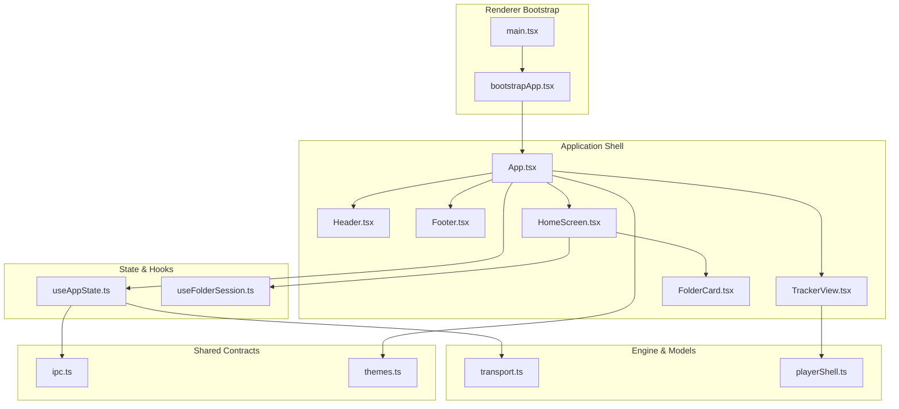
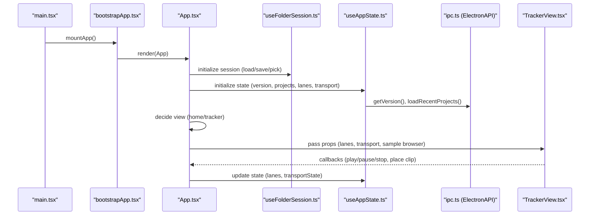
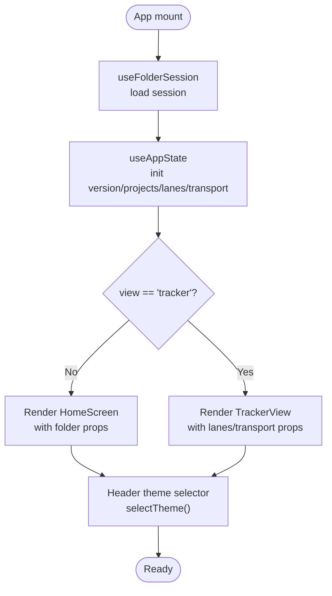
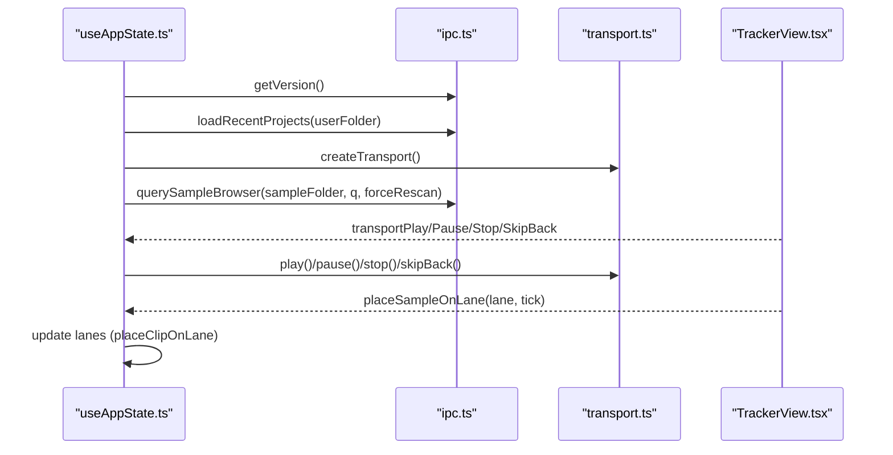
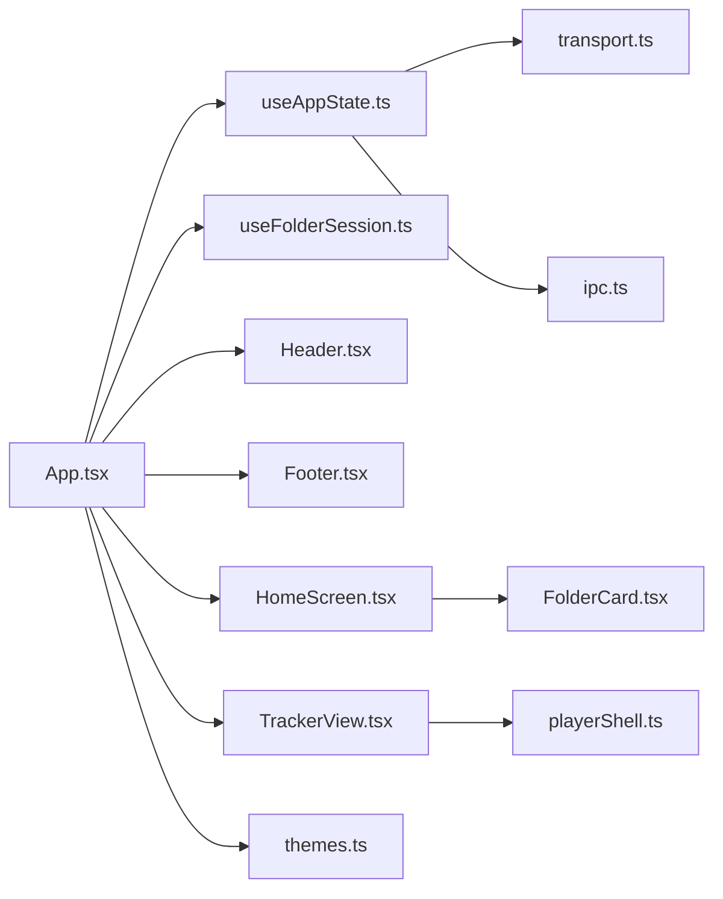

# Core Components

<cite>
**Referenced Files in This Document**
- [App.tsx](file://src/renderer/src/App.tsx)
- [useAppState.ts](file://src/renderer/src/hooks/useAppState.ts)
- [useFolderSession.ts](file://src/renderer/src/hooks/useFolderSession.ts)
- [Header.tsx](file://src/renderer/src/components/Header.tsx)
- [Footer.tsx](file://src/renderer/src/components/Footer.tsx)
- [HomeScreen.tsx](file://src/renderer/src/components/HomeScreen.tsx)
- [TrackerView.tsx](file://src/renderer/src/components/TrackerView.tsx)
- [FolderCard.tsx](file://src/renderer/src/components/FolderCard.tsx)
- [playerShell.ts](file://src/renderer/src/lib/playerShell.ts)
- [transport.ts](file://src/renderer/src/engine/transport.ts)
- [themes.ts](file://src/renderer/src/theme/themes.ts)
- [ipc.ts](file://src/shared/ipc.ts)
- [bootstrapApp.tsx](file://src/renderer/src/bootstrapApp.tsx)
- [main.tsx](file://src/renderer/src/main.tsx)
- [App.test.tsx](file://src/renderer/src/App.test.tsx)
- [useAppState.test.ts](file://src/renderer/src/hooks/useAppState.test.ts)
- [spec-001-app-shell-navigation.test.tsx](file://src/renderer/src/specs/spec-001-app-shell-navigation.test.tsx)
</cite>

## Table of Contents
1. [Introduction](#introduction)
2. [Project Structure](#project-structure)
3. [Core Components](#core-components)
4. [Architecture Overview](#architecture-overview)
5. [Detailed Component Analysis](#detailed-component-analysis)
6. [Dependency Analysis](#dependency-analysis)
7. [Performance Considerations](#performance-considerations)
8. [Troubleshooting Guide](#troubleshooting-guide)
9. [Conclusion](#conclusion)
10. [Appendices](#appendices)

## Introduction
This document describes MixJam Electron’s core application shell and primary components. It explains the main App component architecture, view management, navigation patterns, state management via React hooks (especially the central useAppState hook), and the responsibilities of Header, Footer, HomeScreen, and TrackerView. It also covers component lifecycle, prop interfaces, event handling, state synchronization, composition patterns, reusability strategies, and integration with the underlying audio transport engine.

## Project Structure
The renderer-side application is organized around a small set of core files:
- Application shell and orchestration live in App.tsx
- Central state is managed in useAppState.ts
- Session and folder selection are handled in useFolderSession.ts
- UI building blocks include Header, Footer, HomeScreen, TrackerView, and FolderCard
- Audio transport is encapsulated in transport.ts
- Player model and lane/sample clipping logic are in playerShell.ts
- Theming is centralized in themes.ts
- Inter-process communication contract is defined in ipc.ts
- Bootstrapping and mounting are in bootstrapApp.tsx and main.tsx

**Diagram sources**
- [main.tsx:1-5](file://src/renderer/src/main.tsx#L1-L5)
- [bootstrapApp.tsx:1-19](file://src/renderer/src/bootstrapApp.tsx#L1-L19)
- [App.tsx:1-108](file://src/renderer/src/App.tsx#L1-L108)
- [Header.tsx:1-43](file://src/renderer/src/components/Header.tsx#L1-L43)
- [Footer.tsx:1-33](file://src/renderer/src/components/Footer.tsx#L1-L33)
- [HomeScreen.tsx:1-77](file://src/renderer/src/components/HomeScreen.tsx#L1-L77)
- [TrackerView.tsx:1-270](file://src/renderer/src/components/TrackerView.tsx#L1-L270)
- [FolderCard.tsx:1-60](file://src/renderer/src/components/FolderCard.tsx#L1-L60)
- [useAppState.ts:1-295](file://src/renderer/src/hooks/useAppState.ts#L1-L295)
- [useFolderSession.ts:1-106](file://src/renderer/src/hooks/useFolderSession.ts#L1-L106)
- [transport.ts:1-118](file://src/renderer/src/engine/transport.ts#L1-L118)
- [playerShell.ts:1-132](file://src/renderer/src/lib/playerShell.ts#L1-L132)
- [ipc.ts:1-59](file://src/shared/ipc.ts#L1-L59)
- [themes.ts:1-112](file://src/renderer/src/theme/themes.ts#L1-L112)

**Section sources**
- [App.tsx:1-108](file://src/renderer/src/App.tsx#L1-L108)
- [bootstrapApp.tsx:1-19](file://src/renderer/src/bootstrapApp.tsx#L1-L19)
- [main.tsx:1-5](file://src/renderer/src/main.tsx#L1-L5)

## Core Components
- App orchestrates views, wires global state, and delegates to Header, Footer, HomeScreen, and TrackerView.
- useAppState centralizes application state, timers, transport, sample browser queries, and navigation actions.
- useFolderSession manages persisted session folders and validation.
- Header displays branding, optional home link, timer, and theme selector.
- Footer shows version, settings folder action, and selected sample detail in tracker view.
- HomeScreen presents folder selection cards and launch controls.
- TrackerView renders the tracker UI, lanes, transport controls, and sample browser.

**Section sources**
- [App.tsx:9-107](file://src/renderer/src/App.tsx#L9-L107)
- [useAppState.ts:28-294](file://src/renderer/src/hooks/useAppState.ts#L28-L294)
- [useFolderSession.ts:59-105](file://src/renderer/src/hooks/useFolderSession.ts#L59-L105)
- [Header.tsx:3-42](file://src/renderer/src/components/Header.tsx#L3-L42)
- [Footer.tsx:3-32](file://src/renderer/src/components/Footer.tsx#L3-L32)
- [HomeScreen.tsx:4-76](file://src/renderer/src/components/HomeScreen.tsx#L4-L76)
- [TrackerView.tsx:5-269](file://src/renderer/src/components/TrackerView.tsx#L5-L269)

## Architecture Overview
The App component is a thin orchestrator that:
- Resolves session folders via useFolderSession
- Initializes global state via useAppState
- Applies theme during bootstrap
- Renders either HomeScreen or TrackerView based on view state
- Passes down props and callbacks to child components

**Diagram sources**
- [main.tsx:1-5](file://src/renderer/src/main.tsx#L1-L5)
- [bootstrapApp.tsx:12-19](file://src/renderer/src/bootstrapApp.tsx#L12-L19)
- [App.tsx:9-107](file://src/renderer/src/App.tsx#L9-L107)
- [useFolderSession.ts:59-105](file://src/renderer/src/hooks/useFolderSession.ts#L59-L105)
- [useAppState.ts:49-187](file://src/renderer/src/hooks/useAppState.ts#L49-L187)
- [ipc.ts:40-58](file://src/shared/ipc.ts#L40-L58)
- [TrackerView.tsx:36-56](file://src/renderer/src/components/TrackerView.tsx#L36-L56)

## Detailed Component Analysis

### App Component
Responsibilities:
- Resolve session folders and derive canStart flag
- Initialize global state and transport
- Render Header, content area, and Footer
- Switch between HomeScreen and TrackerView based on view state
- Wire theme change handler and pass props to children

Key behaviors:
- Delegates folder selection and validation to useFolderSession
- Delegates state, transport, and navigation to useAppState
- Applies theme selection via themes.ts
- Propagates callbacks for transport, sample placement, and lane toggles

**Diagram sources**
- [App.tsx:9-107](file://src/renderer/src/App.tsx#L9-L107)
- [useFolderSession.ts:59-105](file://src/renderer/src/hooks/useFolderSession.ts#L59-L105)
- [useAppState.ts:49-187](file://src/renderer/src/hooks/useAppState.ts#L49-L187)
- [themes.ts:100-111](file://src/renderer/src/theme/themes.ts#L100-L111)

**Section sources**
- [App.tsx:9-107](file://src/renderer/src/App.tsx#L9-L107)

### useAppState Hook
Central state manager:
- Manages view state, version, elapsed timer, recent projects, sample browser state, selected sample detail, and lane state
- Creates and manages a Transport instance for playback timing
- Implements debounced sample browser queries with sequence guards
- Provides navigation actions (goToTracker, goToHome), file loading, and theme actions
- Exposes transport controls and lane manipulation helpers

Lifecycle and effects:
- Fetches app version and recent projects on mount
- Starts/stops a timer when entering/exiting tracker view
- Creates/destroys transport instance on view transitions
- Debounces search queries and cancels stale responses

**Diagram sources**
- [useAppState.ts:49-187](file://src/renderer/src/hooks/useAppState.ts#L49-L187)
- [transport.ts:39-116](file://src/renderer/src/engine/transport.ts#L39-L116)
- [playerShell.ts:39-95](file://src/renderer/src/lib/playerShell.ts#L39-L95)
- [ipc.ts:40-58](file://src/shared/ipc.ts#L40-L58)

**Section sources**
- [useAppState.ts:28-294](file://src/renderer/src/hooks/useAppState.ts#L28-L294)

### Header Component
Responsibilities:
- Displays brand and optional home link depending on view
- Shows elapsed timer in tracker view
- Provides theme selector dropdown wired to selectTheme

Integration:
- Receives view, timer, onHome, and onThemeChange from App
- Uses THEME_OPTIONS from themes.ts

**Section sources**
- [Header.tsx:3-42](file://src/renderer/src/components/Header.tsx#L3-L42)
- [themes.ts:3-12](file://src/renderer/src/theme/themes.ts#L3-L12)

### Footer Component
Responsibilities:
- Offers settings folder action and opens repo/version action
- In tracker view, shows selected sample detail (name, path, metadata, tags)

Integration:
- Receives view, version, sampleDetail, and callbacks from App

**Section sources**
- [Footer.tsx:3-32](file://src/renderer/src/components/Footer.tsx#L3-L32)

### HomeScreen Component
Responsibilities:
- Presents two FolderCard components for user and sample folders
- Enables Start New MixJam only when both folders are set
- Provides Load MixJam action

Integration:
- Receives folder state, canStart, and callbacks from App/useFolderSession

**Section sources**
- [HomeScreen.tsx:4-76](file://src/renderer/src/components/HomeScreen.tsx#L4-L76)
- [FolderCard.tsx:7-59](file://src/renderer/src/components/FolderCard.tsx#L7-L59)

### TrackerView Component
Responsibilities:
- Renders five labeled zones: recent projects, timeline/lanes, middle strip controls, song controls, and sample browser
- Handles placing samples onto lanes at nearest tick positions
- Exposes transport controls and sample browser interactions

Key behaviors:
- Calculates nearest tick based on click position and total ticks
- Renders mute/solo controls per lane and dimming logic based on solo state
- Displays selected sample detail and search/filter controls

**Section sources**
- [TrackerView.tsx:5-269](file://src/renderer/src/components/TrackerView.tsx#L5-L269)
- [playerShell.ts:29-132](file://src/renderer/src/lib/playerShell.ts#L29-L132)

### State Model and Composition Patterns
Composition patterns:
- App composes Header, Footer, and conditional content (HomeScreen or TrackerView)
- HomeScreen composes FolderCard instances
- TrackerView composes lanes, clips, and browser panes
- useAppState composes transport, lanes, and browser state

Reusability:
- playerShell provides reusable lane and clip manipulation functions
- transport encapsulates playback scheduling and BPM control
- themes provides a theme token system applied via CSS custom properties

**Section sources**
- [App.tsx:55-104](file://src/renderer/src/App.tsx#L55-L104)
- [HomeScreen.tsx:42-75](file://src/renderer/src/components/HomeScreen.tsx#L42-L75)
- [TrackerView.tsx:90-266](file://src/renderer/src/components/TrackerView.tsx#L90-L266)
- [playerShell.ts:29-132](file://src/renderer/src/lib/playerShell.ts#L29-L132)
- [transport.ts:39-116](file://src/renderer/src/engine/transport.ts#L39-L116)
- [themes.ts:90-111](file://src/renderer/src/theme/themes.ts#L90-L111)

## Dependency Analysis
High-level dependencies:
- App depends on useAppState and useFolderSession
- Header/Footer depend on App-provided props
- HomeScreen depends on FolderCard and App/useFolderSession
- TrackerView depends on playerShell and App/useAppState
- useAppState depends on transport and ipc contracts
- Themes are applied globally during bootstrap

**Diagram sources**
- [App.tsx:1-107](file://src/renderer/src/App.tsx#L1-L107)
- [useAppState.ts:1-295](file://src/renderer/src/hooks/useAppState.ts#L1-L295)
- [useFolderSession.ts:1-106](file://src/renderer/src/hooks/useFolderSession.ts#L1-L106)
- [Header.tsx:1-43](file://src/renderer/src/components/Header.tsx#L1-L43)
- [Footer.tsx:1-33](file://src/renderer/src/components/Footer.tsx#L1-L33)
- [HomeScreen.tsx:1-77](file://src/renderer/src/components/HomeScreen.tsx#L1-L77)
- [TrackerView.tsx:1-270](file://src/renderer/src/components/TrackerView.tsx#L1-L270)
- [FolderCard.tsx:1-60](file://src/renderer/src/components/FolderCard.tsx#L1-L60)
- [playerShell.ts:1-132](file://src/renderer/src/lib/playerShell.ts#L1-L132)
- [transport.ts:1-118](file://src/renderer/src/engine/transport.ts#L1-L118)
- [ipc.ts:1-59](file://src/shared/ipc.ts#L1-L59)
- [themes.ts:1-112](file://src/renderer/src/theme/themes.ts#L1-L112)

**Section sources**
- [App.tsx:1-107](file://src/renderer/src/App.tsx#L1-L107)
- [useAppState.ts:1-295](file://src/renderer/src/hooks/useAppState.ts#L1-L295)

## Performance Considerations
- Debounced sample browser queries: useAppState delays queries by a short timeout and cancels stale responses using a sequence guard to avoid UI thrash.
- Timer precision: The tracker view timer updates at 100 ms intervals while in tracker view; unmounting clears the interval to prevent leaks.
- Transport scheduling: Transport uses a configurable scheduler abstraction to support deterministic testing and efficient tick scheduling.
- Rendering cost: TrackerView computes styles dynamically for lanes and clips; memoization and stable callbacks minimize re-renders.

[No sources needed since this section provides general guidance]

## Troubleshooting Guide
Common issues and resolutions:
- Version fetch failures: useAppState falls back to a safe version string and logs errors; verify ElectronAPI.getVersion availability.
- Timer not resetting: Ensure view transitions trigger cleanup; unmounting the tracker view clears intervals.
- Stale sample browser results: Queries are guarded by sequence numbers; confirm the latest query is not being superseded.
- Theme selector behavior: Non-implemented themes reset to Emerald; verify theme keys and applyTheme logic.
- Transport state drift: Transport state is synchronized via callbacks; ensure transportPlay/pause/stop are invoked consistently.

**Section sources**
- [useAppState.ts:49-69](file://src/renderer/src/hooks/useAppState.ts#L49-L69)
- [useAppState.ts:158-187](file://src/renderer/src/hooks/useAppState.ts#L158-L187)
- [useAppState.ts:93-124](file://src/renderer/src/hooks/useAppState.ts#L93-L124)
- [themes.ts:73-83](file://src/renderer/src/theme/themes.ts#L73-L83)
- [transport.ts:76-92](file://src/renderer/src/engine/transport.ts#L76-L92)

## Conclusion
MixJam Electron’s core architecture centers on a clean separation of concerns: App orchestrates views and passes props, useAppState manages global state and transport, and specialized components encapsulate UI and domain logic. The design emphasizes composability, testability, and clear boundaries between UI, state, and engine layers.

[No sources needed since this section summarizes without analyzing specific files]

## Appendices

### Component Lifecycle and Event Handling
- App lifecycle: Mounted via bootstrapApp, theme applied before React renders, then renders the appropriate view.
- useAppState lifecycle: Initializes version and projects, manages timer and transport, debounces queries, and cleans up on unmount.
- TrackerView lifecycle: Renders lanes and clips; handles clicks to place samples and transport events; maintains accessibility attributes.

**Section sources**
- [bootstrapApp.tsx:12-19](file://src/renderer/src/bootstrapApp.tsx#L12-L19)
- [useAppState.ts:49-187](file://src/renderer/src/hooks/useAppState.ts#L49-L187)
- [TrackerView.tsx:59-65](file://src/renderer/src/components/TrackerView.tsx#L59-L65)

### Integration with Audio Engine
- Transport creation and control are encapsulated in transport.ts; useAppState creates and destroys the Transport instance and exposes play/pause/stop/skipBack.
- Lane and clip manipulation are handled by playerShell functions, which are invoked by useAppState and passed down to TrackerView.

**Section sources**
- [transport.ts:39-116](file://src/renderer/src/engine/transport.ts#L39-L116)
- [useAppState.ts:165-175](file://src/renderer/src/hooks/useAppState.ts#L165-L175)
- [playerShell.ts:39-132](file://src/renderer/src/lib/playerShell.ts#L39-L132)

### Test Coverage Highlights
- App tests verify navigation, theme application, and clip placement.
- useAppState tests validate timer behavior, file loading, and lane operations.
- Acceptance tests validate window sizing, header/footer layout, and roundtrip navigation.

**Section sources**
- [App.test.tsx:1-97](file://src/renderer/src/App.test.tsx#L1-L97)
- [useAppState.test.ts:1-204](file://src/renderer/src/hooks/useAppState.test.ts#L1-L204)
- [spec-001-app-shell-navigation.test.tsx:1-304](file://src/renderer/src/specs/spec-001-app-shell-navigation.test.tsx#L1-L304)