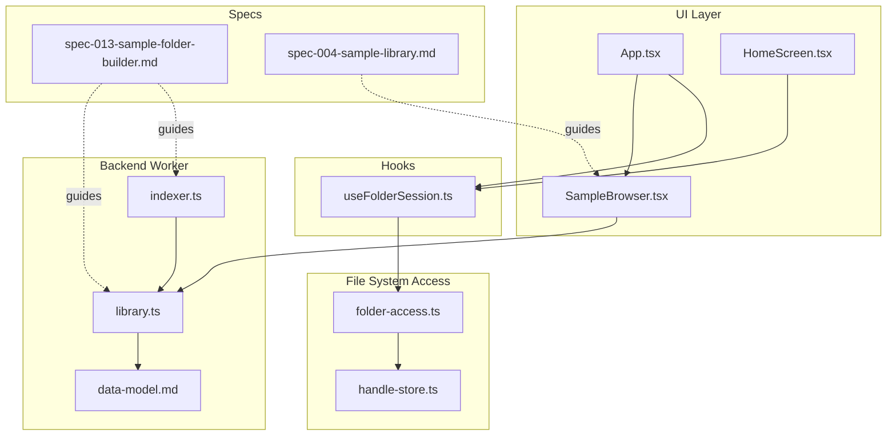
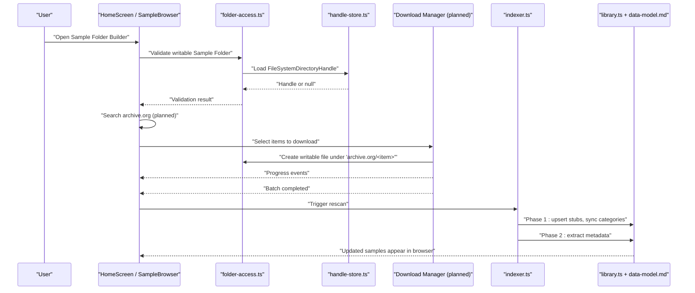
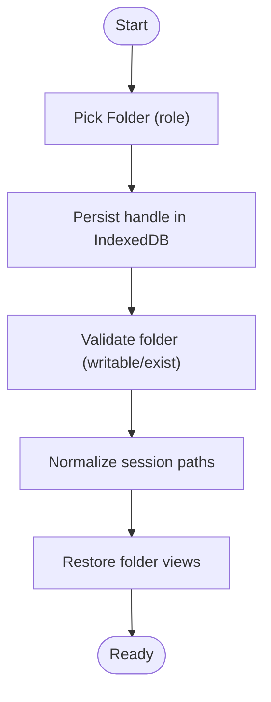
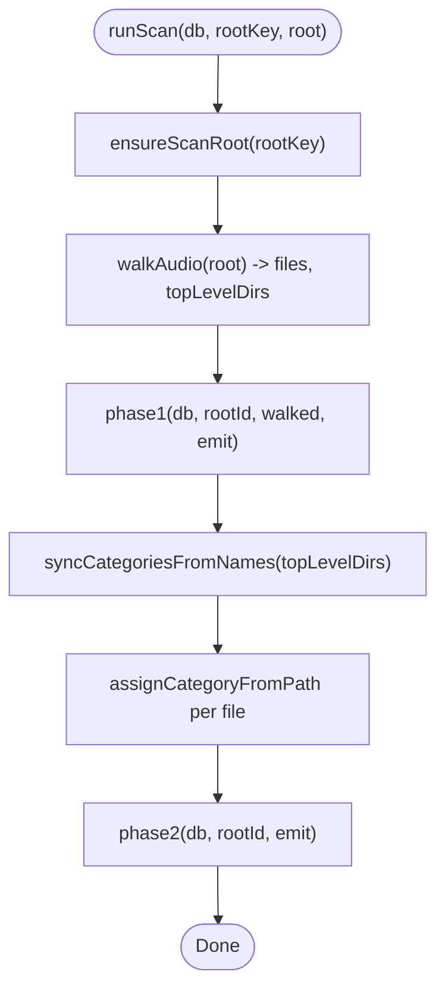
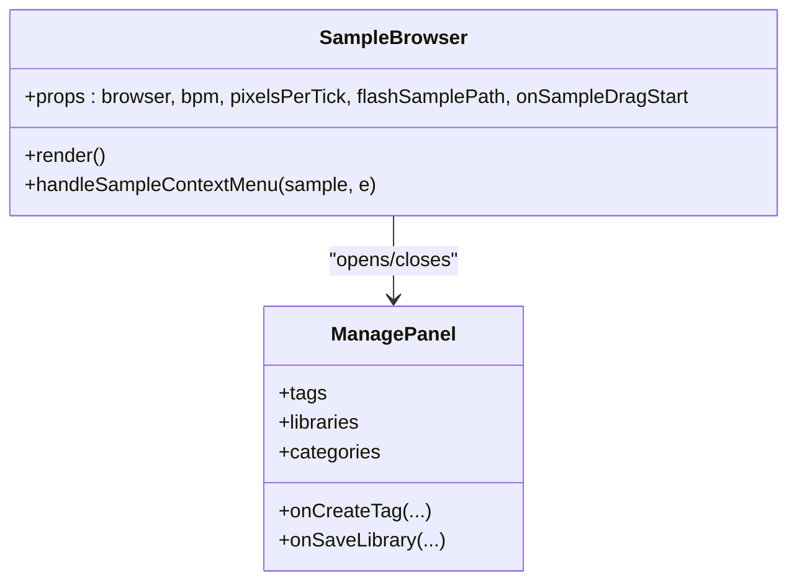
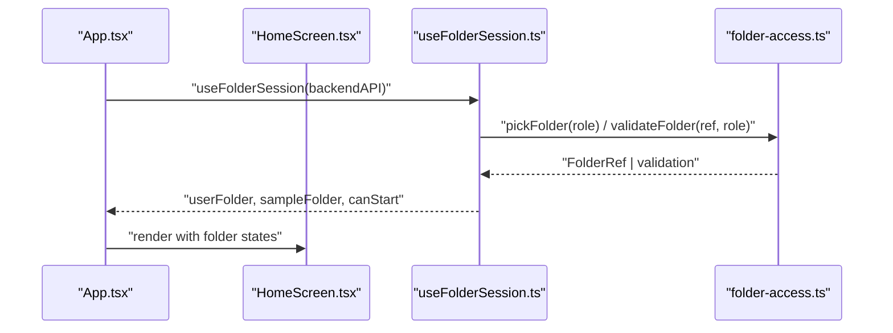
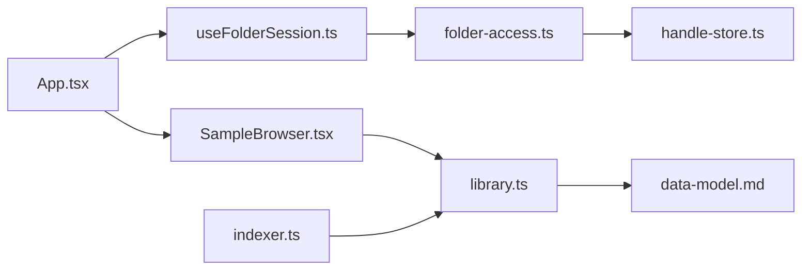

# Sample Folder Builder & Archive.org Integration

<cite>
**Referenced Files in This Document**
- [spec-013-sample-folder-builder.md](file://docs/specs/spec-013-sample-folder-builder.md)
- [spec-004-sample-library.md](file://docs/specs/spec-004-sample-library.md)
- [data-model.md](file://docs/data-model.md)
- [indexer.ts](file://src/renderer/src/backend/indexer.ts)
- [library.ts](file://src/renderer/src/backend/library.ts)
- [folder-access.ts](file://src/renderer/src/backend/folder-access.ts)
- [handle-store.ts](file://src/renderer/src/backend/handle-store.ts)
- [session.ts](file://src/renderer/src/backend/session.ts)
- [useFolderSession.ts](file://src/renderer/src/hooks/useFolderSession.ts)
- [SampleBrowser.tsx](file://src/renderer/src/components/SampleBrowser.tsx)
- [App.tsx](file://src/renderer/src/App.tsx)
</cite>

## Table of Contents
1. [Introduction](#introduction)
2. [Project Structure](#project-structure)
3. [Core Components](#core-components)
4. [Architecture Overview](#architecture-overview)
5. [Detailed Component Analysis](#detailed-component-analysis)
6. [Dependency Analysis](#dependency-analysis)
7. [Performance Considerations](#performance-considerations)
8. [Troubleshooting Guide](#troubleshooting-guide)
9. [Conclusion](#conclusion)

## Introduction
This document describes the planned Sample Folder Builder and Archive.org integration for MixJam, focusing on how users can discover, preview, and download public-domain or Creative Commons audio directly into their Sample Folder, and how the existing library indexing infrastructure will support future semantic search capabilities. It maps the feature to the current codebase, identifies what is implemented today versus what remains a spec, and outlines where new code should integrate with the existing backend worker, file system access layer, and UI components.

## Project Structure
The project follows a web-first architecture with a thin Electron shell. The relevant areas for this feature include:
- Backend worker SQL layer and indexer (SQLite-WASM over OPFS)
- File System Access API wrappers for folder handles and permissions
- React hooks and components for session management and sample browsing
- Specification documents defining user stories, scope, and acceptance criteria

**Diagram sources**
- [App.tsx](file://src/renderer/src/App.tsx)
- [HomeScreen.tsx](file://src/renderer/src/components/HomeScreen.tsx)
- [SampleBrowser.tsx](file://src/renderer/src/components/SampleBrowser.tsx)
- [useFolderSession.ts](file://src/renderer/src/hooks/useFolderSession.ts)
- [folder-access.ts](file://src/renderer/src/backend/folder-access.ts)
- [handle-store.ts](file://src/renderer/src/backend/handle-store.ts)
- [indexer.ts](file://src/renderer/src/backend/indexer.ts)
- [library.ts](file://src/renderer/src/backend/library.ts)
- [data-model.md](file://docs/data-model.md)
- [spec-013-sample-folder-builder.md](file://docs/specs/spec-013-sample-folder-builder.md)
- [spec-004-sample-library.md](file://docs/specs/spec-004-sample-library.md)

**Section sources**
- [spec-013-sample-folder-builder.md](file://docs/specs/spec-013-sample-folder-builder.md)
- [spec-004-sample-library.md](file://docs/specs/spec-004-sample-library.md)
- [data-model.md](file://docs/data-model.md)

## Core Components
- Session and folder handling:
  - Folder selection, permission validation, and handle persistence are implemented via the File System Access API wrappers and IndexedDB store.
  - Session state persists normalized folder references and supports restoration across app restarts.
- Backend indexing and querying:
  - A two-phase indexer enumerates files and extracts metadata using music-metadata.
  - SQLite-backed queries provide filtering, sorting, and full-text search; categories and tags are managed through dedicated tables.
- UI composition:
  - App orchestrates routing between Home and Tracker views.
  - Home screen manages folder setup and launch flow.
  - Sample browser renders categories, tags, and samples with virtualized rendering and toolbar controls.

Key implementation anchors:
- Folder pick/validate/access: [folder-access.ts](file://src/renderer/src/backend/folder-access.ts), [handle-store.ts](file://src/renderer/src/backend/handle-store.ts)
- Session normalization and persistence: [session.ts](file://src/renderer/src/backend/session.ts), [useFolderSession.ts](file://src/renderer/src/hooks/useFolderSession.ts)
- Indexing pipeline: [indexer.ts](file://src/renderer/src/backend/indexer.ts)
- Query layer and category/tag logic: [library.ts](file://src/renderer/src/backend/library.ts)
- UI wiring: [App.tsx](file://src/renderer/src/App.tsx), [HomeScreen.tsx](file://src/renderer/src/components/HomeScreen.tsx), [SampleBrowser.tsx](file://src/renderer/src/components/SampleBrowser.tsx)

**Section sources**
- [folder-access.ts](file://src/renderer/src/backend/folder-access.ts)
- [handle-store.ts](file://src/renderer/src/backend/handle-store.ts)
- [session.ts](file://src/renderer/src/backend/session.ts)
- [useFolderSession.ts](file://src/renderer/src/hooks/useFolderSession.ts)
- [indexer.ts](file://src/renderer/src/backend/indexer.ts)
- [library.ts](file://src/renderer/src/backend/library.ts)
- [App.tsx](file://src/renderer/src/App.tsx)
- [HomeScreen.tsx](file://src/renderer/src/components/HomeScreen.tsx)
- [SampleBrowser.tsx](file://src/renderer/src/components/SampleBrowser.tsx)

## Architecture Overview
The feature integrates at three layers:
- Discovery and download: archive.org search results are presented within the app; selected items are written under a dedicated subtree in the Sample Folder using the granted directory handle.
- Indexing and categorization: after downloads complete, a rescan indexes new files and auto-assigns categories based on folder structure.
- Future semantic search: embeddings computed during Phase 2 enable natural-language and similarity search.

**Diagram sources**
- [folder-access.ts](file://src/renderer/src/backend/folder-access.ts)
- [handle-store.ts](file://src/renderer/src/backend/handle-store.ts)
- [indexer.ts](file://src/renderer/src/backend/indexer.ts)
- [library.ts](file://src/renderer/src/backend/library.ts)
- [data-model.md](file://docs/data-model.md)
- [HomeScreen.tsx](file://src/renderer/src/components/HomeScreen.tsx)
- [SampleBrowser.tsx](file://src/renderer/src/components/SampleBrowser.tsx)

## Detailed Component Analysis

### Folder and Session Management
- Folder picking and validation:
  - Picks directories with appropriate mode (readwrite for User Folder, read for Sample Folder).
  - Validates writability by probing a temp file and checks existence via directory iteration.
  - Persists handles in IndexedDB keyed by FolderRef id; reuses existing refs when same entry is picked again.
- Session normalization and restore:
  - Normalizes stored session paths to safe FolderRef shapes.
  - Loads/saves session to storage; restores folder views by validating stored refs.

**Diagram sources**
- [folder-access.ts](file://src/renderer/src/backend/folder-access.ts)
- [handle-store.ts](file://src/renderer/src/backend/handle-store.ts)
- [session.ts](file://src/renderer/src/backend/session.ts)
- [useFolderSession.ts](file://src/renderer/src/hooks/useFolderSession.ts)

**Section sources**
- [folder-access.ts](file://src/renderer/src/backend/folder-access.ts)
- [handle-store.ts](file://src/renderer/src/backend/handle-store.ts)
- [session.ts](file://src/renderer/src/backend/session.ts)
- [useFolderSession.ts](file://src/renderer/src/hooks/useFolderSession.ts)

### Indexing Pipeline
- Two-phase scan:
  - Phase 1 walks the directory tree, collects audio files, snapshots size/mtime, upserts stubs, marks missing files, synchronizes root categories from top-level folders, and assigns categories based on relpath segments.
  - Phase 2 lazily loads music-metadata and extracts duration/sample rate/channels concurrently with limited concurrency.
- Category assignment:
  - Ensures an "Unsorted" fallback category.
  - Maps first path segment to a root category; deeper segments become nested subcategories and record many-to-many memberships for ancestor filtering.

**Diagram sources**
- [indexer.ts](file://src/renderer/src/backend/indexer.ts)
- [library.ts](file://src/renderer/src/backend/library.ts)

**Section sources**
- [indexer.ts](file://src/renderer/src/backend/indexer.ts)
- [library.ts](file://src/renderer/src/backend/library.ts)

### Sample Browser and Tagging
- The browser component renders category chips, tag filters, sort controls, and a tile grid.
- Context menu allows assigning/unassigning tags to samples.
- Toolbar actions update query state and trigger scans without bypassing SQLite-backed flows.

**Diagram sources**
- [SampleBrowser.tsx](file://src/renderer/src/components/SampleBrowser.tsx)

**Section sources**
- [SampleBrowser.tsx](file://src/renderer/src/components/SampleBrowser.tsx)

### App Orchestration
- App composes Header, Footer, HomeScreen, TrackerView, and ScanOverlay.
- Bridges folder session state and app state to UI components.
- Passes browser callbacks for search, pagination, tagging, and scanning.

**Diagram sources**
- [App.tsx](file://src/renderer/src/App.tsx)
- [HomeScreen.tsx](file://src/renderer/src/components/HomeScreen.tsx)
- [useFolderSession.ts](file://src/renderer/src/hooks/useFolderSession.ts)
- [folder-access.ts](file://src/renderer/src/backend/folder-access.ts)

**Section sources**
- [App.tsx](file://src/renderer/src/App.tsx)
- [HomeScreen.tsx](file://src/renderer/src/components/HomeScreen.tsx)
- [useFolderSession.ts](file://src/renderer/src/hooks/useFolderSession.ts)
- [folder-access.ts](file://src/renderer/src/backend/folder-access.ts)

### Spec Alignment and Gaps
- Implemented:
  - Folder/session management, indexing, FTS5 search, tagging, categories, libraries (saved queries).
- Planned (STUB):
  - Archive.org discovery and download into Sample Folder subtree.
  - Semantic text search and "Find similar" via local CLAP embeddings.
  - Download progress and cancellation UX.
  - License/attribution sidecar preservation.

Integration points for planned features:
- Discovery/download:
  - Use the granted `FileSystemDirectoryHandle` to write files under `archive.org/<item>/...`.
  - Trigger a library rescan after batch completion so new samples appear in the browser.
- Semantic search:
  - Extend Phase 2 to compute embeddings and store them in the database.
  - Add cosine-similarity ranking (custom SQLite function or JS post-processing).
  - Provide a search mode toggle and "Find similar" affordance gated on embedding availability.

**Section sources**
- [spec-013-sample-folder-builder.md](file://docs/specs/spec-013-sample-folder-builder.md)
- [spec-004-sample-library.md](file://docs/specs/spec-004-sample-library.md)
- [data-model.md](file://docs/data-model.md)
- [indexer.ts](file://src/renderer/src/backend/indexer.ts)
- [library.ts](file://src/renderer/src/backend/library.ts)

## Dependency Analysis
The following diagram shows key dependencies among modules involved in the feature area.

**Diagram sources**
- [App.tsx](file://src/renderer/src/App.tsx)
- [useFolderSession.ts](file://src/renderer/src/hooks/useFolderSession.ts)
- [folder-access.ts](file://src/renderer/src/backend/folder-access.ts)
- [handle-store.ts](file://src/renderer/src/backend/handle-store.ts)
- [SampleBrowser.tsx](file://src/renderer/src/components/SampleBrowser.tsx)
- [library.ts](file://src/renderer/src/backend/library.ts)
- [data-model.md](file://docs/data-model.md)
- [indexer.ts](file://src/renderer/src/backend/indexer.ts)

**Section sources**
- [App.tsx](file://src/renderer/src/App.tsx)
- [useFolderSession.ts](file://src/renderer/src/hooks/useFolderSession.ts)
- [folder-access.ts](file://src/renderer/src/backend/folder-access.ts)
- [handle-store.ts](file://src/renderer/src/backend/handle-store.ts)
- [SampleBrowser.tsx](file://src/renderer/src/components/SampleBrowser.tsx)
- [library.ts](file://src/renderer/src/backend/library.ts)
- [data-model.md](file://docs/data-model.md)
- [indexer.ts](file://src/renderer/src/backend/indexer.ts)

## Performance Considerations
- Indexing throughput:
  - Phase 1 batches file upserts and category assignments to reduce transaction overhead.
  - Phase 2 uses a small concurrency pool for metadata extraction while keeping DB writes serialized.
- Query performance:
  - Filtering, sorting, and searching execute against SQLite with FTS5 and indexes tailored for large datasets.
  - Virtualized rendering ensures constant DOM node count regardless of result set size.
- Storage implications:
  - Embeddings (planned) add approximately 2 KB per sample; treat as rebuildable cache.

[No sources needed since this section provides general guidance]

## Troubleshooting Guide
Common issues and resolutions:
- Permission errors:
  - If a stored handle requires re-grant, prompt the user to re-request permission via the provided API.
- Invalid or deleted folders:
  - Validation returns invalid if the directory no longer exists or cannot be accessed; guide the user to re-pick the folder.
- Partial downloads:
  - Ensure cancellations do not leave partial files; clean up any temporary artifacts before finalizing.
- Rescan not reflecting new files:
  - After downloading, explicitly trigger a rescan to index new samples and assign categories.

**Section sources**
- [folder-access.ts](file://src/renderer/src/backend/folder-access.ts)
- [handle-store.ts](file://src/renderer/src/backend/handle-store.ts)
- [indexer.ts](file://src/renderer/src/backend/indexer.ts)

## Conclusion
MixJam’s current foundation—folder/session management, robust indexing, and SQLite-backed querying—provides a solid base for the Sample Folder Builder and Archive.org integration. The next steps involve implementing discovery and download workflows that leverage the granted directory handle, ensuring seamless rescan and categorization, and extending the indexer to support semantic search via local embeddings. With careful attention to permission handling, progress reporting, and graceful degradation, the feature will deliver a smooth onboarding experience and powerful search capabilities entirely on-device.