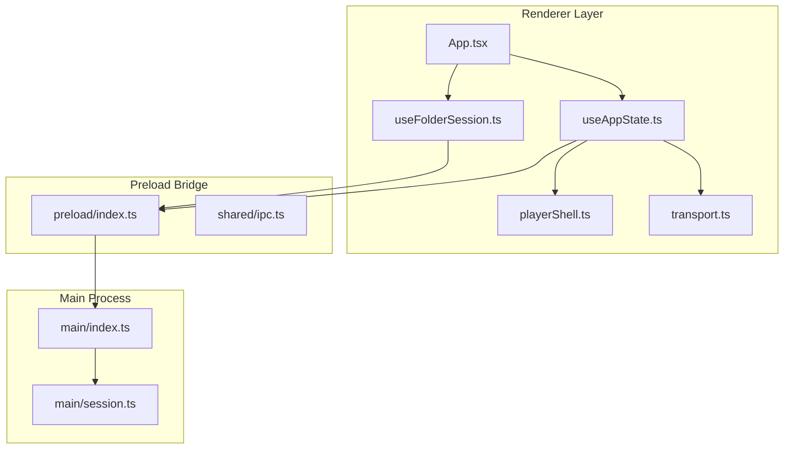
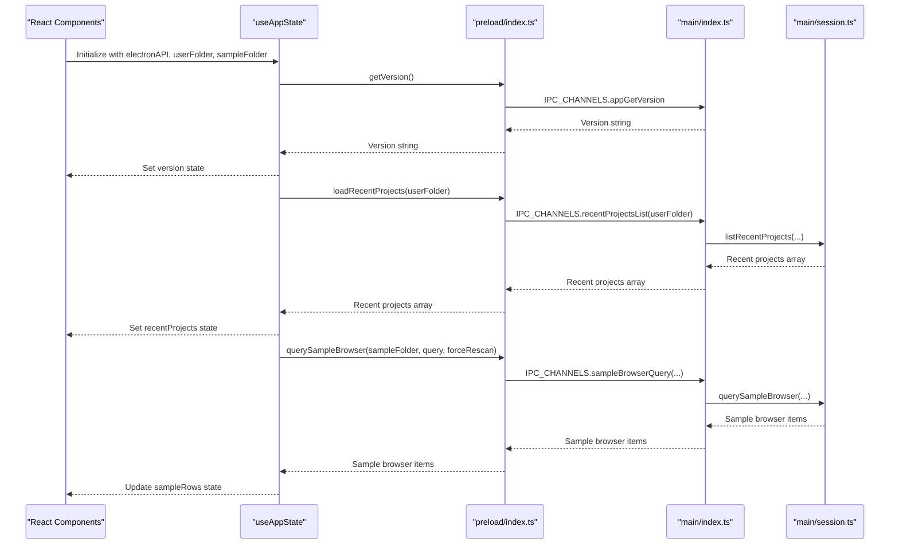
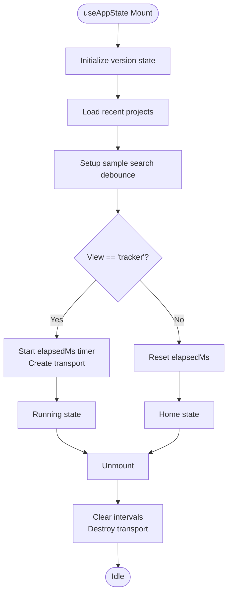
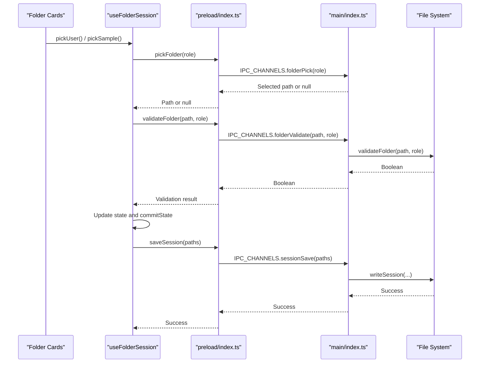
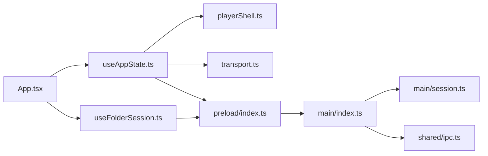

# State Management Architecture

<cite>
**Referenced Files in This Document**
- [useAppState.ts](file://src/renderer/src/hooks/useAppState.ts)
- [useFolderSession.ts](file://src/renderer/src/hooks/useFolderSession.ts)
- [session.ts](file://src/main/session.ts)
- [ipc.ts](file://src/shared/ipc.ts)
- [index.ts](file://src/preload/index.ts)
- [index.ts](file://src/main/index.ts)
- [playerShell.ts](file://src/renderer/src/lib/playerShell.ts)
- [transport.ts](file://src/renderer/src/engine/transport.ts)
- [App.tsx](file://src/renderer/src/App.tsx)
- [useAppState.test.ts](file://src/renderer/src/hooks/useAppState.test.ts)
- [session.test.ts](file://src/main/session.test.ts)
- [spec-003-folder-session-management.test.tsx](file://src/renderer/src/specs/spec-003-folder-session-management.test.tsx)
</cite>

## Table of Contents
1. [Introduction](#introduction)
2. [Project Structure](#project-structure)
3. [Core Components](#core-components)
4. [Architecture Overview](#architecture-overview)
5. [Detailed Component Analysis](#detailed-component-analysis)
6. [Dependency Analysis](#dependency-analysis)
7. [Performance Considerations](#performance-considerations)
8. [Troubleshooting Guide](#troubleshooting-guide)
9. [Conclusion](#conclusion)

## Introduction
This document provides comprehensive documentation for MixJam Electron's state management architecture. It focuses on the central `useAppState` hook implementation, session management for user preferences and project persistence, the `useFolderSession` hook for folder selection and validation, state persistence strategies, data flow between main and renderer processes, and synchronization patterns. The documentation includes examples of state mutations, event handling, IPC channel integration, and best practices used throughout the application.

## Project Structure
The state management architecture spans three primary layers:
- Renderer-side hooks and state containers
- Preload bridge exposing Electron APIs to the renderer
- Main process handlers managing persistent storage and system interactions

**Diagram sources**
- [App.tsx:1-108](file://src/renderer/src/App.tsx#L1-L108)
- [useAppState.ts:1-295](file://src/renderer/src/hooks/useAppState.ts#L1-L295)
- [useFolderSession.ts:1-106](file://src/renderer/src/hooks/useFolderSession.ts#L1-L106)
- [index.ts:1-29](file://src/preload/index.ts#L1-L29)
- [ipc.ts:1-59](file://src/shared/ipc.ts#L1-L59)
- [index.ts:1-170](file://src/main/index.ts#L1-L170)
- [session.ts:1-265](file://src/main/session.ts#L1-L265)
- [playerShell.ts:1-132](file://src/renderer/src/lib/playerShell.ts#L1-L132)
- [transport.ts:1-118](file://src/renderer/src/engine/transport.ts#L1-L118)

**Section sources**
- [App.tsx:1-108](file://src/renderer/src/App.tsx#L1-L108)
- [useAppState.ts:1-295](file://src/renderer/src/hooks/useAppState.ts#L1-L295)
- [useFolderSession.ts:1-106](file://src/renderer/src/hooks/useFolderSession.ts#L1-L106)
- [index.ts:1-29](file://src/preload/index.ts#L1-L29)
- [ipc.ts:1-59](file://src/shared/ipc.ts#L1-L59)
- [index.ts:1-170](file://src/main/index.ts#L1-L170)
- [session.ts:1-265](file://src/main/session.ts#L1-L265)
- [playerShell.ts:1-132](file://src/renderer/src/lib/playerShell.ts#L1-L132)
- [transport.ts:1-118](file://src/renderer/src/engine/transport.ts#L1-L118)

## Core Components
This section documents the primary state management components and their responsibilities.

- Central state container: `useAppState` manages UI state, transport controls, sample browser data, and recent projects.
- Session management: `useFolderSession` orchestrates folder selection, validation, and persistence.
- IPC abstraction: `ElectronAPI` interface defines all renderer-facing methods exposed via the preload bridge.
- Persistence helpers: Main process functions handle session, recent projects, and configuration file management.

Key responsibilities:
- State initialization and cleanup
- Asynchronous data loading and caching
- Event-driven updates and synchronization
- Cross-process communication via IPC channels

**Section sources**
- [useAppState.ts:28-295](file://src/renderer/src/hooks/useAppState.ts#L28-L295)
- [useFolderSession.ts:59-106](file://src/renderer/src/hooks/useFolderSession.ts#L59-L106)
- [ipc.ts:40-59](file://src/shared/ipc.ts#L40-L59)
- [session.ts:67-77](file://src/main/session.ts#L67-L77)

## Architecture Overview
The state management architecture follows a unidirectional data flow with explicit boundaries between renderer and main processes. The renderer maintains local state and delegates heavy operations to the main process through IPC channels. The preload bridge exposes a typed `ElectronAPI` interface to the renderer, ensuring type safety and consistent method signatures.

**Diagram sources**
- [useAppState.ts:49-91](file://src/renderer/src/hooks/useAppState.ts#L49-L91)
- [useAppState.ts:93-148](file://src/renderer/src/hooks/useAppState.ts#L93-L148)
- [index.ts:104-138](file://src/main/index.ts#L104-L138)
- [session.ts:149-181](file://src/main/session.ts#L149-L181)
- [index.ts:13-22](file://src/main/index.ts#L13-L22)

**Section sources**
- [useAppState.ts:49-148](file://src/renderer/src/hooks/useAppState.ts#L49-L148)
- [index.ts:104-138](file://src/main/index.ts#L104-L138)
- [session.ts:149-181](file://src/main/session.ts#L149-L181)

## Detailed Component Analysis

### useAppState Hook Implementation
The `useAppState` hook serves as the central state container for the renderer, managing:
- Application view state (home/tracker)
- Version information
- Timer and transport controls
- Sample browser search and results
- Recent projects
- Lane state for the mixer

State initialization and lifecycle:
- Version loading via `getVersion()` during mount
- Recent projects loading via `loadRecentProjects(userFolder)`
- Sample browser query scheduling with debouncing
- Transport lifecycle management with interval timers
- Cleanup of intervals and transport resources on unmount

State mutation patterns:
- Functional updates using `setLanes` with immutable transformations
- Batched updates for UI state (e.g., search query, loading states)
- Derived state computations (e.g., timer text, dimming logic)

IPC integration:
- Delegates all filesystem and system operations to the main process
- Uses sequence numbers to prevent race conditions in search queries
- Handles cancellation and error scenarios gracefully

**Diagram sources**
- [useAppState.ts:49-187](file://src/renderer/src/hooks/useAppState.ts#L49-L187)
- [transport.ts:39-116](file://src/renderer/src/engine/transport.ts#L39-L116)

**Section sources**
- [useAppState.ts:28-295](file://src/renderer/src/hooks/useAppState.ts#L28-L295)
- [transport.ts:1-118](file://src/renderer/src/engine/transport.ts#L1-L118)

### Session Management System
The session management system coordinates folder selection, validation, and persistence across application restarts. It consists of:
- `useFolderSession`: React hook managing session state and user interactions
- Main process handlers: IPC endpoints for loading, saving, and validating sessions
- Persistence helpers: File system operations for session.json and mixjam.json

Folder selection and validation:
- Two roles: user (writable) and sample (readable)
- Validation ensures directories exist, are readable, and meet role-specific requirements
- Concurrent restoration of both folders with independent error handling

**Diagram sources**
- [useFolderSession.ts:59-106](file://src/renderer/src/hooks/useFolderSession.ts#L59-L106)
- [index.ts:140-153](file://src/main/index.ts#L140-L153)
- [session.ts:52-57](file://src/main/session.ts#L52-L57)

**Section sources**
- [useFolderSession.ts:19-49](file://src/renderer/src/hooks/useFolderSession.ts#L19-L49)
- [index.ts:140-153](file://src/main/index.ts#L140-L153)
- [session.ts:52-57](file://src/main/session.ts#L52-L57)

### useFolderSession Hook Details
The `useFolderSession` hook implements a robust session management pattern:
- Immutable state updates using a commit function
- Reference-based state for concurrent operations
- Asynchronous restoration with independent promise handling
- Status tracking for folder cards (empty, set, pick-error, restore-error)

State transitions:
- Initial empty state restored from session.json
- User folder selection triggers validation and enables sample folder card
- Sample folder selection completes the session and enables start button
- Restoration errors show user-friendly messages and disable start

**Section sources**
- [useFolderSession.ts:59-106](file://src/renderer/src/hooks/useFolderSession.ts#L59-L106)

### State Persistence Strategies
Persistence is handled through structured files and controlled writes:
- session.json: Stores userFolder and sampleFolder paths
- recent-projects.json: Maintains project history with deduplication and sorting
- mixjam.json: Configuration file written to userFolder on app quit

Data normalization:
- Strict input validation and sanitization for session paths
- Canonical path normalization for cross-platform compatibility
- Deduplication and sorting for recent projects

Error handling:
- Graceful fallbacks when files are missing or corrupted
- Non-blocking writes with error logging
- User feedback for validation failures

**Section sources**
- [session.ts:67-77](file://src/main/session.ts#L67-L77)
- [session.ts:114-135](file://src/main/session.ts#L114-L135)
- [session.ts:256-264](file://src/main/session.ts#L256-L264)

### Data Flow Between Main and Renderer Processes
The IPC channel design ensures predictable data flow:
- Renderer initiates operations via ElectronAPI methods
- Preload bridge forwards requests to main process handlers
- Main process executes operations and returns results
- Renderer updates state and UI accordingly

Channel categories:
- Application lifecycle: version, window resizing
- Dialogs: file and folder pickers
- Session management: load/save, validation
- Sample browser: query operations
- External links: safe URL opening

**Section sources**
- [ipc.ts:1-15](file://src/shared/ipc.ts#L1-L15)
- [index.ts:75-169](file://src/main/index.ts#L75-L169)
- [index.ts:4-23](file://src/main/index.ts#L4-L23)

### State Synchronization Patterns
The application employs several synchronization patterns:
- Effect-driven initialization: Side effects load initial data on mount
- Debounced search: Throttled queries prevent excessive main process calls
- Sequence-based race prevention: Query sequence numbers ensure latest results win
- Reference-based state: useRef prevents stale closures in async operations
- Derived state computation: Memoized calculations reduce re-renders

**Section sources**
- [useAppState.ts:93-124](file://src/renderer/src/hooks/useAppState.ts#L93-L124)
- [useAppState.ts:136-148](file://src/renderer/src/hooks/useAppState.ts#L136-L148)
- [useAppState.ts:43-48](file://src/renderer/src/hooks/useAppState.ts#L43-L48)

## Dependency Analysis
The state management architecture exhibits clear separation of concerns with minimal coupling between layers.

**Diagram sources**
- [App.tsx:5-45](file://src/renderer/src/App.tsx#L5-L45)
- [useAppState.ts:1-13](file://src/renderer/src/hooks/useAppState.ts#L1-L13)
- [useFolderSession.ts:1-2](file://src/renderer/src/hooks/useFolderSession.ts#L1-L2)
- [index.ts:1-29](file://src/preload/index.ts#L1-L29)
- [index.ts:1-23](file://src/main/index.ts#L1-L23)
- [session.ts:1-7](file://src/main/session.ts#L1-L7)

**Section sources**
- [App.tsx:5-45](file://src/renderer/src/App.tsx#L5-L45)
- [useAppState.ts:1-13](file://src/renderer/src/hooks/useAppState.ts#L1-L13)
- [useFolderSession.ts:1-2](file://src/renderer/src/hooks/useFolderSession.ts#L1-L2)
- [index.ts:1-29](file://src/preload/index.ts#L1-L29)
- [index.ts:1-23](file://src/main/index.ts#L1-L23)
- [session.ts:1-7](file://src/main/session.ts#L1-L7)

## Performance Considerations
- Debounced search queries prevent excessive main process calls and reduce UI blocking
- Sequence-based query handling avoids race conditions without blocking subsequent requests
- Immutable state updates minimize unnecessary re-renders while maintaining predictability
- Transport interval management ensures efficient timing without memory leaks
- File system operations are performed asynchronously to maintain UI responsiveness

## Troubleshooting Guide
Common issues and resolutions:
- Version loading failures: Hook falls back to a safe message and logs errors
- Sample browser query errors: Displays user-friendly error and clears loading state
- Transport timer leaks: Clear intervals and destroy transport on unmount
- Session validation failures: Show appropriate error messages and disable start button
- Race conditions in search: Sequence numbers prevent outdated results from overriding newer ones

Testing coverage demonstrates these patterns:
- Version fallback behavior
- Timer lifecycle management
- Sample browser rescan functionality
- Lane state mutations
- Session validation scenarios

**Section sources**
- [useAppState.test.ts:39-52](file://src/renderer/src/hooks/useAppState.test.ts#L39-L52)
- [useAppState.test.ts:130-143](file://src/renderer/src/hooks/useAppState.test.ts#L130-L143)
- [useAppState.test.ts:165-174](file://src/renderer/src/hooks/useAppState.test.ts#L165-L174)
- [session.test.ts:43-63](file://src/main/session.test.ts#L43-L63)
- [session.test.ts:79-95](file://src/main/session.test.ts#L79-L95)

## Conclusion
MixJam Electron's state management architecture demonstrates a clean separation between renderer and main processes, with robust IPC abstractions and comprehensive error handling. The `useAppState` and `useFolderSession` hooks provide predictable state management patterns, while the main process handles persistence and system interactions. The architecture balances performance with reliability through debounced operations, sequence-based synchronization, and comprehensive testing coverage.