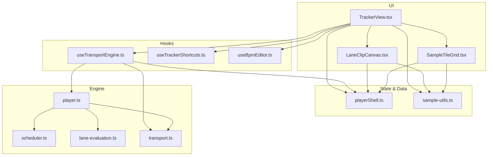
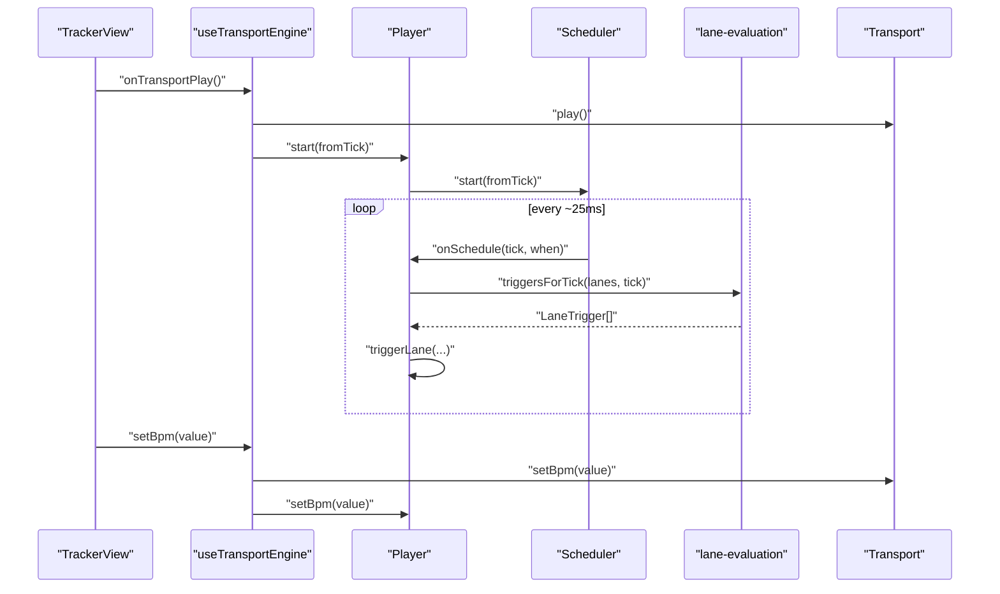
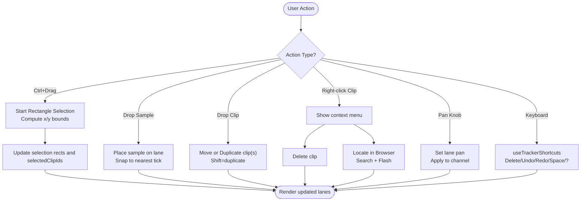
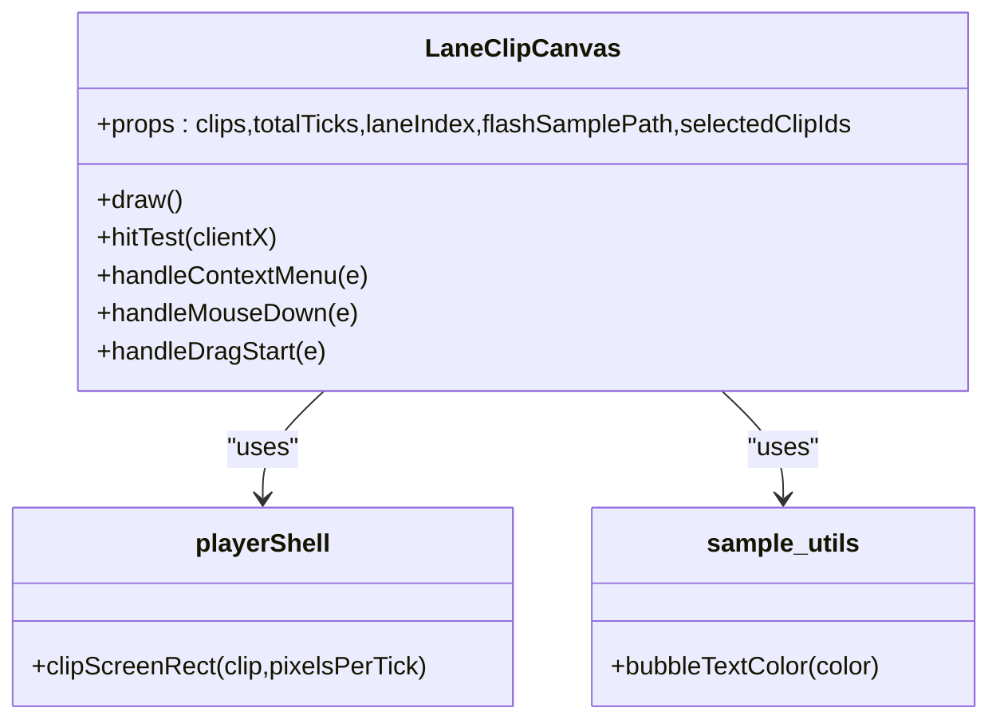
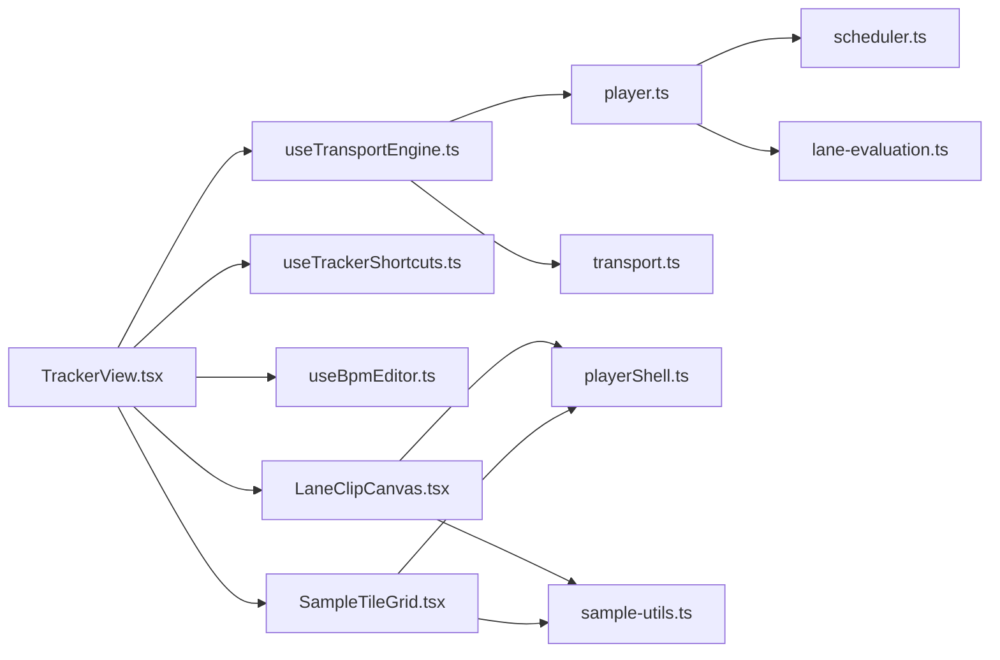

# Tracker View Enhancements

<cite>
**Referenced Files in This Document**
- [TrackerView.tsx](file://src/renderer/src/components/TrackerView.tsx)
- [LaneClipCanvas.tsx](file://src/renderer/src/components/LaneClipCanvas.tsx)
- [SampleTileGrid.tsx](file://src/renderer/src/components/SampleTileGrid.tsx)
- [playerShell.ts](file://src/renderer/src/lib/playerShell.ts)
- [sample-utils.ts](file://src/renderer/src/lib/sample-utils.ts)
- [useTransportEngine.ts](file://src/renderer/src/hooks/useTransportEngine.ts)
- [useTrackerShortcuts.ts](file://src/renderer/src/hooks/useTrackerShortcuts.ts)
- [useBpmEditor.ts](file://src/renderer/src/hooks/useBpmEditor.ts)
- [player.ts](file://src/renderer/src/engine/player.ts)
- [scheduler.ts](file://src/renderer/src/engine/scheduler.ts)
- [lane-evaluation.ts](file://src/renderer/src/engine/lane-evaluation.ts)
- [transport.ts](file://src/renderer/src/engine/transport.ts)
- [TrackerView.test.tsx](file://src/renderer/src/components/TrackerView.test.tsx)
</cite>

## Table of Contents
1. [Introduction](#introduction)
2. [Project Structure](#project-structure)
3. [Core Components](#core-components)
4. [Architecture Overview](#architecture-overview)
5. [Detailed Component Analysis](#detailed-component-analysis)
6. [Dependency Analysis](#dependency-analysis)
7. [Performance Considerations](#performance-considerations)
8. [Troubleshooting Guide](#troubleshooting-guide)
9. [Conclusion](#conclusion)

## Introduction
This document explains the Tracker View enhancements implemented in the renderer, focusing on how the tracker arranges clips, schedules audio, and provides a responsive editing experience. It covers the UI components (tracker lanes, canvas-based clip rendering, sample browser), the transport engine, scheduling, lane evaluation, and keyboard shortcuts. The goal is to make the architecture clear for both developers and non-technical readers while providing actionable insights for performance and troubleshooting.

## Project Structure
The Tracker View spans several layers:
- UI layer: React components for lanes, canvas drawing, and sample browser tiles
- State and data model: Lane state, clip operations, and utilities
- Transport and scheduling: Pure TypeScript modules that drive timing and playback
- Engine orchestration: Player ties together scheduling, lane evaluation, and audio

**Diagram sources**
- [TrackerView.tsx:1-120](file://src/renderer/src/components/TrackerView.tsx#L1-L120)
- [LaneClipCanvas.tsx:1-60](file://src/renderer/src/components/LaneClipCanvas.tsx#L1-L60)
- [SampleTileGrid.tsx:1-40](file://src/renderer/src/components/SampleTileGrid.tsx#L1-L40)
- [playerShell.ts:1-40](file://src/renderer/src/lib/playerShell.ts#L1-L40)
- [sample-utils.ts:1-40](file://src/renderer/src/lib/sample-utils.ts#L1-L40)
- [useTransportEngine.ts:1-40](file://src/renderer/src/hooks/useTransportEngine.ts#L1-L40)
- [useTrackerShortcuts.ts:1-40](file://src/renderer/src/hooks/useTrackerShortcuts.ts#L1-L40)
- [useBpmEditor.ts:1-40](file://src/renderer/src/hooks/useBpmEditor.ts#L1-L40)
- [player.ts:1-40](file://src/renderer/src/engine/player.ts#L1-L40)
- [scheduler.ts:1-40](file://src/renderer/src/engine/scheduler.ts#L1-L40)
- [lane-evaluation.ts:1-40](file://src/renderer/src/engine/lane-evaluation.ts#L1-L40)
- [transport.ts:1-40](file://src/renderer/src/engine/transport.ts#L1-L40)

**Section sources**
- [TrackerView.tsx:1-120](file://src/renderer/src/components/TrackerView.tsx#L1-L120)
- [playerShell.ts:1-40](file://src/renderer/src/lib/playerShell.ts#L1-L40)
- [useTransportEngine.ts:1-40](file://src/renderer/src/hooks/useTransportEngine.ts#L1-L40)

## Core Components
- TrackerView: Orchestrates lanes, ruler, playhead, BPM editor, transport controls, search, and context menus. Coordinates drag-and-drop from the sample browser into lanes and between lanes.
- LaneClipCanvas: High-performance canvas rendering of clip bubbles per lane with selection highlights, hit-testing, and custom drag ghost images.
- SampleTileGrid: Virtualized grid of sample tiles sized consistently with tracker bubbles; supports dragging samples onto lanes and right-click context actions.
- playerShell: Immutable lane and clip manipulation functions, dimension constants, and conversion helpers (e.g., duration to ticks).
- useTransportEngine: Binds UI to the Player and Transport, manages undo/redo history, preview scheduling, and meter updates.
- Scheduler: Lookahead scheduler driven by the audio clock to schedule triggers precisely.
- Lane Evaluation: Pure logic to compute which clips trigger at a given tick based on mute/solo rules.
- Transport: Pure state machine for play/pause/stop and tick/time conversions.

**Section sources**
- [TrackerView.tsx:118-220](file://src/renderer/src/components/TrackerView.tsx#L118-L220)
- [LaneClipCanvas.tsx:154-260](file://src/renderer/src/components/LaneClipCanvas.tsx#L154-L260)
- [SampleTileGrid.tsx:82-160](file://src/renderer/src/components/SampleTileGrid.tsx#L82-L160)
- [playerShell.ts:60-130](file://src/renderer/src/lib/playerShell.ts#L60-L130)
- [useTransportEngine.ts:146-184](file://src/renderer/src/hooks/useTransportEngine.ts#L146-L184)
- [scheduler.ts:59-118](file://src/renderer/src/engine/scheduler.ts#L59-L118)
- [lane-evaluation.ts:39-72](file://src/renderer/src/engine/lane-evaluation.ts#L39-L72)
- [transport.ts:36-81](file://src/renderer/src/engine/transport.ts#L36-L81)

## Architecture Overview
The Tracker View integrates UI and engine through a clean boundary:
- UI components are pure React and call hooks/actions.
- useTransportEngine owns lifecycle of Transport and Player, exposes actions to UI.
- Player coordinates AudioEngine, Scheduler, and lane evaluation.
- Scheduler drives precise scheduling using the audio clock.
- Lane evaluation computes triggers per tick respecting mute/solo.

**Diagram sources**
- [useTransportEngine.ts:335-345](file://src/renderer/src/hooks/useTransportEngine.ts#L335-L345)
- [player.ts:162-183](file://src/renderer/src/engine/player.ts#L162-L183)
- [scheduler.ts:106-118](file://src/renderer/src/engine/scheduler.ts#L106-L118)
- [lane-evaluation.ts:53-72](file://src/renderer/src/engine/lane-evaluation.ts#L53-L72)
- [transport.ts:49-69](file://src/renderer/src/engine/transport.ts#L49-L69)

## Detailed Component Analysis

### TrackerView
Responsibilities:
- Renders lanes, ruler, playhead, middle strip (BPM editor, transport controls, search, scan progress).
- Handles rectangle selection (Ctrl+drag), clip/context menus, pan knobs, and drag-and-drop between lanes and from the sample browser.
- Integrates keyboard shortcuts via useTrackerShortcuts and inline BPM editing via useBpmEditor.

Key behaviors:
- Selection rectangle uses container geometry and scroll offsets to stay consistent during drag.
- Drag-and-drop supports single or group moves/duplicates (Shift to duplicate).
- Context menu actions include Delete and Locate in Browser (search + flash highlight).
- Pan control updates lane pan and applies to the active channel immediately.

**Diagram sources**
- [TrackerView.tsx:238-297](file://src/renderer/src/components/TrackerView.tsx#L238-L297)
- [TrackerView.tsx:403-493](file://src/renderer/src/components/TrackerView.tsx#L403-L493)
- [TrackerView.tsx:386-401](file://src/renderer/src/components/TrackerView.tsx#L386-L401)
- [TrackerView.tsx:654-677](file://src/renderer/src/components/TrackerView.tsx#L654-L677)
- [useTrackerShortcuts.ts:41-77](file://src/renderer/src/hooks/useTrackerShortcuts.ts#L41-L77)

**Section sources**
- [TrackerView.tsx:118-220](file://src/renderer/src/components/TrackerView.tsx#L118-L220)
- [TrackerView.tsx:238-297](file://src/renderer/src/components/TrackerView.tsx#L238-L297)
- [TrackerView.tsx:403-493](file://src/renderer/src/components/TrackerView.tsx#L403-L493)
- [TrackerView.tsx:386-401](file://src/renderer/src/components/TrackerView.tsx#L386-L401)
- [TrackerView.tsx:654-677](file://src/renderer/src/components/TrackerView.tsx#L654-L677)
- [useTrackerShortcuts.ts:1-79](file://src/renderer/src/hooks/useTrackerShortcuts.ts#L1-L79)
- [useBpmEditor.ts:24-63](file://src/renderer/src/hooks/useBpmEditor.ts#L24-L63)

### LaneClipCanvas
Responsibilities:
- Draws clip bubbles on a canvas with theme-aware colors and text contrast.
- Maintains hit rectangles for mouse interactions and context menus.
- Provides a custom drag ghost image showing only the grabbed clip (and a badge for group drags).

Highlights:
- Uses shared bubble width calculation to keep visual consistency across views.
- Memoized component to avoid re-rendering on frequent playhead updates.
- Supports selection border overlay without changing clip footprint.

**Diagram sources**
- [LaneClipCanvas.tsx:154-260](file://src/renderer/src/components/LaneClipCanvas.tsx#L154-L260)
- [playerShell.ts:51-58](file://src/renderer/src/lib/playerShell.ts#L51-L58)
- [sample-utils.ts:73-83](file://src/renderer/src/lib/sample-utils.ts#L73-L83)

**Section sources**
- [LaneClipCanvas.tsx:154-260](file://src/renderer/src/components/LaneClipCanvas.tsx#L154-L260)
- [LaneClipCanvas.tsx:268-332](file://src/renderer/src/components/LaneClipCanvas.tsx#L268-L332)
- [LaneClipCanvas.tsx:334-364](file://src/renderer/src/components/LaneClipCanvas.tsx#L334-L364)

### SampleTileGrid
Responsibilities:
- Virtualizes rows of sample tiles with fixed height and gap, mirroring tracker bubble widths.
- Loads more pages when scrolling near the end of the loaded prefix.
- Supports drag start to place samples on lanes and right-click context actions.

Highlights:
- Row packing algorithm matches CSS flex-wrap behavior.
- Consistent bubble sizing ensures pixel identity across views.
- Memoization avoids unnecessary re-renders during playhead updates.

**Section sources**
- [SampleTileGrid.tsx:33-52](file://src/renderer/src/components/SampleTileGrid.tsx#L33-L52)
- [SampleTileGrid.tsx:118-136](file://src/renderer/src/components/SampleTileGrid.tsx#L118-L136)
- [SampleTileGrid.tsx:156-161](file://src/renderer/src/components/SampleTileGrid.tsx#L156-L161)
- [SampleTileGrid.tsx:175-210](file://src/renderer/src/components/SampleTileGrid.tsx#L175-L210)

### playerShell (Data Model and Operations)
Responsibilities:
- Defines LaneState, LaneClip, FooterSampleDetail, and constants.
- Provides immutable operations: place, move, duplicate, remove, toggle mute/solo, set pan.
- Converts UI lanes to engine lanes and computes durations in ticks.

Complexity notes:
- Batched operations (moveClipGroup, duplicateClipGroup, removeClips) perform single-pass mutations to minimize re-renders and maintain stable lane identities.

**Section sources**
- [playerShell.ts:14-40](file://src/renderer/src/lib/playerShell.ts#L14-L40)
- [playerShell.ts:73-85](file://src/renderer/src/lib/playerShell.ts#L73-L85)
- [playerShell.ts:93-127](file://src/renderer/src/lib/playerShell.ts#L93-L127)
- [playerShell.ts:133-154](file://src/renderer/src/lib/playerShell.ts#L133-L154)
- [playerShell.ts:183-208](file://src/renderer/src/lib/playerShell.ts#L183-L208)
- [playerShell.ts:235-283](file://src/renderer/src/lib/playerShell.ts#L235-L283)
- [playerShell.ts:299-309](file://src/renderer/src/lib/playerShell.ts#L299-L309)
- [playerShell.ts:311-315](file://src/renderer/src/lib/playerShell.ts#L311-L315)

### useTransportEngine (Orchestration)
Responsibilities:
- Creates and destroys Transport and Player when entering/exiting tracker view.
- Mirrors currentTick from Player’s audio clock to UI.
- Manages undo/redo stacks for clip edits.
- Schedules monophonic previews aligned to downbeats when transport is playing.
- Applies master gain and per-lane pan changes to the engine.

Key flows:
- Play/Pause/Stop synchronize Transport state and Player scheduling.
- Skip-back resets scheduler and UI playhead.
- Preview toggles same sample and respects transport timing.

**Section sources**
- [useTransportEngine.ts:146-184](file://src/renderer/src/hooks/useTransportEngine.ts#L146-L184)
- [useTransportEngine.ts:186-233](file://src/renderer/src/hooks/useTransportEngine.ts#L186-L233)
- [useTransportEngine.ts:308-328](file://src/renderer/src/hooks/useTransportEngine.ts#L308-L328)
- [useTransportEngine.ts:335-377](file://src/renderer/src/hooks/useTransportEngine.ts#L335-L377)

### Player (Audio Orchestration)
Responsibilities:
- Wires AudioEngine, Scheduler, and lane evaluation.
- Monophonic voice management per lane; new triggers cut off previous voices.
- Preview mode with toggle semantics and optional quantized scheduling.
- Channel pan application and lazy creation of channels.

Important details:
- Guard against race conditions with playGeneration to prevent stray voices after stop/pause.
- Current tick derived from scheduler’s audio clock for tight UI sync.

**Section sources**
- [player.ts:29-62](file://src/renderer/src/engine/player.ts#L29-L62)
- [player.ts:99-137](file://src/renderer/src/engine/player.ts#L99-L137)
- [player.ts:162-183](file://src/renderer/src/engine/player.ts#L162-L183)
- [player.ts:203-240](file://src/renderer/src/engine/player.ts#L203-L240)

### Scheduler (Lookahead Timing)
Responsibilities:
- Drives scheduling using setInterval with lookahead window.
- Self-corrects from audio clock to avoid drift.
- Exposes currentTick and reset for UI synchronization.

Design notes:
- Anchor-based playhead computation ensures BPM changes do not retroactively shift already-played segments beyond one interval.

**Section sources**
- [scheduler.ts:59-118](file://src/renderer/src/engine/scheduler.ts#L59-L118)
- [scheduler.ts:130-147](file://src/renderer/src/engine/scheduler.ts#L130-L147)

### Lane Evaluation (Mute/Solo Policy)
Responsibilities:
- Computes audibility based on mute/solo flags.
- Returns triggers for clips starting exactly at the tick.

Policy:
- Solo overrides mute for soloed lanes.
- Visual dimming policy differs slightly for UX feedback.

**Section sources**
- [lane-evaluation.ts:39-48](file://src/renderer/src/engine/lane-evaluation.ts#L39-L48)
- [lane-evaluation.ts:53-72](file://src/renderer/src/engine/lane-evaluation.ts#L53-L72)
- [playerShell.ts:156-164](file://src/renderer/src/lib/playerShell.ts#L156-L164)

### Transport (Pure State Machine)
Responsibilities:
- Tracks state (stopped/playing/paused) and BPM.
- Provides tick-to-time conversion for scheduling previews.

**Section sources**
- [transport.ts:36-81](file://src/renderer/src/engine/transport.ts#L36-L81)

## Dependency Analysis
High-level dependencies:
- TrackerView depends on hooks and components for interaction and rendering.
- Hooks depend on engine modules for orchestration and timing.
- Canvas and tile grid depend on shared utilities for consistent visuals.

**Diagram sources**
- [TrackerView.tsx:1-40](file://src/renderer/src/components/TrackerView.tsx#L1-L40)
- [useTransportEngine.ts:1-40](file://src/renderer/src/hooks/useTransportEngine.ts#L1-L40)
- [useTrackerShortcuts.ts:1-40](file://src/renderer/src/hooks/useTrackerShortcuts.ts#L1-L40)
- [useBpmEditor.ts:1-40](file://src/renderer/src/hooks/useBpmEditor.ts#L1-L40)
- [LaneClipCanvas.tsx:1-40](file://src/renderer/src/components/LaneClipCanvas.tsx#L1-L40)
- [SampleTileGrid.tsx:1-40](file://src/renderer/src/components/SampleTileGrid.tsx#L1-L40)
- [player.ts:1-40](file://src/renderer/src/engine/player.ts#L1-L40)
- [scheduler.ts:1-40](file://src/renderer/src/engine/scheduler.ts#L1-L40)
- [lane-evaluation.ts:1-40](file://src/renderer/src/engine/lane-evaluation.ts#L1-L40)
- [transport.ts:1-40](file://src/renderer/src/engine/transport.ts#L1-L40)
- [playerShell.ts:1-40](file://src/renderer/src/lib/playerShell.ts#L1-L40)
- [sample-utils.ts:1-40](file://src/renderer/src/lib/sample-utils.ts#L1-L40)

**Section sources**
- [TrackerView.tsx:1-40](file://src/renderer/src/components/TrackerView.tsx#L1-L40)
- [useTransportEngine.ts:1-40](file://src/renderer/src/hooks/useTransportEngine.ts#L1-L40)
- [player.ts:1-40](file://src/renderer/src/engine/player.ts#L1-L40)
- [scheduler.ts:1-40](file://src/renderer/src/engine/scheduler.ts#L1-L40)
- [lane-evaluation.ts:1-40](file://src/renderer/src/engine/lane-evaluation.ts#L1-L40)
- [transport.ts:1-40](file://src/renderer/src/engine/transport.ts#L1-L40)
- [playerShell.ts:1-40](file://src/renderer/src/lib/playerShell.ts#L1-L40)
- [sample-utils.ts:1-40](file://src/renderer/src/lib/sample-utils.ts#L1-L40)

## Performance Considerations
- Canvas rendering: LaneClipCanvas is memoized and redraws only when necessary, avoiding heavy DOM updates during 10Hz playhead/meter refreshes.
- Virtualization: SampleTileGrid virtualizes rows and loads more pages on demand, keeping large libraries responsive.
- Batched operations: playerShell batch functions reduce state churn and preserve lane identity for memoization.
- Lookahead scheduling: Scheduler self-corrects from the audio clock, minimizing drift and ensuring tight sync between sound and UI.
- Efficient selection: Rectangle selection computes geometry once at drag start and uses efficient hit-testing against precomputed clip rects.

[No sources needed since this section provides general guidance]

## Troubleshooting Guide
Common issues and resolutions:
- No sound on preview/play: Ensure AudioContext is resumed before scheduling; Player.start calls resume and sets lastScheduledTick appropriately.
- Stray voices after stop/pause: Player uses playGeneration to guard against late async buffer loads starting voices after playback ended.
- BPM change causing jumps: Scheduler folds anchor forward each pass so BPM changes only reinterpret within one interval, preventing retroactive jumps.
- Playhead drift: Visual playhead reads from Player.currentTick (audio clock), not wall-clock timers, ensuring lock-step with scheduling.
- Keyboard shortcuts firing in inputs: useTrackerShortcuts checks editable targets and ignores global shortcuts inside INPUT/TEXTAREA/SELECT/contentEditable.
- Incorrect drop snapping: nearestTick guards against zero/negative container widths and clamps snapped ticks to the last valid slot.

**Section sources**
- [player.ts:162-183](file://src/renderer/src/engine/player.ts#L162-L183)
- [player.ts:203-240](file://src/renderer/src/engine/player.ts#L203-L240)
- [scheduler.ts:75-98](file://src/renderer/src/engine/scheduler.ts#L75-L98)
- [useTrackerShortcuts.ts:41-77](file://src/renderer/src/hooks/useTrackerShortcuts.ts#L41-L77)
- [sample-utils.ts:116-135](file://src/renderer/src/lib/sample-utils.ts#L116-L135)

## Conclusion
The Tracker View enhancements deliver a robust, high-performance arrangement interface with precise audio scheduling, intuitive editing gestures, and consistent visual design across views. The separation of concerns—UI, state, scheduling, and engine—enables maintainability and testability, while optimizations like canvas rendering, virtualization, and batched operations ensure smooth operation even with large libraries.

[No sources needed since this section summarizes without analyzing specific files]