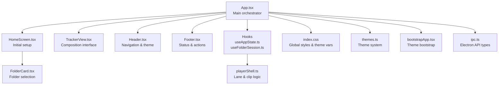
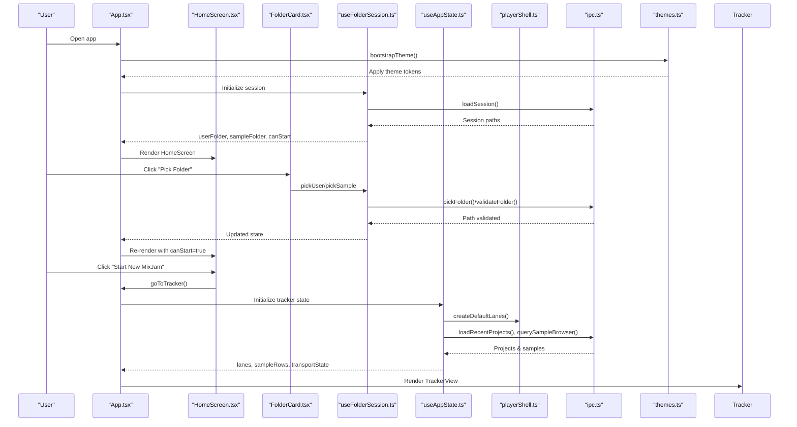
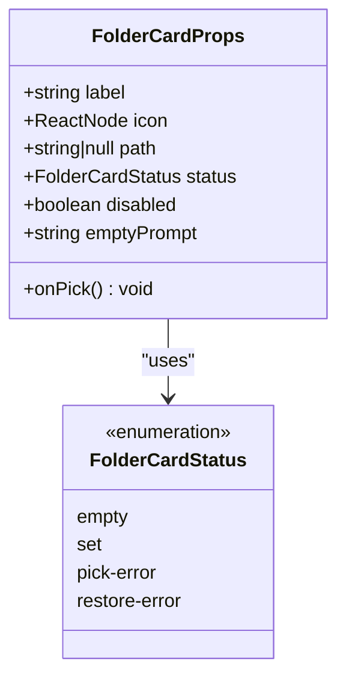
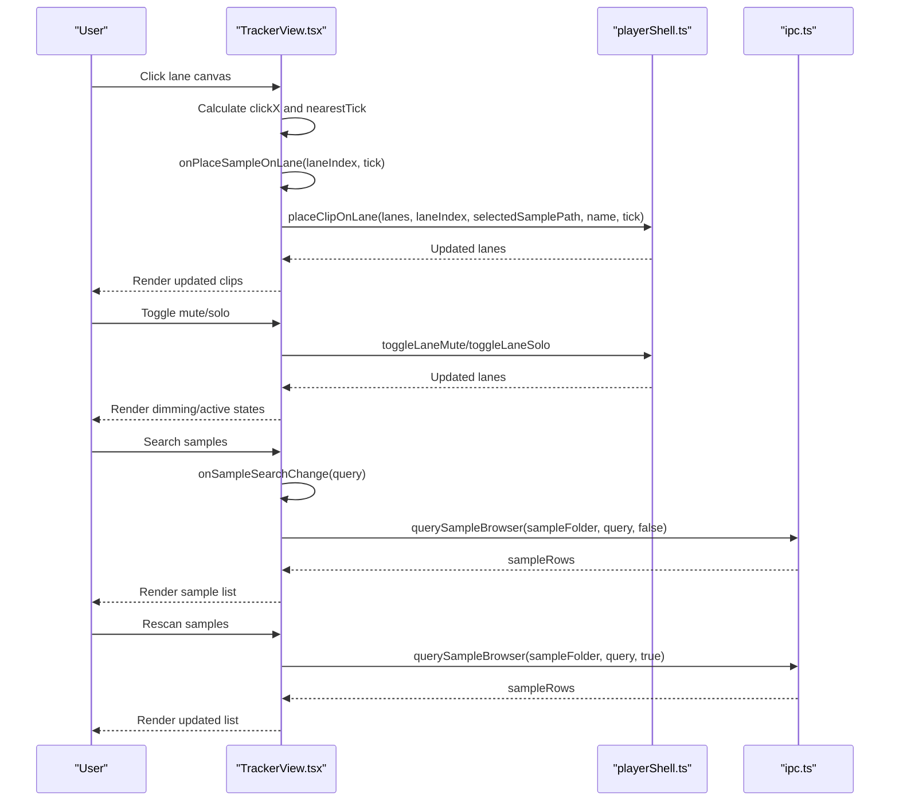
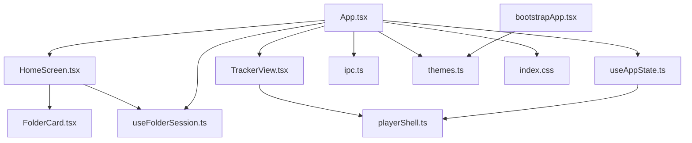

# UI Components

<cite>
**Referenced Files in This Document**
- [HomeScreen.tsx](file://src/renderer/src/components/HomeScreen.tsx)
- [TrackerView.tsx](file://src/renderer/src/components/TrackerView.tsx)
- [FolderCard.tsx](file://src/renderer/src/components/FolderCard.tsx)
- [App.tsx](file://src/renderer/src/App.tsx)
- [useAppState.ts](file://src/renderer/src/hooks/useAppState.ts)
- [useFolderSession.ts](file://src/renderer/src/hooks/useFolderSession.ts)
- [playerShell.ts](file://src/renderer/src/lib/playerShell.ts)
- [index.css](file://src/renderer/src/index.css)
- [Header.tsx](file://src/renderer/src/components/Header.tsx)
- [Footer.tsx](file://src/renderer/src/components/Footer.tsx)
- [themes.ts](file://src/renderer/src/theme/themes.ts)
- [bootstrapApp.tsx](file://src/renderer/src/bootstrapApp.tsx)
- [ipc.ts](file://src/shared/ipc.ts)
</cite>

## Table of Contents
1. [Introduction](#introduction)
2. [Project Structure](#project-structure)
3. [Core Components](#core-components)
4. [Architecture Overview](#architecture-overview)
5. [Detailed Component Analysis](#detailed-component-analysis)
6. [Dependency Analysis](#dependency-analysis)
7. [Performance Considerations](#performance-considerations)
8. [Troubleshooting Guide](#troubleshooting-guide)
9. [Conclusion](#conclusion)

## Introduction
This document provides comprehensive documentation for MixJam Electron's UI components, focusing on the HomeScreen component for initial setup and onboarding, the TrackerView component for the main composition interface, and the FolderCard component for displaying and interacting with folder items. It covers component props, state management, event handling, user interaction patterns, styling approaches, responsive design considerations, accessibility features, and integration patterns with the application state system.

## Project Structure
The UI components are organized under the renderer/src/components directory, with supporting hooks, libraries, and styles under renderer/src. The main application orchestrates component rendering through App.tsx, which delegates to HomeScreen or TrackerView based on the current view state. Styling is centralized in index.css with theme support managed by themes.ts and applied during bootstrap.

**Diagram sources**
- [App.tsx:1-108](file://src/renderer/src/App.tsx#L1-L108)
- [HomeScreen.tsx:1-77](file://src/renderer/src/components/HomeScreen.tsx#L1-L77)
- [TrackerView.tsx:1-270](file://src/renderer/src/components/TrackerView.tsx#L1-L270)
- [FolderCard.tsx:1-60](file://src/renderer/src/components/FolderCard.tsx#L1-L60)
- [useAppState.ts:1-295](file://src/renderer/src/hooks/useAppState.ts#L1-L295)
- [useFolderSession.ts:1-106](file://src/renderer/src/hooks/useFolderSession.ts#L1-L106)
- [playerShell.ts:1-132](file://src/renderer/src/lib/playerShell.ts#L1-L132)
- [index.css:1-795](file://src/renderer/src/index.css#L1-L795)
- [Header.tsx:1-43](file://src/renderer/src/components/Header.tsx#L1-L43)
- [Footer.tsx:1-33](file://src/renderer/src/components/Footer.tsx#L1-L33)
- [themes.ts:1-112](file://src/renderer/src/theme/themes.ts#L1-L112)
- [bootstrapApp.tsx:1-19](file://src/renderer/src/bootstrapApp.tsx#L1-L19)
- [ipc.ts:1-59](file://src/shared/ipc.ts#L1-L59)

**Section sources**
- [App.tsx:1-108](file://src/renderer/src/App.tsx#L1-L108)
- [index.css:1-795](file://src/renderer/src/index.css#L1-L795)

## Core Components
This section outlines the primary UI components and their roles in the application.

- HomeScreen: Provides initial setup and onboarding by allowing users to select User and Sample folders, enabling the Start button when both folders are selected, and offering a Load option.
- TrackerView: Implements the main composition interface with timeline visualization, sample arrangement, transport controls, and sample browser.
- FolderCard: Displays folder selection state with status messaging, icons, and a pick action, handling disabled states and error conditions.

**Section sources**
- [HomeScreen.tsx:1-77](file://src/renderer/src/components/HomeScreen.tsx#L1-L77)
- [TrackerView.tsx:1-270](file://src/renderer/src/components/TrackerView.tsx#L1-L270)
- [FolderCard.tsx:1-60](file://src/renderer/src/components/FolderCard.tsx#L1-L60)

## Architecture Overview
The UI architecture follows a unidirectional data flow:
- App.tsx manages global state and view switching.
- useFolderSession handles folder selection lifecycle and persistence.
- useAppState manages tracker view state, sample browser queries, transport, and lane management.
- playerShell provides pure data transformations for lanes and clips.
- index.css defines theme-driven design tokens applied via themes.ts.
- bootstrapApp initializes the theme before mounting the React app.

**Diagram sources**
- [App.tsx:1-108](file://src/renderer/src/App.tsx#L1-L108)
- [HomeScreen.tsx:1-77](file://src/renderer/src/components/HomeScreen.tsx#L1-L77)
- [FolderCard.tsx:1-60](file://src/renderer/src/components/FolderCard.tsx#L1-L60)
- [useFolderSession.ts:1-106](file://src/renderer/src/hooks/useFolderSession.ts#L1-L106)
- [useAppState.ts:1-295](file://src/renderer/src/hooks/useAppState.ts#L1-L295)
- [playerShell.ts:1-132](file://src/renderer/src/lib/playerShell.ts#L1-L132)
- [ipc.ts:1-59](file://src/shared/ipc.ts#L1-L59)
- [themes.ts:1-112](file://src/renderer/src/theme/themes.ts#L1-L112)
- [bootstrapApp.tsx:1-19](file://src/renderer/src/bootstrapApp.tsx#L1-L19)

## Detailed Component Analysis

### HomeScreen Component
HomeScreen serves as the initial setup screen for MixJam, guiding users through selecting their User and Sample folders and starting a new session.

- Props:
  - userFolder: FolderView for the User folder
  - sampleFolder: FolderView for the Sample folder
  - canStart: Boolean indicating if both folders are selected
  - onPickUser: Callback to initiate User folder selection
  - onPickSample: Callback to initiate Sample folder selection
  - onStart: Callback to navigate to the Tracker view
  - onLoad: Callback to open a project file picker

- State Management:
  - Delegated to parent App via useFolderSession and useAppState hooks.
  - HomeScreen renders FolderCard components for both folders and a Start button conditionally enabled by canStart.

- Event Handling:
  - FolderCard triggers onPick callbacks to update session state.
  - Start button invokes onStart to switch views.
  - Load button opens a file picker via onLoad.

- User Interaction Patterns:
  - Users select folders sequentially; the Start button becomes enabled only when both selections are valid.
  - Disabled state of the Sample folder card depends on User folder selection.

- Accessibility:
  - SVG icons are presentational (aria-hidden) while FolderCard status messages provide meaningful text.
  - Buttons use semantic HTML with disabled states reflected in styling.

- Styling and Responsive Design:
  - Centered layout with fixed width container and responsive max-width.
  - Card-based layout with spacing and typography consistent with the theme.

**Diagram sources**
- [HomeScreen.tsx:30-77](file://src/renderer/src/components/HomeScreen.tsx#L30-L77)

**Section sources**
- [HomeScreen.tsx:1-77](file://src/renderer/src/components/HomeScreen.tsx#L1-L77)
- [App.tsx:64-74](file://src/renderer/src/App.tsx#L64-L74)

### FolderCard Component
FolderCard displays a single folder selection card with status messaging and a pick action.

- Props:
  - label: Display label for the card
  - icon: ReactNode representing the folder icon
  - path: Current folder path or null
  - status: FolderCardStatus ('empty' | 'set' | 'pick-error' | 'restore-error')
  - disabled: Boolean controlling interactivity
  - emptyPrompt: Message shown when status is 'empty'
  - onPick: Callback invoked when the user clicks "Pick Folder"

- Status Resolution:
  - 'set': Displays the path with a path-specific tone
  - 'pick-error': Displays an error message for invalid selection
  - 'restore-error': Displays an error message for previously saved inaccessible folder
  - 'empty': Displays the emptyPrompt

- Event Handling:
  - onPick callback is triggered when the user clicks the "Pick Folder" button.
  - Disabled state prevents interaction.

- Accessibility:
  - Status messages use semantic tones (path/error/prompt) for screen readers.
  - Icon is marked as presentational.

- Styling:
  - Card container adapts opacity and pointer events when disabled.
  - Status text tone classes control color and emphasis.

**Diagram sources**
- [FolderCard.tsx:7-15](file://src/renderer/src/components/FolderCard.tsx#L7-L15)
- [useFolderSession.ts:4](file://src/renderer/src/hooks/useFolderSession.ts#L4)

**Section sources**
- [FolderCard.tsx:1-60](file://src/renderer/src/components/FolderCard.tsx#L1-L60)
- [useFolderSession.ts:4-14](file://src/renderer/src/hooks/useFolderSession.ts#L4-L14)

### TrackerView Component
TrackerView implements the main composition interface with timeline visualization, sample arrangement, transport controls, and a sample browser.

- Props:
  - recentProjects: Array of recent project items
  - sampleRows: Array of sample browser items
  - sampleSearchQuery: Current search query string
  - sampleBrowserLoading: Loading state for sample browser
  - sampleBrowserError: Error message or null
  - selectedSamplePath: Currently selected sample path or null
  - lanes: Array of LaneState
  - laneShouldDim: Function determining if a lane should be visually dimmed
  - transportState: Transport state ('stopped' | 'playing' | 'paused')
  - onSelectSampleDetail: Callback to set selected sample detail
  - onSampleSearchChange: Callback to update search query
  - onSampleRescan: Callback to trigger a forced rescan
  - onPlaceSampleOnLane: Callback to place a sample on a specific lane at a tick
  - onToggleLaneMute: Callback to toggle mute on a lane
  - onToggleLaneSolo: Callback to toggle solo on a lane
  - onTransportPlay: Callback to start playback
  - onTransportPause: Callback to pause playback
  - onTransportStop: Callback to stop playback
  - onTransportSkipBack: Callback to skip backward

- Timeline Visualization:
  - Fixed total ticks (256) with ruler ticks every 32 ticks, marking bars at multiples of 4.
  - Lane canvas width calculated as percentage per tick for precise placement.

- Sample Arrangement:
  - Clips are positioned absolutely within lanes based on startTick and durationTicks.
  - nearestTick function ensures placement clamps to timeline bounds.

- Transport Controls:
  - Play/Pause toggles based on transportState.
  - Skip Back, Stop, and Play/Pause buttons with active state styling.

- Sample Browser:
  - Category tree and sample list with search, results count, and rescan button.
  - Selected sample row highlighted; empty states show errors or no results messaging.

- Accessibility:
  - Proper roles and labels for interactive elements (canvas as button, mute/solo buttons).
  - ARIA attributes for meter and live region for footer details.

- Styling and Responsive Design:
  - Grid-based layout with defined zones for recent projects, timeline, middle strip, song controls, and browser.
  - Flexible containers with overflow handling for long lists and dynamic widths.

**Diagram sources**
- [TrackerView.tsx:27-65](file://src/renderer/src/components/TrackerView.tsx#L27-L65)
- [TrackerView.tsx:225-233](file://src/renderer/src/components/TrackerView.tsx#L225-L233)
- [playerShell.ts:39-95](file://src/renderer/src/lib/playerShell.ts#L39-L95)
- [useAppState.ts:225-233](file://src/renderer/src/hooks/useAppState.ts#L225-L233)
- [ipc.ts:51-55](file://src/shared/ipc.ts#L51-L55)

**Section sources**
- [TrackerView.tsx:1-270](file://src/renderer/src/components/TrackerView.tsx#L1-L270)
- [playerShell.ts:1-132](file://src/renderer/src/lib/playerShell.ts#L1-L132)
- [useAppState.ts:225-233](file://src/renderer/src/hooks/useAppState.ts#L225-L233)

## Dependency Analysis
The components depend on hooks and libraries for state management and data transformations. The following diagram illustrates key dependencies:

**Diagram sources**
- [HomeScreen.tsx:1-77](file://src/renderer/src/components/HomeScreen.tsx#L1-L77)
- [FolderCard.tsx:1-60](file://src/renderer/src/components/FolderCard.tsx#L1-L60)
- [useFolderSession.ts:1-106](file://src/renderer/src/hooks/useFolderSession.ts#L1-L106)
- [App.tsx:1-108](file://src/renderer/src/App.tsx#L1-L108)
- [TrackerView.tsx:1-270](file://src/renderer/src/components/TrackerView.tsx#L1-L270)
- [useAppState.ts:1-295](file://src/renderer/src/hooks/useAppState.ts#L1-L295)
- [playerShell.ts:1-132](file://src/renderer/src/lib/playerShell.ts#L1-L132)
- [ipc.ts:1-59](file://src/shared/ipc.ts#L1-L59)
- [themes.ts:1-112](file://src/renderer/src/theme/themes.ts#L1-L112)
- [index.css:1-795](file://src/renderer/src/index.css#L1-L795)
- [bootstrapApp.tsx:1-19](file://src/renderer/src/bootstrapApp.tsx#L1-L19)

**Section sources**
- [App.tsx:1-108](file://src/renderer/src/App.tsx#L1-L108)
- [useAppState.ts:1-295](file://src/renderer/src/hooks/useAppState.ts#L1-L295)
- [useFolderSession.ts:1-106](file://src/renderer/src/hooks/useFolderSession.ts#L1-L106)

## Performance Considerations
- Debounced sample search: The sample browser query is debounced with a 150ms delay to reduce network/API calls while typing.
- Query sequencing: A sequence reference ensures older queries do not overwrite newer results, preventing race conditions.
- Efficient lane updates: Clip placement uses immutable updates with sorting to maintain order.
- CSS custom properties: Theme tokens are applied via CSS custom properties for fast runtime switching without reflows.
- Virtualization: The sample list uses a viewport with overflow for large datasets; consider virtualization for very large libraries.

[No sources needed since this section provides general guidance]

## Troubleshooting Guide
- Folder selection errors:
  - 'pick-error': Occurs when the selected folder fails validation; prompt the user to choose another folder.
  - 'restore-error': Occurs when a previously saved folder is no longer accessible; prompt the user to select a new folder.
- Sample browser issues:
  - Loading state: The sample browser indicates loading while queries are in progress.
  - Error state: Displays an error message when sample library loading fails.
  - Empty results: Shows a message when no samples match the current query.
- Transport state:
  - Transport controls reflect the current transport state; ensure transport is initialized when entering the tracker view.
- Theme application:
  - Theme bootstrap occurs before React mounts; if colors appear incorrect, verify theme application and CSS custom properties.

**Section sources**
- [FolderCard.tsx:4-6](file://src/renderer/src/components/FolderCard.tsx#L4-L6)
- [useAppState.ts:93-124](file://src/renderer/src/hooks/useAppState.ts#L93-L124)
- [useAppState.ts:150-156](file://src/renderer/src/hooks/useAppState.ts#L150-L156)
- [bootstrapApp.tsx:12-19](file://src/renderer/src/bootstrapApp.tsx#L12-L19)

## Conclusion
MixJam Electron’s UI components are structured around clear separation of concerns: HomeScreen handles onboarding and folder selection, TrackerView provides the composition interface with timeline and sample management, and FolderCard encapsulates folder selection UX. The hooks manage state transitions and integrate with Electron APIs, while the theme system and CSS custom properties enable flexible styling. Together, these components deliver a responsive, accessible, and performant user experience for music production workflows.