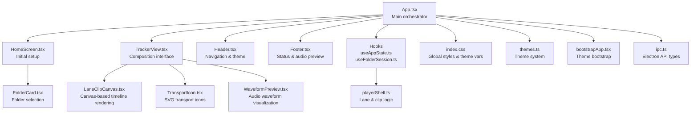
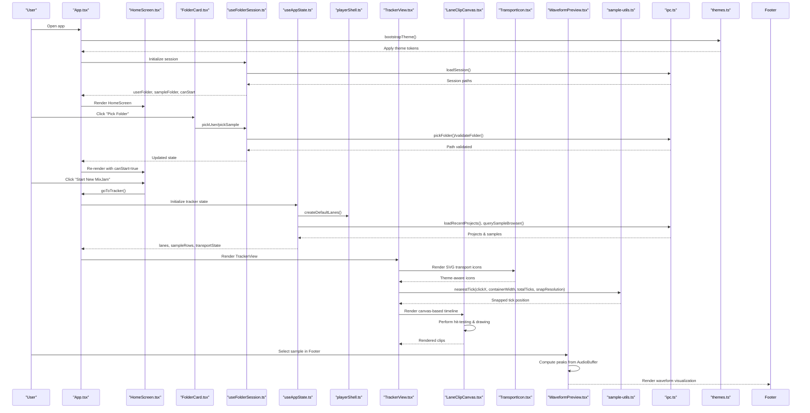
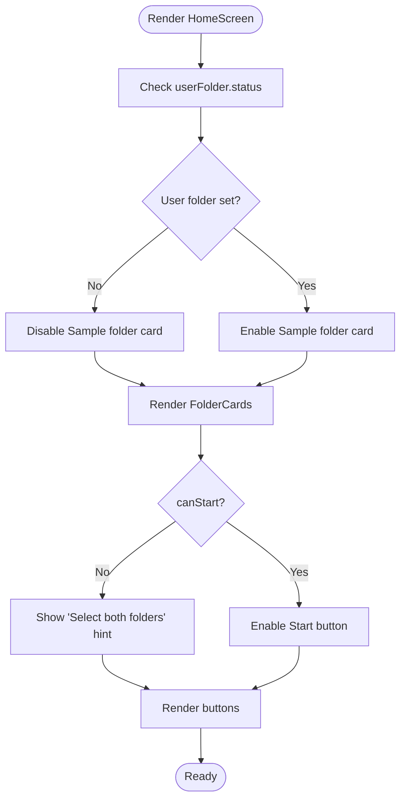
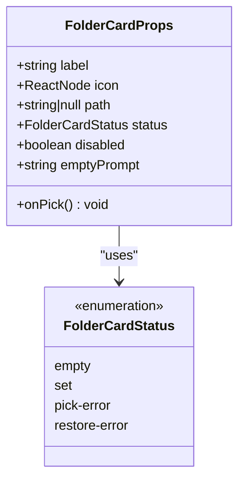
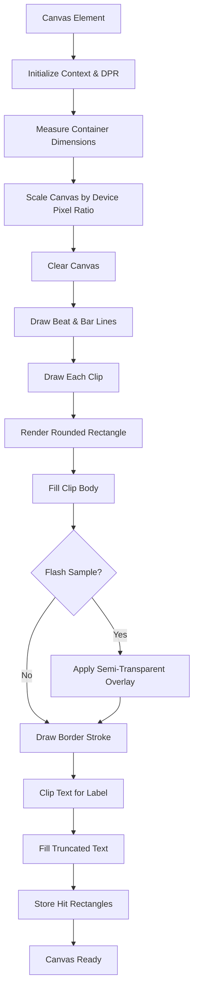
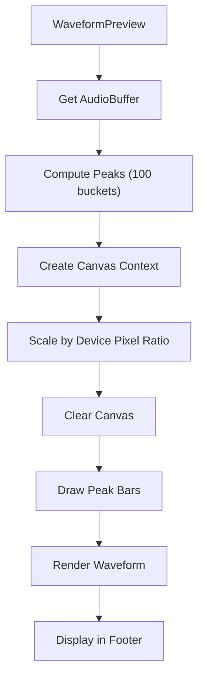
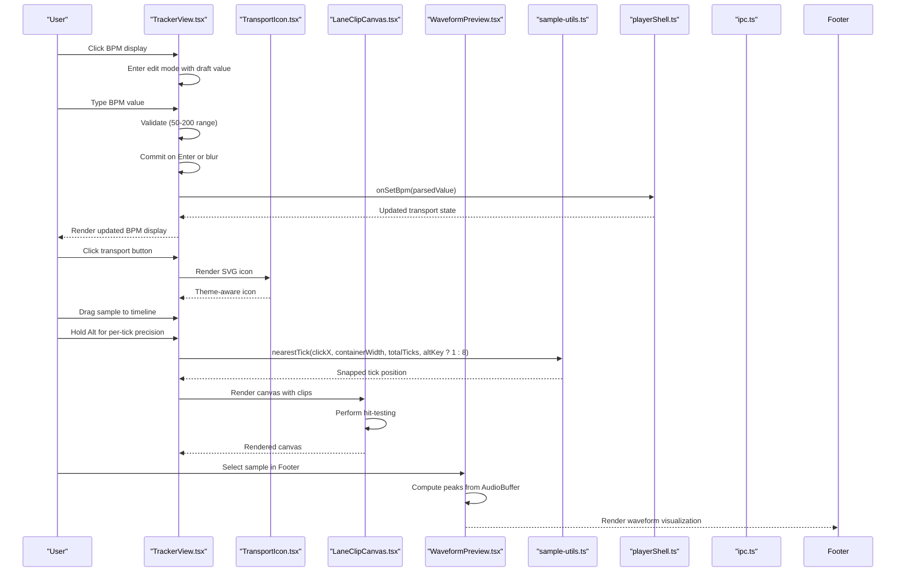
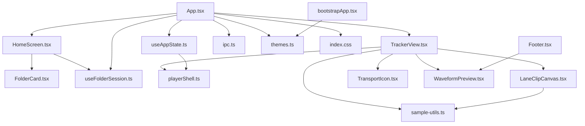

# UI Components

<cite>
**Referenced Files in This Document**
- [HomeScreen.tsx](file://src/renderer/src/components/HomeScreen.tsx)
- [TrackerView.tsx](file://src/renderer/src/components/TrackerView.tsx)
- [FolderCard.tsx](file://src/renderer/src/components/FolderCard.tsx)
- [LaneClipCanvas.tsx](file://src/renderer/src/components/LaneClipCanvas.tsx)
- [WaveformPreview.tsx](file://src/renderer/src/components/WaveformPreview.tsx)
- [App.tsx](file://src/renderer/src/App.tsx)
- [Footer.tsx](file://src/renderer/src/components/Footer.tsx)
- [useAppState.ts](file://src/renderer/src/hooks/useAppState.ts)
- [useFolderSession.ts](file://src/renderer/src/hooks/useFolderSession.ts)
- [playerShell.ts](file://src/renderer/src/lib/playerShell.ts)
- [sample-utils.ts](file://src/renderer/src/lib/sample-utils.ts)
- [index.css](file://src/renderer/src/index.css)
- [Header.tsx](file://src/renderer/src/components/Header.tsx)
- [Footer.tsx](file://src/renderer/src/components/Footer.tsx)
- [themes.ts](file://src/renderer/src/theme/themes.ts)
- [bootstrapApp.tsx](file://src/renderer/src/bootstrapApp.tsx)
- [ipc.ts](file://src/shared/ipc.ts)
</cite>

## Update Summary
**Changes Made**
- Enhanced TrackerView documentation to include SVG transport icons with inline SVG paths and theme-aware styling
- Updated sample bubble theming documentation to reflect improved bubbleStyle function and bubbleTextColor calculations
- Added comprehensive documentation of the new WaveformPreview component integration in the Footer
- Updated transport icon system documentation with TransportIcon component and inline SVG approach
- Enhanced theme-aware styling documentation with bubbleTextColor WCAG compliance and contrast calculations
- Updated sample-utils documentation to reflect improved snap resolution parameter and bubble theming functions

## Table of Contents
1. [Introduction](#introduction)
2. [Project Structure](#project-structure)
3. [Core Components](#core-components)
4. [Architecture Overview](#architecture-overview)
5. [Detailed Component Analysis](#detailed-component-analysis)
6. [Dependency Analysis](#dependency-analysis)
7. [Performance Considerations](#performance-considerations)
8. [Troubleshooting Guide](#troubleshooting-guide)
9. [Conclusion](#conclusion)

## Introduction
This document provides comprehensive documentation for MixJam Electron's UI components, focusing on the HomeScreen component for initial setup and onboarding, the TrackerView component for the main composition interface, the FolderCard component for displaying and interacting with folder items, the new LaneClipCanvas component for canvas-based timeline rendering, and the newly integrated WaveformPreview component for audio visualization. It covers component props, state management, event handling, user interaction patterns, styling approaches, responsive design considerations, accessibility features, and integration patterns with the application state system.

## Project Structure
The UI components are organized under the renderer/src/components directory, with supporting hooks, libraries, and styles under renderer/src. The main application orchestrates component rendering through App.tsx, which delegates to HomeScreen or TrackerView based on the current view state. The new LaneClipCanvas component provides specialized canvas rendering for timeline clips with advanced hit-testing and drag-and-drop support. The WaveformPreview component integrates with the Footer to provide audio waveform visualization. Styling is centralized in index.css with theme support managed by themes.ts and applied during bootstrap.

**Diagram sources**
- [App.tsx:1-108](file://src/renderer/src/App.tsx#L1-L108)
- [HomeScreen.tsx:1-77](file://src/renderer/src/components/HomeScreen.tsx#L1-L77)
- [TrackerView.tsx:1-946](file://src/renderer/src/components/TrackerView.tsx#L1-L946)
- [FolderCard.tsx:1-60](file://src/renderer/src/components/FolderCard.tsx#L1-L60)
- [LaneClipCanvas.tsx:1-264](file://src/renderer/src/components/LaneClipCanvas.tsx#L1-L264)
- [WaveformPreview.tsx:1-85](file://src/renderer/src/components/WaveformPreview.tsx#L1-L85)
- [useAppState.ts:1-295](file://src/renderer/src/hooks/useAppState.ts#L1-L295)
- [useFolderSession.ts:1-106](file://src/renderer/src/hooks/useFolderSession.ts#L1-L106)
- [playerShell.ts:1-197](file://src/renderer/src/lib/playerShell.ts#L1-L197)
- [index.css:1-795](file://src/renderer/src/index.css#L1-L795)
- [Header.tsx:1-43](file://src/renderer/src/components/Header.tsx#L1-L43)
- [Footer.tsx:1-49](file://src/renderer/src/components/Footer.tsx#L1-L49)
- [themes.ts:1-112](file://src/renderer/src/theme/themes.ts#L1-L112)
- [bootstrapApp.tsx:1-19](file://src/renderer/src/bootstrapApp.tsx#L1-L19)
- [ipc.ts:1-59](file://src/shared/ipc.ts#L1-L59)

**Section sources**
- [App.tsx:1-108](file://src/renderer/src/App.tsx#L1-L108)
- [index.css:1-795](file://src/renderer/src/index.css#L1-L795)

## Core Components
This section outlines the primary UI components and their roles in the application.

- HomeScreen: Provides initial setup and onboarding by allowing users to select User and Sample folders, enabling the Start button when both folders are selected, and offering a Load option.
- TrackerView: Implements the main composition interface with enhanced timeline visualization, BPM editing, resize handle functionality, sample arrangement, transport controls with SVG icons, and sample browser. **Enhanced** with beat-snap functionality, keyboard modifier support, and theme-aware styling.
- FolderCard: Displays folder selection state with status messaging, icons, and a pick action, handling disabled states and error conditions.
- LaneClipCanvas: **NEW** Specialized canvas component for rendering timeline clips with advanced hit-testing, drag-and-drop support, visual effects, and performance optimization. **Enhanced** with improved grid visualization and beat/bar line rendering.
- WaveformPreview: **NEW** Component that renders audio waveform visualization in the Footer, providing visual feedback for selected samples with device pixel ratio awareness and theme integration.

**Section sources**
- [HomeScreen.tsx:1-77](file://src/renderer/src/components/HomeScreen.tsx#L1-L77)
- [TrackerView.tsx:1-946](file://src/renderer/src/components/TrackerView.tsx#L1-L946)
- [FolderCard.tsx:1-60](file://src/renderer/src/components/FolderCard.tsx#L1-L60)
- [LaneClipCanvas.tsx:1-264](file://src/renderer/src/components/LaneClipCanvas.tsx#L1-L264)
- [WaveformPreview.tsx:1-85](file://src/renderer/src/components/WaveformPreview.tsx#L1-L85)

## Architecture Overview
The UI architecture follows a unidirectional data flow with enhanced canvas-based rendering and audio visualization:
- App.tsx manages global state and view switching.
- useFolderSession handles folder selection lifecycle and persistence.
- useAppState manages tracker view state, sample browser queries, transport, and lane management.
- playerShell provides pure data transformations for lanes and clips.
- LaneClipCanvas offers specialized canvas rendering for timeline clips with hit-testing and drag-and-drop.
- sample-utils provides configurable snap resolution for precise timeline positioning and theme-aware bubble styling.
- WaveformPreview integrates with Footer to provide audio waveform visualization with device pixel ratio awareness.
- index.css defines theme-driven design tokens applied via themes.ts.
- bootstrapApp initializes the theme before mounting the React app.

**Diagram sources**
- [App.tsx:1-108](file://src/renderer/src/App.tsx#L1-L108)
- [HomeScreen.tsx:1-77](file://src/renderer/src/components/HomeScreen.tsx#L1-L77)
- [FolderCard.tsx:1-60](file://src/renderer/src/components/FolderCard.tsx#L1-L60)
- [useFolderSession.ts:1-106](file://src/renderer/src/hooks/useFolderSession.ts#L1-L106)
- [useAppState.ts:1-295](file://src/renderer/src/hooks/useAppState.ts#L1-L295)
- [playerShell.ts:1-197](file://src/renderer/src/lib/playerShell.ts#L1-L197)
- [LaneClipCanvas.tsx:1-264](file://src/renderer/src/components/LaneClipCanvas.tsx#L1-L264)
- [TrackerView.tsx:23-38](file://src/renderer/src/components/TrackerView.tsx#L23-L38)
- [WaveformPreview.tsx:34-85](file://src/renderer/src/components/WaveformPreview.tsx#L34-L85)
- [sample-utils.ts:69-89](file://src/renderer/src/lib/sample-utils.ts#L69-L89)
- [ipc.ts:1-59](file://src/shared/ipc.ts#L1-L59)
- [themes.ts:1-112](file://src/renderer/src/theme/themes.ts#L1-L112)
- [bootstrapApp.tsx:1-19](file://src/renderer/src/bootstrapApp.tsx#L1-L19)

## Detailed Component Analysis

### HomeScreen Component
HomeScreen serves as the initial setup screen for MixJam, guiding users through selecting their User and Sample folders and starting a new session.

- Props:
  - userFolder: FolderView for the User folder
  - sampleFolder: FolderView for the Sample folder
  - canStart: Boolean indicating if both folders are selected
  - onPickUser: Callback to initiate User folder selection
  - onPickSample: Callback to initiate Sample folder selection
  - onStart: Callback to navigate to the Tracker view
  - onLoad: Callback to open a project file picker

- State Management:
  - Delegated to parent App via useFolderSession and useAppState hooks.
  - HomeScreen renders FolderCard components for both folders and a Start button conditionally enabled by canStart.

- Event Handling:
  - FolderCard triggers onPick callbacks to update session state.
  - Start button invokes onStart to switch views.
  - Load button opens a file picker via onLoad.

- User Interaction Patterns:
  - Users select folders sequentially; the Start button becomes enabled only when both selections are valid.
  - Disabled state of the Sample folder card depends on User folder selection.

- Accessibility:
  - SVG icons are presentational (aria-hidden) while FolderCard status messages provide meaningful text.
  - Buttons use semantic HTML with disabled states reflected in styling.

- Styling and Responsive Design:
  - Centered layout with fixed width container and responsive max-width.
  - Card-based layout with spacing and typography consistent with the theme.

**Diagram sources**
- [HomeScreen.tsx:30-77](file://src/renderer/src/components/HomeScreen.tsx#L30-L77)

**Section sources**
- [HomeScreen.tsx:1-77](file://src/renderer/src/components/HomeScreen.tsx#L1-L77)
- [App.tsx:64-74](file://src/renderer/src/App.tsx#L64-L74)

### FolderCard Component
FolderCard displays a single folder selection card with status messaging and a pick action.

- Props:
  - label: Display label for the card
  - icon: ReactNode representing the folder icon
  - path: Current folder path or null
  - status: FolderCardStatus ('empty' | 'set' | 'pick-error' | 'restore-error')
  - disabled: Boolean controlling interactivity
  - emptyPrompt: Message shown when status is 'empty'
  - onPick: Callback invoked when the user clicks "Pick Folder"

- Status Resolution:
  - 'set': Displays the path with a path-specific tone
  - 'pick-error': Displays an error message for invalid selection
  - 'restore-error': Displays an error message for previously saved inaccessible folder
  - 'empty': Displays the emptyPrompt

- Event Handling:
  - onPick callback is triggered when the user clicks the "Pick Folder" button.
  - Disabled state prevents interaction.

- Accessibility:
  - Status messages use semantic tones (path/error/prompt) for screen readers.
  - Icon is marked as presentational.

- Styling:
  - Card container adapts opacity and pointer events when disabled.
  - Status text tone classes control color and emphasis.

**Diagram sources**
- [FolderCard.tsx:7-15](file://src/renderer/src/components/FolderCard.tsx#L7-L15)
- [useFolderSession.ts:4](file://src/renderer/src/hooks/useFolderSession.ts#L4)

**Section sources**
- [FolderCard.tsx:1-60](file://src/renderer/src/components/FolderCard.tsx#L1-L60)
- [useFolderSession.ts:4-14](file://src/renderer/src/hooks/useFolderSession.ts#L4-L14)

### LaneClipCanvas Component
**NEW** LaneClipCanvas provides canvas-based rendering for timeline clips with advanced hit-testing, drag-and-drop support, and visual effects.

- Props:
  - clips: Array of LaneClip objects to render
  - totalTicks: Total timeline duration in ticks
  - laneIndex: Index of the lane for context
  - flashSamplePath: Path of sample to flash (highlight) in the timeline
  - selectedClipIds: Set of currently selected clip IDs
  - onClipDragStart: Callback for drag start events with clip ID
  - onClipContextMenu: Callback for context menu events with clip information

- Canvas Rendering Features:
  - Device pixel ratio aware rendering for crisp visuals
  - **Enhanced** Grid visualization with beat lines (25% opacity) and bar lines (full opacity)
  - Rounded rectangle clip rendering with gradient colors
  - Semi-transparent flash overlay for visual feedback
  - Text clipping for truncated sample names
  - Dynamic sizing based on timeline width and tick duration

- Hit-Testing and Interactions:
  - Spatial hit-testing for precise clip selection
  - Mouse down tracking for drag preparation
  - Context menu support with clip-specific actions
  - Data attribute storage for accessibility and testing

- Performance Optimizations:
  - Efficient canvas redraw on resize and prop changes
  - Memoized drawing functions with useCallback
  - ResizeObserver for automatic canvas scaling
  - Fallback hit-testing for test environments

- Visual Design:
  - Fixed clip dimensions (32px height, 6px top margin)
  - Corner radius for modern appearance
  - Accent color fallback from CSS variables
  - Text color contrast for readability

**Diagram sources**
- [LaneClipCanvas.tsx:79-175](file://src/renderer/src/components/LaneClipCanvas.tsx#L79-L175)
- [LaneClipCanvas.tsx:191-210](file://src/renderer/src/components/LaneClipCanvas.tsx#L191-L210)

**Section sources**
- [LaneClipCanvas.tsx:1-264](file://src/renderer/src/components/LaneClipCanvas.tsx#L1-L264)

### TransportIcon Component
**NEW** TransportIcon provides SVG-based transport controls with theme-aware styling for the TrackerView.

- Props:
  - shape: keyof TRANSPORT_ICON_PATHS ('skip-back' | 'play' | 'pause' | 'stop')

- SVG Transport Icons:
  - **skip-back**: Three-dimensional arrow icon with rectangular handle and triangular head
  - **play**: Simple right-pointing triangle for forward playback
  - **pause**: Two parallel vertical rectangles for pause state
  - **stop**: Solid square for stop state

- Inline SVG Implementation:
  - Uses hardcoded SVG path data for each transport shape
  - Fixed 16x16 viewBox for consistent sizing
  - Theme-aware coloring through CSS class "transport-icon"
  - Presentational role (aria-hidden) with accessibility-compliant implementation

- Theme Integration:
  - Styled through CSS class "transport-icon" inheriting theme colors
  - SVG paths designed to work with currentColor for seamless theme integration
  - Responsive to theme changes without requiring component re-rendering

- Accessibility:
  - Properly marked as presentational (aria-hidden="true", focusable="false")
  - Semantic button elements provide meaningful labels via aria-label attributes
  - Keyboard navigation support through button elements

**Section sources**
- [TrackerView.tsx:23-38](file://src/renderer/src/components/TrackerView.tsx#L23-L38)

### WaveformPreview Component
**NEW** WaveformPreview renders audio waveform visualization in the Footer for selected samples.

- Props:
  - filepath: string | null - Path to the audio file or null if no selection
  - getSampleBuffer: (samplePath: string) => Promise<AudioBuffer | null> - Function to retrieve audio buffer

- Waveform Computation:
  - **computePeaks**: Calculates peak amplitudes across 100 buckets for visualization
  - Bucket-based analysis with per-channel peak detection
  - Minimum 1px spike rendering for silent stretches
  - Device pixel ratio awareness for crisp rendering

- Canvas Rendering:
  - 200x22 pixel canvas with device pixel ratio scaling
  - Theme-aware color using CSS variable "--highlight" or fallback to #8FBCB2
  - Gradient-style bars with consistent width and height calculations
  - Anti-aliased rendering with proper scaling

- Performance Optimizations:
  - Stale detection to prevent race conditions with async buffer loading
  - Device pixel ratio awareness for high-DPI displays
  - Efficient bucket-based peak computation
  - Cleanup function to mark component as stale on unmount

- Integration with Footer:
  - Used within Footer component for sample detail visualization
  - Conditional rendering based on sample selection
  - Accessible labeling with proper aria attributes

**Diagram sources**
- [WaveformPreview.tsx:34-85](file://src/renderer/src/components/WaveformPreview.tsx#L34-L85)

**Section sources**
- [WaveformPreview.tsx:1-85](file://src/renderer/src/components/WaveformPreview.tsx#L1-L85)
- [Footer.tsx:32-41](file://src/renderer/src/components/Footer.tsx#L32-L41)

### TrackerView Component
**Enhanced** TrackerView implements the main composition interface with enhanced timeline visualization, BPM editing, resize handle functionality, sample arrangement, transport controls with SVG icons, and a sample browser.

- Props:
  - recentProjects: Array of recent project items
  - samples: Array of sample browser items
  - searchQuery: Current search query string
  - loading: Loading state for sample browser
  - error: Error message or null
  - selectedSamplePath: Currently selected sample path or null
  - lanes: Array of LaneState
  - laneShouldDim: Function determining if a lane should be visually dimmed
  - transportState: Transport state ('stopped' | 'playing' | 'paused')
  - currentTick: Current position in timeline
  - bpm: Current beats per minute value
  - masterGain: Master volume level
  - masterLevelDb: Current master level in decibels
  - totalCount: Total number of samples in database
  - onSetBpm: Callback to update BPM value
  - onSetMasterGain: Callback to update master gain
  - onSelectSampleDetail: Callback to set selected sample detail
  - onSearchChange: Callback to update search query
  - onRescan: Callback to trigger a forced rescan
  - onPlaceSampleDetailOnLane: Callback to place a sample on a specific lane at a tick
  - onMoveClipOnLane: Callback to move a clip between lanes or positions
  - onDuplicateClipOnLane: Callback to duplicate a clip on a lane
  - onMoveClipGroup: Callback to move a group of clips
  - onDuplicateClipGroup: Callback to duplicate a group of clips
  - onRemoveClipFromLane: Callback to remove a clip from a lane
  - onSetLanePan: Callback to set lane pan value
  - onPreviewSample: Callback to preview a sample
  - onToggleLaneMute: Callback to toggle mute on a lane
  - onToggleLaneSolo: Callback to toggle solo on a lane
  - onTransportPlay: Callback to start playback
  - onTransportPause: Callback to pause playback
  - onTransportStop: Callback to stop playback
  - onTransportSkipBack: Callback to skip backward
  - scanProgress: Current scanning progress state
  - selectedCategoryId: Currently selected category ID or undefined
  - selectedTagIds: Array of selected tag IDs
  - sortBy: Sort column ('filename' | 'duration' | 'dateAdded')
  - sortDir: Sort direction ('asc' | 'desc')
  - tags: Available tags for filtering
  - categories: Available categories for filtering
  - libraries: Available libraries for saving
  - onDbSearchChange: Callback to update database search query
  - onSelectCategory: Callback to select a category
  - onToggleTagFilter: Callback to toggle tag filter
  - onSortChange: Callback to change sort criteria
  - onStartScan: Callback to start scanning for samples
  - onCreateTag: Callback to create a new tag
  - onRenameTag: Callback to rename a tag
  - onDeleteTag: Callback to delete a tag
  - onCreateCategory: Callback to create a new category
  - onDeleteCategory: Callback to delete a category
  - onSaveLibrary: Callback to save a library
  - onDeleteLibrary: Callback to delete a library

- Enhanced Timeline Visualization:
  - **NEW** Canvas-based rendering via LaneClipCanvas component
  - Fixed total ticks (256) with ruler ticks every 32 ticks, marking bars at multiples of 4
  - Lane canvas width calculated as percentage per tick for precise placement
  - **Enhanced** Grid visualization with beat lines (25% opacity) and bar lines (full opacity)
  - Visual playhead indicator synchronized with transport state

- **Enhanced** Transport Controls with SVG Icons:
  - **NEW** TransportIcon component with inline SVG paths for skip-back, play, pause, and stop
  - Theme-aware transport buttons with proper accessibility labels
  - SVG icons designed to inherit currentColor from CSS for seamless theme integration
  - Presentational role with proper aria-hidden attributes

- **Enhanced** Sample Bubble Theming:
  - **NEW** bubbleStyle function creates theme-aware CSS properties with contrast calculations
  - **NEW** bubbleTextColor function implements WCAG-compliant contrast ratios using relative luminance
  - **NEW** categoryColor function provides deterministic color mapping for categories
  - **NEW** Dark ink fallback for light bubble colors to meet accessibility standards
  - **NEW** Text shadow removal for light-colored backgrounds to improve readability

- BPM Editing Functionality:
  - **NEW** Inline BPM editing with validation (50-200 BPM range)
  - Editable BPM display with keyboard shortcuts (Enter to commit, Escape to cancel)
  - Real-time BPM updates with immediate visual feedback
  - Range slider complement for quick adjustments

- Resize Handle Functionality:
  - **NEW** Horizontal resize handle between tracker and song controls regions
  - **NEW** Vertical resize handle for category tree width adjustment
  - Heuristic-based flex ratio calculation (~600px = 1fr unit)
  - Min/max constraints for both horizontal and vertical resizing

- **Enhanced** Sample Arrangement:
  - Clips are positioned absolutely within lanes based on startTick and durationTicks
  - **Enhanced** nearestTick function with configurable snap resolution parameter
  - **NEW** Beat-snap functionality: Alt key enables per-tick precision (snap = 1), default is beat snapping (snap = 8)
  - **NEW** Keyboard modifier support for enhanced workflow efficiency

- Sample Browser:
  - Category tree and sample list with search, results count, and rescan button
  - Selected sample row highlighted; empty states show errors or no results messaging
  - **NEW** Manage panel for tags, libraries, and categories
  - **NEW** WaveformPreview integration in sample bubbles for visual feedback

- Context Menu System:
  - **NEW** Right-click context menu for clip operations
  - Delete and Locate in Browser actions
  - Automatic dismissal on outside clicks

- **Enhanced** Keyboard Modifier Documentation:
  - **Alt**: Enables per-tick precision snapping (snap = 1) for fine-grained positioning
  - **Shift**: Duplicate samples functionality (implementation pending)
  - **Ctrl**: Multi-select functionality (implementation pending)
  - These modifiers provide enhanced workflow efficiency for professional music production

- Accessibility:
  - Proper roles and labels for interactive elements (canvas as button, mute/solo buttons)
  - ARIA attributes for meter and live region for footer details
  - Keyboard navigation support for BPM editing
  - Screen reader friendly category and tag filtering
  - **NEW** Transport icons with proper accessibility attributes

- Styling and Responsive Design:
  - Grid-based layout with defined zones for recent projects, timeline, middle strip, song controls, and browser
  - Flexible containers with overflow handling for long lists and dynamic widths
  - **NEW** Resizable browser regions with visual resize indicators
  - **NEW** Theme-aware bubble styling with WCAG-compliant contrast ratios

**Diagram sources**
- [TrackerView.tsx:251-277](file://src/renderer/src/components/TrackerView.tsx#L251-L277)
- [TrackerView.tsx:128-156](file://src/renderer/src/components/TrackerView.tsx#L128-L156)
- [TrackerView.tsx:214-256](file://src/renderer/src/components/TrackerView.tsx#L214-L256)
- [TrackerView.tsx:278-311](file://src/renderer/src/components/TrackerView.tsx#L278-L311)
- [TrackerView.tsx:23-38](file://src/renderer/src/components/TrackerView.tsx#L23-L38)
- [LaneClipCanvas.tsx:191-210](file://src/renderer/src/components/LaneClipCanvas.tsx#L191-L210)
- [WaveformPreview.tsx:34-85](file://src/renderer/src/components/WaveformPreview.tsx#L34-L85)
- [sample-utils.ts:69-89](file://src/renderer/src/lib/sample-utils.ts#L69-L89)
- [playerShell.ts:74-107](file://src/renderer/src/lib/playerShell.ts#L74-L107)
- [useAppState.ts:225-233](file://src/renderer/src/hooks/useAppState.ts#L225-L233)
- [ipc.ts:51-55](file://src/shared/ipc.ts#L51-L55)

**Section sources**
- [TrackerView.tsx:1-946](file://src/renderer/src/components/TrackerView.tsx#L1-L946)
- [LaneClipCanvas.tsx:1-264](file://src/renderer/src/components/LaneClipCanvas.tsx#L1-L264)
- [TransportIcon.tsx:1-38](file://src/renderer/src/components/TrackerView.tsx#L23-L38)
- [WaveformPreview.tsx:1-85](file://src/renderer/src/components/WaveformPreview.tsx#L1-L85)
- [playerShell.ts:1-197](file://src/renderer/src/lib/playerShell.ts#L1-L197)
- [sample-utils.ts:69-89](file://src/renderer/src/lib/sample-utils.ts#L69-L89)
- [useAppState.ts:225-233](file://src/renderer/src/hooks/useAppState.ts#L225-L233)

## Dependency Analysis
The components depend on hooks and libraries for state management and data transformations. The new LaneClipCanvas component integrates deeply with the TrackerView and playerShell for enhanced timeline visualization. The WaveformPreview component integrates with the Footer for audio visualization. The sample-utils library provides the foundation for configurable snap resolution and theme-aware bubble styling. The following diagram illustrates key dependencies:

**Diagram sources**
- [HomeScreen.tsx:1-77](file://src/renderer/src/components/HomeScreen.tsx#L1-L77)
- [FolderCard.tsx:1-60](file://src/renderer/src/components/FolderCard.tsx#L1-L60)
- [useFolderSession.ts:1-106](file://src/renderer/src/hooks/useFolderSession.ts#L1-L106)
- [App.tsx:1-108](file://src/renderer/src/App.tsx#L1-L108)
- [TrackerView.tsx:1-946](file://src/renderer/src/components/TrackerView.tsx#L1-L946)
- [LaneClipCanvas.tsx:1-264](file://src/renderer/src/components/LaneClipCanvas.tsx#L1-L264)
- [useAppState.ts:1-295](file://src/renderer/src/hooks/useAppState.ts#L1-L295)
- [playerShell.ts:1-197](file://src/renderer/src/lib/playerShell.ts#L1-L197)
- [sample-utils.ts:1-127](file://src/renderer/src/lib/sample-utils.ts#L1-L127)
- [TransportIcon.tsx:1-38](file://src/renderer/src/components/TrackerView.tsx#L23-L38)
- [WaveformPreview.tsx:1-85](file://src/renderer/src/components/WaveformPreview.tsx#L1-L85)
- [ipc.ts:1-59](file://src/shared/ipc.ts#L1-L59)
- [themes.ts:1-112](file://src/renderer/src/theme/themes.ts#L1-L112)
- [index.css:1-795](file://src/renderer/src/index.css#L1-L795)
- [bootstrapApp.tsx:1-19](file://src/renderer/src/bootstrapApp.tsx#L1-L19)
- [Footer.tsx:1-49](file://src/renderer/src/components/Footer.tsx#L1-L49)

**Section sources**
- [App.tsx:1-108](file://src/renderer/src/App.tsx#L1-L108)
- [useAppState.ts:1-295](file://src/renderer/src/hooks/useAppState.ts#L1-L295)
- [useFolderSession.ts:1-106](file://src/renderer/src/hooks/useFolderSession.ts#L1-L106)

## Performance Considerations
- **Canvas Optimization**: LaneClipCanvas uses device pixel ratio awareness and efficient redraw patterns to minimize performance overhead.
- **Debounced sample search**: The sample browser query is debounced with a 150ms delay to reduce network/API calls while typing.
- **Query sequencing**: A sequence reference ensures older queries do not overwrite newer results, preventing race conditions.
- **Efficient lane updates**: Clip placement uses immutable updates with sorting to maintain order.
- **CSS custom properties**: Theme tokens are applied via CSS custom properties for fast runtime switching without reflows.
- **Virtualization**: The sample list uses a viewport with overflow for large datasets; consider virtualization for very large libraries.
- **Hit-testing optimization**: LaneClipCanvas caches hit rectangles for efficient spatial queries during drag operations.
- **Resize observers**: Automatic canvas scaling reduces manual resize calculations and improves responsiveness.
- **Snap resolution caching**: The nearestTick function efficiently calculates snap positions with configurable resolution for optimal performance.
- **Waveform computation**: WaveformPreview uses bucket-based peak computation with efficient per-channel processing.
- **Device pixel ratio awareness**: WaveformPreview scales canvas appropriately for high-DPI displays without performance degradation.
- **Stale detection**: WaveformPreview prevents race conditions with async buffer loading through stale detection mechanism.

[No sources needed since this section provides general guidance]

## Troubleshooting Guide
- **Folder selection errors**:
  - 'pick-error': Occurs when the selected folder fails validation; prompt the user to choose another folder.
  - 'restore-error': Occurs when a previously saved folder is no longer accessible; prompt the user to select a new folder.
- **Sample browser issues**:
  - Loading state: The sample browser indicates loading while queries are in progress.
  - Error state: Displays an error message when sample library loading fails.
  - Empty results: Shows a message when no samples match the current query.
- **Transport state**:
  - Transport controls reflect the current transport state; ensure transport is initialized when entering the tracker view.
  - **NEW** Transport icons may not render if CSS class "transport-icon" is not properly applied.
- **BPM editing issues**:
  - **NEW** BPM values outside 50-200 range are rejected; ensure values are within valid range.
  - **NEW** Use Enter to commit edits or Escape to cancel; verify keyboard event handling.
- **Timeline rendering problems**:
  - **NEW** Canvas rendering requires proper container dimensions; ensure parent containers have valid sizes.
  - **NEW** Hit-testing may fail in test environments; verify canvas measurements and fallback logic.
  - **NEW** Grid visualization requires proper container width; verify snap resolution calculations.
- **Beat-snap functionality issues**:
  - **NEW** Alt key functionality requires proper event detection; verify event.altKey handling.
  - **NEW** Snap resolution parameter defaults to 1 for backward compatibility; ensure proper parameter passing.
  - **NEW** Per-tick precision may feel different from expected; verify snap resolution of 1 vs default 8.
- **Keyboard modifier conflicts**:
  - **NEW** Shift and Ctrl modifiers are reserved for future duplicate and multi-select functionality.
  - **NEW** Ensure proper event handling to prevent conflicts with browser shortcuts.
- **Resize handle issues**:
  - **NEW** Horizontal resize may not work if browserFlex is out of range (0.3-3); check flex ratio calculations.
  - **NEW** Vertical resize has min/max constraints (80-400px); verify width calculations.
- **Theme application**:
  - Theme bootstrap occurs before React mounts; if colors appear incorrect, verify theme application and CSS custom properties.
  - **NEW** Transport icons inherit theme colors through CSS class "transport-icon".
  - **NEW** Bubble styling relies on WCAG-compliant contrast calculations; verify bubbleTextColor function.
- **Waveform preview issues**:
  - **NEW** Waveform may not render if getSampleBuffer returns null or AudioBuffer is unavailable.
  - **NEW** Waveform appears blurry on high-DPI displays; verify device pixel ratio scaling.
  - **NEW** Waveform computation may be slow for large audio files; consider optimizing computePeaks function.

**Section sources**
- [FolderCard.tsx:4-6](file://src/renderer/src/components/FolderCard.tsx#L4-L6)
- [TrackerView.tsx:251-277](file://src/renderer/src/components/TrackerView.tsx#L251-L277)
- [TrackerView.tsx:128-156](file://src/renderer/src/components/TrackerView.tsx#L128-L156)
- [TrackerView.tsx:278-311](file://src/renderer/src/components/TrackerView.tsx#L278-L311)
- [LaneClipCanvas.tsx:191-210](file://src/renderer/src/components/LaneClipCanvas.tsx#L191-L210)
- [TransportIcon.tsx:23-38](file://src/renderer/src/components/TrackerView.tsx#L23-L38)
- [WaveformPreview.tsx:34-85](file://src/renderer/src/components/WaveformPreview.tsx#L34-L85)
- [sample-utils.ts:69-89](file://src/renderer/src/lib/sample-utils.ts#L69-L89)
- [useAppState.ts:93-124](file://src/renderer/src/hooks/useAppState.ts#L93-L124)
- [useAppState.ts:150-156](file://src/renderer/src/hooks/useAppState.ts#L150-L156)
- [bootstrapApp.tsx:12-19](file://src/renderer/src/bootstrapApp.tsx#L12-L19)

## Conclusion
MixJam Electron's UI components are structured around clear separation of concerns with enhanced canvas-based rendering and audio visualization: HomeScreen handles onboarding and folder selection, TrackerView provides the composition interface with timeline and sample management, FolderCard encapsulates folder selection UX, the new LaneClipCanvas delivers high-performance timeline visualization, and the new WaveformPreview provides audio waveform visualization in the Footer. The enhanced transport icon system with SVG icons and theme-aware styling significantly improves the visual consistency and accessibility of transport controls. The improved sample bubble theming system with WCAG-compliant contrast ratios ensures readability across all themes. The new WaveformPreview integration provides valuable audio feedback for selected samples. The enhanced beat-snap functionality with Alt key support, improved grid visualization, and configurable snap resolution significantly improve the user experience for precise timing and workflow efficiency. The keyboard modifier system (Alt for per-tick precision, with Shift and Ctrl reserved for future duplicate and multi-select functionality) provides professional-grade control for music production workflows. The hooks manage state transitions and integrate with Electron APIs, while the theme system and CSS custom properties enable flexible styling. Together, these components deliver a responsive, accessible, and performant user experience for music production workflows.