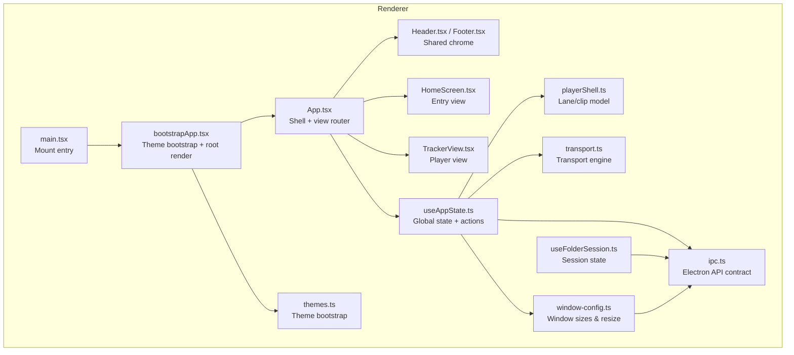
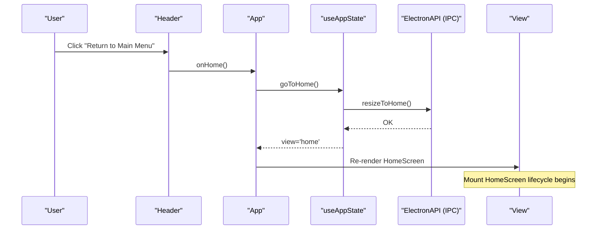
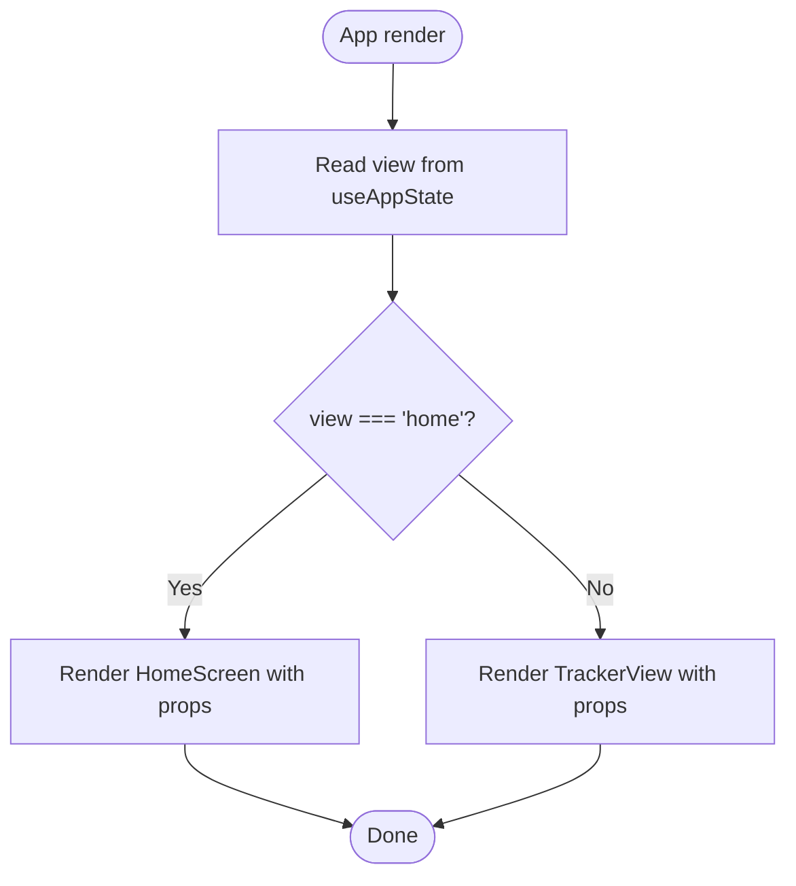
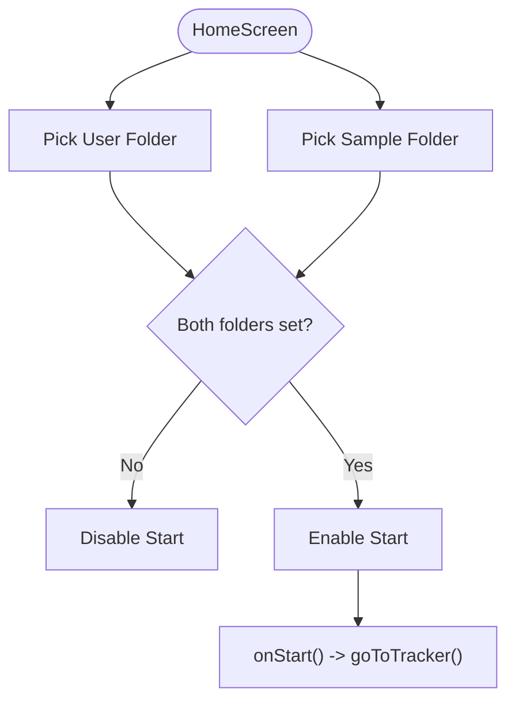
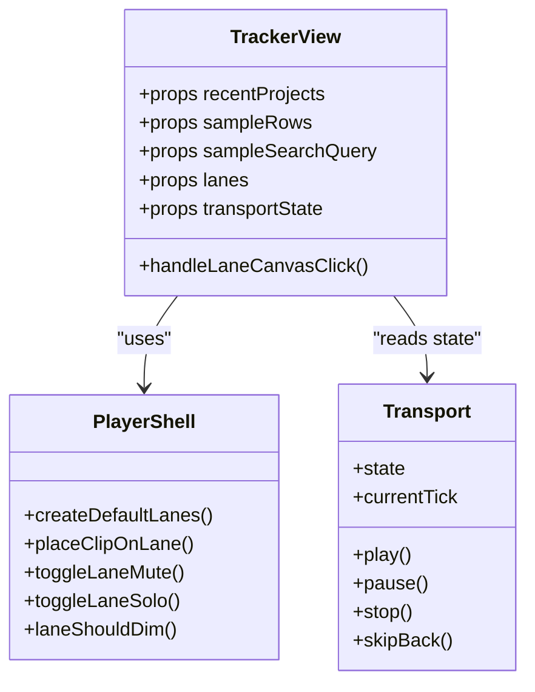
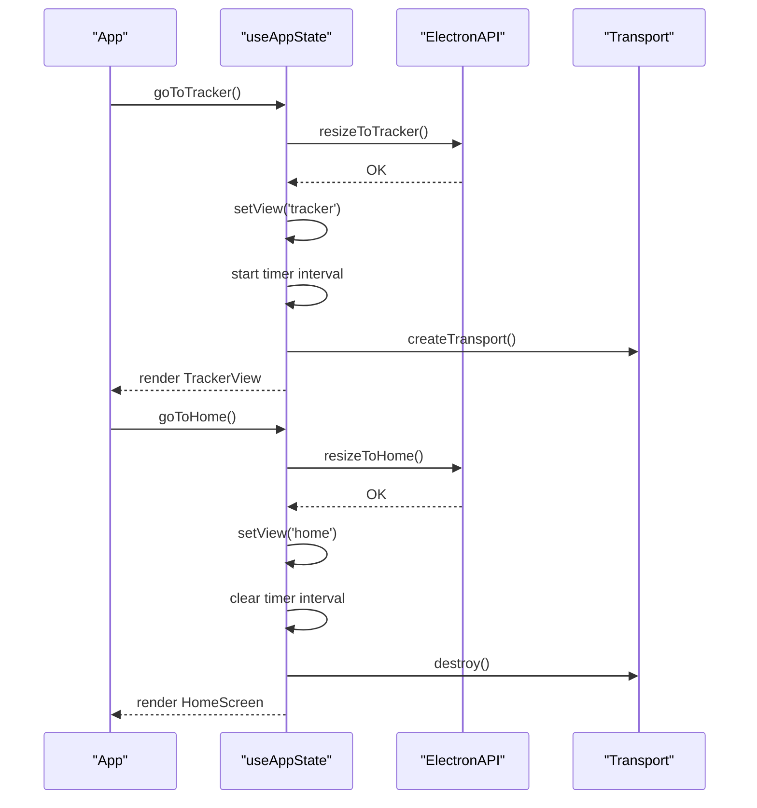
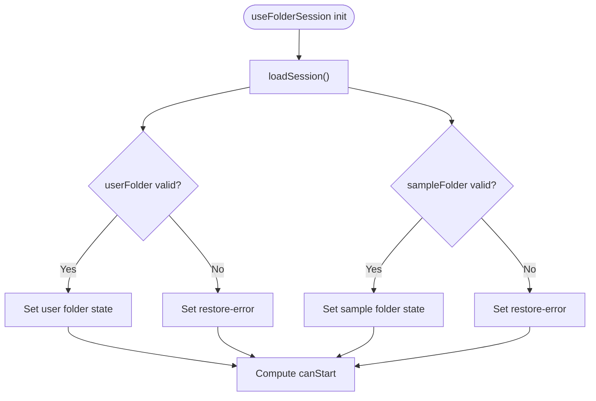
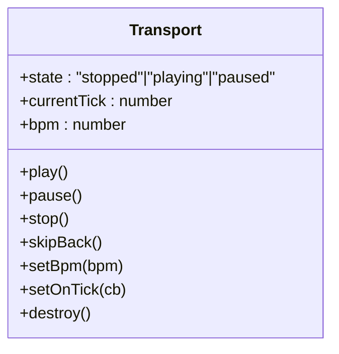
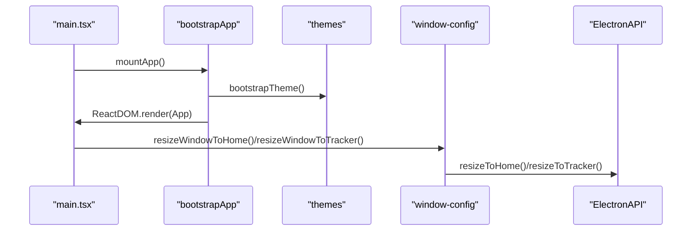
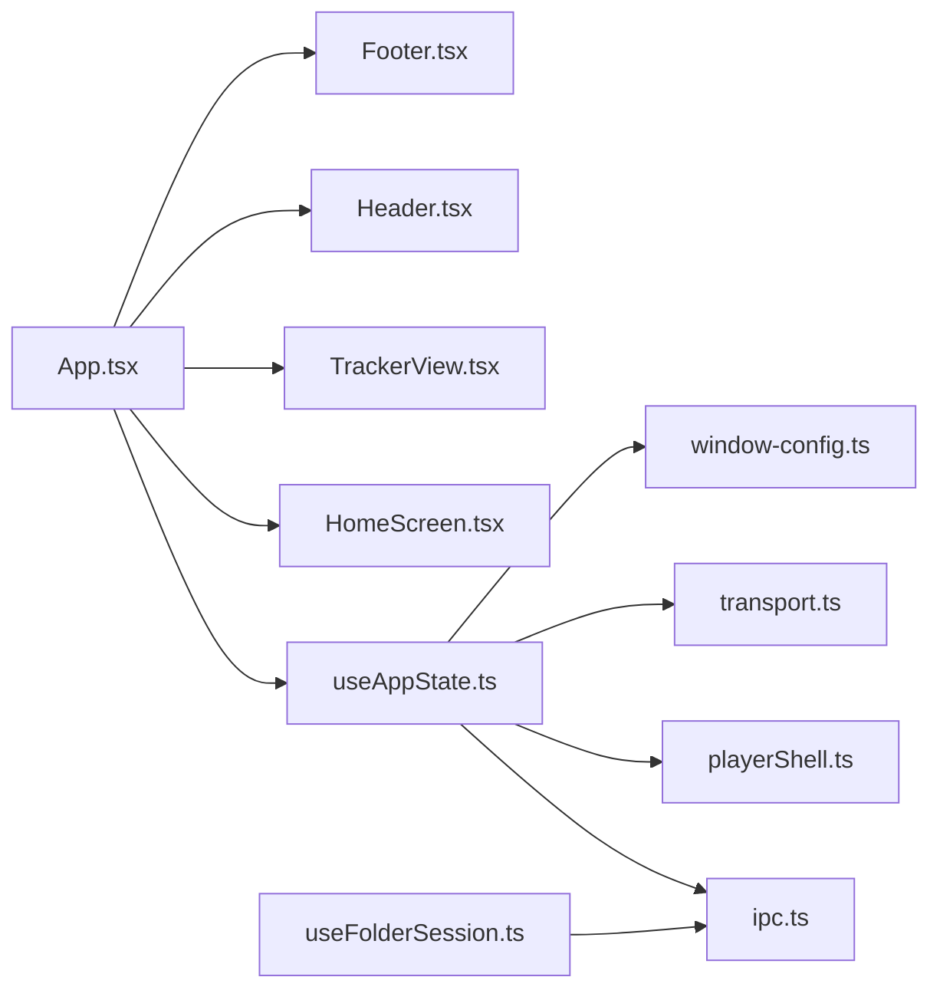

# View Coordination & Lifecycle

<cite>
**Referenced Files in This Document**
- [App.tsx](file://src/renderer/src/App.tsx)
- [bootstrapApp.tsx](file://src/renderer/src/bootstrapApp.tsx)
- [main.tsx](file://src/renderer/src/main.tsx)
- [HomeScreen.tsx](file://src/renderer/src/components/HomeScreen.tsx)
- [TrackerView.tsx](file://src/renderer/src/components/TrackerView.tsx)
- [Header.tsx](file://src/renderer/src/components/Header.tsx)
- [Footer.tsx](file://src/renderer/src/components/Footer.tsx)
- [useAppState.ts](file://src/renderer/src/hooks/useAppState.ts)
- [useFolderSession.ts](file://src/renderer/src/hooks/useFolderSession.ts)
- [playerShell.ts](file://src/renderer/src/lib/playerShell.ts)
- [transport.ts](file://src/renderer/src/engine/transport.ts)
- [ipc.ts](file://src/shared/ipc.ts)
- [window-config.ts](file://src/shared/window-config.ts)
- [themes.ts](file://src/renderer/src/theme/themes.ts)
- [spec-001-app-shell-navigation.test.tsx](file://src/renderer/src/specs/spec-001-app-shell-navigation.test.tsx)
</cite>

## Table of Contents
1. [Introduction](#introduction)
2. [Project Structure](#project-structure)
3. [Core Components](#core-components)
4. [Architecture Overview](#architecture-overview)
5. [Detailed Component Analysis](#detailed-component-analysis)
6. [Dependency Analysis](#dependency-analysis)
7. [Performance Considerations](#performance-considerations)
8. [Troubleshooting Guide](#troubleshooting-guide)
9. [Conclusion](#conclusion)

## Introduction
This document explains how MixJam Electron coordinates views and manages their lifecycle within the application shell. It focuses on the HomeScreen and TrackerView, detailing how the application bootstraps, selects and renders the active view, and how lifecycle events (mounting, updating, unmounting) are handled. It also covers inter-view communication, data sharing, state synchronization, and performance considerations for smooth view transitions.

## Project Structure
The renderer-side view coordination centers around a small set of files:
- Application shell and view routing live in the top-level App component.
- Two primary views are implemented as separate React components.
- State orchestration is handled by a custom hook that exposes view state and actions.
- Window resizing and theme bootstrap are coordinated via shared modules.
- Electron IPC channels define the contract for window resizing and session/sample browsing.

**Diagram sources**
- [main.tsx:1-5](file://src/renderer/src/main.tsx#L1-L5)
- [bootstrapApp.tsx:1-19](file://src/renderer/src/bootstrapApp.tsx#L1-L19)
- [App.tsx:1-108](file://src/renderer/src/App.tsx#L1-L108)
- [Header.tsx:1-43](file://src/renderer/src/components/Header.tsx#L1-L43)
- [Footer.tsx:1-33](file://src/renderer/src/components/Footer.tsx#L1-L33)
- [HomeScreen.tsx:1-77](file://src/renderer/src/components/HomeScreen.tsx#L1-L77)
- [TrackerView.tsx:1-270](file://src/renderer/src/components/TrackerView.tsx#L1-L270)
- [useAppState.ts:1-295](file://src/renderer/src/hooks/useAppState.ts#L1-L295)
- [useFolderSession.ts:1-106](file://src/renderer/src/hooks/useFolderSession.ts#L1-L106)
- [playerShell.ts:1-132](file://src/renderer/src/lib/playerShell.ts#L1-L132)
- [transport.ts:1-118](file://src/renderer/src/engine/transport.ts#L1-L118)
- [themes.ts:1-112](file://src/renderer/src/theme/themes.ts#L1-L112)
- [window-config.ts:1-54](file://src/shared/window-config.ts#L1-L54)
- [ipc.ts:1-59](file://src/shared/ipc.ts#L1-L59)

**Section sources**
- [main.tsx:1-5](file://src/renderer/src/main.tsx#L1-L5)
- [bootstrapApp.tsx:1-19](file://src/renderer/src/bootstrapApp.tsx#L1-L19)
- [App.tsx:1-108](file://src/renderer/src/App.tsx#L1-L108)

## Core Components
- App shell and router: Orchestrates view selection and passes props to HomeScreen or TrackerView. It also wires global actions (navigation, theme change) to the state hook.
- HomeScreen: Provides folder selection and launch controls; conditionally enables Start based on session state.
- TrackerView: Full-screen tracker UI with lanes, clips, transport controls, and sample browser.
- useAppState: Centralized state and actions for view switching, transport, lanes, sample browser, and timers.
- useFolderSession: Manages session state (user and sample folders) and provides canStart flag.
- playerShell: Defines lane/clip model and operations for placing clips and muting/soloing lanes.
- transport: Lightweight transport engine with play/pause/stop/skipBack and BPM control.
- window-config and ipc: Define window sizes and Electron IPC channel contracts for resizing and session/sample operations.

**Section sources**
- [App.tsx:1-108](file://src/renderer/src/App.tsx#L1-L108)
- [HomeScreen.tsx:1-77](file://src/renderer/src/components/HomeScreen.tsx#L1-L77)
- [TrackerView.tsx:1-270](file://src/renderer/src/components/TrackerView.tsx#L1-L270)
- [useAppState.ts:1-295](file://src/renderer/src/hooks/useAppState.ts#L1-L295)
- [useFolderSession.ts:1-106](file://src/renderer/src/hooks/useFolderSession.ts#L1-L106)
- [playerShell.ts:1-132](file://src/renderer/src/lib/playerShell.ts#L1-L132)
- [transport.ts:1-118](file://src/renderer/src/engine/transport.ts#L1-L118)
- [window-config.ts:1-54](file://src/shared/window-config.ts#L1-L54)
- [ipc.ts:1-59](file://src/shared/ipc.ts#L1-L59)

## Architecture Overview
The view coordination follows a unidirectional data flow:
- App reads view state from useAppState and renders either HomeScreen or TrackerView.
- Actions in App trigger useAppState handlers that update state and call Electron APIs for window resizing and data operations.
- TrackerView consumes transport state and lane state from useAppState; HomeScreen consumes session state from useFolderSession.
- Theme bootstrap occurs before React mounts to avoid layout shifts.

**Diagram sources**
- [App.tsx:64-96](file://src/renderer/src/App.tsx#L64-L96)
- [useAppState.ts:194-198](file://src/renderer/src/hooks/useAppState.ts#L194-L198)
- [ipc.ts:40-48](file://src/shared/ipc.ts#L40-L48)
- [window-config.ts:46-54](file://src/shared/window-config.ts#L46-L54)

## Detailed Component Analysis

### App Shell and View Routing
- Conditional rendering decides between HomeScreen and TrackerView based on the view state.
- Props are passed down to each view to enable controlled interactions (e.g., transport controls, sample browser).
- Theme bootstrap is applied synchronously before React renders.

**Diagram sources**
- [App.tsx:64-96](file://src/renderer/src/App.tsx#L64-L96)
- [bootstrapApp.tsx:12-19](file://src/renderer/src/bootstrapApp.tsx#L12-L19)

**Section sources**
- [App.tsx:1-108](file://src/renderer/src/App.tsx#L1-L108)
- [bootstrapApp.tsx:1-19](file://src/renderer/src/bootstrapApp.tsx#L1-L19)

### HomeScreen
- Presents two folder selection cards and a Start button.
- Start is enabled only when both folders are set.
- Launches into TrackerView via a handler from useAppState.

**Diagram sources**
- [HomeScreen.tsx:30-77](file://src/renderer/src/components/HomeScreen.tsx#L30-L77)
- [useFolderSession.ts:59-106](file://src/renderer/src/hooks/useFolderSession.ts#L59-L106)
- [useAppState.ts:189-192](file://src/renderer/src/hooks/useAppState.ts#L189-L192)

**Section sources**
- [HomeScreen.tsx:1-77](file://src/renderer/src/components/HomeScreen.tsx#L1-L77)
- [useFolderSession.ts:1-106](file://src/renderer/src/hooks/useFolderSession.ts#L1-L106)

### TrackerView
- Displays recent projects, lanes with clips, transport controls, and a sample browser.
- Handles placing samples onto lanes and toggling mute/solo.
- Reads transport state and updates UI accordingly.

**Diagram sources**
- [TrackerView.tsx:5-25](file://src/renderer/src/components/TrackerView.tsx#L5-L25)
- [playerShell.ts:29-132](file://src/renderer/src/lib/playerShell.ts#L29-L132)
- [transport.ts:19-31](file://src/renderer/src/engine/transport.ts#L19-L31)

**Section sources**
- [TrackerView.tsx:1-270](file://src/renderer/src/components/TrackerView.tsx#L1-L270)
- [playerShell.ts:1-132](file://src/renderer/src/lib/playerShell.ts#L1-L132)
- [transport.ts:1-118](file://src/renderer/src/engine/transport.ts#L1-L118)

### useAppState: State, Actions, and Lifecycle
- Maintains view state, timer, recent projects, sample browser state, lane state, and transport state.
- Exposes navigation actions (goToHome, goToTracker) and data actions (search, rescan, place sample).
- Lifecycle:
  - On entering Tracker view: starts a timer and creates/destroys a transport instance.
  - On leaving Tracker view: clears intervals and stops transport.
- Interacts with Electron via IPC channels for window resizing and data operations.

**Diagram sources**
- [useAppState.ts:189-198](file://src/renderer/src/hooks/useAppState.ts#L189-L198)
- [useAppState.ts:158-187](file://src/renderer/src/hooks/useAppState.ts#L158-L187)
- [transport.ts:39-116](file://src/renderer/src/engine/transport.ts#L39-L116)
- [ipc.ts:40-48](file://src/shared/ipc.ts#L40-L48)
- [window-config.ts:39-54](file://src/shared/window-config.ts#L39-L54)

**Section sources**
- [useAppState.ts:1-295](file://src/renderer/src/hooks/useAppState.ts#L1-L295)
- [transport.ts:1-118](file://src/renderer/src/engine/transport.ts#L1-L118)
- [ipc.ts:1-59](file://src/shared/ipc.ts#L1-L59)
- [window-config.ts:1-54](file://src/shared/window-config.ts#L1-L54)

### useFolderSession: Session State and Validation
- Restores previous session on startup.
- Provides pick handlers for user and sample folders with validation.
- Exposes canStart flag derived from both folders being set.

**Diagram sources**
- [useFolderSession.ts:39-49](file://src/renderer/src/hooks/useFolderSession.ts#L39-L49)
- [useFolderSession.ts:82-96](file://src/renderer/src/hooks/useFolderSession.ts#L82-L96)

**Section sources**
- [useFolderSession.ts:1-106](file://src/renderer/src/hooks/useFolderSession.ts#L1-L106)

### Transport Engine
- Creates a lightweight transport with BPM-driven ticks.
- Supports play/pause/stop/skipBack and exposes a tick callback.
- Properly cleaned up on view exit to prevent leaks.

**Diagram sources**
- [transport.ts:19-31](file://src/renderer/src/engine/transport.ts#L19-L31)

**Section sources**
- [transport.ts:1-118](file://src/renderer/src/engine/transport.ts#L1-L118)

### Theme Bootstrap and Window Resizing
- Theme bootstrap applies tokens before React mounts to avoid FOUC.
- Window resizing is coordinated via IPC channels and window-config helpers.

**Diagram sources**
- [main.tsx:1-5](file://src/renderer/src/main.tsx#L1-L5)
- [bootstrapApp.tsx:12-19](file://src/renderer/src/bootstrapApp.tsx#L12-L19)
- [themes.ts:107-112](file://src/renderer/src/theme/themes.ts#L107-L112)
- [window-config.ts:39-54](file://src/shared/window-config.ts#L39-L54)
- [ipc.ts:40-48](file://src/shared/ipc.ts#L40-L48)

**Section sources**
- [themes.ts:1-112](file://src/renderer/src/theme/themes.ts#L1-L112)
- [window-config.ts:1-54](file://src/shared/window-config.ts#L1-L54)
- [ipc.ts:1-59](file://src/shared/ipc.ts#L1-L59)

## Dependency Analysis
- App depends on useAppState for state and actions; HomeScreen and TrackerView depend on props supplied by App.
- useAppState depends on:
  - Electron IPC for window resizing and data operations.
  - playerShell for lane/clip manipulation.
  - transport for playback state.
- useFolderSession depends on Electron IPC for session and folder operations.
- Header/Footer consume state from App and call back into App’s handlers.

**Diagram sources**
- [App.tsx:1-108](file://src/renderer/src/App.tsx#L1-L108)
- [useAppState.ts:1-295](file://src/renderer/src/hooks/useAppState.ts#L1-L295)
- [useFolderSession.ts:1-106](file://src/renderer/src/hooks/useFolderSession.ts#L1-L106)
- [ipc.ts:1-59](file://src/shared/ipc.ts#L1-L59)
- [playerShell.ts:1-132](file://src/renderer/src/lib/playerShell.ts#L1-L132)
- [transport.ts:1-118](file://src/renderer/src/engine/transport.ts#L1-L118)
- [window-config.ts:1-54](file://src/shared/window-config.ts#L1-L54)

**Section sources**
- [App.tsx:1-108](file://src/renderer/src/App.tsx#L1-L108)
- [useAppState.ts:1-295](file://src/renderer/src/hooks/useAppState.ts#L1-L295)
- [useFolderSession.ts:1-106](file://src/renderer/src/hooks/useFolderSession.ts#L1-L106)

## Performance Considerations
- Conditional rendering: Only the active view is mounted; inactive view remains unmounted, minimizing DOM and memory footprint.
- Timer lifecycle: The timer interval is started only when the Tracker view is active and cleared on exit to prevent leaks.
- Transport lifecycle: Transport instance is created on entry and destroyed on exit, ensuring cleanup of intervals and callbacks.
- Debounced sample queries: Search queries are debounced to reduce IPC churn; sequence checks prevent stale results from overriding newer queries.
- Efficient lane updates: Clip placement and mute/solo toggles operate on immutable copies of state arrays, avoiding unnecessary re-renders outside affected lanes.
- Theme bootstrap: Applied before React mounts to avoid layout shifts and reflows.

[No sources needed since this section provides general guidance]

## Troubleshooting Guide
- View does not switch after clicking Start:
  - Verify goToTracker triggers window resize and sets view state.
  - Confirm Electron IPC resizeToTracker is reachable.
- Timer not visible in Home:
  - Timer is only rendered in Tracker view; ensure view state is 'tracker'.
- Transport controls disabled:
  - Transport state is initialized only when entering Tracker view; ensure goToTracker was called.
- Sample browser not loading:
  - Check sampleFolder availability and debounce logic; confirm sequence checks are not discarding results.
- Window not resizing:
  - Ensure window-config helpers are invoked and Electron IPC channels are implemented.

**Section sources**
- [useAppState.ts:189-198](file://src/renderer/src/hooks/useAppState.ts#L189-L198)
- [useAppState.ts:158-187](file://src/renderer/src/hooks/useAppState.ts#L158-L187)
- [transport.ts:39-116](file://src/renderer/src/engine/transport.ts#L39-L116)
- [window-config.ts:39-54](file://src/shared/window-config.ts#L39-L54)

## Conclusion
MixJam Electron’s view coordination relies on a clean separation of concerns: App orchestrates routing, useAppState centralizes state and lifecycle, and dedicated hooks manage session and playback. The system ensures efficient resource usage by mounting only the active view, cleaning up timers and transports on exit, and applying theme tokens before rendering. Inter-view communication is achieved through props and shared state, while IPC channels coordinate window resizing and data operations.