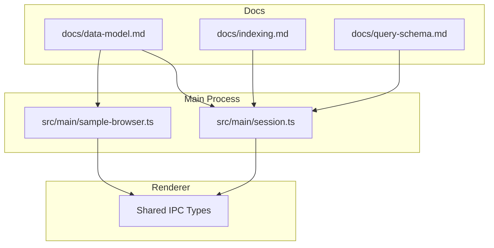
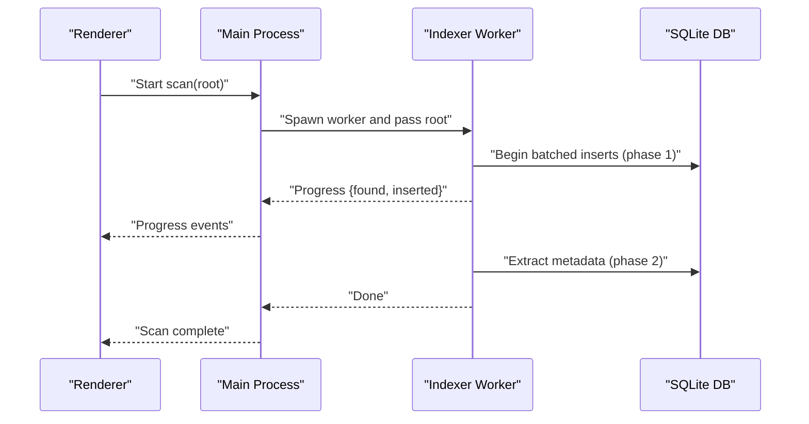
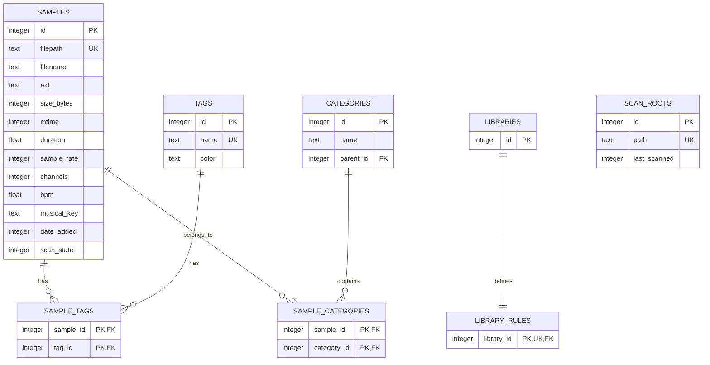
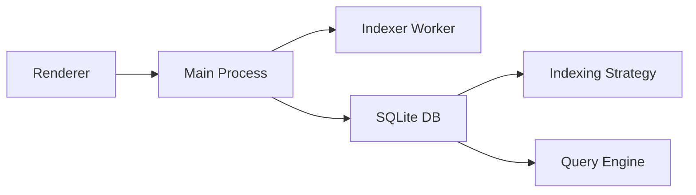

# Data Management

<cite>
**Referenced Files in This Document**
- [data-model.md](file://docs/data-model.md)
- [indexing.md](file://docs/indexing.md)
- [query-schema.md](file://docs/query-schema.md)
- [session.ts](file://src/main/session.ts)
- [sample-browser.ts](file://src/main/sample-browser.ts)
- [package.json](file://package.json)
</cite>

## Table of Contents
1. [Introduction](#introduction)
2. [Project Structure](#project-structure)
3. [Core Components](#core-components)
4. [Architecture Overview](#architecture-overview)
5. [Detailed Component Analysis](#detailed-component-analysis)
6. [Dependency Analysis](#dependency-analysis)
7. [Performance Considerations](#performance-considerations)
8. [Troubleshooting Guide](#troubleshooting-guide)
9. [Conclusion](#conclusion)
10. [Appendices](#appendices)

## Introduction
This document describes MixJam Electron’s data management system with a focus on the SQLite schema, entity relationships, indexing, query compilation, and operational patterns for large-scale audio sample libraries. It explains how the database mirrors file system data, how libraries are modeled as saved queries, and how scanning, change detection, and synchronization are implemented across processes. It also documents performance strategies, validation and integrity rules, and migration approaches.

## Project Structure
The data model and related operational docs are authored under docs/, while the main process integrates file system operations and IPC coordination. The renderer consumes data via IPC channels defined in shared interfaces.

**Diagram sources**
- [data-model.md](file://docs/data-model.md)
- [indexing.md](file://docs/indexing.md)
- [query-schema.md](file://docs/query-schema.md)
- [session.ts](file://src/main/session.ts)
- [sample-browser.ts](file://src/main/sample-browser.ts)

**Section sources**
- [data-model.md](file://docs/data-model.md)
- [indexing.md](file://docs/indexing.md)
- [query-schema.md](file://docs/query-schema.md)
- [session.ts](file://src/main/session.ts)
- [sample-browser.ts](file://src/main/sample-browser.ts)

## Core Components
- Central SQLite database owned by the main process, enabling concurrent reads/writes via WAL mode and foreign keys.
- A master index of samples with minimal duplication and change-detection via mtime/size.
- Saved queries as libraries backed by a versioned rule JSON schema.
- FTS5 virtual table for fuzzy text search synchronized with the samples table.
- Recursive CTEs for category-tree queries including descendants.
- Two-phase scanning: stub insertion followed by metadata extraction, with batched transactions and resumable progress.

**Section sources**
- [data-model.md](file://docs/data-model.md)
- [indexing.md](file://docs/indexing.md)
- [query-schema.md](file://docs/query-schema.md)

## Architecture Overview
The system separates concerns across processes:
- Main process: owns the database, runs the indexing worker, and exposes IPC endpoints.
- Renderer: requests scans, libraries, and filtered views; receives progress and results via IPC.
- Worker thread/utility process: performs filesystem walks and batched inserts/metadata extraction.

**Diagram sources**
- [indexing.md](file://docs/indexing.md)

**Section sources**
- [indexing.md](file://docs/indexing.md)

## Detailed Component Analysis

### Data Model and Schema
The schema defines a compact, denormalized index of files and flexible tagging/category organization. Libraries are persisted as saved queries rather than copies of data.

**Diagram sources**
- [data-model.md](file://docs/data-model.md)

Key schema characteristics:
- Unique filepath ensures de-duplication by absolute path.
- Denormalized filename supports efficient sorting and filtering.
- Foreign keys enabled per connection; cascading deletes preserve referential integrity.
- Scan state distinguishes stubs, extracted metadata, and missing entries.
- FTS5 virtual table keeps searchable text synchronized via triggers.

**Section sources**
- [data-model.md](file://docs/data-model.md)

### Indexes and Query Optimization
Indexes are essential for sub-second filtering and sorting at scale:
- Filename, date_added, bpm, musical_key on samples.
- Tag/category joins indexed by referenced side.
- Category parent_id indexed for tree navigation.

These indexes support:
- Name/path search via FTS5 MATCH subqueries.
- Range filters on numeric fields.
- Category inclusion of descendants via recursive CTE.

**Section sources**
- [data-model.md](file://docs/data-model.md)

### Query Engine and Library Rules
Libraries are saved predicates encoded as versioned JSON. The engine compiles the tree to a single parameterized SQL WHERE clause, preserving performance and preventing in-memory filtering.

Supported leaf kinds:
- Tag: any/all/none combinations.
- Category: any/all/none with optional descendant expansion.
- Numeric ranges: BPM and duration.
- Musical key membership.
- Text search via FTS5.
- Date added: absolute or relative windows.
- File extension membership.

Compilation highlights:
- Groups compile to AND/OR/NOT with proper grouping.
- Tag/category use EXISTS/HAVING patterns.
- Text compiles to FTS5 MATCH subqueries.
- Relative date windows are evaluated at query time.

**Section sources**
- [query-schema.md](file://docs/query-schema.md)
- [data-model.md](file://docs/data-model.md)

### Scanning, Change Detection, and Resumability
Two-phase scanning:
- Phase 1: enumerate and upsert stubs (batched transactions) to make the library usable quickly.
- Phase 2: extract metadata in batches; supports pause/resume and low priority.

Change detection:
- Uses (size_bytes, mtime) as the reliable change key.
- New paths insert stubs; modified paths reset to stub to re-extract metadata while preserving user data.
- Deleted paths are marked missing rather than hard-deleted to retain associations during temporary disconnections.

Resumability:
- Batch boundaries and partial transactions are independent, allowing clean restarts.

**Section sources**
- [indexing.md](file://docs/indexing.md)

### File System Integration and Metadata Extraction
- The sample browser demonstrates lightweight local folder scanning for quick UI feedback, including categorization and metadata tags derived from file stats.
- The indexer worker performs deeper metadata extraction and maintains the canonical database representation.

Operational notes:
- Canonicalization handles platform differences (case normalization on Windows).
- Relative paths are normalized for portability.
- Sorting prioritizes name, then path.

**Section sources**
- [sample-browser.ts](file://src/main/sample-browser.ts)
- [indexing.md](file://docs/indexing.md)

### IPC and Process Synchronization
- The main process coordinates scanning lifecycle and relays progress and completion events to the renderer.
- Renderer-driven library queries compile to SQL and fetch results from the main process.

**Section sources**
- [indexing.md](file://docs/indexing.md)
- [session.ts](file://src/main/session.ts)

## Dependency Analysis
- The main process depends on the database schema and indexing strategy to provide responsive UI queries.
- The renderer depends on IPC contracts to trigger scans and receive filtered results.
- The worker thread is isolated from the UI to avoid blocking, ensuring smooth user experience.

**Diagram sources**
- [indexing.md](file://docs/indexing.md)
- [query-schema.md](file://docs/query-schema.md)

**Section sources**
- [indexing.md](file://docs/indexing.md)
- [query-schema.md](file://docs/query-schema.md)

## Performance Considerations
- Use WAL mode to allow concurrent reads and writes.
- Create and maintain the recommended indexes for frequent filters.
- Prefer parameterized queries and avoid string concatenation.
- Keep library rules validated and compiled at query time to prevent runtime overhead.
- Batch filesystem operations and metadata extraction to minimize UI stalls.
- Use FTS5 external content with triggers to avoid duplicating text.

[No sources needed since this section provides general guidance]

## Troubleshooting Guide
Common issues and mitigations:
- Slow queries: verify indexes exist and are used; confirm query compilation targets appropriate columns.
- Stale or missing metadata: ensure phase 2 extraction runs and completes; check scan_state transitions.
- Duplicate entries: confirm filepath uniqueness and absence of path normalization inconsistencies.
- Broken libraries: validate rule JSON versions and apply migration transforms when upgrading.
- Permission errors: ensure read/write access to scan roots and user folders; handle unreadable files gracefully.

**Section sources**
- [data-model.md](file://docs/data-model.md)
- [indexing.md](file://docs/indexing.md)
- [query-schema.md](file://docs/query-schema.md)

## Conclusion
MixJam Electron’s data model centers on a lean, query-backed library design that avoids duplicating file data. The combination of a robust schema, targeted indexes, FTS5 text search, and a two-phase scanning pipeline enables responsive browsing and powerful filtering at scale. By keeping libraries as saved predicates and maintaining strict integrity constraints, the system remains consistent, extensible, and resilient to interruptions.

[No sources needed since this section summarizes without analyzing specific files]

## Appendices

### A. Database Initialization and Pragmas
- Enable foreign keys per connection.
- Run in WAL mode for concurrent read/write.
- Maintain FTS5 external-content virtual table synchronized via triggers.
- Use PRAGMA user_version for schema migrations.

**Section sources**
- [data-model.md](file://docs/data-model.md)

### B. Migration Strategy
- Forward-only, idempotent steps executed at startup.
- Keep rule_json versioned; migrate at load time and persist upgraded JSON.
- Validate rule JSON before compilation to fail fast at boundaries.

**Section sources**
- [data-model.md](file://docs/data-model.md)
- [query-schema.md](file://docs/query-schema.md)

### C. Example Queries (Conceptual)
- Filter by BPM range and musical key.
- Search by text using FTS5 MATCH.
- Retrieve samples in a category tree including descendants via recursive CTE.
- List recent projects and merge discovered items with registry entries.

**Section sources**
- [data-model.md](file://docs/data-model.md)
- [query-schema.md](file://docs/query-schema.md)
- [session.ts](file://src/main/session.ts)