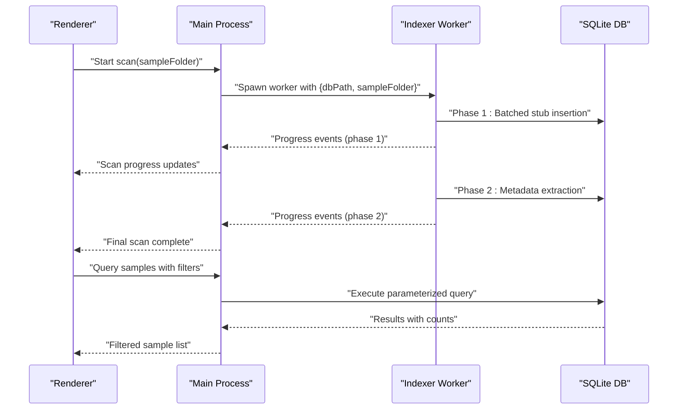
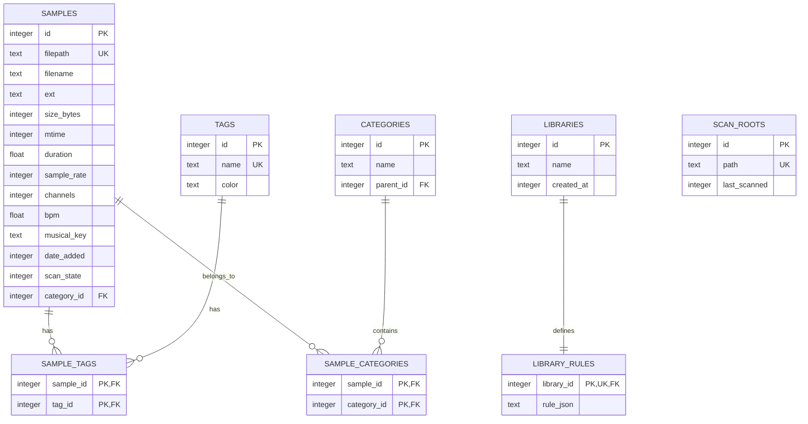
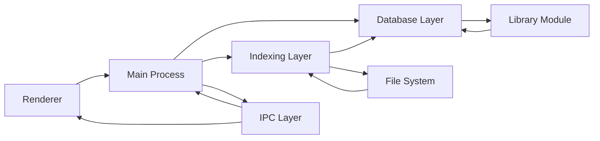

# Data Management

<cite>
**Referenced Files in This Document**
- [data-model.md](file://docs/data-model.md)
- [indexing.md](file://docs/indexing.md)
- [query-schema.md](file://docs/query-schema.md)
- [db.ts](file://src/main/db.ts)
- [library.ts](file://src/main/library.ts)
- [indexer.ts](file://src/main/indexer.ts)
- [indexer-host.ts](file://src/main/indexer-host.ts)
- [session.ts](file://src/main/session.ts)
- [sample-browser.ts](file://src/main/sample-browser.ts)
- [index.ts](file://src/main/index.ts)
- [ipc.ts](file://src/shared/ipc.ts)
- [package.json](file://package.json)
</cite>

## Update Summary
**Changes Made**
- Updated database schema documentation to reflect the actual implementation with category_id column
- Enhanced indexing documentation with detailed two-phase scanning process
- Expanded query engine documentation with comprehensive filtering capabilities
- Added detailed IPC communication patterns between main and renderer processes
- Updated performance considerations with specific optimization strategies
- Enhanced troubleshooting guide with practical debugging techniques

## Table of Contents
1. [Introduction](#introduction)
2. [Project Structure](#project-structure)
3. [Core Components](#core-components)
4. [Architecture Overview](#architecture-overview)
5. [Detailed Component Analysis](#detailed-component-analysis)
6. [Dependency Analysis](#dependency-analysis)
7. [Performance Considerations](#performance-considerations)
8. [Troubleshooting Guide](#troubleshooting-guide)
9. [Conclusion](#conclusion)
10. [Appendices](#appendices)

## Introduction
This document describes MixJam Electron's comprehensive SQLite-based library management system with detailed coverage of the database schema, entity relationships, indexing strategies, advanced querying capabilities, and operational patterns for large-scale audio sample libraries. The system implements a robust two-phase scanning pipeline, sophisticated category management, and efficient IPC communication between processes.

## Project Structure
The data management system is organized around a centralized SQLite database with dedicated modules for database operations, library management, indexing, and IPC communication. The main process coordinates database operations while the renderer consumes data through well-defined IPC channels.

```mermaid
graph TB
subgraph "Database Layer"
DB["src/main/db.ts<br/>Schema Definition & Migration"]
LIB["src/main/library.ts<br/>CRUD Operations & Queries"]
END
subgraph "Indexing Layer"
IDX["src/main/indexer.ts<br/>Worker Thread Implementation"]
HOST["src/main/indexer-host.ts<br/>Process Coordination"]
END
subgraph "Main Process"
MAIN["src/main/index.ts<br/>IPC Handlers & Orchestration"]
SES["src/main/session.ts<br/>Session Management"]
END
subgraph "Renderer"
IPC["src/shared/ipc.ts<br/>Type Definitions"]
SB["src/main/sample-browser.ts<br/>Local Folder Scanner"]
END
DB --> LIB
LIB --> MAIN
IDX --> HOST
HOST --> MAIN
SES --> MAIN
IPC --> MAIN
SB --> MAIN
```

**Diagram sources**
- [db.ts](file://src/main/db.ts)
- [library.ts](file://src/main/library.ts)
- [indexer.ts](file://src/main/indexer.ts)
- [indexer-host.ts](file://src/main/indexer-host.ts)
- [index.ts](file://src/main/index.ts)
- [ipc.ts](file://src/shared/ipc.ts)
- [sample-browser.ts](file://src/main/sample-browser.ts)

**Section sources**
- [db.ts](file://src/main/db.ts)
- [library.ts](file://src/main/library.ts)
- [indexer.ts](file://src/main/indexer.ts)
- [indexer-host.ts](file://src/main/indexer-host.ts)
- [index.ts](file://src/main/index.ts)
- [ipc.ts](file://src/shared/ipc.ts)
- [sample-browser.ts](file://src/main/sample-browser.ts)

## Core Components
The system consists of several interconnected components that work together to provide efficient audio sample library management:

- **Central SQLite Database**: Owned by the main process with WAL mode enabled for concurrent read/write operations
- **Master Index**: Compact, denormalized index of files with minimal duplication and change-detection via mtime/size
- **Category Management**: Hierarchical category system with automatic assignment based on file paths
- **Advanced Query Engine**: Comprehensive filtering system supporting tags, categories, numeric ranges, and text search
- **Two-Phase Scanning**: Fast initial indexing followed by background metadata extraction
- **FTS5 Text Search**: Full-text search capabilities synchronized with database triggers
- **IPC Communication**: Well-defined channels for renderer-main process interaction

**Section sources**
- [db.ts](file://src/main/db.ts)
- [library.ts](file://src/main/library.ts)
- [indexer.ts](file://src/main/indexer.ts)
- [index.ts](file://src/main/index.ts)

## Architecture Overview
The system employs a multi-process architecture with clear separation of concerns:

- **Main Process**: Owns the database, manages IPC handlers, coordinates scanning operations
- **Worker Thread**: Performs filesystem operations and metadata extraction without blocking the UI
- **Renderer Process**: Requests data through IPC channels and displays results
- **Database Layer**: Provides ACID-compliant storage with foreign key constraints and triggers



**Diagram sources**
- [indexer.ts](file://src/main/indexer.ts)
- [indexer-host.ts](file://src/main/indexer-host.ts)
- [index.ts](file://src/main/index.ts)

**Section sources**
- [indexer.ts](file://src/main/indexer.ts)
- [indexer-host.ts](file://src/main/indexer-host.ts)
- [index.ts](file://src/main/index.ts)

## Detailed Component Analysis

### Database Schema and Migration System
The SQLite database implements a comprehensive schema designed for efficient audio sample management with built-in migration support:



**Diagram sources**
- [db.ts](file://src/main/db.ts)

Key schema characteristics:
- **Unique Filepath Constraint**: Prevents duplicate entries by absolute path
- **Category System Enhancement**: Added category_id column in v2 migration for hierarchical organization
- **Foreign Key Constraints**: Enabled per connection with cascading deletes for referential integrity
- **Scan State Management**: Three-state system (0=stub, 1=metadata-extracted, 2=missing) for efficient filtering
- **Migration Support**: Version-gated schema evolution with backward compatibility

**Section sources**
- [db.ts](file://src/main/db.ts)
- [data-model.md](file://docs/data-model.md)

### Advanced Indexing and Query System
The library management system implements sophisticated indexing strategies and query capabilities:

#### Indexing Strategy
- **Primary Indexes**: Filename, date_added, bpm, musical_key for common filtering operations
- **Join Indexes**: Tag and category join tables indexed by referenced side for efficient joins
- **Category Tree Index**: Parent_id indexed for recursive CTE operations
- **FTS5 Virtual Table**: External content synchronized via triggers for fuzzy text search

#### Query Capabilities
The query engine supports comprehensive filtering through parameterized SQL:

- **Text Search**: FTS5 MATCH subqueries with prefix matching
- **Numeric Ranges**: BPM and duration filtering with inclusive bounds
- **Category Filtering**: Single categories or entire subtree queries via recursive CTE
- **Tag Management**: Any/all/none combinations with EXISTS/HAVING patterns
- **Musical Key Membership**: Set-based filtering for key signatures
- **Date Filtering**: Absolute and relative time windows

**Section sources**
- [db.ts](file://src/main/db.ts)
- [library.ts](file://src/main/library.ts)
- [query-schema.md](file://docs/query-schema.md)

### Two-Phase Scanning Pipeline
The system implements an efficient two-phase scanning process to ensure responsive user experience:

#### Phase 1: Fast Stub Creation
- **Batch Processing**: 500-file batches for optimal performance
- **Initial Population**: Creates stub records with basic file information
- **Immediate Usability**: Users can browse and filter by name/path immediately
- **Category Assignment**: Automatic assignment based on folder structure

#### Phase 2: Background Metadata Extraction
- **Selective Processing**: Only processes stub records (scan_state = 0)
- **Header Parsing**: Extracts duration, sample rate, and channel information
- **Incremental Updates**: Can be paused/resumed without data loss
- **Low Priority**: Runs at reduced priority to avoid UI interference

#### Change Detection and Resumption
- **mtime/size Tracking**: Reliable change detection mechanism
- **Incremental Updates**: Preserves user modifications during re-scan
- **Missing File Handling**: Marks deleted files as missing rather than hard-deleting
- **Transaction Isolation**: Independent batch transactions enable clean resumption

**Section sources**
- [indexer.ts](file://src/main/indexer.ts)
- [indexing.md](file://docs/indexing.md)

### IPC Communication and Process Synchronization
The system uses well-defined IPC channels for seamless communication between processes:

#### Main Process IPC Handlers
- **Library Operations**: CRUD operations for tags, categories, and libraries
- **Query Execution**: Parameterized sample queries with pagination
- **Scan Control**: Start, monitor, and coordinate scanning operations
- **Session Management**: User and sample folder configuration persistence

#### Renderer Integration
- **Type Safety**: Strongly typed IPC channels prevent runtime errors
- **Progress Events**: Real-time scanning progress updates
- **Error Handling**: Graceful error propagation with meaningful messages
- **Resource Management**: Proper cleanup on application shutdown

**Section sources**
- [index.ts](file://src/main/index.ts)
- [ipc.ts](file://src/shared/ipc.ts)

### Category Management System
The hierarchical category system provides flexible organization for audio samples:

#### Automatic Category Creation
- **Root Categories**: Derived from sample folder structure (excluding "Unsorted")
- **Subcategory Support**: Nested categories for deep organizational hierarchies
- **Fallback Mechanism**: "Unsorted" category for files outside organized folders
- **Consistency**: Ensures category existence before assignment

#### Path-Based Assignment
- **Relative Path Analysis**: Determines category based on folder structure
- **Hierarchical Mapping**: Creates parent-child relationships automatically
- **Membership Tracking**: Maintains both primary and secondary category memberships
- **Update Safety**: Clears stale memberships during re-scan operations

**Section sources**
- [library.ts](file://src/main/library.ts)
- [indexer.ts](file://src/main/indexer.ts)

## Dependency Analysis
The system exhibits clear dependency relationships that support maintainability and scalability:



**Diagram sources**
- [index.ts](file://src/main/index.ts)
- [db.ts](file://src/main/db.ts)
- [library.ts](file://src/main/library.ts)
- [indexer.ts](file://src/main/indexer.ts)

**Section sources**
- [index.ts](file://src/main/index.ts)
- [db.ts](file://src/main/db.ts)
- [library.ts](file://src/main/library.ts)
- [indexer.ts](file://src/main/indexer.ts)

## Performance Considerations
The system implements several optimization strategies for handling large audio libraries:

### Database Optimizations
- **WAL Mode**: Enables concurrent read/write operations without blocking
- **Targeted Indexes**: Essential indexes for common filtering operations
- **Parameterized Queries**: Prevents SQL injection and query plan caching
- **Batch Transactions**: Reduces transaction overhead for bulk operations

### Memory Management
- **Streaming Results**: Pagination prevents memory bloat for large result sets
- **Lazy Loading**: Metadata extraction deferred until needed
- **Weak References**: Proper cleanup of worker threads and database connections
- **Garbage Collection**: Strategic cleanup during application shutdown

### Network and File System
- **Local File Access**: Direct file system access minimizes network overhead
- **Efficient Walking**: Optimized directory traversal algorithms
- **Concurrent Operations**: Parallel processing reduces overall scan time
- **Resource Limits**: Configurable batch sizes prevent memory exhaustion

## Troubleshooting Guide
Common issues and their solutions:

### Database Issues
- **Slow Queries**: Verify essential indexes exist and are being used effectively
- **Lock Conflicts**: Ensure WAL mode is active and no long-running transactions block updates
- **Migration Failures**: Check schema version and run migration steps in order
- **Connection Problems**: Verify database file permissions and path resolution

### Scanning Problems
- **Incomplete Scans**: Check worker thread health and batch processing logs
- **Missing Files**: Verify file system accessibility and path canonicalization
- **Stuck Progress**: Monitor for long-running transactions or blocked operations
- **Memory Usage**: Adjust batch sizes and monitor worker thread memory consumption

### Query Performance
- **Slow Filters**: Analyze query execution plans and add missing indexes
- **Large Result Sets**: Implement pagination and optimize WHERE clauses
- **Text Search Issues**: Verify FTS5 virtual table synchronization
- **Category Queries**: Check recursive CTE performance with large hierarchies

### IPC Communication
- **Lost Messages**: Verify event listener registration and worker thread lifecycle
- **Serialization Errors**: Check IPC payload types and serialization boundaries
- **Permission Issues**: Ensure proper file system access for sample folder operations
- **Cleanup Problems**: Verify proper worker thread termination and resource release

**Section sources**
- [db.ts](file://src/main/db.ts)
- [library.ts](file://src/main/library.ts)
- [indexer.ts](file://src/main/indexer.ts)
- [indexing.md](file://docs/indexing.md)

## Conclusion
MixJam Electron's SQLite-based library management system provides a robust foundation for audio sample organization with excellent performance characteristics and scalability. The combination of sophisticated indexing, efficient two-phase scanning, comprehensive query capabilities, and well-designed IPC communication creates a responsive and reliable user experience. The system's modular architecture supports future enhancements while maintaining backward compatibility and operational stability.

## Appendices

### A. Database Initialization and Migration
The system implements a structured approach to database initialization and schema evolution:

#### Schema Versioning
- **Version Gating**: Migration steps execute only when schema version requires updates
- **Backward Compatibility**: Previous versions remain functional during upgrades
- **Atomic Operations**: Migration steps are designed to be idempotent and safe

#### Initialization Sequence
1. Database file creation in user data directory
2. Schema version table establishment
3. Initial DDL execution with foreign key enforcement
4. Migration step execution for current version
5. Trigger and index creation for performance optimization

**Section sources**
- [db.ts](file://src/main/db.ts)

### B. Query Engine Implementation Details
The query engine provides comprehensive filtering capabilities through parameterized SQL:

#### Filter Composition
- **Group Logic**: AND/OR/NOT combinations with proper precedence handling
- **Leaf Conditions**: Individual filter types with validation and transformation
- **Parameter Binding**: Safe parameter binding prevents SQL injection
- **Execution Planning**: Efficient query plan generation for complex filter combinations

#### Performance Optimizations
- **Index Utilization**: Strategic use of available indexes for filter acceleration
- **Query Simplification**: Complex filter trees simplified to minimal SQL
- **Pagination Support**: Built-in LIMIT/OFFSET for large result sets
- **Count Optimization**: Separate COUNT queries for efficient pagination

**Section sources**
- [library.ts](file://src/main/library.ts)
- [query-schema.md](file://docs/query-schema.md)

### C. Example Usage Patterns
Practical examples demonstrating common operations:

#### Basic Library Operations
- **Creating Tags**: Idempotent tag creation with color support
- **Category Management**: Hierarchical category organization with automatic assignment
- **Library Creation**: Saved queries with JSON rule definitions
- **Sample Queries**: Filtered browsing with pagination and sorting

#### Advanced Filtering
- **Complex Combinations**: Multi-criteria filters with logical operators
- **Recursive Categories**: Subtree inclusion using recursive CTEs
- **Text Search**: Fuzzy matching with prefix queries
- **Numeric Ranges**: BPM and duration filtering with inclusive bounds

**Section sources**
- [library.ts](file://src/main/library.ts)
- [index.ts](file://src/main/index.ts)