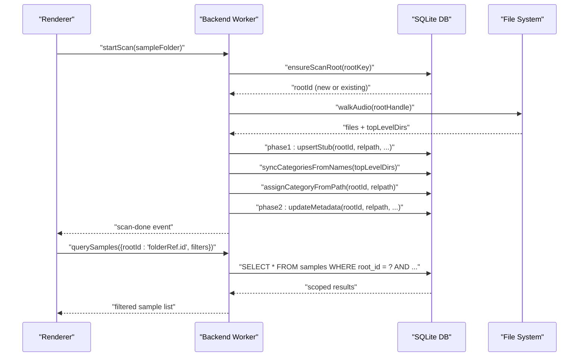
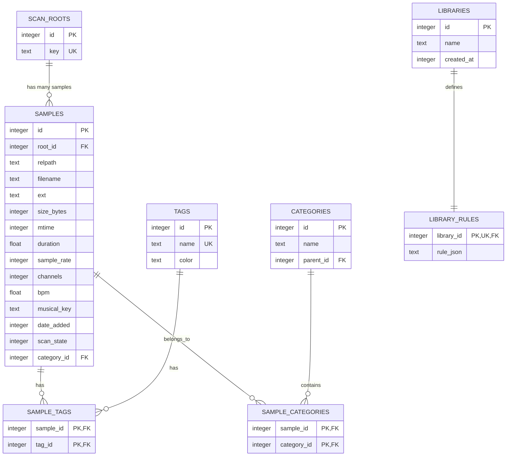
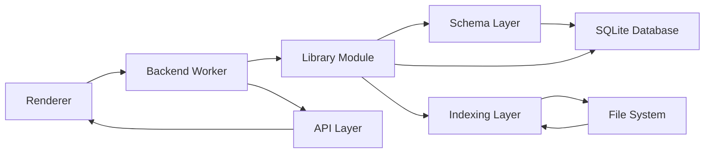

# Data Management

<cite>
**Referenced Files in This Document**
- [schema.ts](file://src/renderer/src/backend/schema.ts)
- [library.ts](file://src/renderer/src/backend/library.ts)
- [indexer.ts](file://src/renderer/src/backend/indexer.ts)
- [worker.ts](file://src/renderer/src/backend/worker.ts)
- [session.ts](file://src/renderer/src/backend/session.ts)
- [backend-api.ts](file://src/shared/backend-api.ts)
- [data-model.md](file://docs/data-model.md)
- [indexing.md](file://docs/indexing.md)
- [query-schema.md](file://docs/query-schema.md)
</cite>

## Update Summary
**Changes Made**
- Updated database schema documentation to reflect the per-root scoping system with scan_roots table and root_id foreign key
- Enhanced migration documentation to cover v3→v4 migration with automatic handling of pre-v4 rows
- Added comprehensive documentation for root-based query scoping across all library operations
- Updated architecture diagrams to show multi-root support and proper data isolation
- Enhanced indexing documentation to cover per-root scanning and category management
- Updated IPC communication patterns to include root-based parameter passing

## Table of Contents
1. [Introduction](#introduction)
2. [Project Structure](#project-structure)
3. [Core Components](#core-components)
4. [Architecture Overview](#architecture-overview)
5. [Detailed Component Analysis](#detailed-component-analysis)
6. [Dependency Analysis](#dependency-analysis)
7. [Performance Considerations](#performance-considerations)
8. [Troubleshooting Guide](#troubleshooting-guide)
9. [Conclusion](#conclusion)
10. [Appendices](#appendices)

## Introduction
This document describes MixJam Electron's comprehensive SQLite-based library management system with detailed coverage of the database schema, entity relationships, indexing strategies, advanced querying capabilities, and operational patterns for large-scale audio sample libraries. The system implements a robust two-phase scanning pipeline, sophisticated category management, efficient IPC communication between processes, and a fundamental per-root scoping architecture that enables multiple independent sample folders within a single database. Recent improvements include centralized audio file extension handling and enhanced database migration support.

## Project Structure
The data management system is organized around a centralized SQLite database with dedicated modules for database operations, library management, indexing, and IPC communication. The backend worker coordinates database operations while the renderer consumes data through well-defined API channels. Audio file extensions are centrally managed for consistent scanning across all components.

```mermaid
graph TB
subgraph "Database Layer"
SCHEMA["src/renderer/src/backend/schema.ts<br/>Schema Definition & Migration"]
LIBRARY["src/renderer/src/backend/library.ts<br/>CRUD Operations & Queries<br/>Root-Based Scoping"]
END
subgraph "Indexing Layer"
INDEXER["src/renderer/src/backend/indexer.ts<br/>Two-Phase Scanner<br/>Per-Root Processing"]
WORKER["src/renderer/src/backend/worker.ts<br/>Worker Thread Coordination"]
END
subgraph "Session Management"
SESSION["src/renderer/src/backend/session.ts<br/>Folder References & State"]
API["src/shared/backend-api.ts<br/>Type Definitions & API Contract"]
END
DB["SQLite Database<br/>OPFS-backed with WAL Mode"]
SCHEMA --> LIBRARY
LIBRARY --> INDEXER
INDEXER --> WORKER
SESSION --> API
WORKER --> DB
LIBRARY --> DB
```

**Diagram sources**
- [schema.ts](file://src/renderer/src/backend/schema.ts)
- [library.ts](file://src/renderer/src/backend/library.ts)
- [indexer.ts](file://src/renderer/src/backend/indexer.ts)
- [worker.ts](file://src/renderer/src/backend/worker.ts)
- [session.ts](file://src/renderer/src/backend/session.ts)
- [backend-api.ts](file://src/shared/backend-api.ts)

**Section sources**
- [schema.ts](file://src/renderer/src/backend/schema.ts)
- [library.ts](file://src/renderer/src/backend/library.ts)
- [indexer.ts](file://src/renderer/src/backend/indexer.ts)
- [worker.ts](file://src/renderer/src/backend/worker.ts)
- [session.ts](file://src/renderer/src/backend/session.ts)
- [backend-api.ts](file://src/shared/backend-api.ts)

## Core Components
The system consists of several interconnected components that work together to provide efficient audio sample library management:

- **Central SQLite Database**: OPFS-backed with WAL mode enabled for concurrent read/write operations
- **Per-Root Scoping System**: Each sample folder gets its own root entry with isolated sample data via root_id foreign key
- **Master Index**: Compact, denormalized index of files with minimal duplication and change-detection via mtime/size
- **Category Management**: Hierarchical category system with automatic assignment based on file paths relative to scan roots
- **Advanced Query Engine**: Comprehensive filtering system supporting tags, categories, numeric ranges, text search, and root-based scoping
- **Two-Phase Scanning**: Fast initial indexing followed by background metadata extraction with per-root processing
- **FTS5 Text Search**: Full-text search capabilities synchronized with database triggers
- **IPC Communication**: Well-defined channels for renderer-backend process interaction
- **Centralized Audio Extensions**: Unified audio file extension handling across all scanning components

**Section sources**
- [schema.ts](file://src/renderer/src/backend/schema.ts)
- [library.ts](file://src/renderer/src/backend/library.ts)
- [indexer.ts](file://src/renderer/src/backend/indexer.ts)
- [worker.ts](file://src/renderer/src/backend/worker.ts)
- [backend-api.ts](file://src/shared/backend-api.ts)

## Architecture Overview
The system employs a multi-process architecture with clear separation of concerns and per-root data isolation:

- **Backend Worker**: Owns the database, manages API calls, coordinates scanning operations, and provides root-scoped queries
- **File System Access**: Uses FileSystemDirectoryHandle for secure, permission-based access to sample folders
- **Renderer Process**: Requests data through typed API channels and displays results with proper root scoping
- **Database Layer**: Provides ACID-compliant storage with foreign key constraints and triggers
- **Session Management**: Persists folder references and application state in localStorage



**Diagram sources**
- [worker.ts](file://src/renderer/src/backend/worker.ts)
- [indexer.ts](file://src/renderer/src/backend/indexer.ts)
- [library.ts](file://src/renderer/src/backend/library.ts)
- [schema.ts](file://src/renderer/src/backend/schema.ts)

**Section sources**
- [worker.ts](file://src/renderer/src/backend/worker.ts)
- [indexer.ts](file://src/renderer/src/backend/indexer.ts)
- [library.ts](file://src/renderer/src/backend/library.ts)
- [schema.ts](file://src/renderer/src/backend/schema.ts)

## Detailed Component Analysis

### Database Schema and Per-Root Scoping System
The SQLite database implements a comprehensive schema designed for efficient audio sample management with built-in per-root scoping and migration support:



**Diagram sources**
- [schema.ts](file://src/renderer/src/backend/schema.ts)

Key schema characteristics:
- **Per-Root Scoping**: Every sample belongs to exactly one scan root via `root_id` foreign key, ensuring complete data isolation between different sample folders
- **Unique Path Constraint**: `UNIQUE(root_id, relpath)` prevents duplicate entries within each root while allowing identical paths across different roots
- **Enhanced Category System**: Category assignments are scoped to individual roots, preventing cross-contamination between folders
- **Foreign Key Constraints**: Enabled per connection with cascading deletes for referential integrity
- **Scan State Management**: Three-state system (0=stub, 1=metadata-extracted, 2=missing) for efficient filtering
- **Migration Support**: Version-gated schema evolution with backward compatibility

**Updated** Enhanced schema documentation to reflect the fundamental per-root scoping architecture with scan_roots table and root_id foreign key relationships.

**Section sources**
- [schema.ts](file://src/renderer/src/backend/schema.ts)
- [data-model.md](file://docs/data-model.md)

### Advanced Indexing and Root-Scoped Query System
The library management system implements sophisticated indexing strategies and query capabilities with comprehensive root-based scoping:

#### Indexing Strategy
- **Primary Indexes**: Filename, date_added, bpm, musical_key for common filtering operations
- **Root Index**: `idx_samples_root ON samples(root_id)` for efficient per-root queries
- **Join Indexes**: Tag and category join tables indexed by referenced side for efficient joins
- **Category Tree Index**: Parent_id indexed for recursive CTE operations
- **FTS5 Virtual Table**: External content synchronized via triggers for fuzzy text search

#### Root-Scoped Query Capabilities
The query engine supports comprehensive filtering through parameterized SQL with automatic root scoping:

- **Text Search**: FTS5 MATCH subqueries with prefix matching, scoped to active root
- **Numeric Ranges**: BPM and duration filtering with inclusive bounds
- **Category Filtering**: Single categories or entire subtree queries via recursive CTE, scoped to root
- **Tag Management**: Any/all/none combinations with EXISTS/HAVING patterns
- **Musical Key Membership**: Set-based filtering for key signatures
- **Date Filtering**: Absolute and relative time windows
- **Root Scoping**: All queries automatically filter by `root_id` when a sample folder reference is provided

#### Root Resolution and Validation
- **scanRootId()**: Resolves FolderRef id to internal root_id, returning undefined for unscanned folders
- **ensureScanRoot()**: Creates new root entries for previously unseen sample folders
- **Automatic Scoping**: All library functions accept optional root parameters for targeted operations

**Section sources**
- [schema.ts](file://src/renderer/src/backend/schema.ts)
- [library.ts](file://src/renderer/src/backend/library.ts)
- [query-schema.md](file://docs/query-schema.md)

### Two-Phase Scanning Pipeline with Per-Root Processing
The system implements an efficient two-phase scanning process with comprehensive per-root data isolation:

#### Phase 1: Fast Stub Creation
- **Batch Processing**: 500-file batches for optimal performance
- **Root Isolation**: All stub creation uses the target root_id, preventing cross-contamination
- **Initial Population**: Creates stub records with basic file information using centralized extension validation
- **Immediate Usability**: Users can browse and filter by name/path immediately within their selected folder
- **Category Assignment**: Automatic assignment based on folder structure relative to the scan root

#### Phase 2: Background Metadata Extraction
- **Selective Processing**: Only processes stub records (scan_state = 0) within the target root
- **Header Parsing**: Extracts duration, sample rate, and channel information
- **Incremental Updates**: Can be paused/resumed without data loss
- **Low Priority**: Runs at reduced priority to avoid UI interference

#### Change Detection and Root-Specific Resumption
- **mtime/size Tracking**: Reliable change detection mechanism per file
- **Incremental Updates**: Preserves user modifications during re-scan within each root
- **Missing File Handling**: Marks deleted files as missing rather than hard-deleting, scoped to specific roots
- **Transaction Isolation**: Independent batch transactions enable clean resumption per root

**Section sources**
- [indexer.ts](file://src/renderer/src/backend/indexer.ts)
- [indexing.md](file://docs/indexing.md)

### IPC Communication and Process Synchronization
The system uses well-defined API channels for seamless communication between processes with enhanced root-based parameter handling:

#### Backend Worker API Handlers
- **Library Operations**: CRUD operations for tags, categories, and libraries
- **Query Execution**: Parameterized sample queries with automatic root scoping
- **Scan Control**: Start, monitor, and coordinate scanning operations per root
- **Session Management**: User and sample folder configuration persistence
- **Database State**: hasSamples() function with root-specific checking

#### Renderer Integration
- **Type Safety**: Strongly typed API channels prevent runtime errors
- **Progress Events**: Real-time scanning progress updates with root context
- **Error Handling**: Graceful error propagation with meaningful messages
- **Resource Management**: Proper cleanup on application shutdown
- **State Management**: Root-aware UI state management

#### Root-Based Function Integration
The hasSamples() function and other operations now support root-specific checking:

- **Lightweight Check**: Simple database query to determine if samples exist in a specific root
- **UI Switching**: Enables transition between empty folder state and indexed browser
- **Conditional Rendering**: Prevents unnecessary heavy queries when specific root is empty
- **Performance Optimization**: Reduces renderer complexity by centralizing state checking per root

**Section sources**
- [worker.ts](file://src/renderer/src/backend/worker.ts)
- [backend-api.ts](file://src/shared/backend-api.ts)
- [library.ts](file://src/renderer/src/backend/library.ts)

### Category Management System with Root Scoping
The hierarchical category system provides flexible organization for audio samples with enhanced automation and root isolation:

#### Automatic Category Creation
- **Root Categories**: Derived from sample folder structure (excluding "Unsorted") per scan root
- **Subcategory Support**: Nested categories for deep organizational hierarchies
- **Fallback Mechanism**: "Unsorted" category for files outside organized folders
- **Consistency**: Ensures category existence before assignment within each root

#### Path-Based Assignment with Root Context
- **Relative Path Analysis**: Determines category based on folder structure relative to scan root
- **Hierarchical Mapping**: Creates parent-child relationships automatically within root scope
- **Membership Tracking**: Maintains both primary and secondary category memberships per sample
- **Update Safety**: Clears stale memberships during re-scan operations within specific roots

**Section sources**
- [library.ts](file://src/renderer/src/backend/library.ts)
- [indexer.ts](file://src/renderer/src/backend/indexer.ts)

### Centralized Audio Extension Management
The AUDIO_EXTENSIONS constant provides unified audio file extension handling across all scanning components:

#### Centralization Benefits
- **Consistency**: All scanning components use the same extension validation logic
- **Maintainability**: Single place to update supported audio formats
- **Performance**: Efficient Set-based lookups for file extension validation
- **Reliability**: Reduced risk of inconsistent extension handling between components

#### Integration Points
- **Indexer Worker**: Uses AUDIO_EXTENSIONS for file validation during scanning
- **Legacy Browser**: Integrates AUDIO_EXTENSIONS for local folder scanning
- **Future Expansion**: Easy to add new audio formats by updating single constant

**Section sources**
- [indexer.ts](file://src/renderer/src/backend/indexer.ts)

## Dependency Analysis
The system exhibits clear dependency relationships that support maintainability and scalability with per-root data isolation:



**Diagram sources**
- [worker.ts](file://src/renderer/src/backend/worker.ts)
- [library.ts](file://src/renderer/src/backend/library.ts)
- [schema.ts](file://src/renderer/src/backend/schema.ts)
- [indexer.ts](file://src/renderer/src/backend/indexer.ts)
- [backend-api.ts](file://src/shared/backend-api.ts)

**Section sources**
- [worker.ts](file://src/renderer/src/backend/worker.ts)
- [library.ts](file://src/renderer/src/backend/library.ts)
- [schema.ts](file://src/renderer/src/backend/schema.ts)
- [indexer.ts](file://src/renderer/src/backend/indexer.ts)
- [backend-api.ts](file://src/shared/backend-api.ts)

## Performance Considerations
The system implements several optimization strategies for handling large audio libraries with per-root data isolation:

### Database Optimizations
- **WAL Mode**: Enables concurrent read/write operations without blocking
- **Targeted Indexes**: Essential indexes including root_id for efficient per-root queries
- **Parameterized Queries**: Prevents SQL injection and query plan caching
- **Batch Transactions**: Reduces transaction overhead for bulk operations
- **Root Scoping**: Eliminates cross-root query overhead through proper filtering

### Memory Management
- **Streaming Results**: Pagination prevents memory bloat for large result sets
- **Lazy Loading**: Metadata extraction deferred until needed
- **Weak References**: Proper cleanup of worker threads and database connections
- **Garbage Collection**: Strategic cleanup during application shutdown

### Network and File System
- **Local File Access**: Direct file system access minimizes network overhead
- **Efficient Walking**: Optimized directory traversal algorithms
- **Concurrent Operations**: Parallel processing reduces overall scan time
- **Resource Limits**: Configurable batch sizes prevent memory exhaustion

### Per-Root Performance Benefits
- **Data Isolation**: Queries only process relevant data for the active root
- **Reduced Scope**: Smaller dataset per operation improves response times
- **Independent Scans**: Multiple roots can be scanned concurrently without interference
- **Efficient Cleanup**: Missing file marking is scoped to specific roots

## Troubleshooting Guide
Common issues and their solutions with enhanced root-based scoping:

### Database Issues
- **Slow Queries**: Verify essential indexes exist including idx_samples_root and are being used effectively
- **Lock Conflicts**: Ensure WAL mode is active and no long-running transactions block updates
- **Migration Failures**: Check schema version and run migration steps in order
- **Connection Problems**: Verify database file permissions and path resolution

### Root Scoping Issues
- **Cross-Root Contamination**: Verify all queries include proper root_id filtering
- **Missing Root Entries**: Check ensureScanRoot() calls before sample operations
- **Permission Issues**: Verify FileSystemDirectoryHandle permissions for target roots
- **Path Resolution**: Ensure relpath values are correctly scoped to their respective roots

### Scanning Problems
- **Incomplete Scans**: Check worker thread health and batch processing logs per root
- **Missing Files**: Verify file system accessibility and path canonicalization within roots
- **Stuck Progress**: Monitor for long-running transactions or blocked operations
- **Memory Usage**: Adjust batch sizes and monitor worker thread memory consumption

### Query Performance
- **Slow Filters**: Analyze query execution plans and add missing indexes
- **Large Result Sets**: Implement pagination and optimize WHERE clauses with root scoping
- **Text Search Issues**: Verify FTS5 virtual table synchronization per root
- **Category Queries**: Check recursive CTE performance with large hierarchies within roots

### IPC Communication
- **Lost Messages**: Verify event listener registration and worker thread lifecycle
- **Serialization Errors**: Check API payload types and serialization boundaries
- **Permission Issues**: Ensure proper file system access for sample folder operations
- **Cleanup Problems**: Verify proper worker thread termination and resource release

## Conclusion
MixJam Electron's SQLite-based library management system provides a robust foundation for audio sample organization with excellent performance characteristics and scalability. The combination of sophisticated per-root scoping, efficient two-phase scanning, comprehensive query capabilities, and well-designed API communication creates a responsive and reliable user experience. The fundamental architectural shift to per-root scoping enables multiple independent sample folders within a single database while maintaining complete data isolation. Recent improvements including centralized audio extension handling and enhanced database migration support further enhance maintainability, consistency, and user experience. The system's modular architecture supports future enhancements while maintaining backward compatibility and operational stability.

## Appendices

### A. Database Initialization and Migration
The system implements a structured approach to database initialization and schema evolution with enhanced per-root scoping support:

#### Schema Versioning
- **Version Gating**: Migration steps execute only when schema version requires updates
- **Backward Compatibility**: Previous versions remain functional during upgrades
- **Atomic Operations**: Migration steps are designed to be idempotent and safe

#### Initialization Sequence
1. Database file creation in OPFS with sqlite-wasm
2. Schema version table establishment
3. Initial DDL execution with foreign key enforcement
4. Migration step execution for current version with per-root scoping support
5. Trigger and index creation for performance optimization
6. Unsorted category initialization for default categorization

**Updated** Enhanced migration documentation to reflect per-root scoping architecture and scan_roots table integration.

**Section sources**
- [schema.ts](file://src/renderer/src/backend/schema.ts)

### B. Query Engine Implementation Details
The query engine provides comprehensive filtering capabilities through parameterized SQL with automatic root scoping:

#### Filter Composition
- **Group Logic**: AND/OR/NOT combinations with proper precedence handling
- **Leaf Conditions**: Individual filter types with validation and transformation
- **Parameter Binding**: Safe parameter binding prevents SQL injection
- **Execution Planning**: Efficient query plan generation for complex filter combinations
- **Root Scoping**: Automatic inclusion of root_id filtering when specified

#### Performance Optimizations
- **Index Utilization**: Strategic use of available indexes including root_id for filter acceleration
- **Query Simplification**: Complex filter trees simplified to minimal SQL
- **Pagination Support**: Built-in LIMIT/OFFSET for large result sets
- **Count Optimization**: Separate COUNT queries for efficient pagination
- **Root Isolation**: Elimination of cross-root query overhead through proper filtering

**Section sources**
- [library.ts](file://src/renderer/src/backend/library.ts)
- [query-schema.md](file://docs/query-schema.md)

### C. Root-Based Sample Querying
The hasSamples() function and related operations provide critical database state information for UI decision-making with root scoping:

#### Function Purpose
- **Database State Check**: Lightweight query to determine if at least one sample exists in a specific root
- **UI State Management**: Enables conditional rendering between empty folder state and indexed browser
- **Performance Optimization**: Reduces unnecessary heavy queries when specific root is empty

#### Implementation Details
- **Simple Query**: SELECT 1 FROM samples WHERE root_id = ? LIMIT 1 for minimal overhead
- **Boolean Return**: Direct conversion of query result to boolean value
- **API Integration**: Available through backend worker for renderer access
- **Error Handling**: Graceful handling of database connection issues

#### Usage Patterns
- **Renderer Integration**: Used in hooks for conditional UI switching based on root population
- **Mount/Unmount Logic**: Called on component mount and after scan completion per root
- **Error Recovery**: Falls back to appropriate UI state when database state cannot be determined

**Section sources**
- [library.ts](file://src/renderer/src/backend/library.ts)
- [worker.ts](file://src/renderer/src/backend/worker.ts)
- [backend-api.ts](file://src/shared/backend-api.ts)

### D. Example Usage Patterns
Practical examples demonstrating common operations with enhanced root-based scoping:

#### Basic Library Operations
- **Creating Tags**: Idempotent tag creation with color support (global across all roots)
- **Category Management**: Hierarchical category organization with automatic assignment per root
- **Library Creation**: Saved queries with JSON rule definitions (global across all roots)
- **Sample Queries**: Filtered browsing with pagination, sorting, and root scoping

#### Advanced Filtering with Root Context
- **Complex Combinations**: Multi-criteria filters with logical operators and root scoping
- **Recursive Categories**: Subtree inclusion using recursive CTEs within root scope
- **Text Search**: Fuzzy matching with prefix queries scoped to specific roots
- **Numeric Ranges**: BPM and duration filtering with inclusive bounds per root

#### Root Management Operations
- **Root Resolution**: Converting FolderRef ids to internal root_ids for database operations
- **Root Creation**: Automatic creation of new root entries for previously unseen folders
- **Root-Scoped Scanning**: Initiating scans that only affect the target root
- **Root-Isolated Queries**: Executing queries that return only samples from the specified root

**Section sources**
- [library.ts](file://src/renderer/src/backend/library.ts)
- [worker.ts](file://src/renderer/src/backend/worker.ts)
- [backend-api.ts](file://src/shared/backend-api.ts)