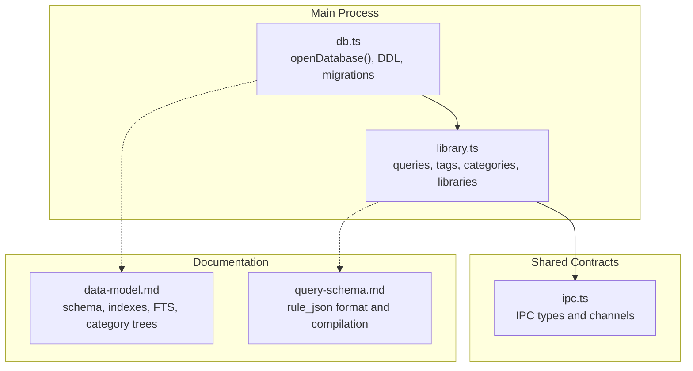
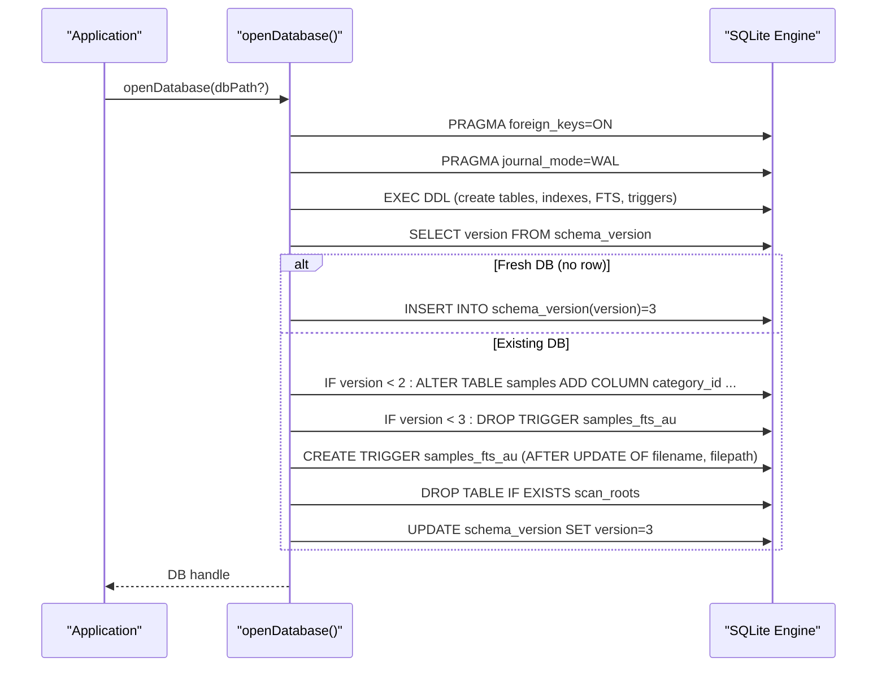
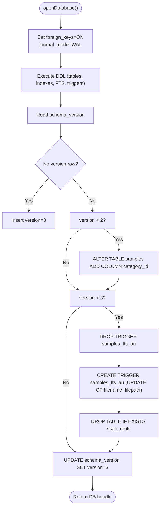
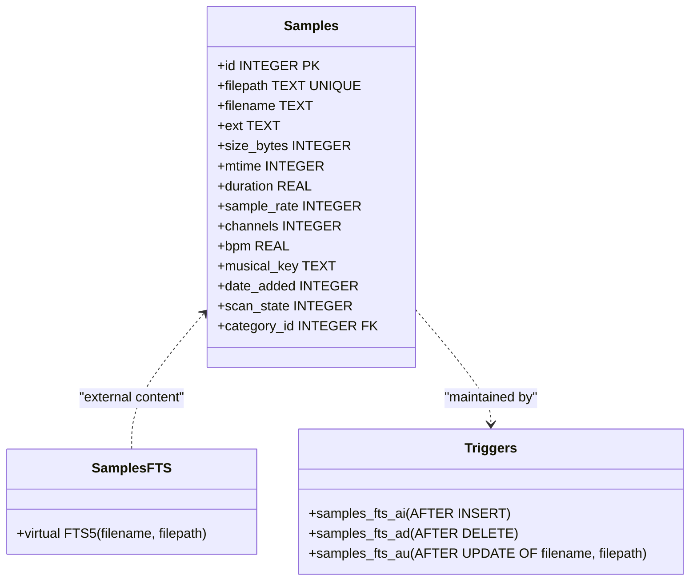
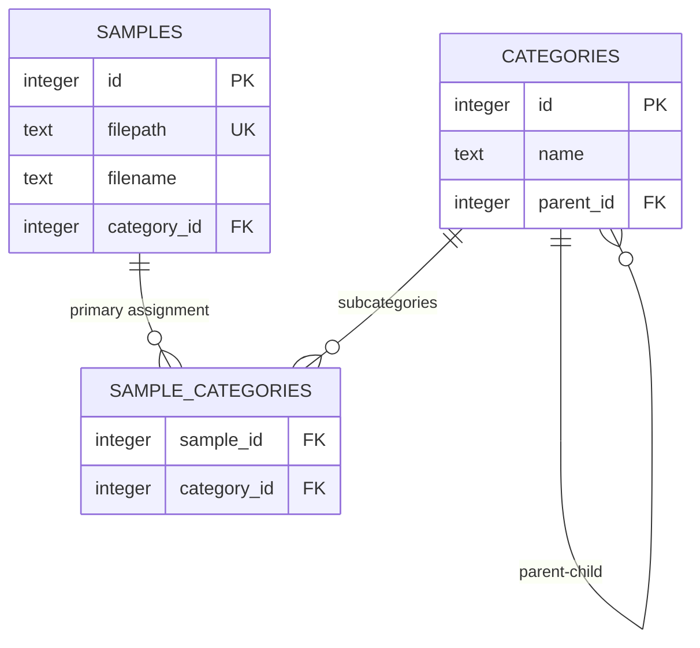
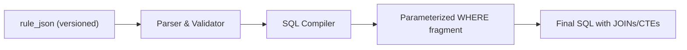
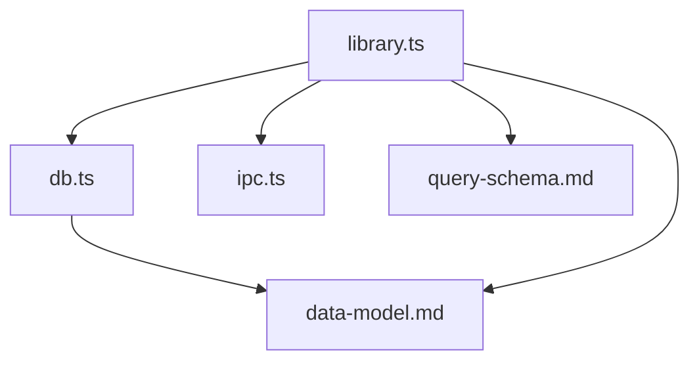

# Database Schema Migration v3

<cite>
**Referenced Files in This Document**
- [db.ts](file://src/main/db.ts)
- [library.ts](file://src/main/library.ts)
- [ipc.ts](file://src/shared/ipc.ts)
- [data-model.md](file://docs/data-model.md)
- [query-schema.md](file://docs/query-schema.md)
- [library.test.ts](file://src/main/library.test.ts)
</cite>

## Table of Contents
1. [Introduction](#introduction)
2. [Project Structure](#project-structure)
3. [Core Components](#core-components)
4. [Architecture Overview](#architecture-overview)
5. [Detailed Component Analysis](#detailed-component-analysis)
6. [Dependency Analysis](#dependency-analysis)
7. [Performance Considerations](#performance-considerations)
8. [Troubleshooting Guide](#troubleshooting-guide)
9. [Conclusion](#conclusion)

## Introduction
This document describes the database schema migration to version 3 for the application’s SQLite-backed library index. It explains what changed, why it changed, and how the migration is applied at startup. The focus is on:
- The current schema and its key tables
- The v2 → v3 migration steps (FTS trigger scoping and cleanup)
- How the migration integrates with database initialization
- Implications for performance and correctness

## Project Structure
The migration logic lives in the main process module that initializes and maintains the SQLite database. Supporting documentation clarifies the data model and query semantics used by the rest of the app.

**Diagram sources**
- [db.ts:104-154](file://src/main/db.ts#L104-L154)
- [library.ts:274-389](file://src/main/library.ts#L274-L389)
- [ipc.ts:1-199](file://src/shared/ipc.ts#L1-L199)
- [data-model.md:1-138](file://docs/data-model.md#L1-L138)
- [query-schema.md:1-129](file://docs/query-schema.md#L1-L129)

**Section sources**
- [db.ts:104-154](file://src/main/db.ts#L104-L154)
- [data-model.md:1-138](file://docs/data-model.md#L1-L138)

## Core Components
- Database initialization and migration entry point: openDatabase()
  - Sets foreign keys and WAL mode
  - Executes the full DDL once
  - Reads schema_version and applies forward-only migrations
- Current schema version constant: SCHEMA_VERSION = 3
- Version-gated migration v2 → v3:
  - Drops the previous unscoped samples_fts_au trigger
  - Recreates a scoped update trigger that only fires when filename or filepath change
  - Drops the unused scan_roots table
- Full-text search via FTS5 virtual table and triggers
- Library queries and helpers that rely on the schema (tags, categories, libraries, sample indexing)

Key responsibilities:
- db.ts: schema definition, migration orchestration, FTS trigger definitions
- library.ts: query building and data access patterns that depend on the schema
- ipc.ts: shared request/response shapes consumed by the renderer and main
- docs: authoritative descriptions of schema, indexes, FTS usage, and query rules

**Section sources**
- [db.ts:1-154](file://src/main/db.ts#L1-L154)
- [library.ts:1-532](file://src/main/library.ts#L1-L532)
- [ipc.ts:1-199](file://src/shared/ipc.ts#L1-L199)
- [data-model.md:1-138](file://docs/data-model.md#L1-L138)

## Architecture Overview
The migration runs during database initialization. The flow ensures idempotency and forward compatibility.

**Diagram sources**
- [db.ts:104-154](file://src/main/db.ts#L104-L154)
- [db.ts:19-102](file://src/main/db.ts#L19-L102)

## Detailed Component Analysis

### Database Initialization and Migration Logic
- openDatabase():
  - Resolves the database file path (user data directory if not provided)
  - Enables foreign keys and WAL mode
  - Executes the complete DDL string to ensure all objects exist
  - Reads schema_version and applies ordered migrations
- SCHEMA_VERSION:
  - Set to 3; drives the final version bump after migrations
- Migrations:
  - v1 → v2: adds category_id to samples (idempotent via try/catch)
  - v2 → v3: replaces the unscoped FTS update trigger with a column-scoped one and drops the unused scan_roots table
- FTS integration:
  - External-content FTS5 table backed by samples
  - Triggers keep the FTS index consistent on insert, delete, and targeted updates

**Diagram sources**
- [db.ts:104-154](file://src/main/db.ts#L104-L154)
- [db.ts:19-102](file://src/main/db.ts#L19-L102)

**Section sources**
- [db.ts:1-154](file://src/main/db.ts#L1-L154)

### Full-Text Search (FTS5) and Trigger Scoping
- FTS table:
  - Uses external content pointing to samples
  - Maintains consistency via AFTER INSERT/DELETE triggers and an AFTER UPDATE trigger
- v3 improvement:
  - The update trigger is now scoped to filename and filepath changes only
  - Avoids unnecessary FTS rewrites on metadata-only updates (e.g., scan_state, BPM, key)
- Querying:
  - Text search compiles to a MATCH against samples_fts with safe quoting and prefix matching

**Diagram sources**
- [db.ts:19-102](file://src/main/db.ts#L19-L102)
- [data-model.md:99-116](file://docs/data-model.md#L99-L116)

**Section sources**
- [db.ts:19-102](file://src/main/db.ts#L19-L102)
- [data-model.md:99-116](file://docs/data-model.md#L99-L116)
- [library.ts:274-389](file://src/main/library.ts#L274-L389)

### Category Tree and Subcategory Filtering
- Categories form a self-referencing tree with a reserved “Unsorted” root
- Primary assignment stored in samples.category_id; additional memberships recorded in sample_categories
- Queries use a recursive CTE to include descendants when filtering by a category node

**Diagram sources**
- [db.ts:24-67](file://src/main/db.ts#L24-L67)
- [data-model.md:42-61](file://docs/data-model.md#L42-L61)

**Section sources**
- [library.ts:260-313](file://src/main/library.ts#L260-L313)
- [data-model.md:118-130](file://docs/data-model.md#L118-L130)

### Libraries and Saved Queries
- Libraries are saved queries (not copies of files), defined by rule_json
- rule_json is versioned and compiled into parameterized SQL WHERE clauses
- The same query engine powers both ad-hoc browser filters and saved libraries

**Diagram sources**
- [query-schema.md:1-129](file://docs/query-schema.md#L1-L129)
- [data-model.md:63-74](file://docs/data-model.md#L63-L74)

**Section sources**
- [query-schema.md:1-129](file://docs/query-schema.md#L1-L129)
- [library.ts:197-225](file://src/main/library.ts#L197-L225)

## Dependency Analysis
- db.ts depends on better-sqlite3 and Node path utilities
- library.ts depends on db.ts for DB operations and on shared ipc.ts for request/response shapes
- Documentation (data-model.md, query-schema.md) defines contracts that guide implementation

**Diagram sources**
- [db.ts:1-154](file://src/main/db.ts#L1-L154)
- [library.ts:1-532](file://src/main/library.ts#L1-L532)
- [ipc.ts:1-199](file://src/shared/ipc.ts#L1-L199)
- [data-model.md:1-138](file://docs/data-model.md#L1-L138)
- [query-schema.md:1-129](file://docs/query-schema.md#L1-L129)

**Section sources**
- [db.ts:1-154](file://src/main/db.ts#L1-L154)
- [library.ts:1-532](file://src/main/library.ts#L1-L532)
- [ipc.ts:1-199](file://src/shared/ipc.ts#L1-L199)
- [data-model.md:1-138](file://docs/data-model.md#L1-L138)
- [query-schema.md:1-129](file://docs/query-schema.md#L1-L129)

## Performance Considerations
- WAL mode enables concurrent reads while the indexer writes
- Column-scoped FTS update trigger reduces write amplification on non-indexed metadata updates
- Indexes on frequently filtered/sorted columns support millisecond-range queries at scale
- Recursive CTEs compute descendant sets efficiently within SQL rather than in JS

[No sources needed since this section provides general guidance]

## Troubleshooting Guide
- If FTS search appears slow or causes excessive writes:
  - Verify the update trigger is scoped to filename/filepath only (v3 behavior)
- If category filtering misses samples:
  - Ensure both primary assignment (category_id) and subcategory memberships (sample_categories) are considered in queries
- If migration fails or does not apply:
  - Confirm schema_version is updated after each migration step
  - Validate that DDL executes without errors on fresh databases

**Section sources**
- [db.ts:139-151](file://src/main/db.ts#L139-L151)
- [library.ts:260-313](file://src/main/library.ts#L260-L313)

## Conclusion
Schema migration v3 improves performance and correctness by scoping the FTS update trigger to only the indexed columns and removing unused artifacts. The migration is integrated into openDatabase(), ensuring idempotent upgrades across existing installations. The surrounding components (library queries, FTS usage, category trees, and saved queries) align with the documented data model and query schema.

[No sources needed since this section summarizes without analyzing specific files]