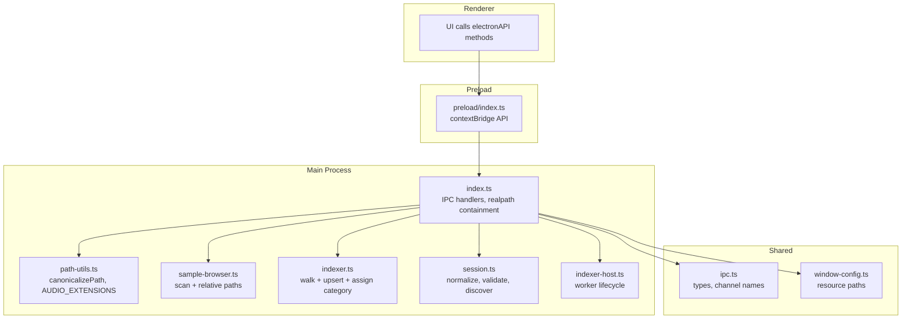
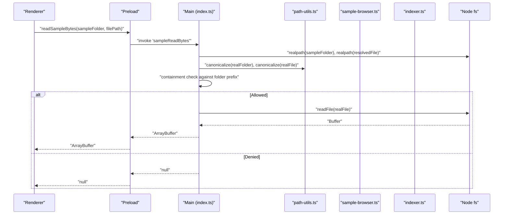
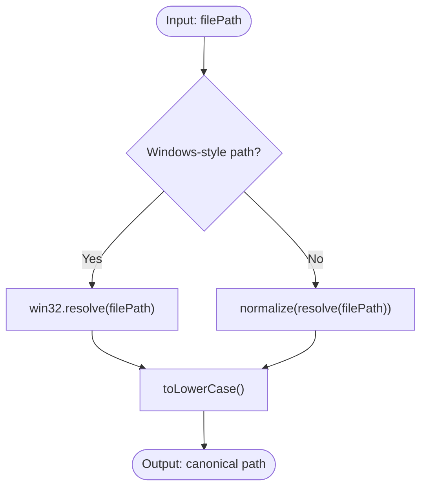
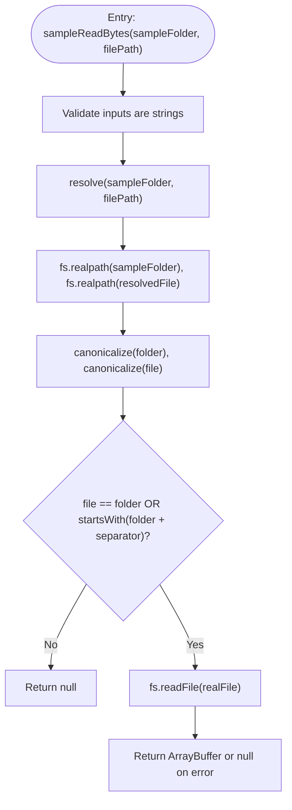
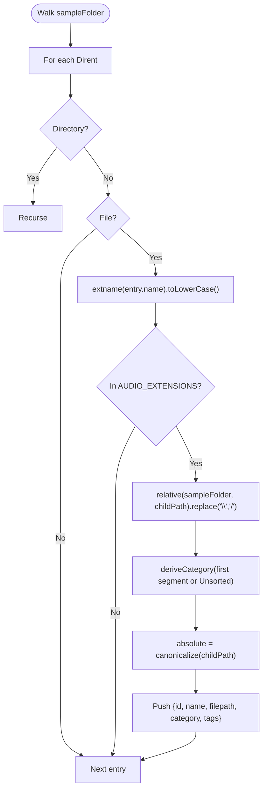
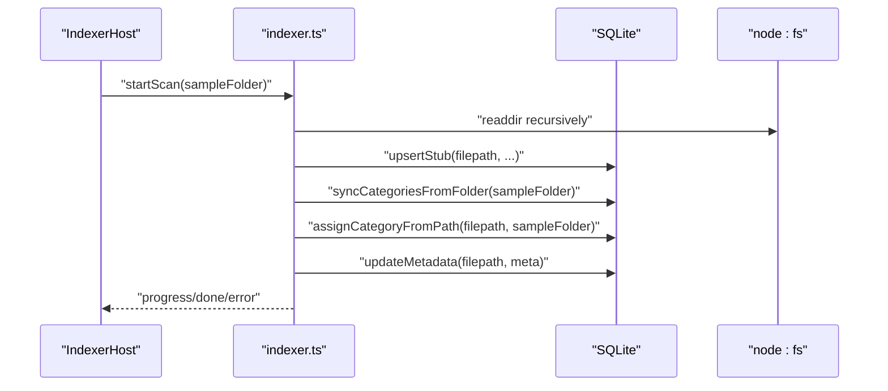
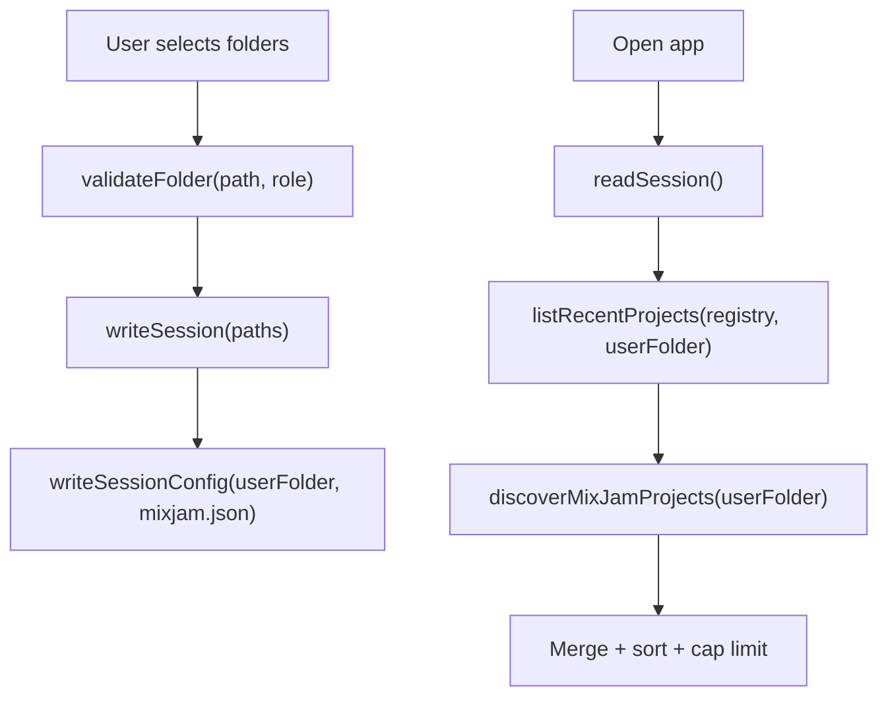
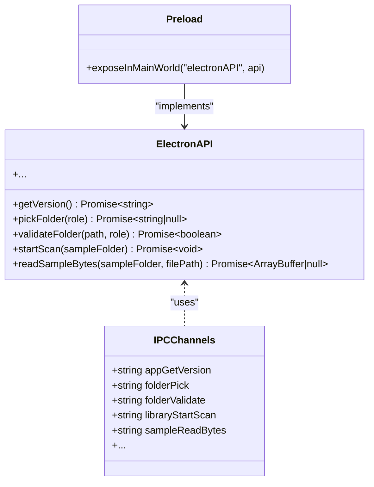
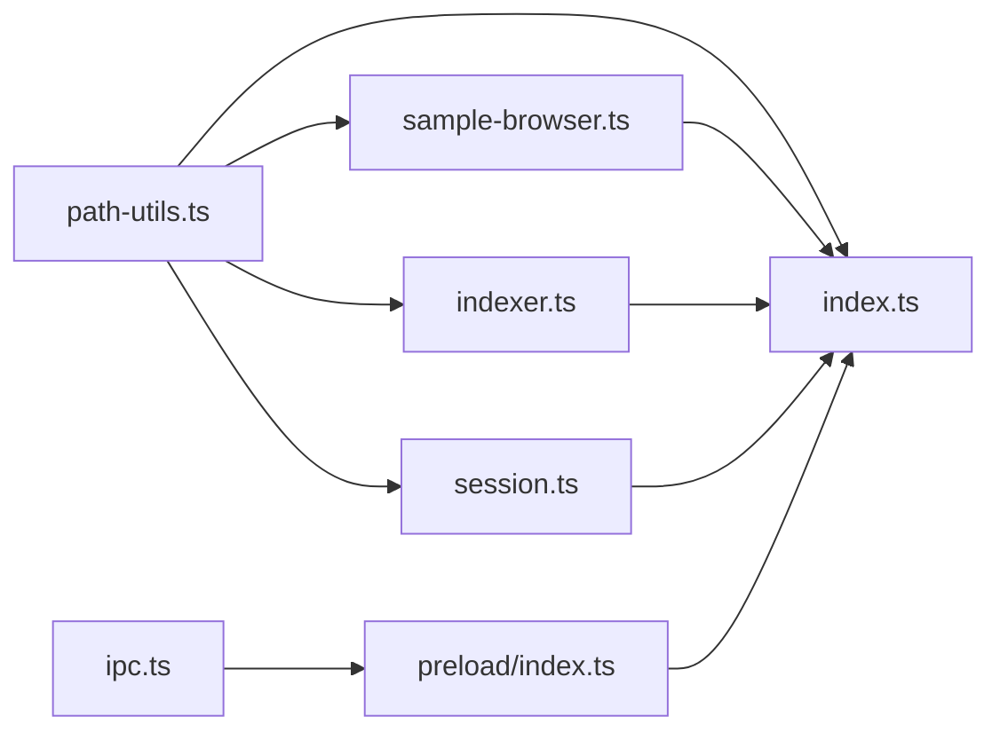

# Path Handling & Cross-Platform Compatibility

<cite>
**Referenced Files in This Document**
- [path-utils.ts](file://src/main/path-utils.ts)
- [path-utils.test.ts](file://src/main/path-utils.test.ts)
- [index.ts](file://src/main/index.ts)
- [sample-browser.ts](file://src/main/sample-browser.ts)
- [session.ts](file://src/main/session.ts)
- [ipc.ts](file://src/shared/ipc.ts)
- [preload/index.ts](file://src/preload/index.ts)
- [window-config.ts](file://src/shared/window-config.ts)
- [indexer.ts](file://src/main/indexer.ts)
- [indexer-host.ts](file://src/main/indexer-host.ts)
</cite>

## Table of Contents
1. Introduction
2. Project Structure
3. Core Components
4. Architecture Overview
5. Detailed Component Analysis
6. Dependency Analysis
7. Performance Considerations
8. Troubleshooting Guide
9. Conclusion

## Introduction
This document explains how the application handles file paths and ensures cross-platform compatibility across Windows, macOS, and Linux. It focuses on path canonicalization, safe resolution, containment checks for sandboxed reads, portable relative paths, and platform-aware display logic. The goal is to provide a clear mental model of where and how paths are normalized, validated, and used throughout the Electron main process, preload bridge, and shared types.

## Project Structure
The path-handling surface area spans:
- Main-process utilities for canonicalization and extension filtering
- IPC channels that carry paths between renderer and main
- Preload bridge exposing typed APIs to the renderer
- Session and recent projects management with path normalization
- Sample browser (legacy scan) and indexer (indexed DB) using consistent path rules
- Window configuration for resource paths

**Diagram sources**
- [path-utils.ts:1-19](file://src/main/path-utils.ts#L1-L19)
- [sample-browser.ts:1-99](file://src/main/sample-browser.ts#L1-L99)
- [indexer.ts:1-190](file://src/main/indexer.ts#L1-L190)
- [session.ts:1-303](file://src/main/session.ts#L1-L303)
- [index.ts:1-362](file://src/main/index.ts#L1-L362)
- [indexer-host.ts:1-104](file://src/main/indexer-host.ts#L1-L104)
- [ipc.ts:1-199](file://src/shared/ipc.ts#L1-L199)
- [window-config.ts:1-54](file://src/shared/window-config.ts#L1-L54)
- [preload/index.ts:1-60](file://src/preload/index.ts#L1-L60)

**Section sources**
- [path-utils.ts:1-19](file://src/main/path-utils.ts#L1-L19)
- [ipc.ts:1-199](file://src/shared/ipc.ts#L1-L199)
- [preload/index.ts:1-60](file://src/preload/index.ts#L1-L60)
- [window-config.ts:1-54](file://src/shared/window-config.ts#L1-L54)

## Core Components
- Path canonicalization and extension set:
  - Centralized function to normalize and lowercase paths consistently across platforms.
  - Shared audio extension list used by both legacy scanner and indexer.
- Safe sample read endpoint:
  - Resolves requested files against the active sample folder, resolves realpaths, and enforces containment before reading bytes.
- Portable relative paths:
  - Legacy browser computes relative paths from the sample folder and normalizes separators to forward slashes for stable IDs and categories.
- Session and recent projects:
  - Normalizes stored paths, validates folders, and discovers project files using canonical keys to deduplicate entries.
- Indexer:
  - Walks directories, uses shared extensions, and assigns categories based on folder structure; metadata extraction runs in a worker thread.
- IPC and preload:
  - Strongly typed channel names and request/response shapes ensure consistent path handling across processes.

**Section sources**
- [path-utils.ts:1-19](file://src/main/path-utils.ts#L1-L19)
- [index.ts:322-361](file://src/main/index.ts#L322-L361)
- [sample-browser.ts:1-99](file://src/main/sample-browser.ts#L1-L99)
- [session.ts:1-303](file://src/main/session.ts#L1-L303)
- [indexer.ts:1-190](file://src/main/indexer.ts#L1-L190)
- [ipc.ts:1-199](file://src/shared/ipc.ts#L1-L199)
- [preload/index.ts:1-60](file://src/preload/index.ts#L1-L60)

## Architecture Overview
The path pipeline flows from user actions in the renderer through a typed preload bridge into main-process handlers. Paths are validated, resolved, and canonicalized early, then propagated consistently to scanning, indexing, and storage layers.

**Diagram sources**
- [index.ts:322-361](file://src/main/index.ts#L322-L361)
- [path-utils.ts:1-19](file://src/main/path-utils.ts#L1-L19)
- [preload/index.ts:44-45](file://src/preload/index.ts#L44-L45)

## Detailed Component Analysis

### Path Canonicalization and Extension Filtering
- Purpose: Provide a single source of truth for path normalization and recognized audio formats.
- Behavior:
  - Detects Windows-style absolute paths and applies win32-specific resolution; otherwise uses POSIX normalization.
  - Lowercases results to ensure case-insensitive equality across platforms.
  - Exposes a shared set of supported audio extensions.
- Usage points:
  - Sample browser cache keying and item ID generation.
  - Recent projects deduplication and discovery.
  - Containment checks for sample reads.

**Diagram sources**
- [path-utils.ts:8-18](file://src/main/path-utils.ts#L8-L18)

**Section sources**
- [path-utils.ts:1-19](file://src/main/path-utils.ts#L1-L19)
- [path-utils.test.ts:1-10](file://src/main/path-utils.test.ts#L1-L10)

### Safe Sample Read Endpoint (Containment Enforcement)
- Purpose: Allow the renderer to read raw sample bytes without granting arbitrary filesystem access.
- Flow:
  - Resolve the requested file against the active sample folder.
  - Resolve both folder and file to their real paths to defeat symlinks/junctions.
  - Canonicalize both and enforce that the file path starts with the folder prefix (handling both backslash and slash variants).
  - Read only if contained; otherwise return null.
- Security considerations:
  - Prevents directory traversal via ".." segments.
  - Neutralizes symlink-based escapes by realpath'ing inputs.

**Diagram sources**
- [index.ts:322-361](file://src/main/index.ts#L322-L361)
- [path-utils.ts:12-18](file://src/main/path-utils.ts#L12-L18)

**Section sources**
- [index.ts:322-361](file://src/main/index.ts#L322-L361)

### Legacy Sample Browser (Portable Relative Paths)
- Purpose: Provide a cold-start fallback listing of samples without an indexed database.
- Key behaviors:
  - Computes a portable relative path from the sample folder and replaces backslashes with forward slashes.
  - Derives category labels from the first relative segment; root-level files map to a reserved label.
  - Uses canonicalized absolute paths as stable identifiers for caching and sorting.
- Consistency:
  - Shares the same audio extension filter as the indexer.

**Diagram sources**
- [sample-browser.ts:9-17](file://src/main/sample-browser.ts#L9-L17)
- [sample-browser.ts:26-72](file://src/main/sample-browser.ts#L26-L72)
- [path-utils.ts:1-6](file://src/main/path-utils.ts#L1-L6)

**Section sources**
- [sample-browser.ts:1-99](file://src/main/sample-browser.ts#L1-L99)
- [path-utils.ts:1-6](file://src/main/path-utils.ts#L1-L6)

### Indexed Library Scanner (Worker Thread)
- Purpose: Efficiently index audio files and persist metadata to SQLite.
- Path-related behavior:
  - Walks directories and filters by shared audio extensions.
  - Upserts stub rows keyed by absolute file paths.
  - Assigns categories based on folder structure relative to the sample folder.
- Concurrency:
  - Phase 1 batches writes; phase 2 parses metadata concurrently while keeping DB writes serialized.

**Diagram sources**
- [indexer-host.ts:24-91](file://src/main/indexer-host.ts#L24-L91)
- [indexer.ts:56-115](file://src/main/indexer.ts#L56-L115)
- [indexer.ts:123-161](file://src/main/indexer.ts#L123-L161)

**Section sources**
- [indexer.ts:1-190](file://src/main/indexer.ts#L1-L190)
- [indexer-host.ts:1-104](file://src/main/indexer-host.ts#L1-L104)

### Session Management and Recent Projects
- Purpose: Persist user and sample folder selections and maintain a curated list of recent projects.
- Path-related behavior:
  - Validates folder roles (user vs sample) and writeability for user folders.
  - Normalizes session values and recent project entries using canonical paths for deduplication.
  - Discovers .mixjam project files under the user folder and merges with registry entries.
  - Displays project names using platform-appropriate basename/extname helpers.

**Diagram sources**
- [session.ts:53-58](file://src/main/session.ts#L53-L58)
- [session.ts:76-78](file://src/main/session.ts#L76-L78)
- [session.ts:228-252](file://src/main/session.ts#L228-L252)
- [session.ts:279-302](file://src/main/session.ts#L279-L302)

**Section sources**
- [session.ts:1-303](file://src/main/session.ts#L1-L303)

### IPC Channels and Preload Bridge
- Purpose: Define strongly-typed channel names and expose a safe API surface to the renderer.
- Path-related aspects:
  - Channels for folder pick/validate, library scanning, and sample byte reads.
  - Preload maps these channels to ipcRenderer.invoke/on calls and exposes them as a single object.

**Diagram sources**
- [ipc.ts:4-34](file://src/shared/ipc.ts#L4-L34)
- [ipc.ts:156-199](file://src/shared/ipc.ts#L156-L199)
- [preload/index.ts:4-56](file://src/preload/index.ts#L4-L56)

**Section sources**
- [ipc.ts:1-199](file://src/shared/ipc.ts#L1-L199)
- [preload/index.ts:1-60](file://src/preload/index.ts#L1-L60)

### Resource Paths and Window Configuration
- Purpose: Build cross-platform paths for app icon and preload script.
- Behavior:
  - Uses join with __dirname to locate resources relative to the built main bundle.
  - Configures window preferences securely (contextIsolation, no nodeIntegration, sandbox).

**Section sources**
- [window-config.ts:14-36](file://src/shared/window-config.ts#L14-L36)

## Dependency Analysis
Key relationships relevant to path handling:
- path-utils.ts is consumed by:
  - sample-browser.ts (cache keying, IDs)
  - session.ts (recent projects normalization)
  - index.ts (containment checks)
- sample-browser.ts depends on path-utils.ts and shares AUDIO_EXTENSIONS with indexer.ts.
- indexer.ts depends on path-utils.ts for extension filtering and uses library.ts for category assignment.
- index.ts orchestrates IPC and delegates to sample-browser.ts, indexer-host.ts, and session.ts.
- preload/index.ts depends on shared ipc.ts types and channels.

**Diagram sources**
- [path-utils.ts:1-19](file://src/main/path-utils.ts#L1-L19)
- [sample-browser.ts:1-99](file://src/main/sample-browser.ts#L1-L99)
- [indexer.ts:1-190](file://src/main/indexer.ts#L1-L190)
- [session.ts:1-303](file://src/main/session.ts#L1-L303)
- [index.ts:1-362](file://src/main/index.ts#L1-L362)
- [ipc.ts:1-199](file://src/shared/ipc.ts#L1-L199)
- [preload/index.ts:1-60](file://src/preload/index.ts#L1-L60)

**Section sources**
- [path-utils.ts:1-19](file://src/main/path-utils.ts#L1-L19)
- [sample-browser.ts:1-99](file://src/main/sample-browser.ts#L1-L99)
- [indexer.ts:1-190](file://src/main/indexer.ts#L1-L190)
- [session.ts:1-303](file://src/main/session.ts#L1-L303)
- [index.ts:1-362](file://src/main/index.ts#L1-L362)
- [ipc.ts:1-199](file://src/shared/ipc.ts#L1-L199)
- [preload/index.ts:1-60](file://src/preload/index.ts#L1-L60)

## Performance Considerations
- Canonicalization cost:
  - canonicalizePath performs minimal work but is called frequently during scans and UI operations; consider memoization at call sites if hot paths emerge.
- Realpath and containment checks:
  - realpath calls add overhead; they are necessary for security and are invoked only when reading sample bytes.
- Scanning concurrency:
  - Indexer phase 2 uses limited concurrency for metadata parsing to balance CPU and disk throughput.
- Batched DB writes:
  - Both legacy and indexed pipelines batch writes to reduce WAL commits and improve throughput.

[No sources needed since this section provides general guidance]

## Troubleshooting Guide
Common issues and remedies:
- Paths not matching after rescan:
  - Ensure all path comparisons use canonicalized forms. Verify that cache keys and IDs derive from canonicalized absolute paths.
- Sample read returns null unexpectedly:
  - Confirm the requested file resides within the active sample folder. Check that realpath resolution succeeds and that containment checks pass with both backslash and slash prefixes.
- Category misassignment:
  - Verify syncCategoriesFromFolder ran before assignCategoryFromPath and that the first relative segment matches an existing root category.
- Recent projects missing or duplicated:
  - Ensure normalization and deduplication rely on canonicalized paths. Confirm file existence checks succeed before merging.

**Section sources**
- [index.ts:322-361](file://src/main/index.ts#L322-L361)
- [sample-browser.ts:84-99](file://src/main/sample-browser.ts#L84-L99)
- [indexer.ts:95-115](file://src/main/indexer.ts#L95-L115)
- [session.ts:117-150](file://src/main/session.ts#L117-L150)

## Conclusion
The application achieves robust cross-platform path handling by centralizing canonicalization, enforcing strict containment for sensitive reads, and using portable relative paths for stable identifiers and categorization. Shared extension lists and consistent normalization across legacy and indexed pipelines prevent drift and ensure predictable behavior on Windows, macOS, and Linux.