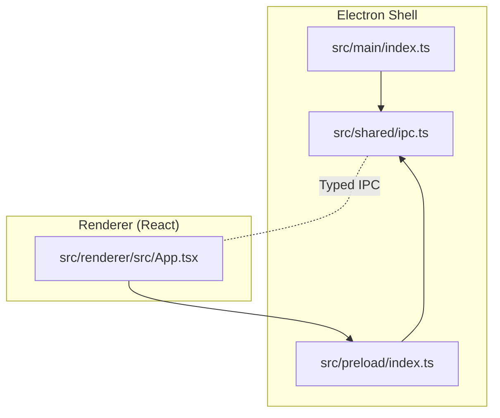
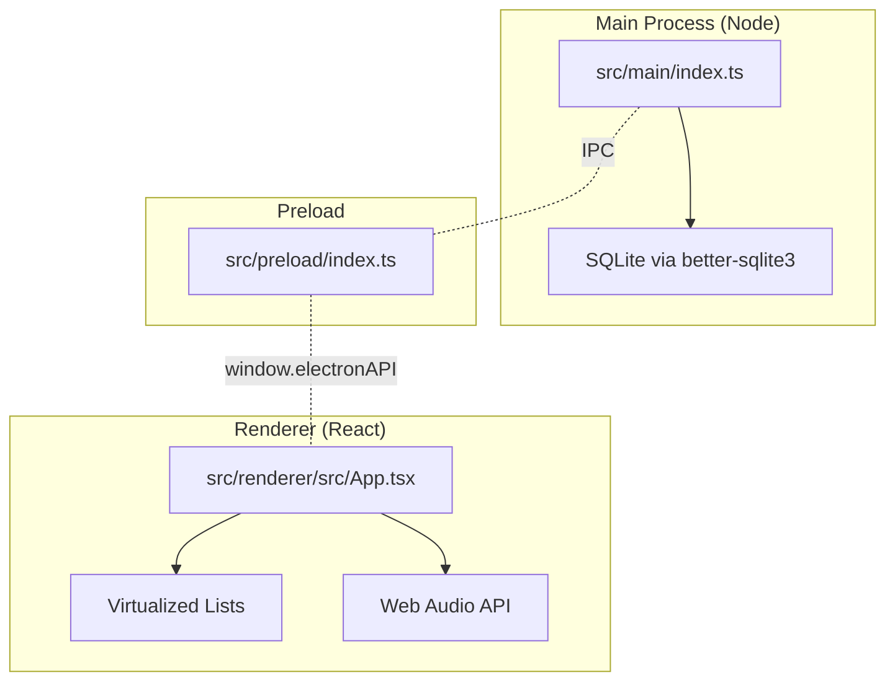
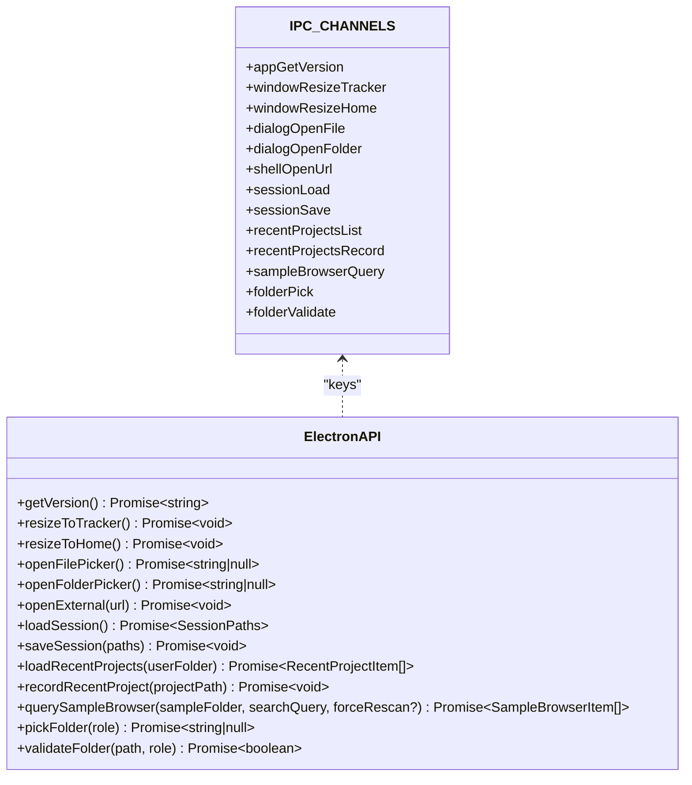
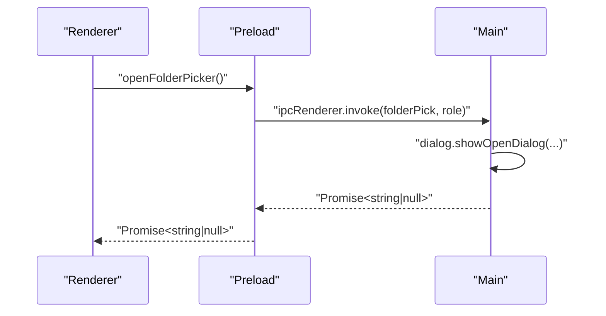
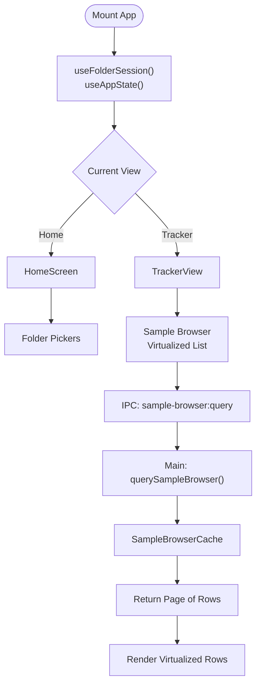
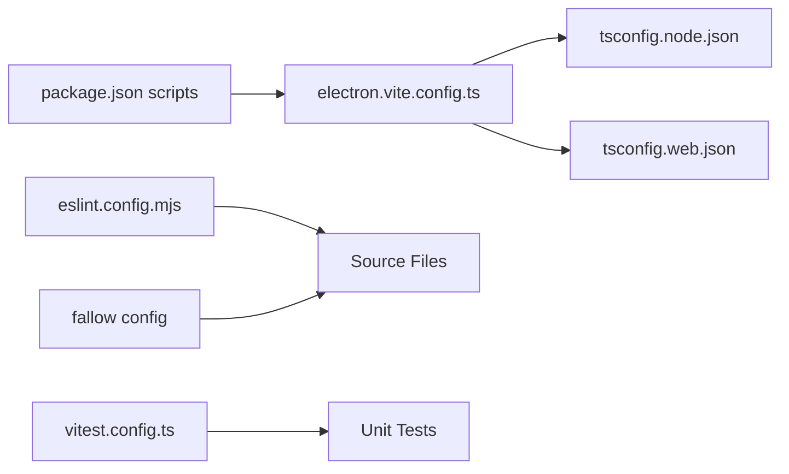

# Development Guidelines

<cite>
**Referenced Files in This Document**
- [package.json](file://package.json)
- [eslint.config.mjs](file://eslint.config.mjs)
- [tsconfig.json](file://tsconfig.json)
- [tsconfig.node.json](file://tsconfig.node.json)
- [tsconfig.web.json](file://tsconfig.web.json)
- [electron.vite.config.ts](file://electron.vite.config.ts)
- [vitest.config.ts](file://vitest.config.ts)
- [.fallowrc.json](file://.fallowrc.json)
- [docs/architecture.md](file://docs/architecture.md)
- [docs/decisions.md](file://docs/decisions.md)
- [src/main/index.ts](file://src/main/index.ts)
- [src/preload/index.ts](file://src/preload/index.ts)
- [src/renderer/src/App.tsx](file://src/renderer/src/App.tsx)
- [src/shared/ipc.ts](file://src/shared/ipc.ts)
</cite>

## Table of Contents
1. [Introduction](#introduction)
2. [Project Structure](#project-structure)
3. [Core Components](#core-components)
4. [Architecture Overview](#architecture-overview)
5. [Detailed Component Analysis](#detailed-component-analysis)
6. [Dependency Analysis](#dependency-analysis)
7. [Performance Considerations](#performance-considerations)
8. [Security Best Practices](#security-best-practices)
9. [Testing Requirements](#testing-requirements)
10. [Code Style Standards](#code-style-standards)
11. [Development Workflow and Branching](#development-workflow-and-branching)
12. [Contribution Guidelines](#contribution-guidelines)
13. [Code Review Criteria](#code-review-criteria)
14. [Debugging and Troubleshooting](#debugging-and-troubleshooting)
15. [Technical Debt Management](#technical-debt-management)
16. [Extensibility and Maintenance](#extensibility-and-maintenance)
17. [Conclusion](#conclusion)

## Introduction
This document provides comprehensive development guidelines for contributors and maintainers working on the MixJam Electron project. It consolidates code style standards, TypeScript configuration, ESLint rules, architectural decisions, design patterns, development workflow, performance and security practices, testing requirements, and maintenance strategies. The goal is to ensure consistent, reliable, and scalable contributions while preserving the project’s Electron + React architecture and performance characteristics.

## Project Structure
The project follows a layered Electron architecture with separated concerns for main, preload, and renderer processes, plus shared interfaces and configuration files. Key directories and roles:
- src/main: Electron main process (Node.js), IPC handlers, dialogs, and session management
- src/preload: Preload script exposing a typed API surface via contextBridge
- src/renderer: React application, components, hooks, theme system, and test harness
- src/shared: Shared IPC channel constants and TypeScript interfaces
- docs: Architectural and decision logs
- Configuration roots: package.json, tsconfig.json, eslint.config.mjs, electron.vite.config.ts, vitest.config.ts, .fallowrc.json

**Diagram sources**
- [src/main/index.ts:1-170](file://src/main/index.ts#L1-L170)
- [src/preload/index.ts:1-29](file://src/preload/index.ts#L1-L29)
- [src/renderer/src/App.tsx:1-108](file://src/renderer/src/App.tsx#L1-L108)
- [src/shared/ipc.ts:1-59](file://src/shared/ipc.ts#L1-L59)

**Section sources**
- [package.json:1-50](file://package.json#L1-L50)
- [tsconfig.json:1-8](file://tsconfig.json#L1-L8)
- [electron.vite.config.ts:1-15](file://electron.vite.config.ts#L1-L15)
- [docs/architecture.md:1-76](file://docs/architecture.md#L1-L76)

## Core Components
- Main process: Initializes the BrowserWindow, sets up IPC channels, handles dialogs, session persistence, and safe external URL opening
- Preload: Exposes a strongly-typed ElectronAPI via contextBridge to the renderer
- Renderer: React application orchestrating views, state hooks, and theme selection
- Shared IPC: Centralized channel names and TypeScript contracts for IPC communication

Key responsibilities and boundaries:
- Main process owns database access and file system operations; renderer requests data over IPC
- Renderer remains sandboxed with contextIsolation enabled and a narrow API surface
- IPC channels are typed and centralized to prevent drift and improve maintainability

**Section sources**
- [src/main/index.ts:1-170](file://src/main/index.ts#L1-L170)
- [src/preload/index.ts:1-29](file://src/preload/index.ts#L1-L29)
- [src/renderer/src/App.tsx:1-108](file://src/renderer/src/App.tsx#L1-L108)
- [src/shared/ipc.ts:1-59](file://src/shared/ipc.ts#L1-L59)

## Architecture Overview
The system adheres to a strict process model:
- Main (Node): database, IPC handlers, dialogs, and background tasks
- Preload: typed bridge to renderer
- Renderer (React): UI, virtualized lists, tracker/player, and theme system

**Diagram sources**
- [docs/architecture.md:29-61](file://docs/architecture.md#L29-L61)
- [src/main/index.ts:1-170](file://src/main/index.ts#L1-L170)
- [src/preload/index.ts:1-29](file://src/preload/index.ts#L1-L29)
- [src/renderer/src/App.tsx:1-108](file://src/renderer/src/App.tsx#L1-L108)

**Section sources**
- [docs/architecture.md:1-76](file://docs/architecture.md#L1-L76)

## Detailed Component Analysis

### IPC Channel Contracts and Typed API
The IPC layer defines a canonical set of channels and a strongly-typed ElectronAPI exposed to the renderer. This ensures compile-time safety and reduces runtime errors.

**Diagram sources**
- [src/shared/ipc.ts:1-59](file://src/shared/ipc.ts#L1-L59)

**Section sources**
- [src/shared/ipc.ts:1-59](file://src/shared/ipc.ts#L1-L59)

### Main Process IPC Handlers
The main process registers IPC handlers for:
- Application lifecycle and window resizing
- Dialogs for file and folder selection
- Session persistence and recent projects
- Sample browser queries with caching
- Safe external URL opening with host allowlist

**Diagram sources**
- [src/preload/index.ts:1-29](file://src/preload/index.ts#L1-L29)
- [src/main/index.ts:96-102](file://src/main/index.ts#L96-L102)

**Section sources**
- [src/main/index.ts:75-170](file://src/main/index.ts#L75-L170)
- [src/preload/index.ts:1-29](file://src/preload/index.ts#L1-L29)

### Renderer App Orchestration
The renderer composes views and state hooks, delegates native interactions through the typed ElectronAPI, and applies theme selection.

**Diagram sources**
- [src/renderer/src/App.tsx:1-108](file://src/renderer/src/App.tsx#L1-L108)
- [src/main/index.ts:129-138](file://src/main/index.ts#L129-L138)

**Section sources**
- [src/renderer/src/App.tsx:1-108](file://src/renderer/src/App.tsx#L1-L108)

## Dependency Analysis
The project uses a monorepo-like TypeScript setup with composite configs for main/preload and renderer, and Vite/Electron-Vite for builds. ESLint enforces environment-specific rules, Vitest configures unit tests and coverage, and Fallow detects dead code and unused exports.

**Diagram sources**
- [package.json:6-16](file://package.json#L6-L16)
- [electron.vite.config.ts:1-15](file://electron.vite.config.ts#L1-L15)
- [tsconfig.node.json:1-14](file://tsconfig.node.json#L1-L14)
- [tsconfig.web.json:1-16](file://tsconfig.web.json#L1-L16)
- [eslint.config.mjs:1-26](file://eslint.config.mjs#L1-L26)
- [vitest.config.ts:1-29](file://vitest.config.ts#L1-L29)
- [.fallowrc.json:1-38](file://.fallowrc.json#L1-L38)

**Section sources**
- [package.json:1-50](file://package.json#L1-L50)
- [eslint.config.mjs:1-26](file://eslint.config.mjs#L1-L26)
- [tsconfig.json:1-8](file://tsconfig.json#L1-L8)
- [tsconfig.node.json:1-14](file://tsconfig.node.json#L1-L14)
- [tsconfig.web.json:1-16](file://tsconfig.web.json#L1-L16)
- [electron.vite.config.ts:1-15](file://electron.vite.config.ts#L1-L15)
- [vitest.config.ts:1-29](file://vitest.config.ts#L1-L29)
- [.fallowrc.json:1-38](file://.fallowrc.json#L1-L38)

## Performance Considerations
- Virtualize large lists: The architecture mandates virtualized rendering for any view displaying many items to keep DOM footprint minimal
- Windowed queries: Renderer requests paginated slices over IPC; avoid requesting full datasets
- Main-process-only DB: Synchronous database operations occur in the main process; renderer should minimize round trips
- Strict TypeScript: Enables early detection of performance pitfalls via type checks
- Build pipeline: Composite TypeScript configs and externalized deps reduce bundle overhead

Practical tips:
- Prefer keyset pagination for stable, low-jitter scrolling
- Cache frequently accessed data in the main process (e.g., sample browser cache)
- Minimize IPC chatter by batching updates and debouncing user input

**Section sources**
- [docs/architecture.md:23-27](file://docs/architecture.md#L23-L27)
- [docs/architecture.md:48-61](file://docs/architecture.md#L48-L61)
- [src/main/index.ts:28-28](file://src/main/index.ts#L28-L28)

## Security Best Practices
- Sandboxed renderer: contextIsolation enabled, nodeIntegration disabled, preload exposes only a typed API
- External URL policy: Only HTTPS URLs with an allowlist of hosts are permitted
- Controlled dialogs: File and folder dialogs are invoked from main to prevent renderer injection
- IPC typing: Strongly typed channels and payloads reduce injection risks

Operational guidance:
- Never expose Node APIs directly to the renderer
- Validate and sanitize all IPC payloads
- Limit external network access to whitelisted domains

**Section sources**
- [docs/architecture.md:55-60](file://docs/architecture.md#L55-L60)
- [src/main/index.ts:27-27](file://src/main/index.ts#L27-L27)
- [src/main/index.ts:155-169](file://src/main/index.ts#L155-L169)

## Testing Requirements
- Unit tests: Run with Vitest using jsdom environment; setup configured via setup file
- Coverage: Enabled via v8 provider with reporters and exclusions tailored to renderer code
- Test scope: Renderer tests and main process tests included; main tests excluded from renderer coverage
- Playwright: Available for end-to-end scenarios (installed as dev dependency)

Recommended practices:
- Write renderer tests for components and hooks
- Write main process tests for IPC handlers and session logic
- Maintain coverage targets and update excludes as code evolves

**Section sources**
- [vitest.config.ts:1-29](file://vitest.config.ts#L1-L29)
- [package.json:13-15](file://package.json#L13-L15)

## Code Style Standards
- ESLint configuration:
  - Recommended base rulesets for JavaScript and TypeScript
  - Environment-specific globals: Node for main/preload, browser for renderer
  - React Hooks plugin enabled for renderer with “rules-of-hooks” enforced and dependency warnings
  - Ignores build artifacts and config files
- TypeScript strictness:
  - Strict mode enabled across both configs
  - Composite builds separate Node and web targets
  - JSX in renderer config; no emits for type-checking only
- Formatting and linting:
  - Lint command configured in package.json
  - Markdown linting present in repo (linters referenced)

Style enforcement:
- Enforce environment-appropriate globals and hooks rules
- Keep IPC contracts and channel names centralized
- Maintain small, focused modules with explicit interfaces

**Section sources**
- [eslint.config.mjs:1-26](file://eslint.config.mjs#L1-L26)
- [tsconfig.node.json:1-14](file://tsconfig.node.json#L1-L14)
- [tsconfig.web.json:1-16](file://tsconfig.web.json#L1-L16)
- [package.json:11-11](file://package.json#L11-L11)

## Development Workflow and Branching
- Local development:
  - Use dev server via Electron-Vite for fast iteration
  - Type check with dedicated script
  - Lint with ESLint
- Build and preview:
  - Build for production using Electron-Vite
  - Preview built app locally
- Testing:
  - Run unit tests with Vitest
  - Use watch mode for interactive TDD
  - Generate coverage reports when needed
- Dead code detection:
  - Fallow scans entry points and flags unused exports, files, types, dependencies, and unlisted dependencies

Branching and release:
- Adopt semantic versioning reflected in package.json
- Use feature branches for changes; rebase or merge with main after review
- Tag releases and update version in package.json accordingly

**Section sources**
- [package.json:6-16](file://package.json#L6-L16)
- [.fallowrc.json:1-38](file://.fallowrc.json#L1-L38)

## Contribution Guidelines
- Follow code style and linting standards
- Add or update unit tests alongside feature changes
- Keep PRs focused and small; reference related docs/specs
- Update architecture and decisions logs when introducing new trade-offs
- Respect the process model: main for data, renderer for UI, preload for typed bridge

Review readiness checklist:
- Passes lint, typecheck, and tests
- No Fallow dead code violations
- IPC contracts remain intact
- Security posture preserved

**Section sources**
- [docs/architecture.md:1-76](file://docs/architecture.md#L1-L76)
- [docs/decisions.md:1-83](file://docs/decisions.md#L1-L83)
- [.fallowrc.json:29-36](file://.fallowrc.json#L29-L36)

## Code Review Criteria
- Architecture adherence:
  - Correct placement of logic in main vs renderer vs preload
  - IPC channels used consistently and typed properly
- Reliability:
  - Proper error handling and logging
  - Defensive checks for IPC payloads and external URLs
- Performance:
  - Avoid full dataset loads; use windowed queries
  - Prefer virtualized rendering for large lists
- Security:
  - No Node API exposure to renderer
  - External URL allowlist enforced
- Quality:
  - Strong TypeScript usage
  - Minimal coupling, clear interfaces
  - No dead code or unused exports flagged by Fallow

**Section sources**
- [docs/architecture.md:48-61](file://docs/architecture.md#L48-L61)
- [src/main/index.ts:155-169](file://src/main/index.ts#L155-L169)
- [.fallowrc.json:29-36](file://.fallowrc.json#L29-L36)

## Debugging and Troubleshooting
Common areas and techniques:
- IPC debugging:
  - Verify channel names match between preload and main
  - Log payloads and errors in main handlers
- Renderer issues:
  - Confirm typed API usage and event wiring
  - Inspect virtualized list rendering and pagination
- Build and config:
  - Ensure composite TypeScript configs align with file locations
  - Rebuild after changing Electron-Vite or TS configs
- Dead code and dependencies:
  - Run Fallow to detect unused exports/files/types
  - Fix unlisted or unused dependencies flagged by Fallow

**Section sources**
- [src/shared/ipc.ts:1-59](file://src/shared/ipc.ts#L1-L59)
- [src/main/index.ts:1-170](file://src/main/index.ts#L1-L170)
- [electron.vite.config.ts:1-15](file://electron.vite.config.ts#L1-L15)
- [.fallowrc.json:1-38](file://.fallowrc.json#L1-L38)

## Technical Debt Management
- Track decisions and revisit triggers in the decisions log
- Use Fallow to surface unused code and dependencies proactively
- Maintain strict IPC contracts to avoid accidental coupling
- Keep renderer sandboxed to reduce future migration costs
- Document performance constraints and virtualization requirements

Refactoring strategies:
- Extract shared logic into typed modules with clear interfaces
- Replace ad-hoc IPC payloads with well-defined DTOs
- Gradually adopt stricter lint rules and coverage thresholds

**Section sources**
- [docs/decisions.md:1-83](file://docs/decisions.md#L1-L83)
- [.fallowrc.json:1-38](file://.fallowrc.json#L1-L38)
- [docs/architecture.md:69-76](file://docs/architecture.md#L69-L76)

## Extensibility and Maintenance
- Extend IPC safely:
  - Add channel names to the central IPC registry
  - Define typed handler signatures in main and preload
- Maintain UI portability:
  - Avoid Electron-specific UI assumptions; keep styles CSS/Tailwind-based
- Plan for future shells:
  - All native access behind IPC; frontend remains portable
- Long-term maintenance:
  - Keep TypeScript strict and lint rules consistent
  - Regularly audit dependencies and remove unused ones
  - Preserve architectural non-goals to manage scope creep

**Section sources**
- [src/shared/ipc.ts:1-59](file://src/shared/ipc.ts#L1-L59)
- [docs/architecture.md:69-76](file://docs/architecture.md#L69-L76)
- [docs/decisions.md:27-35](file://docs/decisions.md#L27-L35)

## Conclusion
These guidelines consolidate the project’s architectural principles, coding standards, and operational practices. By adhering to the IPC contracts, respecting process boundaries, enforcing strict TypeScript and linting, and maintaining robust testing and security hygiene, contributors can extend MixJam Electron reliably and efficiently while preserving its performance and portability goals.