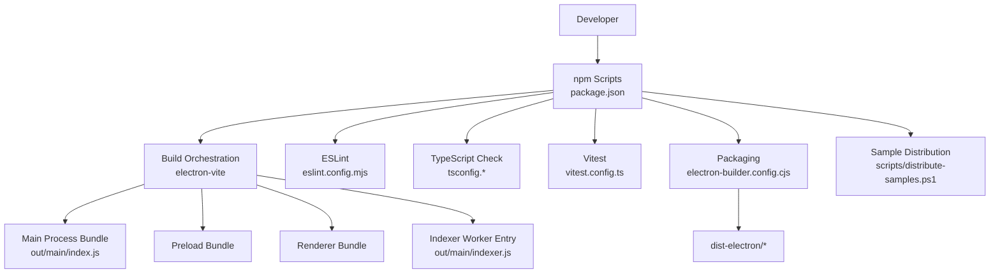
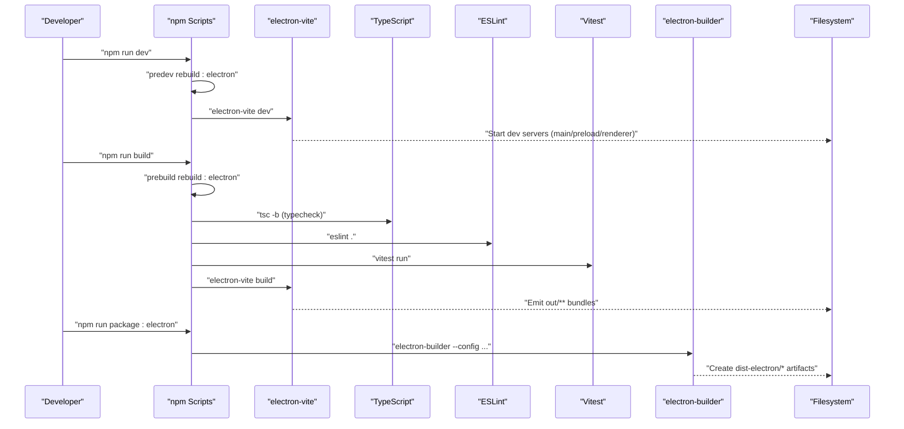
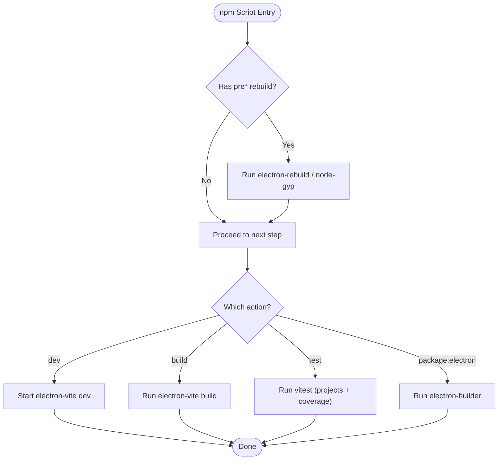
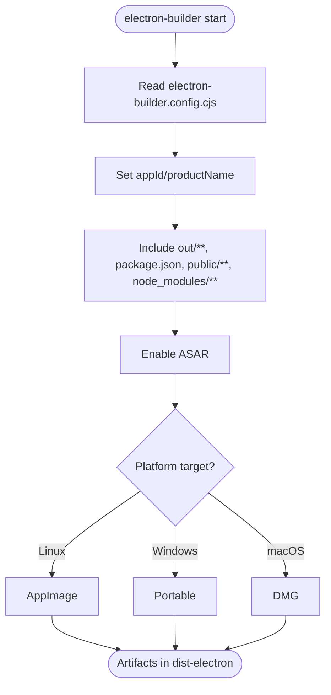
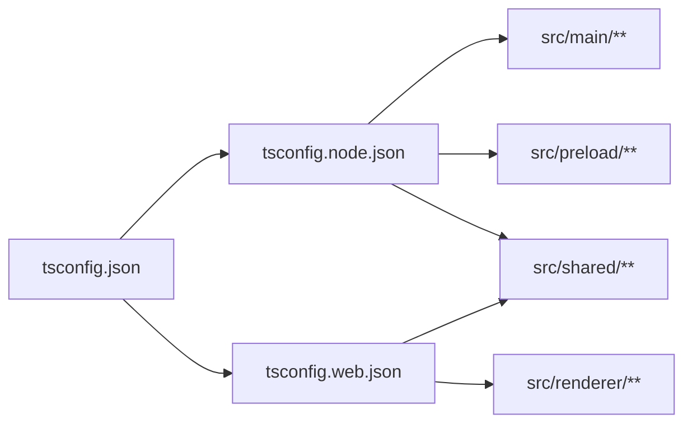
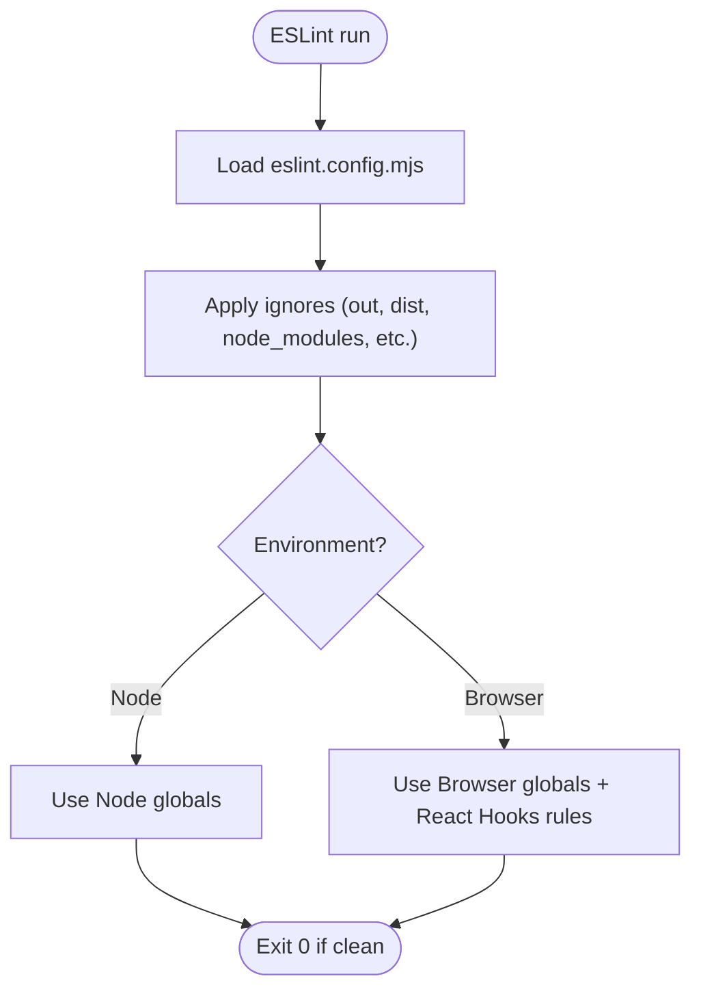
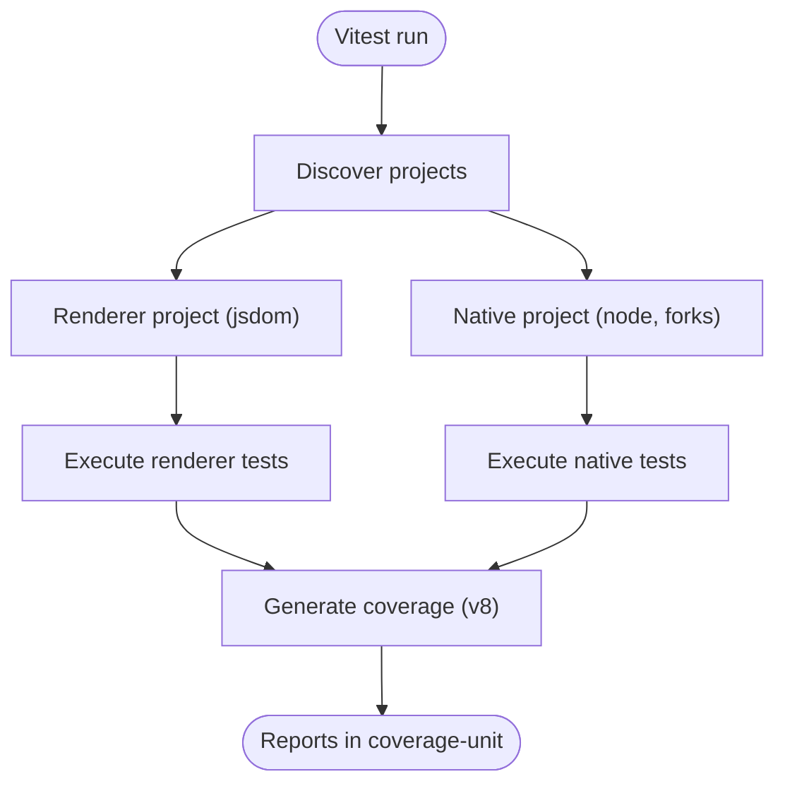
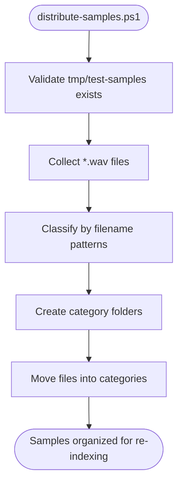
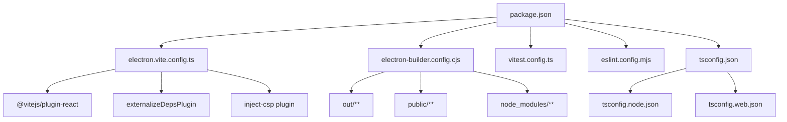

# CI/CD Pipeline & Build System

<cite>
**Referenced Files in This Document**
- [package.json](file://package.json)
- [electron.vite.config.ts](file://electron.vite.config.ts)
- [electron-builder.config.cjs](file://electron-builder.config.cjs)
- [vitest.config.ts](file://vitest.config.ts)
- [eslint.config.mjs](file://eslint.config.mjs)
- [tsconfig.json](file://tsconfig.json)
- [tsconfig.node.json](file://tsconfig.node.json)
- [tsconfig.web.json](file://tsconfig.web.json)
- [scripts/distribute-samples.ps1](file://scripts/distribute-samples.ps1)
</cite>

## Table of Contents
1. [Introduction](#introduction)
2. [Project Structure](#project-structure)
3. [Core Components](#core-components)
4. [Architecture Overview](#architecture-overview)
5. [Detailed Component Analysis](#detailed-component-analysis)
6. [Dependency Analysis](#dependency-analysis)
7. [Performance Considerations](#performance-considerations)
8. [Troubleshooting Guide](#troubleshooting-guide)
9. [Conclusion](#conclusion)
10. [Appendices](#appendices)

## Introduction
This document describes the CI/CD pipeline and build system for the Electron application. It explains how development, testing, linting, packaging, and distribution are orchestrated using npm scripts, Vite-based tooling, TypeScript configuration, ESLint, Vitest, and electron-builder. The goal is to provide a clear, end-to-end understanding of how code is transformed into distributable artifacts and how quality gates are enforced locally and in automation.

## Project Structure
The build and CI-related configuration is centralized in a small set of files:
- Package scripts define the developer workflow (dev, build, test, package).
- Vite configuration drives compilation for main, preload, and renderer targets.
- TypeScript project references separate Node and Web contexts.
- ESLint config enforces environment-specific rules.
- Vitest config splits tests between jsdom and native Node environments.
- electron-builder config defines packaging targets and outputs.
- A PowerShell helper script organizes sample assets for manual testing.



**Diagram sources**
- [package.json:6-24](file://package.json#L6-L24)
- [electron.vite.config.ts:38-62](file://electron.vite.config.ts#L38-L62)
- [electron-builder.config.cjs:3-31](file://electron-builder.config.cjs#L3-L31)
- [eslint.config.mjs:1-26](file://eslint.config.mjs#L1-L26)
- [vitest.config.ts:4-50](file://vitest.config.ts#L4-L50)
- [tsconfig.json:1-8](file://tsconfig.json#L1-L8)
- [tsconfig.node.json:1-14](file://tsconfig.node.json#L1-L14)
- [tsconfig.web.json:1-16](file://tsconfig.web.json#L1-L16)
- [scripts/distribute-samples.ps1:1-119](file://scripts/distribute-samples.ps1#L1-L119)

**Section sources**
- [package.json:6-24](file://package.json#L6-L24)
- [electron.vite.config.ts:38-62](file://electron.vite.config.ts#L38-L62)
- [electron-builder.config.cjs:3-31](file://electron-builder.config.cjs#L3-L31)
- [eslint.config.mjs:1-26](file://eslint.config.mjs#L1-L26)
- [vitest.config.ts:4-50](file://vitest.config.ts#L4-L50)
- [tsconfig.json:1-8](file://tsconfig.json#L1-L8)
- [tsconfig.node.json:1-14](file://tsconfig.node.json#L1-L14)
- [tsconfig.web.json:1-16](file://tsconfig.web.json#L1-L16)
- [scripts/distribute-samples.ps1:1-119](file://scripts/distribute-samples.ps1#L1-L119)

## Core Components
- Development and build orchestration via npm scripts:
  - Dev server with hot reload and pre-rebuild steps.
  - Production build that compiles main, preload, and renderer.
  - Preview of production output.
  - Packaging into platform-specific artifacts.
- Build-time configuration:
  - electron-vite config sets entry points, plugins, and CSP injection for the renderer.
  - TypeScript project references split Node and Web builds.
- Quality gates:
  - ESLint with environment-aware rules.
  - Vitest projects for jsdom and native Node environments.
  - Coverage reporting for renderer code.
- Packaging:
  - electron-builder configures app metadata, file inclusion, ASAR, and per-platform targets.
- Utilities:
  - Sample distribution script for organizing test assets.

**Section sources**
- [package.json:6-24](file://package.json#L6-L24)
- [electron.vite.config.ts:7-31](file://electron.vite.config.ts#L7-L31)
- [electron.vite.config.ts:38-62](file://electron.vite.config.ts#L38-L62)
- [eslint.config.mjs:1-26](file://eslint.config.mjs#L1-L26)
- [vitest.config.ts:4-50](file://vitest.config.ts#L4-L50)
- [electron-builder.config.cjs:3-31](file://electron-builder.config.cjs#L3-L31)
- [scripts/distribute-samples.ps1:1-119](file://scripts/distribute-samples.ps1#L1-L119)

## Architecture Overview
The build pipeline transforms source code into runnable and distributable artifacts through a sequence of stages: type checking, linting, unit testing, bundling, and packaging.



**Diagram sources**
- [package.json:6-24](file://package.json#L6-L24)
- [electron.vite.config.ts:38-62](file://electron.vite.config.ts#L38-L62)
- [electron-builder.config.cjs:3-31](file://electron-builder.config.cjs#L3-L31)

## Detailed Component Analysis

### Build Orchestration (npm Scripts)
- Development lifecycle:
  - Pre-dev rebuild ensures native modules match the running Electron ABI.
  - Dev server starts Electron-Vite with HMR and React refresh.
- Production build:
  - Pre-build rebuild aligns native modules for packaging.
  - Build invokes electron-vite to compile all targets.
- Testing:
  - Pre-test rebuild ensures native modules match Node ABI for tests.
  - Tests run via Vitest with coverage support.
- Packaging:
  - electron-builder uses its config to produce platform artifacts.



**Diagram sources**
- [package.json:6-24](file://package.json#L6-L24)

**Section sources**
- [package.json:6-24](file://package.json#L6-L24)

### Bundling and App Shell (electron-vite)
- Targets:
  - Main process entry and indexer worker entry are explicitly defined.
  - External dependencies plugin avoids bundling native modules.
- Renderer:
  - React plugin enabled.
  - Custom plugin injects Content-Security-Policy meta tag at build time.
- Versioning:
  - Application version is read from package.json and injected as a constant.

```mermaid
classDiagram
class ElectronViteConfig {
+main : { plugins, define, build.rollupOptions.input }
+preload : { plugins }
+renderer : { plugins }
}
class InjectCspPlugin {
+name : "inject-csp"
+transformIndexHtml(html) string
}
class DefineConstants {
+__APP_VERSION__ : string
}
ElectronViteConfig --> InjectCspPlugin : "uses"
ElectronViteConfig --> DefineConstants : "defines"
```

**Diagram sources**
- [electron.vite.config.ts:7-31](file://electron.vite.config.ts#L7-L31)
- [electron.vite.config.ts:33-54](file://electron.vite.config.ts#L33-L54)
- [electron.vite.config.ts:56-62](file://electron.vite.config.ts#L56-L62)

**Section sources**
- [electron.vite.config.ts:7-31](file://electron.vite.config.ts#L7-L31)
- [electron.vite.config.ts:33-54](file://electron.vite.config.ts#L33-L54)
- [electron.vite.config.ts:56-62](file://electron.vite.config.ts#L56-L62)

### Packaging (electron-builder)
- App identity and product name configured.
- Output directory set to dist-electron.
- File inclusion includes built outputs, package manifest, public assets, and node_modules.
- ASAR enabled for security and performance.
- Per-platform targets:
  - Linux: AppImage
  - Windows: Portable
  - macOS: DMG
- Native module rebuild disabled during packaging; prepack rebuild handles ABI alignment.
- Extra metadata overrides main entry path for packaged runtime.



**Diagram sources**
- [electron-builder.config.cjs:3-31](file://electron-builder.config.cjs#L3-L31)

**Section sources**
- [electron-builder.config.cjs:3-31](file://electron-builder.config.cjs#L3-L31)

### Type Checking (TypeScript Projects)
- Root tsconfig aggregates two composite projects:
  - Node project for main, preload, shared, and build configs.
  - Web project for renderer and shared code.
- Strict mode and modern targets ensure consistent behavior across processes.



**Diagram sources**
- [tsconfig.json:1-8](file://tsconfig.json#L1-L8)
- [tsconfig.node.json:1-14](file://tsconfig.node.json#L1-L14)
- [tsconfig.web.json:1-16](file://tsconfig.web.json#L1-L16)

**Section sources**
- [tsconfig.json:1-8](file://tsconfig.json#L1-L8)
- [tsconfig.node.json:1-14](file://tsconfig.node.json#L1-L14)
- [tsconfig.web.json:1-16](file://tsconfig.web.json#L1-L16)

### Linting (ESLint)
- Environment-aware configurations:
  - Main and preload use Node globals.
  - Renderer uses Browser globals and React Hooks rules.
- Ignores generated and non-source directories.



**Diagram sources**
- [eslint.config.mjs:1-26](file://eslint.config.mjs#L1-L26)

**Section sources**
- [eslint.config.mjs:1-26](file://eslint.config.mjs#L1-L26)

### Testing (Vitest)
- Two projects:
  - Renderer project runs under jsdom and includes renderer and most main tests.
  - Native project runs under Node with forked pool for better-sqlite3 compatibility.
- Coverage:
  - Provider v8, multiple reporters, reports directory configured.
  - Includes renderer source, excludes tests, main, preload, and config files.



**Diagram sources**
- [vitest.config.ts:4-50](file://vitest.config.ts#L4-L50)

**Section sources**
- [vitest.config.ts:4-50](file://vitest.config.ts#L4-L50)

### Asset Preparation (Sample Distribution)
- PowerShell script organizes WAV samples into category folders based on naming patterns.
- Useful for manual testing and verifying library scanning behavior.



**Diagram sources**
- [scripts/distribute-samples.ps1:1-119](file://scripts/distribute-samples.ps1#L1-L119)

**Section sources**
- [scripts/distribute-samples.ps1:1-119](file://scripts/distribute-samples.ps1#L1-L119)

## Dependency Analysis
The following diagram shows key build-time dependencies among configuration files and tools.



**Diagram sources**
- [package.json:6-24](file://package.json#L6-L24)
- [electron.vite.config.ts:38-62](file://electron.vite.config.ts#L38-L62)
- [electron-builder.config.cjs:3-31](file://electron-builder.config.cjs#L3-L31)
- [vitest.config.ts:4-50](file://vitest.config.ts#L4-L50)
- [eslint.config.mjs:1-26](file://eslint.config.mjs#L1-L26)
- [tsconfig.json:1-8](file://tsconfig.json#L1-L8)
- [tsconfig.node.json:1-14](file://tsconfig.node.json#L1-L14)
- [tsconfig.web.json:1-16](file://tsconfig.web.json#L1-L16)

**Section sources**
- [package.json:6-24](file://package.json#L6-L24)
- [electron.vite.config.ts:38-62](file://electron.vite.config.ts#L38-L62)
- [electron-builder.config.cjs:3-31](file://electron-builder.config.cjs#L3-L31)
- [vitest.config.ts:4-50](file://vitest.config.ts#L4-L50)
- [eslint.config.mjs:1-26](file://eslint.config.mjs#L1-L26)
- [tsconfig.json:1-8](file://tsconfig.json#L1-L8)
- [tsconfig.node.json:1-14](file://tsconfig.node.json#L1-L14)
- [tsconfig.web.json:1-16](file://tsconfig.web.json#L1-L16)

## Performance Considerations
- Use externalizeDepsPlugin for main and preload to avoid bundling native modules and reduce bundle size.
- Keep ASAR enabled for faster load times and improved security posture.
- Split tests into jsdom and native projects to avoid unnecessary transforms for native addons.
- Restrict coverage include paths to renderer code to speed up coverage collection.
- Avoid rebuilding native modules unless necessary; rely on pre* hooks to align ABIs.

[No sources needed since this section provides general guidance]

## Troubleshooting Guide
- Native module ABI mismatches:
  - Ensure predev/prebuild/pretest rebuild hooks run before dev/build/test.
  - If issues persist, trigger explicit rebuild commands.
- Renderer CSP errors in production:
  - Confirm CSP meta injection occurs only in build mode.
  - Verify inline styles are allowed if theme tokens write style attributes.
- Test failures due to native addon loading:
  - Use the native Vitest project which runs in Node with forked processes.
- Packaging issues:
  - Verify extraMetadata.main points to the correct bundled entry.
  - Ensure required files (out/**, public/**, node_modules/**) are included.
- Sample indexing problems:
  - Use the sample distribution script to organize test assets, then re-scan the library.

**Section sources**
- [package.json:6-24](file://package.json#L6-L24)
- [electron.vite.config.ts:7-31](file://electron.vite.config.ts#L7-L31)
- [vitest.config.ts:12-30](file://vitest.config.ts#L12-L30)
- [electron-builder.config.cjs:26-29](file://electron-builder.config.cjs#L26-L29)
- [scripts/distribute-samples.ps1:1-119](file://scripts/distribute-samples.ps1#L1-L119)

## Conclusion
The build and CI system combines npm scripts, Vite, TypeScript, ESLint, Vitest, and electron-builder to deliver a robust development experience and reliable packaging pipeline. Clear separation of concerns across configuration files enables maintainability, while pre* hooks and project-scoped settings ensure native modules and environments are correctly handled. Following the documented flows and troubleshooting tips will help keep builds fast, tests stable, and artifacts consistent across platforms.

[No sources needed since this section summarizes without analyzing specific files]

## Appendices

### Quick Commands Reference
- Install and rebuild native modules: see postinstall and rebuild scripts.
- Start development server: see dev script.
- Build production artifacts: see build script.
- Preview production build: see preview script.
- Type check: see typecheck script.
- Lint: see lint script.
- Unit tests: see test scripts (run, watch, coverage).
- Package apps: see package:electron script.

**Section sources**
- [package.json:6-24](file://package.json#L6-L24)