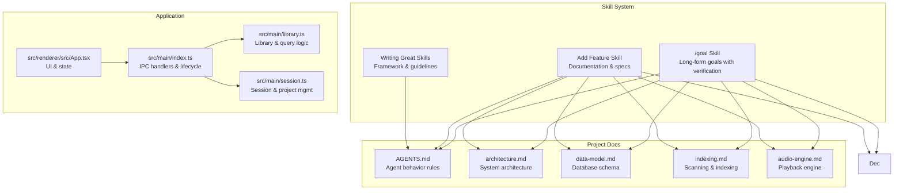
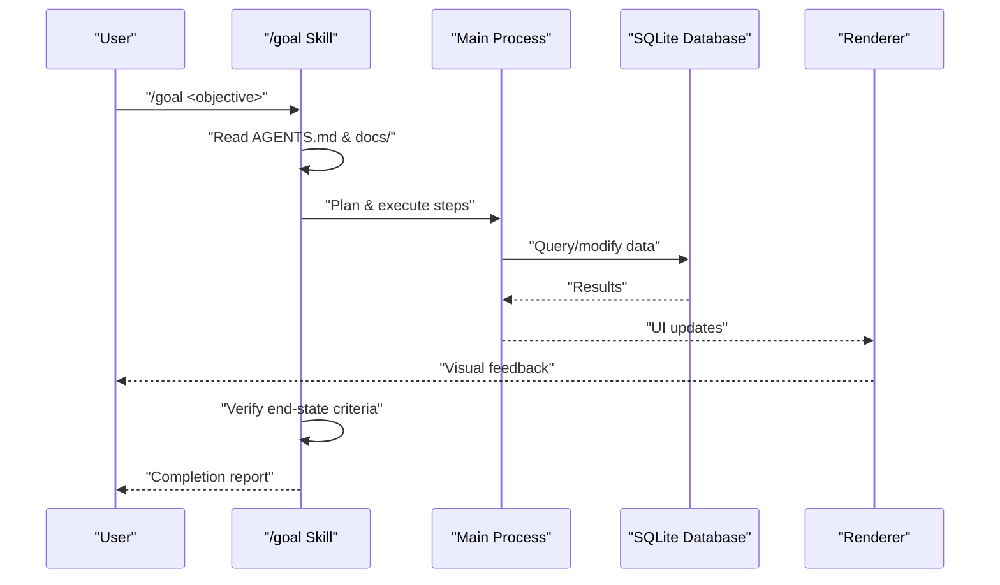
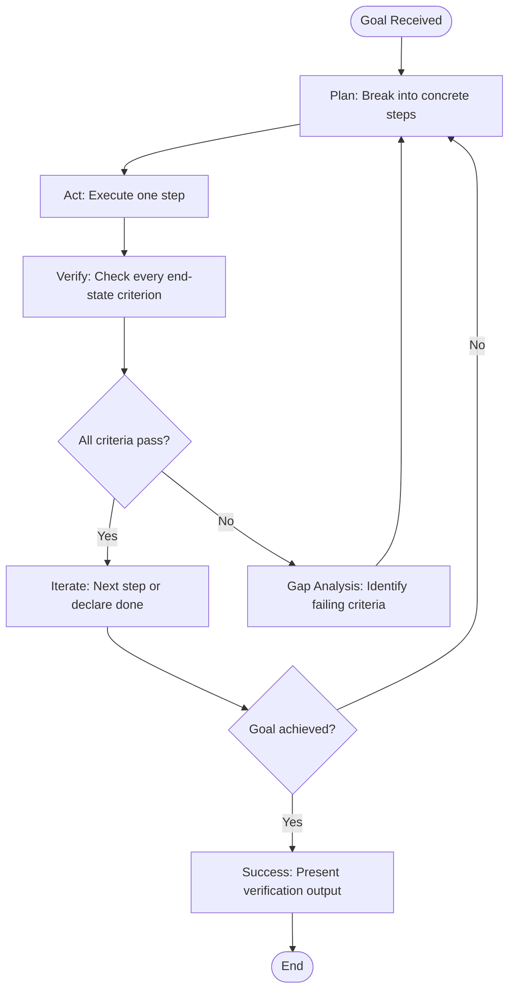
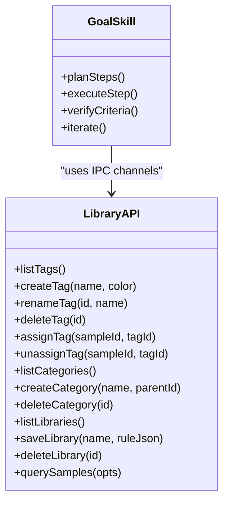
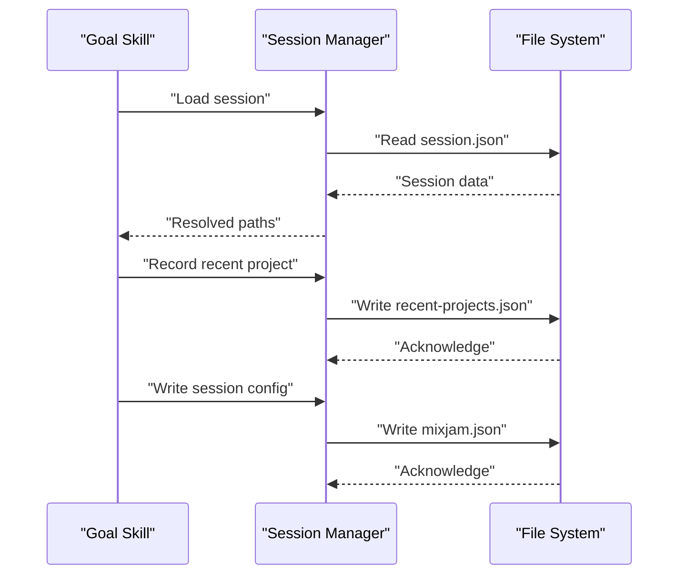
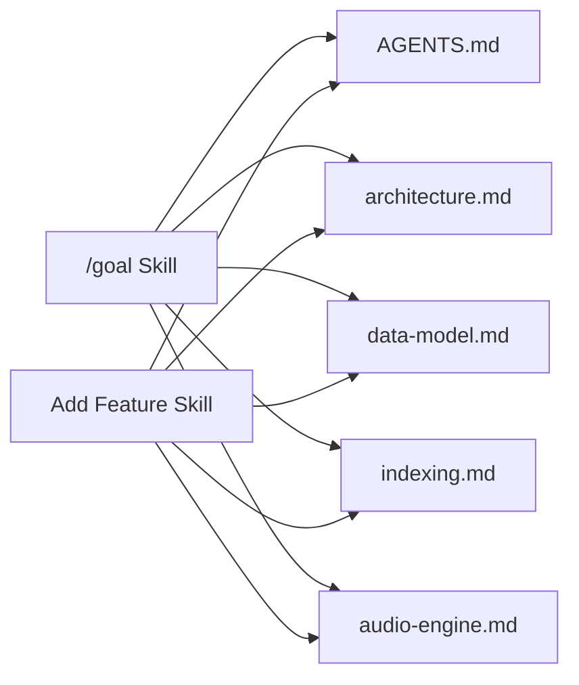
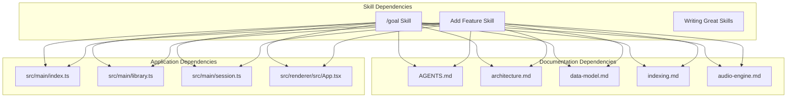

# Skill System & Goal Management

<cite>
**Referenced Files in This Document**
- [AGENTS.md](file://AGENTS.md)
- [CLAUDE.md](file://CLAUDE.md)
- [.github/skills/goal/SKILL.md](file://.github/skills/goal/SKILL.md)
- [.github/skills/goal/REFERENCE.md](file://.github/skills/goal/REFERENCE.md)
- [.github/skills/add-feature/SKILL.md](file://.github/skills/add-feature/SKILL.md)
- [.github/skills/writing-great-skills/SKILL.md](file://.github/skills/writing-great-skills/SKILL.md)
- [docs/architecture.md](file://docs/architecture.md)
- [docs/data-model.md](file://docs/data-model.md)
- [docs/indexing.md](file://docs/indexing.md)
- [docs/audio-engine.md](file://docs/audio-engine.md)
- [src/main/index.ts](file://src/main/index.ts)
- [src/main/library.ts](file://src/main/library.ts)
- [src/main/session.ts](file://src/main/session.ts)
- [src/renderer/src/App.tsx](file://src/renderer/src/App.tsx)
</cite>

## Table of Contents
1. [Introduction](#introduction)
2. [Project Structure](#project-structure)
3. [Core Components](#core-components)
4. [Architecture Overview](#architecture-overview)
5. [Detailed Component Analysis](#detailed-component-analysis)
6. [Dependency Analysis](#dependency-analysis)
7. [Performance Considerations](#performance-considerations)
8. [Troubleshooting Guide](#troubleshooting-guide)
9. [Conclusion](#conclusion)

## Introduction

This document describes the Skill System & Goal Management framework used in the MixJam Electron project. The system provides structured workflows for AI agents to execute complex tasks with verifiable outcomes, maintain project consistency, and ensure predictable behavior across development cycles. It combines three pillars: the `/goal` skill for long-form objectives with judge-verified completion, the `add-feature` skill for documenting design decisions and specifications, and the `writing-great-skills` framework for structuring agent workflows effectively.

The skill system emphasizes deterministic execution, measurable end states, and strict adherence to project constraints. It integrates with the project's documentation ecosystem and technical architecture to ensure that agent-driven changes align with established design principles and quality gates.

## Project Structure

The skill system is organized as a set of Markdown-based skills located under `.github/skills/`, each defining a specific workflow or capability. These skills reference canonical project documentation and integrate with the application's main process and renderer components.

**Diagram sources**
- [.github/skills/goal/SKILL.md:1-108](file://.github/skills/goal/SKILL.md#L1-L108)
- [.github/skills/add-feature/SKILL.md:1-117](file://.github/skills/add-feature/SKILL.md#L1-L117)
- [.github/skills/writing-great-skills/SKILL.md:1-126](file://.github/skills/writing-great-skills/SKILL.md#L1-L126)
- [AGENTS.md:1-64](file://AGENTS.md#L1-L64)
- [docs/architecture.md:1-76](file://docs/architecture.md#L1-L76)
- [docs/data-model.md:1-138](file://docs/data-model.md#L1-L138)
- [docs/indexing.md:1-99](file://docs/indexing.md#L1-L99)
- [docs/audio-engine.md:1-53](file://docs/audio-engine.md#L1-L53)
- [src/main/index.ts:1-342](file://src/main/index.ts#L1-L342)
- [src/main/library.ts:1-536](file://src/main/library.ts#L1-L536)
- [src/main/session.ts:1-265](file://src/main/session.ts#L1-L265)
- [src/renderer/src/App.tsx:1-183](file://src/renderer/src/App.tsx#L1-L183)

**Section sources**
- [.github/skills/goal/SKILL.md:1-108](file://.github/skills/goal/SKILL.md#L1-L108)
- [.github/skills/add-feature/SKILL.md:1-117](file://.github/skills/add-feature/SKILL.md#L1-L117)
- [.github/skills/writing-great-skills/SKILL.md:1-126](file://.github/skills/writing-great-skills/SKILL.md#L1-L126)
- [AGENTS.md:1-64](file://AGENTS.md#L1-L64)

## Core Components

### /goal Skill
The `/goal` skill orchestrates long-form objectives with verifiable outcomes. It enforces a strict loop: plan → act → verify → iterate, ensuring every end-state criterion is independently confirmed before declaring completion. The skill integrates with the project's quality gates (lint, tests, typecheck) and maintains safeguards against premature completion and endless iteration.

Key characteristics:
- Three required parts: Goal, End state, Constraints
- Built-in safeguards: stop conditions, iteration caps, destructive-action protection
- Repo-integrated quality gates: lint, test, typecheck, coverage thresholds
- Minimal and layered templates for objective specification

**Section sources**
- [.github/skills/goal/SKILL.md:7-108](file://.github/skills/goal/SKILL.md#L7-L108)

### Add Feature Skill
The `add-feature` skill creates or updates repository specifications, acceptance criteria, and durable decisions for new work. It prioritizes documenting decisions and trade-offs that future maintainers would otherwise rediscover, ensuring the smallest durable document that makes the next slice unambiguous.

Key characteristics:
- Choose the right home for canonical documentation
- First rule: avoid duplicates by updating existing docs
- Manual spec workflow for environments without spec-kit CLI
- Completion criterion: slice unambiguity, no duplicates, recorded decisions, validation passes

**Section sources**
- [.github/skills/add-feature/SKILL.md:11-117](file://.github/skills/add-feature/SKILL.md#L11-L117)

### Writing Great Skills Framework
The `writing-great-skills` skill defines the principles for structuring agent workflows effectively. It focuses on predictability, information hierarchy, progressive disclosure, and pruning to maintain clarity and reduce cognitive load.

Key characteristics:
- Invocation modes: model-invoked vs user-invoked
- Information hierarchy: steps, in-skill reference, external reference
- Progressive disclosure and co-location
- Pruning, leading words, and failure modes diagnosis

**Section sources**
- [.github/skills/writing-great-skills/SKILL.md:7-126](file://.github/skills/writing-great-skills/SKILL.md#L7-L126)

### Project Constraints and Quality Gates
The `AGENTS.md` document establishes hard rules and quality gates that all skills must respect. These constraints govern data access, UI sandboxing, audio processing, and testing procedures, ensuring consistency across agent-driven changes.

Key characteristics:
- Virtualization requirements for large datasets
- Database access in main process only
- Renderer sandboxing and IPC boundaries
- Audio processing in renderer with Web Audio API
- Command suite for development and testing

**Section sources**
- [AGENTS.md:35-64](file://AGENTS.md#L35-L64)

## Architecture Overview

The skill system operates alongside the application's architecture, integrating with the main process for data operations and the renderer for UI interactions. The main process exposes IPC channels for library operations, session management, and scanning, while the renderer manages user interactions and state.

**Diagram sources**
- [.github/skills/goal/SKILL.md:58-108](file://.github/skills/goal/SKILL.md#L58-L108)
- [src/main/index.ts:224-237](file://src/main/index.ts#L224-L237)
- [src/main/library.ts:281-384](file://src/main/library.ts#L281-L384)
- [src/renderer/src/App.tsx:114-169](file://src/renderer/src/App.tsx#L114-L169)

## Detailed Component Analysis

### Goal Execution Loop
The `/goal` skill implements a four-stage loop that ensures rigorous verification and prevents premature completion. Each iteration requires independent verification of all end-state criteria, enforced by the skill's built-in safeguards.

**Diagram sources**
- [.github/skills/goal/SKILL.md:58-108](file://.github/skills/goal/SKILL.md#L58-L108)

**Section sources**
- [.github/skills/goal/SKILL.md:58-108](file://.github/skills/goal/SKILL.md#L58-L108)

### Library Management Integration
The main process exposes IPC channels for library operations that the goal system can leverage. These channels support querying samples, managing tags and categories, and saving libraries as persistent views.

**Diagram sources**
- [src/main/library.ts:44-384](file://src/main/library.ts#L44-L384)
- [src/main/index.ts:241-308](file://src/main/index.ts#L241-L308)

**Section sources**
- [src/main/library.ts:44-384](file://src/main/library.ts#L44-L384)
- [src/main/index.ts:241-308](file://src/main/index.ts#L241-L308)

### Session and Project Management
The session system manages user and sample folders, recent projects, and project configurations. The goal system can integrate with session management to maintain continuity across iterations and ensure consistent environment setup.

**Diagram sources**
- [src/main/session.ts:68-265](file://src/main/session.ts#L68-L265)
- [src/main/index.ts:155-178](file://src/main/index.ts#L155-L178)

**Section sources**
- [src/main/session.ts:68-265](file://src/main/session.ts#L68-L265)
- [src/main/index.ts:155-178](file://src/main/index.ts#L155-L178)

### Documentation Integration
The skills reference canonical project documentation to ensure alignment with established design principles and trade-offs. This integration guarantees that agent-driven changes respect project constraints and maintain consistency.

**Diagram sources**
- [.github/skills/goal/SKILL.md:13-17](file://.github/skills/goal/SKILL.md#L13-L17)
- [.github/skills/add-feature/SKILL.md:29-44](file://.github/skills/add-feature/SKILL.md#L29-L44)
- [AGENTS.md:11-18](file://AGENTS.md#L11-L18)

**Section sources**
- [.github/skills/goal/SKILL.md:13-17](file://.github/skills/goal/SKILL.md#L13-L17)
- [.github/skills/add-feature/SKILL.md:29-44](file://.github/skills/add-feature/SKILL.md#L29-L44)
- [AGENTS.md:11-18](file://AGENTS.md#L11-L18)

## Dependency Analysis

The skill system depends on several layers of project infrastructure:

- **Documentation layer**: AGENTS.md, architecture, data-model, indexing, audio-engine, decisions
- **Application layer**: Main process IPC handlers, library management, session management
- **Renderer layer**: UI components and state management
- **Quality gates**: Lint, test, typecheck, coverage thresholds

**Diagram sources**
- [AGENTS.md:1-64](file://AGENTS.md#L1-L64)
- [docs/architecture.md:1-76](file://docs/architecture.md#L1-L76)
- [docs/data-model.md:1-138](file://docs/data-model.md#L1-L138)
- [docs/indexing.md:1-99](file://docs/indexing.md#L1-L99)
- [docs/audio-engine.md:1-53](file://docs/audio-engine.md#L1-L53)
- [src/main/index.ts:1-342](file://src/main/index.ts#L1-L342)
- [src/main/library.ts:1-536](file://src/main/library.ts#L1-L536)
- [src/main/session.ts:1-265](file://src/main/session.ts#L1-L265)
- [src/renderer/src/App.tsx:1-183](file://src/renderer/src/App.tsx#L1-L183)

**Section sources**
- [AGENTS.md:1-64](file://AGENTS.md#L1-L64)
- [docs/architecture.md:1-76](file://docs/architecture.md#L1-L76)
- [docs/data-model.md:1-138](file://docs/data-model.md#L1-L138)
- [docs/indexing.md:1-99](file://docs/indexing.md#L1-L99)
- [docs/audio-engine.md:1-53](file://docs/audio-engine.md#L1-L53)
- [src/main/index.ts:1-342](file://src/main/index.ts#L1-L342)
- [src/main/library.ts:1-536](file://src/main/library.ts#L1-L536)
- [src/main/session.ts:1-265](file://src/main/session.ts#L1-L265)
- [src/renderer/src/App.tsx:1-183](file://src/renderer/src/App.tsx#L1-L183)

## Performance Considerations

The skill system is designed to minimize overhead while maintaining reliability:
- Predictable execution patterns reduce context switching and improve throughput
- Measurable end states prevent wasted iterations on partial progress
- Strict pruning and progressive disclosure keep skills focused and efficient
- Integration with project quality gates ensures performance standards are maintained

## Troubleshooting Guide

Common issues and resolutions:

### Premature Completion
Symptoms: Agent declares success before all criteria are verified
Resolution: Strengthen completion criteria to be checkable and exhaustive; split steps to prevent rushing

### Duplication
Symptoms: Same meaning appears in multiple places
Resolution: Maintain single source of truth; consolidate repeated content into unified references

### Sediment
Symptoms: Stale layers accumulate over time
Resolution: Regular pruning discipline; remove no-ops and irrelevant content

### Sprawl
Symptoms: Skills become too long and unwieldy
Resolution: Apply information hierarchy; disclose reference content behind pointers; split by branch or sequence

**Section sources**
- [.github/skills/writing-great-skills/SKILL.md:109-126](file://.github/skills/writing-great-skills/SKILL.md#L109-L126)

## Conclusion

The Skill System & Goal Management framework provides a robust foundation for AI-assisted development in the MixJam Electron project. By emphasizing deterministic execution, measurable outcomes, and strict adherence to project constraints, it ensures that agent-driven changes align with established design principles while maintaining high-quality standards. The integration with canonical documentation and application infrastructure creates a cohesive development workflow that scales effectively across complex feature implementations.