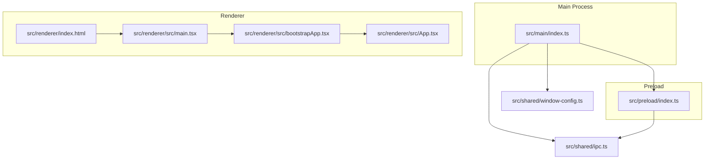
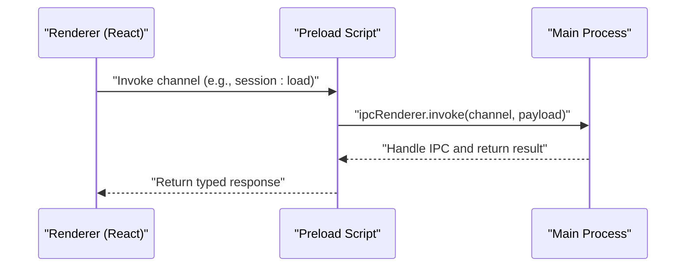

# Getting Started

<cite>
**Referenced Files in This Document**
- [package.json](file://package.json)
- [electron.vite.config.ts](file://electron.vite.config.ts)
- [src/main/index.ts](file://src/main/index.ts)
- [src/preload/index.ts](file://src/preload/index.ts)
- [src/shared/ipc.ts](file://src/shared/ipc.ts)
- [src/shared/window-config.ts](file://src/shared/window-config.ts)
- [src/renderer/src/main.tsx](file://src/renderer/src/main.tsx)
- [src/renderer/src/bootstrapApp.tsx](file://src/renderer/src/bootstrapApp.tsx)
- [src/renderer/src/App.tsx](file://src/renderer/src/App.tsx)
- [src/renderer/index.html](file://src/renderer/index.html)
- [tsconfig.json](file://tsconfig.json)
- [tsconfig.node.json](file://tsconfig.node.json)
- [tsconfig.web.json](file://tsconfig.web.json)
</cite>

## Table of Contents
1. [Introduction](#introduction)
2. [Development Environment Setup](#development-environment-setup)
3. [Project Structure Overview](#project-structure-overview)
4. [Core Technologies](#core-technologies)
5. [Running the Development Server](#running-the-development-server)
6. [Building Production Assets](#building-production-assets)
7. [Understanding the Dual-Process Architecture](#understanding-the-dual-process-architecture)
8. [Initial Project Walkthrough](#initial-project-walkthrough)
9. [Troubleshooting Guide](#troubleshooting-guide)
10. [Conclusion](#conclusion)

## Introduction
MixJam Electron is a desktop application that serves as a sample library browser and tracker. It provides a modern desktop experience built with Electron, React, and TypeScript, using Vite for fast development builds and Electron-Vite for streamlined Electron packaging. The application manages user and sample folders, maintains recent projects, and exposes a sample browser for browsing and organizing audio samples. It also integrates a transport and mixer-like interface for arranging and playing samples.

## Development Environment Setup
Before you begin, ensure your environment meets the following prerequisites:
- Node.js: Install a stable LTS version compatible with the project dependencies.
- Git: For cloning the repository and managing updates.
- A code editor: VS Code is recommended for optimal TypeScript and ESLint support.

Installation steps:
1. Clone the repository to your local machine.
2. Open a terminal in the project root and install dependencies:
   - Run the package manager install command appropriate for your environment.
3. Verify the installation by checking that all development dependencies resolve correctly.

Verification:
- Confirm that the scripts defined in the project configuration are available for use during development and build tasks.

**Section sources**
- [package.json:1-50](file://package.json#L1-L50)

## Project Structure Overview
The project follows a clear separation of concerns across three primary areas:
- Main process: Initializes the Electron app, creates the main BrowserWindow, handles IPC channels, and manages application lifecycle events.
- Preload script: Exposes a controlled API surface to the renderer via contextBridge, enabling secure communication.
- Renderer: A React application bootstrapped with TypeScript, rendering the UI and orchestrating user interactions.

High-level layout:
- Main process entry: src/main/index.ts
- Preload entry: src/preload/index.ts
- Renderer entry: src/renderer/src/main.tsx and src/renderer/index.html
- Shared contracts: src/shared/ipc.ts and src/shared/window-config.ts
- Build configuration: electron.vite.config.ts and TypeScript configs

**Diagram sources**
- [src/main/index.ts:1-170](file://src/main/index.ts#L1-L170)
- [src/preload/index.ts:1-29](file://src/preload/index.ts#L1-L29)
- [src/renderer/src/main.tsx:1-5](file://src/renderer/src/main.tsx#L1-L5)
- [src/renderer/src/bootstrapApp.tsx:1-19](file://src/renderer/src/bootstrapApp.tsx#L1-L19)
- [src/renderer/src/App.tsx:1-108](file://src/renderer/src/App.tsx#L1-L108)
- [src/renderer/index.html:1-13](file://src/renderer/index.html#L1-L13)
- [src/shared/ipc.ts:1-59](file://src/shared/ipc.ts#L1-L59)
- [src/shared/window-config.ts:1-54](file://src/shared/window-config.ts#L1-L54)

**Section sources**
- [src/main/index.ts:1-170](file://src/main/index.ts#L1-L170)
- [src/preload/index.ts:1-29](file://src/preload/index.ts#L1-L29)
- [src/renderer/src/main.tsx:1-5](file://src/renderer/src/main.tsx#L1-L5)
- [src/renderer/src/bootstrapApp.tsx:1-19](file://src/renderer/src/bootstrapApp.tsx#L1-L19)
- [src/renderer/src/App.tsx:1-108](file://src/renderer/src/App.tsx#L1-L108)
- [src/renderer/index.html:1-13](file://src/renderer/index.html#L1-L13)
- [src/shared/ipc.ts:1-59](file://src/shared/ipc.ts#L1-L59)
- [src/shared/window-config.ts:1-54](file://src/shared/window-config.ts#L1-L54)

## Core Technologies
- Electron: Cross-platform desktop runtime for the main process and BrowserWindow creation.
- React: UI framework for the renderer process with TypeScript for type safety.
- TypeScript: Strongly typed JavaScript for improved developer experience and maintainability.
- Electron-Vite: Build toolchain optimized for Electron applications, supporting separate main/preload/renderer builds.
- Vite: Fast development server and bundler for the renderer.

Build and development scripts are defined in the project configuration, enabling quick iteration and production builds.

**Section sources**
- [package.json:1-50](file://package.json#L1-L50)
- [electron.vite.config.ts:1-15](file://electron.vite.config.ts#L1-L15)
- [tsconfig.json:1-8](file://tsconfig.json#L1-L8)
- [tsconfig.node.json:1-14](file://tsconfig.node.json#L1-L14)
- [tsconfig.web.json:1-16](file://tsconfig.web.json#L1-L16)

## Running the Development Server
Start the development server to launch the app with hot reloading:
- Execute the development script defined in the project configuration.
- The main process will create a BrowserWindow and load either a development URL or the packaged renderer HTML.
- The renderer will mount the React application and initialize theming and routing.

Expected behavior:
- The app opens with the home screen, prompting for user and sample folders.
- Navigation switches between the home screen and the tracker view.

**Section sources**
- [package.json:6-16](file://package.json#L6-L16)
- [src/main/index.ts:38-56](file://src/main/index.ts#L38-L56)
- [src/renderer/src/main.tsx:1-5](file://src/renderer/src/main.tsx#L1-L5)
- [src/renderer/src/bootstrapApp.tsx:12-19](file://src/renderer/src/bootstrapApp.tsx#L12-L19)

## Building Production Assets
To build production-ready assets:
- Execute the build script defined in the project configuration.
- Electron-Vite compiles the main, preload, and renderer bundles according to the build configuration.
- The renderer bundle is generated under the renderer output directory, and the main/preload bundles are produced accordingly.

Post-build:
- Launch the packaged application using the main entry configured in the project metadata.
- Validate that the app loads the packaged renderer HTML and initializes without development tooling.

**Section sources**
- [package.json:6-16](file://package.json#L6-L16)
- [electron.vite.config.ts:4-14](file://electron.vite.config.ts#L4-L14)
- [src/main/index.ts:51-55](file://src/main/index.ts#L51-L55)

## Understanding the Dual-Process Architecture
Electron separates concerns between the main and renderer processes:
- Main process: Manages application lifecycle, creates windows, handles system dialogs, file operations, and exposes IPC handlers for the renderer.
- Preload script: Bridges the main and renderer by exposing a typed API surface via contextBridge.
- Renderer process: Runs the React application, consumes the exposed API, and renders UI components.

IPC contract:
- Channels are defined centrally and used consistently across main and renderer to ensure type-safe communication.

Window configuration:
- Centralized window sizing and behavior are managed in a shared module, ensuring consistent UX across views.

**Diagram sources**
- [src/shared/ipc.ts:1-59](file://src/shared/ipc.ts#L1-L59)
- [src/preload/index.ts:1-29](file://src/preload/index.ts#L1-L29)
- [src/main/index.ts:104-117](file://src/main/index.ts#L104-L117)

**Section sources**
- [src/main/index.ts:1-170](file://src/main/index.ts#L1-L170)
- [src/preload/index.ts:1-29](file://src/preload/index.ts#L1-L29)
- [src/shared/ipc.ts:1-59](file://src/shared/ipc.ts#L1-L59)
- [src/shared/window-config.ts:1-54](file://src/shared/window-config.ts#L1-L54)

## Initial Project Walkthrough
First-time setup and navigation:
1. Start the development server and observe the home screen.
2. Select the user folder and sample folder using the folder picker APIs.
3. Navigate to the tracker view to browse and arrange samples.
4. Use the transport controls to play, pause, and stop playback.
5. Manage recent projects and session state via the integrated APIs.

Key entry points:
- Renderer bootstrapping occurs in the HTML entry and main renderer entry.
- The React app composes views and state hooks to orchestrate user actions.

**Section sources**
- [src/renderer/index.html:1-13](file://src/renderer/index.html#L1-L13)
- [src/renderer/src/main.tsx:1-5](file://src/renderer/src/main.tsx#L1-L5)
- [src/renderer/src/bootstrapApp.tsx:12-19](file://src/renderer/src/bootstrapApp.tsx#L12-L19)
- [src/renderer/src/App.tsx:9-45](file://src/renderer/src/App.tsx#L9-L45)

## Troubleshooting Guide
Common setup and runtime issues:
- Node.js version mismatch: Ensure your installed Node.js version aligns with the project’s requirements. Reinstall if necessary.
- Missing dependencies: Run the package manager install command to fetch all required packages.
- Build failures: Verify TypeScript configurations and that Electron-Vite plugins are applied correctly for main, preload, and renderer builds.
- Dev server not loading: Confirm the main process is loading the correct renderer URL or HTML file depending on the environment.
- IPC communication errors: Ensure channel names match between main and renderer and that the preload bridge exposes the expected API surface.
- Window sizing anomalies: Check window configuration constants and resizing helpers for proper order of operations.

**Section sources**
- [package.json:17-48](file://package.json#L17-L48)
- [electron.vite.config.ts:4-14](file://electron.vite.config.ts#L4-L14)
- [tsconfig.node.json:12-13](file://tsconfig.node.json#L12-L13)
- [tsconfig.web.json:14-15](file://tsconfig.web.json#L14-L15)
- [src/main/index.ts:51-55](file://src/main/index.ts#L51-L55)
- [src/shared/ipc.ts:1-59](file://src/shared/ipc.ts#L1-L59)
- [src/shared/window-config.ts:39-54](file://src/shared/window-config.ts#L39-L54)

## Conclusion
You are now ready to explore and extend the MixJam Electron application. Use the development server for rapid iteration, leverage the dual-process architecture for secure and scalable features, and follow the project’s structure to add new capabilities. For deeper dives into the application’s domain (sample browsing, transport, and mixer-like features), refer to the included documentation and component implementations.