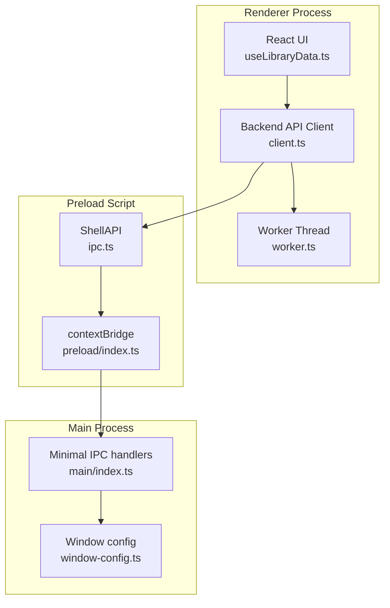
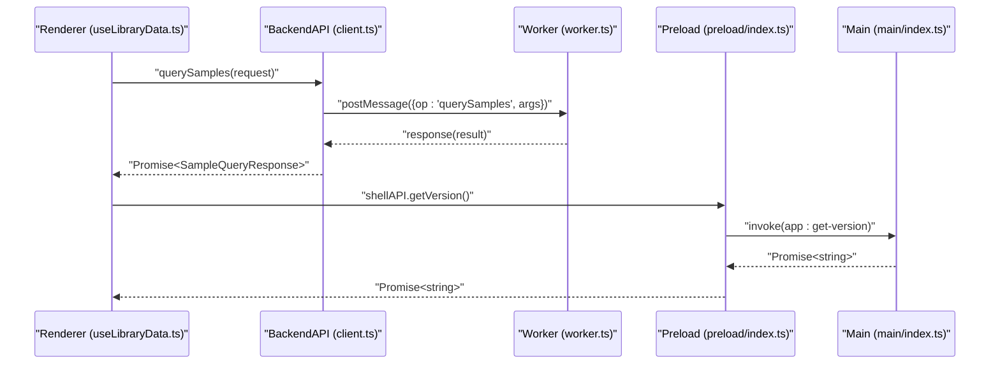
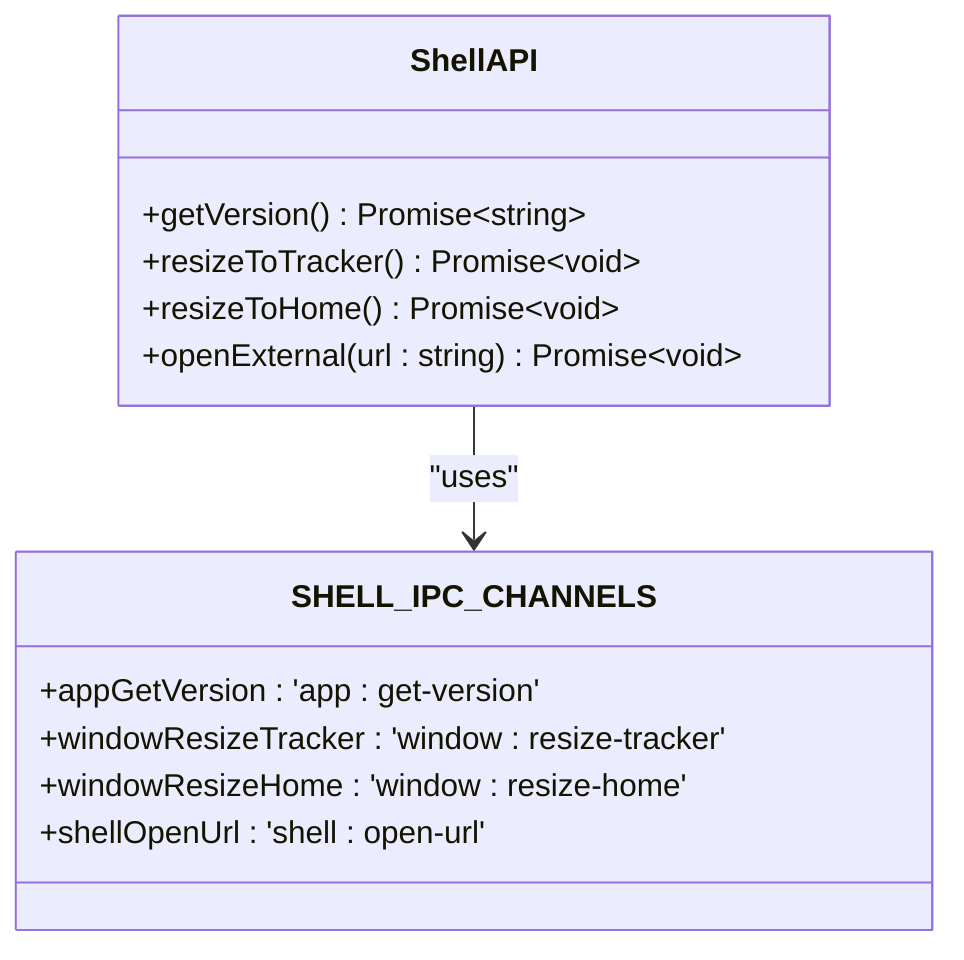
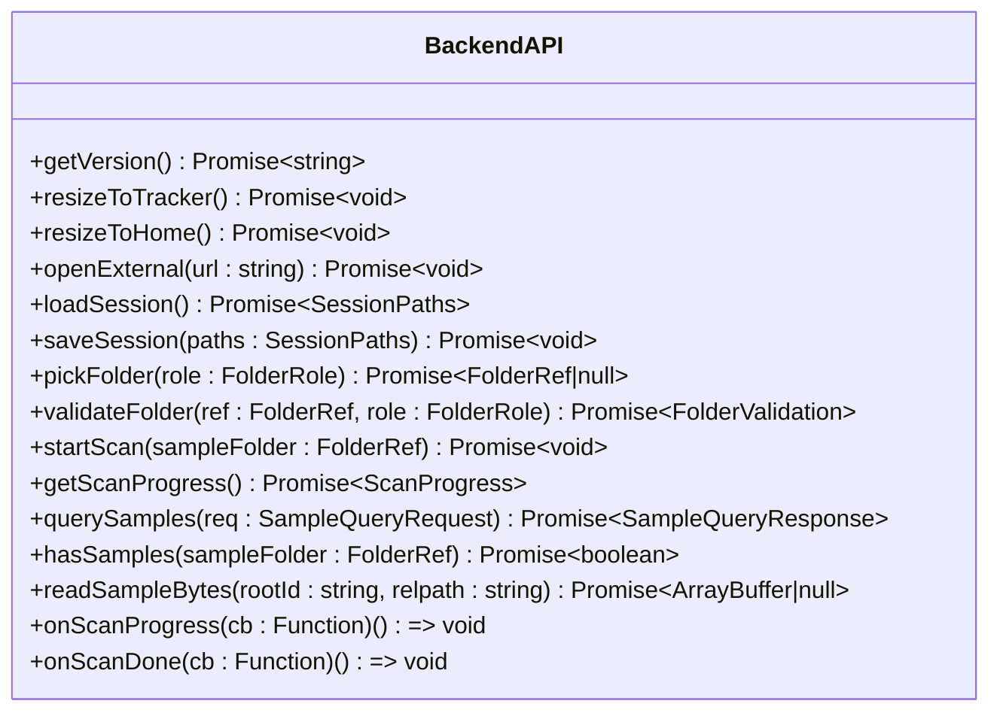
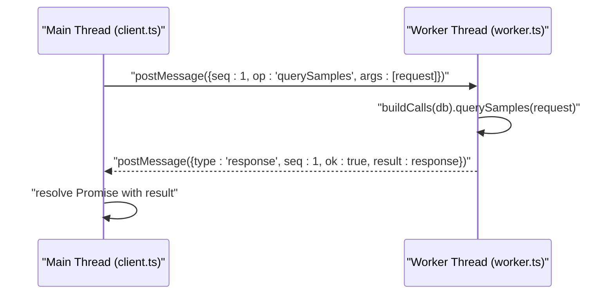
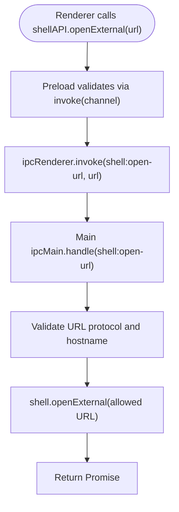
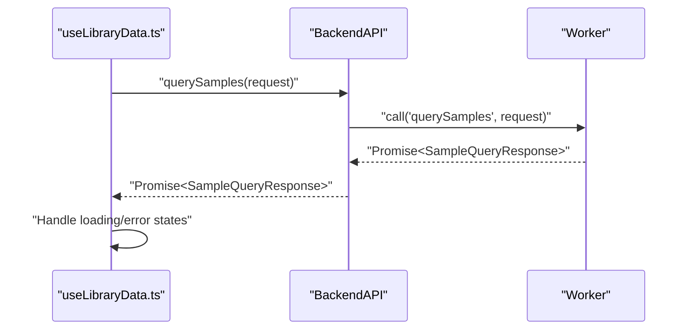
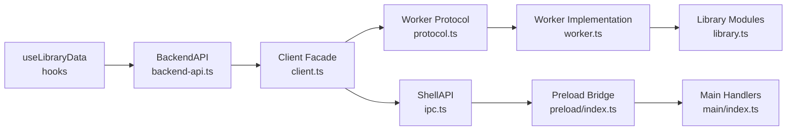

# IPC Communication

<cite>
**Referenced Files in This Document**
- [ipc.ts](file://src/shared/ipc.ts)
- [backend-api.ts](file://src/shared/backend-api.ts)
- [preload/index.ts](file://src/preload/index.ts)
- [main/index.ts](file://src/main/index.ts)
- [window-config.ts](file://src/shared/window-config.ts)
- [client.ts](file://src/renderer/src/backend/client.ts)
- [worker.ts](file://src/renderer/src/backend/worker.ts)
- [protocol.ts](file://src/renderer/src/backend/protocol.ts)
- [useLibraryData.ts](file://src/renderer/src/hooks/useLibraryData.ts)
- [useAppState.ts](file://src/renderer/src/hooks/useAppState.ts)
</cite>

## Update Summary
**Changes Made**
- Migrated from main process database operations to renderer-side backend architecture
- Removed sampleBrowserQuery IPC channel and old folder browser implementation
- Updated ShellAPI interface replacing electron.d.ts type definitions
- Simplified IPC surface to only host capabilities (version, window resize, external URLs)
- Moved all data operations (database, file system, indexing) to renderer-side worker thread
- Introduced BackendAPI contract for unified renderer-side backend operations

## Table of Contents
1. [Introduction](#introduction)
2. [Project Structure](#project-structure)
3. [Core Components](#core-components)
4. [Architecture Overview](#architecture-overview)
5. [Detailed Component Analysis](#detailed-component-analysis)
6. [Dependency Analysis](#dependency-analysis)
7. [Performance Considerations](#performance-considerations)
8. [Troubleshooting Guide](#troubleshooting-guide)
9. [Conclusion](#conclusion)
10. [Appendices](#appendices)

## Introduction
This document describes the Inter-Process Communication (IPC) system used by MixJam Electron after its migration to a renderer-side backend architecture. The system now separates concerns between host capabilities (managed by the thin Electron shell) and data operations (handled entirely within the renderer process). It covers the simplified IPC channels for host capabilities, the new renderer-side backend API, worker thread communication patterns, and the security boundaries that maintain process isolation while enabling rich functionality.

## Project Structure
The IPC system now spans three distinct layers:
- Main process: Thin shell providing only host capabilities (window management, URL opening, version info)
- Preload script: Minimal bridge exposing ShellAPI for host capabilities
- Renderer: Complete backend implementation with worker thread for database and file operations

**Diagram sources**
- [preload/index.ts:1-15](file://src/preload/index.ts#L1-L15)
- [main/index.ts:1-150](file://src/main/index.ts#L1-L150)
- [client.ts:1-147](file://src/renderer/src/backend/client.ts#L1-L147)
- [worker.ts:74-116](file://src/renderer/src/backend/worker.ts#L74-L116)
- [useLibraryData.ts:122-126](file://src/renderer/src/hooks/useLibraryData.ts#L122-L126)

**Section sources**
- [preload/index.ts:1-15](file://src/preload/index.ts#L1-L15)
- [main/index.ts:1-150](file://src/main/index.ts#L1-L150)
- [window-config.ts:1-54](file://src/shared/window-config.ts#L1-L54)

## Core Components
- **ShellAPI**: Minimal interface for host capabilities exposed via preload bridge
- **BackendAPI**: Comprehensive interface for all data operations running in renderer
- **Worker Protocol**: Message-based communication between main thread and worker thread
- **Shared Types**: Unified data models for samples, tags, categories, and queries
- **Session Management**: File system access and persistence through File System Access API

Key responsibilities:
- ShellAPI provides secure host capabilities through minimal IPC surface
- BackendAPI encapsulates all data operations with proper error handling
- Worker thread handles synchronous database operations without blocking UI
- Shared types ensure consistency across all components

**Section sources**
- [ipc.ts:12-19](file://src/shared/ipc.ts#L12-L19)
- [backend-api.ts:146-189](file://src/shared/backend-api.ts#L146-L189)
- [protocol.ts:15-34](file://src/renderer/src/backend/protocol.ts#L15-L34)

## Architecture Overview
The new architecture enforces clear separation between host capabilities and data operations:
- Renderer calls BackendAPI methods for all data operations
- BackendAPI delegates to worker thread for database/file operations
- Host capabilities go through minimal ShellAPI via preload bridge
- All operations are type-safe with comprehensive validation

**Diagram sources**
- [useLibraryData.ts:237-267](file://src/renderer/src/hooks/useLibraryData.ts#L237-L267)
- [client.ts:65-74](file://src/renderer/src/backend/client.ts#L65-L74)
- [worker.ts:96-116](file://src/renderer/src/backend/worker.ts#L96-L116)
- [preload/index.ts:7-12](file://src/preload/index.ts#L7-L12)
- [main/index.ts:123](file://src/main/index.ts#L123)

**Section sources**
- [ipc.ts:1-20](file://src/shared/ipc.ts#L1-20)
- [backend-api.ts:1-190](file://src/shared/backend-api.ts#L1-190)
- [client.ts:1-147](file://src/renderer/src/backend/client.ts#L1-L147)
- [worker.ts:1-116](file://src/renderer/src/backend/worker.ts#L1-L116)
- [protocol.ts:1-53](file://src/renderer/src/backend/protocol.ts#L1-L53)

## Detailed Component Analysis

### ShellAPI Interface and IPC Channels
The ShellAPI provides minimal host capabilities through a simplified IPC surface:
- `getVersion()`: Returns application version string
- `resizeToTracker()`: Resizes main window to tracker dimensions
- `resizeToHome()`: Resizes main window to home dimensions  
- `openExternal(url)`: Opens external URLs with security validation

Only four IPC channels remain, focused exclusively on host capabilities that browsers cannot provide.

**Diagram sources**
- [ipc.ts:5-19](file://src/shared/ipc.ts#L5-L19)

**Section sources**
- [ipc.ts:1-20](file://src/shared/ipc.ts#L1-L20)
- [preload/index.ts:1-15](file://src/preload/index.ts#L1-L15)
- [main/index.ts:123-149](file://src/main/index.ts#L123-L149)

### BackendAPI Contract and Implementation
The BackendAPI defines the complete interface for data operations:
- Session management: load/save session paths, recent projects
- File system access: pick folders, validate permissions, read files
- Database operations: query samples, manage tags/categories/libraries
- Scanning: start scans, monitor progress, detect completion
- Sample reading: retrieve raw bytes from sample files

All operations run in the renderer process, eliminating main process dependencies for data operations.

**Diagram sources**
- [backend-api.ts:146-189](file://src/shared/backend-api.ts#L146-L189)

**Section sources**
- [backend-api.ts:146-189](file://src/shared/backend-api.ts#L146-L189)
- [client.ts:36-146](file://src/renderer/src/backend/client.ts#L36-L146)

### Worker Thread Communication Protocol
The worker protocol enables efficient communication between main thread and worker:
- Promise-per-message pattern for request/response operations
- Event-based streaming for scan progress updates
- Type-safe operation dispatching with runtime validation
- Error propagation from worker to main thread

**Diagram sources**
- [client.ts:65-74](file://src/renderer/src/backend/client.ts#L65-L74)
- [worker.ts:96-116](file://src/renderer/src/backend/worker.ts#L96-L116)
- [protocol.ts:38-52](file://src/renderer/src/backend/protocol.ts#L38-L52)

**Section sources**
- [protocol.ts:1-53](file://src/renderer/src/backend/protocol.ts#L1-L53)
- [client.ts:36-74](file://src/renderer/src/backend/client.ts#L36-L74)
- [worker.ts:74-116](file://src/renderer/src/backend/worker.ts#L74-L116)

### Security Bridge in Preload
The preload script maintains a minimal security boundary:
- Only exposes ShellAPI methods through contextBridge
- No Node.js APIs or data operations accessible from renderer
- Strict parameter validation for all IPC calls
- URL whitelist enforcement for external link opening

**Diagram sources**
- [preload/index.ts:7-12](file://src/preload/index.ts#L7-L12)
- [main/index.ts:135-149](file://src/main/index.ts#L135-L149)

**Section sources**
- [preload/index.ts:1-15](file://src/preload/index.ts#L1-L15)
- [main/index.ts:135-149](file://src/main/index.ts#L135-L149)

### Data Model Enhancements
The unified data model supports both legacy and database pipelines:
- **SampleListItem**: Unified representation with id, name, filepath, category, duration, tags
- **SampleItem**: Raw database row with full metadata
- **FolderRef**: Browser-compatible folder reference using FileSystemDirectoryHandle
- **SessionPaths**: User and sample folder references with validation states

**Updated** The migration removed the old SampleBrowserItem interface in favor of the unified SampleListItem interface that works consistently across both legacy file scanning and database-backed operations.

**Section sources**
- [backend-api.ts:55-136](file://src/shared/backend-api.ts#L55-L136)
- [useLibraryData.ts:70-85](file://src/renderer/src/hooks/useLibraryData.ts#L70-L85)

### Request/Response Patterns and Error Handling
The new architecture implements robust error handling:
- Promise-based operations with proper rejection handling
- Worker thread errors propagated to main thread
- Graceful degradation when host capabilities are unavailable
- Type-safe validation with safe defaults for optional parameters

**Diagram sources**
- [useLibraryData.ts:237-267](file://src/renderer/src/hooks/useLibraryData.ts#L237-L267)
- [client.ts:65-74](file://src/renderer/src/backend/client.ts#L65-L74)

**Section sources**
- [useLibraryData.ts:237-267](file://src/renderer/src/hooks/useLibraryData.ts#L237-L267)
- [client.ts:61-74](file://src/renderer/src/backend/client.ts#L61-L74)

### Practical Examples
Common operations in the new architecture:

**Database Query Operations:**
- Query samples with filters, sorting, and pagination
- Monitor scan progress with real-time updates
- Check database availability before attempting queries

**Host Capability Operations:**
- Get application version through ShellAPI
- Resize windows between home and tracker views
- Open external URLs with security validation

**File System Operations:**
- Pick folders using File System Access API
- Validate folder permissions and accessibility
- Read sample file bytes directly from disk

These operations demonstrate:
- Type-safe API usage with comprehensive validation
- Proper error handling and loading state management
- Efficient worker thread communication patterns
- Security constraints enforced at multiple levels

**Section sources**
- [useLibraryData.ts:237-331](file://src/renderer/src/hooks/useLibraryData.ts#L237-L331)
- [useAppState.ts:33-53](file://src/renderer/src/hooks/useAppState.ts#L33-L53)
- [client.ts:86-146](file://src/renderer/src/backend/client.ts#L86-L146)

### Debugging Techniques
Enhanced debugging capabilities in the new architecture:
- Worker thread error logging with detailed stack traces
- Promise rejection tracking throughout the call chain
- Type validation at multiple layers (preload, client, worker)
- Scan progress monitoring for performance analysis

**New** The worker thread provides better error visibility with structured error messages and promise-based error propagation.

**Section sources**
- [client.ts:61-63](file://src/renderer/src/backend/client.ts#L61-L63)
- [worker.ts:108-115](file://src/renderer/src/backend/worker.ts#L108-L115)

## Dependency Analysis
The new architecture exhibits clean separation of concerns:
- ShellAPI depends only on shared IPC channels
- BackendAPI depends on shared data models and worker protocol
- Worker thread depends on library modules but not on Electron
- Renderer hooks depend on BackendAPI abstraction

**Diagram sources**
- [ipc.ts:1-20](file://src/shared/ipc.ts#L1-L20)
- [backend-api.ts:1-190](file://src/shared/backend-api.ts#L1-L190)
- [client.ts:1-147](file://src/renderer/src/backend/client.ts#L1-L147)
- [protocol.ts:1-53](file://src/renderer/src/backend/protocol.ts#L1-L53)

**Section sources**
- [ipc.ts:1-20](file://src/shared/ipc.ts#L1-L20)
- [backend-api.ts:1-190](file://src/shared/backend-api.ts#L1-L190)
- [client.ts:1-147](file://src/renderer/src/backend/client.ts#L1-L147)

## Performance Considerations
The new architecture provides significant performance improvements:
- **Worker Thread Isolation**: Database operations don't block the main UI thread
- **Efficient Communication**: Promise-per-message pattern minimizes overhead
- **Streaming Progress**: Real-time scan progress updates without polling
- **Memory Efficiency**: Windowed queries prevent loading entire datasets
- **Type Safety**: Compile-time validation reduces runtime errors

**New** The worker thread approach eliminates main process bottlenecks and enables parallel processing of database operations.

## Troubleshooting Guide
Common issues and resolutions in the new architecture:
- **Worker Errors**: Check worker thread logs for database and file system errors
- **Permission Issues**: Verify File System Access API permissions for folder access
- **Protocol Mismatches**: Ensure worker operations match BackendAPI interface
- **Memory Leaks**: Monitor worker thread cleanup and event listener removal
- **Performance Issues**: Use scan progress monitoring to identify bottlenecks

**New** Worker thread debugging requires checking message protocol compliance and promise resolution patterns.

**Section sources**
- [client.ts:61-63](file://src/renderer/src/backend/client.ts#L61-L63)
- [worker.ts:108-115](file://src/renderer/src/backend/worker.ts#L108-L115)

## Conclusion
The migration to a renderer-side backend architecture significantly improves MixJam Electron's performance, maintainability, and security posture. The new design separates host capabilities (managed by the thin Electron shell) from data operations (handled entirely within the renderer), enabling better process isolation and more efficient resource utilization. The simplified IPC surface reduces attack vectors while the comprehensive BackendAPI provides a clean, type-safe interface for all data operations. The worker thread architecture ensures smooth user experience even during intensive database operations, and the unified data model supports seamless transitions between different storage backends.

## Appendices

### ShellAPI IPC Channels and Contracts
- `app:get-version`: Returns application version string
- `window:resize-tracker`: Resizes main window to tracker size (1920x1080)
- `window:resize-home`: Resizes main window to home size (1280x720)
- `shell:open-url`: Opens external URL if allowed (HTTPS + whitelist); returns void

**Section sources**
- [ipc.ts:5-10](file://src/shared/ipc.ts#L5-L10)
- [main/index.ts:123-149](file://src/main/index.ts#L123-L149)

### BackendAPI Methods and Contracts
The BackendAPI provides comprehensive data operations:

**Session Management:**
- `loadSession()`: Loads persisted session paths
- `saveSession(paths)`: Saves session paths and configuration
- `loadRecentProjects(userFolder)`: Lists recent projects filtered by user folder
- `recordRecentProject(projectRelpath)`: Records a recent project

**File System Access:**
- `pickFolder(role)`: Shows directory picker for user or sample folder
- `validateFolder(ref, role)`: Validates folder permissions and accessibility
- `requestFolderAccess(ref, role)`: Re-requests permission for stored handle
- `readSampleBytes(rootId, relpath)`: Reads raw bytes from sample file

**Database Operations:**
- `querySamples(req)`: Queries samples with filters, sorting, and pagination
- `listTags()`, `createTag(name, color?)`, `renameTag(id, name)`, `deleteTag(id)`
- `listCategories()`, `createCategory(name, parentId?)`, `deleteCategory(id)`
- `listLibraries()`, `saveLibrary(name, ruleJson)`, `deleteLibrary(id)`
- `hasSamples(sampleFolder)`: Checks if folder has been indexed

**Scanning and Progress:**
- `startScan(sampleFolder)`: Starts library scanning process
- `getScanProgress()`: Gets current scan progress status
- `onScanProgress(cb)`: Subscribes to scan progress events
- `onScanDone(cb)`: Subscribes to scan completion events

**Section sources**
- [backend-api.ts:146-189](file://src/shared/backend-api.ts#L146-L189)
- [client.ts:86-146](file://src/renderer/src/backend/client.ts#L86-L146)

### Data Models and Types
**Updated** The unified data model replaces the previous separate interfaces:

**Sample Representation:**
- `SampleListItem`: Unified interface for display (id, name, relpath, category, durationSeconds, tags, categoryId, tagIds)
- `SampleItem`: Raw database row with full metadata (id, relpath, filename, ext, sizeBytes, duration, sampleRate, channels, bpm, musicalKey, dateAdded, scanState, categoryId, tagIds, tags)

**Folder Management:**
- `FolderRef`: Browser-compatible folder reference (id, name)
- `FolderValidation`: Validation result ('ok' | 'needs-permission' | 'invalid')
- `SessionPaths`: User and sample folder references

**Query and Response:**
- `SampleQueryRequest`: Query parameters with validation and safe defaults
- `SampleQueryResponse`: Paginated results with total count
- `ScanProgress`: Real-time scan status and statistics

**Section sources**
- [backend-api.ts:55-144](file://src/shared/backend-api.ts#L55-L144)
- [useLibraryData.ts:70-85](file://src/renderer/src/hooks/useLibraryData.ts#L70-L85)

### Renderer Integration Notes
The new architecture integrates seamlessly with React hooks:
- BackendAPI is injected into hooks for dependency injection
- Worker thread communication is transparent to UI components
- Error handling and loading states are managed centrally
- Type safety ensures compile-time validation of all operations

**New** The useLibraryData hook now uses the unified SampleListItem interface and provides comprehensive database querying capabilities with windowed pagination.

**Section sources**
- [useLibraryData.ts:122-126](file://src/renderer/src/hooks/useLibraryData.ts#L122-L126)
- [useAppState.ts:22-26](file://src/renderer/src/hooks/useAppState.ts#L22-L26)
- [client.ts:36-146](file://src/renderer/src/backend/client.ts#L36-L146)