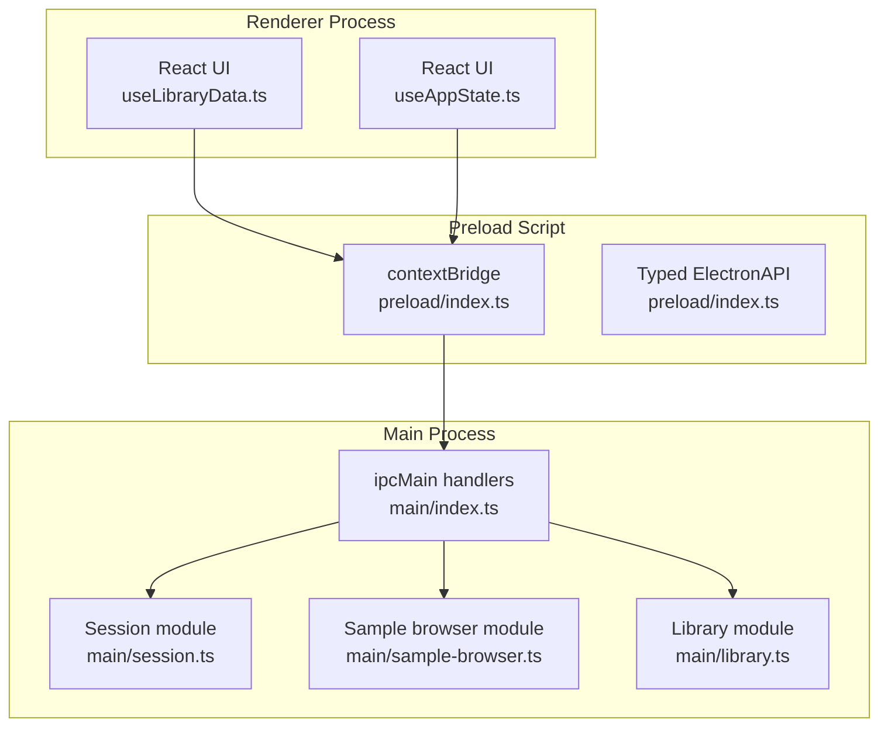
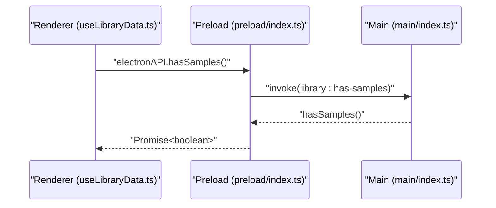
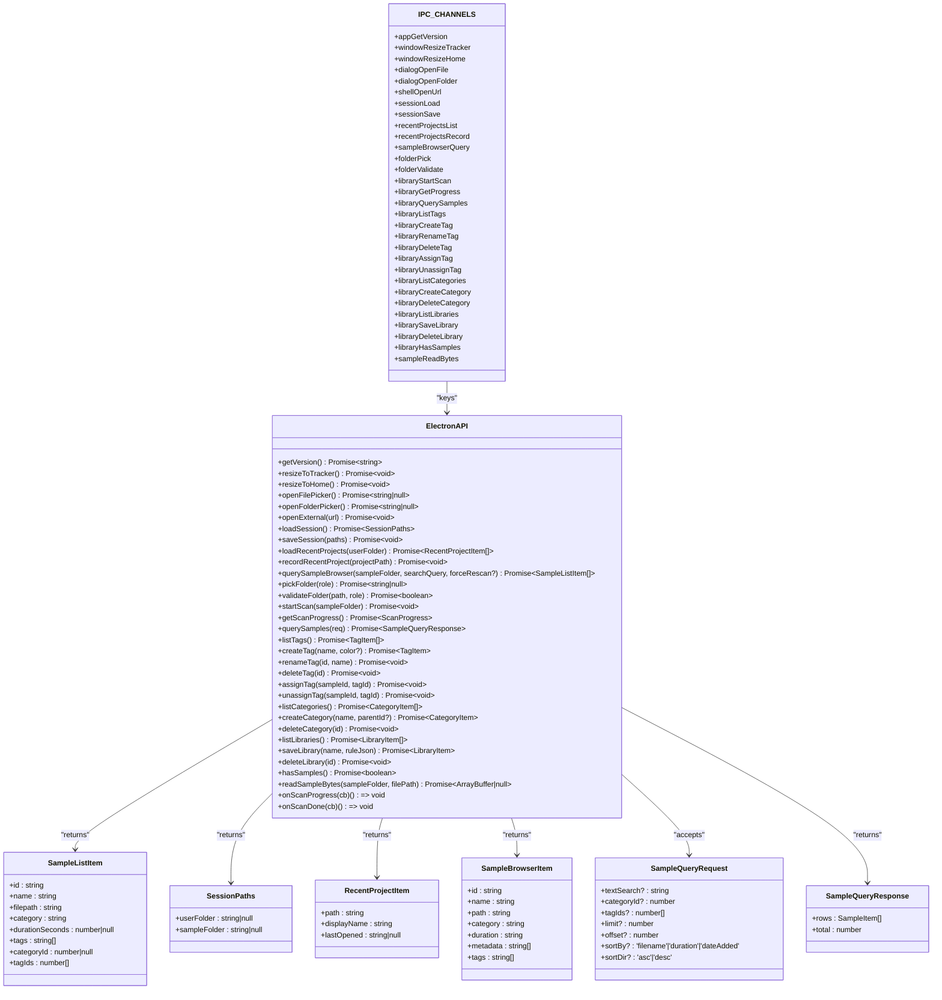
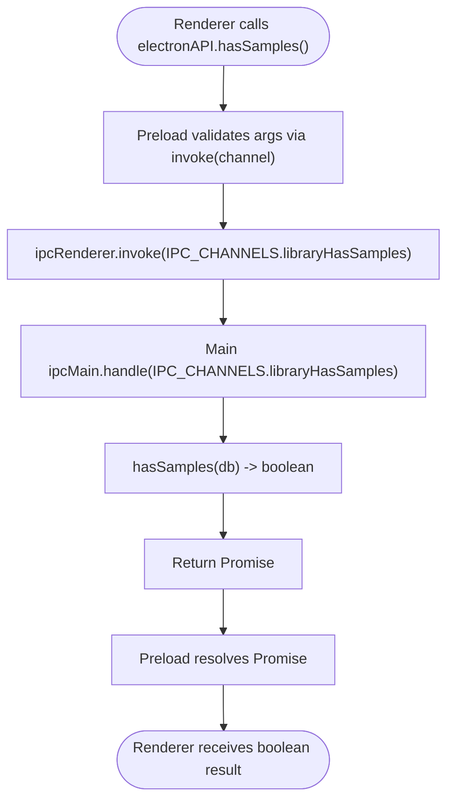
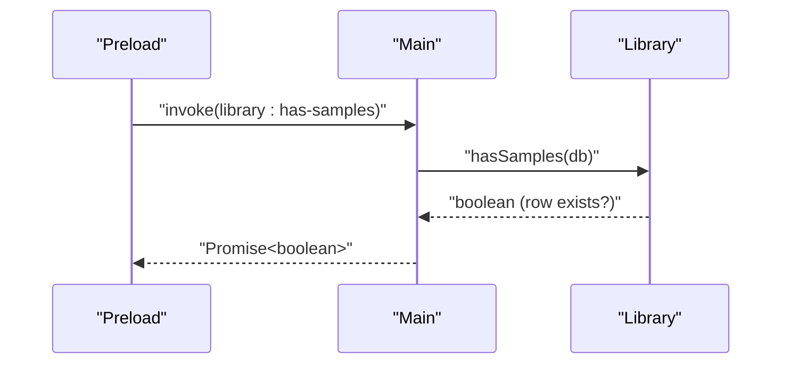
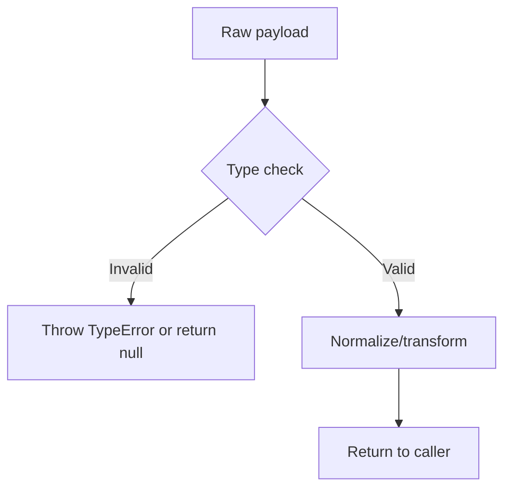
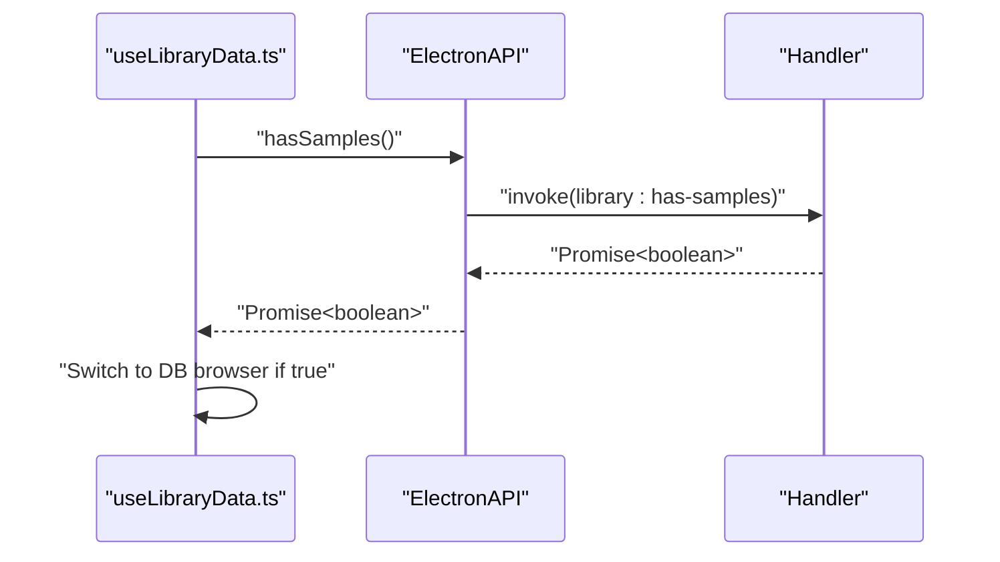
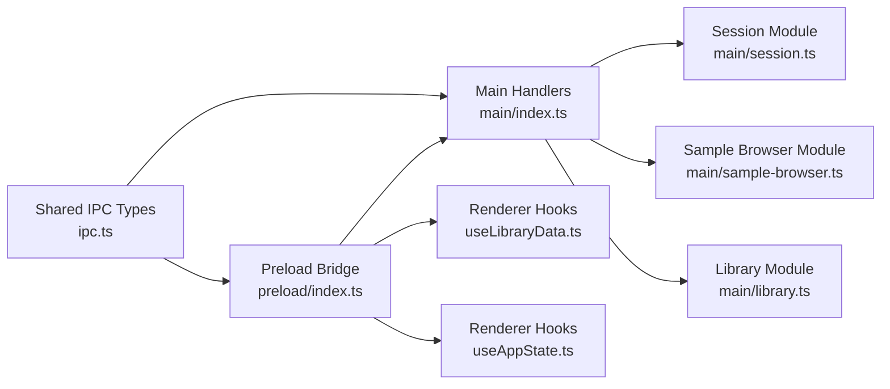

# IPC Communication

<cite>
**Referenced Files in This Document**
- [ipc.ts](file://src/shared/ipc.ts)
- [preload/index.ts](file://src/preload/index.ts)
- [main/index.ts](file://src/main/index.ts)
- [session.ts](file://src/main/session.ts)
- [sample-browser.ts](file://src/main/sample-browser.ts)
- [library.ts](file://src/main/library.ts)
- [window-config.ts](file://src/shared/window-config.ts)
- [electron.d.ts](file://src/renderer/src/electron.d.ts)
- [useAppState.ts](file://src/renderer/src/hooks/useAppState.ts)
- [useLibraryData.ts](file://src/renderer/src/hooks/useLibraryData.ts)
- [bootstrapApp.tsx](file://src/renderer/src/bootstrapApp.tsx)
- [electronApi.ts](file://src/renderer/src/test/electronApi.ts)
</cite>

## Update Summary
**Changes Made**
- Enhanced shared IPC interface with new SampleListItem interface for unified sample representation
- Added new libraryHasSamples IPC channel for determining sample availability in library database
- Improved input validation in main process IPC handlers with robust error handling
- Updated ElectronAPI type definitions to include new hasSamples method
- Enhanced renderer integration with unified sample list interface

## Table of Contents
1. [Introduction](#introduction)
2. [Project Structure](#project-structure)
3. [Core Components](#core-components)
4. [Architecture Overview](#architecture-overview)
5. [Detailed Component Analysis](#detailed-component-analysis)
6. [Dependency Analysis](#dependency-analysis)
7. [Performance Considerations](#performance-considerations)
8. [Troubleshooting Guide](#troubleshooting-guide)
9. [Conclusion](#conclusion)
10. [Appendices](#appendices)

## Introduction
This document describes the Inter-Process Communication (IPC) system used by MixJam Electron. It covers the IPC channels, their contracts, type-safe communication patterns, the security bridge implemented in the preload script, exposed Node.js APIs, and safe communication boundaries. It also documents message passing protocols, request/response patterns, error handling strategies, parameter validation, return value handling, practical examples, debugging techniques, performance considerations, security implications, process isolation benefits, and best practices for extending the IPC system.

## Project Structure
The IPC system spans three processes:
- Main process: Implements handlers for IPC channels and orchestrates Node.js APIs.
- Preload script: Exposes a typed API surface to the renderer via contextBridge.
- Renderer: Uses the typed API to invoke main-process capabilities safely.

**Diagram sources**
- [preload/index.ts:1-61](file://src/preload/index.ts#L1-L61)
- [main/index.ts:1-342](file://src/main/index.ts#L1-L342)
- [session.ts:1-265](file://src/main/session.ts#L1-L265)
- [sample-browser.ts:1-113](file://src/main/sample-browser.ts#L1-L113)
- [library.ts:1-536](file://src/main/library.ts#L1-L536)
- [useLibraryData.ts:1-412](file://src/renderer/src/hooks/useLibraryData.ts#L1-L412)
- [useAppState.ts:1-295](file://src/renderer/src/hooks/useAppState.ts#L1-L295)

**Section sources**
- [preload/index.ts:1-61](file://src/preload/index.ts#L1-L61)
- [main/index.ts:1-342](file://src/main/index.ts#L1-L342)
- [window-config.ts:1-54](file://src/shared/window-config.ts#L1-L54)

## Core Components
- IPC channel registry: Centralized channel names and shared types.
- Preload bridge: Exposes a typed ElectronAPI to the renderer.
- Main-process handlers: Implement request/response logic and validation.
- Shared data models: Define request/response payloads and enums.
- Unified sample interface: SampleListItem for consistent sample representation across legacy and database pipelines.

Key responsibilities:
- Channel registry defines contract boundaries and types.
- Preload ensures only declared methods are callable from renderer.
- Main handlers enforce parameter validation and return normalized data.
- Renderer consumes a strongly-typed API surface with unified sample types.

**Section sources**
- [ipc.ts:1-204](file://src/shared/ipc.ts#L1-L204)
- [preload/index.ts:1-61](file://src/preload/index.ts#L1-L61)
- [main/index.ts:1-342](file://src/main/index.ts#L1-L342)

## Architecture Overview
The system enforces strict process boundaries:
- Renderer calls preload-exposed methods.
- Preload uses ipcRenderer.invoke to send messages to main.
- Main responds via ipcMain.handle handlers.
- Responses flow back through the bridge to renderer.

**Diagram sources**
- [useLibraryData.ts:124-133](file://src/renderer/src/hooks/useLibraryData.ts#L124-L133)
- [preload/index.ts:44](file://src/preload/index.ts#L44)
- [main/index.ts:239](file://src/main/index.ts#L239)

**Section sources**
- [ipc.ts:1-204](file://src/shared/ipc.ts#L1-L204)
- [preload/index.ts:1-61](file://src/preload/index.ts#L1-L61)
- [main/index.ts:1-342](file://src/main/index.ts#L1-L342)

## Detailed Component Analysis

### IPC Channel Registry and Types
- Channel names are defined centrally to prevent drift between renderer and main.
- Shared types define request/response shapes and enums.
- ElectronAPI declares the renderer-facing contract.
- **New**: SampleListItem interface provides unified sample representation across legacy and database pipelines.

**Diagram sources**
- [ipc.ts:1-204](file://src/shared/ipc.ts#L1-L204)

**Section sources**
- [ipc.ts:1-204](file://src/shared/ipc.ts#L1-L204)

### Security Bridge in Preload
- contextBridge exposes a minimal ElectronAPI to the renderer.
- All renderer calls go through ipcRenderer.invoke with declared channels.
- No Node.js APIs are directly exposed; only typed methods are callable.
- **Enhanced**: New hasSamples method exposed through the preload bridge.

**Diagram sources**
- [preload/index.ts:44](file://src/preload/index.ts#L44)
- [main/index.ts:239](file://src/main/index.ts#L239)
- [library.ts:231-235](file://src/main/library.ts#L231-L235)

**Section sources**
- [preload/index.ts:1-61](file://src/preload/index.ts#L1-L61)
- [window-config.ts:30-36](file://src/shared/window-config.ts#L30-L36)

### Main-Process Handlers and Validation
- Each handler validates arguments and returns normalized results.
- **Improved**: Enhanced input validation with robust error handling and type checking.
- Some handlers perform additional checks (e.g., URL protocol/host whitelist).
- Caching is used for expensive operations (sample browser scans).
- **New**: libraryHasSamples handler returns boolean indicating database population status.

**Diagram sources**
- [main/index.ts:239](file://src/main/index.ts#L239)
- [library.ts:231-235](file://src/main/library.ts#L231-L235)

**Section sources**
- [main/index.ts:104-117](file://src/main/index.ts#L104-L117)
- [main/index.ts:119-127](file://src/main/index.ts#L119-L127)
- [main/index.ts:129-138](file://src/main/index.ts#L129-L138)
- [main/index.ts:140-153](file://src/main/index.ts#L140-L153)
- [main/index.ts:155-169](file://src/main/index.ts#L155-L169)
- [main/index.ts:224-231](file://src/main/index.ts#L224-L231)
- [main/index.ts:235-237](file://src/main/index.ts#L235-L237)
- [main/index.ts:239](file://src/main/index.ts#L239)
- [main/index.ts:241-249](file://src/main/index.ts#L241-L249)
- [main/index.ts:251-259](file://src/main/index.ts#L251-L259)
- [main/index.ts:261-275](file://src/main/index.ts#L261-L275)
- [main/index.ts:277-287](file://src/main/index.ts#L277-L287)
- [main/index.ts:289-293](file://src/main/index.ts#L289-L293)
- [main/index.ts:295-308](file://src/main/index.ts#L295-L308)
- [main/index.ts:310-341](file://src/main/index.ts#L310-L341)

### Parameter Validation and Normalization
- Session paths are normalized to ensure consistent types.
- Recent projects are normalized, deduplicated, and sorted.
- Folder validation checks readability/writability and roles.
- URL opening is restricted to HTTPS and a known host list.
- **Enhanced**: Robust input validation with type checking and error throwing for invalid inputs.
- **New**: SampleQueryRequest normalization with safe defaults and validation.

**Diagram sources**
- [main/index.ts:109-117](file://src/main/index.ts#L109-L117)
- [main/index.ts:243-249](file://src/main/index.ts#L243-L249)
- [main/index.ts:279-287](file://src/main/index.ts#L279-L287)
- [main/index.ts:297-302](file://src/main/index.ts#L297-L302)
- [ipc.ts:120-132](file://src/shared/ipc.ts#L120-L132)

**Section sources**
- [session.ts:59-65](file://src/main/session.ts#L59-L65)
- [session.ts:114-135](file://src/main/session.ts#L114-L135)
- [session.ts:52-57](file://src/main/session.ts#L52-L57)
- [main/index.ts:150-153](file://src/main/index.ts#L150-L153)
- [main/index.ts:155-169](file://src/main/index.ts#L155-L169)
- [main/index.ts:243-249](file://src/main/index.ts#L243-L249)
- [main/index.ts:279-287](file://src/main/index.ts#L279-L287)
- [main/index.ts:297-302](file://src/main/index.ts#L297-L302)
- [ipc.ts:120-132](file://src/shared/ipc.ts#L120-L132)

### Request/Response Patterns and Error Handling
- Renderer uses Promise-based invocations and handles errors gracefully.
- Handlers return null or empty arrays when inputs are invalid.
- UI components debounce and cancel stale requests to avoid race conditions.
- **Enhanced**: Improved error handling with type-safe validation and graceful degradation.
- **New**: hasSamples method provides reliable database availability detection.

**Diagram sources**
- [useLibraryData.ts:124-133](file://src/renderer/src/hooks/useLibraryData.ts#L124-L133)
- [preload/index.ts:44](file://src/preload/index.ts#L44)
- [main/index.ts:239](file://src/main/index.ts#L239)

**Section sources**
- [useLibraryData.ts:124-133](file://src/renderer/src/hooks/useLibraryData.ts#L124-L133)
- [useAppState.ts:49-69](file://src/renderer/src/hooks/useAppState.ts#L49-L69)
- [useAppState.ts:71-91](file://src/renderer/src/hooks/useAppState.ts#L71-L91)

### Practical Examples
Common IPC operations demonstrated in the renderer:
- Get app version and display it in the UI.
- Load recent projects filtered by user folder.
- Query the sample browser with debounced search and optional rescan.
- Open external URLs with security restrictions.
- Resize windows between home and tracker views.
- Open file and folder pickers and record recent projects.
- **New**: Check database availability with hasSamples() for seamless transition between legacy and database browsing.
- **Enhanced**: Unified sample list interface through SampleListItem for consistent sample representation.

These operations illustrate:
- Typed API usage.
- Error handling and loading states.
- Debouncing and cancellation to prevent stale results.
- Security constraints enforced in main.
- **New**: Database availability detection for feature switching.

**Section sources**
- [useAppState.ts:49-69](file://src/renderer/src/hooks/useAppState.ts#L49-L69)
- [useAppState.ts:71-91](file://src/renderer/src/hooks/useAppState.ts#L71-L91)
- [useAppState.ts:93-124](file://src/renderer/src/hooks/useAppState.ts#L93-L124)
- [useAppState.ts:189-198](file://src/renderer/src/hooks/useAppState.ts#L189-L198)
- [useAppState.ts:200-211](file://src/renderer/src/hooks/useAppState.ts#L200-L211)
- [useAppState.ts:213-215](file://src/renderer/src/hooks/useAppState.ts#L213-L215)
- [useAppState.ts:217-219](file://src/renderer/src/hooks/useAppState.ts#L217-L219)
- [useAppState.ts:221-223](file://src/renderer/src/hooks/useAppState.ts#L221-L223)
- [useLibraryData.ts:124-133](file://src/renderer/src/hooks/useLibraryData.ts#L124-L133)
- [useLibraryData.ts:146-173](file://src/renderer/src/hooks/useLibraryData.ts#L146-L173)
- [useLibraryData.ts:175-202](file://src/renderer/src/hooks/useLibraryData.ts#L175-L202)

### Debugging Techniques
- Log errors from Promise catches in renderer hooks.
- Use test doubles to simulate IPC behavior during unit tests.
- Verify channel names and argument counts in preload handlers.
- Confirm main-process handlers return expected normalized types.
- **Enhanced**: Monitor hasSamples() responses for database readiness.
- **New**: Track SampleListItem conversion between legacy and database pipelines.

Practical references:
- Renderer error logging and fallbacks.
- Test helper that creates a mock ElectronAPI.

**Section sources**
- [useAppState.ts:59-64](file://src/renderer/src/hooks/useAppState.ts#L59-L64)
- [useAppState.ts:81-86](file://src/renderer/src/hooks/useAppState.ts#L81-L86)
- [useAppState.ts:112-117](file://src/renderer/src/hooks/useAppState.ts#L112-L117)
- [electronApi.ts:39-61](file://src/renderer/src/test/electronApi.ts#L39-L61)

## Dependency Analysis
The IPC system exhibits low coupling and high cohesion:
- Preload depends on shared channel names and types.
- Main handlers depend on shared types and internal modules.
- Renderer depends on the typed API surface.
- **New**: useLibraryData hook depends on unified SampleListItem interface.

**Diagram sources**
- [ipc.ts:1-204](file://src/shared/ipc.ts#L1-L204)
- [preload/index.ts:1-61](file://src/preload/index.ts#L1-L61)
- [main/index.ts:1-342](file://src/main/index.ts#L1-L342)
- [session.ts:1-265](file://src/main/session.ts#L1-L265)
- [sample-browser.ts:1-113](file://src/main/sample-browser.ts#L1-L113)
- [library.ts:1-536](file://src/main/library.ts#L1-L536)
- [useLibraryData.ts:1-412](file://src/renderer/src/hooks/useLibraryData.ts#L1-L412)
- [useAppState.ts:1-295](file://src/renderer/src/hooks/useAppState.ts#L1-L295)

**Section sources**
- [ipc.ts:1-204](file://src/shared/ipc.ts#L1-L204)
- [preload/index.ts:1-61](file://src/preload/index.ts#L1-L61)
- [main/index.ts:1-342](file://src/main/index.ts#L1-L342)

## Performance Considerations
- Debounce search queries to reduce IPC churn and filesystem scans.
- Use caching for sample browser scans keyed by folder path.
- Normalize and deduplicate recent projects to minimize IO and sorting overhead.
- Avoid blocking the main thread with heavy filesystem operations; leverage caching and incremental updates.
- **Enhanced**: Use hasSamples() to avoid unnecessary database queries when no samples exist.
- **New**: Unified SampleListItem interface reduces conversion overhead between pipelines.

## Troubleshooting Guide
Common issues and resolutions:
- Channel mismatch: Ensure channel names in preload match main handlers.
- Type mismatches: Validate argument types in handlers and normalize payloads.
- Permission errors: Confirm folder permissions and existence before operations.
- Stale results: Implement sequence numbers or cancellation to avoid race conditions.
- URL failures: Verify protocol and hostname against allowed lists.
- **New**: Database readiness: Use hasSamples() to detect when database scanning has completed.
- **Enhanced**: Input validation errors: Check for TypeError exceptions thrown by handlers with invalid inputs.

**Section sources**
- [main/index.ts:109-117](file://src/main/index.ts#L109-L117)
- [main/index.ts:119-127](file://src/main/index.ts#L119-L127)
- [main/index.ts:129-138](file://src/main/index.ts#L129-L138)
- [main/index.ts:140-153](file://src/main/index.ts#L140-L153)
- [main/index.ts:155-169](file://src/main/index.ts#L155-L169)
- [main/index.ts:243-249](file://src/main/index.ts#L243-L249)
- [main/index.ts:279-287](file://src/main/index.ts#L279-L287)
- [main/index.ts:297-302](file://src/main/index.ts#L297-L302)
- [useAppState.ts:93-124](file://src/renderer/src/hooks/useAppState.ts#L93-L124)
- [useLibraryData.ts:124-133](file://src/renderer/src/hooks/useLibraryData.ts#L124-L133)

## Conclusion
The IPC system in MixJam Electron is designed around strong typing, process isolation, and explicit contracts. The preload bridge enforces a minimal, secure API surface, while main handlers validate inputs, normalize outputs, and implement robust error handling. The renderer consumes a typed API that is easy to test and debug. The enhanced shared IPC interface now provides a unified SampleListItem for consistent sample representation across legacy and database pipelines, while the new hasSamples IPC channel enables seamless feature switching. Extending the system requires updating the channel registry, implementing handlers with validation, and exposing new methods through the preload bridge.

## Appendices

### IPC Channels and Contracts
- app:get-version: Returns application version string.
- window:resize-tracker: Resizes main window to tracker size.
- window:resize-home: Resizes main window to home size.
- dialog:open-file: Opens file picker; returns selected path or null.
- dialog:open-folder: Opens folder picker; returns selected path or null.
- shell:open-url: Opens external URL if allowed; returns void.
- session:load: Loads persisted session paths.
- session:save: Saves session paths; returns void.
- recent-projects:list: Lists recent projects filtered by user folder.
- recent-projects:record: Records a recent project; returns void.
- sample-browser:query: Queries sample browser with optional rescan.
- folder:pick: Picks a folder for a given role; returns path or null.
- folder:validate: Validates a folder for a given role; returns boolean.
- library:start-scan: Starts library scanning process.
- library:get-progress: Gets current scan progress.
- library:query-samples: Queries samples from database with filters.
- library:list-tags: Lists all tags.
- library:create-tag: Creates a new tag.
- library:rename-tag: Renames an existing tag.
- library:delete-tag: Deletes a tag.
- library:assign-tag: Assigns a tag to a sample.
- library:unassign-tag: Removes a tag from a sample.
- library:list-categories: Lists all categories.
- library:create-category: Creates a new category.
- library:delete-category: Deletes a category.
- library:list-libraries: Lists all libraries.
- library:save-library: Saves current filters as a library.
- library:delete-library: Deletes a library.
- library:has-samples: Checks if library database contains samples.
- sample:read-bytes: Reads raw bytes from sample file.

**Section sources**
- [ipc.ts:4-35](file://src/shared/ipc.ts#L4-L35)
- [main/index.ts:126](file://src/main/index.ts#L126)
- [main/index.ts:128-136](file://src/main/index.ts#L128-L136)
- [main/index.ts:138-153](file://src/main/index.ts#L138-L153)
- [main/index.ts:155-169](file://src/main/index.ts#L155-L169)
- [main/index.ts:180-189](file://src/main/index.ts#L180-L189)
- [main/index.ts:191-201](file://src/main/index.ts#L191-L201)
- [main/index.ts:203-206](file://src/main/index.ts#L203-L206)
- [main/index.ts:224-231](file://src/main/index.ts#L224-L231)
- [main/index.ts:233](file://src/main/index.ts#L233)
- [main/index.ts:235-237](file://src/main/index.ts#L235-L237)
- [main/index.ts:241](file://src/main/index.ts#L241)
- [main/index.ts:243-249](file://src/main/index.ts#L243-L249)
- [main/index.ts:251-259](file://src/main/index.ts#L251-L259)
- [main/index.ts:261-275](file://src/main/index.ts#L261-L275)
- [main/index.ts:277](file://src/main/index.ts#L277)
- [main/index.ts:279-287](file://src/main/index.ts#L279-L287)
- [main/index.ts:289-293](file://src/main/index.ts#L289-L293)
- [main/index.ts:295](file://src/main/index.ts#L295)
- [main/index.ts:297-308](file://src/main/index.ts#L297-L308)
- [main/index.ts:309-309](file://src/main/index.ts#L309-L309)
- [main/index.ts:310-341](file://src/main/index.ts#L310-L341)
- [main/index.ts:239](file://src/main/index.ts#L239)

### Renderer Integration Notes
- The global window electronAPI type is declared for TypeScript safety.
- UI components consume the typed API and manage loading/error states.
- Bootstrap sets up the React app; IPC usage is encapsulated in hooks.
- **Enhanced**: useLibraryData hook now uses unified SampleListItem interface.
- **New**: hasSamples() method enables database availability detection.

**Section sources**
- [electron.d.ts:1-9](file://src/renderer/src/electron.d.ts#L1-L9)
- [useLibraryData.ts:1-412](file://src/renderer/src/hooks/useLibraryData.ts#L1-L412)
- [useAppState.ts:1-295](file://src/renderer/src/hooks/useAppState.ts#L1-L295)
- [bootstrapApp.tsx:1-19](file://src/renderer/src/bootstrapApp.tsx#L1-L19)

### Data Model Enhancements
- **New**: SampleListItem interface provides unified sample representation with:
  - id: string (file path or unique identifier)
  - name: string (display name)
  - filepath: string (full file path)
  - category: string (category name)
  - durationSeconds: number | null (duration in seconds)
  - tags: string[] (tag names)
  - categoryId: number | null (category ID)
  - tagIds: number[] (tag IDs)
- **Enhanced**: SampleQueryRequest normalization with robust validation and safe defaults.
- **New**: hasSamples() method returns boolean indicating database population status.

**Section sources**
- [ipc.ts:139-150](file://src/shared/ipc.ts#L139-L150)
- [ipc.ts:120-132](file://src/shared/ipc.ts#L120-L132)
- [library.ts:231-235](file://src/main/library.ts#L231-L235)