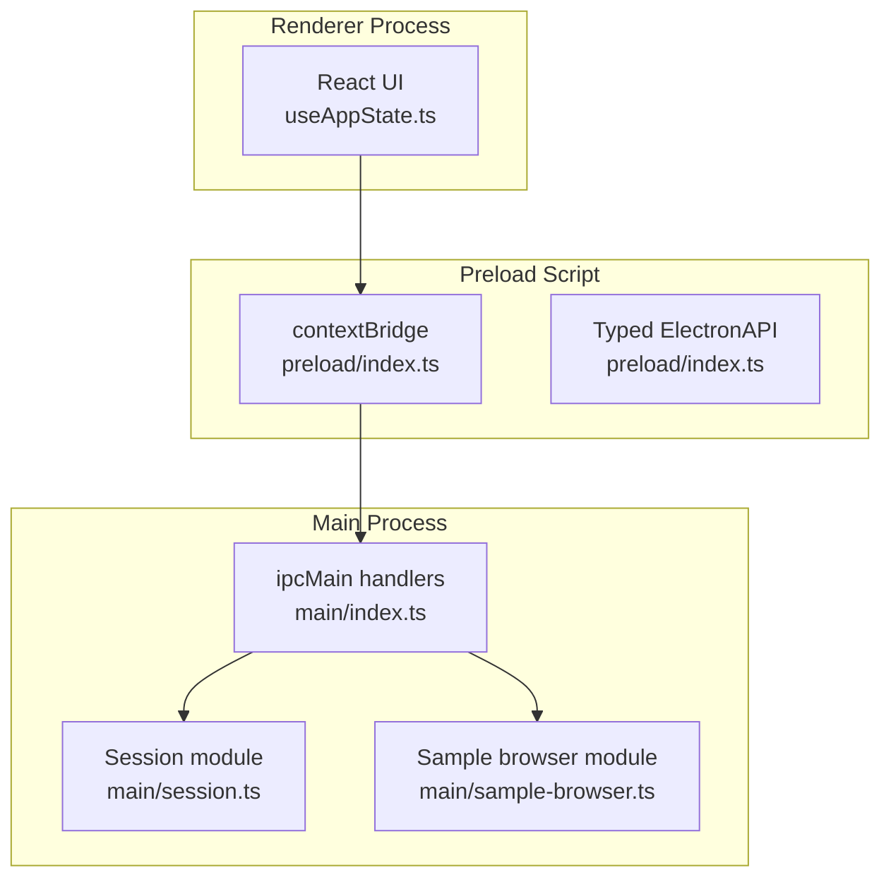
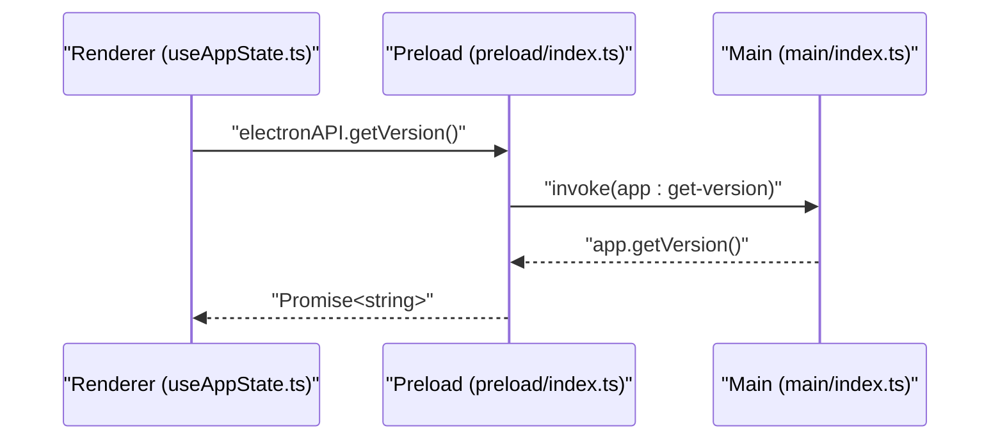
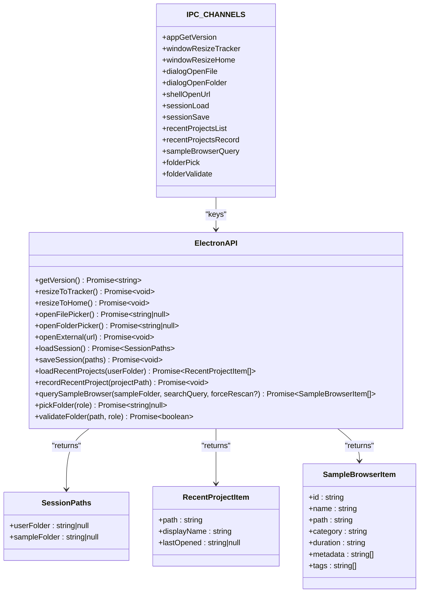
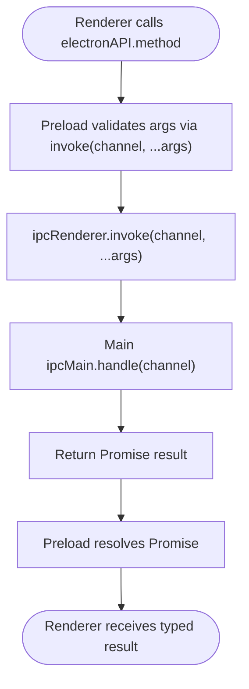
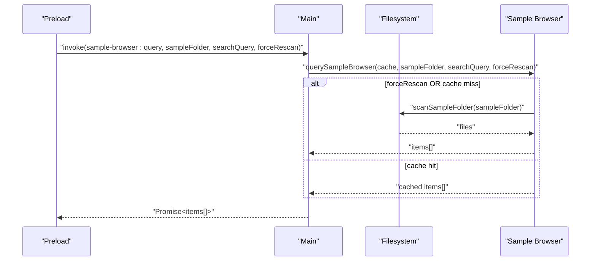
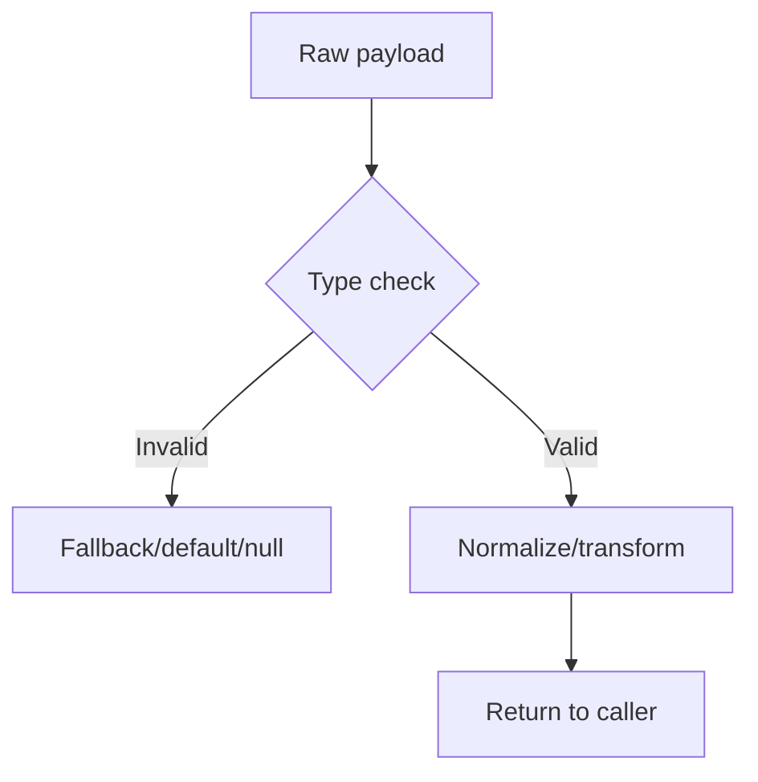
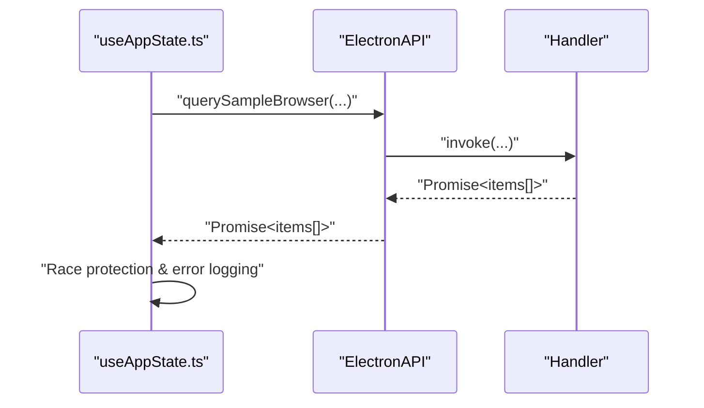
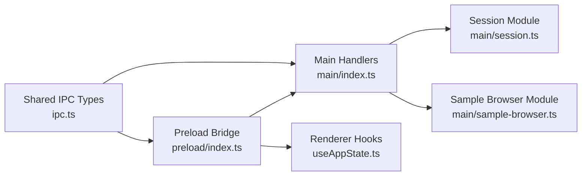

# IPC Communication

<cite>
**Referenced Files in This Document**
- [ipc.ts](file://src/shared/ipc.ts)
- [preload/index.ts](file://src/preload/index.ts)
- [main/index.ts](file://src/main/index.ts)
- [session.ts](file://src/main/session.ts)
- [sample-browser.ts](file://src/main/sample-browser.ts)
- [window-config.ts](file://src/shared/window-config.ts)
- [electron.d.ts](file://src/renderer/src/electron.d.ts)
- [useAppState.ts](file://src/renderer/src/hooks/useAppState.ts)
- [bootstrapApp.tsx](file://src/renderer/src/bootstrapApp.tsx)
- [electronApi.ts](file://src/renderer/src/test/electronApi.ts)
</cite>

## Table of Contents
1. [Introduction](#introduction)
2. [Project Structure](#project-structure)
3. [Core Components](#core-components)
4. [Architecture Overview](#architecture-overview)
5. [Detailed Component Analysis](#detailed-component-analysis)
6. [Dependency Analysis](#dependency-analysis)
7. [Performance Considerations](#performance-considerations)
8. [Troubleshooting Guide](#troubleshooting-guide)
9. [Conclusion](#conclusion)
10. [Appendices](#appendices)

## Introduction
This document describes the Inter-Process Communication (IPC) system used by MixJam Electron. It covers the IPC channels, their contracts, type-safe communication patterns, the security bridge implemented in the preload script, exposed Node.js APIs, and safe communication boundaries. It also documents message passing protocols, request/response patterns, error handling strategies, parameter validation, return value handling, practical examples, debugging techniques, performance considerations, security implications, process isolation benefits, and best practices for extending the IPC system.

## Project Structure
The IPC system spans three processes:
- Main process: Implements handlers for IPC channels and orchestrates Node.js APIs.
- Preload script: Exposes a typed API surface to the renderer via contextBridge.
- Renderer: Uses the typed API to invoke main-process capabilities safely.

**Diagram sources**
- [preload/index.ts:1-29](file://src/preload/index.ts#L1-L29)
- [main/index.ts:1-170](file://src/main/index.ts#L1-L170)
- [session.ts:1-265](file://src/main/session.ts#L1-L265)
- [sample-browser.ts:1-113](file://src/main/sample-browser.ts#L1-L113)
- [useAppState.ts:1-295](file://src/renderer/src/hooks/useAppState.ts#L1-L295)

**Section sources**
- [preload/index.ts:1-29](file://src/preload/index.ts#L1-L29)
- [main/index.ts:1-170](file://src/main/index.ts#L1-L170)
- [window-config.ts:1-54](file://src/shared/window-config.ts#L1-L54)

## Core Components
- IPC channel registry: Centralized channel names and shared types.
- Preload bridge: Exposes a typed ElectronAPI to the renderer.
- Main-process handlers: Implement request/response logic and validation.
- Shared data models: Define request/response payloads and enums.

Key responsibilities:
- Channel registry defines contract boundaries and types.
- Preload ensures only declared methods are callable from renderer.
- Main handlers enforce parameter validation and return normalized data.
- Renderer consumes a strongly-typed API surface.

**Section sources**
- [ipc.ts:1-59](file://src/shared/ipc.ts#L1-L59)
- [preload/index.ts:1-29](file://src/preload/index.ts#L1-L29)
- [main/index.ts:1-170](file://src/main/index.ts#L1-L170)

## Architecture Overview
The system enforces strict process boundaries:
- Renderer calls preload-exposed methods.
- Preload uses ipcRenderer.invoke to send messages to main.
- Main responds via ipcMain.handle handlers.
- Responses flow back through the bridge to renderer.

**Diagram sources**
- [useAppState.ts:49-69](file://src/renderer/src/hooks/useAppState.ts#L49-L69)
- [preload/index.ts:4-6](file://src/preload/index.ts#L4-L6)
- [main/index.ts:75](file://src/main/index.ts#L75)

**Section sources**
- [ipc.ts:1-59](file://src/shared/ipc.ts#L1-L59)
- [preload/index.ts:1-29](file://src/preload/index.ts#L1-L29)
- [main/index.ts:1-170](file://src/main/index.ts#L1-L170)

## Detailed Component Analysis

### IPC Channel Registry and Types
- Channel names are defined centrally to prevent drift between renderer and main.
- Shared types define request/response shapes and enums.
- ElectronAPI declares the renderer-facing contract.

**Diagram sources**
- [ipc.ts:1-59](file://src/shared/ipc.ts#L1-L59)

**Section sources**
- [ipc.ts:1-59](file://src/shared/ipc.ts#L1-L59)

### Security Bridge in Preload
- contextBridge exposes a minimal ElectronAPI to the renderer.
- All renderer calls go through ipcRenderer.invoke with declared channels.
- No Node.js APIs are directly exposed; only typed methods are callable.

**Diagram sources**
- [preload/index.ts:1-29](file://src/preload/index.ts#L1-L29)
- [main/index.ts:75-170](file://src/main/index.ts#L75-L170)

**Section sources**
- [preload/index.ts:1-29](file://src/preload/index.ts#L1-L29)
- [window-config.ts:30-36](file://src/shared/window-config.ts#L30-L36)

### Main-Process Handlers and Validation
- Each handler validates arguments and returns normalized results.
- Some handlers perform additional checks (e.g., URL protocol/host whitelist).
- Caching is used for expensive operations (sample browser scans).

**Diagram sources**
- [main/index.ts:129-138](file://src/main/index.ts#L129-L138)
- [sample-browser.ts:98-113](file://src/main/sample-browser.ts#L98-L113)

**Section sources**
- [main/index.ts:104-117](file://src/main/index.ts#L104-L117)
- [main/index.ts:119-127](file://src/main/index.ts#L119-L127)
- [main/index.ts:129-138](file://src/main/index.ts#L129-L138)
- [main/index.ts:140-153](file://src/main/index.ts#L140-L153)
- [main/index.ts:155-169](file://src/main/index.ts#L155-L169)
- [sample-browser.ts:98-113](file://src/main/sample-browser.ts#L98-L113)

### Parameter Validation and Normalization
- Session paths are normalized to ensure consistent types.
- Recent projects are normalized, deduplicated, and sorted.
- Folder validation checks readability/writability and roles.
- URL opening is restricted to HTTPS and a known host list.

**Diagram sources**
- [main/index.ts:109-117](file://src/main/index.ts#L109-L117)
- [session.ts:59-65](file://src/main/session.ts#L59-L65)
- [session.ts:114-135](file://src/main/session.ts#L114-L135)
- [main/index.ts:150-153](file://src/main/index.ts#L150-L153)
- [main/index.ts:155-169](file://src/main/index.ts#L155-L169)

**Section sources**
- [session.ts:59-65](file://src/main/session.ts#L59-L65)
- [session.ts:114-135](file://src/main/session.ts#L114-L135)
- [session.ts:52-57](file://src/main/session.ts#L52-L57)
- [main/index.ts:150-153](file://src/main/index.ts#L150-L153)
- [main/index.ts:155-169](file://src/main/index.ts#L155-L169)

### Request/Response Patterns and Error Handling
- Renderer uses Promise-based invocations and handles errors gracefully.
- Handlers return null or empty arrays when inputs are invalid.
- UI components debounce and cancel stale requests to avoid race conditions.

**Diagram sources**
- [useAppState.ts:93-124](file://src/renderer/src/hooks/useAppState.ts#L93-L124)
- [preload/index.ts:17-23](file://src/preload/index.ts#L17-L23)
- [main/index.ts:129-138](file://src/main/index.ts#L129-L138)

**Section sources**
- [useAppState.ts:93-124](file://src/renderer/src/hooks/useAppState.ts#L93-L124)
- [useAppState.ts:49-69](file://src/renderer/src/hooks/useAppState.ts#L49-L69)
- [useAppState.ts:71-91](file://src/renderer/src/hooks/useAppState.ts#L71-L91)

### Practical Examples
Common IPC operations demonstrated in the renderer:
- Get app version and display it in the UI.
- Load recent projects filtered by user folder.
- Query the sample browser with debounced search and optional rescan.
- Open external URLs with security restrictions.
- Resize windows between home and tracker views.
- Open file and folder pickers and record recent projects.

These operations illustrate:
- Typed API usage.
- Error handling and loading states.
- Debouncing and cancellation to prevent stale results.
- Security constraints enforced in main.

**Section sources**
- [useAppState.ts:49-69](file://src/renderer/src/hooks/useAppState.ts#L49-L69)
- [useAppState.ts:71-91](file://src/renderer/src/hooks/useAppState.ts#L71-L91)
- [useAppState.ts:93-124](file://src/renderer/src/hooks/useAppState.ts#L93-L124)
- [useAppState.ts:189-198](file://src/renderer/src/hooks/useAppState.ts#L189-L198)
- [useAppState.ts:200-211](file://src/renderer/src/hooks/useAppState.ts#L200-L211)
- [useAppState.ts:213-215](file://src/renderer/src/hooks/useAppState.ts#L213-L215)
- [useAppState.ts:217-219](file://src/renderer/src/hooks/useAppState.ts#L217-L219)
- [useAppState.ts:221-223](file://src/renderer/src/hooks/useAppState.ts#L221-L223)

### Debugging Techniques
- Log errors from Promise catches in renderer hooks.
- Use test doubles to simulate IPC behavior during unit tests.
- Verify channel names and argument counts in preload handlers.
- Confirm main-process handlers return expected normalized types.

Practical references:
- Renderer error logging and fallbacks.
- Test helper that creates a mock ElectronAPI.

**Section sources**
- [useAppState.ts:59-64](file://src/renderer/src/hooks/useAppState.ts#L59-L64)
- [useAppState.ts:81-86](file://src/renderer/src/hooks/useAppState.ts#L81-L86)
- [useAppState.ts:112-117](file://src/renderer/src/hooks/useAppState.ts#L112-L117)
- [electronApi.ts:39-61](file://src/renderer/src/test/electronApi.ts#L39-L61)

## Dependency Analysis
The IPC system exhibits low coupling and high cohesion:
- Preload depends on shared channel names and types.
- Main handlers depend on shared types and internal modules.
- Renderer depends on the typed API surface.

**Diagram sources**
- [ipc.ts:1-59](file://src/shared/ipc.ts#L1-L59)
- [preload/index.ts:1-29](file://src/preload/index.ts#L1-L29)
- [main/index.ts:1-170](file://src/main/index.ts#L1-L170)
- [session.ts:1-265](file://src/main/session.ts#L1-L265)
- [sample-browser.ts:1-113](file://src/main/sample-browser.ts#L1-L113)
- [useAppState.ts:1-295](file://src/renderer/src/hooks/useAppState.ts#L1-L295)

**Section sources**
- [ipc.ts:1-59](file://src/shared/ipc.ts#L1-L59)
- [preload/index.ts:1-29](file://src/preload/index.ts#L1-L29)
- [main/index.ts:1-170](file://src/main/index.ts#L1-L170)

## Performance Considerations
- Debounce search queries to reduce IPC churn and filesystem scans.
- Use caching for sample browser scans keyed by folder path.
- Normalize and deduplicate recent projects to minimize IO and sorting overhead.
- Avoid blocking the main thread with heavy filesystem operations; leverage caching and incremental updates.

[No sources needed since this section provides general guidance]

## Troubleshooting Guide
Common issues and resolutions:
- Channel mismatch: Ensure channel names in preload match main handlers.
- Type mismatches: Validate argument types in handlers and normalize payloads.
- Permission errors: Confirm folder permissions and existence before operations.
- Stale results: Implement sequence numbers or cancellation to avoid race conditions.
- URL failures: Verify protocol and hostname against allowed lists.

**Section sources**
- [main/index.ts:109-117](file://src/main/index.ts#L109-L117)
- [main/index.ts:119-127](file://src/main/index.ts#L119-L127)
- [main/index.ts:129-138](file://src/main/index.ts#L129-L138)
- [main/index.ts:140-153](file://src/main/index.ts#L140-L153)
- [main/index.ts:155-169](file://src/main/index.ts#L155-L169)
- [useAppState.ts:93-124](file://src/renderer/src/hooks/useAppState.ts#L93-L124)

## Conclusion
The IPC system in MixJam Electron is designed around strong typing, process isolation, and explicit contracts. The preload bridge enforces a minimal, secure API surface, while main handlers validate inputs, normalize outputs, and implement robust error handling. The renderer consumes a typed API that is easy to test and debug. Extending the system requires updating the channel registry, implementing handlers with validation, and exposing new methods through the preload bridge.

[No sources needed since this section summarizes without analyzing specific files]

## Appendices

### IPC Channels and Contracts
- app:get-version: Returns application version string.
- window:resize-tracker: Resizes main window to tracker size.
- window:resize-home: Resizes main window to home size.
- dialog:open-file: Opens file picker; returns selected path or null.
- dialog:open-folder: Opens folder picker; returns selected path or null.
- shell:open-url: Opens external URL if allowed; returns void.
- session:load: Loads persisted session paths.
- session:save: Saves session paths; returns void.
- recent-projects:list: Lists recent projects filtered by user folder.
- recent-projects:record: Records a recent project; returns void.
- sample-browser:query: Queries sample browser with optional rescan.
- folder:pick: Picks a folder for a given role; returns path or null.
- folder:validate: Validates a folder for a given role; returns boolean.

**Section sources**
- [ipc.ts:1-15](file://src/shared/ipc.ts#L1-L15)
- [main/index.ts:75](file://src/main/index.ts#L75)
- [main/index.ts:77-85](file://src/main/index.ts#L77-L85)
- [main/index.ts:87-102](file://src/main/index.ts#L87-L102)
- [main/index.ts:104-117](file://src/main/index.ts#L104-L117)
- [main/index.ts:119-127](file://src/main/index.ts#L119-L127)
- [main/index.ts:129-138](file://src/main/index.ts#L129-L138)
- [main/index.ts:140-153](file://src/main/index.ts#L140-L153)
- [main/index.ts:155-169](file://src/main/index.ts#L155-L169)

### Renderer Integration Notes
- The global window electronAPI type is declared for TypeScript safety.
- UI components consume the typed API and manage loading/error states.
- Bootstrap sets up the React app; IPC usage is encapsulated in hooks.

**Section sources**
- [electron.d.ts:1-9](file://src/renderer/src/electron.d.ts#L1-L9)
- [useAppState.ts:1-295](file://src/renderer/src/hooks/useAppState.ts#L1-L295)
- [bootstrapApp.tsx:1-19](file://src/renderer/src/bootstrapApp.tsx#L1-L19)