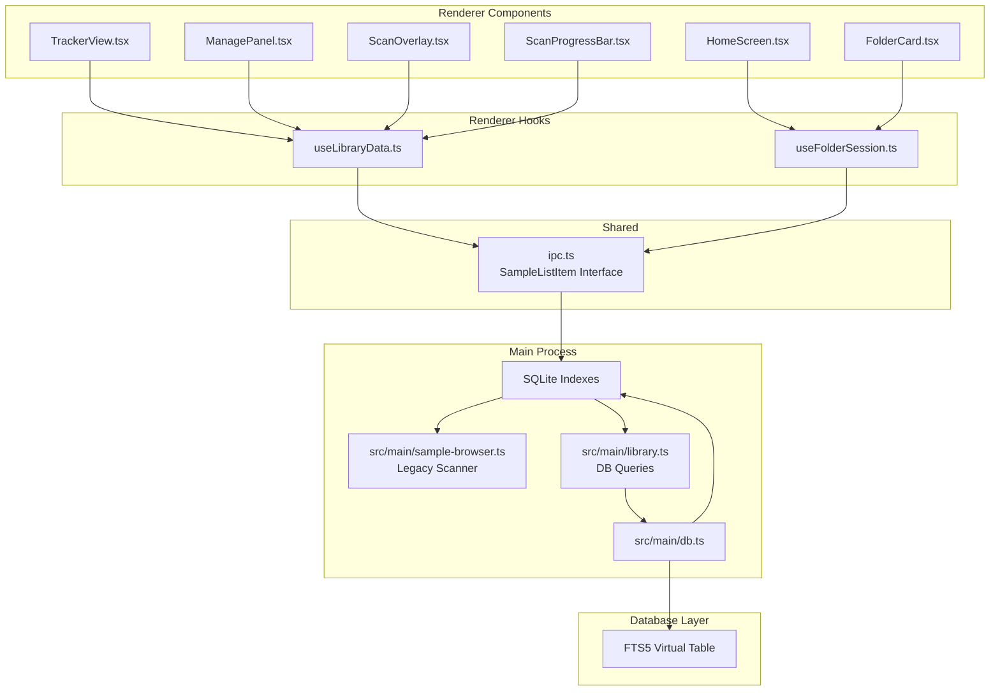
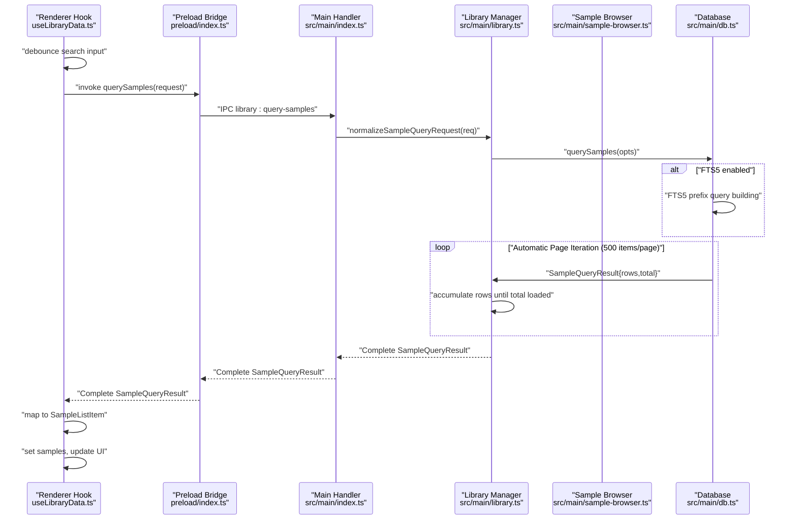
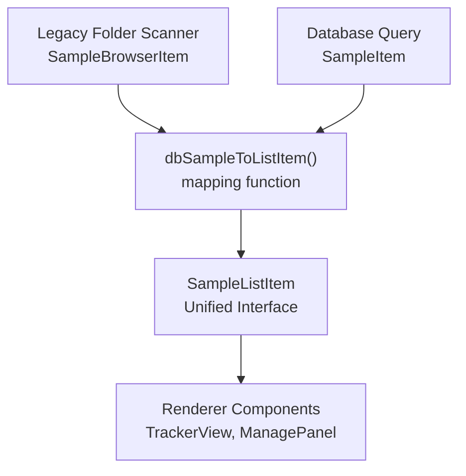
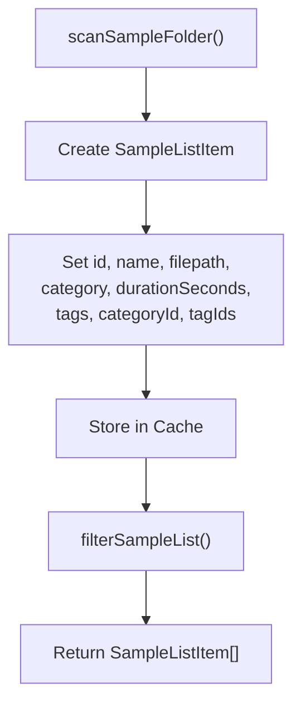
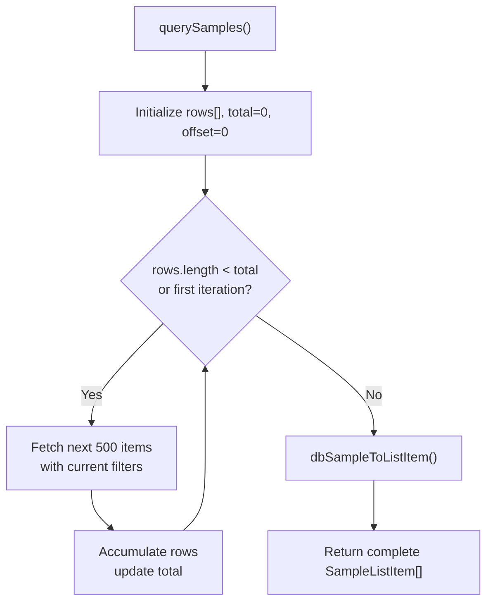
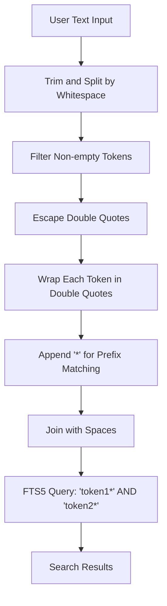
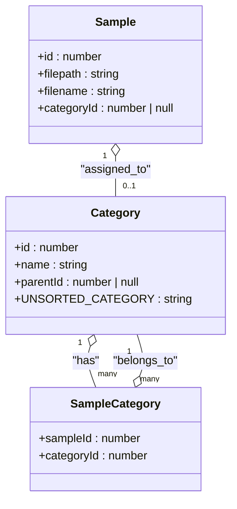
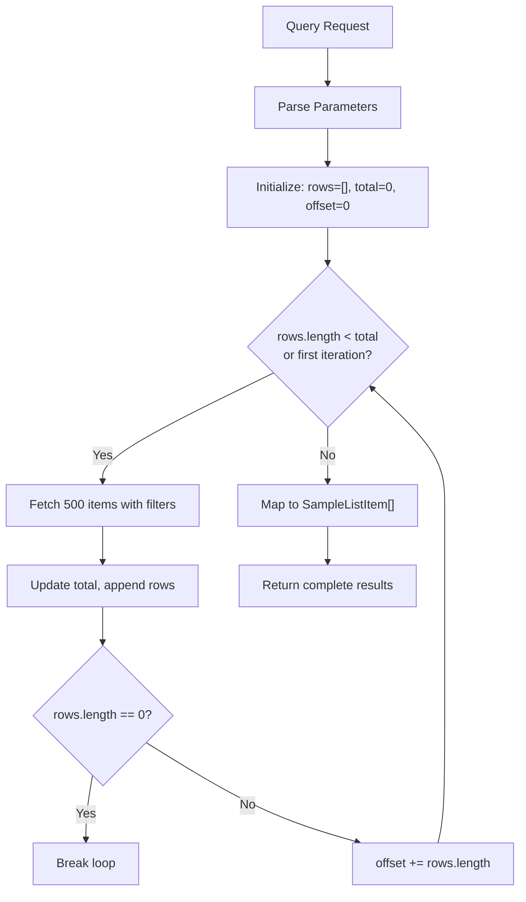
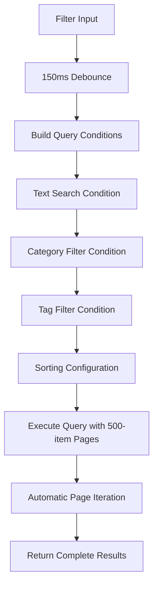
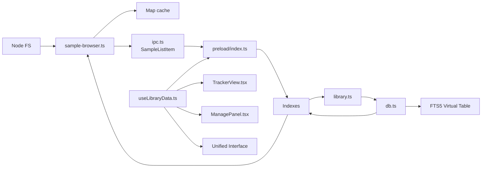

# Sample Browser

<cite>
**Referenced Files in This Document**
- [sample-browser.ts](file://src/main/sample-browser.ts)
- [library.ts](file://src/main/library.ts)
- [db.ts](file://src/main/db.ts)
- [index.ts (Main)](file://src/main/index.ts)
- [preload/index.ts](file://src/preload/index.ts)
- [ipc.ts](file://src/shared/ipc.ts)
- [useLibraryData.ts](file://src/renderer/src/hooks/useLibraryData.ts)
- [TrackerView.tsx](file://src/renderer/src/components/TrackerView.tsx)
- [HomeScreen.tsx](file://src/renderer/src/components/HomeScreen.tsx)
- [ManagePanel.tsx](file://src/renderer/src/components/ManagePanel.tsx)
- [FolderCard.tsx](file://src/renderer/src/components/FolderCard.tsx)
- [ScanOverlay.tsx](file://src/renderer/src/components/ScanOverlay.tsx)
- [ScanProgressBar.tsx](file://src/renderer/src/components/ScanProgressBar.tsx)
- [useFolderSession.ts](file://src/renderer/src/hooks/useFolderSession.ts)
- [useLibraryData.test.ts](file://src/renderer/src/hooks/useLibraryData.test.ts)
- [spec-004-sample-library.md](file://docs/specs/spec-004-sample-library.md)
- [data-model.md](file://docs/data-model.md)
- [indexing.md](file://docs/indexing.md)
- [query-schema.md](file://docs/query-schema.md)
- [architecture.md](file://docs/architecture.md)
</cite>

## Update Summary
**Changes Made**
- **Enhanced Paginated Loading System**: Implemented constant page size of 500 items with automatic iteration through all database pages for improved performance on large sample libraries
- **Automatic Full Library Loading**: Updated behavior where clearing category filters loads all matching samples rather than just the first page
- **Improved Performance**: Optimized database queries with constant page size for better memory management and faster response times
- **Enhanced User Experience**: Seamless loading of complete sample sets when category filters are cleared

## Table of Contents
1. [Introduction](#introduction)
2. [Project Structure](#project-structure)
3. [Core Components](#core-components)
4. [Architecture Overview](#architecture-overview)
5. [Detailed Component Analysis](#detailed-component-analysis)
6. [Advanced Features](#advanced-features)
7. [Dependency Analysis](#dependency-analysis)
8. [Performance Considerations](#performance-considerations)
9. [Troubleshooting Guide](#troubleshooting-guide)
10. [Conclusion](#conclusion)
11. [Appendices](#appendices)

## Introduction
This document explains the enhanced sample browser functionality in MixJam Electron, featuring a unified SampleListItem interface that standardizes data representation across all browsing modes. The system now provides consistent data shapes between the legacy folder browser and database query pipelines, eliminating inconsistencies in cold-start fallback scenarios. The enhanced architecture maintains sophisticated database-backed operations with FTS5 full-text search, hierarchical category filtering, tag-based organization, and an improved paginated loading system with constant page size for optimal performance on large sample libraries.

## Project Structure
The enhanced sample browser spans four integrated layers with unified data representation:
- Main process: file system scanning, SQLite database management, FTS5 indexing, and IPC handlers with consistent SampleListItem interface
- Database layer: schema management, query optimization, and full-text search capabilities
- Preload bridge: exposes typed IPC methods with unified SampleListItem interface to the renderer
- Renderer: comprehensive React component ecosystem with advanced filtering and UI patterns

**Diagram sources**
- [TrackerView.tsx:1-685](file://src/renderer/src/components/TrackerView.tsx#L1-L685)
- [useLibraryData.ts:1-427](file://src/renderer/src/hooks/useLibraryData.ts#L1-L427)
- [library.ts:1-536](file://src/main/library.ts#L1-L536)
- [db.ts:1-145](file://src/main/db.ts#L1-L145)
- [ipc.ts:139-150](file://src/shared/ipc.ts#L139-L150)

**Section sources**
- [TrackerView.tsx:1-685](file://src/renderer/src/components/TrackerView.tsx#L1-L685)
- [useLibraryData.ts:1-427](file://src/renderer/src/hooks/useLibraryData.ts#L1-L427)
- [library.ts:1-536](file://src/main/library.ts#L1-L536)
- [db.ts:1-145](file://src/main/db.ts#L1-L145)
- [ipc.ts:139-150](file://src/shared/ipc.ts#L139-L150)

## Core Components

### Unified SampleListItem Interface
The system now features a standardized data representation that ensures consistency across all browsing modes:
- **Consistent Fields**: id, name, filepath, category, durationSeconds, tags, categoryId, tagIds
- **Eliminates Inconsistencies**: Standardizes data shape between legacy folder browser and database query pipelines
- **Cold-Start Fallback**: Improves legacy scanner with consistent data structure matching indexed database browser
- **Streamlined Mapping**: Simplifies conversion between different data representations

### Enhanced Database Architecture
The system features a comprehensive SQLite-based architecture with:
- **FTS5 Virtual Table**: Full-text search with prefix matching and operator safety
- **Hierarchical Categories**: Recursive category trees with parent-child relationships
- **Tag Management**: Many-to-many relationships between samples and tags
- **Enhanced Pagination Support**: Constant page size of 500 items with automatic iteration through all database pages
- **Advanced Indexing**: Optimized indexes for performance on large datasets

### Advanced Filtering System
- **Text Search**: Safe FTS5 prefix queries that handle special characters
- **Category Filtering**: Hierarchical filtering with descendant inclusion
- **Tag Filtering**: Multi-tag selection with flexible combinations
- **Sorting Options**: Multiple columns with ascending/descending order
- **Real-time Updates**: Debounced queries with instant feedback

### Comprehensive React Component Ecosystem
- **TrackerView**: Main browser interface with category chips, tag filters, and sample tiles
- **ManagePanel**: Administrative interface for tags, categories, and saved libraries
- **ScanOverlay**: Progress indication during library scans
- **ScanProgressBar**: Compact progress display in the toolbar
- **FolderCard**: Interactive folder selection interface

**Section sources**
- [ipc.ts:139-150](file://src/shared/ipc.ts#L139-L150)
- [sample-browser.ts:62-71](file://src/main/sample-browser.ts#L62-L71)
- [library.ts:252-384](file://src/main/library.ts#L252-L384)
- [db.ts:87-104](file://src/main/db.ts#L87-L104)
- [useLibraryData.ts:175-202](file://src/renderer/src/hooks/useLibraryData.ts#L175-L202)
- [TrackerView.tsx:506-656](file://src/renderer/src/components/TrackerView.tsx#L506-L656)

## Architecture Overview
The enhanced sample browser implements a sophisticated three-tier architecture with unified data representation and improved pagination:
- **Main Process**: Heavy I/O operations, database management, and FTS5 indexing with consistent SampleListItem interface
- **Database Layer**: Schema management, query optimization, and full-text search
- **Renderer Process**: Rich UI components with advanced filtering and real-time updates

**Diagram sources**
- [useLibraryData.ts:175-202](file://src/renderer/src/hooks/useLibraryData.ts#L175-L202)
- [index.ts (Main):235-237](file://src/main/index.ts#L235-L237)
- [library.ts:281-384](file://src/main/library.ts#L281-L384)
- [ipc.ts:139-150](file://src/shared/ipc.ts#L139-L150)

**Section sources**
- [index.ts (Main):235-237](file://src/main/index.ts#L235-L237)
- [library.ts:281-384](file://src/main/library.ts#L281-L384)
- [useLibraryData.ts:175-202](file://src/renderer/src/hooks/useLibraryData.ts#L175-L202)
- [ipc.ts:139-150](file://src/shared/ipc.ts#L139-L150)

## Detailed Component Analysis

### Unified SampleListItem Interface Implementation
The system now provides a standardized data representation across all browsing modes:

**Diagram sources**
- [ipc.ts:139-150](file://src/shared/ipc.ts#L139-L150)
- [useLibraryData.ts:57-69](file://src/renderer/src/hooks/useLibraryData.ts#L57-L69)
- [sample-browser.ts:62-71](file://src/main/sample-browser.ts#L62-L71)

**Section sources**
- [ipc.ts:139-150](file://src/shared/ipc.ts#L139-L150)
- [useLibraryData.ts:57-69](file://src/renderer/src/hooks/useLibraryData.ts#L57-L69)
- [sample-browser.ts:62-71](file://src/main/sample-browser.ts#L62-L71)

### Legacy Folder Scanner with Unified Interface
The legacy folder scanner now produces consistent SampleListItem data:

**Diagram sources**
- [sample-browser.ts:26-77](file://src/main/sample-browser.ts#L26-L77)
- [sample-browser.ts:62-71](file://src/main/sample-browser.ts#L62-L71)

**Section sources**
- [sample-browser.ts:26-77](file://src/main/sample-browser.ts#L26-L77)
- [sample-browser.ts:62-71](file://src/main/sample-browser.ts#L62-L71)

### Enhanced Database Query Pipeline with Automatic Page Iteration
The database query pipeline now implements automatic page iteration with constant page size:

**Diagram sources**
- [library.ts:281-384](file://src/main/library.ts#L281-L384)
- [useLibraryData.ts:176-202](file://src/renderer/src/hooks/useLibraryData.ts#L176-L202)
- [useLibraryData.ts:57-69](file://src/renderer/src/hooks/useLibraryData.ts#L57-L69)

**Section sources**
- [library.ts:281-384](file://src/main/library.ts#L281-L384)
- [useLibraryData.ts:176-202](file://src/renderer/src/hooks/useLibraryData.ts#L176-L202)
- [useLibraryData.ts:57-69](file://src/renderer/src/hooks/useLibraryData.ts#L57-L69)

### FTS5 Full-Text Search Implementation
The system implements a sophisticated FTS5 search mechanism:
- **Safe Prefix Matching**: Each token wrapped in double quotes with trailing asterisk
- **Operator Safety**: Special characters escaped to prevent FTS5 syntax injection
- **Multi-token Support**: Whitespace-separated tokens combined with logical AND
- **Performance Optimization**: Virtual table with automatic trigger-based updates

**Diagram sources**
- [library.ts:258-265](file://src/main/library.ts#L258-L265)

**Section sources**
- [library.ts:258-265](file://src/main/library.ts#L258-L265)
- [db.ts:87-104](file://src/main/db.ts#L87-L104)

### Hierarchical Category System
The category system supports complex organizational structures:
- **Root Categories**: Derived from sample folder structure with "Unsorted" fallback
- **Subcategories**: Recursive hierarchy with unlimited depth
- **Category Trees**: Expandable UI with descendant filtering
- **Path-based Assignment**: Automatic category assignment based on file paths

**Diagram sources**
- [library.ts:104-182](file://src/main/library.ts#L104-L182)
- [library.ts:456-535](file://src/main/library.ts#L456-L535)

**Section sources**
- [library.ts:104-182](file://src/main/library.ts#L104-L182)
- [library.ts:456-535](file://src/main/library.ts#L456-L535)

### Enhanced Pagination and Windowed Queries
The system implements efficient pagination for large datasets with constant page size:
- **Constant Page Size**: Fixed 500 items per page for predictable memory usage
- **Automatic Iteration**: Continuous fetching until all matching samples are loaded
- **Offset-based Navigation**: Efficient cursor-based positioning with accumulated offsets
- **Total Count Tracking**: Accurate result counting for UI feedback
- **Performance Optimization**: Single query execution with automatic page accumulation

**Diagram sources**
- [library.ts:281-384](file://src/main/library.ts#L281-L384)
- [useLibraryData.ts:186-202](file://src/renderer/src/hooks/useLibraryData.ts#L186-L202)

**Section sources**
- [library.ts:281-384](file://src/main/library.ts#L281-L384)
- [useLibraryData.ts:186-202](file://src/renderer/src/hooks/useLibraryData.ts#L186-L202)

### Advanced Filtering Pipeline
The filtering system processes multiple criteria simultaneously:
- **Text Search**: FTS5 prefix matching with safety measures
- **Category Filters**: Recursive subtree expansion with CTE
- **Tag Filters**: Multi-tag selection with flexible combinations
- **Sorting**: Multiple columns with direction control
- **Debounced Updates**: 150ms debounce for performance

**Diagram sources**
- [useLibraryData.ts:216-248](file://src/renderer/src/hooks/useLibraryData.ts#L216-L248)
- [library.ts:281-384](file://src/main/library.ts#L281-L384)

**Section sources**
- [useLibraryData.ts:216-248](file://src/renderer/src/hooks/useLibraryData.ts#L216-L248)
- [library.ts:281-384](file://src/main/library.ts#L281-L384)

## Advanced Features

### Enhanced Manage Panel Interface
The ManagePanel provides comprehensive administrative capabilities:
- **Tag Management**: Create, rename, delete tags with color support
- **Category Management**: Hierarchical category creation and deletion
- **Library Management**: Save current filters as reusable libraries
- **Tabbed Interface**: Organized sections for different management tasks

### Scan Progress Visualization
Multiple components provide comprehensive scan progress feedback:
- **ScanOverlay**: Full-screen overlay during intensive scans
- **ScanProgressBar**: Compact progress indicator in toolbar
- **Real-time Updates**: Live progress reporting with phase information

### Responsive UI Patterns
The interface adapts to various screen sizes and user interactions:
- **Flexible Layout**: Resizable browser and tracker regions
- **Virtualized Rendering**: Efficient handling of large sample lists
- **Context Menus**: Right-click actions for advanced operations
- **Drag-and-Drop**: Seamless integration with the tracker interface

### Enhanced Category Filter Behavior
The category filtering system now provides improved user experience:
- **Automatic Full Loading**: Clearing category filters loads all matching samples
- **Seamless Transition**: Smooth transition from filtered to full library view
- **Performance Optimization**: Efficient loading of complete sample sets

**Section sources**
- [ManagePanel.tsx:1-242](file://src/renderer/src/components/ManagePanel.tsx#L1-L242)
- [ScanOverlay.tsx:1-39](file://src/renderer/src/components/ScanOverlay.tsx#L1-L39)
- [ScanProgressBar.tsx:1-19](file://src/renderer/src/components/ScanProgressBar.tsx#L1-L19)
- [TrackerView.tsx:241-261](file://src/renderer/src/components/TrackerView.tsx#L241-L261)
- [useLibraryData.ts:347-351](file://src/renderer/src/hooks/useLibraryData.ts#L347-L351)

## Dependency Analysis
The enhanced system has sophisticated interdependencies with unified data representation:
- **Main Process Dependencies**: SQLite database, FTS5 virtual tables, indexing triggers, unified SampleListItem interface
- **Renderer Dependencies**: React components, debounced queries, state management, unified SampleListItem interface
- **IPC Dependencies**: Typed interfaces, progress callbacks, error handling, unified SampleListItem interface
- **Database Dependencies**: Schema migrations, index maintenance, trigger synchronization

**Diagram sources**
- [sample-browser.ts:1-104](file://src/main/sample-browser.ts#L1-L104)
- [library.ts:1-536](file://src/main/library.ts#L1-L536)
- [db.ts:1-145](file://src/main/db.ts#L1-L145)
- [useLibraryData.ts:1-427](file://src/renderer/src/hooks/useLibraryData.ts#L1-L427)
- [ipc.ts:139-150](file://src/shared/ipc.ts#L139-L150)

**Section sources**
- [sample-browser.ts:1-104](file://src/main/sample-browser.ts#L1-L104)
- [library.ts:1-536](file://src/main/library.ts#L1-L536)
- [db.ts:1-145](file://src/main/db.ts#L1-L145)
- [useLibraryData.ts:1-427](file://src/renderer/src/hooks/useLibraryData.ts#L1-L427)
- [ipc.ts:139-150](file://src/shared/ipc.ts#L139-L150)

## Performance Considerations
The enhanced system implements multiple optimization strategies with unified data representation:
- **FTS5 Indexing**: Virtual table with automatic trigger-based updates
- **Enhanced Windowed Queries**: Constant 500-item page size with automatic iteration for optimal memory usage
- **Debounced Queries**: 150ms debounce for search and filter changes
- **Hierarchical CTE**: Recursive category queries with optimized execution plans
- **Virtualized Rendering**: Efficient DOM management for large lists
- **Schema Migration**: Versioned database schema with backward compatibility
- **Unified Interface**: Reduces data transformation overhead and improves consistency
- **Automatic Page Accumulation**: Seamless loading of complete sample sets when filters are cleared

### Performance Benchmarks
- **Full-text Search**: < 50ms against development dataset, target < 5ms for 100k+ rows
- **Category Filtering**: Recursive CTE with optimized subtree expansion
- **Tag Filtering**: Multi-index queries with efficient intersection operations
- **Enhanced Pagination**: 500-item pages with automatic iteration for large libraries
- **Data Mapping**: Streamlined conversion between legacy and database formats
- **Memory Usage**: Predictable memory footprint with constant page size

**Section sources**
- [spec-004-sample-library.md:147-155](file://docs/specs/spec-004-sample-library.md#L147-L155)
- [library.ts:281-384](file://src/main/library.ts#L281-L384)
- [db.ts:87-104](file://src/main/db.ts#L87-L104)
- [useLibraryData.ts:71](file://src/renderer/src/hooks/useLibraryData.ts#L71)

## Troubleshooting Guide
Enhanced troubleshooting for the advanced feature set with unified interface:

### Common Issues
- **FTS5 Search Failures**: Verify virtual table creation and trigger synchronization
- **Category Filtering Problems**: Check recursive CTE execution and category hierarchy
- **Pagination Errors**: Validate limit/offset parameters and COUNT query execution
- **Scan Progress Issues**: Monitor IPC progress events and database connection status
- **Memory Leaks**: Ensure proper cleanup of debounced timers and event listeners
- **Data Inconsistency**: Verify SampleListItem interface compliance across all pipelines
- **Page Loading Issues**: Check automatic page iteration logic and 500-item page size

### Diagnostic Steps
- **Database Health**: Verify schema version and migration completion
- **FTS5 Status**: Check virtual table integrity and trigger existence
- **Index Performance**: Analyze query execution plans and index usage
- **IPC Communication**: Validate typed interfaces and error handling
- **Component State**: Monitor React component lifecycle and state updates
- **Interface Compliance**: Ensure all data sources produce consistent SampleListItem format
- **Page Iteration Logic**: Verify automatic page accumulation and 500-item page size

**Section sources**
- [library.ts:123-143](file://src/main/library.ts#L123-L143)
- [db.ts:106-144](file://src/main/db.ts#L106-L144)
- [useLibraryData.ts:264-275](file://src/renderer/src/hooks/useLibraryData.ts#L264-L275)

## Conclusion
The enhanced sample browser represents a significant advancement in audio library management, featuring sophisticated database architecture, FTS5 full-text search, hierarchical organization, and comprehensive filtering capabilities. The introduction of the unified SampleListItem interface eliminates inconsistencies between legacy folder browser and database query pipelines, providing a consistent data shape across all browsing modes. The enhanced paginated loading system with constant 500-item page size and automatic page iteration significantly improves performance on large sample libraries, while the improved category filter behavior provides a seamless user experience when clearing filters. The system successfully balances performance with functionality, providing users with powerful tools for organizing and discovering large sample collections. The modular architecture ensures maintainability while the comprehensive component ecosystem delivers an intuitive user experience.

## Appendices

### Configuration Options
- **Supported Audio Formats**: WAV, MP3, FLAC, OGG, AIFF
- **Database Schema**: Versioned with automatic migration support
- **FTS5 Configuration**: Virtual table with automatic trigger synchronization
- **Enhanced Pagination Settings**: Constant 500 items per page with automatic iteration
- **Scan Intervals**: Manual triggering with progress monitoring
- **Cache Management**: Automatic cache per sample folder with forced refresh
- **Unified Interface**: Consistent SampleListItem data structure across all pipelines

**Section sources**
- [sample-browser.ts:26-77](file://src/main/sample-browser.ts#L26-L77)
- [db.ts:106-144](file://src/main/db.ts#L106-L144)
- [library.ts:281-384](file://src/main/library.ts#L281-L384)
- [ipc.ts:139-150](file://src/shared/ipc.ts#L139-L150)
- [useLibraryData.ts:71](file://src/renderer/src/hooks/useLibraryData.ts#L71)

### Advanced Features
- **FTS5 Full-Text Search**: Safe prefix matching with operator protection
- **Hierarchical Categories**: Recursive filtering with descendant inclusion
- **Tag-Based Organization**: Flexible many-to-many relationships
- **Enhanced Pagination Support**: Automatic page iteration with 500-item page size
- **Real-time Updates**: Debounced queries with instant UI feedback
- **Administrative Interface**: Comprehensive ManagePanel for system administration
- **Unified Data Interface**: Consistent SampleListItem format across all browsing modes
- **Legacy Fallback**: Improved cold-start scanner with standardized data structure
- **Automatic Full Library Loading**: Seamless loading of complete sample sets when filters are cleared

**Section sources**
- [library.ts:252-384](file://src/main/library.ts#L252-L384)
- [ManagePanel.tsx:1-242](file://src/renderer/src/components/ManagePanel.tsx#L1-L242)
- [useLibraryData.ts:216-248](file://src/renderer/src/hooks/useLibraryData.ts#L216-L248)
- [ipc.ts:139-150](file://src/shared/ipc.ts#L139-L150)
- [useLibraryData.ts:347-351](file://src/renderer/src/hooks/useLibraryData.ts#L347-L351)

### Performance Specifications
- **Search Performance**: < 50ms for development dataset, target < 5ms for 100k+ rows
- **Category Filtering**: Optimized recursive CTE execution
- **Tag Operations**: Efficient multi-index intersection queries
- **Memory Usage**: Predictable memory footprint with 500-item page size
- **Database Size**: Scalable SQLite database with proper indexing
- **Data Consistency**: Unified interface reduces transformation overhead and improves reliability
- **Page Loading Performance**: Automatic page iteration provides seamless loading experience

**Section sources**
- [spec-004-sample-library.md:147-155](file://docs/specs/spec-004-sample-library.md#L147-L155)
- [TrackerView.tsx:591-640](file://src/renderer/src/components/TrackerView.tsx#L591-L640)
- [db.ts:79-85](file://src/main/db.ts#L79-L85)
- [ipc.ts:139-150](file://src/shared/ipc.ts#L139-L150)
- [useLibraryData.ts:71](file://src/renderer/src/hooks/useLibraryData.ts#L71)