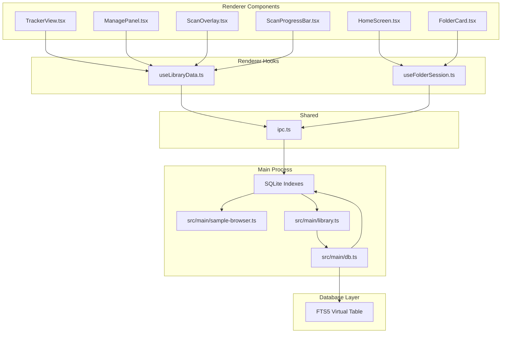
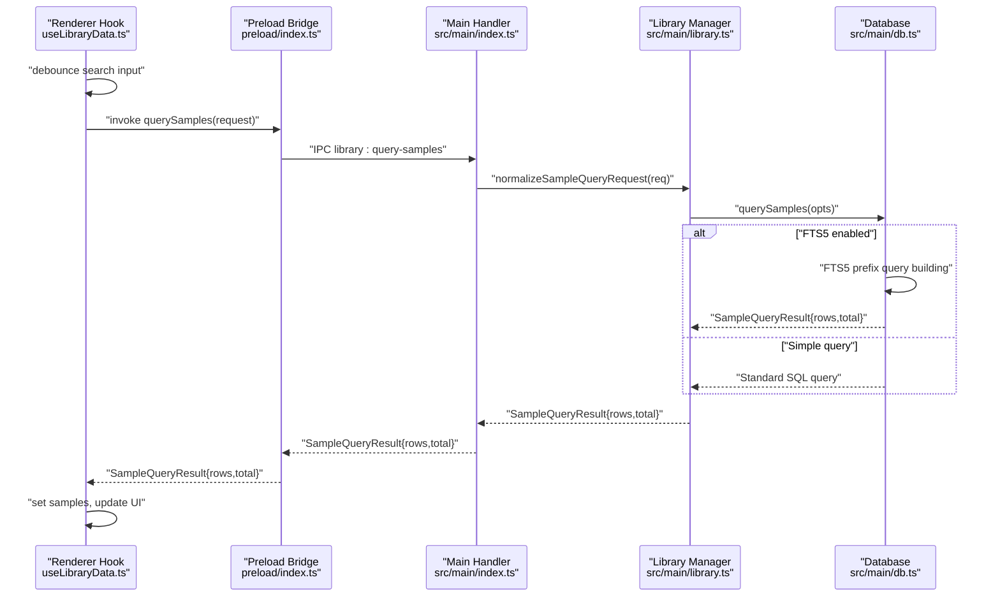
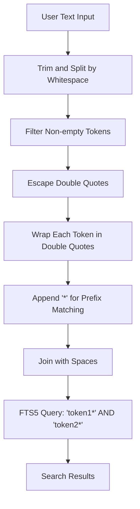
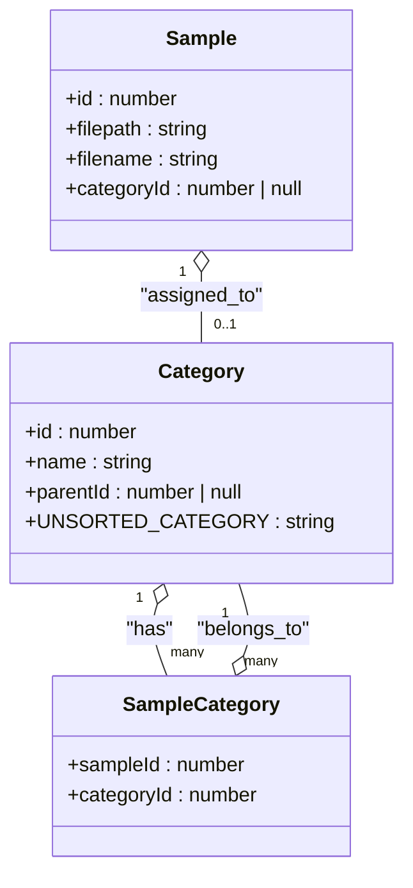
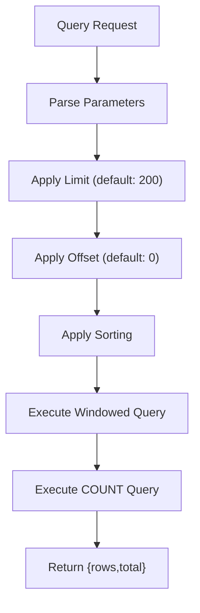
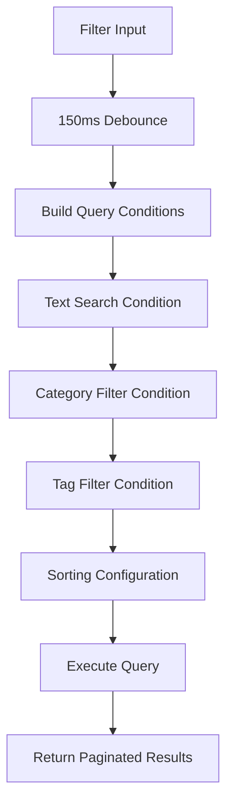
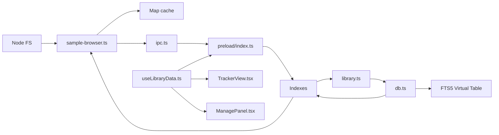

# Sample Browser

<cite>
**Referenced Files in This Document**
- [sample-browser.ts](file://src/main/sample-browser.ts)
- [library.ts](file://src/main/library.ts)
- [db.ts](file://src/main/db.ts)
- [index.ts (Main)](file://src/main/index.ts)
- [preload/index.ts](file://src/preload/index.ts)
- [ipc.ts](file://src/shared/ipc.ts)
- [useLibraryData.ts](file://src/renderer/src/hooks/useLibraryData.ts)
- [TrackerView.tsx](file://src/renderer/src/components/TrackerView.tsx)
- [HomeScreen.tsx](file://src/renderer/src/components/HomeScreen.tsx)
- [ManagePanel.tsx](file://src/renderer/src/components/ManagePanel.tsx)
- [FolderCard.tsx](file://src/renderer/src/components/FolderCard.tsx)
- [ScanOverlay.tsx](file://src/renderer/src/components/ScanOverlay.tsx)
- [ScanProgressBar.tsx](file://src/renderer/src/components/ScanProgressBar.tsx)
- [useFolderSession.ts](file://src/renderer/src/hooks/useFolderSession.ts)
- [spec-004-sample-library.md](file://docs/specs/spec-004-sample-library.md)
- [data-model.md](file://docs/data-model.md)
- [indexing.md](file://docs/indexing.md)
- [query-schema.md](file://docs/query-schema.md)
- [architecture.md](file://docs/architecture.md)
</cite>

## Update Summary
**Changes Made**
- Enhanced FTS5 full-text search integration with prefix matching and operator safety
- Added pagination support with windowed query results
- Introduced advanced filtering capabilities with category trees and tag-based filtering
- Implemented comprehensive React component ecosystem including ManagePanel and ScanOverlay
- Added hierarchical category system with recursive filtering
- Enhanced performance with virtualized rendering and debounced queries

## Table of Contents
1. [Introduction](#introduction)
2. [Project Structure](#project-structure)
3. [Core Components](#core-components)
4. [Architecture Overview](#architecture-overview)
5. [Detailed Component Analysis](#detailed-component-analysis)
6. [Advanced Features](#advanced-features)
7. [Dependency Analysis](#dependency-analysis)
8. [Performance Considerations](#performance-considerations)
9. [Troubleshooting Guide](#troubleshooting-guide)
10. [Conclusion](#conclusion)
11. [Appendices](#appendices)

## Introduction
This document explains the enhanced sample browser functionality in MixJam Electron. The system now features a sophisticated database-backed architecture with FTS5 full-text search, hierarchical category filtering, tag-based organization, and pagination support. It covers advanced file discovery algorithms, metadata extraction, caching strategies, and comprehensive filtering systems. The integration between the main process (file system operations and database management) and the renderer process (rich UI components) is thoroughly documented, along with configuration options and performance optimizations for large sample libraries.

## Project Structure
The enhanced sample browser spans four integrated layers:
- Main process: file system scanning, SQLite database management, FTS5 indexing, and IPC handlers
- Database layer: schema management, query optimization, and full-text search capabilities
- Preload bridge: exposes typed IPC methods to the renderer
- Renderer: comprehensive React component ecosystem with advanced filtering and UI patterns

**Diagram sources**
- [TrackerView.tsx:1-685](file://src/renderer/src/components/TrackerView.tsx#L1-L685)
- [useLibraryData.ts:1-412](file://src/renderer/src/hooks/useLibraryData.ts#L1-L412)
- [library.ts:1-536](file://src/main/library.ts#L1-L536)
- [db.ts:1-145](file://src/main/db.ts#L1-L145)

**Section sources**
- [TrackerView.tsx:1-685](file://src/renderer/src/components/TrackerView.tsx#L1-L685)
- [useLibraryData.ts:1-412](file://src/renderer/src/hooks/useLibraryData.ts#L1-L412)
- [library.ts:1-536](file://src/main/library.ts#L1-L536)
- [db.ts:1-145](file://src/main/db.ts#L1-L145)

## Core Components

### Enhanced Database Architecture
The system now features a comprehensive SQLite-based architecture with:
- **FTS5 Virtual Table**: Full-text search with prefix matching and operator safety
- **Hierarchical Categories**: Recursive category trees with parent-child relationships
- **Tag Management**: Many-to-many relationships between samples and tags
- **Pagination Support**: Windowed query results with configurable limits
- **Advanced Indexing**: Optimized indexes for performance on large datasets

### Advanced Filtering System
- **Text Search**: Safe FTS5 prefix queries that handle special characters
- **Category Filtering**: Hierarchical filtering with descendant inclusion
- **Tag Filtering**: Multi-tag selection with flexible combinations
- **Sorting Options**: Multiple columns with ascending/descending order
- **Real-time Updates**: Debounced queries with instant feedback

### Comprehensive React Component Ecosystem
- **TrackerView**: Main browser interface with category chips, tag filters, and sample tiles
- **ManagePanel**: Administrative interface for tags, categories, and saved libraries
- **ScanOverlay**: Progress indication during library scans
- **ScanProgressBar**: Compact progress display in the toolbar
- **FolderCard**: Interactive folder selection interface

**Section sources**
- [library.ts:252-384](file://src/main/library.ts#L252-L384)
- [db.ts:87-104](file://src/main/db.ts#L87-L104)
- [useLibraryData.ts:175-202](file://src/renderer/src/hooks/useLibraryData.ts#L175-L202)
- [TrackerView.tsx:506-656](file://src/renderer/src/components/TrackerView.tsx#L506-L656)

## Architecture Overview
The enhanced sample browser implements a sophisticated three-tier architecture:
- **Main Process**: Heavy I/O operations, database management, and FTS5 indexing
- **Database Layer**: Schema management, query optimization, and full-text search
- **Renderer Process**: Rich UI components with advanced filtering and real-time updates

**Diagram sources**
- [useLibraryData.ts:175-202](file://src/renderer/src/hooks/useLibraryData.ts#L175-L202)
- [index.ts (Main):235-237](file://src/main/index.ts#L235-L237)
- [library.ts:281-384](file://src/main/library.ts#L281-L384)

**Section sources**
- [index.ts (Main):235-237](file://src/main/index.ts#L235-L237)
- [library.ts:281-384](file://src/main/library.ts#L281-L384)
- [useLibraryData.ts:175-202](file://src/renderer/src/hooks/useLibraryData.ts#L175-L202)

## Detailed Component Analysis

### FTS5 Full-Text Search Implementation
The system implements a sophisticated FTS5 search mechanism:
- **Safe Prefix Matching**: Each token wrapped in double quotes with trailing asterisk
- **Operator Safety**: Special characters escaped to prevent FTS5 syntax injection
- **Multi-token Support**: Whitespace-separated tokens combined with logical AND
- **Performance Optimization**: Virtual table with automatic trigger-based updates

**Diagram sources**
- [library.ts:258-265](file://src/main/library.ts#L258-L265)

**Section sources**
- [library.ts:258-265](file://src/main/library.ts#L258-L265)
- [db.ts:87-104](file://src/main/db.ts#L87-L104)

### Hierarchical Category System
The category system supports complex organizational structures:
- **Root Categories**: Derived from sample folder structure with "Unsorted" fallback
- **Subcategories**: Recursive hierarchy with unlimited depth
- **Category Trees**: Expandable UI with descendant filtering
- **Path-based Assignment**: Automatic category assignment based on file paths

**Diagram sources**
- [library.ts:104-182](file://src/main/library.ts#L104-L182)
- [library.ts:456-535](file://src/main/library.ts#L456-L535)

**Section sources**
- [library.ts:104-182](file://src/main/library.ts#L104-L182)
- [library.ts:456-535](file://src/main/library.ts#L456-L535)

### Pagination and Windowed Queries
The system implements efficient pagination for large datasets:
- **Configurable Limits**: Default 200 rows per page with adjustable sizes
- **Offset-based Navigation**: Efficient cursor-based positioning
- **Total Count Tracking**: Accurate result counting for UI feedback
- **Performance Optimization**: Separate COUNT queries for pagination metadata

**Diagram sources**
- [library.ts:281-384](file://src/main/library.ts#L281-L384)

**Section sources**
- [library.ts:281-384](file://src/main/library.ts#L281-L384)

### Advanced Filtering Pipeline
The filtering system processes multiple criteria simultaneously:
- **Text Search**: FTS5 prefix matching with safety measures
- **Category Filters**: Recursive subtree expansion with CTE
- **Tag Filters**: Multi-tag selection with flexible combinations
- **Sorting**: Multiple columns with direction control
- **Debounced Updates**: 150ms debounce for performance

**Diagram sources**
- [useLibraryData.ts:216-248](file://src/renderer/src/hooks/useLibraryData.ts#L216-L248)
- [library.ts:281-384](file://src/main/library.ts#L281-L384)

**Section sources**
- [useLibraryData.ts:216-248](file://src/renderer/src/hooks/useLibraryData.ts#L216-L248)
- [library.ts:281-384](file://src/main/library.ts#L281-L384)

## Advanced Features

### Manage Panel Interface
The ManagePanel provides comprehensive administrative capabilities:
- **Tag Management**: Create, rename, delete tags with color support
- **Category Management**: Hierarchical category creation and deletion
- **Library Management**: Save current filters as reusable libraries
- **Tabbed Interface**: Organized sections for different management tasks

### Scan Progress Visualization
Multiple components provide comprehensive scan progress feedback:
- **ScanOverlay**: Full-screen overlay during intensive scans
- **ScanProgressBar**: Compact progress indicator in toolbar
- **Real-time Updates**: Live progress reporting with phase information

### Responsive UI Patterns
The interface adapts to various screen sizes and user interactions:
- **Flexible Layout**: Resizable browser and tracker regions
- **Virtualized Rendering**: Efficient handling of large sample lists
- **Context Menus**: Right-click actions for advanced operations
- **Drag-and-Drop**: Seamless integration with the tracker interface

**Section sources**
- [ManagePanel.tsx:1-242](file://src/renderer/src/components/ManagePanel.tsx#L1-L242)
- [ScanOverlay.tsx:1-39](file://src/renderer/src/components/ScanOverlay.tsx#L1-L39)
- [ScanProgressBar.tsx:1-19](file://src/renderer/src/components/ScanProgressBar.tsx#L1-L19)
- [TrackerView.tsx:241-261](file://src/renderer/src/components/TrackerView.tsx#L241-L261)

## Dependency Analysis
The enhanced system has sophisticated interdependencies:
- **Main Process Dependencies**: SQLite database, FTS5 virtual tables, indexing triggers
- **Renderer Dependencies**: React components, debounced queries, state management
- **IPC Dependencies**: Typed interfaces, progress callbacks, error handling
- **Database Dependencies**: Schema migrations, index maintenance, trigger synchronization

**Diagram sources**
- [sample-browser.ts:1-104](file://src/main/sample-browser.ts#L1-L104)
- [library.ts:1-536](file://src/main/library.ts#L1-L536)
- [db.ts:1-145](file://src/main/db.ts#L1-L145)
- [useLibraryData.ts:1-412](file://src/renderer/src/hooks/useLibraryData.ts#L1-L412)

**Section sources**
- [sample-browser.ts:1-104](file://src/main/sample-browser.ts#L1-L104)
- [library.ts:1-536](file://src/main/library.ts#L1-L536)
- [db.ts:1-145](file://src/main/db.ts#L1-L145)
- [useLibraryData.ts:1-412](file://src/renderer/src/hooks/useLibraryData.ts#L1-L412)

## Performance Considerations
The enhanced system implements multiple optimization strategies:
- **FTS5 Indexing**: Virtual table with automatic trigger-based updates
- **Windowed Queries**: Configurable pagination with efficient COUNT queries
- **Debounced Queries**: 150ms debounce for search and filter changes
- **Hierarchical CTE**: Recursive category queries with optimized execution plans
- **Virtualized Rendering**: Efficient DOM management for large lists
- **Schema Migration**: Versioned database schema with backward compatibility

### Performance Benchmarks
- **Full-text Search**: < 50ms against development dataset, target < 5ms for 100k+ rows
- **Category Filtering**: Recursive CTE with optimized subtree expansion
- **Tag Filtering**: Multi-index queries with efficient intersection operations
- **Pagination**: Windowed queries with separate COUNT operations

**Section sources**
- [spec-004-sample-library.md:147-155](file://docs/specs/spec-004-sample-library.md#L147-L155)
- [library.ts:281-384](file://src/main/library.ts#L281-L384)
- [db.ts:87-104](file://src/main/db.ts#L87-L104)

## Troubleshooting Guide
Enhanced troubleshooting for the advanced feature set:

### Common Issues
- **FTS5 Search Failures**: Verify virtual table creation and trigger synchronization
- **Category Filtering Problems**: Check recursive CTE execution and category hierarchy
- **Pagination Errors**: Validate limit/offset parameters and COUNT query execution
- **Scan Progress Issues**: Monitor IPC progress events and database connection status
- **Memory Leaks**: Ensure proper cleanup of debounced timers and event listeners

### Diagnostic Steps
- **Database Health**: Verify schema version and migration completion
- **FTS5 Status**: Check virtual table integrity and trigger existence
- **Index Performance**: Analyze query execution plans and index usage
- **IPC Communication**: Validate typed interfaces and error handling
- **Component State**: Monitor React component lifecycle and state updates

**Section sources**
- [library.ts:123-143](file://src/main/library.ts#L123-L143)
- [db.ts:106-144](file://src/main/db.ts#L106-L144)
- [useLibraryData.ts:264-275](file://src/renderer/src/hooks/useLibraryData.ts#L264-L275)

## Conclusion
The enhanced sample browser represents a significant advancement in audio library management, featuring sophisticated database architecture, FTS5 full-text search, hierarchical organization, and comprehensive filtering capabilities. The system successfully balances performance with functionality, providing users with powerful tools for organizing and discovering large sample collections. The modular architecture ensures maintainability while the comprehensive component ecosystem delivers an intuitive user experience.

## Appendices

### Configuration Options
- **Supported Audio Formats**: WAV, MP3, FLAC, OGG, AIFF
- **Database Schema**: Versioned with automatic migration support
- **FTS5 Configuration**: Virtual table with automatic trigger synchronization
- **Pagination Settings**: Default 200 rows per page with configurable limits
- **Scan Intervals**: Manual triggering with progress monitoring
- **Cache Management**: Automatic cache per sample folder with forced refresh

**Section sources**
- [sample-browser.ts:26-77](file://src/main/sample-browser.ts#L26-L77)
- [db.ts:106-144](file://src/main/db.ts#L106-L144)
- [library.ts:281-384](file://src/main/library.ts#L281-L384)

### Advanced Features
- **FTS5 Full-Text Search**: Safe prefix matching with operator protection
- **Hierarchical Categories**: Recursive filtering with descendant inclusion
- **Tag-Based Organization**: Flexible many-to-many relationships
- **Pagination Support**: Windowed queries with total count tracking
- **Real-time Updates**: Debounced queries with instant UI feedback
- **Administrative Interface**: Comprehensive ManagePanel for system administration

**Section sources**
- [library.ts:252-384](file://src/main/library.ts#L252-L384)
- [ManagePanel.tsx:1-242](file://src/renderer/src/components/ManagePanel.tsx#L1-L242)
- [useLibraryData.ts:216-248](file://src/renderer/src/hooks/useLibraryData.ts#L216-L248)

### Performance Specifications
- **Search Performance**: < 50ms for development dataset, target < 5ms for 100k+ rows
- **Category Filtering**: Optimized recursive CTE execution
- **Tag Operations**: Efficient multi-index intersection queries
- **Memory Usage**: Virtualized rendering with controlled DOM node count
- **Database Size**: Scalable SQLite database with proper indexing

**Section sources**
- [spec-004-sample-library.md:147-155](file://docs/specs/spec-004-sample-library.md#L147-L155)
- [TrackerView.tsx:591-640](file://src/renderer/src/components/TrackerView.tsx#L591-L640)
- [db.ts:79-85](file://src/main/db.ts#L79-L85)