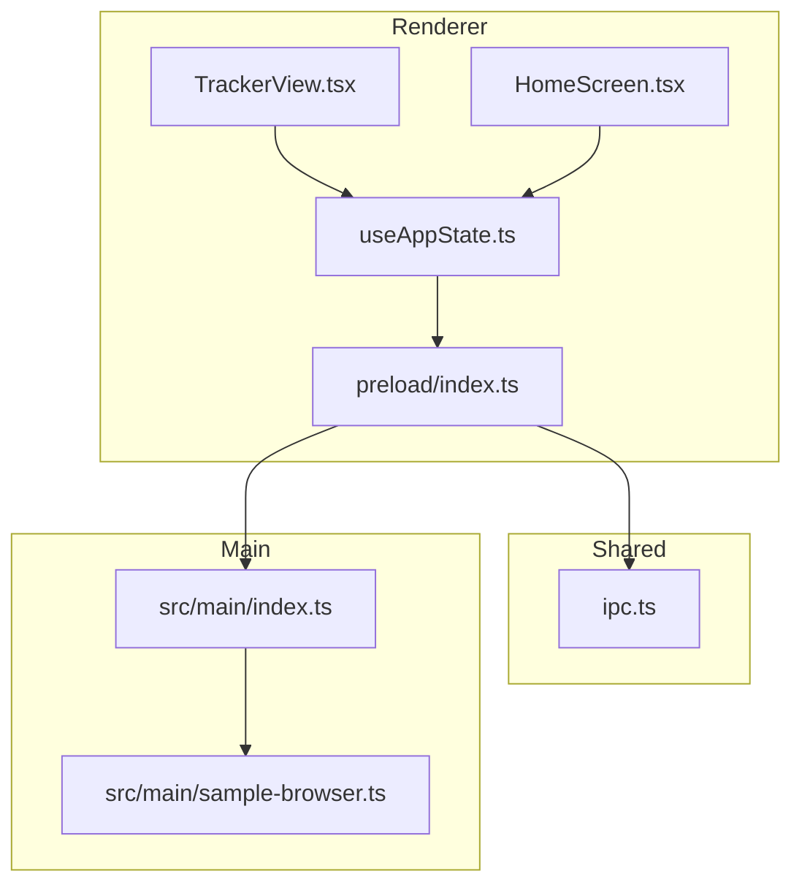
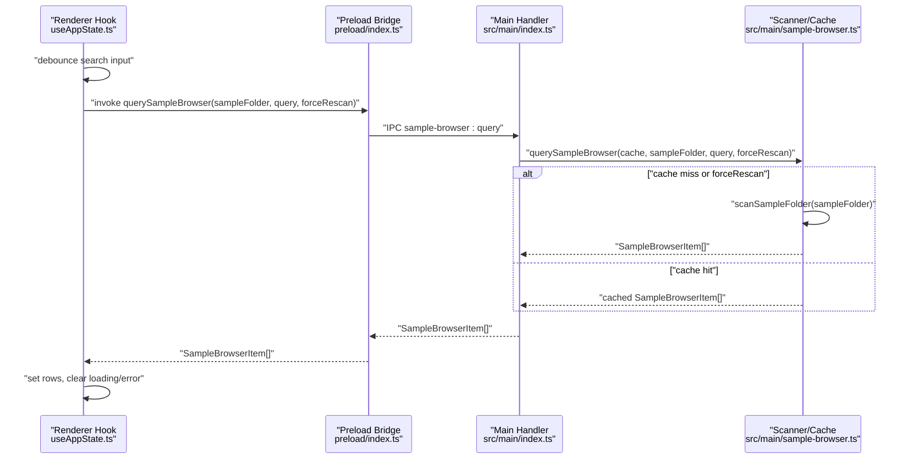
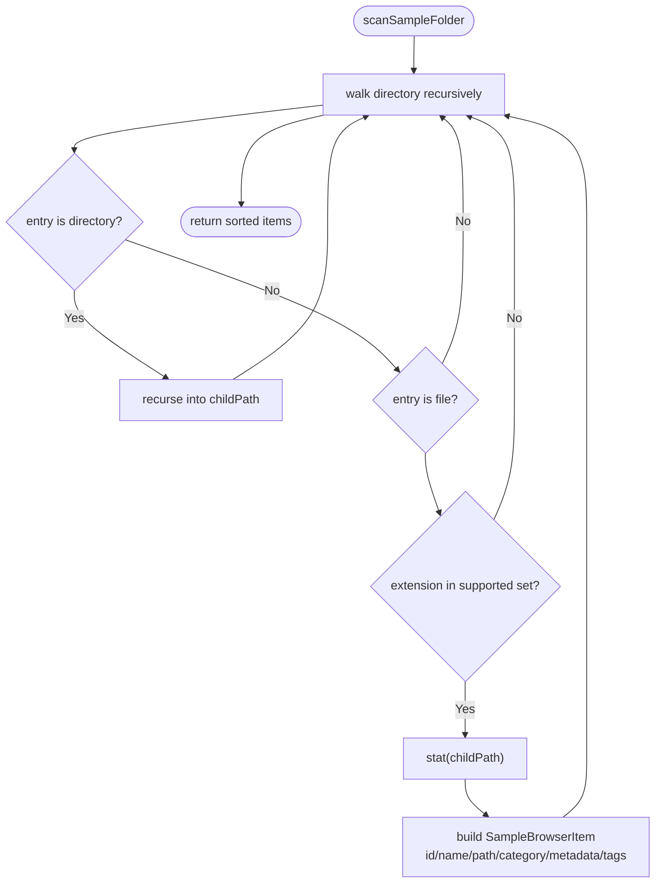
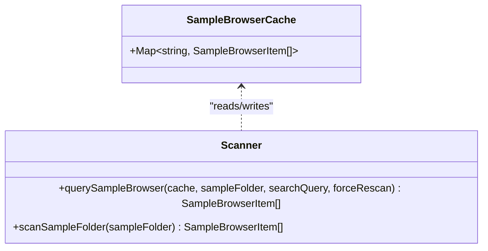
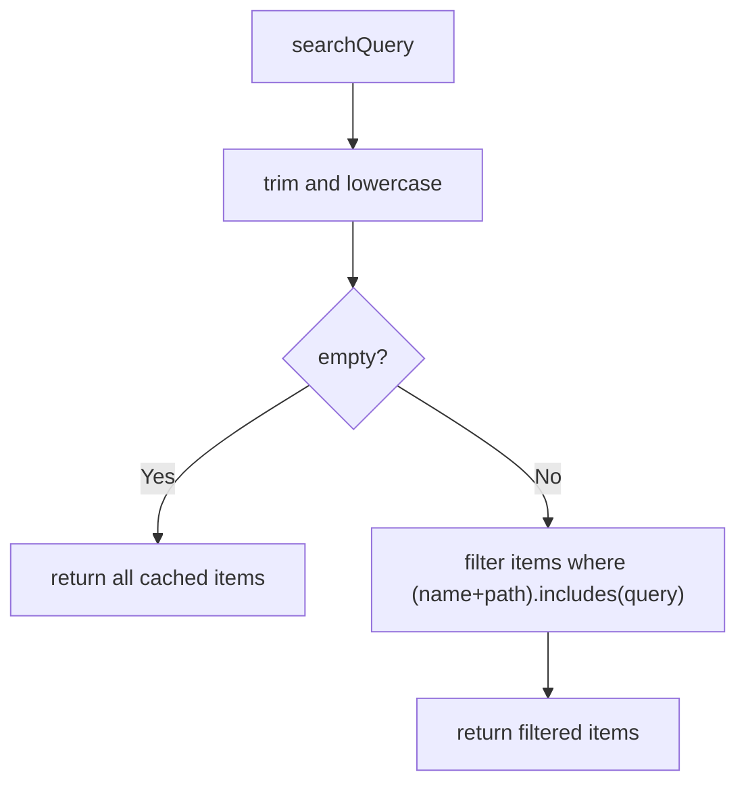
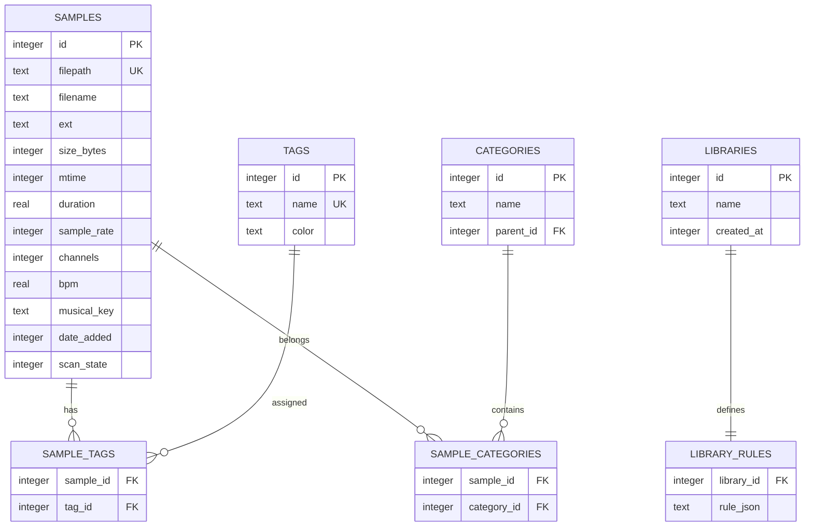
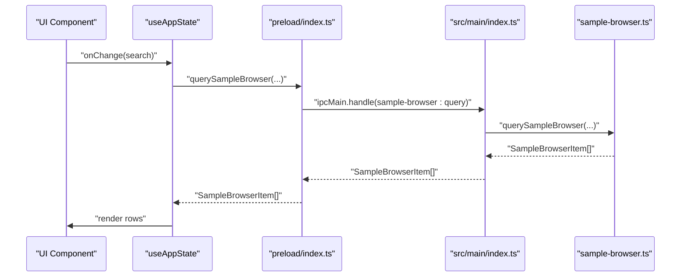
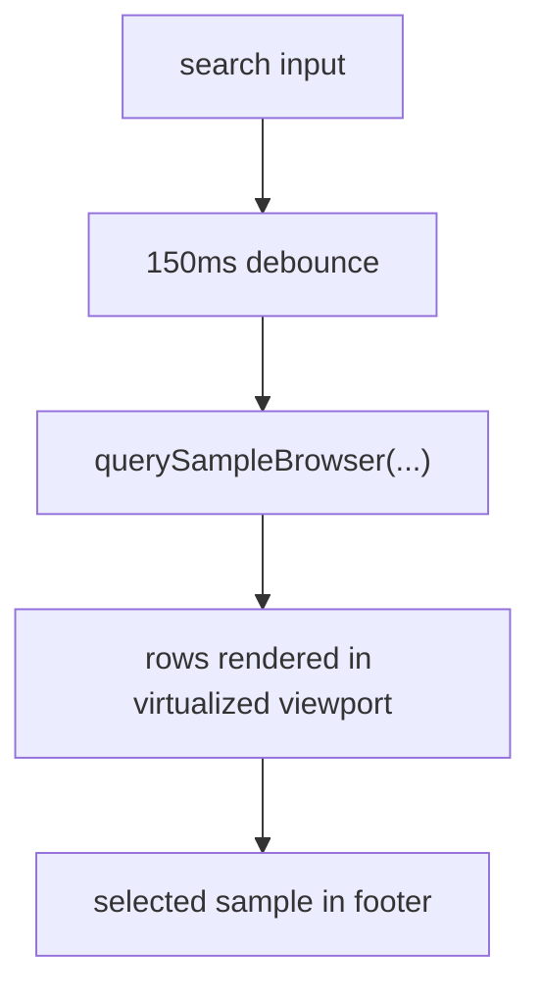
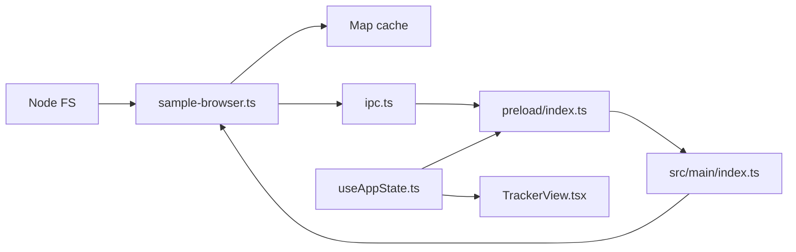

# Sample Browser

<cite>
**Referenced Files in This Document**
- [sample-browser.ts](file://src/main/sample-browser.ts)
- [index.ts (Main)](file://src/main/index.ts)
- [preload/index.ts](file://src/preload/index.ts)
- [ipc.ts](file://src/shared/ipc.ts)
- [useAppState.ts](file://src/renderer/src/hooks/useAppState.ts)
- [TrackerView.tsx](file://src/renderer/src/components/TrackerView.tsx)
- [HomeScreen.tsx](file://src/renderer/src/components/HomeScreen.tsx)
- [useFolderSession.ts](file://src/renderer/src/hooks/useFolderSession.ts)
- [spec-004-sample-library.md](file://docs/specs/spec-004-sample-library.md)
- [data-model.md](file://docs/data-model.md)
- [indexing.md](file://docs/indexing.md)
- [query-schema.md](file://docs/query-schema.md)
- [architecture.md](file://docs/architecture.md)
</cite>

## Table of Contents
1. [Introduction](#introduction)
2. [Project Structure](#project-structure)
3. [Core Components](#core-components)
4. [Architecture Overview](#architecture-overview)
5. [Detailed Component Analysis](#detailed-component-analysis)
6. [Dependency Analysis](#dependency-analysis)
7. [Performance Considerations](#performance-considerations)
8. [Troubleshooting Guide](#troubleshooting-guide)
9. [Conclusion](#conclusion)
10. [Appendices](#appendices)

## Introduction
This document explains the sample browser functionality in MixJam Electron. It covers how the application discovers audio files, organizes them into categories, and provides a fuzzy search experience. It also documents the file scanning algorithms, metadata extraction, caching strategies, filtering and tagging system, and performance optimizations such as virtualized rendering. The integration between the main process (file system operations) and the renderer process (UI rendering) is detailed, along with configuration options and operational guidance for large sample libraries.

## Project Structure
The sample browser spans three layers:
- Main process: file system scanning, caching, and IPC handlers
- Preload bridge: exposes typed IPC methods to the renderer
- Renderer: UI components, state hooks, and user interactions

**Diagram sources**
- [useAppState.ts:93-124](file://src/renderer/src/hooks/useAppState.ts#L93-L124)
- [TrackerView.tsx:215-240](file://src/renderer/src/components/TrackerView.tsx#L215-L240)
- [HomeScreen.tsx:30-77](file://src/renderer/src/components/HomeScreen.tsx#L30-L77)
- [preload/index.ts:1-29](file://src/preload/index.ts#L1-L29)
- [ipc.ts:1-59](file://src/shared/ipc.ts#L1-L59)
- [index.ts (Main):1-170](file://src/main/index.ts#L1-L170)
- [sample-browser.ts:1-113](file://src/main/sample-browser.ts#L1-L113)

**Section sources**
- [useAppState.ts:93-124](file://src/renderer/src/hooks/useAppState.ts#L93-L124)
- [TrackerView.tsx:215-240](file://src/renderer/src/components/TrackerView.tsx#L215-L240)
- [HomeScreen.tsx:30-77](file://src/renderer/src/components/HomeScreen.tsx#L30-L77)
- [preload/index.ts:1-29](file://src/preload/index.ts#L1-L29)
- [ipc.ts:1-59](file://src/shared/ipc.ts#L1-L59)
- [index.ts (Main):1-170](file://src/main/index.ts#L1-L170)
- [sample-browser.ts:1-113](file://src/main/sample-browser.ts#L1-L113)

## Core Components
- Main process scanner and cache:
  - Scans the sample folder recursively, filters audio files by extension, computes category from path segments, and builds a stable, sorted list.
  - Caches results keyed by normalized absolute path to avoid repeated scans.
  - Provides a filtering method that matches the query against name and path.
- IPC integration:
  - Exposes a typed Electron API for the renderer to query the sample browser.
  - Main process handler invokes the scanner/cache and returns results.
- Renderer state and UI:
  - Debounced search input triggers queries with a small delay.
  - Loading state and error handling are managed in the hook.
  - Toolbar UI includes search input, result count, and a re-scan button.

Key behaviors:
- Supported audio formats: WAV, MP3, FLAC, OGG, AIFF
- Category derivation: first path segment becomes the top-level category
- Sorting: locale-aware filename sort, then path tie-breaker
- Caching: per-folder cache with forced refresh option

**Section sources**
- [sample-browser.ts:5-113](file://src/main/sample-browser.ts#L5-L113)
- [ipc.ts:30-59](file://src/shared/ipc.ts#L30-L59)
- [index.ts (Main):129-138](file://src/main/index.ts#L129-L138)
- [preload/index.ts:17-25](file://src/preload/index.ts#L17-L25)
- [useAppState.ts:93-148](file://src/renderer/src/hooks/useAppState.ts#L93-L148)
- [TrackerView.tsx:215-240](file://src/renderer/src/components/TrackerView.tsx#L215-L240)

## Architecture Overview
The sample browser follows a strict separation of concerns:
- Main process performs heavy I/O and maintains a persistent cache.
- Renderer remains responsive by delegating work to main via IPC and applying UI-level debouncing.
- The UI uses virtualized rendering to handle large datasets efficiently.

**Diagram sources**
- [useAppState.ts:93-124](file://src/renderer/src/hooks/useAppState.ts#L93-L124)
- [preload/index.ts:17-25](file://src/preload/index.ts#L17-L25)
- [index.ts (Main):129-138](file://src/main/index.ts#L129-L138)
- [sample-browser.ts:98-112](file://src/main/sample-browser.ts#L98-L112)

**Section sources**
- [index.ts (Main):129-138](file://src/main/index.ts#L129-L138)
- [sample-browser.ts:98-112](file://src/main/sample-browser.ts#L98-L112)
- [useAppState.ts:93-124](file://src/renderer/src/hooks/useAppState.ts#L93-L124)

## Detailed Component Analysis

### File Discovery and Categorization
- Supported formats: WAV, MP3, FLAC, OGG, AIFF
- Path normalization and canonicalization ensure cross-platform stability
- Category derived from the first path segment; fallback to “Uncategorized”
- Sorting is stable and deterministic by name and then path

**Diagram sources**
- [sample-browser.ts:36-86](file://src/main/sample-browser.ts#L36-L86)

**Section sources**
- [sample-browser.ts:5-86](file://src/main/sample-browser.ts#L5-L86)

### Caching Strategy
- Cache key: normalized absolute path of the sample folder
- Cache value: pre-sorted list of items
- Refresh policy: force rescan or cache miss
- Benefits: avoids repeated filesystem traversal and stat calls

**Diagram sources**
- [sample-browser.ts:7-112](file://src/main/sample-browser.ts#L7-L112)

**Section sources**
- [sample-browser.ts:7-112](file://src/main/sample-browser.ts#L7-L112)

### Fuzzy Search Implementation
- Current renderer behavior: debounce input and send query to main
- Main-side filter: case-insensitive substring match against name and path
- Future direction (as documented): SQLite-backed fuzzy search via FTS5 with saved query rules

**Diagram sources**
- [sample-browser.ts:88-96](file://src/main/sample-browser.ts#L88-L96)
- [useAppState.ts:136-148](file://src/renderer/src/hooks/useAppState.ts#L136-L148)

**Section sources**
- [sample-browser.ts:88-96](file://src/main/sample-browser.ts#L88-L96)
- [useAppState.ts:136-148](file://src/renderer/src/hooks/useAppState.ts#L136-L148)

### Filtering and Tagging System
- Tagging and categories are modeled in SQLite with hierarchical categories and many-to-many relationships
- Saved libraries are stored as structured rule JSON that compiles to SQL
- Filtering by category includes descendants via a recursive CTE
- Fuzzy search integrates with FTS5 virtual table

**Diagram sources**
- [data-model.md:11-74](file://docs/data-model.md#L11-L74)
- [query-schema.md:19-114](file://docs/query-schema.md#L19-L114)

**Section sources**
- [data-model.md:11-131](file://docs/data-model.md#L11-L131)
- [query-schema.md:19-129](file://docs/query-schema.md#L19-L129)

### Integration Between Main and Renderer
- Renderer invokes a typed Electron API to query the sample browser
- Preload bridges IPC channels to main handlers
- Main handler delegates to the scanner/cache and returns results

**Diagram sources**
- [TrackerView.tsx:215-240](file://src/renderer/src/components/TrackerView.tsx#L215-L240)
- [useAppState.ts:93-124](file://src/renderer/src/hooks/useAppState.ts#L93-L124)
- [preload/index.ts:17-25](file://src/preload/index.ts#L17-L25)
- [index.ts (Main):129-138](file://src/main/index.ts#L129-L138)
- [sample-browser.ts:98-112](file://src/main/sample-browser.ts#L98-L112)

**Section sources**
- [useAppState.ts:93-124](file://src/renderer/src/hooks/useAppState.ts#L93-L124)
- [preload/index.ts:17-25](file://src/preload/index.ts#L17-L25)
- [index.ts (Main):129-138](file://src/main/index.ts#L129-L138)
- [sample-browser.ts:98-112](file://src/main/sample-browser.ts#L98-L112)

### UI Patterns and Virtualization
- The UI is designed to virtualize large lists to maintain responsiveness
- The toolbar includes search input, result count, and a re-scan action
- Debounced search reduces unnecessary IPC calls

**Diagram sources**
- [TrackerView.tsx:215-240](file://src/renderer/src/components/TrackerView.tsx#L215-L240)
- [useAppState.ts:136-148](file://src/renderer/src/hooks/useAppState.ts#L136-L148)
- [architecture.md:5-11](file://docs/architecture.md#L5-L11)

**Section sources**
- [TrackerView.tsx:215-240](file://src/renderer/src/components/TrackerView.tsx#L215-L240)
- [useAppState.ts:136-148](file://src/renderer/src/hooks/useAppState.ts#L136-L148)
- [architecture.md:5-11](file://docs/architecture.md#L5-L11)

## Dependency Analysis
- Main process depends on:
  - Node FS APIs for directory traversal and stats
  - A local cache for scan results
  - IPC channels to serve renderer queries
- Renderer depends on:
  - Preloaded Electron API
  - Debounced query execution
  - Virtualized rendering for performance

**Diagram sources**
- [sample-browser.ts:1-113](file://src/main/sample-browser.ts#L1-L113)
- [ipc.ts:1-59](file://src/shared/ipc.ts#L1-L59)
- [preload/index.ts:1-29](file://src/preload/index.ts#L1-L29)
- [index.ts (Main):1-170](file://src/main/index.ts#L1-L170)
- [useAppState.ts:93-124](file://src/renderer/src/hooks/useAppState.ts#L93-L124)
- [TrackerView.tsx:215-240](file://src/renderer/src/components/TrackerView.tsx#L215-L240)

**Section sources**
- [sample-browser.ts:1-113](file://src/main/sample-browser.ts#L1-L113)
- [ipc.ts:1-59](file://src/shared/ipc.ts#L1-L59)
- [preload/index.ts:1-29](file://src/preload/index.ts#L1-L29)
- [index.ts (Main):1-170](file://src/main/index.ts#L1-L170)
- [useAppState.ts:93-124](file://src/renderer/src/hooks/useAppState.ts#L93-L124)
- [TrackerView.tsx:215-240](file://src/renderer/src/components/TrackerView.tsx#L215-L240)

## Performance Considerations
- Virtualized rendering is a hard requirement for large libraries
- Debounced search (≈150 ms) minimizes IPC traffic
- Cache reuse avoids repeated scans and stat calls
- Future roadmap includes SQLite-backed FTS5 fuzzy search and rule compilation to SQL for all filters

Practical tips:
- Prefer re-scan only when necessary (e.g., after adding/removing files)
- Keep the sample folder organized to reduce deep directory traversal
- Use categories and tags to narrow the dataset before searching

**Section sources**
- [architecture.md:5-11](file://docs/architecture.md#L5-L11)
- [useAppState.ts:136-148](file://src/renderer/src/hooks/useAppState.ts#L136-L148)
- [indexing.md:23-44](file://docs/indexing.md#L23-L44)
- [data-model.md:94-109](file://docs/data-model.md#L94-L109)

## Troubleshooting Guide
Common issues and resolutions:
- Empty results when sample folder is not set:
  - Ensure the sample folder is selected and validated before querying
- Slow initial load:
  - Allow the cache to populate; subsequent queries will be fast
- Frequent re-scans:
  - Use the re-scan button intentionally; otherwise rely on cached results
- Permission errors:
  - Some directories may be unreadable; the scanner skips inaccessible entries

Operational checks:
- Verify folder validation returns true for the selected path
- Confirm IPC channel for sample-browser queries is reachable
- Monitor loading state and error messages in the UI

**Section sources**
- [useFolderSession.ts:30-50](file://src/renderer/src/hooks/useFolderSession.ts#L30-L50)
- [index.ts (Main):140-153](file://src/main/index.ts#L140-L153)
- [useAppState.ts:112-121](file://src/renderer/src/hooks/useAppState.ts#L112-L121)

## Conclusion
The sample browser integrates a robust scanning pipeline, a resilient cache, and a responsive UI. While the current implementation focuses on basic file discovery, categorization, and simple filtering, the documented roadmap introduces SQLite-backed FTS5 fuzzy search, hierarchical categories, and saved libraries with rule-based queries. These enhancements will enable efficient exploration of very large sample libraries while preserving user-defined tags and categories.

## Appendices

### Configuration Options
- Supported audio formats: WAV, MP3, FLAC, OGG, AIFF
- Scan intervals:
  - Manual re-scan via UI
  - Future: configurable periodic scans (planned)
- Cache management:
  - Automatic cache per sample folder
  - Force refresh via re-scan

**Section sources**
- [sample-browser.ts:5-5](file://src/main/sample-browser.ts#L5-L5)
- [TrackerView.tsx:226-233](file://src/renderer/src/components/TrackerView.tsx#L226-L233)
- [indexing.md:46-61](file://docs/indexing.md#L46-L61)

### Roadmap Highlights
- SQLite-backed indexing with two-phase scan (stubs + metadata extraction)
- Fuzzy search via FTS5 and rule-based query engine
- Hierarchical categories and saved libraries as persisted queries
- Virtualized rendering for large datasets

**Section sources**
- [spec-004-sample-library.md:33-174](file://docs/specs/spec-004-sample-library.md#L33-L174)
- [data-model.md:94-123](file://docs/data-model.md#L94-L123)
- [query-schema.md:92-129](file://docs/query-schema.md#L92-L129)
- [indexing.md:23-61](file://docs/indexing.md#L23-L61)