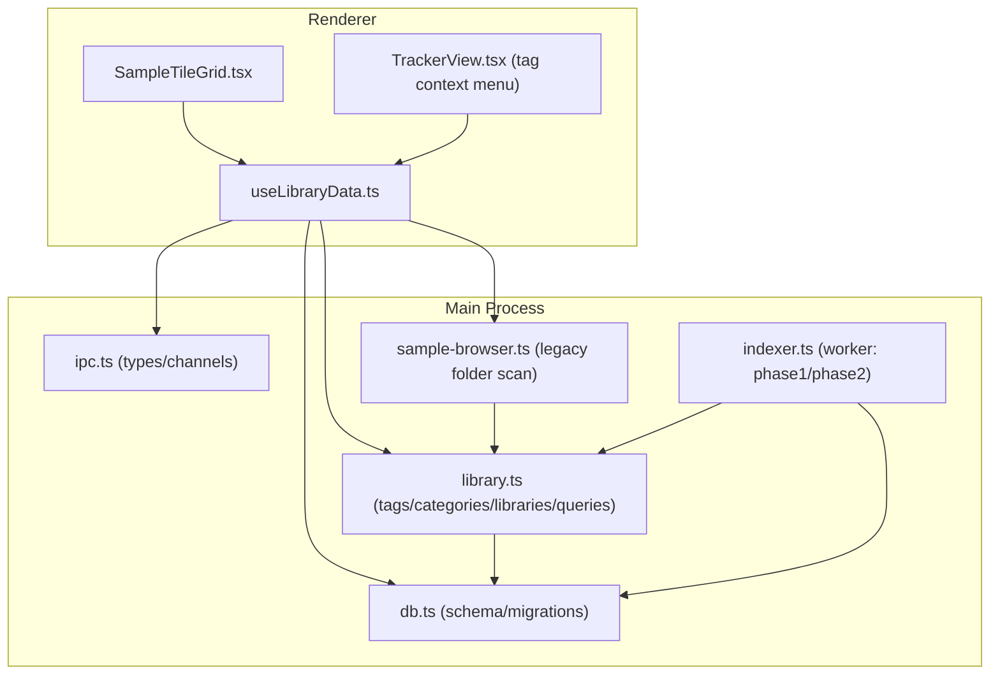
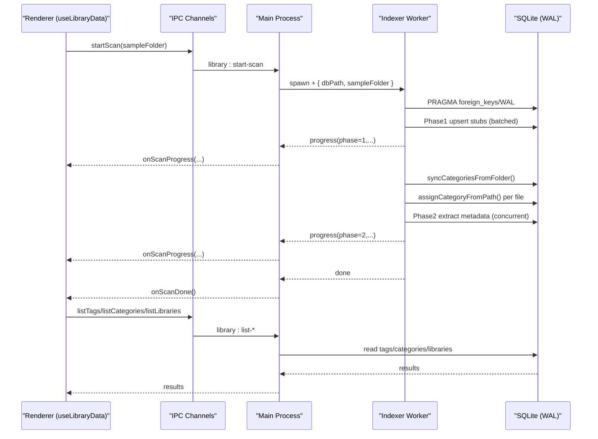
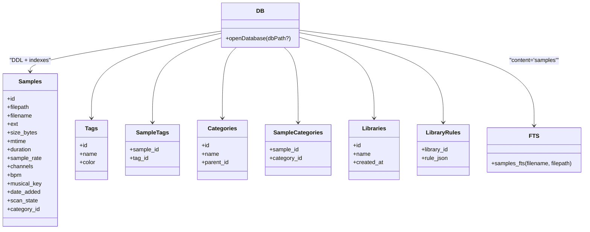
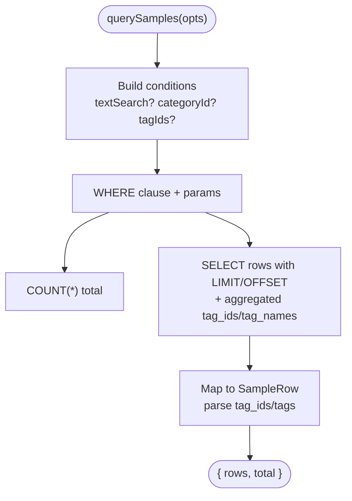
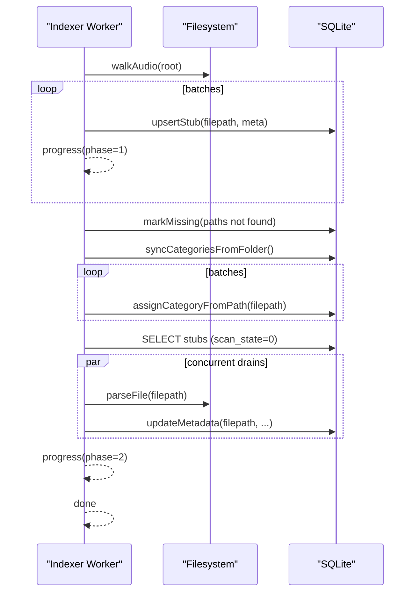
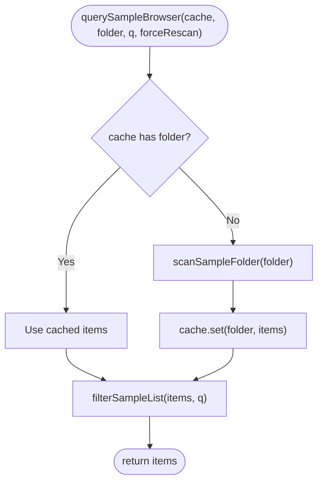
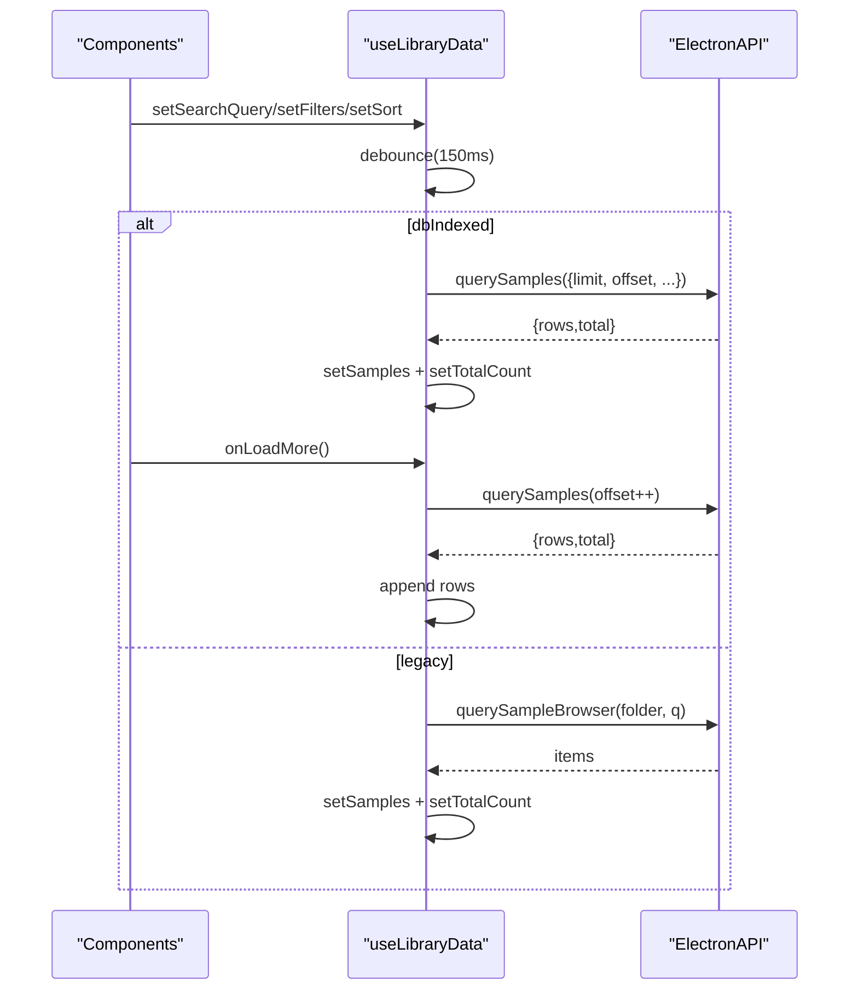
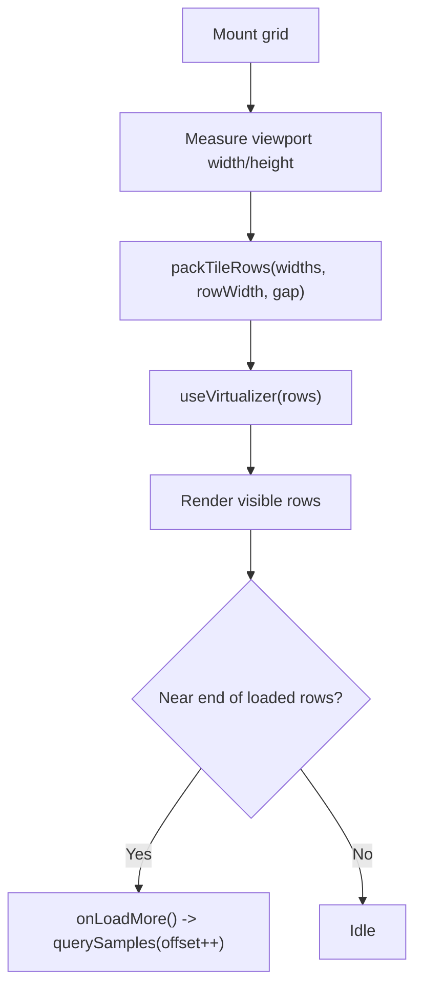
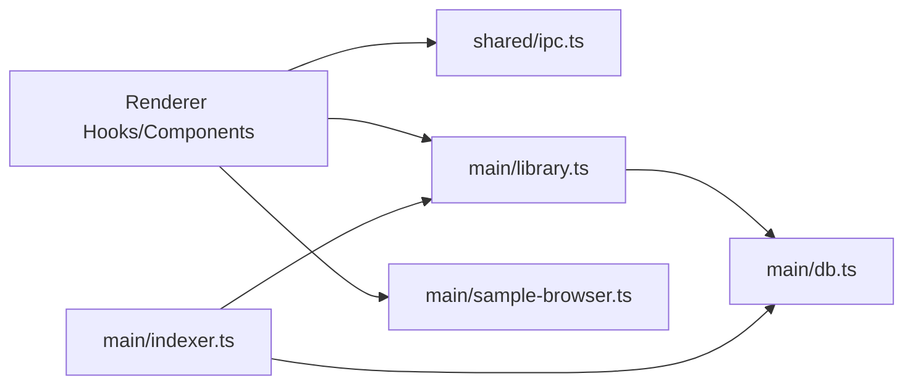

# Sample Tagging & Library Management

<cite>
**Referenced Files in This Document**
- [library.ts](file://src/main/library.ts)
- [sample-browser.ts](file://src/main/sample-browser.ts)
- [indexer.ts](file://src/main/indexer.ts)
- [db.ts](file://src/main/db.ts)
- [ipc.ts](file://src/shared/ipc.ts)
- [useLibraryData.ts](file://src/renderer/src/hooks/useLibraryData.ts)
- [SampleTileGrid.tsx](file://src/renderer/src/components/SampleTileGrid.tsx)
- [TrackerView.tsx](file://src/renderer/src/components/TrackerView.tsx)
- [spec-004-sample-library.md](file://docs/specs/spec-004-sample-library.md)
- [data-model.md](file://docs/data-model.md)
- [query-schema.md](file://docs/query-schema.md)
- [indexing.md](file://docs/indexing.md)
</cite>

## Table of Contents
1. [Introduction](#introduction)
2. [Project Structure](#project-structure)
3. [Core Components](#core-components)
4. [Architecture Overview](#architecture-overview)
5. [Detailed Component Analysis](#detailed-component-analysis)
6. [Dependency Analysis](#dependency-analysis)
7. [Performance Considerations](#performance-considerations)
8. [Troubleshooting Guide](#troubleshooting-guide)
9. [Conclusion](#conclusion)
10. [Appendices](#appendices)

## Introduction
This document explains the Sample Tagging and Library Management system for the application. It covers how samples are indexed, categorized, tagged, queried, and presented to users through a virtualized browser with windowed paging. The system uses SQLite (WAL mode) for persistence, FTS5 for full-text search, and a two-phase indexer running in a worker thread to keep the UI responsive. Libraries are saved queries that can be applied later to restore filter state.

## Project Structure
The sample library spans main-process data access, indexing, shared IPC contracts, and renderer hooks and components:
- Main process: database schema and migrations, tagging/category/library APIs, query builder, and background indexer.
- Shared: IPC channel names and typed request/response shapes.
- Renderer: React hook managing library state, pagination, filters, tags/categories/libraries CRUD, and UI components for browsing and tagging via context menu.

**Diagram sources**
- [useLibraryData.ts:1-591](file://src/renderer/src/hooks/useLibraryData.ts#L1-L591)
- [SampleTileGrid.tsx:1-225](file://src/renderer/src/components/SampleTileGrid.tsx#L1-L225)
- [TrackerView.tsx:1030-1075](file://src/renderer/src/components/TrackerView.tsx#L1030-L1075)
- [ipc.ts:1-199](file://src/shared/ipc.ts#L1-L199)
- [db.ts:1-155](file://src/main/db.ts#L1-L155)
- [library.ts:1-532](file://src/main/library.ts#L1-L532)
- [sample-browser.ts:1-99](file://src/main/sample-browser.ts#L1-L99)
- [indexer.ts:1-190](file://src/main/indexer.ts#L1-L190)

**Section sources**
- [spec-004-sample-library.md:1-225](file://docs/specs/spec-004-sample-library.md#L1-L225)
- [data-model.md:1-138](file://docs/data-model.md#L1-L138)
- [indexing.md:1-99](file://docs/indexing.md#L1-L99)

## Core Components
- Database layer: Schema, indexes, FTS5 virtual table, and migrations; WAL mode enabled for concurrent reads/writes.
- Library API: Tags, categories (hierarchical), libraries (saved queries), and sample queries with FTS5 text search, category subtree filtering, tag filtering, sorting, and windowed paging.
- Indexer: Two-phase scanning in a worker thread; phase 1 enumerates files and creates stubs; phase 2 extracts audio metadata incrementally.
- Legacy browser: Folder scanner used before first scan completes.
- Renderer hook: Unified state for samples, filters, sort, tags, categories, libraries; debounced queries; windowed paging; tag/category/library CRUD; apply/save libraries.
- Browser UI: Virtualized tile grid with row packing; context menu for tagging.

**Section sources**
- [db.ts:1-155](file://src/main/db.ts#L1-L155)
- [library.ts:1-532](file://src/main/library.ts#L1-L532)
- [indexer.ts:1-190](file://src/main/indexer.ts#L1-L190)
- [sample-browser.ts:1-99](file://src/main/sample-browser.ts#L1-L99)
- [useLibraryData.ts:1-591](file://src/renderer/src/hooks/useLibraryData.ts#L1-L591)
- [SampleTileGrid.tsx:1-225](file://src/renderer/src/components/SampleTileGrid.tsx#L1-L225)
- [TrackerView.tsx:1030-1075](file://src/renderer/src/components/TrackerView.tsx#L1030-L1075)

## Architecture Overview
The system separates concerns across processes and layers:
- Renderer manages user interactions and state, calling IPC endpoints.
- Main process exposes typed IPC channels backed by SQLite.
- A worker thread performs heavy I/O during indexing without blocking the UI.

**Diagram sources**
- [indexer.ts:1-190](file://src/main/indexer.ts#L1-L190)
- [library.ts:1-532](file://src/main/library.ts#L1-L532)
- [db.ts:1-155](file://src/main/db.ts#L1-L155)
- [useLibraryData.ts:361-386](file://src/renderer/src/hooks/useLibraryData.ts#L361-L386)
- [ipc.ts:1-199](file://src/shared/ipc.ts#L1-L199)

## Detailed Component Analysis

### Database Layer and Migrations
- Creates tables for samples, tags, sample_tags, categories, sample_categories, libraries, library_rules.
- Builds indexes for performance at scale.
- Sets up FTS5 virtual table and triggers for filename/filepath search.
- Enables WAL and foreign keys; runs versioned migrations to add columns and scope triggers.

**Diagram sources**
- [db.ts:19-102](file://src/main/db.ts#L19-L102)
- [data-model.md:9-138](file://docs/data-model.md#L9-L138)

**Section sources**
- [db.ts:1-155](file://src/main/db.ts#L1-L155)
- [data-model.md:1-138](file://docs/data-model.md#L1-L138)

### Library API: Tags, Categories, Libraries, Queries
- Tags: create (idempotent), rename, delete, assign/unassign, list, fetch-by-sample.
- Categories: hierarchical tree with “Unsorted” fallback; sync root categories from folder structure; auto-assign samples based on path segments; recursive CTE for descendant matching.
- Libraries: save current filter state as rule JSON; list/delete; apply restores filters.
- Query engine: builds WHERE clauses using FTS5 text match, category subtree, tag membership, sorts, and returns windowed pages with aggregated tag ids/names.

**Diagram sources**
- [library.ts:274-389](file://src/main/library.ts#L274-L389)

**Section sources**
- [library.ts:47-101](file://src/main/library.ts#L47-L101)
- [library.ts:107-191](file://src/main/library.ts#L107-L191)
- [library.ts:197-225](file://src/main/library.ts#L197-L225)
- [library.ts:274-389](file://src/main/library.ts#L274-L389)
- [library.ts:461-531](file://src/main/library.ts#L461-L531)
- [query-schema.md:1-129](file://docs/query-schema.md#L1-L129)

### Indexer: Two-Phase Scanning
- Phase 1: Recursively walk audio files, upsert stubs in batched transactions, mark missing files, sync root categories, auto-assign categories by path segments.
- Phase 2: Concurrently parse audio headers to fill duration/sample rate/channels, update scan state, emit progress events.

**Diagram sources**
- [indexer.ts:56-115](file://src/main/indexer.ts#L56-L115)
- [indexer.ts:123-161](file://src/main/indexer.ts#L123-L161)
- [library.ts:395-451](file://src/main/library.ts#L395-L451)
- [library.ts:161-187](file://src/main/library.ts#L161-L187)
- [library.ts:461-531](file://src/main/library.ts#L461-L531)

**Section sources**
- [indexer.ts:1-190](file://src/main/indexer.ts#L1-L190)
- [indexing.md:1-99](file://docs/indexing.md#L1-L99)

### Legacy Folder Browser (Pre-index Fallback)
- Walks the sample folder asynchronously, filters by supported audio extensions, derives category labels, and caches results.
- Used only until the first scan completes; then the DB-backed pipeline takes over.

**Diagram sources**
- [sample-browser.ts:84-99](file://src/main/sample-browser.ts#L84-L99)
- [sample-browser.ts:26-72](file://src/main/sample-browser.ts#L26-L72)

**Section sources**
- [sample-browser.ts:1-99](file://src/main/sample-browser.ts#L1-L99)

### Renderer Hook: useLibraryData
- Maintains unified state for samples, filters, sort, tags, categories, libraries, and scan progress.
- Debounces queries; switches between legacy and DB pipelines based on whether any samples exist.
- Implements windowed paging: initial page load plus incremental loads when scrolling near the end.
- Provides actions for tag/category/library CRUD and applying/saving libraries.

**Diagram sources**
- [useLibraryData.ts:228-346](file://src/renderer/src/hooks/useLibraryData.ts#L228-L346)
- [useLibraryData.ts:292-323](file://src/renderer/src/hooks/useLibraryData.ts#L292-L323)
- [ipc.ts:156-199](file://src/shared/ipc.ts#L156-L199)

**Section sources**
- [useLibraryData.ts:1-591](file://src/renderer/src/hooks/useLibraryData.ts#L1-L591)
- [ipc.ts:1-199](file://src/shared/ipc.ts#L1-L199)

### Browser UI: Virtualized Tile Grid and Tag Context Menu
- Packs tiles into fixed-height rows mimicking flex-wrap behavior; virtualizes rows to render only visible ones.
- Requests next page when viewport nears the end of loaded rows.
- Right-click context menu allows assigning/unassigning tags to samples (only after first scan).

**Diagram sources**
- [SampleTileGrid.tsx:33-52](file://src/renderer/src/components/SampleTileGrid.tsx#L33-L52)
- [SampleTileGrid.tsx:138-161](file://src/renderer/src/components/SampleTileGrid.tsx#L138-L161)
- [TrackerView.tsx:1036-1069](file://src/renderer/src/components/TrackerView.tsx#L1036-L1069)

**Section sources**
- [SampleTileGrid.tsx:1-225](file://src/renderer/src/components/SampleTileGrid.tsx#L1-L225)
- [TrackerView.tsx:1030-1075](file://src/renderer/src/components/TrackerView.tsx#L1030-L1075)

## Dependency Analysis
High-level dependencies among modules:
- Renderer depends on shared IPC types and calls ElectronAPI methods.
- useLibraryData orchestrates queries and state updates, depending on IPC and local state.
- Main library module depends on DB and implements business logic for tags/categories/libraries/queries.
- Indexer depends on library helpers and DB for scanning and metadata extraction.
- Legacy browser depends on filesystem and path utilities.

**Diagram sources**
- [useLibraryData.ts:1-591](file://src/renderer/src/hooks/useLibraryData.ts#L1-L591)
- [ipc.ts:1-199](file://src/shared/ipc.ts#L1-L199)
- [library.ts:1-532](file://src/main/library.ts#L1-L532)
- [sample-browser.ts:1-99](file://src/main/sample-browser.ts#L1-L99)
- [indexer.ts:1-190](file://src/main/indexer.ts#L1-L190)
- [db.ts:1-155](file://src/main/db.ts#L1-L155)

**Section sources**
- [useLibraryData.ts:1-591](file://src/renderer/src/hooks/useLibraryData.ts#L1-L591)
- [ipc.ts:1-199](file://src/shared/ipc.ts#L1-L199)
- [library.ts:1-532](file://src/main/library.ts#L1-L532)
- [sample-browser.ts:1-99](file://src/main/sample-browser.ts#L1-L99)
- [indexer.ts:1-190](file://src/main/indexer.ts#L1-L190)
- [db.ts:1-155](file://src/main/db.ts#L1-L155)

## Performance Considerations
- Windowed paging: The renderer requests limited pages and appends more on scroll, avoiding loading entire datasets into memory.
- Virtualization: Only visible rows are mounted; row packing mirrors CSS flex-wrap behavior for consistent bubble geometry.
- SQLite optimizations: WAL mode enables concurrent reads/writes; indexes support fast filtering/sorting; FTS5 accelerates text search.
- Batched writes: Indexer uses transactions for bulk inserts and assignments to reduce fsync overhead.
- Concurrency control: Metadata extraction runs with limited concurrency to balance disk throughput and responsiveness.

[No sources needed since this section provides general guidance]

## Troubleshooting Guide
- No samples shown: Ensure a sample folder is selected and a scan has completed; if not, trigger a re-scan. The renderer falls back to the legacy folder browser until the first scan finishes.
- Tags unavailable: Tag assignment requires an indexed sample (dbId non-null); pre-index items cannot be tagged.
- Slow initial load: Large libraries rely on windowed paging and virtualization; ensure the UI is measuring the viewport so virtualization activates.
- Stale categories: After a re-scan, categories may refresh; the hook reloads categories and re-runs the query on scan completion.
- Missing files: Marked as missing rather than deleted; they remain hidden from normal browsing but preserve tags and memberships.

**Section sources**
- [useLibraryData.ts:208-226](file://src/renderer/src/hooks/useLibraryData.ts#L208-L226)
- [useLibraryData.ts:361-373](file://src/renderer/src/hooks/useLibraryData.ts#L361-L373)
- [indexer.ts:83-98](file://src/main/indexer.ts#L83-L98)
- [library.ts:437-439](file://src/main/library.ts#L437-L439)

## Conclusion
The Sample Tagging & Library Management system delivers a responsive, scalable browsing experience with robust organization features. It combines efficient indexing, powerful querying, and a virtualized UI to handle large libraries while preserving user data across scans. Saved libraries enable repeatable, shareable views of the collection.

[No sources needed since this section summarizes without analyzing specific files]

## Appendices

### Data Model Summary
- Core entities: samples, tags, sample_tags, categories, sample_categories, libraries, library_rules.
- Full-text search via FTS5 virtual table with triggers keeping it in sync.
- Category hierarchy supports ancestor-descendant filtering via recursive CTE.

**Section sources**
- [data-model.md:9-138](file://docs/data-model.md#L9-L138)
- [db.ts:19-102](file://src/main/db.ts#L19-L102)

### Query Schema (Saved Libraries)
- rule_json defines a versioned predicate tree supporting groups (and/or/not) and leaves (text, tag, category, bpm, duration, key, ext, dateAdded).
- Compiles to parameterized SQL WHERE fragments; never string-concatenated.

**Section sources**
- [query-schema.md:1-129](file://docs/query-schema.md#L1-L129)

### Indexing Strategy
- Two-phase scan: enumeration (fast) followed by metadata extraction (background).
- Change detection uses size and mtime; missing files are marked, not deleted.
- Category auto-assignment aligns with folder structure and ensures “Unsorted” exists.

**Section sources**
- [indexing.md:1-99](file://docs/indexing.md#L1-L99)
- [indexer.ts:56-115](file://src/main/indexer.ts#L56-L115)