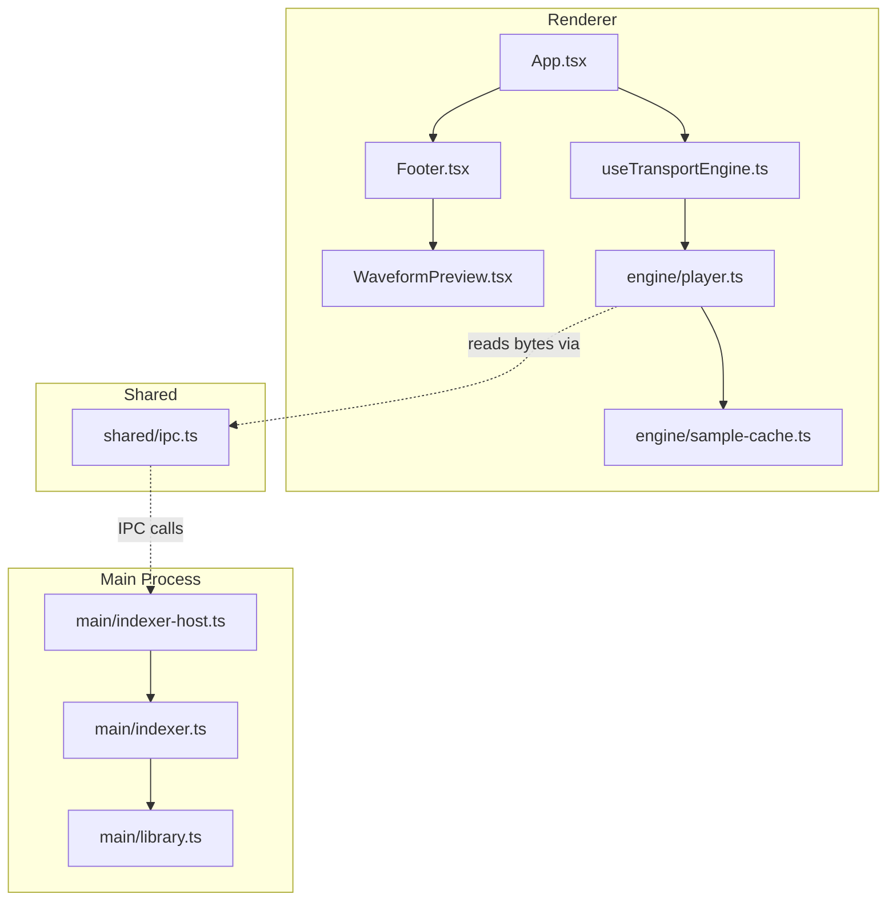
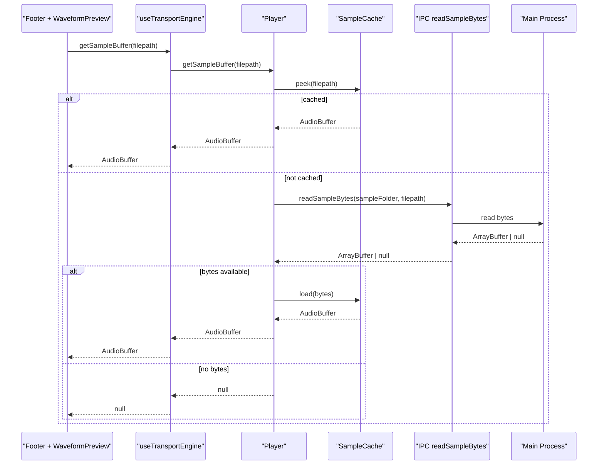
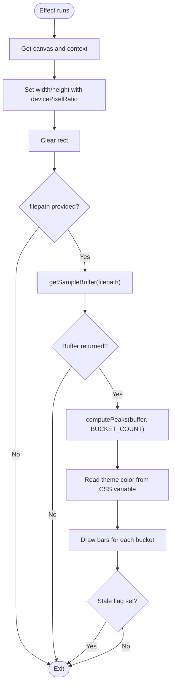
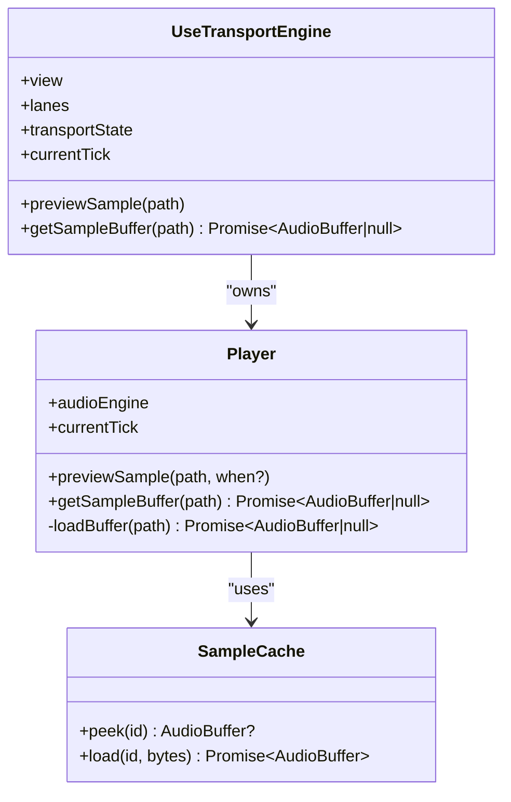
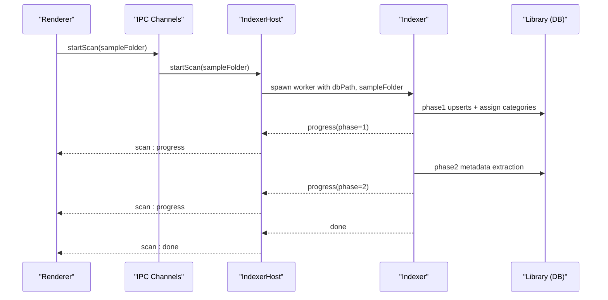
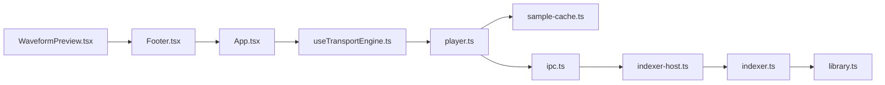

# Waveform Preview System

<cite>
**Referenced Files in This Document**
- [WaveformPreview.tsx](file://src/renderer/src/components/WaveformPreview.tsx)
- [Footer.tsx](file://src/renderer/src/components/Footer.tsx)
- [App.tsx](file://src/renderer/src/App.tsx)
- [useTransportEngine.ts](file://src/renderer/src/hooks/useTransportEngine.ts)
- [player.ts](file://src/renderer/src/engine/player.ts)
- [sample-cache.ts](file://src/renderer/src/engine/sample-cache.ts)
- [ipc.ts](file://src/shared/ipc.ts)
- [indexer.ts](file://src/main/indexer.ts)
- [library.ts](file://src/main/library.ts)
- [indexer-host.ts](file://src/main/indexer-host.ts)
</cite>

## Table of Contents
1. Introduction
2. Project Structure
3. Core Components
4. Architecture Overview
5. Detailed Component Analysis
6. Dependency Analysis
7. Performance Considerations
8. Troubleshooting Guide
9. Conclusion

## Introduction
This document explains the Waveform Preview System used to render a compact waveform visualization for the currently selected sample in the application footer. It covers how the UI requests an AudioBuffer, how decoding and caching are handled, how the preview is rendered on a canvas, and how it integrates with the broader audio engine and library indexing pipeline. The goal is to make the system understandable for both developers and non-technical users.

## Project Structure
The waveform preview spans several layers:
- Renderer UI components that own the canvas and draw the waveform
- A transport hook that wires the Player into React state
- An audio engine layer that decodes and caches samples
- IPC channels and main-process helpers for reading bytes and scanning the library

**Diagram sources**
- [Footer.tsx:1-49](file://src/renderer/src/components/Footer.tsx#L1-L49)
- [WaveformPreview.tsx:1-85](file://src/renderer/src/components/WaveformPreview.tsx#L1-L85)
- [App.tsx:1-209](file://src/renderer/src/App.tsx#L1-L209)
- [useTransportEngine.ts:1-435](file://src/renderer/src/hooks/useTransportEngine.ts#L1-L435)
- [player.ts:1-248](file://src/renderer/src/engine/player.ts#L1-L248)
- [sample-cache.ts:1-107](file://src/renderer/src/engine/sample-cache.ts#L1-L107)
- [ipc.ts:1-199](file://src/shared/ipc.ts#L1-L199)
- [indexer-host.ts:1-104](file://src/main/indexer-host.ts#L1-L104)
- [indexer.ts:1-190](file://src/main/indexer.ts#L1-L190)
- [library.ts:1-532](file://src/main/library.ts#L1-L532)

**Section sources**
- [Footer.tsx:1-49](file://src/renderer/src/components/Footer.tsx#L1-L49)
- [WaveformPreview.tsx:1-85](file://src/renderer/src/components/WaveformPreview.tsx#L1-L85)
- [App.tsx:1-209](file://src/renderer/src/App.tsx#L1-L209)
- [useTransportEngine.ts:1-435](file://src/renderer/src/hooks/useTransportEngine.ts#L1-L435)
- [player.ts:1-248](file://src/renderer/src/engine/player.ts#L1-L248)
- [sample-cache.ts:1-107](file://src/renderer/src/engine/sample-cache.ts#L1-L107)
- [ipc.ts:1-199](file://src/shared/ipc.ts#L1-L199)
- [indexer-host.ts:1-104](file://src/main/indexer-host.ts#L1-L104)
- [indexer.ts:1-190](file://src/main/indexer.ts#L1-L190)
- [library.ts:1-532](file://src/main/library.ts#L1-L532)

## Core Components
- WaveformPreview component: Renders a compact waveform using a fixed number of buckets and draws peak bars on a canvas. It uses theme tokens for color and ensures high-DPI rendering.
- Footer component: Hosts the WaveformPreview when a sample is selected in tracker view and passes the current filepath and a buffer-fetching callback.
- useTransportEngine hook: Provides getSampleBuffer by delegating to the Player instance; also manages preview playback and transport state.
- Player class: Orchestrates audio scheduling and provides getSampleBuffer which shares the same cache as playback.
- SampleCache: LRU-decoded AudioBuffer cache with deduplicated in-flight decodes.
- IPC and Main process: readSampleBytes channel allows the renderer to request raw bytes from the main process; indexer and library modules manage the sample database and metadata.

Key responsibilities:
- UI owns drawing and responsiveness (canvas sizing, DPR scaling).
- Engine owns decoding and caching.
- IPC bridges file access safely.

**Section sources**
- [WaveformPreview.tsx:1-85](file://src/renderer/src/components/WaveformPreview.tsx#L1-L85)
- [Footer.tsx:1-49](file://src/renderer/src/components/Footer.tsx#L1-L49)
- [useTransportEngine.ts:1-435](file://src/renderer/src/hooks/useTransportEngine.ts#L1-L435)
- [player.ts:1-248](file://src/renderer/src/engine/player.ts#L1-L248)
- [sample-cache.ts:1-107](file://src/renderer/src/engine/sample-cache.ts#L1-L107)
- [ipc.ts:1-199](file://src/shared/ipc.ts#L1-L199)

## Architecture Overview
The waveform preview follows a clear separation of concerns:
- The UI requests an AudioBuffer for a given path.
- The Player checks the cache and, if missing, loads bytes via IPC and decodes them once.
- The decoded buffer is cached and reused for both preview and playback.
- The WaveformPreview component computes per-bucket peaks and renders them on a canvas.

**Diagram sources**
- [WaveformPreview.tsx:1-85](file://src/renderer/src/components/WaveformPreview.tsx#L1-L85)
- [useTransportEngine.ts:1-435](file://src/renderer/src/hooks/useTransportEngine.ts#L1-L435)
- [player.ts:1-248](file://src/renderer/src/engine/player.ts#L1-L248)
- [sample-cache.ts:1-107](file://src/renderer/src/engine/sample-cache.ts#L1-L107)
- [ipc.ts:1-199](file://src/shared/ipc.ts#L1-L199)

## Detailed Component Analysis

### WaveformPreview Component
Responsibilities:
- Compute per-bucket peak amplitudes across all channels.
- Draw vertical bars centered vertically with a minimum height for silent segments.
- Use CSS custom properties for theme-aware colors.
- Handle stale updates when the filepath changes during async loading.

Rendering details:
- Fixed bucket count for consistent visual density.
- High-DPI aware canvas sizing.
- Accessibility attributes when a sample is selected.

**Diagram sources**
- [WaveformPreview.tsx:1-85](file://src/renderer/src/components/WaveformPreview.tsx#L1-L85)

**Section sources**
- [WaveformPreview.tsx:1-85](file://src/renderer/src/components/WaveformPreview.tsx#L1-L85)

### Footer Integration
- Displays the selected sample’s name, tags, and path.
- Conditionally renders WaveformPreview only when a sample is selected and a buffer getter is provided.

**Section sources**
- [Footer.tsx:1-49](file://src/renderer/src/components/Footer.tsx#L1-L49)

### Transport Hook and Player Integration
- useTransportEngine creates and owns the Player instance while in tracker view.
- Exposes getSampleBuffer to the UI by delegating to Player.getSampleBuffer.
- Coordinates preview playback with quantization when transport is playing.

**Diagram sources**
- [useTransportEngine.ts:1-435](file://src/renderer/src/hooks/useTransportEngine.ts#L1-L435)
- [player.ts:1-248](file://src/renderer/src/engine/player.ts#L1-L248)
- [sample-cache.ts:1-107](file://src/renderer/src/engine/sample-cache.ts#L1-L107)

**Section sources**
- [useTransportEngine.ts:1-435](file://src/renderer/src/hooks/useTransportEngine.ts#L1-L435)
- [player.ts:1-248](file://src/renderer/src/engine/player.ts#L1-L248)

### Sample Cache
- LRU eviction based on insertion order.
- Deduplicates concurrent decodes for the same sample ID.
- Throws typed errors for decode failures without corrupting cache state.

Complexity:
- peek: O(1)
- load: O(1) amortized plus decode cost
- evict: O(k) where k is number of entries over maxEntries

**Section sources**
- [sample-cache.ts:1-107](file://src/renderer/src/engine/sample-cache.ts#L1-L107)

### IPC and Main Process
- IPC defines channels including readSampleBytes and scan-related events.
- Indexer host orchestrates worker threads for scanning and emits progress/done/error messages.
- Indexer performs two-phase scanning: stub creation and metadata extraction.
- Library module provides DB operations for categories, tags, and queries.

**Diagram sources**
- [ipc.ts:1-199](file://src/shared/ipc.ts#L1-L199)
- [indexer-host.ts:1-104](file://src/main/indexer-host.ts#L1-L104)
- [indexer.ts:1-190](file://src/main/indexer.ts#L1-L190)
- [library.ts:1-532](file://src/main/library.ts#L1-L532)

**Section sources**
- [ipc.ts:1-199](file://src/shared/ipc.ts#L1-L199)
- [indexer-host.ts:1-104](file://src/main/indexer-host.ts#L1-L104)
- [indexer.ts:1-190](file://src/main/indexer.ts#L1-L190)
- [library.ts:1-532](file://src/main/library.ts#L1-L532)

## Dependency Analysis
- WaveformPreview depends on:
  - Footer for props (filepath, getSampleBuffer)
  - CSS variables for theme color
  - Web APIs (CanvasRenderingContext2D, devicePixelRatio)
- Footer depends on:
  - App-provided getSampleBuffer
- useTransportEngine depends on:
  - Player for audio and buffer retrieval
  - IPC for reading sample bytes
- Player depends on:
  - SampleCache for decoding and caching
  - IPC for byte loading
- IPC and Main process coordinate scanning and DB operations.

**Diagram sources**
- [WaveformPreview.tsx:1-85](file://src/renderer/src/components/WaveformPreview.tsx#L1-L85)
- [Footer.tsx:1-49](file://src/renderer/src/components/Footer.tsx#L1-L49)
- [App.tsx:1-209](file://src/renderer/src/App.tsx#L1-L209)
- [useTransportEngine.ts:1-435](file://src/renderer/src/hooks/useTransportEngine.ts#L1-L435)
- [player.ts:1-248](file://src/renderer/src/engine/player.ts#L1-L248)
- [sample-cache.ts:1-107](file://src/renderer/src/engine/sample-cache.ts#L1-L107)
- [ipc.ts:1-199](file://src/shared/ipc.ts#L1-L199)
- [indexer-host.ts:1-104](file://src/main/indexer-host.ts#L1-L104)
- [indexer.ts:1-190](file://src/main/indexer.ts#L1-L190)
- [library.ts:1-532](file://src/main/library.ts#L1-L532)

**Section sources**
- [WaveformPreview.tsx:1-85](file://src/renderer/src/components/WaveformPreview.tsx#L1-L85)
- [Footer.tsx:1-49](file://src/renderer/src/components/Footer.tsx#L1-L49)
- [App.tsx:1-209](file://src/renderer/src/App.tsx#L1-L209)
- [useTransportEngine.ts:1-435](file://src/renderer/src/hooks/useTransportEngine.ts#L1-L435)
- [player.ts:1-248](file://src/renderer/src/engine/player.ts#L1-L248)
- [sample-cache.ts:1-107](file://src/renderer/src/engine/sample-cache.ts#L1-L107)
- [ipc.ts:1-199](file://src/shared/ipc.ts#L1-L199)
- [indexer-host.ts:1-104](file://src/main/indexer-host.ts#L1-L104)
- [indexer.ts:1-190](file://src/main/indexer.ts#L1-L190)
- [library.ts:1-532](file://src/main/library.ts#L1-L532)

## Performance Considerations
- Decoding is cached and deduplicated; selecting a sample for preview shares the same decode with playback.
- Canvas rendering uses a fixed bucket count to keep drawing cost predictable.
- High-DPI scaling ensures crisp visuals without increasing logical pixel work.
- Stale update guard prevents redundant redraws after rapid selection changes.
- Library scanning batches writes and uses WAL mode to reduce I/O overhead.

[No sources needed since this section provides general guidance]

## Troubleshooting Guide
Common issues and resolutions:
- No waveform displayed:
  - Ensure a sample is selected and getSampleBuffer is provided.
  - Verify the file path resolves within the active sample folder.
- Stale or flickering waveform:
  - Confirm the component’s stale flag logic prevents late draws after filepath changes.
- Slow preview on first click:
  - Expected due to decode; subsequent previews should be instant thanks to cache.
- Large library scans appear stuck:
  - Check scan progress events and ensure the worker thread is alive; error states will be emitted.

**Section sources**
- [WaveformPreview.tsx:1-85](file://src/renderer/src/components/WaveformPreview.tsx#L1-L85)
- [useTransportEngine.ts:1-435](file://src/renderer/src/hooks/useTransportEngine.ts#L1-L435)
- [indexer-host.ts:1-104](file://src/main/indexer-host.ts#L1-L104)

## Conclusion
The Waveform Preview System cleanly separates UI rendering from audio decoding and caching, leveraging shared buffers between preview and playback. Its design emphasizes performance, correctness under race conditions, and accessibility. The integration with the library scanner and IPC ensures safe file access and responsive user feedback during large-scale operations.