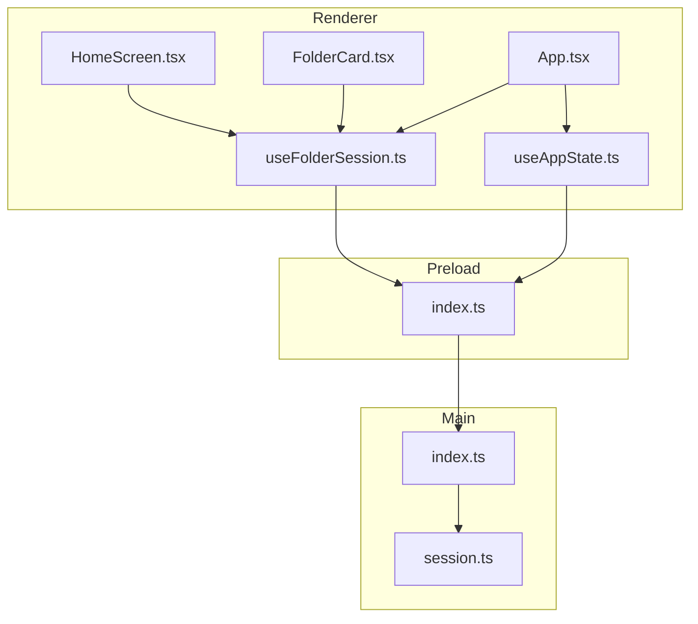
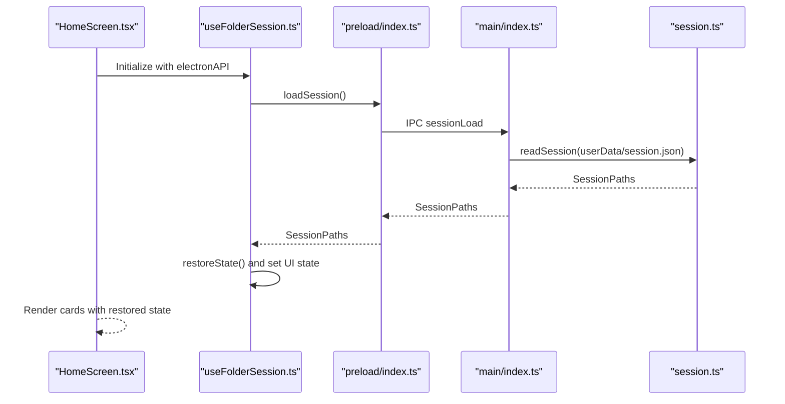
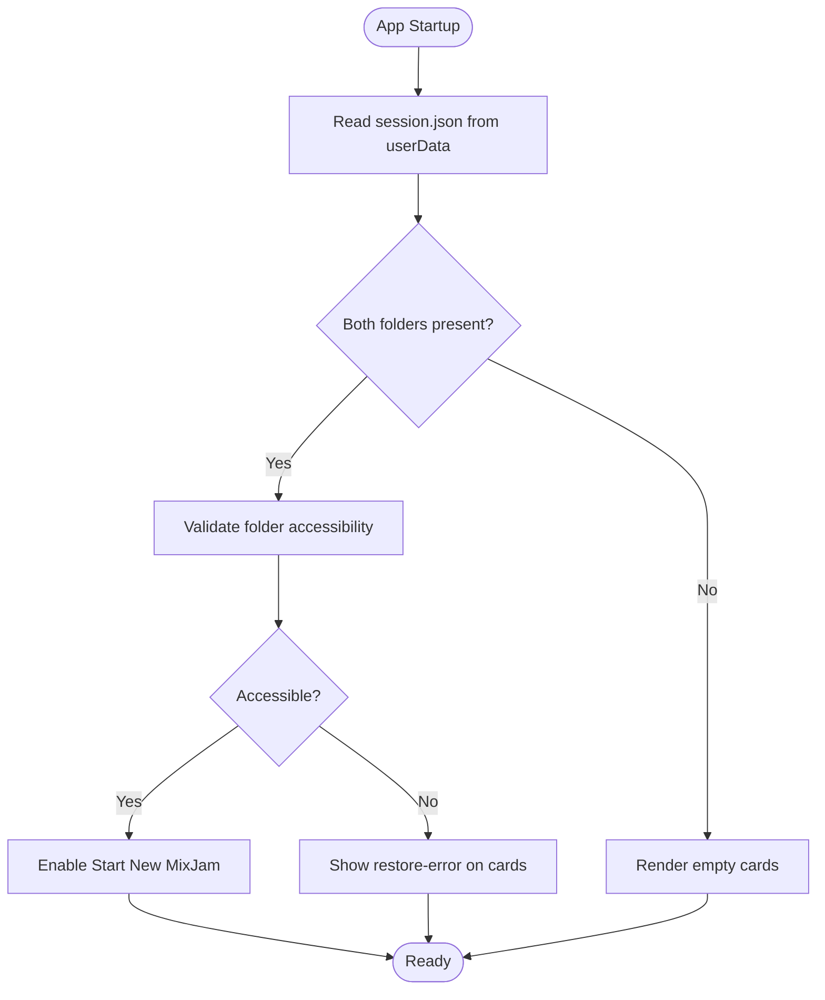
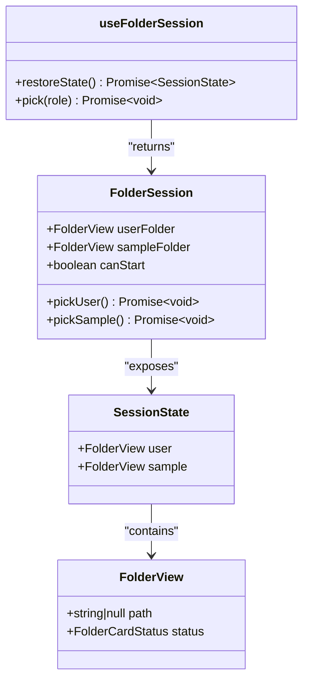
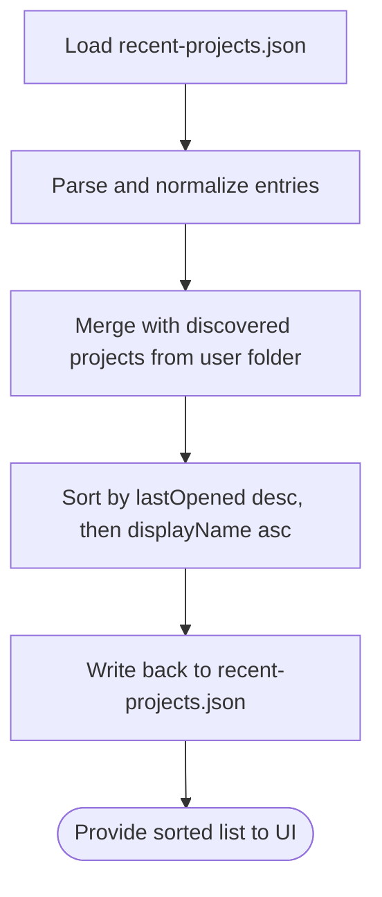
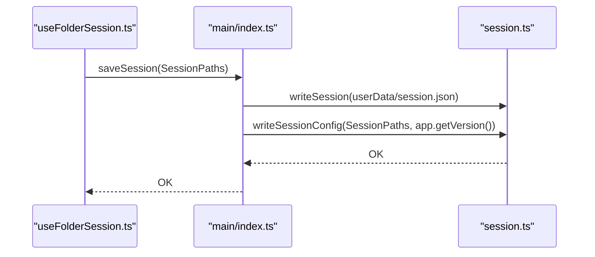
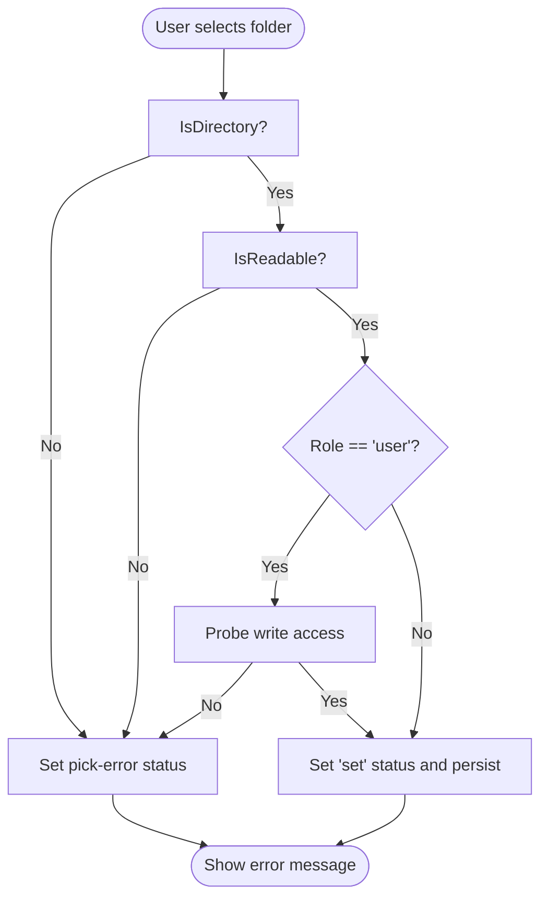
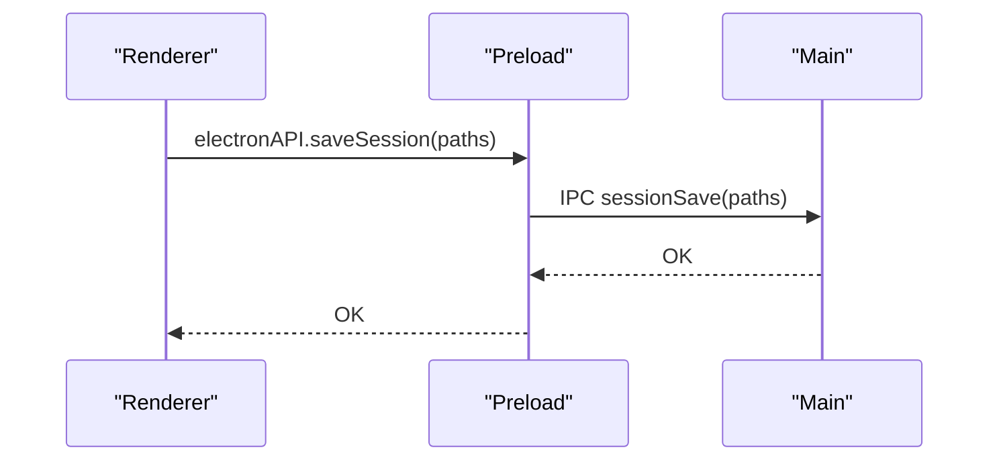
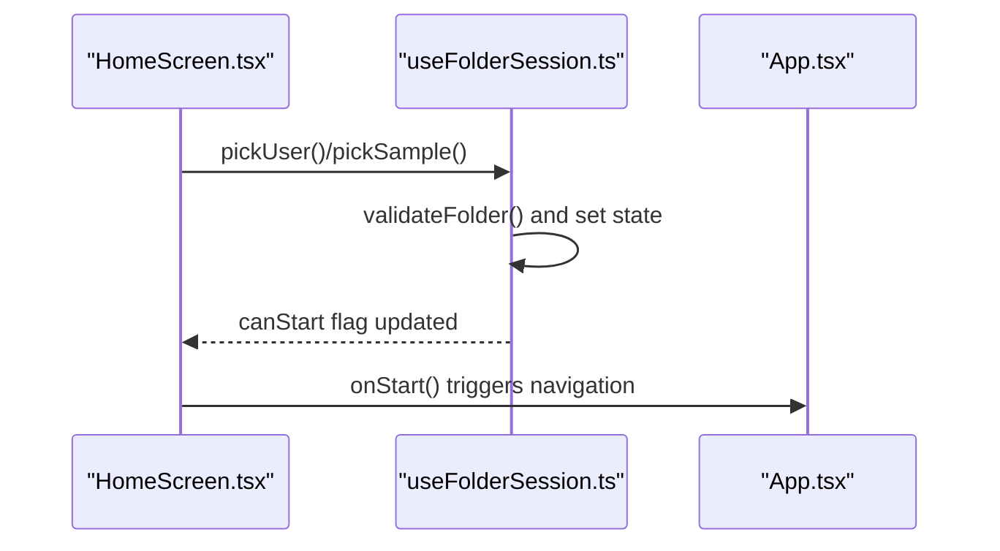
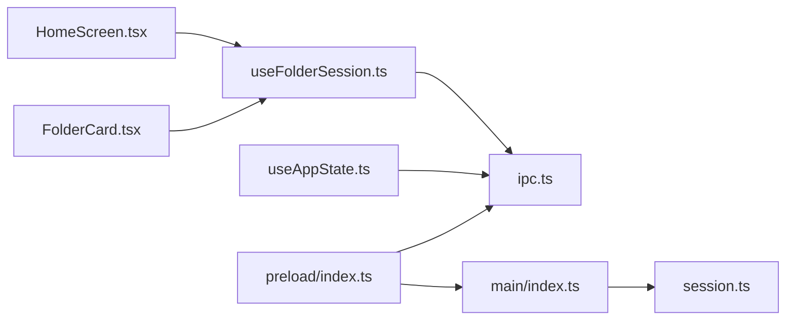

# Session Management

<cite>
**Referenced Files in This Document**
- [session.ts](file://src/main/session.ts)
- [index.ts](file://src/main/index.ts)
- [useFolderSession.ts](file://src/renderer/src/hooks/useFolderSession.ts)
- [ipc.ts](file://src/shared/ipc.ts)
- [index.ts](file://src/preload/index.ts)
- [HomeScreen.tsx](file://src/renderer/src/components/HomeScreen.tsx)
- [FolderCard.tsx](file://src/renderer/src/components/FolderCard.tsx)
- [useAppState.ts](file://src/renderer/src/hooks/useAppState.ts)
- [App.tsx](file://src/renderer/src/App.tsx)
- [spec-003-folder-session-management.md](file://docs/specs/spec-003-folder-session-management.md)
- [session.test.ts](file://src/main/session.test.ts)
- [package.json](file://package.json)
</cite>

## Table of Contents
1. [Introduction](#introduction)
2. [Project Structure](#project-structure)
3. [Core Components](#core-components)
4. [Architecture Overview](#architecture-overview)
5. [Detailed Component Analysis](#detailed-component-analysis)
6. [Dependency Analysis](#dependency-analysis)
7. [Performance Considerations](#performance-considerations)
8. [Troubleshooting Guide](#troubleshooting-guide)
9. [Conclusion](#conclusion)

## Introduction
This document describes MixJam Electron's session management system, covering user preference persistence, recent project tracking, and session state restoration. It explains the folder session hook implementation, user profile management, and project file handling. It details data persistence strategies, configuration storage, and state synchronization across application restarts, along with the session lifecycle, error handling, backup strategies, and recovery mechanisms. The focus is on ensuring a seamless user experience across application launches.

## Project Structure
The session management system spans three layers:
- Main process: file system operations, session persistence, and IPC handlers
- Preload bridge: secure IPC exposure to the renderer
- Renderer: React hooks and UI components for folder selection and session restoration

**Diagram sources**
- [HomeScreen.tsx:1-77](file://src/renderer/src/components/HomeScreen.tsx#L1-L77)
- [FolderCard.tsx:1-60](file://src/renderer/src/components/FolderCard.tsx#L1-L60)
- [useFolderSession.ts:1-106](file://src/renderer/src/hooks/useFolderSession.ts#L1-L106)
- [useAppState.ts:1-295](file://src/renderer/src/hooks/useAppState.ts#L1-L295)
- [App.tsx:1-108](file://src/renderer/src/App.tsx#L1-L108)
- [index.ts:1-29](file://src/preload/index.ts#L1-L29)
- [index.ts:1-170](file://src/main/index.ts#L1-L170)
- [session.ts:1-265](file://src/main/session.ts#L1-L265)

**Section sources**
- [HomeScreen.tsx:1-77](file://src/renderer/src/components/HomeScreen.tsx#L1-L77)
- [useFolderSession.ts:1-106](file://src/renderer/src/hooks/useFolderSession.ts#L1-L106)
- [index.ts:1-29](file://src/preload/index.ts#L1-L29)
- [index.ts:1-170](file://src/main/index.ts#L1-L170)
- [session.ts:1-265](file://src/main/session.ts#L1-L265)

## Core Components
- Session persistence: stores user and sample folder paths in a JSON file under the OS user data directory
- Session configuration: writes a machine-readable session config file into the user folder upon valid session establishment
- Recent projects: maintains a registry of recently opened projects and discovers projects from the user folder
- Folder validation: ensures folders are accessible and meet role-specific requirements
- IPC channels: standardized communication between renderer and main process for session operations

Key responsibilities:
- Restore session state on app startup
- Persist user choices and update on changes
- Enforce folder selection order and availability
- Provide robust error handling for inaccessible or corrupted data

**Section sources**
- [session.ts:1-265](file://src/main/session.ts#L1-L265)
- [index.ts:1-170](file://src/main/index.ts#L1-L170)
- [ipc.ts:1-59](file://src/shared/ipc.ts#L1-L59)

## Architecture Overview
The session management architecture follows a layered design with explicit boundaries:

**Diagram sources**
- [HomeScreen.tsx:1-77](file://src/renderer/src/components/HomeScreen.tsx#L1-L77)
- [useFolderSession.ts:1-106](file://src/renderer/src/hooks/useFolderSession.ts#L1-L106)
- [index.ts:1-29](file://src/preload/index.ts#L1-L29)
- [index.ts:104-107](file://src/main/index.ts#L104-L107)
- [session.ts:67-73](file://src/main/session.ts#L67-L73)

## Detailed Component Analysis

### Session Persistence and Restoration
- Storage locations:
  - Session file: OS user data directory with filename "session.json"
  - Recent projects registry: OS user data directory with filename "recent-projects.json"
  - Session config: user folder with filename "mixjam.json"
- Restoration flow:
  - On app startup, the main process reads the session file and exposes it via IPC
  - The renderer hook restores UI state from the persisted session
  - If folders are accessible, the "Start New MixJam" button becomes active immediately

**Diagram sources**
- [index.ts:104-107](file://src/main/index.ts#L104-L107)
- [session.ts:67-73](file://src/main/session.ts#L67-L73)
- [useFolderSession.ts:39-49](file://src/renderer/src/hooks/useFolderSession.ts#L39-L49)

**Section sources**
- [session.ts:5-8](file://src/main/session.ts#L5-L8)
- [session.ts:67-77](file://src/main/session.ts#L67-L77)
- [index.ts:30-36](file://src/main/index.ts#L30-L36)
- [index.ts:104-107](file://src/main/index.ts#L104-L107)

### Folder Session Hook Implementation
The renderer-side hook manages:
- State representation for user and sample folders
- Asynchronous restoration of previous selections
- Folder selection flow with validation and persistence
- UI enablement logic based on folder availability

**Diagram sources**
- [useFolderSession.ts:6-57](file://src/renderer/src/hooks/useFolderSession.ts#L6-L57)

**Section sources**
- [useFolderSession.ts:1-106](file://src/renderer/src/hooks/useFolderSession.ts#L1-L106)
- [FolderCard.tsx:1-60](file://src/renderer/src/components/FolderCard.tsx#L1-L60)

### Recent Projects Tracking
- Registry maintenance:
  - Reads/writes a JSON registry of recent projects
  - Deduplicates entries by canonicalized path
  - Sorts by last opened timestamp, falling back to display name
- Discovery:
  - Recursively scans the user folder for project files and merges with registry
- Integration:
  - Renderer loads recent projects when user folder is available
  - Recording occurs when a project is opened

**Diagram sources**
- [session.ts:183-233](file://src/main/session.ts#L183-L233)
- [session.ts:114-135](file://src/main/session.ts#L114-L135)
- [session.ts:149-181](file://src/main/session.ts#L149-L181)

**Section sources**
- [session.ts:84-135](file://src/main/session.ts#L84-L135)
- [session.ts:149-181](file://src/main/session.ts#L149-L181)
- [session.ts:183-233](file://src/main/session.ts#L183-L233)
- [useAppState.ts:71-91](file://src/renderer/src/hooks/useAppState.ts#L71-L91)

### Session Configuration File
- Purpose: store app version, folder paths, and last opened timestamp in the user folder
- Conditions: written when both folders are set and the user folder is accessible
- Lifecycle: written on session save and on app before-quit event

**Diagram sources**
- [useFolderSession.ts:90-91](file://src/renderer/src/hooks/useFolderSession.ts#L90-L91)
- [index.ts:109-117](file://src/main/index.ts#L109-L117)
- [session.ts:256-264](file://src/main/session.ts#L256-L264)

**Section sources**
- [session.ts:235-264](file://src/main/session.ts#L235-L264)
- [index.ts:69-73](file://src/main/index.ts#L69-L73)
- [index.ts:109-117](file://src/main/index.ts#L109-L117)

### Folder Validation and Accessibility
- Validation criteria:
  - Must be a directory
  - Must be readable
  - User folder must be writable (probe-based detection)
- Error states:
  - "Cannot access this folder. Check permissions and try again." for invalid selection
  - "Folder not accessible — pick a new one." for restored inaccessible folders

**Diagram sources**
- [session.ts:21-57](file://src/main/session.ts#L21-L57)
- [useFolderSession.ts:30-37](file://src/renderer/src/hooks/useFolderSession.ts#L30-L37)

**Section sources**
- [session.ts:21-57](file://src/main/session.ts#L21-L57)
- [FolderCard.tsx:4-5](file://src/renderer/src/components/FolderCard.tsx#L4-L5)

### IPC Channels and Bridge
- Channels:
  - sessionLoad/sessionSave for session persistence
  - folderPick/folderValidate for folder selection and validation
  - recentProjectsList/recentProjectsRecord for recent project tracking
  - dialogOpenFile/dialogOpenFolder for file/folder pickers
- Bridge:
  - Exposes a typed ElectronAPI surface to the renderer
  - Uses invoke for request-response IPC

**Diagram sources**
- [ipc.ts:1-59](file://src/shared/ipc.ts#L1-L59)
- [index.ts:1-29](file://src/preload/index.ts#L1-L29)
- [index.ts:109-117](file://src/main/index.ts#L109-L117)

**Section sources**
- [ipc.ts:1-59](file://src/shared/ipc.ts#L1-L59)
- [index.ts:1-29](file://src/preload/index.ts#L1-L29)
- [index.ts:104-153](file://src/main/index.ts#L104-L153)

### UI Integration and Launch Gate
- Home screen layout:
  - User Folder card (always enabled)
  - Sample Folder card (disabled until user folder is set)
  - "Start New MixJam" button disabled until both folders are set
- Error messaging:
  - Clear status messages for pick errors and restore errors
- Navigation:
  - On valid session, clicking "Start New MixJam" transitions to tracker view

**Diagram sources**
- [HomeScreen.tsx:39-68](file://src/renderer/src/components/HomeScreen.tsx#L39-L68)
- [useFolderSession.ts:59-104](file://src/renderer/src/hooks/useFolderSession.ts#L59-L104)
- [App.tsx:64-73](file://src/renderer/src/App.tsx#L64-L73)

**Section sources**
- [HomeScreen.tsx:1-77](file://src/renderer/src/components/HomeScreen.tsx#L1-L77)
- [useFolderSession.ts:1-106](file://src/renderer/src/hooks/useFolderSession.ts#L1-L106)
- [App.tsx:1-108](file://src/renderer/src/App.tsx#L1-L108)

## Dependency Analysis
- Renderer depends on:
  - useFolderSession for session state and actions
  - useAppState for recent projects and sample browser integration
  - IPC channels exposed via preload bridge
- Main process depends on:
  - session.ts for file system operations and normalization
  - Electron APIs for dialogs, windows, and app lifecycle
- Shared types define the contract between renderer and main

**Diagram sources**
- [useFolderSession.ts:1-106](file://src/renderer/src/hooks/useFolderSession.ts#L1-L106)
- [useAppState.ts:1-295](file://src/renderer/src/hooks/useAppState.ts#L1-L295)
- [ipc.ts:1-59](file://src/shared/ipc.ts#L1-L59)
- [index.ts:1-29](file://src/preload/index.ts#L1-L29)
- [index.ts:1-170](file://src/main/index.ts#L1-L170)
- [session.ts:1-265](file://src/main/session.ts#L1-L265)
- [HomeScreen.tsx:1-77](file://src/renderer/src/components/HomeScreen.tsx#L1-L77)
- [FolderCard.tsx:1-60](file://src/renderer/src/components/FolderCard.tsx#L1-L60)

**Section sources**
- [ipc.ts:1-59](file://src/shared/ipc.ts#L1-L59)
- [index.ts:1-170](file://src/main/index.ts#L1-L170)
- [session.ts:1-265](file://src/main/session.ts#L1-L265)

## Performance Considerations
- Asynchronous operations:
  - Folder validation and session read/write are asynchronous to avoid blocking the UI
- Concurrency:
  - Parallel restoration of user and sample folder validations
- Disk I/O:
  - Minimizes repeated writes by updating session state only on successful validation
- Sorting and deduplication:
  - Efficient sorting and deduplication of recent projects using canonicalized paths and maps

[No sources needed since this section provides general guidance]

## Troubleshooting Guide
Common issues and recovery strategies:
- Corrupted session file:
  - The session reader returns default empty paths when parsing fails, allowing safe startup
  - Users can reselect folders to rebuild the session
- Inaccessible folders:
  - Renderer displays clear error messages; users can pick new folders
  - On restore, inaccessible folders show a restore-error state prompting replacement
- Write permission failures:
  - User folder write probe detects lack of write access; validation fails and shows an error
- Recent projects registry corruption:
  - The registry reader returns an empty list on parse failure; discovery from user folder continues
- Session config write failures:
  - Main process logs errors during before-quit and session save; app continues operating

Recovery steps:
- Restart the app to trigger session restoration
- Re-select folders if validation fails
- Verify folder permissions and accessibility
- Check OS user data directory for session.json and recent-projects.json

**Section sources**
- [session.ts:67-73](file://src/main/session.ts#L67-L73)
- [session.ts:183-189](file://src/main/session.ts#L183-L189)
- [useFolderSession.ts:30-37](file://src/renderer/src/hooks/useFolderSession.ts#L30-L37)
- [index.ts:69-73](file://src/main/index.ts#L69-L73)
- [index.ts:109-117](file://src/main/index.ts#L109-L117)

## Conclusion
MixJam Electron’s session management system provides a robust, user-friendly mechanism for managing folder preferences, restoring state across launches, and tracking recent projects. The design separates concerns between renderer, preload, and main process, with clear IPC boundaries and resilient error handling. The combination of session persistence, configuration file generation, and recent project discovery ensures a seamless user experience, while validation and error reporting guide users through potential issues.