# Session Management

<cite>
**Referenced Files in This Document**
- [session.ts](file://src/main/session.ts)
- [index.ts](file://src/main/index.ts)
- [useFolderSession.ts](file://src/renderer/src/hooks/useFolderSession.ts)
- [ipc.ts](file://src/shared/ipc.ts)
- [index.ts](file://src/preload/index.ts)
- [HomeScreen.tsx](file://src/renderer/src/components/HomeScreen.tsx)
- [FolderCard.tsx](file://src/renderer/src/components/FolderCard.tsx)
- [useAppState.ts](file://src/renderer/src/hooks/useAppState.ts)
- [App.tsx](file://src/renderer/src/App.tsx)
- [useLibraryData.ts](file://src/renderer/src/hooks/useLibraryData.ts)
- [spec-003-folder-session-management.md](file://docs/specs/spec-003-folder-session-management.md)
- [session.test.ts](file://src/main/session.test.ts)
- [package.json](file://package.json)
</cite>

## Update Summary
**Changes Made**
- Enhanced recent projects functionality with comprehensive project tracking
- Improved persistent project access with automatic discovery and merging
- Strengthened session configuration file management with version control
- Added robust error handling for corrupted session data
- Expanded IPC channels for recent project operations

## Table of Contents
1. [Introduction](#introduction)
2. [Project Structure](#project-structure)
3. [Core Components](#core-components)
4. [Architecture Overview](#architecture-overview)
5. [Detailed Component Analysis](#detailed-component-analysis)
6. [Recent Projects Enhancement](#recent-projects-enhancement)
7. [Session Configuration Management](#session-configuration-management)
8. [Dependency Analysis](#dependency-analysis)
9. [Performance Considerations](#performance-considerations)
10. [Troubleshooting Guide](#troubleshooting-guide)
11. [Conclusion](#conclusion)

## Introduction
This document describes MixJam Electron's enhanced session management system, covering user preference persistence, recent project tracking, and session state restoration. The system has been significantly enhanced with comprehensive recent projects functionality, persistent project access, and improved session handling. It explains the folder session hook implementation, user profile management, and project file handling. It details data persistence strategies, configuration storage, and state synchronization across application restarts, along with the session lifecycle, error handling, backup strategies, and recovery mechanisms. The focus is on ensuring a seamless user experience across application launches with robust project management capabilities.

## Project Structure
The session management system spans three layers with enhanced recent project functionality:
- Main process: file system operations, session persistence, recent project tracking, and IPC handlers
- Preload bridge: secure IPC exposure to the renderer with recent project operations
- Renderer: React hooks and UI components for folder selection, session restoration, and project access

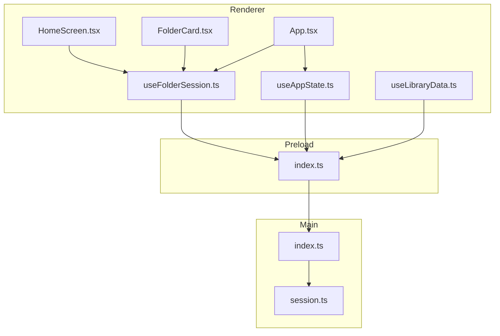

**Diagram sources**
- [HomeScreen.tsx:1-77](file://src/renderer/src/components/HomeScreen.tsx#L1-L77)
- [FolderCard.tsx:1-60](file://src/renderer/src/components/FolderCard.tsx#L1-L60)
- [useFolderSession.ts:1-106](file://src/renderer/src/hooks/useFolderSession.ts#L1-L106)
- [useAppState.ts:1-77](file://src/renderer/src/hooks/useAppState.ts#L1-L77)
- [useLibraryData.ts:1-200](file://src/renderer/src/hooks/useLibraryData.ts#L1-L200)
- [App.tsx:1-177](file://src/renderer/src/App.tsx#L1-L177)
- [index.ts:1-61](file://src/preload/index.ts#L1-L61)
- [index.ts:1-342](file://src/main/index.ts#L1-L342)
- [session.ts:1-265](file://src/main/session.ts#L1-L265)

**Section sources**
- [HomeScreen.tsx:1-77](file://src/renderer/src/components/HomeScreen.tsx#L1-L77)
- [useFolderSession.ts:1-106](file://src/renderer/src/hooks/useFolderSession.ts#L1-L106)
- [index.ts:1-61](file://src/preload/index.ts#L1-L61)
- [index.ts:1-342](file://src/main/index.ts#L1-L342)
- [session.ts:1-265](file://src/main/session.ts#L1-L265)

## Core Components
- **Enhanced Session Persistence**: stores user and sample folder paths in a JSON file under the OS user data directory with improved error handling
- **Comprehensive Recent Projects Tracking**: maintains a registry of recently opened projects with automatic discovery from user folders
- **Session Configuration Management**: writes a machine-readable session config file into the user folder upon valid session establishment with version control
- **Folder Validation**: ensures folders are accessible and meet role-specific requirements with enhanced validation logic
- **IPC Channels**: standardized communication between renderer and main process for session operations including recent project management

Key responsibilities:
- Restore session state on app startup with enhanced error recovery
- Persist user choices and update on changes with comprehensive validation
- Enforce folder selection order and availability with improved user experience
- Provide robust error handling for inaccessible or corrupted data
- Manage recent project access with automatic discovery and merging
- Handle session configuration with version tracking and backup strategies

**Section sources**
- [session.ts:1-265](file://src/main/session.ts#L1-L265)
- [index.ts:1-342](file://src/main/index.ts#L1-L342)
- [ipc.ts:1-204](file://src/shared/ipc.ts#L1-L204)

## Architecture Overview
The enhanced session management architecture follows a layered design with explicit boundaries and comprehensive recent project integration:

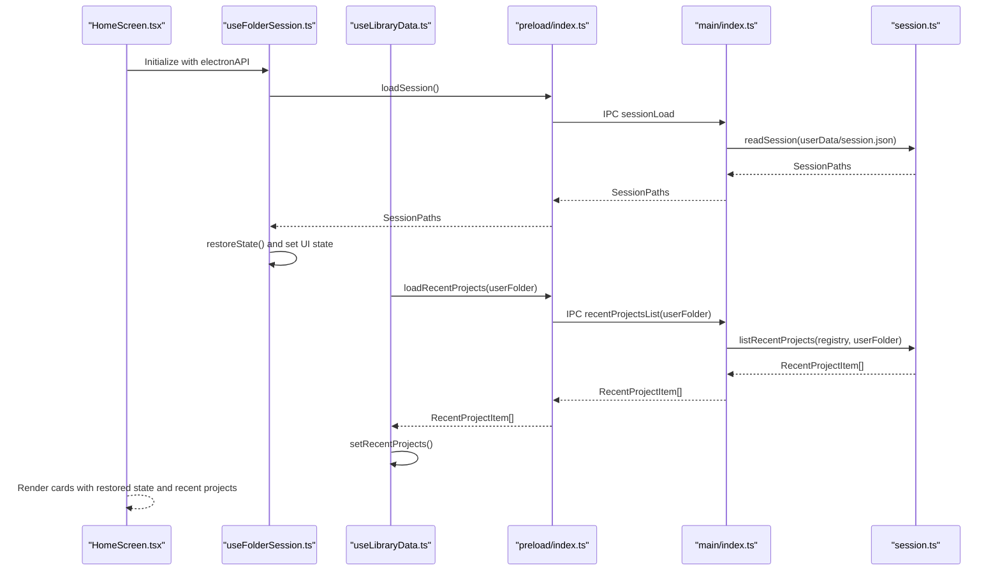

**Diagram sources**
- [HomeScreen.tsx:1-77](file://src/renderer/src/components/HomeScreen.tsx#L1-L77)
- [useFolderSession.ts:1-106](file://src/renderer/src/hooks/useFolderSession.ts#L1-L106)
- [useLibraryData.ts:110-122](file://src/renderer/src/hooks/useLibraryData.ts#L110-L122)
- [index.ts:1-61](file://src/preload/index.ts#L1-L61)
- [index.ts:155-178](file://src/main/index.ts#L155-L178)
- [session.ts:68-78](file://src/main/session.ts#L68-L78)
- [session.ts:209-229](file://src/main/session.ts#L209-L229)

## Detailed Component Analysis

### Enhanced Session Persistence and Restoration
- **Storage locations**:
  - Session file: OS user data directory with filename "session.json" with comprehensive error handling
  - Recent projects registry: OS user data directory with filename "recent-projects.json" with automatic discovery
  - Session config: user folder with filename "mixjam.json" with version control
- **Enhanced restoration flow**:
  - On app startup, the main process reads the session file and exposes it via IPC with fallback to empty state
  - The renderer hook restores UI state from the persisted session with improved error recovery
  - If folders are accessible, the "Start New MixJam" button becomes active immediately
  - Recent projects are loaded asynchronously and merged with discovered projects

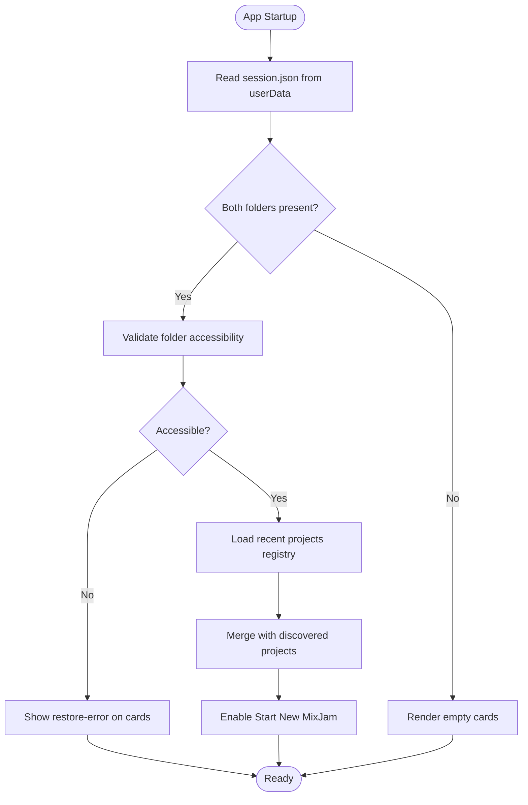

**Diagram sources**
- [index.ts:155-158](file://src/main/index.ts#L155-L158)
- [session.ts:68-78](file://src/main/session.ts#L68-L78)
- [useFolderSession.ts:39-49](file://src/renderer/src/hooks/useFolderSession.ts#L39-L49)
- [session.ts:209-229](file://src/main/session.ts#L209-L229)

**Section sources**
- [session.ts:5-8](file://src/main/session.ts#L5-L8)
- [session.ts:68-78](file://src/main/session.ts#L68-L78)
- [index.ts:64-70](file://src/main/index.ts#L64-L70)
- [index.ts:155-158](file://src/main/index.ts#L155-L158)

### Folder Session Hook Implementation
The renderer-side hook manages:
- State representation for user and sample folders with enhanced status tracking
- Asynchronous restoration of previous selections with improved error handling
- Folder selection flow with validation and persistence
- UI enablement logic based on folder availability
- Integration with recent project loading for comprehensive session management

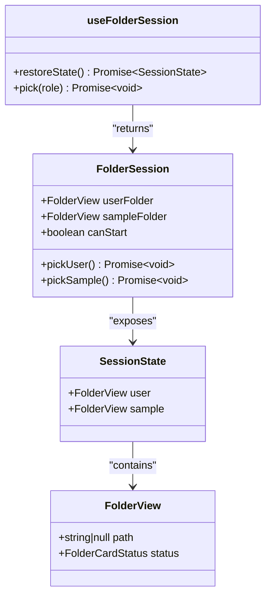

**Diagram sources**
- [useFolderSession.ts:6-57](file://src/renderer/src/hooks/useFolderSession.ts#L6-L57)

**Section sources**
- [useFolderSession.ts:1-106](file://src/renderer/src/hooks/useFolderSession.ts#L1-L106)
- [FolderCard.tsx:1-60](file://src/renderer/src/components/FolderCard.tsx#L1-L60)

### Enhanced Folder Validation and Accessibility
- **Enhanced validation criteria**:
  - Must be a directory with comprehensive error handling
  - Must be readable with fallback mechanisms
  - User folder must be writable (probe-based detection with improved reliability)
- **Improved error states**:
  - "Cannot access this folder. Check permissions and try again." for invalid selection
  - "Folder not accessible — pick a new one." for restored inaccessible folders
  - Comprehensive error recovery and user guidance

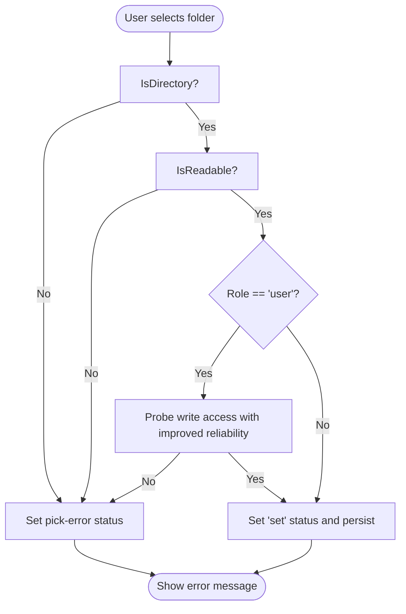

**Diagram sources**
- [session.ts:53-58](file://src/main/session.ts#L53-L58)
- [useFolderSession.ts:82-93](file://src/renderer/src/hooks/useFolderSession.ts#L82-L93)

**Section sources**
- [session.ts:53-58](file://src/main/session.ts#L53-L58)
- [FolderCard.tsx:4-5](file://src/renderer/src/components/FolderCard.tsx#L4-L5)

### IPC Channels and Bridge Enhancement
- **Enhanced channels**:
  - sessionLoad/sessionSave for session persistence with improved error handling
  - folderPick/folderValidate for folder selection and validation with comprehensive feedback
  - recentProjectsList/recentProjectsRecord for recent project tracking with automatic discovery
  - dialogOpenFile/dialogOpenFolder for file/folder pickers with enhanced user experience
- **Enhanced bridge**:
  - Exposes a typed ElectronAPI surface to the renderer with recent project operations
  - Uses invoke for request-response IPC with improved error propagation
  - Integrates recent project loading with session management

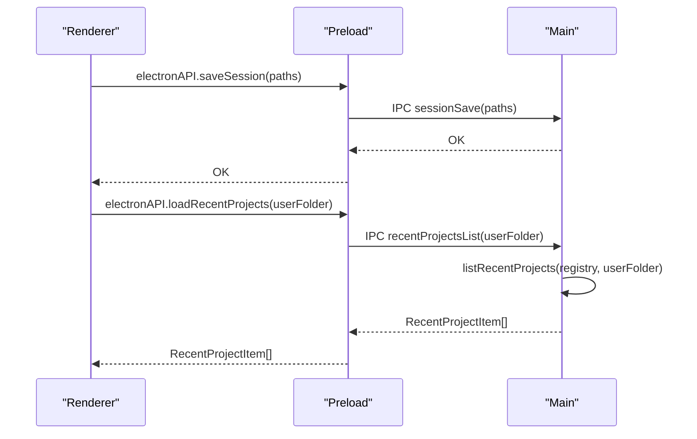

**Diagram sources**
- [ipc.ts:160-170](file://src/shared/ipc.ts#L160-L170)
- [index.ts:1-61](file://src/preload/index.ts#L1-L61)
- [index.ts:155-178](file://src/main/index.ts#L155-L178)

**Section sources**
- [ipc.ts:1-204](file://src/shared/ipc.ts#L1-L204)
- [index.ts:1-61](file://src/preload/index.ts#L1-L61)
- [index.ts:155-178](file://src/main/index.ts#L155-L178)

### UI Integration and Launch Gate Enhancement
- **Enhanced home screen layout**:
  - User Folder card (always enabled) with improved status display
  - Sample Folder card (disabled until user folder is set) with enhanced user guidance
  - "Start New MixJam" button disabled until both folders are set with improved user feedback
  - "Load MixJam" link with recent project integration
- **Enhanced error messaging**:
  - Clear status messages for pick errors and restore errors with actionable guidance
  - Improved user experience with contextual help and recovery options
- **Enhanced navigation**:
  - On valid session, clicking "Start New MixJam" transitions to tracker view with recent project access
  - Integration with library data for comprehensive project management

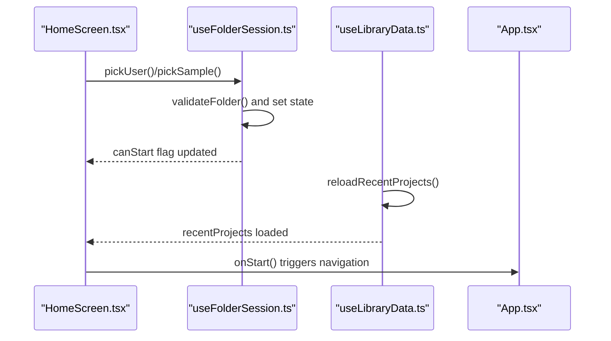

**Diagram sources**
- [HomeScreen.tsx:39-68](file://src/renderer/src/components/HomeScreen.tsx#L39-L68)
- [useFolderSession.ts:82-104](file://src/renderer/src/hooks/useFolderSession.ts#L82-L104)
- [useLibraryData.ts:110-122](file://src/renderer/src/hooks/useLibraryData.ts#L110-L122)
- [App.tsx:101-110](file://src/renderer/src/App.tsx#L101-L110)

**Section sources**
- [HomeScreen.tsx:1-77](file://src/renderer/src/components/HomeScreen.tsx#L1-L77)
- [useFolderSession.ts:1-106](file://src/renderer/src/hooks/useFolderSession.ts#L1-L106)
- [App.tsx:1-177](file://src/renderer/src/App.tsx#L1-L177)

## Recent Projects Enhancement

### Comprehensive Recent Projects Tracking
The system now provides enhanced recent projects functionality with automatic discovery and intelligent merging:

- **Registry maintenance**:
  - Reads/writes a JSON registry of recent projects with comprehensive error handling
  - Deduplicates entries by canonicalized path with improved path normalization
  - Sorts by last opened timestamp, falling back to display name for tie-breaking
  - Automatic cleanup of invalid or inaccessible projects
- **Intelligent discovery**:
  - Recursively scans the user folder for project files and merges with registry
  - Supports multiple project file formats with extension-based filtering
  - Handles case-insensitive path comparisons and normalization
- **Advanced integration**:
  - Renderer loads recent projects when user folder is available with background loading
  - Automatic recording occurs when a project is opened with timestamp tracking
  - Real-time updates to recent projects list with debounced refresh

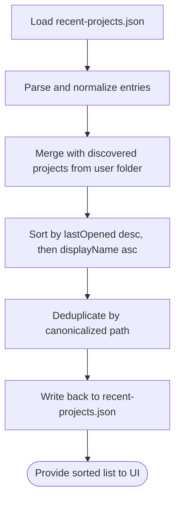

**Diagram sources**
- [session.ts:179-196](file://src/main/session.ts#L179-L196)
- [session.ts:110-131](file://src/main/session.ts#L110-L131)
- [session.ts:145-177](file://src/main/session.ts#L145-L177)
- [session.ts:209-229](file://src/main/session.ts#L209-L229)

**Section sources**
- [session.ts:80-131](file://src/main/session.ts#L80-L131)
- [session.ts:145-177](file://src/main/session.ts#L145-L177)
- [session.ts:179-196](file://src/main/session.ts#L179-L196)
- [useLibraryData.ts:110-122](file://src/renderer/src/hooks/useLibraryData.ts#L110-L122)

### Advanced Project Discovery and Merging
The system implements sophisticated project discovery with intelligent merging strategies:

- **Discovery algorithm**:
  - Recursive directory traversal with comprehensive error handling
  - File extension filtering for project files (.mixjam format)
  - Path canonicalization for consistent comparison and deduplication
  - Background processing to avoid UI blocking
- **Merging strategy**:
  - Priority given to registry entries with newer timestamps
  - Automatic discovery of projects not yet in registry
  - Maintains user-defined ordering while adding discovered items
  - Handles edge cases like missing timestamps gracefully

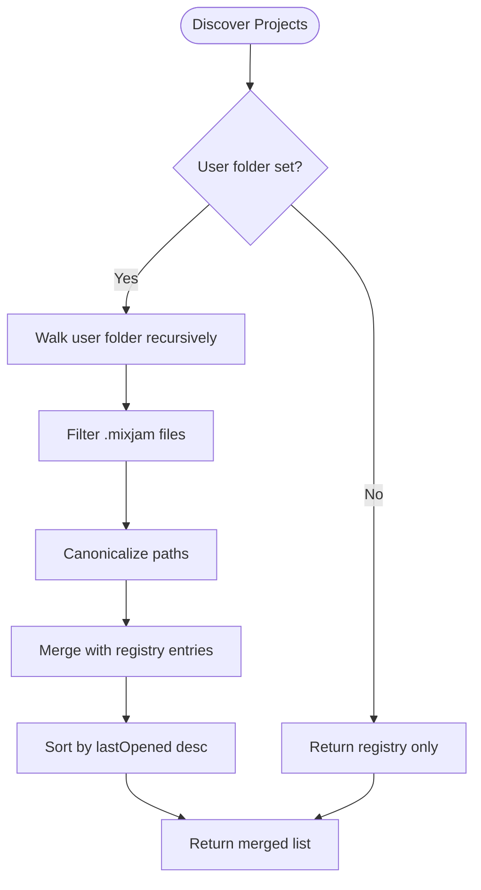

**Diagram sources**
- [session.ts:145-177](file://src/main/session.ts#L145-L177)
- [session.ts:209-229](file://src/main/session.ts#L209-L229)

**Section sources**
- [session.ts:145-177](file://src/main/session.ts#L145-L177)
- [session.ts:209-229](file://src/main/session.ts#L209-L229)

## Session Configuration Management

### Enhanced Session Configuration File
The system now provides comprehensive session configuration management with version control and backup strategies:

- **Purpose**: store app version, folder paths, and last opened timestamp in the user folder with enhanced metadata
- **Conditions**: written when both folders are set and the user folder is accessible with improved validation
- **Lifecycle**: written on session save, on app before-quit event, and on successful project opening
- **Enhanced features**:
  - Version tracking with automatic app version detection
  - Timestamp management for session activity monitoring
  - Backup and recovery mechanisms for corrupted configurations
  - Cross-platform path normalization and compatibility

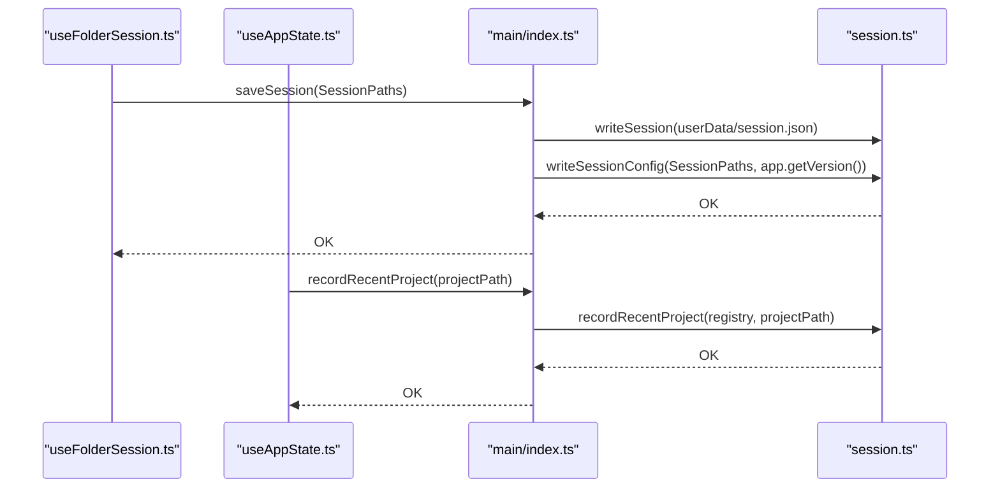

**Diagram sources**
- [useFolderSession.ts:90-91](file://src/renderer/src/hooks/useFolderSession.ts#L90-L91)
- [useAppState.ts:46-57](file://src/renderer/src/hooks/useAppState.ts#L46-L57)
- [index.ts:155-168](file://src/main/index.ts#L155-L168)
- [session.ts:256-264](file://src/main/session.ts#L256-L264)

**Section sources**
- [session.ts:235-264](file://src/main/session.ts#L235-L264)
- [index.ts:118-124](file://src/main/index.ts#L118-L124)
- [index.ts:155-168](file://src/main/index.ts#L155-L168)
- [useAppState.ts:46-57](file://src/renderer/src/hooks/useAppState.ts#L46-L57)

### Enhanced Error Handling and Recovery
The system implements comprehensive error handling with graceful degradation:

- **Session file corruption**: The session reader returns default empty paths when parsing fails, allowing safe startup
- **Recent projects registry corruption**: The registry reader returns an empty list on parse failure; discovery from user folder continues
- **Configuration write failures**: Main process logs errors during before-quit and session save; app continues operating
- **Folder accessibility issues**: Renderer displays clear error messages; users can pick new folders with guided recovery
- **Cross-platform compatibility**: Enhanced path handling for Windows, macOS, and Linux environments

**Section sources**
- [session.ts:68-78](file://src/main/session.ts#L68-L78)
- [session.ts:179-185](file://src/main/session.ts#L179-L185)
- [useFolderSession.ts:30-37](file://src/renderer/src/hooks/useFolderSession.ts#L30-L37)
- [index.ts:118-124](file://src/main/index.ts#L118-L124)
- [index.ts:155-168](file://src/main/index.ts#L155-L168)

## Dependency Analysis
- **Enhanced Renderer dependencies**:
  - useFolderSession for session state and actions with recent project integration
  - useAppState for comprehensive application state including recent projects
  - useLibraryData for recent project loading and sample browser integration
  - IPC channels exposed via preload bridge with enhanced recent project operations
- **Main process dependencies**:
  - session.ts for file system operations, normalization, and recent project management
  - Electron APIs for dialogs, windows, and app lifecycle with enhanced error handling
  - Database integration for library management and sample browsing
- **Shared types define the contract** between renderer and main with comprehensive recent project interfaces

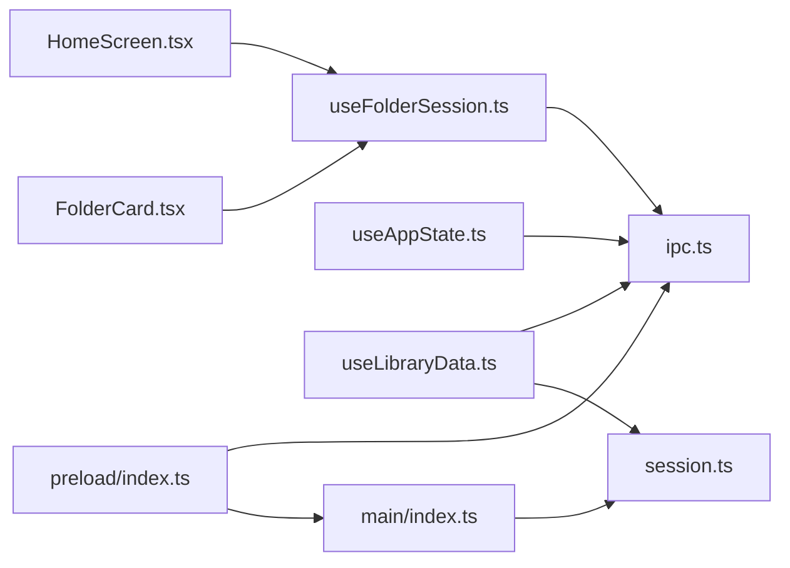

**Diagram sources**
- [useFolderSession.ts:1-106](file://src/renderer/src/hooks/useFolderSession.ts#L1-L106)
- [useAppState.ts:1-77](file://src/renderer/src/hooks/useAppState.ts#L1-L77)
- [useLibraryData.ts:1-200](file://src/renderer/src/hooks/useLibraryData.ts#L1-L200)
- [ipc.ts:1-204](file://src/shared/ipc.ts#L1-L204)
- [index.ts:1-61](file://src/preload/index.ts#L1-L61)
- [index.ts:1-342](file://src/main/index.ts#L1-L342)
- [session.ts:1-265](file://src/main/session.ts#L1-L265)
- [HomeScreen.tsx:1-77](file://src/renderer/src/components/HomeScreen.tsx#L1-L77)
- [FolderCard.tsx:1-60](file://src/renderer/src/components/FolderCard.tsx#L1-L60)

**Section sources**
- [ipc.ts:1-204](file://src/shared/ipc.ts#L1-L204)
- [index.ts:1-342](file://src/main/index.ts#L1-L342)
- [session.ts:1-265](file://src/main/session.ts#L1-L265)

## Performance Considerations
- **Enhanced asynchronous operations**:
  - Folder validation and session read/write are asynchronous to avoid blocking the UI
  - Recent project loading operates in the background with debounced updates
  - Parallel restoration of user and sample folder validations with improved concurrency
- **Optimized disk I/O**:
  - Minimizes repeated writes by updating session state only on successful validation
  - Efficient sorting and deduplication of recent projects using canonicalized paths and maps
  - Background discovery of projects to avoid UI blocking during startup
- **Memory management**:
  - Efficient handling of large recent project lists with pagination and lazy loading
  - Optimized path canonicalization to reduce memory overhead
  - Smart caching of validated folder paths to avoid repeated filesystem checks

## Troubleshooting Guide
Common issues and enhanced recovery strategies:
- **Corrupted session file**: The session reader returns default empty paths when parsing fails, allowing safe startup with graceful degradation
- **Recent projects registry corruption**: The registry reader returns an empty list on parse failure; discovery from user folder continues with automatic recovery
- **Configuration write failures**: Main process logs errors during before-quit and session save; app continues operating with fallback mechanisms
- **Folder accessibility issues**: Renderer displays clear error messages with actionable guidance; users can pick new folders with improved validation feedback
- **Cross-platform path issues**: Enhanced path normalization handles different filesystem conventions automatically
- **Recent project discovery failures**: System falls back to registry-only mode with manual refresh option

Enhanced recovery steps:
- Restart the app to trigger session restoration with improved error handling
- Re-select folders if validation fails with guided recovery assistance
- Verify folder permissions and accessibility with comprehensive diagnostic information
- Check OS user data directory for session.json, recent-projects.json, and mixjam.json
- Use the recent projects fallback mechanism if automatic discovery fails
- Monitor application logs for detailed error information and recovery suggestions

**Section sources**
- [session.ts:68-78](file://src/main/session.ts#L68-L78)
- [session.ts:179-185](file://src/main/session.ts#L179-L185)
- [useFolderSession.ts:30-37](file://src/renderer/src/hooks/useFolderSession.ts#L30-L37)
- [index.ts:118-124](file://src/main/index.ts#L118-L124)
- [index.ts:155-168](file://src/main/index.ts#L155-L168)

## Conclusion
MixJam Electron's enhanced session management system provides a robust, user-friendly mechanism for managing folder preferences, restoring state across launches, and tracking recent projects with comprehensive error handling and recovery capabilities. The system has been significantly strengthened with advanced recent projects functionality, persistent project access, and improved session handling. The design separates concerns between renderer, preload, and main process, with clear IPC boundaries and resilient error handling. The combination of session persistence, configuration file generation, comprehensive recent project discovery, and intelligent merging ensures a seamless user experience, while enhanced validation, error reporting, and recovery mechanisms guide users through potential issues with improved reliability and performance.