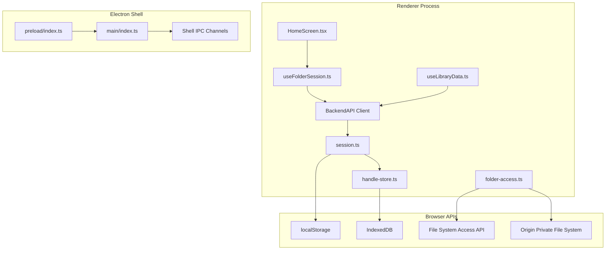
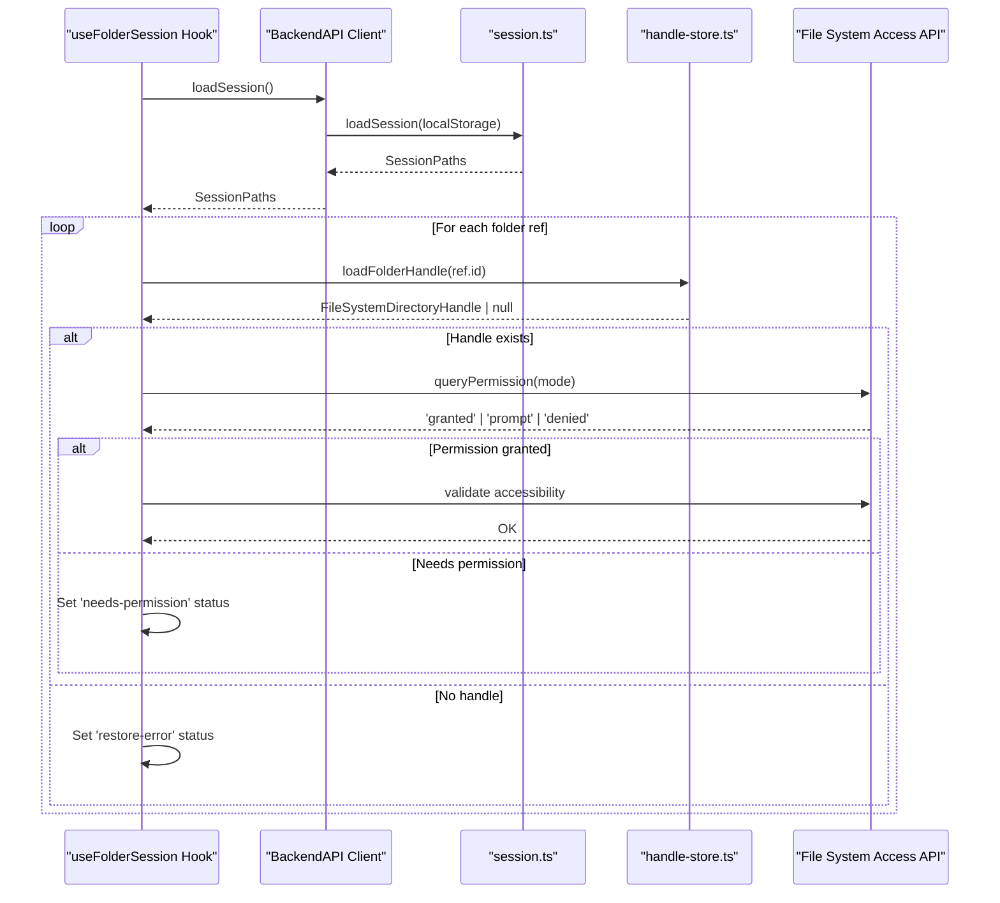
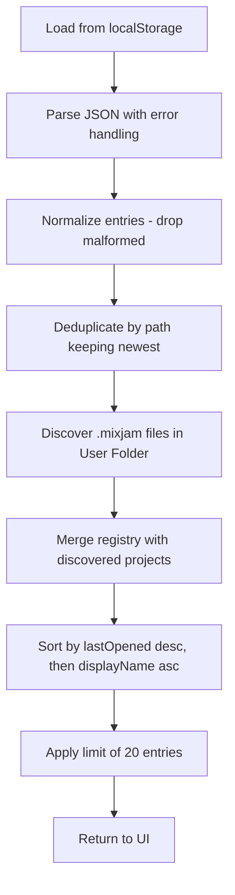
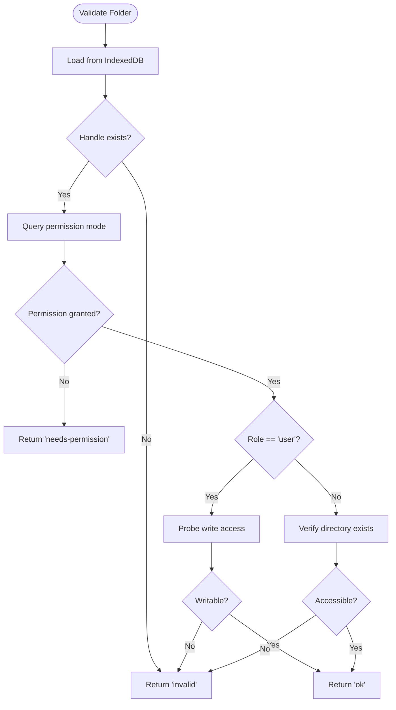

# Session Management

<cite>
**Referenced Files in This Document**
- [session.ts](file://src/renderer/src/backend/session.ts)
- [client.ts](file://src/renderer/src/backend/client.ts)
- [handle-store.ts](file://src/renderer/src/backend/handle-store.ts)
- [folder-access.ts](file://src/renderer/src/backend/folder-access.ts)
- [useFolderSession.ts](file://src/renderer/src/hooks/useFolderSession.ts)
- [useLibraryData.ts](file://src/renderer/src/hooks/useLibraryData.ts)
- [backend-api.ts](file://src/shared/backend-api.ts)
- [ipc.ts](file://src/shared/ipc.ts)
- [index.ts](file://src/preload/index.ts)
- [index.ts](file://src/main/index.ts)
</cite>

## Update Summary
**Changes Made**
- Complete migration of session management from main process to renderer-side backend as part of web-first architecture
- Removed all Electron IPC dependencies for session operations, moving logic to browser-native APIs
- Updated storage mechanisms from OS user data directory to localStorage and IndexedDB
- Restructured folder access using File System Access API with persistent handle storage
- Simplified main process to thin shell providing only host capabilities (window management, external URL handling)

## Table of Contents
1. [Introduction](#introduction)
2. [Architecture Overview](#architecture-overview)
3. [Core Components](#core-components)
4. [Session Persistence and Restoration](#session-persistence-and-restoration)
5. [Recent Projects Management](#recent-projects-management)
6. [Folder Access and Validation](#folder-access-and-validation)
7. [Handle Storage and Management](#handle-storage-and-management)
8. [Backend API Integration](#backend-api-integration)
9. [Error Handling and Recovery](#error-handling-and-recovery)
10. [Performance Considerations](#performance-considerations)
11. [Migration Impact](#migration-impact)
12. [Conclusion](#conclusion)

## Introduction
This document describes MixJam Electron's redesigned session management system following the complete migration to a web-first architecture. The session management logic has been moved entirely to the renderer-side backend, eliminating Electron IPC dependencies for core functionality. The system now uses browser-native APIs including localStorage for session persistence, IndexedDB for folder handle storage, and File System Access API for file operations. This architectural shift enables the application to run identically in both Electron and plain Chromium browsers while maintaining seamless user experience across application launches.

## Architecture Overview
The new session management architecture follows a pure renderer-side design with clear separation between browser-native APIs and host-specific capabilities:

**Diagram sources**
- [useFolderSession.ts:1-139](file://src/renderer/src/hooks/useFolderSession.ts#L1-L139)
- [useLibraryData.ts:1-576](file://src/renderer/src/hooks/useLibraryData.ts#L1-576)
- [client.ts:1-147](file://src/renderer/src/backend/client.ts#L1-L147)
- [session.ts:1-261](file://src/renderer/src/backend/session.ts#L1-L261)
- [handle-store.ts:1-88](file://src/renderer/src/backend/handle-store.ts#L1-L88)
- [folder-access.ts:1-131](file://src/renderer/src/backend/folder-access.ts#L1-L131)
- [index.ts:1-15](file://src/preload/index.ts#L1-L15)
- [index.ts:1-150](file://src/main/index.ts#L1-L150)

## Core Components
The redesigned session management system consists of several key components working together:

- **Session Persistence Layer**: Uses localStorage for storing session paths and recent projects registry with automatic normalization and validation
- **Folder Handle Storage**: Implements IndexedDB-based storage for FileSystemDirectoryHandle objects with automatic deduplication and permission management
- **File System Access Integration**: Leverages modern File System Access API for secure, permissioned file operations with structural containment
- **Backend API Facade**: Provides unified interface abstracting browser-native APIs and Electron shell capabilities
- **React Hooks**: High-level abstractions for React components managing session state and folder interactions

Key responsibilities:
- Maintain session state across application restarts using browser storage APIs
- Manage folder permissions and handle lifecycle automatically
- Provide robust error handling for corrupted or inaccessible data
- Support both Electron and browser environments seamlessly
- Ensure data consistency between localStorage, IndexedDB, and actual filesystem

**Section sources**
- [session.ts:1-261](file://src/renderer/src/backend/session.ts#L1-L261)
- [handle-store.ts:1-88](file://src/renderer/src/backend/handle-store.ts#L1-L88)
- [folder-access.ts:1-131](file://src/renderer/src/backend/folder-access.ts#L1-L131)
- [client.ts:1-147](file://src/renderer/src/backend/client.ts#L1-L147)

## Session Persistence and Restoration
The session management system now operates entirely within the renderer process using browser-native storage APIs:

### Storage Architecture
- **Session Data**: Stored in localStorage under key `mixjam.session` with normalized FolderRef objects
- **Recent Projects Registry**: Maintained in localStorage under key `mixjam.recent-projects` with automatic deduplication and sorting
- **Session Configuration**: Written as `mixjam.json` file in User Folder using File System Access API

### Restoration Flow

**Diagram sources**
- [useFolderSession.ts:48-60](file://src/renderer/src/hooks/useFolderSession.ts#L48-L60)
- [client.ts:96-104](file://src/renderer/src/backend/client.ts#L96-L104)
- [session.ts:45-55](file://src/renderer/src/backend/session.ts#L45-L55)
- [handle-store.ts:84-87](file://src/renderer/src/backend/handle-store.ts#L84-L87)
- [folder-access.ts:45-71](file://src/renderer/src/backend/folder-access.ts#L45-L71)

### Error Handling and Recovery
- **Corrupted Session Data**: Automatic fallback to empty session state when localStorage parsing fails
- **Invalid Folder References**: Graceful degradation with user guidance to re-select folders
- **Permission Loss**: Detection and recovery flow requiring user gesture to re-grant permissions
- **Storage Quota Issues**: Defensive programming with try-catch blocks around all storage operations

**Section sources**
- [session.ts:45-55](file://src/renderer/src/backend/session.ts#L45-L55)
- [session.ts:33-43](file://src/renderer/src/backend/session.ts#L33-L43)
- [useFolderSession.ts:37-46](file://src/renderer/src/hooks/useFolderSession.ts#L37-L46)

## Recent Projects Management
The recent projects system has been completely redesigned to work with browser-native APIs:

### Registry Structure
Recent projects are stored as an array of entries with path, display name, and last opened timestamp. The system implements intelligent merging and deduplication:

**Diagram sources**
- [session.ts:97-115](file://src/renderer/src/backend/session.ts#L97-L115)
- [session.ts:154-183](file://src/renderer/src/backend/session.ts#L154-L183)
- [session.ts:190-224](file://src/renderer/src/backend/session.ts#L190-L224)

### Discovery Algorithm
The system performs recursive directory traversal to discover project files:
- Filters for `.mixjam` extension files only
- Handles unreadable directories gracefully by skipping them
- Generates display names from file paths
- Merges with existing registry entries avoiding duplicates

### Integration with Library Data
Recent projects are loaded asynchronously when the User Folder becomes available:
- Background loading doesn't block UI initialization
- Automatic refresh when folder changes
- Real-time updates when projects are opened

**Section sources**
- [session.ts:117-152](file://src/renderer/src/backend/session.ts#L117-L152)
- [session.ts:154-183](file://src/renderer/src/backend/session.ts#L154-L183)
- [useLibraryData.ts:194-206](file://src/renderer/src/hooks/useLibraryData.ts#L194-L206)

## Folder Access and Validation
Folder access now leverages the modern File System Access API with comprehensive validation:

### Permission Model
Folders are represented as `FolderRef` objects containing:
- `id`: Unique identifier for IndexedDB handle lookup
- `name`: Display name of the folder

Validation returns one of three states:
- `'ok'`: Folder is accessible with required permissions
- `'needs-permission'`: Handle exists but requires user gesture to re-grant permissions
- `'invalid'`: Handle missing or folder no longer accessible

### Validation Process

**Diagram sources**
- [folder-access.ts:45-71](file://src/renderer/src/backend/folder-access.ts#L45-L71)

### File Operations
All file operations use relative paths within folder handles, ensuring structural containment:
- Path segments are validated to prevent directory traversal attacks
- File resolution returns null for invalid paths rather than throwing errors
- Sample file reading provides safe fallbacks for unavailable content

**Section sources**
- [folder-access.ts:45-71](file://src/renderer/src/backend/folder-access.ts#L45-L71)
- [folder-access.ts:96-111](file://src/renderer/src/backend/folder-access.ts#L96-L111)
- [folder-access.ts:115-130](file://src/renderer/src/backend/folder-access.ts#L115-L130)

## Handle Storage and Management
The handle storage system manages FileSystemDirectoryHandle objects using IndexedDB:

### Storage Schema
Each stored folder contains:
- `id`: UUID generated on first save
- `name`: Folder display name
- `handle`: FileSystemDirectoryHandle object
- `addedAt`: Timestamp of initial grant

### Deduplication Logic
When saving a new folder handle, the system checks if it's the same entry as any existing handle using `isSameEntry()`. If so, it updates the existing record with fresh permission state rather than creating duplicates.

### Handle Lifecycle
Handles persist across browser sessions but may become invalid due to:
- Browser storage clearing
- Permission revocation
- Directory deletion
- Storage quota exceeded

The system handles these cases gracefully by returning null for invalid handles and prompting users to re-select folders.

**Section sources**
- [handle-store.ts:56-81](file://src/renderer/src/backend/handle-store.ts#L56-L81)
- [handle-store.ts:84-87](file://src/renderer/src/backend/handle-store.ts#L84-L87)

## Backend API Integration
The BackendAPI facade provides a unified interface that works identically in both Electron and browser environments:

### Host Capability Abstraction
Host-specific features like window resizing and external URL opening are delegated to the Electron shell when available, with graceful fallbacks for browser environments.

### Session Operations
All session-related operations are synchronous or promise-based without IPC overhead:
- `loadSession()`: Returns persisted session paths immediately
- `saveSession()`: Persists to localStorage and writes mixjam.json file
- `loadRecentProjects()`: Merges registry with discovered projects
- `recordRecentProject()`: Updates registry with new project entry

### Worker Integration
Database operations and intensive tasks run in a Web Worker to avoid blocking the main thread, while session management remains on the main thread for DOM and permission API access.

**Section sources**
- [client.ts:36-147](file://src/renderer/src/backend/client.ts#L36-L147)
- [backend-api.ts:146-190](file://src/shared/backend-api.ts#L146-L190)

## Error Handling and Recovery
The redesigned system implements comprehensive error handling throughout the stack:

### Storage Errors
- localStorage operations wrapped in try-catch blocks with fallback to empty states
- IndexedDB operations handle corruption gracefully by falling back to fresh state
- File System Access API errors return null values rather than throwing exceptions

### Permission Errors
- Permission loss detection triggers appropriate UI states
- User gesture requirements handled with clear feedback
- Automatic retry mechanisms where possible

### Network and I/O Errors
- Asynchronous operations include timeout handling
- Network requests fail gracefully with user-friendly messages
- File operations provide detailed error context for debugging

## Performance Considerations
The web-first architecture introduces several performance optimizations:

### Local Storage Efficiency
- Session data kept minimal with only essential folder references
- Recent projects list capped at 20 entries to prevent unbounded growth
- Batch operations where possible to minimize storage writes

### IndexedDB Optimization
- Handle storage uses efficient key-based lookups
- Automatic cleanup of orphaned handles
- Optimized queries for folder validation

### Memory Management
- FileSystemDirectoryHandle objects managed carefully to avoid memory leaks
- Worker processes isolated from main thread memory
- Efficient data structures for large project lists

## Migration Impact
The migration from main-process to renderer-side session management brings significant benefits:

### Architectural Benefits
- **Cross-platform Compatibility**: Application runs identically in Electron and browsers
- **Reduced Complexity**: Eliminated IPC layer for session operations
- **Improved Performance**: Direct API calls instead of message passing
- **Better Testing**: Easier unit testing without Electron environment setup

### User Experience Improvements
- **Faster Startup**: No IPC handshake required for session restoration
- **Seamless Transitions**: Consistent behavior across different hosting environments
- **Enhanced Reliability**: Native browser APIs provide better error reporting

### Development Benefits
- **Simplified Main Process**: Reduced to thin shell providing only host capabilities
- **Better Code Organization**: Clear separation between browser APIs and host-specific features
- **Easier Maintenance**: Single codebase for session logic across platforms

## Conclusion
MixJam Electron's migration to a renderer-side session management system represents a fundamental architectural improvement that enables true cross-platform compatibility while maintaining excellent user experience. The new design leverages modern browser APIs for superior performance and reliability, eliminates complex IPC communication patterns, and provides a foundation for future enhancements. The comprehensive error handling, robust recovery mechanisms, and thoughtful performance optimizations ensure that users enjoy a seamless experience whether running in Electron or a standard browser environment. This web-first approach positions MixJam Electron for continued evolution while preserving the familiar desktop application experience that users expect.