# Testing Strategy

<cite>
**Referenced Files in This Document**
- [vitest.config.ts](file://vitest.config.ts)
- [package.json](file://package.json)
- [src/renderer/src/test/setup.ts](file://src/renderer/src/test/setup.ts)
- [src/renderer/src/test/electronApi.ts](file://src/renderer/src/test/electronApi.ts)
- [src/renderer/src/test/mockAudioContext.ts](file://src/renderer/src/test/mockAudioContext.ts)
- [src/shared/ipc.ts](file://src/shared/ipc.ts)
- [src/main/index.ts](file://src/main/index.ts)
- [src/main/session.test.ts](file://src/main/session.test.ts)
- [src/main/sample-browser.test.ts](file://src/main/sample-browser.test.ts)
- [src/renderer/src/App.test.tsx](file://src/renderer/src/App.test.tsx)
- [src/renderer/src/components/Footer.test.tsx](file://src/renderer/src/components/Footer.test.tsx)
- [src/renderer/src/components/LaneClipCanvas.test.tsx](file://src/renderer/src/components/LaneClipCanvas.test.tsx)
- [src/renderer/src/components/ManagePanel.test.tsx](file://src/renderer/src/components/ManagePanel.test.tsx)
- [src/renderer/src/components/TrackerView.test.tsx](file://src/renderer/src/components/TrackerView.test.tsx)
- [src/renderer/src/hooks/useAppState.test.ts](file://src/renderer/src/hooks/useAppState.test.ts)
- [src/renderer/src/hooks/useLibraryData.test.ts](file://src/renderer/src/hooks/useLibraryData.test.ts)
- [src/renderer/src/engine/transport.test.ts](file://src/renderer/src/engine/transport.test.ts)
- [src/renderer/src/lib/playerShell.test.ts](file://src/renderer/src/lib/playerShell.test.ts)
- [src/renderer/src/lib/sample-utils.test.ts](file://src/renderer/src/lib/sample-utils.test.ts)
- [src/renderer/src/specs/spec-001-app-shell-navigation.test.tsx](file://src/renderer/src/specs/spec-001-app-shell-navigation.test.tsx)
- [src/renderer/src/components/LaneClipCanvas.tsx](file://src/renderer/src/components/LaneClipCanvas.tsx)
- [src/renderer/src/components/ManagePanel.tsx](file://src/renderer/src/components/ManagePanel.tsx)
- [src/renderer/src/components/TrackerView.tsx](file://src/renderer/src/components/TrackerView.tsx)
- [src/renderer/src/hooks/useLibraryData.ts](file://src/renderer/src/hooks/useLibraryData.ts)
</cite>

## Update Summary
**Changes Made**
- Added comprehensive testing coverage for new TrackerView component with AC-011 ruler tick alignment validation
- Enhanced MockAudioContext utility with improved Web Audio API mocking capabilities
- Added extensive tests for new paginated loading functionality in useLibraryData hook
- Expanded test infrastructure to support grid alignment components and advanced UI interactions
- Updated component testing patterns to include sophisticated ruler rendering and timeline alignment validation

## Table of Contents
1. [Introduction](#introduction)
2. [Project Structure](#project-structure)
3. [Core Components](#core-components)
4. [Architecture Overview](#architecture-overview)
5. [Detailed Component Analysis](#detailed-component-analysis)
6. [Enhanced Test Infrastructure](#enhanced-test-infrastructure)
7. [New Component Testing Strategies](#new-component-testing-strategies)
8. [Advanced UI and Grid Alignment Testing](#advanced-ui-and-grid-alignment-testing)
9. [Dependency Analysis](#dependency-analysis)
10. [Performance Considerations](#performance-considerations)
11. [Troubleshooting Guide](#troubleshooting-guide)
12. [Conclusion](#conclusion)
13. [Appendices](#appendices)

## Introduction
This document describes MixJam Electron's testing strategy and implementation. It covers Vitest configuration, test setup, mock strategies for Electron APIs, unit testing approaches for React components and main process functions, IPC handler testing, integration and acceptance testing patterns, and test coverage reporting. It also documents testing utilities, helper functions, common patterns, and best practices for Electron cross-process testing.

**Updated** Enhanced testing infrastructure now includes comprehensive coverage for new grid alignment components, AC-011 ruler tick alignment validation, advanced MockAudioContext utility, and extensive paginated loading functionality testing in useLibraryData hook.

## Project Structure
The repository organizes tests by responsibility:
- Renderer unit tests under src/renderer/src/**/*.test.{ts,tsx}
- Main process unit tests under src/main/**/*.test.ts
- Test setup and mocks under src/renderer/src/test/
- Shared IPC types under src/shared/ipc.ts
- Acceptance/spec tests under src/renderer/src/specs/*.test.tsx

Key configuration and scripts are defined in package.json and Vitest config in vitest.config.ts.

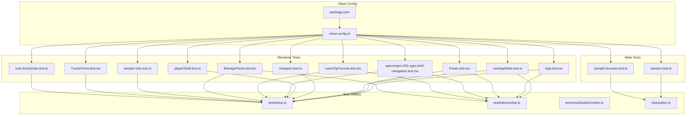

**Diagram sources**
- [vitest.config.ts:1-37](file://vitest.config.ts#L1-L37)
- [package.json:1-63](file://package.json#L1-L63)
- [src/renderer/src/test/setup.ts:1-40](file://src/renderer/src/test/setup.ts#L1-L40)
- [src/renderer/src/test/electronApi.ts:1-126](file://src/renderer/src/test/electronApi.ts#L1-L126)
- [src/renderer/src/test/mockAudioContext.ts:1-133](file://src/renderer/src/test/mockAudioContext.ts#L1-L133)
- [src/shared/ipc.ts:1-59](file://src/shared/ipc.ts#L1-L59)
- [src/renderer/src/App.test.tsx:1-97](file://src/renderer/src/App.test.tsx#L1-L97)
- [src/renderer/src/components/Footer.test.tsx:1-70](file://src/renderer/src/components/Footer.test.tsx#L1-L70)
- [src/renderer/src/components/LaneClipCanvas.test.tsx:1-319](file://src/renderer/src/components/LaneClipCanvas.test.tsx#L1-L319)
- [src/renderer/src/components/ManagePanel.test.tsx:1-273](file://src/renderer/src/components/ManagePanel.test.tsx#L1-L273)
- [src/renderer/src/hooks/useAppState.test.ts:1-204](file://src/renderer/src/hooks/useAppState.test.ts#L1-L204)
- [src/renderer/src/engine/transport.test.ts:1-152](file://src/renderer/src/engine/transport.test.ts#L1-L152)
- [src/renderer/src/lib/playerShell.test.ts:1-166](file://src/renderer/src/lib/playerShell.test.ts#L1-L166)
- [src/renderer/src/lib/sample-utils.test.ts:1-159](file://src/renderer/src/lib/sample-utils.test.ts#L1-L159)
- [src/renderer/src/specs/spec-001-app-shell-navigation.test.tsx:1-304](file://src/renderer/src/specs/spec-001-app-shell-navigation.test.tsx#L1-L304)
- [src/renderer/src/components/TrackerView.test.tsx:1-610](file://src/renderer/src/components/TrackerView.test.tsx#L1-L610)
- [src/renderer/src/hooks/useLibraryData.test.ts:1-534](file://src/renderer/src/hooks/useLibraryData.test.ts#L1-L534)
- [src/main/session.test.ts:1-291](file://src/main/session.test.ts#L1-L291)
- [src/main/sample-browser.test.ts:1-67](file://src/main/sample-browser.test.ts#L1-L67)

**Section sources**
- [vitest.config.ts:1-37](file://vitest.config.ts#L1-L37)
- [package.json:1-63](file://package.json#L1-L63)

## Core Components
- Vitest configuration defines:
  - Environment: jsdom for DOM APIs in renderer tests
  - Setup file: src/renderer/src/test/setup.ts
  - Include patterns for renderer and main tests
  - Coverage provider v8 with HTML/LCOV reporters and exclusions tailored to renderer-only unit coverage
- Test setup:
  - Registers @testing-library/jest-dom matchers
  - Injects a deterministic window.electronAPI mock
  - Boots the theme synchronously before rendering
  - Provides MockAudioContext for Web Audio API testing
  - Adds ResizeObserver polyfill for canvas components
  - Cleans up after each test
- Electron API mock:
  - Provides stub implementations for all IPC channels
  - Supplies deterministic defaults for sessions, recent projects, and sample browser items
  - Implements a searchable querySampleBrowser filter
  - Includes new library management and tag/category operations
- Shared IPC types:
  - Defines channel names and ElectronAPI contract used by both renderer and main tests

**Section sources**
- [vitest.config.ts:6-36](file://vitest.config.ts#L6-L36)
- [src/renderer/src/test/setup.ts:1-40](file://src/renderer/src/test/setup.ts#L1-L40)
- [src/renderer/src/test/electronApi.ts:1-126](file://src/renderer/src/test/electronApi.ts#L1-L126)
- [src/renderer/src/test/mockAudioContext.ts:1-133](file://src/renderer/src/test/mockAudioContext.ts#L1-L133)
- [src/shared/ipc.ts:1-59](file://src/shared/ipc.ts#L1-L59)

## Architecture Overview
The testing architecture separates concerns across layers:
- Renderer tests validate UI behavior, hook logic, and transport mechanics using mocked Electron APIs
- Main process tests validate filesystem-backed logic (session persistence, recent projects, sample browser scanning) with temporary directories
- IPC handlers are exercised indirectly via the ElectronAPI mock and acceptance specs that assert window resizing and navigation flows

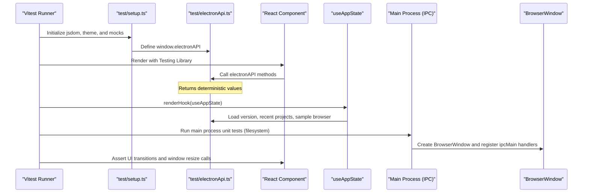

**Diagram sources**
- [src/renderer/src/test/setup.ts:1-40](file://src/renderer/src/test/setup.ts#L1-L40)
- [src/renderer/src/test/electronApi.ts:1-126](file://src/renderer/src/test/electronApi.ts#L1-L126)
- [src/main/index.ts:1-170](file://src/main/index.ts#L1-L170)
- [src/renderer/src/App.test.tsx:1-97](file://src/renderer/src/App.test.tsx#L1-L97)
- [src/renderer/src/hooks/useAppState.test.ts:1-204](file://src/renderer/src/hooks/useAppState.test.ts#L1-L204)

## Detailed Component Analysis

### Vitest Configuration and Coverage
- Environment: jsdom enables DOM APIs for renderer tests
- SetupFiles: injects global test utilities and mocks
- Include: targets renderer components and main process modules
- Coverage:
  - Provider: v8
  - Reporters: text, html, lcov
  - Reports directory: coverage-unit
  - Excludes main/, preload/, and other non-renderer sources to keep unit coverage scoped to renderer logic

**Section sources**
- [vitest.config.ts:6-36](file://vitest.config.ts#L6-L36)

### Test Setup and Global Mocks
- Registers jest-dom matchers for assertions
- Defines window.electronAPI with createElectronAPI
- Bootstraps theme synchronously to mirror production initialization
- Provides MockAudioContext for Web Audio API testing
- Adds ResizeObserver polyfill for canvas-based components
- Cleans up DOM after each test

**Section sources**
- [src/renderer/src/test/setup.ts:1-40](file://src/renderer/src/test/setup.ts#L1-L40)

### ElectronAPI Mock Strategy
- Provides stubbed implementations for all IPC channels
- Returns deterministic defaults for sessions and recent projects
- Implements a searchable sample browser query with filtering and caching behavior
- Includes new library management operations (createTag, renameTag, deleteTag, createCategory, deleteCategory, saveLibrary, deleteLibrary)
- Used across component and hook tests to isolate renderer logic from Electron runtime

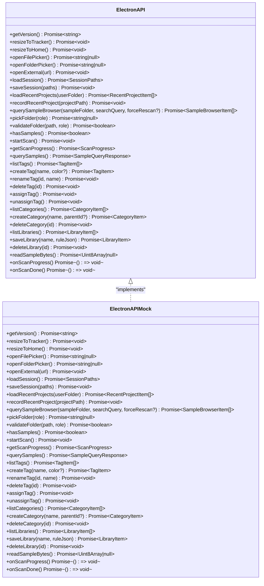

**Diagram sources**
- [src/shared/ipc.ts:40-58](file://src/shared/ipc.ts#L40-L58)
- [src/renderer/src/test/electronApi.ts:71-125](file://src/renderer/src/test/electronApi.ts#L71-L125)

**Section sources**
- [src/renderer/src/test/electronApi.ts:1-126](file://src/renderer/src/test/electronApi.ts#L1-L126)
- [src/shared/ipc.ts:1-59](file://src/shared/ipc.ts#L1-L59)

### Unit Testing React Components
- App.test.tsx validates:
  - Initial home actions presence
  - Version retrieval via electronAPI
  - Navigation to tracker view and window resize calls
  - Recent projects rendering and sample detail propagation
  - Theme behavior and clip placement on lanes
- Footer.test.tsx validates:
  - Version rendering
  - Event dispatch to parent callbacks
  - Sample detail rendering in tracker view

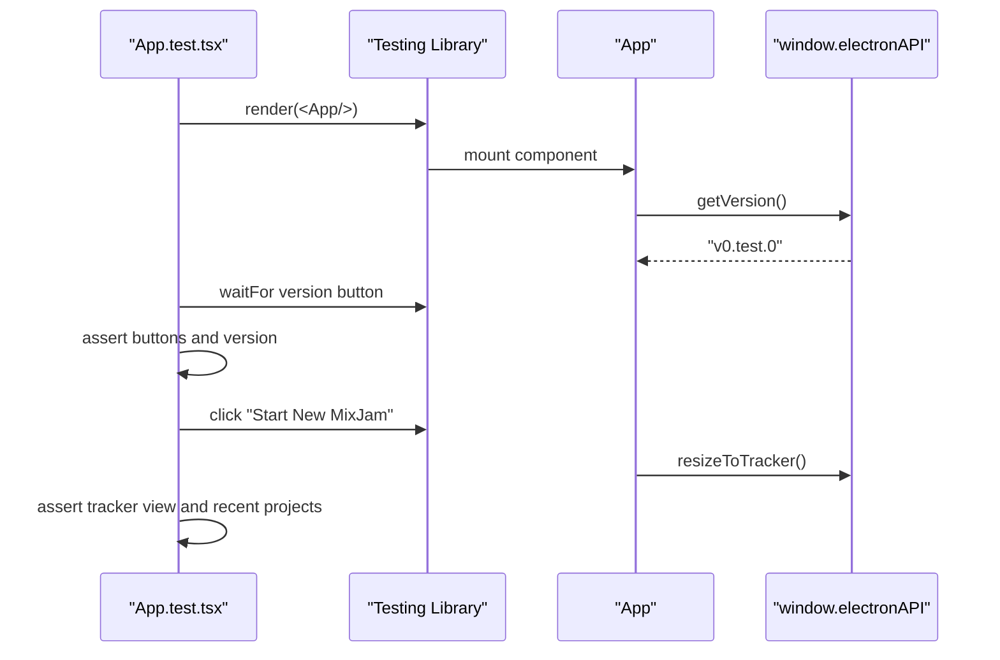

**Diagram sources**
- [src/renderer/src/App.test.tsx:6-31](file://src/renderer/src/App.test.tsx#L6-L31)
- [src/renderer/src/test/electronApi.ts:73-74](file://src/renderer/src/test/electronApi.ts#L73-L74)

**Section sources**
- [src/renderer/src/App.test.tsx:1-97](file://src/renderer/src/App.test.tsx#L1-L97)
- [src/renderer/src/components/Footer.test.tsx:1-70](file://src/renderer/src/components/Footer.test.tsx#L1-L70)

### Unit Testing Hooks and Renderer Logic
- useAppState.test.ts validates:
  - Initialization, version fallback, and loading of recent projects and samples
  - View transitions and window resize calls
  - Timer behavior with fake timers
  - File picker flows and project recording
  - Footer action routing and cleanup
- transport.test.ts validates:
  - Transport state machine (stopped, playing, paused)
  - Tick progression and BPM changes
  - Timer lifecycle and callback wiring
- playerShell.test.ts validates:
  - Lane creation and clip placement semantics
  - Solo/mute behaviors and dimming logic

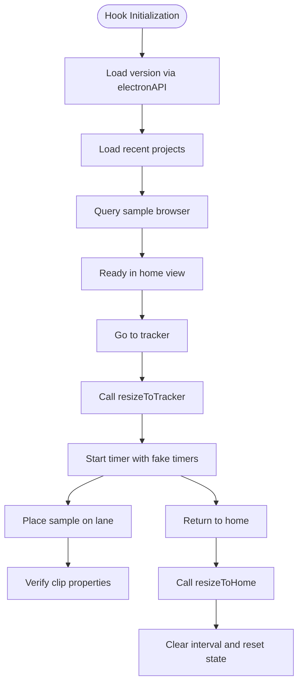

**Diagram sources**
- [src/renderer/src/hooks/useAppState.test.ts:19-100](file://src/renderer/src/hooks/useAppState.test.ts#L19-L100)
- [src/renderer/src/engine/transport.test.ts:29-74](file://src/renderer/src/engine/transport.test.ts#L29-L74)
- [src/renderer/src/lib/playerShell.test.ts:46-103](file://src/renderer/src/lib/playerShell.test.ts#L46-L103)

**Section sources**
- [src/renderer/src/hooks/useAppState.test.ts:1-204](file://src/renderer/src/hooks/useAppState.test.ts#L1-L204)
- [src/renderer/src/engine/transport.test.ts:1-152](file://src/renderer/src/engine/transport.test.ts#L1-L152)
- [src/renderer/src/lib/playerShell.test.ts:1-166](file://src/renderer/src/lib/playerShell.test.ts#L1-L166)

### Unit Testing Main Process Functions
- session.test.ts validates:
  - Folder role validation and normalization
  - Session read/write and config generation
  - Recent projects normalization, upsert, and persistence
  - Recursive discovery and merging of recent projects
- sample-browser.test.ts validates:
  - Directory scanning for audio files
  - Category derivation and metadata
  - Query filtering and cache reuse

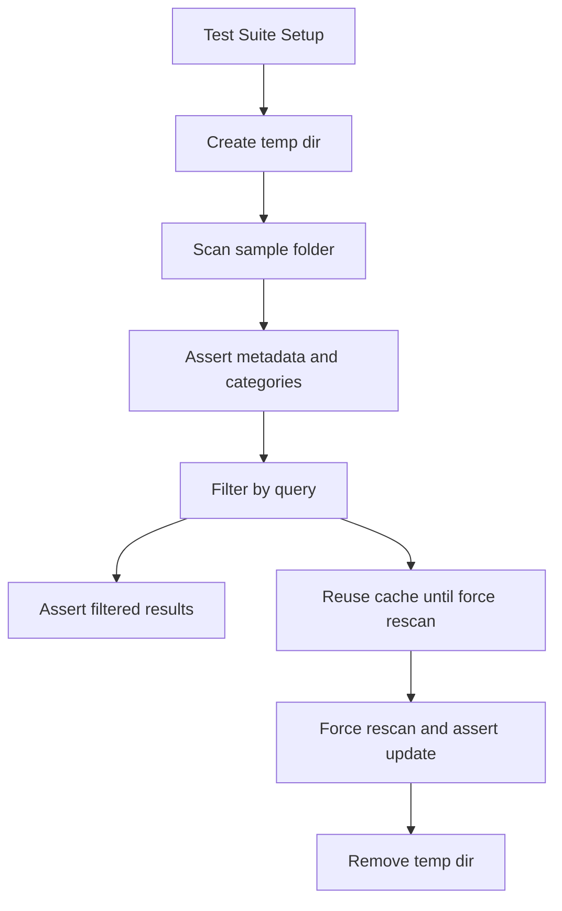

**Diagram sources**
- [src/main/sample-browser.test.ts:24-65](file://src/main/sample-browser.test.ts#L24-L65)
- [src/main/session.test.ts:79-95](file://src/main/session.test.ts#L79-L95)

**Section sources**
- [src/main/session.test.ts:1-291](file://src/main/session.test.ts#L1-L291)
- [src/main/sample-browser.test.ts:1-67](file://src/main/sample-browser.test.ts#L1-L67)

### IPC Handler Testing and Cross-Process Patterns
- Electron main registers handlers for all IPC channels defined in IPC_CHANNELS
- Tests validate:
  - Parameter validation and sanitization
  - Window resize behaviors invoked by renderer actions
  - Dialog and shell interactions with allowed host checks
- Renderer tests assert that UI actions trigger the appropriate IPC calls

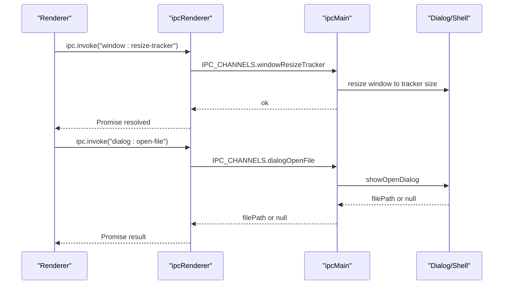

**Diagram sources**
- [src/main/index.ts:75-169](file://src/main/index.ts#L75-L169)
- [src/shared/ipc.ts:1-15](file://src/shared/ipc.ts#L1-L15)
- [src/renderer/src/App.test.tsx:19-31](file://src/renderer/src/App.test.tsx#L19-L31)

**Section sources**
- [src/main/index.ts:1-170](file://src/main/index.ts#L1-L170)
- [src/shared/ipc.ts:1-59](file://src/shared/ipc.ts#L1-L59)

### Integration and Acceptance Testing
- spec-001-app-shell-navigation.test.tsx validates:
  - Window sizing and non-resizable/maximizable constraints in home
  - Header/footer layout and CSS expectations
  - Navigation flows: Home → Tracker → Home
  - File picker behavior and project loading
  - Window resize sequences and external link opening
- These tests combine UI assertions with IPC call verifications to ensure end-to-end behavior aligns with product specs

**Section sources**
- [src/renderer/src/specs/spec-001-app-shell-navigation.test.tsx:1-304](file://src/renderer/src/specs/spec-001-app-shell-navigation.test.tsx#L1-L304)

## Enhanced Test Infrastructure

### Mock Audio Context Implementation
The test infrastructure now includes a comprehensive MockAudioContext that provides:
- Minimal Web Audio API surface sufficient for engine testing
- Node connection tracking for asserting audio graph topology
- Test-controllable analyser data for metering validation
- Deterministic buffer source behavior with manual completion control
- Support for gain, panner, analyser, and buffer source nodes

**Section sources**
- [src/renderer/src/test/mockAudioContext.ts:1-133](file://src/renderer/src/test/mockAudioContext.ts#L1-L133)

### Enhanced Setup Configuration
The setup.ts file now provides:
- Dynamic import pattern for better module resolution
- AudioContext mock injection for Web Audio API compatibility
- ResizeObserver polyfill for canvas component testing
- Comprehensive cleanup handling for all test scenarios

**Section sources**
- [src/renderer/src/test/setup.ts:1-40](file://src/renderer/src/test/setup.ts#L1-L40)

## New Component Testing Strategies

### TrackerView Testing Approach
The TrackerView component required comprehensive testing for its advanced UI features and grid alignment requirements:

#### AC-011 Ruler Tick Alignment Validation
- Tests validate ruler tick marks and bar numbers rendering
- Ensures one tick per beat alignment with canvas grid
- Verifies bar numbering sequence (1, 5, 9, 13) for proper beat grouping
- Confirms lane head box maintains consistent width with ruler spacer
- Validates CSS properties for border-box sizing

#### Advanced UI Interaction Testing
- Tests transport controls (play, pause, stop, skip back) with proper state transitions
- Validates BPM slider with min=50, max=200 range and default 120 value
- Tests click-to-edit BPM functionality with Enter/Esc key handling
- Validates 16-lane rendering with mute/solo buttons and pan knobs
- Tests playhead visibility and positioning during playback

#### Grid Alignment and Timeline Precision
- Validates ruler tick precision for timeline alignment
- Tests context menu interactions for clip management
- Ensures proper coordinate mapping for clip placement and movement
- Validates drag-and-drop functionality between lanes

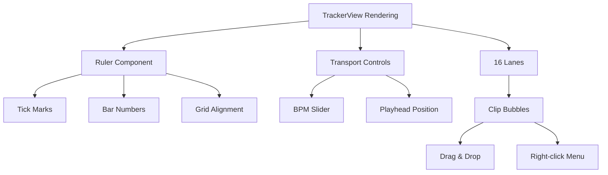

**Diagram sources**
- [src/renderer/src/components/TrackerView.test.tsx:417-447](file://src/renderer/src/components/TrackerView.test.tsx#L417-L447)
- [src/renderer/src/components/TrackerView.test.tsx:448-503](file://src/renderer/src/components/TrackerView.test.tsx#L448-L503)
- [src/renderer/src/components/TrackerView.test.tsx:312-334](file://src/renderer/src/components/TrackerView.test.tsx#L312-L334)

**Section sources**
- [src/renderer/src/components/TrackerView.test.tsx:1-610](file://src/renderer/src/components/TrackerView.test.tsx#L1-L610)
- [src/renderer/src/components/TrackerView.tsx:1-200](file://src/renderer/src/components/TrackerView.tsx#L1-L200)

### Enhanced Library Data Hook Testing
The useLibraryData hook now includes comprehensive testing for new paginated loading functionality:

#### Paginated Loading Implementation
- Tests loading every DB sample window when no category is selected
- Validates chunked loading with 500-item limits and proper offset handling
- Ensures sequential loading of database pages for large datasets
- Tests total count tracking across multiple pages

#### Advanced Library Management
- Tests tag creation, renaming, and deletion with state synchronization
- Validates category management with parent-child relationships
- Tests library saving with encoded filter rules in ruleJson format
- Validates library deletion and state cleanup

#### Error Handling and Edge Cases
- Tests error states for both legacy and database query failures
- Validates state clearing when sample folder is null
- Tests alphabetical sorting for tags and categories
- Validates scan progress tracking and completion callbacks

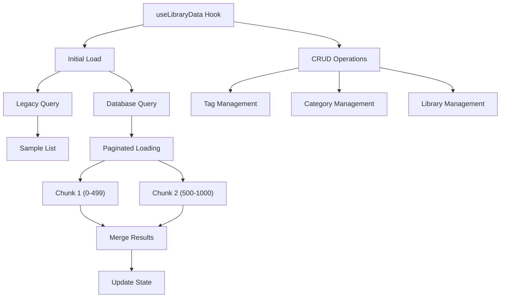

**Diagram sources**
- [src/renderer/src/hooks/useLibraryData.test.ts:70-101](file://src/renderer/src/hooks/useLibraryData.test.ts#L70-L101)
- [src/renderer/src/hooks/useLibraryData.test.ts:150-220](file://src/renderer/src/hooks/useLibraryData.test.ts#L150-L220)
- [src/renderer/src/hooks/useLibraryData.test.ts:256-285](file://src/renderer/src/hooks/useLibraryData.test.ts#L256-L285)

**Section sources**
- [src/renderer/src/hooks/useLibraryData.test.ts:1-534](file://src/renderer/src/hooks/useLibraryData.test.ts#L1-L534)
- [src/renderer/src/hooks/useLibraryData.ts:1-200](file://src/renderer/src/hooks/useLibraryData.ts#L1-L200)

### LaneClipCanvas Testing Approach
The LaneClipCanvas component required specialized testing strategies due to its canvas-based rendering:

#### Canvas Mocking Strategy
- Uses makeMockCtx() to create comprehensive canvas context mocks
- Spies on HTMLCanvasElement.prototype.getContext for reliable mocking
- Mocks devicePixelRatio for consistent rendering calculations
- Tests drawing operations through context method calls (fill, stroke, fillText)

#### Spatial Hit-Testing Validation
- Tests both jsdom fallback and spatial hit-testing modes
- Validates clientX coordinate mapping to clip positions
- Ensures proper clip selection order (last-added first priority)
- Handles edge cases for out-of-bounds clicks

#### Interactive Behavior Testing
- Mouse event simulation for drag-and-drop functionality
- Context menu handling with proper clip identification
- Data attribute validation for accessibility and testing
- Flash overlay rendering for visual feedback

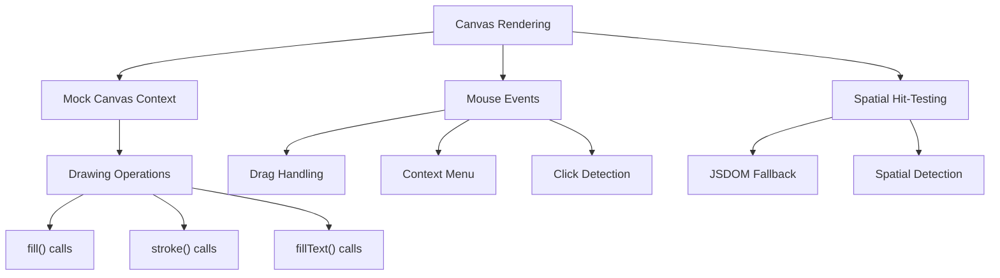

**Diagram sources**
- [src/renderer/src/components/LaneClipCanvas.test.tsx:26-49](file://src/renderer/src/components/LaneClipCanvas.test.tsx#L26-L49)
- [src/renderer/src/components/LaneClipCanvas.tsx:154-174](file://src/renderer/src/components/LaneClipCanvas.tsx#L154-L174)

**Section sources**
- [src/renderer/src/components/LaneClipCanvas.test.tsx:1-319](file://src/renderer/src/components/LaneClipCanvas.test.tsx#L1-L319)
- [src/renderer/src/components/LaneClipCanvas.tsx:1-228](file://src/renderer/src/components/LaneClipCanvas.tsx#L1-L228)

### ManagePanel Testing Strategy
The ManagePanel component required comprehensive testing for its three-tab interface:

#### Tab-Based Interaction Testing
- Tests all three tabs: tags, libraries, and categories
- Validates tab switching behavior and content rendering
- Ensures proper state management for each tab's form inputs

#### Form Validation and Submission
- Tests tag creation with Enter key and button submission
- Validates rename operations with keyboard shortcuts (Enter/Escape)
- Tests category creation with parent-child relationships
- Validates library management operations

#### State Management Validation
- Tests form input state synchronization
- Validates disabled/enabled states for submit buttons
- Ensures proper form clearing after successful operations
- Tests error prevention for empty submissions

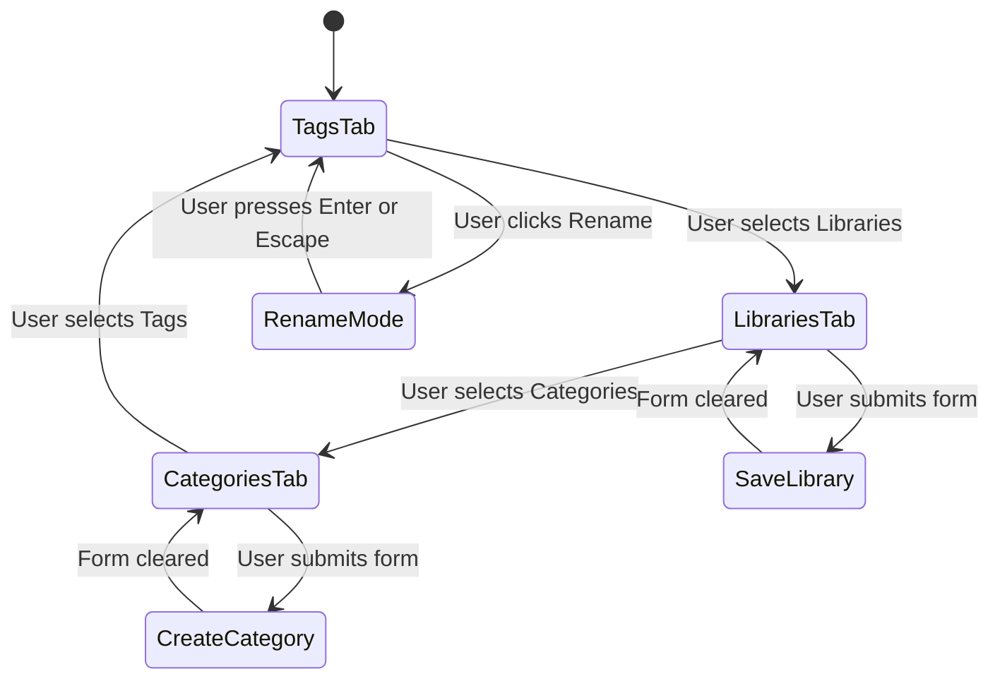

**Diagram sources**
- [src/renderer/src/components/ManagePanel.test.tsx:38-272](file://src/renderer/src/components/ManagePanel.test.tsx#L38-L272)

**Section sources**
- [src/renderer/src/components/ManagePanel.test.tsx:1-273](file://src/renderer/src/components/ManagePanel.test.tsx#L1-L273)
- [src/renderer/src/components/ManagePanel.tsx:1-242](file://src/renderer/src/components/ManagePanel.tsx#L1-L242)

### Enhanced Utility Function Testing
The sample-utils library received comprehensive test coverage:

#### Color Mapping and Formatting
- Tests category color mapping for known categories
- Validates case-insensitive category name handling
- Ensures deterministic color generation for unknown categories
- Tests duration formatting for various time ranges

#### Layout and Calculation Functions
- Validates tile width calculations with duration constraints
- Tests nearest tick calculation with boundary conditions
- Validates meter fill percentage calculations
- Ensures proper clamping and edge case handling

**Section sources**
- [src/renderer/src/lib/sample-utils.test.ts:1-159](file://src/renderer/src/lib/sample-utils.test.ts#L1-L159)

## Advanced UI and Grid Alignment Testing

### AC-011 Ruler Tick Alignment Requirements
The TrackerView tests now comprehensively validate AC-011 requirements for ruler tick alignment:

#### Tick Mark Precision
- Tests that ruler renders exactly 32 tick marks for 32-beat timeline
- Validates 8 bar tick groups with proper spacing (every 4 ticks/32 beats)
- Ensures tick marks align precisely with canvas grid cells
- Confirms visual consistency between ruler header and timeline grid

#### Bar Numbering Sequence
- Validates first bar label displays "1" as expected
- Tests second bar label shows "5" indicating 4-beat intervals
- Ensures subsequent bar numbers follow the 4-beat grouping pattern
- Validates proper rhythm marking for musical timeline alignment

#### CSS and Layout Consistency
- Tests lane head box maintains border-box sizing
- Validates consistent width between ruler spacer and lane head
- Ensures proper CSS properties for visual alignment
- Confirms responsive layout behavior across different screen sizes

**Section sources**
- [src/renderer/src/components/TrackerView.test.tsx:417-447](file://src/renderer/src/components/TrackerView.test.tsx#L417-L447)

## Dependency Analysis
- Renderer tests depend on:
  - test/setup.ts for global initialization
  - test/electronApi.ts for deterministic IPC behavior
  - test/mockAudioContext.ts for Web Audio API testing
  - shared/ipc.ts for channel names and types
- Main tests depend on:
  - filesystem helpers and shared session/sample-browser logic
- Vitest configuration ties all tests together with environment and coverage policies

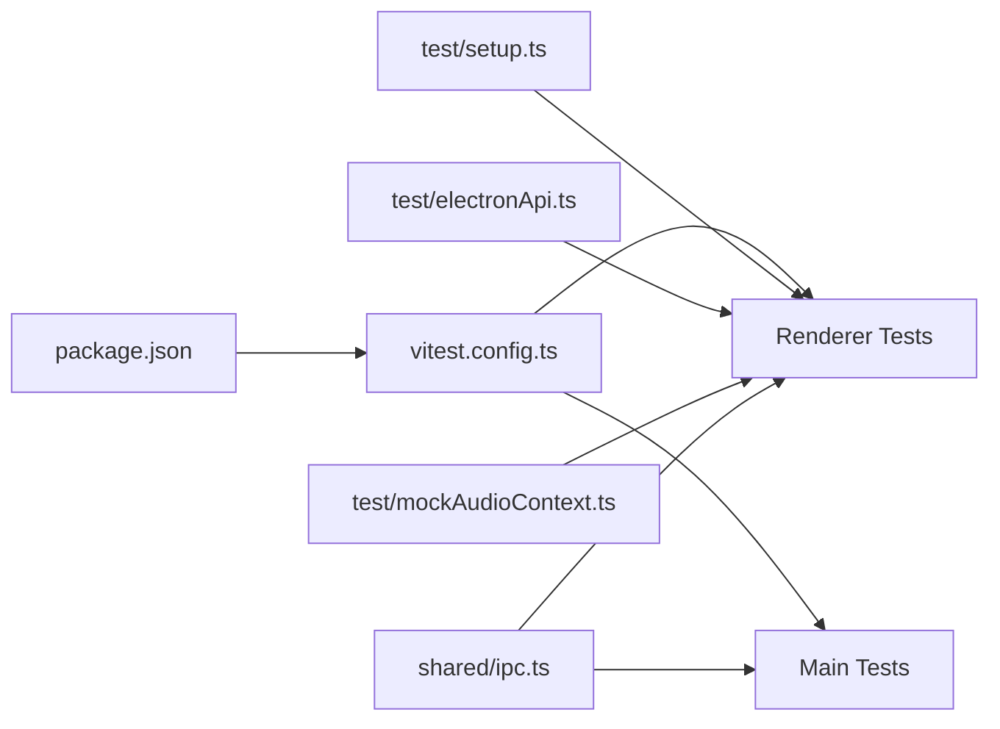

**Diagram sources**
- [vitest.config.ts:1-37](file://vitest.config.ts#L1-L37)
- [package.json:6-23](file://package.json#L6-L23)
- [src/renderer/src/test/setup.ts:1-40](file://src/renderer/src/test/setup.ts#L1-L40)
- [src/renderer/src/test/electronApi.ts:1-126](file://src/renderer/src/test/electronApi.ts#L1-L126)
- [src/renderer/src/test/mockAudioContext.ts:1-133](file://src/renderer/src/test/mockAudioContext.ts#L1-L133)
- [src/shared/ipc.ts:1-59](file://src/shared/ipc.ts#L1-L59)

**Section sources**
- [vitest.config.ts:1-37](file://vitest.config.ts#L1-L37)
- [package.json:1-63](file://package.json#L1-L63)

## Performance Considerations
- Prefer mocking Electron APIs to avoid heavy startup costs
- Use fake timers for transport and hook tests to control time-sensitive assertions deterministically
- Keep renderer unit coverage focused on pure logic and component behavior; rely on main tests for filesystem-heavy scenarios
- Use targeted include/exclude patterns to minimize coverage computation overhead
- Canvas component tests benefit from comprehensive context mocking to avoid expensive rendering operations
- MockAudioContext provides lightweight alternatives to real Web Audio API for faster test execution
- Paginated loading tests optimize memory usage by testing chunked data loading patterns

## Troubleshooting Guide
Common issues and resolutions:
- Missing DOM APIs in tests:
  - Ensure jsdom environment is active via vitest.config.ts
- Stale mocks between tests:
  - Use afterEach cleanup and vi.restoreAllMocks() in hook tests
- Asynchronous timing issues:
  - Use waitFor and fake timers for deterministic scheduling
- IPC call verification:
  - Assert vi.mocked(window.electronAPI.method).toHaveBeenCalled() after triggering UI actions
- Filesystem-dependent tests:
  - Use temporary directories and clean up in afterEach to prevent flaky tests
- Canvas rendering issues:
  - Ensure proper context mocking and devicePixelRatio handling
- Audio API testing:
  - Use MockAudioContext for Web Audio API compatibility in component tests
- ResizeObserver errors:
  - Setup polyfill in test setup for canvas-based components
- Grid alignment issues:
  - Verify CSS border-box properties and consistent width calculations
- Pagination test failures:
  - Ensure proper offset/limit handling and chunked loading validation

**Section sources**
- [src/renderer/src/test/setup.ts:36-39](file://src/renderer/src/test/setup.ts#L36-L39)
- [src/renderer/src/hooks/useAppState.test.ts:14-17](file://src/renderer/src/hooks/useAppState.test.ts#L14-L17)
- [src/main/session.test.ts:25-31](file://src/main/session.test.ts#L25-L31)

## Conclusion
MixJam Electron employs a layered testing strategy with enhanced capabilities:
- Renderer tests with jsdom and deterministic mocks validate UI, hooks, and transport logic
- Main process tests validate filesystem-backed features with temporary directories
- New component testing strategies cover complex UI interactions, grid alignment requirements, and canvas-based rendering
- Enhanced test infrastructure provides comprehensive mocking for Web Audio API and Electron IPC
- Advanced paginated loading functionality receives thorough testing for performance optimization
- AC-011 ruler tick alignment validation ensures precise timeline grid consistency
- Acceptance specs ensure cross-process flows meet product specifications
- Coverage is configured to report on renderer logic, keeping reports actionable and focused

**Updated** The testing strategy now includes comprehensive coverage for new components (TrackerView, useLibraryData), enhanced infrastructure supporting advanced testing scenarios, and sophisticated grid alignment validation for timeline precision requirements.

## Appendices

### Scripts and Commands
- Run unit tests: npm test
- Watch mode: npm run test:watch
- Coverage: npm run test:coverage

**Section sources**
- [package.json:18-23](file://package.json#L18-L23)