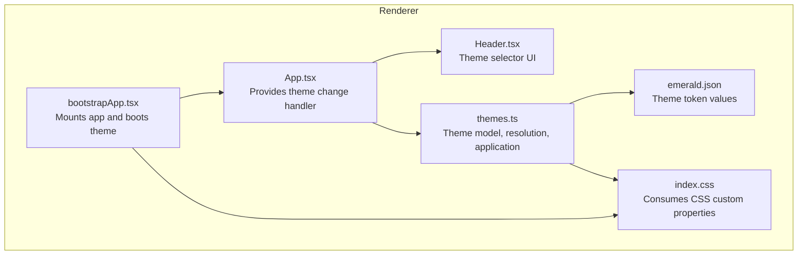
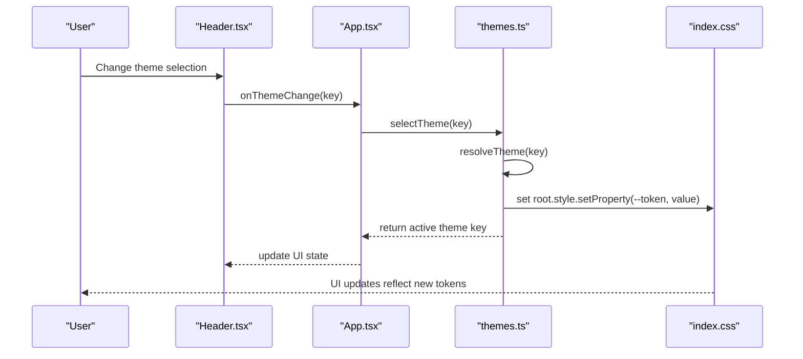
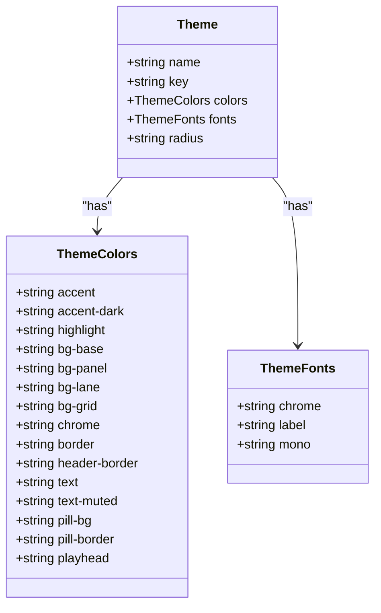
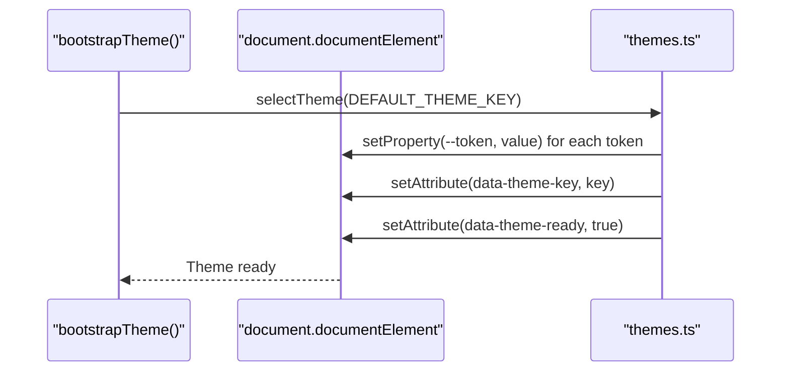
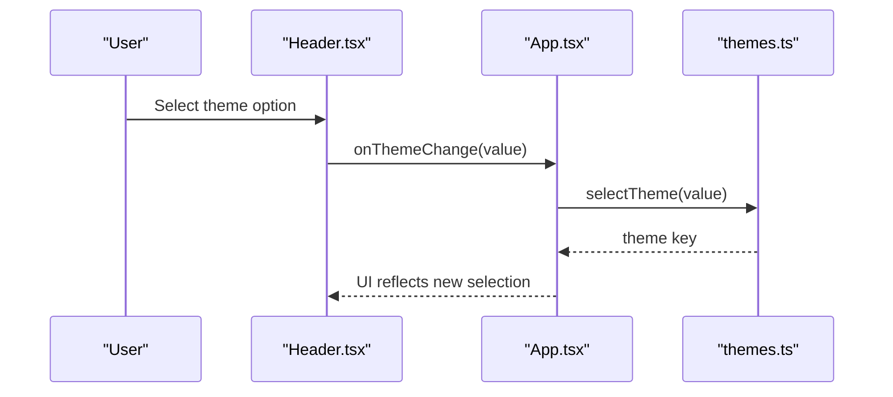
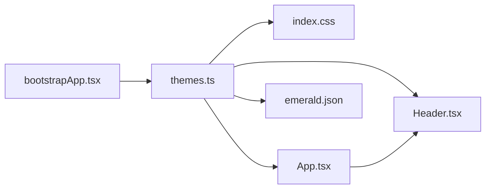

# Theming & UI System

<cite>
**Referenced Files in This Document**
- [themes.ts](file://src/renderer/src/theme/themes.ts)
- [emerald.json](file://public/themes/emerald.json)
- [index.css](file://src/renderer/src/index.css)
- [spec-002-theming-skin-system.md](file://docs/specs/spec-002-theming-skin-system.md)
- [App.tsx](file://src/renderer/src/App.tsx)
- [Header.tsx](file://src/renderer/src/components/Header.tsx)
- [bootstrapApp.tsx](file://src/renderer/src/bootstrapApp.tsx)
- [spec-002-theming-skin-system.test.tsx](file://src/renderer/src/theme/spec-002-theming-skin-system.test.tsx)
</cite>

## Table of Contents
1. [Introduction](#introduction)
2. [Project Structure](#project-structure)
3. [Core Components](#core-components)
4. [Architecture Overview](#architecture-overview)
5. [Detailed Component Analysis](#detailed-component-analysis)
6. [Dependency Analysis](#dependency-analysis)
7. [Performance Considerations](#performance-considerations)
8. [Accessibility Considerations](#accessibility-considerations)
9. [Responsive Design Principles](#responsive-design-principles)
10. [Cross-Platform UI Consistency](#cross-platform-ui-consistency)
11. [Practical Examples](#practical-examples)
12. [Troubleshooting Guide](#troubleshooting-guide)
13. [Conclusion](#conclusion)

## Introduction
This document describes MixJam Electron's theming and user interface system. It explains the CSS variable-based theming architecture, the theme token system, and custom skin support. It covers the theme loading mechanism, dynamic theme switching, and CSS custom property integration. It also documents the theme specification format, color palette definitions, component styling patterns, accessibility considerations, responsive design principles, and cross-platform UI consistency. Practical examples show how to create custom themes, modify existing themes, and implement theme-aware components. Finally, it addresses the relationship between theming and the overall application design system.

## Project Structure
The theming system is organized around a small set of cohesive modules:
- Theme definition and resolution: TypeScript module that defines the theme model, resolves requested themes, and applies them via CSS custom properties.
- Theme assets: JSON files containing theme token values.
- Global styles: CSS that consumes the CSS custom properties and applies them across components.
- UI components: React components that expose a theme selector and react to theme changes.
- Bootstrapping: Application initialization that applies the default theme before rendering.

**Diagram sources**
- [bootstrapApp.tsx:1-19](file://src/renderer/src/bootstrapApp.tsx#L1-L19)
- [App.tsx:1-108](file://src/renderer/src/App.tsx#L1-L108)
- [Header.tsx:1-43](file://src/renderer/src/components/Header.tsx#L1-L43)
- [themes.ts:1-112](file://src/renderer/src/theme/themes.ts#L1-L112)
- [index.css:1-795](file://src/renderer/src/index.css#L1-L795)
- [emerald.json:1-28](file://public/themes/emerald.json#L1-L28)

**Section sources**
- [bootstrapApp.tsx:1-19](file://src/renderer/src/bootstrapApp.tsx#L1-L19)
- [App.tsx:1-108](file://src/renderer/src/App.tsx#L1-L108)
- [Header.tsx:1-43](file://src/renderer/src/components/Header.tsx#L1-L43)
- [themes.ts:1-112](file://src/renderer/src/theme/themes.ts#L1-L112)
- [index.css:1-795](file://src/renderer/src/index.css#L1-L795)
- [emerald.json:1-28](file://public/themes/emerald.json#L1-L28)

## Core Components
- Theme model and token system: Defines the canonical set of CSS custom properties used throughout the UI. Tokens include colors, typography families, and corner radius.
- Theme loader and resolver: Loads the default theme and resolves requested themes, falling back to the default when invalid keys are provided.
- Theme application: Writes theme tokens as CSS custom properties on the root element and sets a data attribute indicating the active theme key.
- Theme selector UI: Presents a dropdown with all supported theme names and forwards user selections to the theme application function.
- Global stylesheet: Consumes CSS custom properties for backgrounds, borders, text, and typography, ensuring consistent theming across components.

Key implementation references:
- Theme model and token system: [themes.ts:21-54](file://src/renderer/src/theme/themes.ts#L21-L54)
- Theme loader and resolver: [themes.ts:61-83](file://src/renderer/src/theme/themes.ts#L61-L83)
- Theme application: [themes.ts:90-105](file://src/renderer/src/theme/themes.ts#L90-L105)
- Theme selector UI: [Header.tsx:27-38](file://src/renderer/src/components/Header.tsx#L27-L38)
- Global stylesheet usage: [index.css:60-160](file://src/renderer/src/index.css#L60-L160)

**Section sources**
- [themes.ts:21-54](file://src/renderer/src/theme/themes.ts#L21-L54)
- [themes.ts:61-83](file://src/renderer/src/theme/themes.ts#L61-L83)
- [themes.ts:90-105](file://src/renderer/src/theme/themes.ts#L90-L105)
- [Header.tsx:27-38](file://src/renderer/src/components/Header.tsx#L27-L38)
- [index.css:60-160](file://src/renderer/src/index.css#L60-L160)

## Architecture Overview
The theming architecture follows a strict separation of concerns:
- Theme definition: JSON files define token values per theme.
- Resolution: The resolver ensures only valid theme keys are accepted and falls back to the default.
- Application: The application writes tokens as CSS custom properties on the root element.
- Consumption: Stylesheets consume these properties to style all components.
- Selection: The UI triggers theme changes, which re-apply the tokens without remounting components.

**Diagram sources**
- [Header.tsx:31-33](file://src/renderer/src/components/Header.tsx#L31-L33)
- [App.tsx:51-53](file://src/renderer/src/App.tsx#L51-L53)
- [themes.ts:73-105](file://src/renderer/src/theme/themes.ts#L73-L105)
- [index.css:60-160](file://src/renderer/src/index.css#L60-L160)

## Detailed Component Analysis

### Theme Model and Token System
The theme model defines:
- ThemeColors: A fixed set of named tokens for colors and radii.
- ThemeFonts: Three font families for chrome, labels, and monospace.
- Theme: Aggregates name, key, colors, fonts, and radius.

Implementation references:
- ThemeColors interface: [themes.ts:21-37](file://src/renderer/src/theme/themes.ts#L21-L37)
- ThemeFonts interface: [themes.ts:39-46](file://src/renderer/src/theme/themes.ts#L39-L46)
- Theme interface: [themes.ts:48-54](file://src/renderer/src/theme/themes.ts#L48-L54)

**Diagram sources**
- [themes.ts:21-54](file://src/renderer/src/theme/themes.ts#L21-L54)

**Section sources**
- [themes.ts:21-54](file://src/renderer/src/theme/themes.ts#L21-L54)

### Theme Loader and Resolver
The resolver:
- Validates theme keys against a predefined list.
- Returns the default theme for invalid keys.
- Provides normalization utilities to ensure consistent keys.

Implementation references:
- Theme options and key type: [themes.ts:3-14](file://src/renderer/src/theme/themes.ts#L3-L14)
- Resolver and normalization: [themes.ts:69-83](file://src/renderer/src/theme/themes.ts#L69-L83)

**Diagram sources**
- [themes.ts:3-14](file://src/renderer/src/theme/themes.ts#L3-L14)
- [themes.ts:69-83](file://src/renderer/src/theme/themes.ts#L69-L83)

**Section sources**
- [themes.ts:3-14](file://src/renderer/src/theme/themes.ts#L3-L14)
- [themes.ts:69-83](file://src/renderer/src/theme/themes.ts#L69-L83)

### Theme Application and Bootstrap
The application:
- Writes each color token and font tokens as CSS custom properties on the root element.
- Sets a data attribute indicating the active theme key.
- The bootstrap function applies the default theme during mount and marks the theme ready.

Implementation references:
- Application function: [themes.ts:90-98](file://src/renderer/src/theme/themes.ts#L90-L98)
- Theme selection: [themes.ts:100-105](file://src/renderer/src/theme/themes.ts#L100-L105)
- Bootstrap: [themes.ts:107-111](file://src/renderer/src/theme/themes.ts#L107-L111)

**Diagram sources**
- [themes.ts:107-111](file://src/renderer/src/theme/themes.ts#L107-L111)
- [themes.ts:100-105](file://src/renderer/src/theme/themes.ts#L100-L105)
- [themes.ts:90-98](file://src/renderer/src/theme/themes.ts#L90-L98)

**Section sources**
- [themes.ts:90-105](file://src/renderer/src/theme/themes.ts#L90-L105)
- [themes.ts:107-111](file://src/renderer/src/theme/themes.ts#L107-L111)

### Theme Selector UI
The theme selector:
- Lists all theme names from the theme options.
- Defaults to the active theme.
- Calls the theme change handler on selection, which re-applies the theme.

Implementation references:
- Theme options usage: [Header.tsx:35-37](file://src/renderer/src/components/Header.tsx#L35-L37)
- Default selection: [Header.tsx:30](file://src/renderer/src/components/Header.tsx#L30)
- Handler invocation: [Header.tsx:31-33](file://src/renderer/src/components/Header.tsx#L31-L33)
- App integration: [App.tsx:51-53](file://src/renderer/src/App.tsx#L51-L53)

**Diagram sources**
- [Header.tsx:27-38](file://src/renderer/src/components/Header.tsx#L27-L38)
- [App.tsx:51-53](file://src/renderer/src/App.tsx#L51-L53)
- [themes.ts:100-105](file://src/renderer/src/theme/themes.ts#L100-L105)

**Section sources**
- [Header.tsx:27-38](file://src/renderer/src/components/Header.tsx#L27-L38)
- [App.tsx:51-53](file://src/renderer/src/App.tsx#L51-L53)

### Global Stylesheet and CSS Custom Properties
The stylesheet consumes CSS custom properties for:
- Backgrounds: base, panel, lane, grid
- Borders and headers
- Text colors and muted text
- Interactive elements: buttons, links, controls
- Typography: chrome, labels, monospace
- Corner radius

Implementation references:
- Body and global properties: [index.css:60-70](file://src/renderer/src/index.css#L60-L70)
- Header styling: [index.css:84-93](file://src/renderer/src/index.css#L84-L93)
- Theme selector: [index.css:147-161](file://src/renderer/src/index.css#L147-L161)
- Footer styling: [index.css:172-183](file://src/renderer/src/index.css#L172-L183)
- Buttons and links: [index.css:348-382](file://src/renderer/src/index.css#L348-L382)
- Tracker view: [index.css:384-518](file://src/renderer/src/index.css#L384-L518)
- Browser and sample list: [index.css:684-794](file://src/renderer/src/index.css#L684-L794)

**Section sources**
- [index.css:60-70](file://src/renderer/src/index.css#L60-L70)
- [index.css:84-93](file://src/renderer/src/index.css#L84-L93)
- [index.css:147-161](file://src/renderer/src/index.css#L147-L161)
- [index.css:172-183](file://src/renderer/src/index.css#L172-L183)
- [index.css:348-382](file://src/renderer/src/index.css#L348-L382)
- [index.css:384-518](file://src/renderer/src/index.css#L384-L518)
- [index.css:684-794](file://src/renderer/src/index.css#L684-L794)

### Theme Specification and Token Reference
The specification defines:
- Theme token roles and CSS custom property names
- Typography tokens and font families
- The eight supported themes and their keys
- Acceptance criteria for implementation

Implementation references:
- Token role table: [spec-002-theming-skin-system.md:32-49](file://docs/specs/spec-002-theming-skin-system.md#L32-L49)
- Typography tokens: [spec-002-theming-skin-system.md:51-58](file://docs/specs/spec-002-theming-skin-system.md#L51-L58)
- Theme list: [spec-002-theming-skin-system.md:62-73](file://docs/specs/spec-002-theming-skin-system.md#L62-L73)
- Acceptance criteria: [spec-002-theming-skin-system.md:144-156](file://docs/specs/spec-002-theming-skin-system.md#L144-L156)

**Section sources**
- [spec-002-theming-skin-system.md:32-49](file://docs/specs/spec-002-theming-skin-system.md#L32-L49)
- [spec-002-theming-skin-system.md:51-58](file://docs/specs/spec-002-theming-skin-system.md#L51-L58)
- [spec-002-theming-skin-system.md:62-73](file://docs/specs/spec-002-theming-skin-system.md#L62-L73)
- [spec-002-theming-skin-system.md:144-156](file://docs/specs/spec-002-theming-skin-system.md#L144-L156)

## Dependency Analysis
The theming system exhibits low coupling and high cohesion:
- themes.ts depends on the default theme JSON file and exports the theme model and application functions.
- index.css depends on CSS custom properties written by themes.ts.
- Header.tsx depends on themes.ts for theme options and on App.tsx for the change handler.
- App.tsx depends on themes.ts for the change handler.
- bootstrapApp.tsx depends on themes.ts for bootstrap.

**Diagram sources**
- [themes.ts:1-112](file://src/renderer/src/theme/themes.ts#L1-L112)
- [index.css:1-795](file://src/renderer/src/index.css#L1-L795)
- [Header.tsx:1-43](file://src/renderer/src/components/Header.tsx#L1-L43)
- [App.tsx:1-108](file://src/renderer/src/App.tsx#L1-L108)
- [bootstrapApp.tsx:1-19](file://src/renderer/src/bootstrapApp.tsx#L1-L19)
- [emerald.json:1-28](file://public/themes/emerald.json#L1-L28)

**Section sources**
- [themes.ts:1-112](file://src/renderer/src/theme/themes.ts#L1-L112)
- [index.css:1-795](file://src/renderer/src/index.css#L1-L795)
- [Header.tsx:1-43](file://src/renderer/src/components/Header.tsx#L1-L43)
- [App.tsx:1-108](file://src/renderer/src/App.tsx#L1-L108)
- [bootstrapApp.tsx:1-19](file://src/renderer/src/bootstrapApp.tsx#L1-L19)
- [emerald.json:1-28](file://public/themes/emerald.json#L1-L28)

## Performance Considerations
- Synchronous bootstrap: The default theme is applied before the first render, preventing a flash of unstyled content.
- No remounting: Dynamic theme switching re-applies tokens without changing component trees, minimizing layout thrashing.
- CSS custom properties: Efficiently update visuals at runtime without recalculating stylesheets.
- Font loading: Bundled fonts avoid external network requests, reducing latency and improving reliability.

[No sources needed since this section provides general guidance]

## Accessibility Considerations
- Color contrast: Tokens define primary and muted text colors; ensure sufficient contrast ratios for readability.
- Focus indicators: The theme selector and interactive elements maintain visible focus styles via border tokens.
- Keyboard navigation: The theme selector is keyboard accessible and programmatically labeled.
- Semantic labeling: The theme selector has an accessible label for assistive technologies.

**Section sources**
- [index.css:159-161](file://src/renderer/src/index.css#L159-L161)
- [Header.tsx:29](file://src/renderer/src/components/Header.tsx#L29)

## Responsive Design Principles
- Flexible layouts: Components use flexible units and grid/flex properties to adapt to varying container sizes.
- Typography scaling: Font sizes are defined in relative units to improve readability across devices.
- Adaptive spacing: Consistent use of tokens for paddings and gaps maintains proportional spacing.

**Section sources**
- [index.css:164-169](file://src/renderer/src/index.css#L164-L169)
- [index.css:238-253](file://src/renderer/src/index.css#L238-L253)

## Cross-Platform UI Consistency
- CSS custom properties: Centralized token values ensure consistent visuals across platforms.
- Local font loading: Fonts are bundled locally, avoiding platform-specific font availability issues.
- Minimal platform-specific code: Theming relies on web standards, promoting consistency across environments.

**Section sources**
- [index.css:1-47](file://src/renderer/src/index.css#L1-L47)
- [spec-002-theming-skin-system.md:59-60](file://docs/specs/spec-002-theming-skin-system.md#L59-L60)

## Practical Examples

### Creating a Custom Theme
Steps:
1. Define a new theme JSON file in the themes directory with the required structure.
2. Extend the theme options list with the new theme key and name.
3. Optionally add the theme to the implemented themes registry.
4. Verify that the theme is selectable and applied correctly.

References:
- Theme JSON schema: [spec-002-theming-skin-system.md:118-138](file://docs/specs/spec-002-theming-skin-system.md#L118-L138)
- Theme options extension: [themes.ts:3-12](file://src/renderer/src/theme/themes.ts#L3-L12)
- Implemented themes registry: [themes.ts:61-63](file://src/renderer/src/theme/themes.ts#L61-L63)

**Section sources**
- [spec-002-theming-skin-system.md:118-138](file://docs/specs/spec-002-theming-skin-system.md#L118-L138)
- [themes.ts:3-12](file://src/renderer/src/theme/themes.ts#L3-L12)
- [themes.ts:61-63](file://src/renderer/src/theme/themes.ts#L61-L63)

### Modifying an Existing Theme
Steps:
1. Locate the theme JSON file for the target theme.
2. Adjust color tokens and radius values to achieve the desired look.
3. Confirm that the stylesheet consumes the updated tokens without hardcoded colors.

References:
- Emerald theme token values: [spec-002-theming-skin-system.md:77-94](file://docs/specs/spec-002-theming-skin-system.md#L77-L94)
- CSS custom property usage: [index.css:60-160](file://src/renderer/src/index.css#L60-L160)

**Section sources**
- [spec-002-theming-skin-system.md:77-94](file://docs/specs/spec-002-theming-skin-system.md#L77-L94)
- [index.css:60-160](file://src/renderer/src/index.css#L60-L160)

### Implementing Theme-Aware Components
Pattern:
- Consume CSS custom properties for colors, borders, and backgrounds.
- Avoid hardcoding color values inside components.
- Use tokens for interactive states (hover, focus).

References:
- Theme selector component: [Header.tsx:27-38](file://src/renderer/src/components/Header.tsx#L27-L38)
- Global stylesheet usage: [index.css:348-382](file://src/renderer/src/index.css#L348-L382)

**Section sources**
- [Header.tsx:27-38](file://src/renderer/src/components/Header.tsx#L27-L38)
- [index.css:348-382](file://src/renderer/src/index.css#L348-L382)

## Troubleshooting Guide
Common issues and resolutions:
- Flash of unstyled content: Ensure bootstrap occurs before mounting the app.
  - Reference: [bootstrapApp.tsx:12-18](file://src/renderer/src/bootstrapApp.tsx#L12-L18)
- Theme selector not applying changes: Verify the change handler is invoked and the theme key is normalized.
  - Reference: [App.tsx:51-53](file://src/renderer/src/App.tsx#L51-L53)
- Hardcoded colors in CSS: Ensure all colors derive from CSS custom properties.
  - Reference: [index.css:60-160](file://src/renderer/src/index.css#L60-L160)
- Nonexistent theme key: The resolver falls back to the default theme.
  - Reference: [themes.ts:73-83](file://src/renderer/src/theme/themes.ts#L73-L83)

**Section sources**
- [bootstrapApp.tsx:12-18](file://src/renderer/src/bootstrapApp.tsx#L12-L18)
- [App.tsx:51-53](file://src/renderer/src/App.tsx#L51-L53)
- [index.css:60-160](file://src/renderer/src/index.css#L60-L160)
- [themes.ts:73-83](file://src/renderer/src/theme/themes.ts#L73-L83)

## Conclusion
MixJam Electron’s theming system leverages CSS custom properties and a centralized theme model to deliver a consistent, dynamic UI. The architecture ensures fast bootstrapping, seamless theme switching, and maintainable component styling. By adhering to the token-based design and consuming tokens uniformly across the stylesheet, the system supports easy customization, accessibility, and cross-platform consistency.