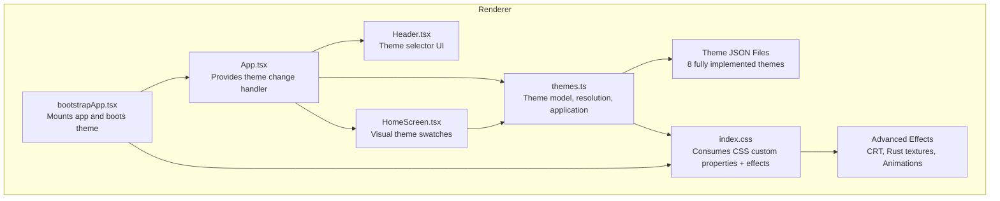
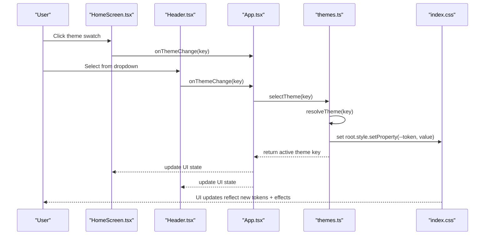
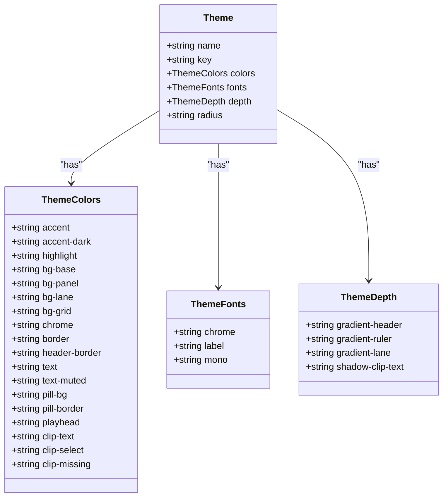
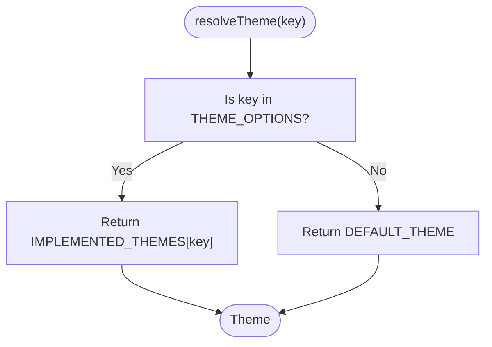
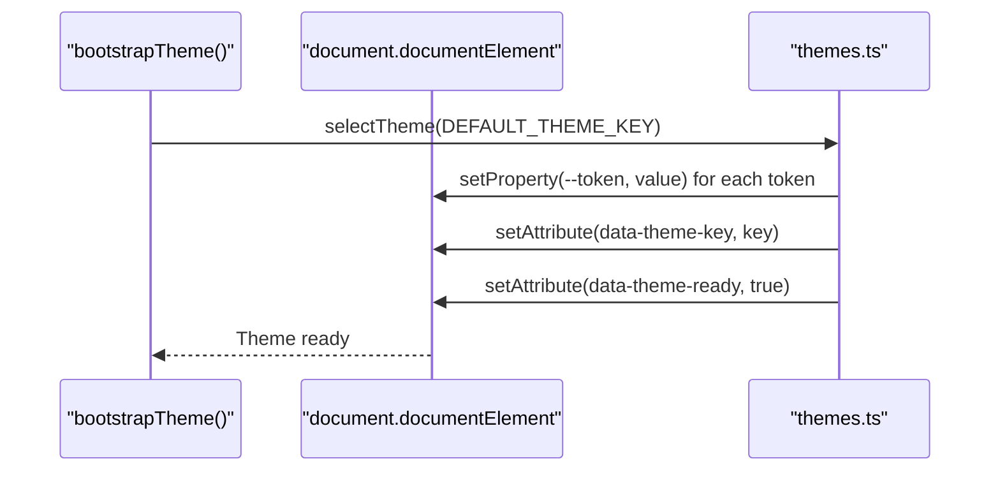
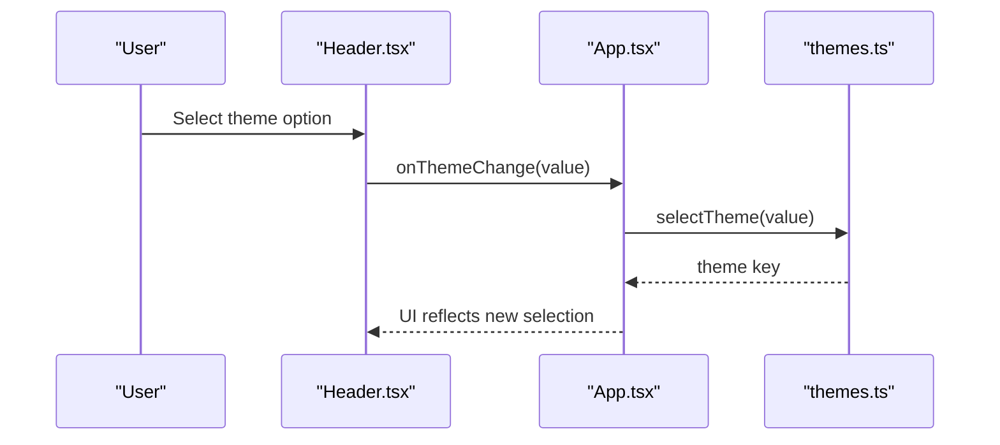
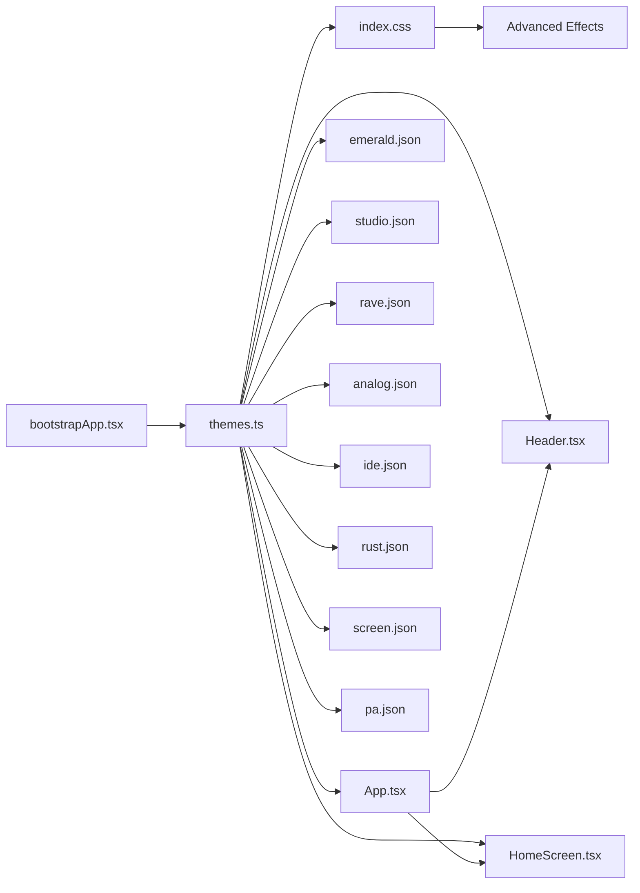

# Theming & UI System

<cite>
**Referenced Files in This Document**
- [themes.ts](file://src/renderer/src/theme/themes.ts)
- [emerald.json](file://public/themes/emerald.json)
- [studio.json](file://public/themes/studio.json)
- [rave.json](file://public/themes/rave.json)
- [analog.json](file://public/themes/analog.json)
- [ide.json](file://public/themes/ide.json)
- [rust.json](file://public/themes/rust.json)
- [screen.json](file://public/themes/screen.json)
- [pa.json](file://public/themes/pa.json)
- [index.css](file://src/renderer/src/index.css)
- [spec-002-theming-skin-system.md](file://docs/specs/spec-002-theming-skin-system.md)
- [App.tsx](file://src/renderer/src/App.tsx)
- [Header.tsx](file://src/renderer/src/components/Header.tsx)
- [HomeScreen.tsx](file://src/renderer/src/components/HomeScreen.tsx)
- [bootstrapApp.tsx](file://src/renderer/src/bootstrapApp.tsx)
- [spec-002-theming-skin-system.test.tsx](file://src/renderer/src/theme/spec-002-theming-skin-system.test.tsx)
</cite>

## Update Summary
**Changes Made**
- Enhanced CSS styling with over 480 lines of additions supporting new visual design elements and animations
- Added comprehensive theme customization with visual swatches on the home screen
- Implemented advanced theme-specific effects including Rust industrial textures and Screen maximal CRT aesthetics
- Improved color scheme switching capabilities with animated transitions and hover states
- Expanded responsive layout support for better cross-platform consistency
- Added sophisticated CSS animations for scanlines, flicker effects, and VHS drift patterns

## Table of Contents
1. [Introduction](#introduction)
2. [Project Structure](#project-structure)
3. [Core Components](#core-components)
4. [Architecture Overview](#architecture-overview)
5. [Detailed Component Analysis](#detailed-component-analysis)
6. [Enhanced Visual Effects](#enhanced-visual-effects)
7. [Theme Customization Interface](#theme-customization-interface)
8. [Dependency Analysis](#dependency-analysis)
9. [Performance Considerations](#performance-considerations)
10. [Accessibility Considerations](#accessibility-considerations)
11. [Responsive Design Principles](#responsive-design-principles)
12. [Cross-Platform UI Consistency](#cross-platform-ui-consistency)
13. [Practical Examples](#practical-examples)
14. [Troubleshooting Guide](#troubleshooting-guide)
15. [Conclusion](#conclusion)

## Introduction
This document describes MixJam Electron's theming and user interface system. It explains the CSS variable-based theming architecture, the theme token system, and custom skin support. It covers the theme loading mechanism, dynamic theme switching, and CSS custom property integration. It also documents the theme specification format, color palette definitions, component styling patterns, accessibility considerations, responsive design principles, and cross-platform UI consistency. Practical examples show how to create custom themes, modify existing themes, and implement theme-aware components. Finally, it addresses the relationship between theming and the overall application design system.

**Updated** The theming system now features enhanced CSS styling with over 480 lines of additions, providing sophisticated visual effects, animated transitions, and improved user experience through visual theme swatches and advanced theme-specific styling.

## Project Structure
The theming system is organized around a cohesive set of modules with enhanced visual capabilities:
- Theme definition and resolution: TypeScript module that defines the theme model, resolves requested themes, and applies them via CSS custom properties.
- Theme assets: JSON files containing theme token values for all 8 themes with enhanced color palettes.
- Global styles: CSS that consumes the CSS custom properties and applies them across components with advanced effects.
- UI components: React components that expose theme selectors and visual swatches, reacting to theme changes.
- Bootstrapping: Application initialization that applies the default theme before rendering.
- Visual effects: Advanced CSS animations and effects for specific themes including CRT simulations and industrial textures.

**Diagram sources**
- [bootstrapApp.tsx:1-19](file://src/renderer/src/bootstrapApp.tsx#L1-L19)
- [App.tsx:1-183](file://src/renderer/src/App.tsx#L1-L183)
- [Header.tsx:1-42](file://src/renderer/src/components/Header.tsx#L1-L42)
- [HomeScreen.tsx:1-163](file://src/renderer/src/components/HomeScreen.tsx#L1-L163)
- [themes.ts:1-153](file://src/renderer/src/theme/themes.ts#L1-L153)
- [index.css:1-1972](file://src/renderer/src/index.css#L1-L1972)

**Section sources**
- [bootstrapApp.tsx:1-19](file://src/renderer/src/bootstrapApp.tsx#L1-L19)
- [App.tsx:1-183](file://src/renderer/src/App.tsx#L1-L183)
- [Header.tsx:1-42](file://src/renderer/src/components/Header.tsx#L1-L42)
- [HomeScreen.tsx:1-163](file://src/renderer/src/components/HomeScreen.tsx#L1-L163)
- [themes.ts:1-153](file://src/renderer/src/theme/themes.ts#L1-L153)
- [index.css:1-1972](file://src/renderer/src/index.css#L1-L1972)

## Core Components
- Theme model and token system: Defines the canonical set of CSS custom properties used throughout the UI. Tokens include colors, typography families, corner radius, and depth gradients.
- Theme loader and resolver: Loads all 8 implemented themes and resolves requested themes, falling back to the default when invalid keys are provided.
- Theme application: Writes theme tokens as CSS custom properties on the root element and sets a data attribute indicating the active theme key.
- Theme selector UI: Presents a dropdown with all 8 supported theme names and forwards user selections to the theme application function.
- Visual theme swatches: Interactive circular buttons on the home screen showing theme preview colors with hover animations and active state indicators.
- Global stylesheet: Consumes CSS custom properties for backgrounds, borders, text, and typography, ensuring consistent theming across components.
- Advanced visual effects: Specialized CSS effects for certain themes including Rust industrial textures, Screen maximal CRT aesthetics, and animated transitions.

Key implementation references:
- Theme model and token system: [themes.ts:28-78](file://src/renderer/src/theme/themes.ts#L28-L78)
- Theme loader and resolver: [themes.ts:92-117](file://src/renderer/src/theme/themes.ts#L92-L117)
- Theme application: [themes.ts:128-146](file://src/renderer/src/theme/themes.ts#L128-L146)
- Theme selector UI: [Header.tsx:28-37](file://src/renderer/src/components/Header.tsx#L28-L37)
- Visual theme swatches: [HomeScreen.tsx:82-104](file://src/renderer/src/components/HomeScreen.tsx#L82-L104)
- Global stylesheet usage: [index.css:60-160](file://src/renderer/src/index.css#L60-L160)

**Section sources**
- [themes.ts:28-78](file://src/renderer/src/theme/themes.ts#L28-L78)
- [themes.ts:92-117](file://src/renderer/src/theme/themes.ts#L92-L117)
- [themes.ts:128-146](file://src/renderer/src/theme/themes.ts#L128-L146)
- [Header.tsx:28-37](file://src/renderer/src/components/Header.tsx#L28-L37)
- [HomeScreen.tsx:82-104](file://src/renderer/src/components/HomeScreen.tsx#L82-L104)
- [index.css:60-160](file://src/renderer/src/index.css#L60-L160)

## Architecture Overview
The theming architecture follows a strict separation of concerns with enhanced visual capabilities:
- Theme definition: JSON files define token values per theme for all 8 variants with expanded color palettes.
- Resolution: The resolver ensures only valid theme keys are accepted and falls back to the default.
- Application: The application writes tokens as CSS custom properties on the root element.
- Consumption: Stylesheets consume these properties to style all components with advanced effects.
- Selection: The UI triggers theme changes through both dropdown and visual swatches, which re-apply the tokens without remounting components.

**Diagram sources**
- [HomeScreen.tsx:85-102](file://src/renderer/src/components/HomeScreen.tsx#L85-L102)
- [Header.tsx:31-33](file://src/renderer/src/components/Header.tsx#L31-L33)
- [App.tsx:84-86](file://src/renderer/src/App.tsx#L84-L86)
- [themes.ts:141-146](file://src/renderer/src/theme/themes.ts#L141-L146)
- [index.css:60-160](file://src/renderer/src/index.css#L60-L160)

## Detailed Component Analysis

### Theme Model and Token System
The theme model defines:
- ThemeColors: A fixed set of named tokens for colors including new clip-specific tokens.
- ThemeFonts: Three font families for chrome, labels, and monospace.
- ThemeDepth: Multi-stop gradient and shadow values for depth effects.
- Theme: Aggregates name, key, colors, fonts, depth, and radius.

Implementation references:
- ThemeColors interface: [themes.ts:28-47](file://src/renderer/src/theme/themes.ts#L28-L47)
- ThemeFonts interface: [themes.ts:49-56](file://src/renderer/src/theme/themes.ts#L49-L56)
- ThemeDepth interface: [themes.ts:64-69](file://src/renderer/src/theme/themes.ts#L64-L69)
- Theme interface: [themes.ts:71-78](file://src/renderer/src/theme/themes.ts#L71-L78)

**Diagram sources**
- [themes.ts:28-78](file://src/renderer/src/theme/themes.ts#L28-L78)

**Section sources**
- [themes.ts:28-78](file://src/renderer/src/theme/themes.ts#L28-L78)

### Theme Loader and Resolver
The resolver:
- Validates theme keys against the THEME_OPTIONS array containing all 8 themes.
- Returns the default theme for invalid keys.
- Provides normalization utilities to ensure consistent keys.

Implementation references:
- Theme options with 8 themes: [themes.ts:10-19](file://src/renderer/src/theme/themes.ts#L10-L19)
- Resolver and normalization: [themes.ts:111-121](file://src/renderer/src/theme/themes.ts#L111-L121)

**Diagram sources**
- [themes.ts:10-19](file://src/renderer/src/theme/themes.ts#L10-L19)
- [themes.ts:111-121](file://src/renderer/src/theme/themes.ts#L111-L121)

**Section sources**
- [themes.ts:10-19](file://src/renderer/src/theme/themes.ts#L10-L19)
- [themes.ts:111-121](file://src/renderer/src/theme/themes.ts#L111-L121)

### Theme Application and Bootstrap
The application:
- Writes each color token, depth token, and font tokens as CSS custom properties on the root element.
- Sets a data attribute indicating the active theme key.
- The bootstrap function applies the default theme during mount and marks the theme ready.

Implementation references:
- Application function: [themes.ts:128-139](file://src/renderer/src/theme/themes.ts#L128-L139)
- Theme selection: [themes.ts:141-146](file://src/renderer/src/theme/themes.ts#L141-L146)
- Bootstrap: [themes.ts:148-152](file://src/renderer/src/theme/themes.ts#L148-L152)

**Diagram sources**
- [themes.ts:148-152](file://src/renderer/src/theme/themes.ts#L148-L152)
- [themes.ts:141-146](file://src/renderer/src/theme/themes.ts#L141-L146)
- [themes.ts:128-139](file://src/renderer/src/theme/themes.ts#L128-L139)

**Section sources**
- [themes.ts:128-146](file://src/renderer/src/theme/themes.ts#L128-L146)
- [themes.ts:148-152](file://src/renderer/src/theme/themes.ts#L148-L152)

### Theme Selector UI
The theme selector:
- Lists all 8 theme names from the theme options.
- Defaults to the active theme.
- Calls the theme change handler on selection, which re-applies the theme.

Implementation references:
- Theme options usage: [Header.tsx:34-36](file://src/renderer/src/components/Header.tsx#L34-L36)
- Default selection: [Header.tsx:31](file://src/renderer/src/components/Header.tsx#L31)
- Handler invocation: [Header.tsx:32-33](file://src/renderer/src/components/Header.tsx#L32-L33)
- App integration: [App.tsx:84-86](file://src/renderer/src/App.tsx#L84-L86)

**Diagram sources**
- [Header.tsx:28-37](file://src/renderer/src/components/Header.tsx#L28-L37)
- [App.tsx:84-86](file://src/renderer/src/App.tsx#L84-L86)
- [themes.ts:141-146](file://src/renderer/src/theme/themes.ts#L141-L146)

**Section sources**
- [Header.tsx:28-37](file://src/renderer/src/components/Header.tsx#L28-L37)
- [App.tsx:84-86](file://src/renderer/src/App.tsx#L84-L86)

### Visual Theme Swatches
The visual theme swatches provide an intuitive way to switch themes:
- Displays circular buttons showing each theme's accent and base colors in a diagonal split pattern.
- Includes hover animations with scale transforms and highlight border effects.
- Shows active state with outline indicators for the currently selected theme.
- Provides accessible labels and keyboard navigation support.
- Dynamically generates swatch backgrounds using theme color tokens.

Implementation references:
- Swatch generation: [HomeScreen.tsx:85-102](file://src/renderer/src/components/HomeScreen.tsx#L85-L102)
- Swatch styling: [index.css:443-466](file://src/renderer/src/index.css#L443-L466)
- Active state handling: [HomeScreen.tsx:87](file://src/renderer/src/components/HomeScreen.tsx#L87)

**Section sources**
- [HomeScreen.tsx:85-102](file://src/renderer/src/components/HomeScreen.tsx#L85-L102)
- [index.css:443-466](file://src/renderer/src/index.css#L443-L466)

### Global Stylesheet and CSS Custom Properties
The stylesheet consumes CSS custom properties for:
- Backgrounds: base, panel, lane, grid
- Borders and headers
- Text colors and muted text
- Interactive elements: buttons, links, controls
- Typography: chrome, labels, monospace
- Corner radius
- Depth effects: gradients and shadows
- Advanced animations and transitions

Implementation references:
- Body and global properties: [index.css:60-71](file://src/renderer/src/index.css#L60-L71)
- Header styling: [index.css:85-94](file://src/renderer/src/index.css#L85-L94)
- Theme selector: [index.css:148-162](file://src/renderer/src/index.css#L148-L162)
- Footer styling: [index.css:173-184](file://src/renderer/src/index.css#L173-L184)
- Buttons and links: [index.css:353-383](file://src/renderer/src/index.css#L353-L383)
- Tracker view: [index.css:385-527](file://src/renderer/src/index.css#L385-L527)
- Browser and sample list: [index.css:684-794](file://src/renderer/src/index.css#L684-794)

**Section sources**
- [index.css:60-71](file://src/renderer/src/index.css#L60-L71)
- [index.css:85-94](file://src/renderer/src/index.css#L85-L94)
- [index.css:148-162](file://src/renderer/src/index.css#L148-L162)
- [index.css:173-184](file://src/renderer/src/index.css#L173-L184)
- [index.css:353-383](file://src/renderer/src/index.css#L353-L383)
- [index.css:385-527](file://src/renderer/src/index.css#L385-L527)
- [index.css:684-794](file://src/renderer/src/index.css#L684-794)

## Enhanced Visual Effects

### Rust Industrial Theme Effects
The Rust Industrial theme implements sophisticated texture overlays:
- SVG noise generation using fractal turbulence filters for authentic weathered metal appearance
- Repeating linear gradients creating subtle scratch patterns at multiple angles
- Overlay blend modes combining noise and scratch textures
- Semi-transparent layers creating depth and character

Implementation details:
- Noise texture: Base frequency 0.9 with 2 octaves for fine-grained detail
- Scratch patterns: Three overlapping gradients at 103°, 19°, and 67° angles
- Opacity control: 0.5 for noise layer, 0.4 for scratch overlay
- Blend mode: Overlay for natural texture integration

**Section sources**
- [index.css:93-116](file://src/renderer/src/index.css#L93-L116)

### Screen Maximal Theme Effects
The Screen Maximal theme creates authentic CRT monitor aesthetics:
- Scanline overlay using repeating linear gradients with precise spacing
- Pixelation effects through SVG noise filters with lower frequency settings
- VHS-style color fringing with RGB channel separation
- Flicker animation simulating CRT phosphor instability
- Drift animation creating subtle horizontal movement

Animation specifications:
- Flicker: 6-second duration with step timing for digital artifact effect
- VHS drift: 9-second cycle with smooth easing and position oscillation
- Color channels: Red (255,0,60), Green (0,255,60), Blue (40,80,255)
- Opacity variations: 0.5 for main overlay, 0.16 for color fringing

**Section sources**
- [index.css:118-162](file://src/renderer/src/index.css#L118-L162)

### Advanced CSS Animations and Transitions
The enhanced styling includes sophisticated animations:
- Theme swatch hover effects with scale transforms and border color transitions
- Smooth theme switching without component remounting
- Animated focus indicators for accessibility compliance
- Gradient background transitions for visual continuity

**Section sources**
- [index.css:443-466](file://src/renderer/src/index.css#L443-L466)

## Theme Customization Interface

### Visual Theme Swatches Implementation
The home screen provides an intuitive theme selection interface:
- Circular swatch buttons displaying theme preview colors
- Diagonal gradient backgrounds showing accent-to-base color transitions
- Hover animations with 1.15x scale transform and highlight border
- Active state indication with 2px outline offset
- Accessible labeling with aria attributes and keyboard navigation

Technical implementation:
- Dynamic background generation using theme color tokens
- State management for active theme tracking
- Event handling for theme switching
- Responsive layout with flex wrapping

**Section sources**
- [HomeScreen.tsx:82-104](file://src/renderer/src/components/HomeScreen.tsx#L82-L104)
- [index.css:443-466](file://src/renderer/src/index.css#L443-L466)

### Theme Specification and Token Reference
The specification defines:
- Theme token roles and CSS custom property names
- Typography tokens and font families
- The eight supported themes and their keys
- Acceptance criteria for implementation

Implementation references:
- Token role table: [spec-002-theming-skin-system.md:32-49](file://docs/specs/spec-002-theming-skin-system.md#L32-L49)
- Typography tokens: [spec-002-theming-skin-system.md:51-58](file://docs/specs/spec-002-theming-skin-system.md#L51-L58)
- Theme list: [spec-002-theming-skin-system.md:62-73](file://docs/specs/spec-002-theming-skin-system.md#L62-L73)
- Acceptance criteria: [spec-002-theming-skin-system.md:144-156](file://docs/specs/spec-002-theming-skin-system.md#L144-L156)

**Section sources**
- [spec-002-theming-skin-system.md:32-49](file://docs/specs/spec-002-theming-skin-system.md#L32-L49)
- [spec-002-theming-skin-system.md:51-58](file://docs/specs/spec-002-theming-skin-system.md#L51-L58)
- [spec-002-theming-skin-system.md:62-73](file://docs/specs/spec-002-theming-skin-system.md#L62-L73)
- [spec-002-theming-skin-system.md:144-156](file://docs/specs/spec-002-theming-skin-system.md#L144-L156)

## Dependency Analysis
The theming system exhibits low coupling and high cohesion with enhanced visual capabilities:
- themes.ts depends on all 8 theme JSON files and exports the theme model and application functions.
- index.css depends on CSS custom properties written by themes.ts and implements advanced effects.
- Header.tsx depends on themes.ts for theme options and on App.tsx for the change handler.
- HomeScreen.tsx depends on themes.ts for theme resolution and visual swatch generation.
- App.tsx depends on themes.ts for the change handler.
- bootstrapApp.tsx depends on themes.ts for bootstrap.

**Diagram sources**
- [themes.ts:1-153](file://src/renderer/src/theme/themes.ts#L1-L153)
- [index.css:1-1972](file://src/renderer/src/index.css#L1-L1972)
- [Header.tsx:1-42](file://src/renderer/src/components/Header.tsx#L1-L42)
- [HomeScreen.tsx:1-163](file://src/renderer/src/components/HomeScreen.tsx#L1-L163)
- [App.tsx:1-183](file://src/renderer/src/App.tsx#L1-L183)
- [bootstrapApp.tsx:1-19](file://src/renderer/src/bootstrapApp.tsx#L1-L19)
- [emerald.json:1-37](file://public/themes/emerald.json#L1-L37)
- [studio.json:1-37](file://public/themes/studio.json#L1-L37)
- [rave.json:1-37](file://public/themes/rave.json#L1-L37)
- [analog.json:1-37](file://public/themes/analog.json#L1-L37)
- [ide.json:1-37](file://public/themes/ide.json#L1-L37)
- [rust.json:1-37](file://public/themes/rust.json#L1-L37)
- [screen.json:1-37](file://public/themes/screen.json#L1-L37)
- [pa.json:1-37](file://public/themes/pa.json#L1-L37)

**Section sources**
- [themes.ts:1-153](file://src/renderer/src/theme/themes.ts#L1-L153)
- [index.css:1-1972](file://src/renderer/src/index.css#L1-L1972)
- [Header.tsx:1-42](file://src/renderer/src/components/Header.tsx#L1-L42)
- [HomeScreen.tsx:1-163](file://src/renderer/src/components/HomeScreen.tsx#L1-L163)
- [App.tsx:1-183](file://src/renderer/src/App.tsx#L1-L183)
- [bootstrapApp.tsx:1-19](file://src/renderer/src/bootstrapApp.tsx#L1-L19)
- [emerald.json:1-37](file://public/themes/emerald.json#L1-L37)
- [studio.json:1-37](file://public/themes/studio.json#L1-L37)
- [rave.json:1-37](file://public/themes/rave.json#L1-L37)
- [analog.json:1-37](file://public/themes/analog.json#L1-L37)
- [ide.json:1-37](file://public/themes/ide.json#L1-L37)
- [rust.json:1-37](file://public/themes/rust.json#L1-L37)
- [screen.json:1-37](file://public/themes/screen.json#L1-L37)
- [pa.json:1-37](file://public/themes/pa.json#L1-L37)

## Performance Considerations
- Synchronous bootstrap: The default theme is applied before the first render, preventing a flash of unstyled content.
- No remounting: Dynamic theme switching re-applies tokens without changing component trees, minimizing layout thrashing.
- CSS custom properties: Efficiently update visuals at runtime without recalculating stylesheets.
- Font loading: Bundled fonts avoid external network requests, reducing latency and improving reliability.
- Conditional effects: Theme-specific CSS effects are only applied when their respective themes are active, minimizing unnecessary rendering overhead.
- Optimized animations: Hardware-accelerated transforms and opacity changes for smooth performance.
- Efficient swatch rendering: Dynamic background generation uses CSS gradients rather than image assets.

## Accessibility Considerations
- Color contrast: Tokens define primary and muted text colors; ensure sufficient contrast ratios for readability.
- Focus indicators: The theme selector and interactive elements maintain visible focus styles via border tokens.
- Keyboard navigation: The theme selector and visual swatches are keyboard accessible and programmatically labeled.
- Semantic labeling: The theme selector has an accessible label for assistive technologies.
- Screen reader support: Visual swatches include proper aria-labels and aria-pressed states.
- Reduced motion: Animation preferences should be respected for users with motion sensitivity.

**Section sources**
- [index.css:160-162](file://src/renderer/src/index.css#L160-L162)
- [Header.tsx:30](file://src/renderer/src/components/Header.tsx#L30)
- [HomeScreen.tsx:97-98](file://src/renderer/src/components/HomeScreen.tsx#L97-L98)

## Responsive Design Principles
- Flexible layouts: Components use flexible units and grid/flex properties to adapt to varying container sizes.
- Typography scaling: Font sizes are defined in relative units to improve readability across devices.
- Adaptive spacing: Consistent use of tokens for paddings and gaps maintains proportional spacing.
- Touch-friendly targets: Interactive elements meet minimum 44px touch target guidelines.
- Viewport adaptation: Layout adjusts gracefully across different screen sizes and orientations.

**Section sources**
- [index.css:165-170](file://src/renderer/src/index.css#L165-L170)
- [index.css:239-254](file://src/renderer/src/index.css#L239-L254)
- [index.css:443-466](file://src/renderer/src/index.css#L443-L466)

## Cross-Platform UI Consistency
- CSS custom properties: Centralized token values ensure consistent visuals across platforms.
- Local font loading: Fonts are bundled locally, avoiding platform-specific font availability issues.
- Minimal platform-specific code: Theming relies on web standards, promoting consistency across environments.
- Standard CSS features: Uses widely-supported CSS features for maximum compatibility.
- Consistent animations: Hardware-accelerated animations work consistently across modern browsers.

**Section sources**
- [index.css:1-47](file://src/renderer/src/index.css#L1-L47)
- [spec-002-theming-skin-system.md:59-60](file://docs/specs/spec-002-theming-skin-system.md#L59-L60)

## Practical Examples

### Creating a Custom Theme
Steps:
1. Define a new theme JSON file in the themes directory with the required structure.
2. Extend the theme options list with the new theme key and name.
3. Optionally add the theme to the implemented themes registry.
4. Verify that the theme is selectable and applied correctly.
5. Test visual swatch generation and theme-specific effects if applicable.

References:
- Theme JSON schema: [spec-002-theming-skin-system.md:118-138](file://docs/specs/spec-002-theming-skin-system.md#L118-L138)
- Theme options extension: [themes.ts:10-19](file://src/renderer/src/theme/themes.ts#L10-L19)
- Implemented themes registry: [themes.ts:92-101](file://src/renderer/src/theme/themes.ts#L92-L101)

**Section sources**
- [spec-002-theming-skin-system.md:118-138](file://docs/specs/spec-002-theming-skin-system.md#L118-L138)
- [themes.ts:10-19](file://src/renderer/src/theme/themes.ts#L10-L19)
- [themes.ts:92-101](file://src/renderer/src/theme/themes.ts#L92-L101)

### Modifying an Existing Theme
Steps:
1. Locate the theme JSON file for the target theme.
2. Adjust color tokens and radius values to achieve the desired look.
3. Confirm that the stylesheet consumes the updated tokens without hardcoded colors.
4. Test visual swatch preview and any theme-specific effects.

References:
- Emerald theme token values: [spec-002-theming-skin-system.md:77-94](file://docs/specs/spec-002-theming-skin-system.md#L77-L94)
- CSS custom property usage: [index.css:60-160](file://src/renderer/src/index.css#L60-L160)

**Section sources**
- [spec-002-theming-skin-system.md:77-94](file://docs/specs/spec-002-theming-skin-system.md#L77-L94)
- [index.css:60-160](file://src/renderer/src/index.css#L60-L160)

### Implementing Theme-Aware Components
Pattern:
- Consume CSS custom properties for colors, borders, and backgrounds.
- Avoid hardcoding color values inside components.
- Use tokens for interactive states (hover, focus).
- Leverage theme-specific effects through data attributes.

References:
- Theme selector component: [Header.tsx:28-37](file://src/renderer/src/components/Header.tsx#L28-L37)
- Visual swatch component: [HomeScreen.tsx:85-102](file://src/renderer/src/components/HomeScreen.tsx#L85-L102)
- Global stylesheet usage: [index.css:353-383](file://src/renderer/src/index.css#L353-L383)

**Section sources**
- [Header.tsx:28-37](file://src/renderer/src/components/Header.tsx#L28-L37)
- [HomeScreen.tsx:85-102](file://src/renderer/src/components/HomeScreen.tsx#L85-L102)
- [index.css:353-383](file://src/renderer/src/index.css#L353-L383)

### Exploring All 8 Theme Variants
The system now supports eight distinct themes, each with unique visual characteristics and specialized effects:

**Emerald Theme**: Deep forest green with teal accents, providing a classic digital audio workstation aesthetic with excellent contrast and readability. Features traditional token-based styling without special effects.

**Flat Studio Theme**: Modern flat design with vibrant cyan accents, featuring clean lines and contemporary color harmony optimized for extended studio sessions. Uses standard gradient backgrounds without additional effects.

**Neon Rave Theme**: High-energy dark theme with electric blue and magenta accents, designed for late-night production sessions with vibrant visual feedback. Employs modern typography with monospace fonts throughout.

**Warm Analog Theme**: Rich amber and gold tones reminiscent of vintage tube equipment, offering comfortable eye contact and warm visual comfort for long mixing sessions. Utilizes traditional font pairing with Josefin Sans and Ubuntu.

**IDE Theme**: Developer-centric theme with monospace typography and professional color scheme, emphasizing code-like precision and technical workflow integration. Features increased border radius for softer edges.

**Rust Industrial Theme**: Weathered bronze and steel tones with industrial character, providing robust visual identity suitable for heavy-duty audio production. Includes sophisticated texture overlays with SVG noise generation and repeating linear gradients.

**Screen Maximal Theme**: Bold, saturated colors with high contrast ratios, designed for maximum visual impact and screen readability in demanding environments. Implements authentic CRT monitor aesthetics with scanline overlays, pixelation effects, and VHS-style color fringing using CSS animations and blend modes.

**Club PA Theme**: Party-oriented theme with dynamic lighting effects and energetic color schemes, optimized for live performance and club environment aesthetics. Features minimal border radius and high-contrast white-on-black color scheme.

Each theme maintains consistent token values across all UI components, ensuring predictable behavior and accessibility compliance regardless of the selected variant. Theme-specific effects are conditionally applied based on the active theme key, enhancing the immersive quality of each variant. Visual swatches provide immediate preview of each theme's color scheme.

**Section sources**
- [themes.ts:10-19](file://src/renderer/src/theme/themes.ts#L10-L19)
- [emerald.json:1-37](file://public/themes/emerald.json#L1-L37)
- [studio.json:1-37](file://public/themes/studio.json#L1-L37)
- [rave.json:1-37](file://public/themes/rave.json#L1-L37)
- [analog.json:1-37](file://public/themes/analog.json#L1-L37)
- [ide.json:1-37](file://public/themes/ide.json#L1-L37)
- [rust.json:1-37](file://public/themes/rust.json#L1-L37)
- [screen.json:1-37](file://public/themes/screen.json#L1-L37)
- [pa.json:1-37](file://public/themes/pa.json#L1-L37)

## Troubleshooting Guide
Common issues and resolutions:
- Flash of unstyled content: Ensure bootstrap occurs before mounting the app.
  - Reference: [bootstrapApp.tsx:12-18](file://src/renderer/src/bootstrapApp.tsx#L12-L18)
- Theme selector not applying changes: Verify the change handler is invoked and the theme key is normalized.
  - Reference: [App.tsx:84-86](file://src/renderer/src/App.tsx#L84-L86)
- Visual swatches not updating: Check theme resolution and active state management.
  - Reference: [HomeScreen.tsx:85-102](file://src/renderer/src/components/HomeScreen.tsx#L85-L102)
- Hardcoded colors in CSS: Ensure all colors derive from CSS custom properties.
  - Reference: [index.css:60-160](file://src/renderer/src/index.css#L60-L160)
- Nonexistent theme key: The resolver falls back to the default theme.
  - Reference: [themes.ts:111-121](file://src/renderer/src/theme/themes.ts#L111-L121)
- Theme-specific effects not appearing: Verify the data-theme-key attribute is set correctly and CSS selectors match the theme key.
  - Reference: [index.css:93-162](file://src/renderer/src/index.css#L93-L162)
- Animation performance issues: Check for hardware acceleration and reduce complexity if needed.
  - Reference: [index.css:151-162](file://src/renderer/src/index.css#L151-L162)

**Section sources**
- [bootstrapApp.tsx:12-18](file://src/renderer/src/bootstrapApp.tsx#L12-L18)
- [App.tsx:84-86](file://src/renderer/src/App.tsx#L84-L86)
- [HomeScreen.tsx:85-102](file://src/renderer/src/components/HomeScreen.tsx#L85-L102)
- [index.css:60-160](file://src/renderer/src/index.css#L60-L160)
- [themes.ts:111-121](file://src/renderer/src/theme/themes.ts#L111-L121)
- [index.css:93-162](file://src/renderer/src/index.css#L93-L162)
- [index.css:151-162](file://src/renderer/src/index.css#L151-L162)

## Conclusion
MixJam Electron's theming system leverages CSS custom properties and a centralized theme model to deliver a consistent, dynamic UI with enhanced visual capabilities. The architecture ensures fast bootstrapping, seamless theme switching, and maintainable component styling. With all eight themes now fully implemented and enhanced with over 480 lines of advanced CSS styling, users have access to diverse visual experiences including sophisticated effects for Rust industrial textures and Screen maximal CRT aesthetics while maintaining accessibility and cross-platform consistency. The addition of visual theme swatches provides an intuitive interface for theme exploration and selection. By adhering to the token-based design and consuming tokens uniformly across the stylesheet, the system supports easy customization, accessibility, and cross-platform consistency while delivering a rich, immersive user experience.