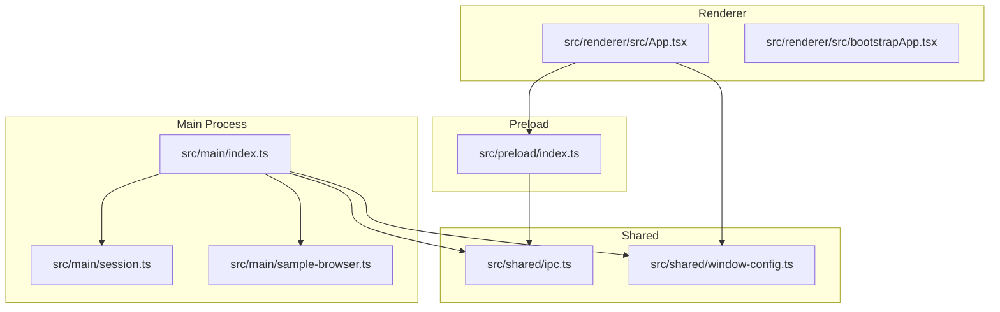
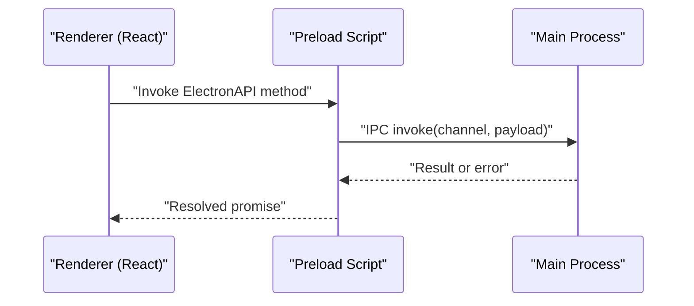
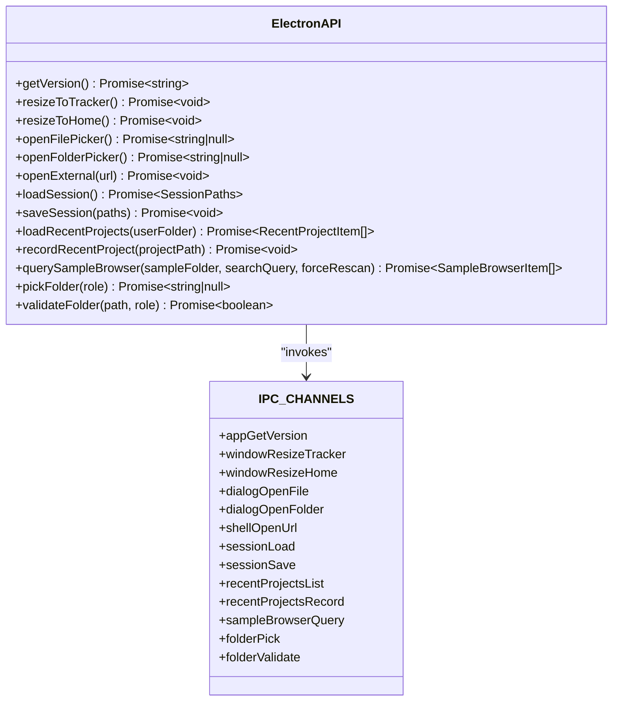
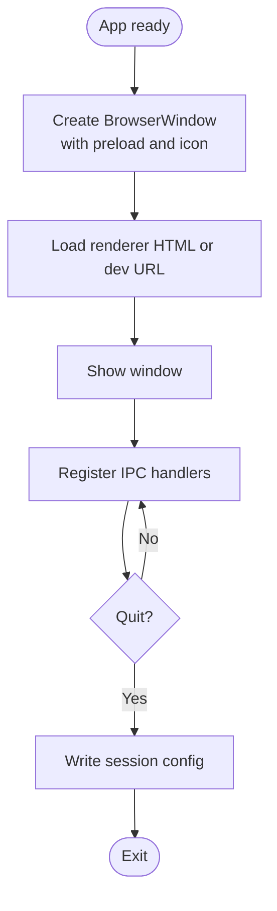
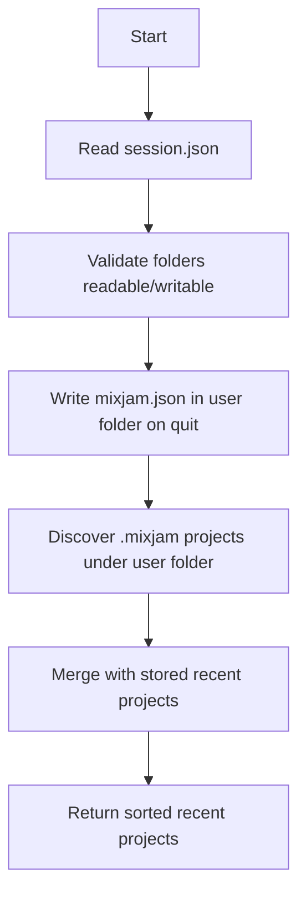
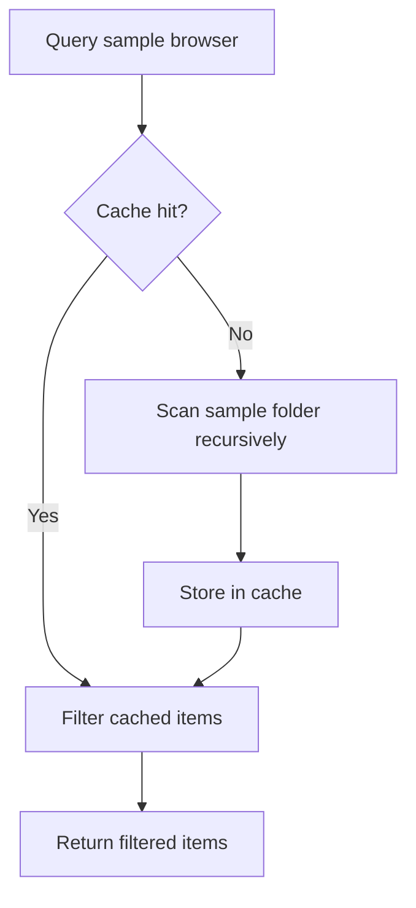
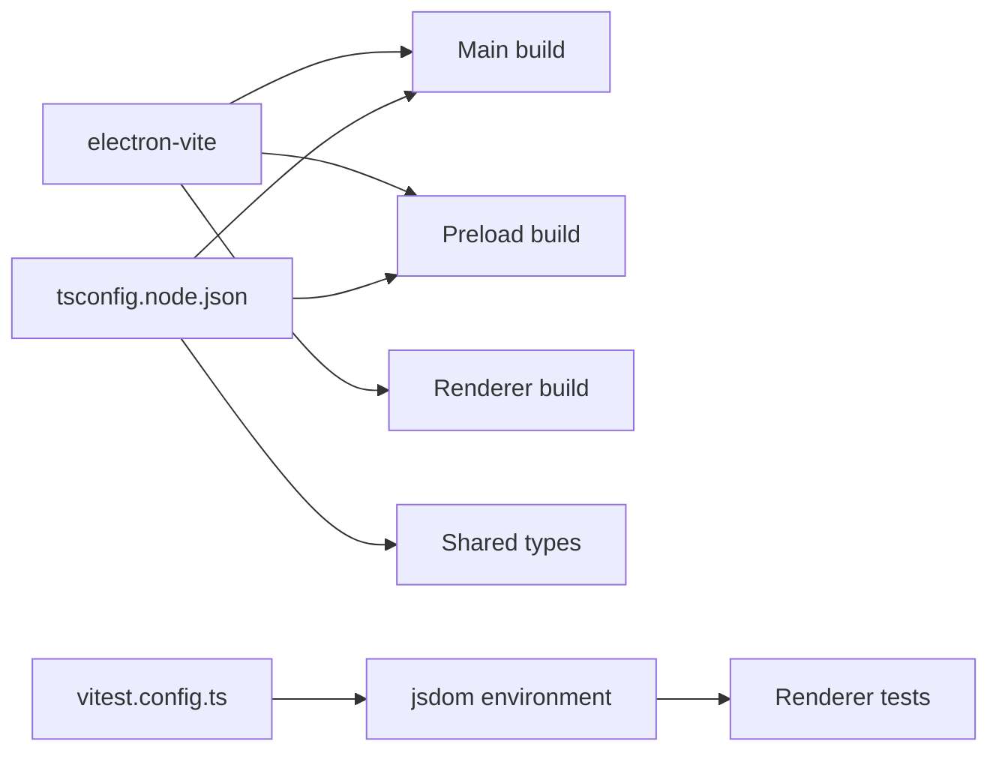

# Troubleshooting & FAQ

<cite>
**Referenced Files in This Document**
- [package.json](file://package.json)
- [electron.vite.config.ts](file://electron.vite.config.ts)
- [src/main/index.ts](file://src/main/index.ts)
- [src/preload/index.ts](file://src/preload/index.ts)
- [src/shared/ipc.ts](file://src/shared/ipc.ts)
- [src/shared/window-config.ts](file://src/shared/window-config.ts)
- [src/main/session.ts](file://src/main/session.ts)
- [src/main/sample-browser.ts](file://src/main/sample-browser.ts)
- [src/renderer/src/App.tsx](file://src/renderer/src/App.tsx)
- [src/renderer/src/bootstrapApp.tsx](file://src/renderer/src/bootstrapApp.tsx)
- [vitest.config.ts](file://vitest.config.ts)
- [.github/copilot-instructions.md](file://.github/copilot-instructions.md)
</cite>

## Table of Contents
1. [Introduction](#introduction)
2. [Project Structure](#project-structure)
3. [Core Components](#core-components)
4. [Architecture Overview](#architecture-overview)
5. [Detailed Component Analysis](#detailed-component-analysis)
6. [Dependency Analysis](#dependency-analysis)
7. [Performance Considerations](#performance-considerations)
8. [Troubleshooting Guide](#troubleshooting-guide)
9. [Conclusion](#conclusion)
10. [Appendices](#appendices)

## Introduction
This document provides a comprehensive troubleshooting and FAQ guide for MixJam Electron. It focuses on diagnosing and resolving installation issues, build problems, runtime errors, IPC communication issues, and performance bottlenecks. It also covers platform-specific considerations, environment setup pitfalls, logging and diagnostics, and recovery procedures for corrupted installations or data.

## Project Structure
MixJam Electron is organized into three primary execution contexts:
- Main process: orchestrates the app lifecycle, window creation, IPC handlers, and file operations.
- Preload script: exposes a controlled API surface to the renderer via contextBridge.
- Renderer (web): React application that interacts with the main process through IPC channels.

Build and development are driven by electron-vite with TypeScript configuration split across node and web targets.

**Diagram sources**
- [src/main/index.ts:1-170](file://src/main/index.ts#L1-L170)
- [src/preload/index.ts:1-29](file://src/preload/index.ts#L1-L29)
- [src/shared/ipc.ts:1-59](file://src/shared/ipc.ts#L1-L59)
- [src/shared/window-config.ts:1-54](file://src/shared/window-config.ts#L1-L54)
- [src/main/session.ts:1-265](file://src/main/session.ts#L1-L265)
- [src/main/sample-browser.ts:1-113](file://src/main/sample-browser.ts#L1-L113)
- [src/renderer/src/App.tsx:1-108](file://src/renderer/src/App.tsx#L1-L108)
- [src/renderer/src/bootstrapApp.tsx:1-19](file://src/renderer/src/bootstrapApp.tsx#L1-L19)

**Section sources**
- [package.json:1-50](file://package.json#L1-L50)
- [electron.vite.config.ts:1-15](file://electron.vite.config.ts#L1-L15)
- [tsconfig.json:1-8](file://tsconfig.json#L1-L8)
- [tsconfig.node.json:1-14](file://tsconfig.node.json#L1-L14)

## Core Components
- IPC channel registry defines all supported commands and payloads exchanged between renderer and main.
- Main process creates the BrowserWindow, wires IPC handlers, and manages session and sample browsing.
- Preload script exposes a typed ElectronAPI facade to the renderer.
- Renderer consumes ElectronAPI to drive UI actions and data flows.

Common failure points:
- IPC channel mismatches or missing handler registrations.
- Incorrect preload exposure leading to undefined APIs in renderer.
- Window sizing/resizing logic differences across platforms.
- File permission and path canonicalization issues affecting session and project discovery.

**Section sources**
- [src/shared/ipc.ts:1-59](file://src/shared/ipc.ts#L1-L59)
- [src/main/index.ts:1-170](file://src/main/index.ts#L1-L170)
- [src/preload/index.ts:1-29](file://src/preload/index.ts#L1-L29)
- [src/shared/window-config.ts:1-54](file://src/shared/window-config.ts#L1-L54)

## Architecture Overview
The app follows a classic Electron pattern with explicit IPC boundaries and a sandboxed renderer.

**Diagram sources**
- [src/preload/index.ts:1-29](file://src/preload/index.ts#L1-L29)
- [src/shared/ipc.ts:1-59](file://src/shared/ipc.ts#L1-L59)
- [src/main/index.ts:1-170](file://src/main/index.ts#L1-L170)

## Detailed Component Analysis

### IPC Channels and Contracts
- Channel names and argument contracts are defined centrally and consumed by both main and preload.
- Renderer invokes methods via ElectronAPI, which map to IPC channels.

**Diagram sources**
- [src/shared/ipc.ts:1-59](file://src/shared/ipc.ts#L1-L59)
- [src/preload/index.ts:1-29](file://src/preload/index.ts#L1-L29)

**Section sources**
- [src/shared/ipc.ts:1-59](file://src/shared/ipc.ts#L1-L59)
- [src/preload/index.ts:1-29](file://src/preload/index.ts#L1-L29)

### Main Process Lifecycle and Window Management
- Creates a BrowserWindow with sandboxed webPreferences and sets application menu to null.
- Exposes IPC handlers for resizing windows, opening dialogs, saving/loading sessions, validating folders, and opening external URLs.
- Writes session configuration on quit and handles URL validation for safe external links.

**Diagram sources**
- [src/main/index.ts:38-73](file://src/main/index.ts#L38-L73)
- [src/shared/window-config.ts:22-37](file://src/shared/window-config.ts#L22-L37)

**Section sources**
- [src/main/index.ts:1-170](file://src/main/index.ts#L1-L170)
- [src/shared/window-config.ts:1-54](file://src/shared/window-config.ts#L1-L54)

### Session Management and Recent Projects
- Reads/writes session.json and writes a mixjam.json in the user folder on quit.
- Validates folder permissions and readability; user folder must be writable for session persistence.
- Discovers .mixjam projects under a user folder and merges with stored recent projects.

**Diagram sources**
- [src/main/session.ts:67-77](file://src/main/session.ts#L67-L77)
- [src/main/session.ts:202-233](file://src/main/session.ts#L202-L233)

**Section sources**
- [src/main/session.ts:1-265](file://src/main/session.ts#L1-L265)

### Sample Browser and Caching
- Scans a sample folder recursively for supported audio files and builds a portable relative path list.
- Maintains an in-memory cache keyed by canonicalized absolute path to avoid repeated scans.
- Filters results by a trimmed lowercase search query.

**Diagram sources**
- [src/main/sample-browser.ts:98-112](file://src/main/sample-browser.ts#L98-L112)

**Section sources**
- [src/main/sample-browser.ts:1-113](file://src/main/sample-browser.ts#L1-L113)

### Renderer Bootstrapping and Theme
- Bootstraps theme before mounting React to ensure consistent UI rendering.
- App composes views and state hooks that depend on ElectronAPI.

**Section sources**
- [src/renderer/src/bootstrapApp.tsx:1-19](file://src/renderer/src/bootstrapApp.tsx#L1-L19)
- [src/renderer/src/App.tsx:1-108](file://src/renderer/src/App.tsx#L1-L108)

## Dependency Analysis
- Build toolchain: electron-vite with separate plugins for main/preload and renderer.
- Main/preload share TypeScript configuration targeting ESNext with bundler module resolution.
- Renderer tests use jsdom environment configured in vitest.

**Diagram sources**
- [electron.vite.config.ts:1-15](file://electron.vite.config.ts#L1-L15)
- [tsconfig.node.json:1-14](file://tsconfig.node.json#L1-L14)
- [vitest.config.ts:1-29](file://vitest.config.ts#L1-L29)

**Section sources**
- [package.json:1-50](file://package.json#L1-L50)
- [electron.vite.config.ts:1-15](file://electron.vite.config.ts#L1-L15)
- [tsconfig.node.json:1-14](file://tsconfig.node.json#L1-L14)
- [vitest.config.ts:1-29](file://vitest.config.ts#L1-L29)

## Performance Considerations
- IPC overhead: Batch operations where possible; avoid frequent small invocations.
- Sample scanning: Leverage caching; use forceRescan only when necessary.
- File I/O: Canonicalization and recursive directory traversal can be expensive; keep sample folders organized.
- Window resizing: Platform-specific behavior differs; ensure proper order of setSize and setResizable.
- Renderer startup: Keep preload minimal; avoid heavy synchronous work during window creation.

[No sources needed since this section provides general guidance]

## Troubleshooting Guide

### Installation and Environment Setup
- Node.js and npm: Ensure a compatible LTS version is installed. The project specifies modern toolchains; older versions may fail builds.
- Global dependencies: electron-vite and related devDependencies must be present. Run a clean install if scripts fail.
- Platform-specific binaries: Electron binary downloads are handled automatically; network issues can cause failures. Retry or use a mirror if necessary.
- Permissions: On Windows, directory write tests probe with temporary files. Lack of write permissions to the user folder prevents session persistence.

Diagnostic steps:
- Verify scripts in package.json execute without errors.
- Confirm electron-vite configuration loads without plugin errors.
- Check TypeScript configuration resolves modules correctly.

**Section sources**
- [package.json:1-50](file://package.json#L1-L50)
- [electron.vite.config.ts:1-15](file://electron.vite.config.ts#L1-L15)
- [tsconfig.node.json:1-14](file://tsconfig.node.json#L1-L14)
- [src/main/session.ts:38-50](file://src/main/session.ts#L38-L50)

### Build Problems
- electron-vite dev/build failures:
  - Clear node_modules and reinstall dependencies.
  - Ensure externalizeDepsPlugin is applied to main/preload to prevent bundling Node internals.
  - Verify renderer plugin chain includes React for Vite.
- TypeScript errors:
  - Run typecheck to surface strict-mode issues.
  - Align tsconfig.node.json include paths with source layout.
- Coverage and test misconfiguration:
  - Validate vitest environment and setup files.
  - Ensure test include patterns match source locations.

**Section sources**
- [electron.vite.config.ts:1-15](file://electron.vite.config.ts#L1-L15)
- [tsconfig.json:1-8](file://tsconfig.json#L1-L8)
- [tsconfig.node.json:1-14](file://tsconfig.node.json#L1-L14)
- [vitest.config.ts:1-29](file://vitest.config.ts#L1-L29)

### Runtime Errors and Application Crashes
- Blank screen or delayed window show:
  - Ensure preload path and icon path are correct.
  - Confirm window is created with show: false and shown on ready-to-show.
- IPC not working:
  - Verify channel names match between preload and main.
  - Confirm contextBridge exposed API is reachable in renderer (window.electronAPI).
- External URL opening blocked:
  - Only https URLs to allowed hosts are opened; verify URL parsing and host checks.
- Session not persisting:
  - Validate user folder is writable; check writeSessionConfig on quit logs.

**Section sources**
- [src/shared/window-config.ts:14-37](file://src/shared/window-config.ts#L14-L37)
- [src/main/index.ts:38-73](file://src/main/index.ts#L38-L73)
- [src/shared/ipc.ts:1-59](file://src/shared/ipc.ts#L1-L59)
- [src/preload/index.ts:1-29](file://src/preload/index.ts#L1-L29)
- [src/main/index.ts:155-169](file://src/main/index.ts#L155-L169)
- [src/main/session.ts:256-264](file://src/main/session.ts#L256-L264)

### IPC Communication Issues
Symptoms:
- window.electronAPI is undefined in renderer.
- Calls hang or throw “unknown channel” errors.
- Payload types mismatch causing silent failures.

Resolutions:
- Ensure preload exposes ElectronAPI via contextBridge and renderer invokes methods through the exposed object.
- Keep IPC_CHANNELS and ElectronAPI signatures synchronized.
- Validate argument types in main handlers before processing.

**Section sources**
- [src/preload/index.ts:1-29](file://src/preload/index.ts#L1-L29)
- [src/shared/ipc.ts:1-59](file://src/shared/ipc.ts#L1-L59)
- [src/main/index.ts:75-169](file://src/main/index.ts#L75-L169)

### Performance Bottlenecks
Symptoms:
- Slow sample browser queries.
- Stuttering UI during navigation.
- Long startup times.

Resolutions:
- Enable caching for sample browser; avoid forceRescan unless necessary.
- Reduce recursive directory depth or segment sample folders.
- Minimize IPC calls; coalesce updates.
- Avoid heavy synchronous work in main process during window creation.

**Section sources**
- [src/main/sample-browser.ts:98-112](file://src/main/sample-browser.ts#L98-L112)
- [src/shared/window-config.ts:39-54](file://src/shared/window-config.ts#L39-L54)

### Platform-Specific Considerations
- Windows:
  - Directory write probing uses temporary files; ensure antivirus or policies do not block writes.
  - Path canonicalization lowercases drive letters; ensure consistent casing in paths.
  - Window resizing requires setSize before setResizable on Windows.
- macOS/Linux:
  - File permissions and access checks differ; validate read/write access early.
  - Icon path resolution depends on packaged resources; verify asset inclusion.

**Section sources**
- [src/main/session.ts:38-50](file://src/main/session.ts#L38-L50)
- [src/main/session.ts:79-82](file://src/main/session.ts#L79-L82)
- [src/shared/window-config.ts:46-54](file://src/shared/window-config.ts#L46-L54)

### Dependency Conflicts
- Electron version pinning and allow-scripts:
  - Conflicts often arise from incompatible native packages. Use pinned versions and allow-scripts entries as provided.
- esbuild versions:
  - Multiple esbuild versions are allowed; ensure consistent bundler behavior across plugins.

**Section sources**
- [package.json:44-48](file://package.json#L44-L48)

### Logging and Diagnostics
- Main process logs:
  - Look for console.error messages emitted on write failures (e.g., writing session config).
- Renderer logs:
  - Open DevTools in development mode to inspect IPC calls and exceptions.
- Test logs:
  - Run unit tests with coverage to capture assertion failures and environment issues.

**Section sources**
- [src/main/index.ts:69-73](file://src/main/index.ts#L69-L73)
- [vitest.config.ts:1-29](file://vitest.config.ts#L1-L29)

### Recovery Procedures
- Corrupted session.json:
  - Delete session.json in userData; app falls back to empty/default session.
- Missing mixjam.json:
  - Recreate on next successful quit after setting valid user and sample folders.
- Corrupted recent-projects.json:
  - Remove the file to reset the list; projects will be rediscovered on demand.
- Broken sample cache:
  - Force rescan via IPC to rebuild cache from disk.

**Section sources**
- [src/main/session.ts:67-73](file://src/main/session.ts#L67-L73)
- [src/main/session.ts:183-189](file://src/main/session.ts#L183-L189)
- [src/main/sample-browser.ts:106-112](file://src/main/sample-browser.ts#L106-L112)

### Known Limitations and Workarounds
- External URL policy:
  - Only https links to allowed hosts are opened; enforce this in UI to avoid confusion.
- Window resizing:
  - Use provided resize helpers to avoid platform-specific quirks.
- Project discovery:
  - Only .mixjam files are considered; ensure correct extension and location.

**Section sources**
- [src/main/index.ts:27-28](file://src/main/index.ts#L27-L28)
- [src/main/index.ts:155-169](file://src/main/index.ts#L155-L169)
- [src/shared/window-config.ts:39-54](file://src/shared/window-config.ts#L39-L54)
- [src/main/session.ts:110-112](file://src/main/session.ts#L110-L112)

### Reporting Bugs, Feature Requests, and Contributing
- Use repository issue templates if provided; otherwise, describe:
  - Steps to reproduce
  - Expected vs. actual behavior
  - Environment details (OS, Node/electron versions)
  - Logs and screenshots where helpful
- For contributions:
  - Follow existing code style and test coverage expectations.
  - Add or update unit tests for new features or bug fixes.

[No sources needed since this section provides general guidance]

## Conclusion
By aligning IPC contracts, validating file permissions, leveraging caching, and following platform-specific guidance, most issues in MixJam Electron can be diagnosed and resolved efficiently. Use the provided diagnostics and recovery steps to maintain a stable and performant application.

## Appendices

### Quick Reference: Common Commands and Paths
- Development: run the dev server via the configured script.
- Build: produce production bundles using the build script.
- Tests: execute unit tests and coverage reports using provided scripts.

**Section sources**
- [package.json:6-16](file://package.json#L6-L16)

### Contributor Notes
- Copilot instructions point to agent guidance documents; consult them for authoring assistance workflows.

**Section sources**
- [.github/copilot-instructions.md:1-4](file://.github/copilot-instructions.md#L1-L4)